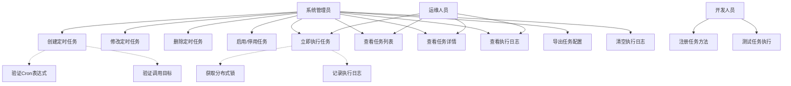
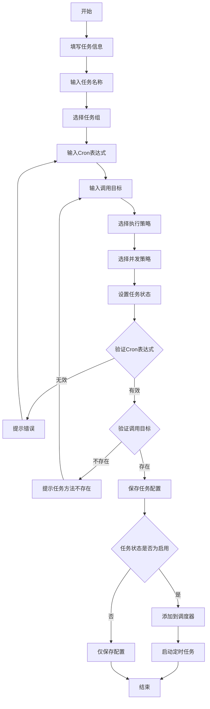
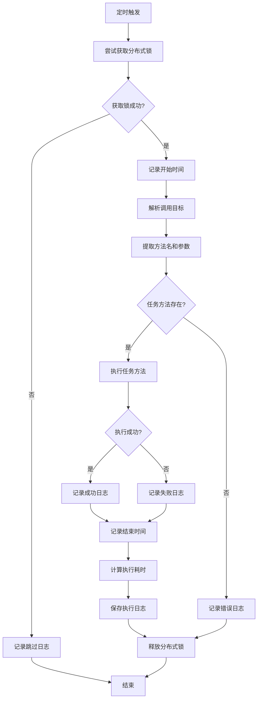
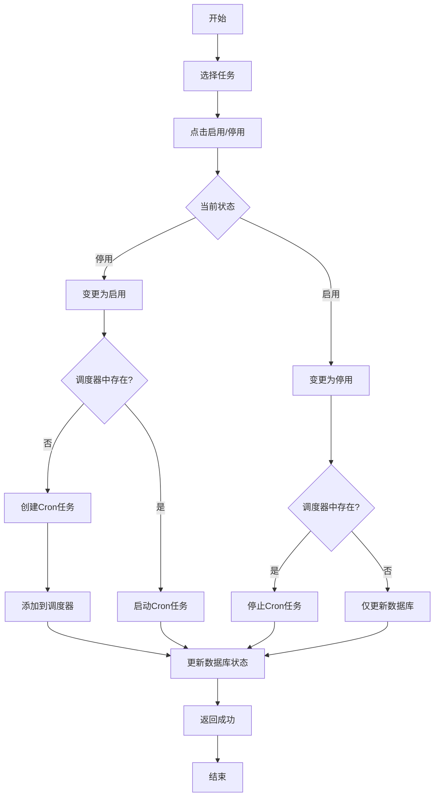
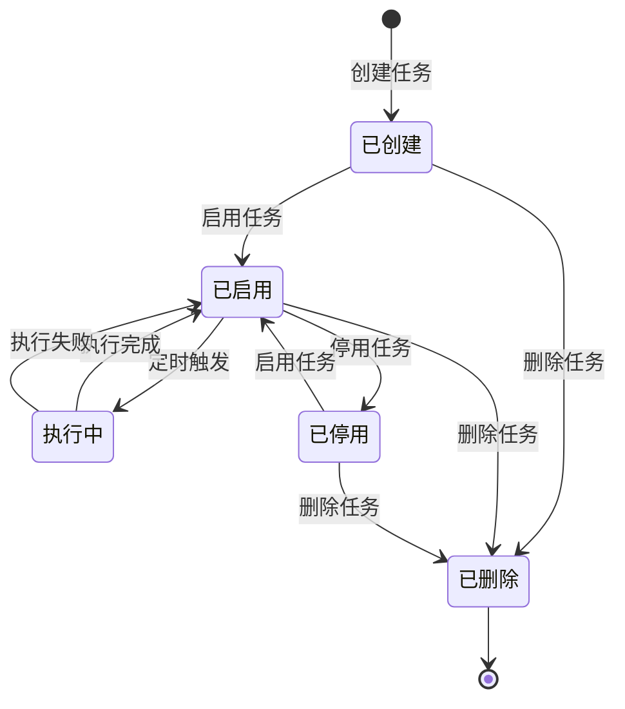

# 定时任务管理模块 - 需求文档

## 1. 概述

### 1.1 背景

定时任务管理模块是系统监控的核心组件，负责管理和调度系统中的定时任务。通过可视化界面配置和管理定时任务，支持动态启停、立即执行、日志查询等功能，为系统自动化运维提供基础支撑。

### 1.2 目标

- 提供定时任务的全生命周期管理（创建、修改、删除、启停）
- 支持标准Cron表达式配置任务执行时间
- 提供任务执行日志记录和查询功能
- 支持任务手动触发执行
- 提供任务执行状态监控和异常告警
- 支持分布式环境下的任务锁机制

### 1.3 范围

**包含功能**：

- 定时任务CRUD操作
- 任务状态管理（启用/停用）
- 任务立即执行
- 任务执行日志记录
- 任务执行日志查询
- 任务配置导出
- 任务装饰器注册机制
- 分布式锁防止重复执行

**不包含功能**：

- 任务依赖关系管理
- 任务执行结果通知（邮件/短信）
- 任务执行统计分析
- 任务执行可视化监控大屏

## 2. 角色与用例

### 2.1 角色定义

| 角色       | 说明             | 权限范围                               |
| ---------- | ---------------- | -------------------------------------- |
| 系统管理员 | 管理所有定时任务 | 创建、修改、删除、启停、执行、查看日志 |
| 运维人员   | 监控任务执行状态 | 查看任务、查看日志、手动执行           |
| 开发人员   | 注册和测试任务   | 使用@Task装饰器注册任务方法            |

### 2.2 用例图

## 3. 业务流程

### 3.1 创建定时任务流程

### 3.2 任务执行流程

### 3.3 任务状态变更流程

## 4. 状态说明

### 4.1 任务状态图

### 4.2 状态说明

| 状态   | 值  | 说明                   | 可转换状态             |
| ------ | --- | ---------------------- | ---------------------- |
| 已创建 | -   | 任务已创建但未启用     | 已启用、已删除         |
| 已启用 | 0   | 任务已启用，等待调度   | 执行中、已停用、已删除 |
| 执行中 | -   | 任务正在执行           | 已启用                 |
| 已停用 | 1   | 任务已停用，不会被调度 | 已启用、已删除         |
| 已删除 | -   | 任务已删除             | 无                     |

### 4.3 执行日志状态

| 状态 | 值  | 说明         |
| ---- | --- | ------------ |
| 成功 | 0   | 任务执行成功 |
| 失败 | 1   | 任务执行失败 |

## 5. 功能需求

### 5.1 定时任务管理

#### 5.1.1 创建定时任务

**输入**：

- 任务名称（必填，1-64字符）
- 任务组名（必填，1-64字符）
- 调用目标字符串（必填，1-500字符，格式：方法名或方法名(参数)）
- Cron表达式（必填，标准Cron格式）
- 计划执行错误策略（可选，1=立即执行/2=执行一次/3=放弃执行）
- 是否并发执行（可选，0=允许/1=禁止）
- 状态（必填，0=正常/1=暂停）
- 备注信息（可选）

**处理逻辑**：

1. 验证任务名称唯一性
2. 验证Cron表达式格式
3. 验证调用目标方法是否已注册
4. 保存任务配置到数据库
5. 如果状态为正常，添加到调度器并启动

**输出**：

- 成功：返回操作成功消息
- 失败：返回错误信息（Cron表达式无效、方法不存在等）

#### 5.1.2 修改定时任务

**输入**：

- 任务ID（必填）
- 更新字段（任务名称、任务组名、调用目标、Cron表达式、状态等）

**处理逻辑**：

1. 验证任务是否存在
2. 检查是否修改了Cron表达式、调用目标或状态
3. 如果有修改，从调度器中删除旧任务
4. 如果新状态为正常，创建新任务并添加到调度器
5. 更新数据库记录

**输出**：

- 成功：返回操作成功消息
- 失败：返回错误信息

#### 5.1.3 删除定时任务

**输入**：

- 任务ID列表（支持批量删除，逗号分隔）

**处理逻辑**：

1. 查询所有待删除的任务
2. 从调度器中删除这些任务
3. 从数据库中删除任务记录

**输出**：

- 成功：返回操作成功消息
- 失败：返回错误信息

#### 5.1.4 启用/停用任务

**输入**：

- 任务ID（必填）
- 目标状态（0=启用/1=停用）

**处理逻辑**：

1. 验证任务是否存在
2. 获取调度器中的任务实例
3. 如果启用：创建或启动Cron任务
4. 如果停用：停止Cron任务
5. 更新数据库中的任务状态

**输出**：

- 成功：返回操作成功消息
- 失败：返回错误信息

#### 5.1.5 立即执行任务

**输入**：

- 任务ID（必填）

**处理逻辑**：

1. 验证任务是否存在
2. 调用TaskService执行任务
3. 记录执行日志

**输出**：

- 成功：返回操作成功消息
- 失败：返回错误信息

### 5.2 任务查询

#### 5.2.1 查询任务列表

**输入**：

- 任务名称（可选，模糊查询）
- 任务组名（可选，精确查询）
- 状态（可选，0=正常/1=暂停）
- 分页参数（pageNum、pageSize）

**处理逻辑**：

1. 构建查询条件
2. 分页查询任务列表
3. 统计总数
4. 格式化日期字段

**输出**：

- 任务列表（rows）
- 总数（total）

#### 5.2.2 查询任务详情

**输入**：

- 任务ID（必填）

**处理逻辑**：

1. 根据ID查询任务
2. 验证任务是否存在

**输出**：

- 任务详细信息

### 5.3 执行日志管理

#### 5.3.1 查询执行日志

**输入**：

- 任务名称（可选，模糊查询）
- 任务组名（可选，精确查询）
- 状态（可选，0=成功/1=失败）
- 创建时间范围（可选）
- 分页参数（pageNum、pageSize）

**处理逻辑**：

1. 构建查询条件
2. 分页查询日志列表
3. 统计总数
4. 格式化日期字段

**输出**：

- 日志列表（rows）
- 总数（total）

#### 5.3.2 清空执行日志

**输入**：无

**处理逻辑**：

1. 删除所有执行日志记录

**输出**：

- 成功：返回操作成功消息

### 5.4 任务导出

#### 5.4.1 导出任务配置

**输入**：

- 查询条件（任务名称、任务组名、状态）

**处理逻辑**：

1. 根据条件查询任务列表
2. 生成Excel文件
3. 返回文件流

**输出**：

- Excel文件（application/vnd.openxmlformats-officedocument.spreadsheetml.sheet）

#### 5.4.2 导出执行日志

**输入**：

- 查询条件（任务名称、任务组名、状态、时间范围）

**处理逻辑**：

1. 根据条件查询日志列表
2. 生成Excel文件
3. 返回文件流

**输出**：

- Excel文件（application/vnd.openxmlformats-officedocument.spreadsheetml.sheet）

## 6. 非功能需求

### 6.1 性能要求

| 指标         | 要求         | 说明                   |
| ------------ | ------------ | ---------------------- |
| 任务列表查询 | P99 < 1000ms | 后台管理接口           |
| 任务详情查询 | P99 < 500ms  | 单条记录查询           |
| 任务创建     | P99 < 1000ms | 包含调度器操作         |
| 任务执行触发 | < 100ms      | 不包含任务方法执行时间 |
| 日志列表查询 | P99 < 1500ms | 大表查询，需要索引     |
| 并发任务数   | 支持100+     | 取决于服务器资源       |

### 6.2 可用性要求

- 系统可用性：99%
- 任务调度准确性：99.9%（允许秒级误差）
- 支持服务重启后自动恢复任务调度

### 6.3 安全要求

- 所有接口必须通过身份认证
- 所有操作必须有权限控制
- 所有操作必须记录操作日志
- 调用目标字符串必须验证，防止注入攻击
- 分布式锁防止任务重复执行

### 6.4 数据要求

- 任务配置数据必须持久化
- 执行日志必须完整记录（开始时间、结束时间、耗时、状态、异常信息）
- 执行日志需要定期归档（建议保留3个月）
- 支持日志清空功能

### 6.5 扩展性要求

- 支持动态注册任务方法（通过@Task装饰器）
- 支持分布式部署（通过Redis分布式锁）
- 支持任务参数传递（JSON格式）
- 预留任务依赖关系扩展接口

## 7. 验收标准

### 7.1 功能验收

- [ ] 可以创建定时任务，指定Cron表达式和调用目标
- [ ] 可以修改任务配置，修改后立即生效
- [ ] 可以删除任务，删除后从调度器中移除
- [ ] 可以启用/停用任务，状态变更立即生效
- [ ] 可以手动触发任务执行
- [ ] 可以查询任务列表，支持筛选和分页
- [ ] 可以查询任务详情
- [ ] 可以查询执行日志，支持筛选和分页
- [ ] 可以清空执行日志
- [ ] 可以导出任务配置为Excel
- [ ] 可以导出执行日志为Excel
- [ ] 任务按Cron表达式准时执行
- [ ] 任务执行日志完整记录
- [ ] 分布式环境下任务不重复执行

### 7.2 性能验收

- [ ] 任务列表查询响应时间 < 1秒
- [ ] 任务详情查询响应时间 < 500ms
- [ ] 任务创建响应时间 < 1秒
- [ ] 支持100个并发任务同时运行
- [ ] 日志列表查询响应时间 < 1.5秒

### 7.3 安全验收

- [ ] 所有接口需要登录认证
- [ ] 所有接口需要权限验证
- [ ] 所有操作记录操作日志
- [ ] 调用目标字符串验证有效性
- [ ] 分布式锁防止重复执行

### 7.4 异常处理验收

- [ ] Cron表达式无效时提示错误
- [ ] 调用目标方法不存在时提示错误
- [ ] 任务执行失败时记录异常信息
- [ ] 获取分布式锁失败时跳过执行
- [ ] 服务重启后自动恢复任务调度

## 8. 接口清单

### 8.1 定时任务接口

| 接口路径                  | 方法   | 说明         | 权限                     |
| ------------------------- | ------ | ------------ | ------------------------ |
| /monitor/job/list         | GET    | 查询任务列表 | monitor:job:list         |
| /monitor/job/:jobId       | GET    | 查询任务详情 | monitor:job:query        |
| /monitor/job              | POST   | 创建任务     | monitor:job:add          |
| /monitor/job/changeStatus | PUT    | 修改任务状态 | monitor:job:changeStatus |
| /monitor/job              | PUT    | 修改任务     | monitor:job:edit         |
| /monitor/job/:jobIds      | DELETE | 删除任务     | monitor:job:remove       |
| /monitor/job/run          | PUT    | 立即执行     | monitor:job:changeStatus |
| /monitor/job/export       | POST   | 导出任务     | monitor:job:export       |

### 8.2 执行日志接口

| 接口路径               | 方法   | 说明         | 权限               |
| ---------------------- | ------ | ------------ | ------------------ |
| /monitor/jobLog/list   | GET    | 查询日志列表 | monitor:job:list   |
| /monitor/jobLog/clean  | DELETE | 清空日志     | monitor:job:remove |
| /monitor/jobLog/export | POST   | 导出日志     | monitor:job:export |

## 9. 数据字典

### 9.1 任务组名

| 值      | 说明     |
| ------- | -------- |
| SYSTEM  | 系统任务 |
| DEFAULT | 默认任务 |

### 9.2 执行错误策略

| 值  | 说明     |
| --- | -------- |
| 1   | 立即执行 |
| 2   | 执行一次 |
| 3   | 放弃执行 |

### 9.3 并发策略

| 值  | 说明     |
| --- | -------- |
| 0   | 允许并发 |
| 1   | 禁止并发 |

## 10. 约束与限制

### 10.1 业务约束

- 任务名称在同一租户内必须唯一
- Cron表达式必须符合标准格式
- 调用目标方法必须通过@Task装饰器注册
- 任务执行超时时间默认30秒（通过分布式锁TTL控制）
- 执行日志保留时间建议3个月

### 10.2 技术约束

- 使用NestJS Schedule模块实现任务调度
- 使用cron库解析Cron表达式
- 使用Redis实现分布式锁
- 任务方法必须是异步方法（async/await）
- 任务参数必须是JSON可序列化的类型

### 10.3 数据约束

- 任务名称：1-64字符
- 任务组名：1-64字符
- 调用目标：1-500字符
- Cron表达式：标准格式
- 备注信息：0-500字符

## 11. 依赖关系

### 11.1 外部依赖

- NestJS Schedule模块：任务调度
- cron库：Cron表达式解析
- Redis：分布式锁
- Prisma：数据持久化

### 11.2 内部依赖

- 通知模块（NoticeService）：存储配额预警任务
- 文件版本模块（VersionService）：清理旧文件版本任务
- 备份模块（BackupService）：数据库备份任务

## 12. 术语表

| 术语       | 说明                                                      |
| ---------- | --------------------------------------------------------- |
| Cron表达式 | 用于配置定时任务执行时间的表达式，格式：秒 分 时 日 月 周 |
| 调用目标   | 任务执行时调用的方法名和参数，格式：方法名或方法名(参数)  |
| 任务装饰器 | @Task装饰器，用于注册任务方法                             |
| 分布式锁   | 基于Redis的锁机制，防止分布式环境下任务重复执行           |
| 任务组     | 任务的分类标识，如SYSTEM、DEFAULT                         |
| 执行策略   | 任务执行失败后的处理策略                                  |
| 并发策略   | 任务是否允许并发执行                                      |

---

**文档版本**: 1.0  
**编写日期**: 2026-02-23  
**编写人**: AI Assistant
