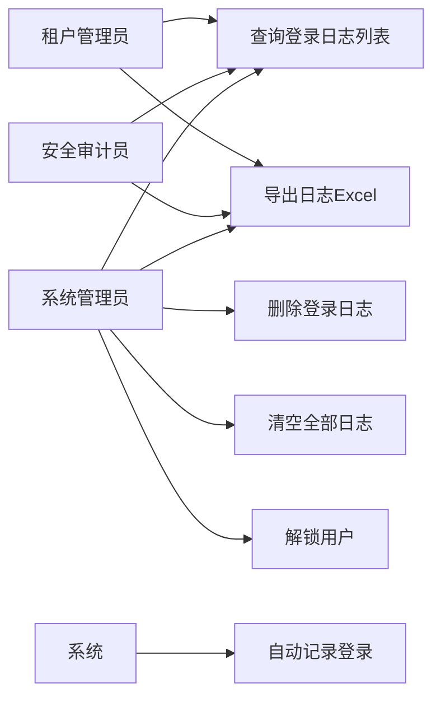
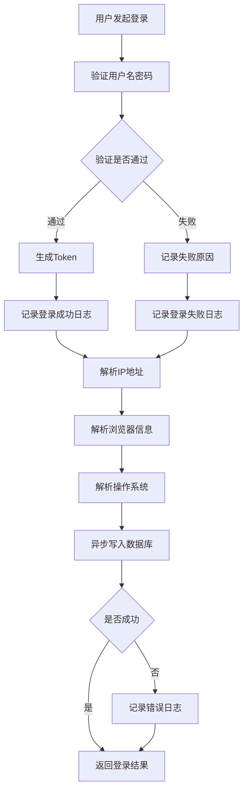
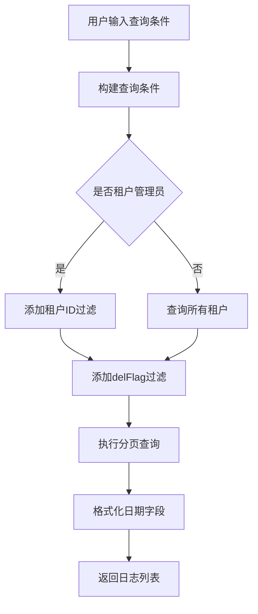
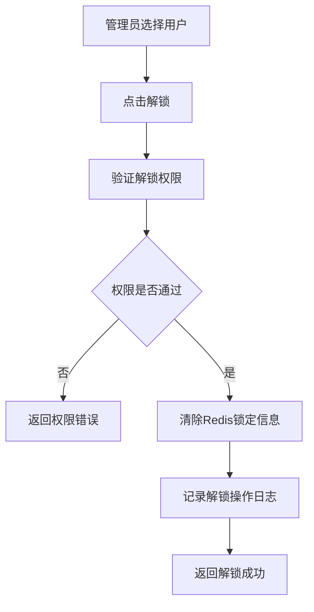
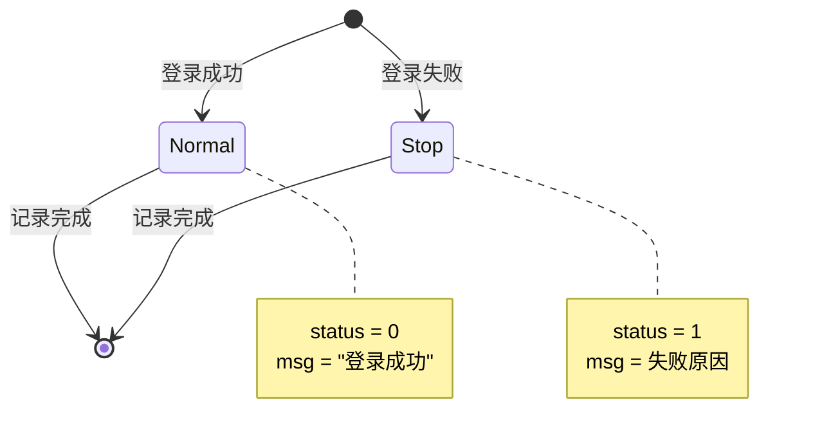
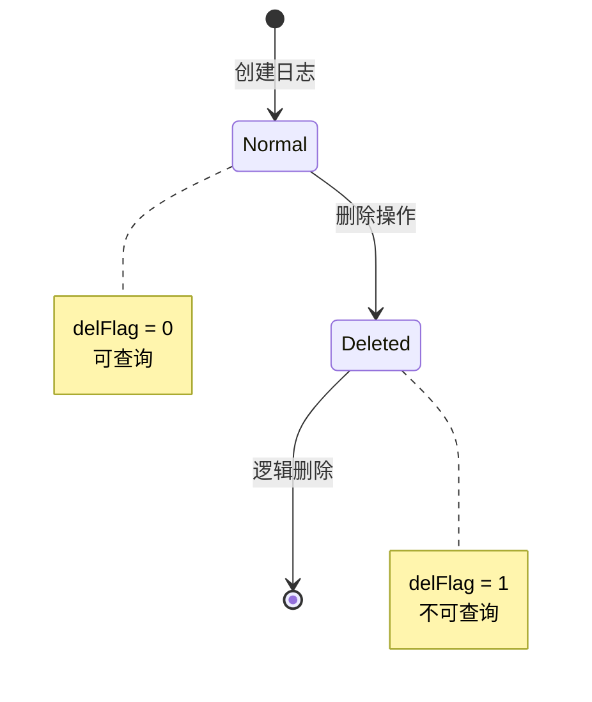

# 登录日志模块需求文档

## 1. 概述

### 1.1 背景

登录日志模块是系统安全监控的重要组成部分，用于记录所有用户的登录行为，包括成功和失败的登录尝试。通过完整的登录审计，可以及时发现异常登录行为、追踪账号安全问题、满足安全合规要求，并为安全分析提供数据支撑。

### 1.2 目标

- 自动记录所有登录行为，包括成功和失败的登录
- 记录登录相关信息：IP地址、地理位置、浏览器、操作系统等
- 提供灵活的日志查询和过滤功能
- 支持日志导出，便于安全审计
- 提供用户解锁功能，处理账号锁定问题
- 支持日志清理，控制存储成本

### 1.3 范围

本文档涵盖登录日志的记录、查询、删除、清空、导出、用户解锁等功能，不包括操作日志、在线用户监控等其他监控功能。

## 2. 角色与用例

### 2.1 角色定义

| 角色       | 说明                                         |
| ---------- | -------------------------------------------- |
| 系统管理员 | 拥有登录日志查询、导出、删除、解锁等完整权限 |
| 安全审计员 | 拥有登录日志查询和导出权限                   |
| 租户管理员 | 仅能查看本租户内的登录日志                   |

### 2.2 用例图

## 3. 业务流程

### 3.1 登录日志记录流程

### 3.2 日志查询流程

### 3.3 用户解锁流程

## 4. 状态说明

### 4.1 登录状态

登录日志的状态表示登录是否成功：

| 状态值 | 状态名称 | 说明                             |
| ------ | -------- | -------------------------------- |
| 0      | 成功     | 登录成功                         |
| 1      | 失败     | 登录失败（密码错误、账号锁定等） |

### 4.2 删除标记

| 删除标记 | 说明   |
| -------- | ------ |
| 0        | 正常   |
| 1        | 已删除 |

## 5. 功能需求

### 5.1 登录日志记录

#### 5.1.1 自动记录

- 在用户登录时自动记录，无需手动调用
- 记录以下信息：
  - 用户名（userName）
  - IP地址（ipaddr）
  - 登录地点（loginLocation）：通过IP解析
  - 浏览器类型（browser）：从User-Agent解析
  - 操作系统（os）：从User-Agent解析
  - 设备类型（deviceType）：PC/Mobile
  - 登录状态（status）：成功/失败
  - 提示消息（msg）：成功提示或失败原因
  - 登录时间（loginTime）：自动记录
  - 租户ID（tenantId）：从上下文获取

#### 5.1.2 记录规则

- 登录成功和失败都需要记录
- 异步写入数据库，不阻塞登录流程
- 记录失败不影响登录功能
- 租户ID自动从上下文获取
- 默认删除标记为正常（delFlag = 0）

### 5.2 登录日志查询

#### 5.2.1 列表查询

支持以下查询条件：

- IP地址（ipaddr）：模糊匹配
- 用户名（userName）：模糊匹配
- 登录状态（status）：精确匹配
- 登录时间范围（beginTime ~ endTime）

#### 5.2.2 排序

- 支持按任意字段排序（orderByColumn + isAsc）
- 默认按登录时间倒序

#### 5.2.3 分页

- 支持分页查询（pageNum + pageSize）
- 返回总记录数和当前页数据

#### 5.2.4 过滤规则

- 仅查询未删除的日志（delFlag = 0）
- 租户管理员仅能查看本租户日志

### 5.3 登录日志删除

#### 5.3.1 批量删除

- 支持批量删除，多个ID用逗号分隔
- 逻辑删除，设置 delFlag = 1
- 需要 `monitor:logininfor:remove` 权限
- 删除操作本身会被记录到操作日志

#### 5.3.2 清空全部

- 逻辑删除所有登录日志
- 需要 `monitor:logininfor:remove` 权限
- 高危操作，需二次确认
- 清空操作本身会被记录到操作日志

### 5.4 用户解锁

- 解锁被锁定的用户账号
- 清除Redis中的锁定信息
- 需要 `monitor:logininfor:unlock` 权限
- 解锁操作会被记录到操作日志

### 5.5 登录日志导出

- 根据查询条件导出Excel文件
- 导出字段：序号、用户账号、登录状态、登录地址、登录地点、浏览器、操作系统、提示消息、访问时间
- 登录状态使用字典翻译（0=成功，1=失败）
- 需要 `system:config:export` 权限
- 导出操作会被记录到操作日志

## 6. 数据模型

### 6.1 登录日志实体

| 字段名        | 类型     | 长度 | 必填 | 说明                    |
| ------------- | -------- | ---- | ---- | ----------------------- |
| infoId        | Int      | -    | 是   | 日志主键，自增          |
| tenantId      | String   | 20   | 是   | 租户ID，默认"000000"    |
| userName      | String   | 50   | 是   | 用户名                  |
| ipaddr        | String   | 128  | 是   | 登录IP地址              |
| loginLocation | String   | 255  | 是   | 登录地点，默认空字符串  |
| browser       | String   | 50   | 是   | 浏览器类型              |
| os            | String   | 50   | 是   | 操作系统                |
| deviceType    | String   | 1    | 是   | 设备类型，默认"0"       |
| status        | Status   | -    | 是   | 登录状态（0成功 1失败） |
| msg           | String   | 255  | 是   | 提示消息                |
| delFlag       | DelFlag  | -    | 是   | 删除标记（0正常 1删除） |
| loginTime     | DateTime | -    | 是   | 登录时间，默认当前时间  |

### 6.2 索引设计

| 索引名                 | 字段                          | 说明                   |
| ---------------------- | ----------------------------- | ---------------------- |
| idx_tenant_time        | tenantId, loginTime           | 租户+时间查询          |
| idx_user_name          | userName                      | 用户名查询             |
| idx_status             | status                        | 状态查询               |
| idx_login_time         | loginTime                     | 时间排序               |
| idx_tenant_user_time   | tenantId, userName, loginTime | 租户+用户+时间组合查询 |
| idx_tenant_status_time | tenantId, status, loginTime   | 租户+状态+时间组合查询 |
| idx_del_flag           | delFlag                       | 删除标记查询           |

## 7. 非功能需求

### 7.1 性能要求

- 登录日志记录不应阻塞登录流程，耗时 < 5ms
- 日志查询响应时间 < 1s（P95）
- 支持百万级日志数据查询
- 导出操作响应时间 < 5s（1000条以内）

### 7.2 可用性要求

- 日志记录失败不应影响登录功能
- 提供日志记录失败的降级机制
- 日志查询服务可用性 >= 99.5%

### 7.3 安全要求

- 登录日志不可篡改
- 密码等敏感信息不记录
- 日志查询需权限控制
- 租户间日志严格隔离
- 记录失败登录尝试，用于安全分析

### 7.4 存储要求

- 登录日志属于大表，需考虑归档策略
- 建议保留近6个月热数据，历史数据归档
- 支持按时间范围批量删除

## 8. 验收标准

### 8.1 功能验收

- [ ] 登录成功和失败都能自动记录
- [ ] IP地址能正确解析为地理位置
- [ ] 浏览器和操作系统信息解析正确
- [ ] 支持多维度查询和排序
- [ ] 批量删除和清空功能正常
- [ ] 用户解锁功能正常
- [ ] 导出Excel格式正确，字典翻译准确

### 8.2 性能验收

- [ ] 日志记录不阻塞登录流程
- [ ] 百万级数据查询响应时间 < 1s
- [ ] 导出1000条数据响应时间 < 5s

### 8.3 安全验收

- [ ] 租户间日志严格隔离
- [ ] 密码等敏感信息未记录
- [ ] 权限控制生效
- [ ] 日志不可篡改（仅逻辑删除）

## 9. 约束与限制

### 9.1 技术约束

- 基于NestJS框架和Prisma ORM
- 使用逻辑删除，不物理删除数据
- 日志异步写入，不保证实时性

### 9.2 业务约束

- 登录日志仅记录登录行为
- 提示消息限制255字符
- 导出数据量建议不超过1000条

### 9.3 数据约束

- 登录日志属于流水表，只允许insert
- 禁止update（除delFlag外）
- 查询必须带租户ID或时间范围

## 10. 依赖关系

### 10.1 上游依赖

- 认证模块：登录验证
- IP解析服务：获取登录地点
- User-Agent解析：获取浏览器和操作系统信息

### 10.2 下游依赖

- 操作日志模块：记录删除、清空、解锁等操作
- 用户锁定机制：解锁功能依赖Redis

## 11. 风险与问题

### 11.1 性能风险

- **风险**：登录日志表数据量快速增长，影响查询性能
- **缓解措施**：
  - 建立合理索引
  - 实施归档策略
  - 限制深分页（offset <= 5000）
  - 查询必须带时间范围

### 11.2 存储风险

- **风险**：日志数据占用大量存储空间
- **缓解措施**：
  - 定期归档历史数据
  - 使用逻辑删除，定期物理清理
  - 限制字段长度

### 11.3 安全风险

- **风险**：大量失败登录可能是暴力破解攻击
- **缓解措施**：
  - 监控失败登录次数
  - 实施账号锁定机制
  - 提供告警功能

### 11.4 可用性风险

- **风险**：日志记录失败影响登录
- **缓解措施**：
  - 异步记录，失败不影响登录
  - 提供降级机制
  - 监控日志记录成功率

## 12. 后续规划

### 12.1 短期规划

- 实现基本的日志记录和查询功能
- 完善权限控制
- 优化查询性能

### 12.2 中期规划

- 实现日志归档功能
- 支持登录统计分析
- 提供异常登录告警

### 12.3 长期规划

- 集成ELK实现日志检索
- 支持登录行为分析
- 实现智能风险识别
- 支持地理位置可视化
