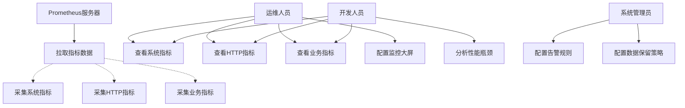
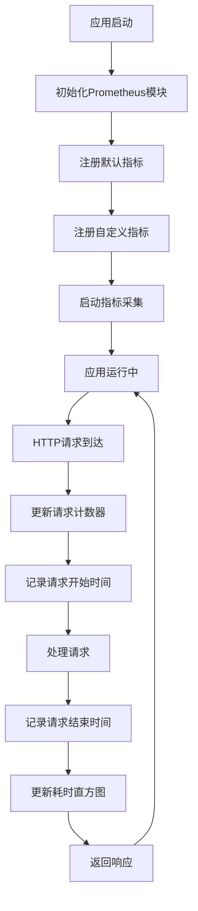
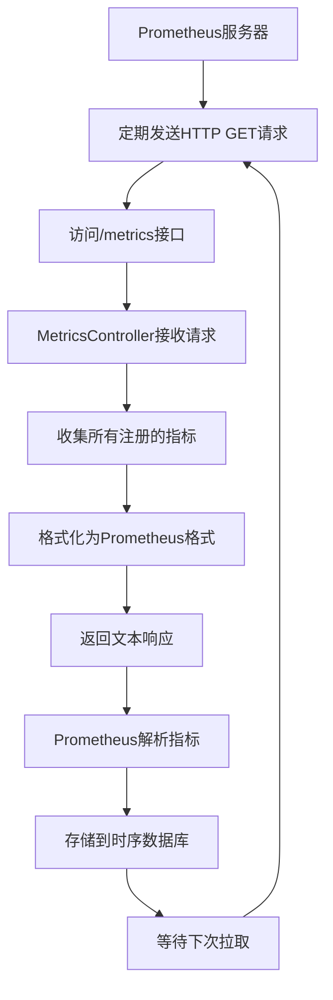
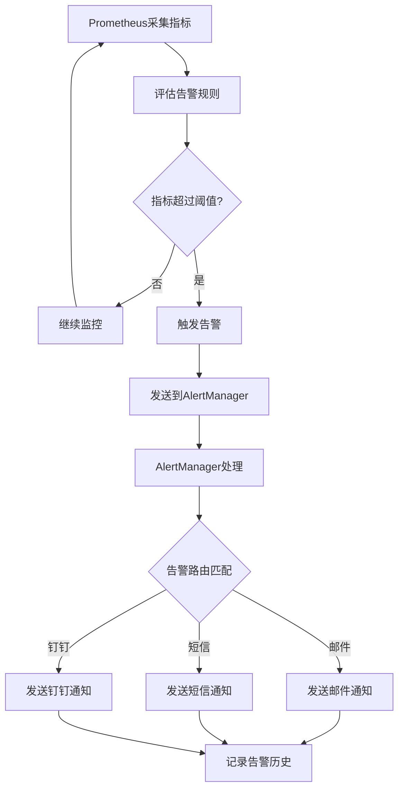

# 系统指标监控模块 - 需求文档

## 1. 概述

### 1.1 背景

系统指标监控模块基于Prometheus标准实现，提供系统运行时的各项指标数据采集和暴露能力。通过标准的Prometheus格式暴露指标，支持与Prometheus、Grafana等监控系统集成，为系统可观测性提供基础数据支撑。

### 1.2 目标

- 提供标准的Prometheus指标暴露接口
- 自动采集系统默认指标（CPU、内存、事件循环等）
- 采集HTTP请求相关指标（请求数、耗时、状态码）
- 采集业务相关指标（登录、操作日志）
- 支持与Prometheus、Grafana等监控系统集成
- 为系统性能分析和故障排查提供数据支持

### 1.3 范围

**包含功能**：

- Prometheus指标暴露接口
- 系统默认指标采集（Node.js运行时指标）
- HTTP请求计数器
- HTTP请求耗时直方图
- 用户登录计数器
- 操作日志计数器

**不包含功能**：

- 指标数据存储（由Prometheus负责）
- 指标数据可视化（由Grafana负责）
- 告警规则配置（由Prometheus AlertManager负责）
- 自定义指标管理界面

## 2. 角色与用例

### 2.1 角色定义

| 角色             | 说明             | 权限范围               |
| ---------------- | ---------------- | ---------------------- |
| Prometheus服务器 | 定期拉取指标数据 | 访问/metrics接口       |
| 运维人员         | 监控系统运行状态 | 通过Grafana查看指标    |
| 开发人员         | 分析系统性能     | 通过Grafana查看指标    |
| 系统管理员       | 配置监控告警     | 配置Prometheus告警规则 |

### 2.2 用例图



## 3. 业务流程

### 3.1 指标采集流程



### 3.2 指标暴露流程



### 3.3 监控告警流程



## 4. 状态说明

### 4.1 指标状态

指标监控模块本身无状态，所有指标数据实时采集和暴露。

### 4.2 指标类型

| 类型      | 说明             | 示例                          |
| --------- | ---------------- | ----------------------------- |
| Counter   | 计数器，只增不减 | http_requests_total           |
| Gauge     | 仪表盘，可增可减 | memory_usage_bytes            |
| Histogram | 直方图，统计分布 | http_request_duration_seconds |
| Summary   | 摘要，统计分位数 | request_size_bytes            |

## 5. 功能需求

### 5.1 指标暴露

#### 5.1.1 Prometheus指标接口

**接口**: GET /metrics

**输入**：无

**处理逻辑**：

1. 收集所有注册的指标
2. 格式化为Prometheus文本格式
3. 返回文本响应

**输出**：

- Content-Type: text/plain
- Prometheus格式的指标数据

**示例输出**：

```
# HELP nest_admin_http_requests_total Total number of HTTP requests
# TYPE nest_admin_http_requests_total counter
nest_admin_http_requests_total{method="GET",path="/api/users",status="200"} 1234

# HELP nest_admin_http_request_duration_seconds HTTP request duration in seconds
# TYPE nest_admin_http_request_duration_seconds histogram
nest_admin_http_request_duration_seconds_bucket{method="GET",path="/api/users",status="200",le="0.001"} 100
nest_admin_http_request_duration_seconds_bucket{method="GET",path="/api/users",status="200",le="0.01"} 500
nest_admin_http_request_duration_seconds_sum{method="GET",path="/api/users",status="200"} 12.34
nest_admin_http_request_duration_seconds_count{method="GET",path="/api/users",status="200"} 1234
```

### 5.2 系统默认指标

#### 5.2.1 Node.js运行时指标

**自动采集的指标**：

- process_cpu_user_seconds_total：用户态CPU时间
- process_cpu_system_seconds_total：内核态CPU时间
- process_resident_memory_bytes：常驻内存大小
- process_heap_bytes：堆内存大小
- nodejs_eventloop_lag_seconds：事件循环延迟
- nodejs_active_handles_total：活跃句柄数
- nodejs_active_requests_total：活跃请求数

**配置**：

- 指标前缀：nest*admin*
- 自动启用：enabled: true

### 5.3 HTTP请求指标

#### 5.3.1 HTTP请求计数器

**指标名称**: nest_admin_http_requests_total

**类型**: Counter

**标签**：

- method：HTTP方法（GET、POST、PUT、DELETE等）
- path：请求路径
- status：HTTP状态码

**用途**：

- 统计各接口的请求次数
- 分析接口访问频率
- 识别热点接口

#### 5.3.2 HTTP请求耗时直方图

**指标名称**: nest_admin_http_request_duration_seconds

**类型**: Histogram

**标签**：

- method：HTTP方法
- path：请求路径
- status：HTTP状态码

**桶配置**：[0.001, 0.01, 0.1, 0.5, 1, 2, 5, 10]秒

**用途**：

- 统计接口响应时间分布
- 计算P50、P95、P99等分位数
- 识别慢接口

### 5.4 业务指标

#### 5.4.1 用户登录计数器

**指标名称**: nest_admin_user_login_total

**类型**: Counter

**标签**：

- tenant_id：租户ID
- status：登录状态（success、failed）

**用途**：

- 统计登录次数
- 分析登录成功率
- 识别异常登录

#### 5.4.2 操作日志计数器

**指标名称**: nest_admin_operation_log_total

**类型**: Counter

**标签**：

- tenant_id：租户ID
- business_type：业务类型（INSERT、UPDATE、DELETE等）

**用途**：

- 统计操作次数
- 分析操作类型分布
- 识别异常操作

## 6. 非功能需求

### 6.1 性能要求

| 指标                 | 要求        | 说明                       |
| -------------------- | ----------- | -------------------------- |
| /metrics接口响应时间 | P99 < 100ms | 不影响Prometheus拉取       |
| 指标采集开销         | < 1% CPU    | 不影响业务性能             |
| 内存占用             | < 50MB      | 指标数据内存占用           |
| 并发拉取             | 支持10+     | 多个Prometheus实例同时拉取 |

### 6.2 可用性要求

- /metrics接口可用性：99.9%
- 指标采集不影响业务功能
- 指标采集失败不影响请求处理
- 支持服务重启后指标重新采集

### 6.3 安全要求

- /metrics接口不需要认证（内网访问）
- 建议通过网络策略限制访问来源
- 不暴露敏感业务数据
- 指标标签不包含用户隐私信息

### 6.4 兼容性要求

- 兼容Prometheus 2.x版本
- 兼容Grafana 7.x及以上版本
- 支持标准Prometheus文本格式
- 支持Prometheus服务发现

### 6.5 扩展性要求

- 支持动态注册自定义指标
- 支持多种指标类型（Counter、Gauge、Histogram、Summary）
- 支持自定义标签
- 预留业务指标扩展接口

## 7. 验收标准

### 7.1 功能验收

- [ ] /metrics接口可以正常访问
- [ ] 返回标准Prometheus格式数据
- [ ] 包含系统默认指标
- [ ] 包含HTTP请求计数器
- [ ] 包含HTTP请求耗时直方图
- [ ] 包含用户登录计数器
- [ ] 包含操作日志计数器
- [ ] Prometheus可以正常拉取指标
- [ ] Grafana可以正常展示指标

### 7.2 性能验收

- [ ] /metrics接口响应时间 < 100ms
- [ ] 指标采集CPU开销 < 1%
- [ ] 指标数据内存占用 < 50MB
- [ ] 支持10个并发拉取请求

### 7.3 安全验收

- [ ] /metrics接口不需要认证
- [ ] 指标数据不包含敏感信息
- [ ] 标签不包含用户隐私

### 7.4 集成验收

- [ ] Prometheus可以正常采集指标
- [ ] Grafana可以正常查询指标
- [ ] 告警规则可以正常触发

## 8. 接口清单

### 8.1 指标暴露接口

| 接口路径 | 方法 | 说明               | 认证   |
| -------- | ---- | ------------------ | ------ |
| /metrics | GET  | 暴露Prometheus指标 | 不需要 |

## 9. 数据字典

### 9.1 HTTP方法

| 值     | 说明     |
| ------ | -------- |
| GET    | 查询请求 |
| POST   | 创建请求 |
| PUT    | 更新请求 |
| DELETE | 删除请求 |
| PATCH  | 部分更新 |

### 9.2 登录状态

| 值      | 说明     |
| ------- | -------- |
| success | 登录成功 |
| failed  | 登录失败 |

### 9.3 业务类型

| 值     | 说明 |
| ------ | ---- |
| INSERT | 新增 |
| UPDATE | 修改 |
| DELETE | 删除 |
| EXPORT | 导出 |
| IMPORT | 导入 |
| GRANT  | 授权 |
| CLEAN  | 清空 |

## 10. 约束与限制

### 10.1 业务约束

- /metrics接口建议仅内网访问
- 指标标签数量建议不超过10个
- 指标名称必须符合Prometheus命名规范
- 高基数标签（如用户ID）不建议使用

### 10.2 技术约束

- 使用@willsoto/nestjs-prometheus库
- 指标数据存储在内存中
- 指标前缀统一为nest*admin*
- 直方图桶配置固定

### 10.3 性能约束

- 指标数量建议不超过1000个
- 单个指标的时间序列建议不超过10000条
- /metrics接口响应大小建议不超过10MB

## 11. 依赖关系

### 11.1 外部依赖

- @willsoto/nestjs-prometheus：Prometheus集成库
- prom-client：Prometheus客户端库
- Prometheus服务器：指标采集
- Grafana：指标可视化

### 11.2 内部依赖

- 无（独立模块）

## 12. 集成方案

### 12.1 Prometheus配置

**prometheus.yml示例**：

```yaml
scrape_configs:
  - job_name: 'nest-admin'
    scrape_interval: 15s
    static_configs:
      - targets: ['localhost:3000']
    metrics_path: '/metrics'
```

### 12.2 Grafana配置

**数据源配置**：

- 类型：Prometheus
- URL：http://prometheus:9090
- Access：Server

**常用查询**：

```promql
# 请求QPS
rate(nest_admin_http_requests_total[5m])

# P95响应时间
histogram_quantile(0.95, rate(nest_admin_http_request_duration_seconds_bucket[5m]))

# 登录成功率
rate(nest_admin_user_login_total{status="success"}[5m]) / rate(nest_admin_user_login_total[5m])
```

### 12.3 告警规则

**高错误率告警**：

```yaml
- alert: HighErrorRate
  expr: rate(nest_admin_http_requests_total{status=~"5.."}[5m]) > 0.05
  for: 5m
  labels:
    severity: warning
  annotations:
    summary: 'High error rate detected'
```

**慢接口告警**：

```yaml
- alert: SlowAPI
  expr: histogram_quantile(0.95, rate(nest_admin_http_request_duration_seconds_bucket[5m])) > 1
  for: 5m
  labels:
    severity: warning
  annotations:
    summary: 'Slow API detected'
```

## 13. 术语表

| 术语       | 说明                       |
| ---------- | -------------------------- |
| Prometheus | 开源监控系统和时序数据库   |
| Grafana    | 开源数据可视化平台         |
| Counter    | 只增不减的计数器指标       |
| Gauge      | 可增可减的仪表盘指标       |
| Histogram  | 统计分布的直方图指标       |
| Summary    | 统计分位数的摘要指标       |
| Scrape     | Prometheus拉取指标的过程   |
| Label      | 指标的标签，用于多维度查询 |
| Bucket     | 直方图的桶，用于统计分布   |
| Quantile   | 分位数，如P50、P95、P99    |

---

**文档版本**: 1.0  
**编写日期**: 2026-02-23  
**编写人**: AI Assistant
