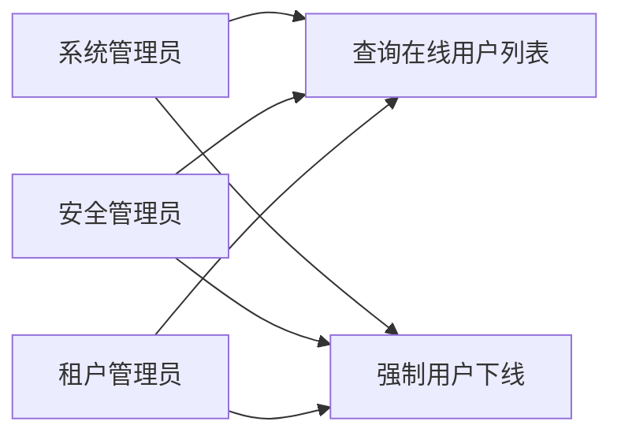
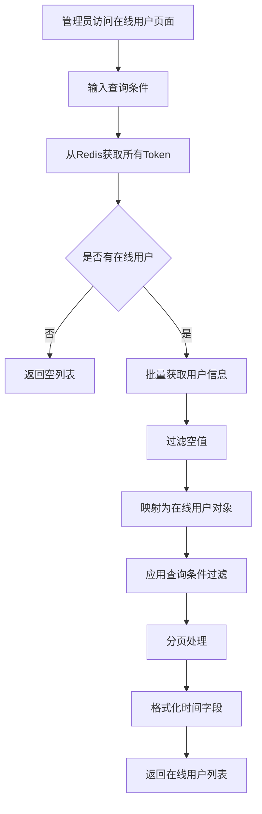
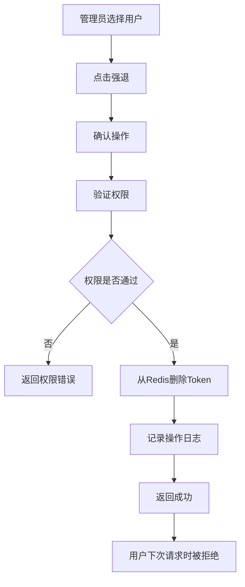
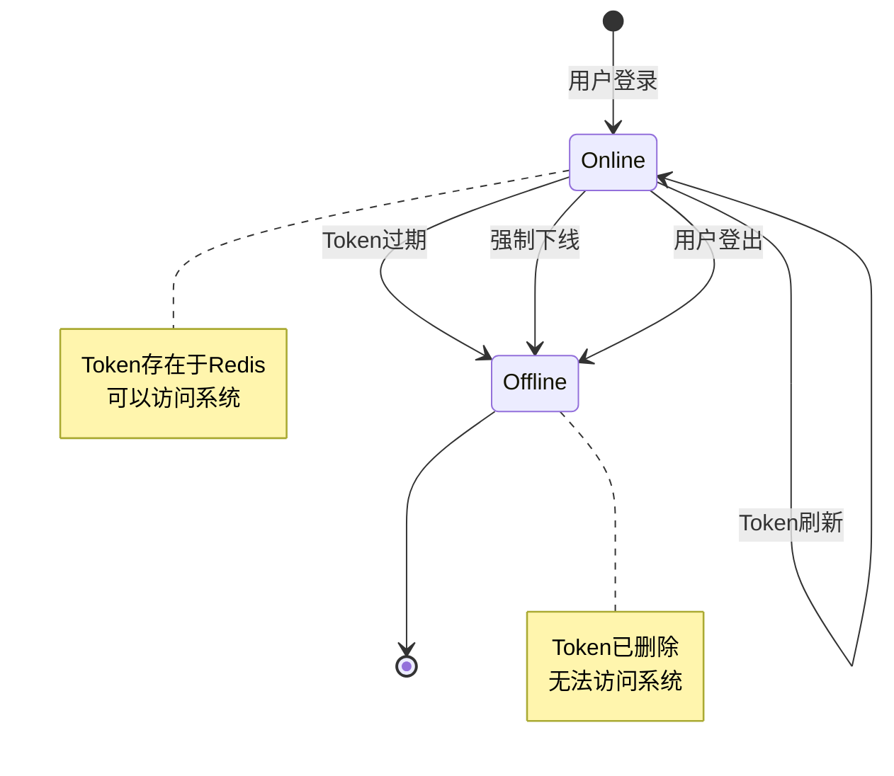

# 在线用户监控模块需求文档

## 1. 概述

### 1.1 背景

在线用户监控模块用于实时查看当前登录系统的用户信息，帮助管理员了解系统使用情况、监控异常登录行为，并提供强制用户下线的功能。通过实时监控在线用户，可以及时发现异常会话、管理系统资源、保障系统安全。

### 1.2 目标

- 实时查看当前在线用户列表
- 显示用户登录信息：IP地址、地理位置、浏览器、操作系统等
- 支持按用户名、IP地址过滤在线用户
- 提供强制用户下线功能
- 支持分页查询，处理大量在线用户

### 1.3 范围

本文档涵盖在线用户的查询、过滤、强制下线等功能，不包括登录日志、操作日志等其他监控功能。

## 2. 角色与用例

### 2.1 角色定义

| 角色       | 说明                                 |
| ---------- | ------------------------------------ |
| 系统管理员 | 拥有查看在线用户和强制下线的完整权限 |
| 安全管理员 | 拥有查看在线用户和强制下线的权限     |
| 租户管理员 | 仅能查看本租户的在线用户             |

### 2.2 用例图



## 3. 业务流程

### 3.1 查询在线用户流程



### 3.2 强制用户下线流程



## 4. 状态说明

### 4.1 在线状态

在线用户的状态由Redis中的Token决定：



## 5. 功能需求

### 5.1 在线用户查询

#### 5.1.1 列表查询

- 从Redis获取所有登录Token
- 批量获取Token对应的用户信息
- 显示以下信息：
  - 会话编号（tokenId）：Token值
  - 用户名称（userName）
  - 部门名称（deptName）
  - 登录IP地址（ipaddr）
  - 登录地点（loginLocation）
  - 浏览器类型（browser）
  - 操作系统（os）
  - 登录时间（loginTime）
  - 设备类型（deviceType）

#### 5.1.2 过滤条件

支持以下过滤条件：

- IP地址（ipaddr）：模糊匹配
- 用户名（userName）：模糊匹配

#### 5.1.3 分页

- 支持分页查询（pageNum + pageSize）
- 返回总在线用户数和当前页数据
- 内存分页（数据来自Redis）

#### 5.1.4 排序

- 默认按登录时间倒序
- 最新登录的用户排在前面

### 5.2 强制用户下线

#### 5.2.1 下线操作

- 根据Token强制用户下线
- 从Redis删除对应的Token
- 用户下次请求时会被拒绝访问
- 需要 `monitor:online:forceLogout` 权限
- 强退操作会被记录到操作日志

#### 5.2.2 下线效果

- Token立即失效
- 用户无法继续访问系统
- 用户需要重新登录

## 6. 数据模型

### 6.1 在线用户信息

在线用户信息存储在Redis中，Key格式为 `login_tokens:{token}`

| 字段名        | 类型     | 说明                     |
| ------------- | -------- | ------------------------ |
| token         | String   | 会话Token                |
| userName      | String   | 用户名                   |
| user.deptName | String   | 部门名称                 |
| ipaddr        | String   | 登录IP地址               |
| loginLocation | String   | 登录地点                 |
| browser       | String   | 浏览器类型               |
| os            | String   | 操作系统                 |
| loginTime     | DateTime | 登录时间                 |
| deviceType    | String   | 设备类型（0=PC, 1=移动） |

### 6.2 Redis存储结构

```
Key: login_tokens:{token}
Value: {
  token: string,
  userName: string,
  user: {
    deptName: string,
    ...
  },
  ipaddr: string,
  loginLocation: string,
  browser: string,
  os: string,
  loginTime: Date,
  deviceType: string
}
TTL: 根据配置设置（如7天）
```

## 7. 非功能需求

### 7.1 性能要求

- 在线用户查询响应时间 < 500ms（P95）
- 支持1000+在线用户查询
- 强制下线响应时间 < 100ms
- Redis操作不阻塞业务请求

### 7.2 可用性要求

- 在线用户查询服务可用性 >= 99.5%
- Redis故障时提供降级方案
- 强制下线失败不影响其他功能

### 7.3 安全要求

- 在线用户查询需权限控制
- 强制下线需权限控制
- 租户间在线用户严格隔离
- 强制下线操作需记录日志

### 7.4 实时性要求

- 在线用户列表实时更新
- 用户登录后立即显示
- 用户下线后立即移除
- Token过期后自动移除

## 8. 验收标准

### 8.1 功能验收

- [ ] 能正确显示所有在线用户
- [ ] 用户信息显示完整准确
- [ ] 支持按用户名和IP过滤
- [ ] 分页功能正常
- [ ] 强制下线功能正常
- [ ] 强退后用户无法访问系统

### 8.2 性能验收

- [ ] 1000+在线用户查询响应时间 < 500ms
- [ ] 强制下线响应时间 < 100ms
- [ ] Redis操作不阻塞业务

### 8.3 安全验收

- [ ] 租户间在线用户严格隔离
- [ ] 权限控制生效
- [ ] 强制下线操作已记录

## 9. 约束与限制

### 9.1 技术约束

- 基于NestJS框架
- 数据存储在Redis中
- 依赖Redis服务可用性

### 9.2 业务约束

- 在线用户数据来自Redis，不持久化
- 仅显示当前在线用户，不包含历史
- 强制下线仅删除Token，不影响用户账号

### 9.3 数据约束

- 在线用户数据不持久化
- Token过期后自动清理
- 内存分页，不支持大数据量排序

## 10. 依赖关系

### 10.1 上游依赖

- 认证模块：用户登录时写入Redis
- Redis服务：存储在线用户信息

### 10.2 下游依赖

- 操作日志模块：记录强制下线操作

## 11. 风险与问题

### 11.1 性能风险

- **风险**：在线用户数量过多，查询性能下降
- **缓解措施**：
  - 使用Redis批量操作
  - 限制单次查询数量
  - 优化过滤逻辑

### 11.2 可用性风险

- **风险**：Redis故障导致无法查询在线用户
- **缓解措施**：
  - Redis主从部署
  - 提供降级方案
  - 监控Redis可用性

### 11.3 安全风险

- **风险**：恶意强制下线正常用户
- **缓解措施**：
  - 严格权限控制
  - 记录操作日志
  - 提供操作审计

## 12. 后续规划

### 12.1 短期规划

- 实现基本的在线用户查询和强制下线功能
- 完善权限控制
- 优化查询性能

### 12.2 中期规划

- 支持更多过滤条件
- 提供在线用户统计
- 支持批量强制下线

### 12.3 长期规划

- 支持在线用户实时推送
- 提供在线用户行为分析
- 支持会话管理功能
