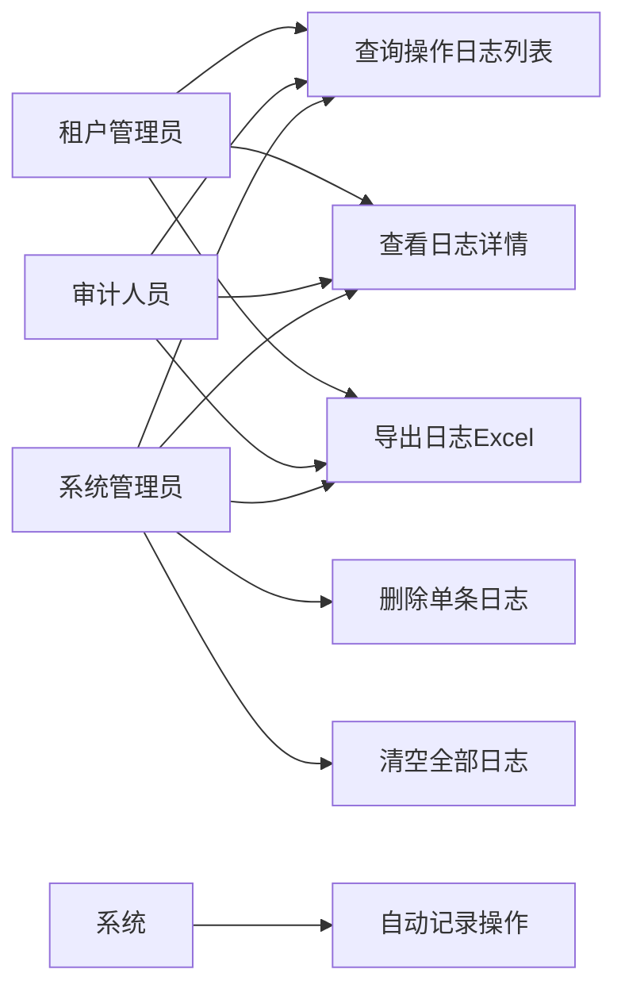
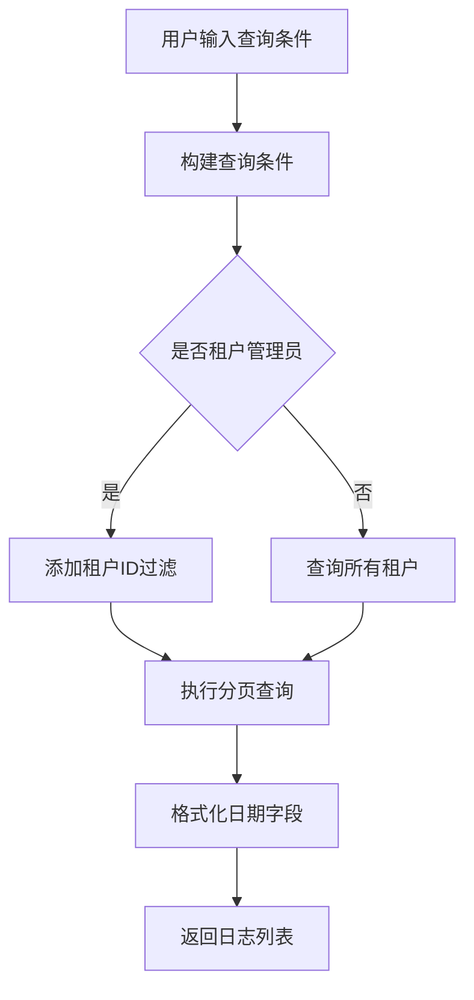
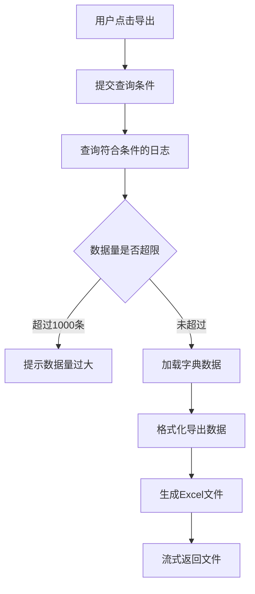
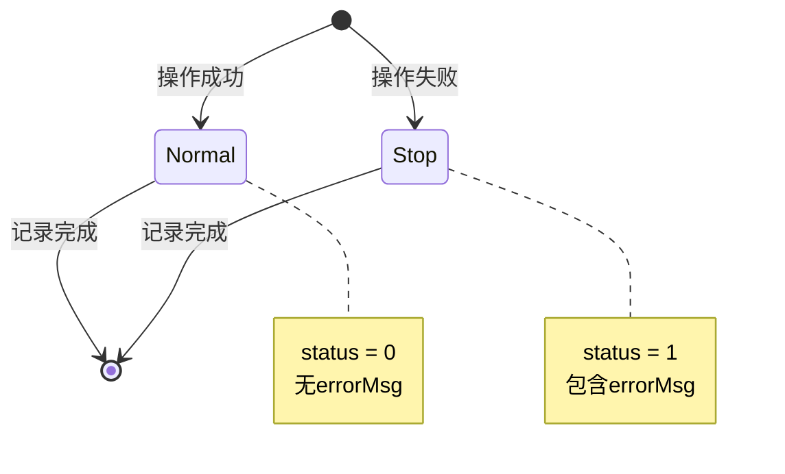

# 操作日志模块需求文档

## 1. 概述

### 1.1 背景

操作日志模块是系统监控体系的核心组成部分，用于记录管理员在后台系统中的所有操作行为。通过完整的操作审计，可以追溯系统变更历史、定位问题根源、满足合规要求，并为安全审计提供数据支撑。

### 1.2 目标

- 自动记录所有后台操作行为，包括请求参数、响应结果、执行时间等
- 提供灵活的日志查询和过滤功能，支持多维度检索
- 支持日志导出，便于离线分析和归档
- 提供日志清理功能，控制存储成本
- 确保日志记录不影响业务接口性能

### 1.3 范围

本文档涵盖操作日志的记录、查询、详情查看、删除、清空、导出等功能，不包括登录日志、在线用户监控等其他监控功能。

## 2. 角色与用例

### 2.1 角色定义

| 角色       | 说明                                   |
| ---------- | -------------------------------------- |
| 系统管理员 | 拥有操作日志查询、导出、删除等完整权限 |
| 审计人员   | 仅拥有操作日志查询和导出权限           |
| 租户管理员 | 仅能查看本租户内的操作日志             |

### 2.2 用例图



## 3. 业务流程

### 3.1 操作日志记录流程

```mermaid
graph TD
    A[用户发起请求] --> B[通过认证授权]
    B --> C[执行业务逻辑]
    C --> D{是否有@Operlog装饰器}
    D -->|是| E[记录请求开始时间]
    D -->|否| J[直接返回响应]
    E --> F[执行Controller方法]
    F --> G[记录请求结束时间]
    G --> H[计算耗时]
    H --> I[异步写入操作日志]
    I --> J

    F -->|异常| K[捕获错误信息]
    K --> L[记录错误日志]
    L --> M[返回错误响应]
```

### 3.2 日志查询流程



### 3.3 日志导出流程



## 4. 状态说明

### 4.1 操作状态

操作日志的状态表示操作是否成功执行：



| 状态值 | 状态名称 | 说明                       |
| ------ | -------- | -------------------------- |
| 0      | 正常     | 操作成功执行，无异常       |
| 1      | 异常     | 操作执行失败，包含错误信息 |

## 5. 功能需求

### 5.1 操作日志记录

#### 5.1.1 自动记录

- 通过 `@Operlog` 装饰器标记需要记录的接口
- 自动捕获以下信息：
  - 模块标题（title）
  - 业务类型（businessType）：新增、修改、删除、导出等
  - 请求方法（requestMethod）：GET、POST、PUT、DELETE
  - 操作人员（operName）：从登录态获取
  - 部门名称（deptName）：从登录态获取
  - 请求URL（operUrl）
  - 主机地址（operIp）
  - 操作地点（operLocation）：通过IP解析
  - 请求参数（operParam）：body + query
  - 返回结果（jsonResult）
  - 方法名称（method）：Controller.methodName
  - 操作时间（operTime）
  - 消耗时间（costTime）：毫秒
  - 操作状态（status）：成功/失败
  - 错误消息（errorMsg）：仅失败时记录

#### 5.1.2 记录规则

- 仅记录标记了 `@Operlog` 装饰器的接口
- 异步写入数据库，不阻塞业务请求
- 请求参数和返回结果限制在2000字符内
- 敏感信息（密码等）需脱敏处理
- 租户ID自动从上下文获取

### 5.2 操作日志查询

#### 5.2.1 列表查询

支持以下查询条件：

- 日志主键（operId）：精确匹配
- 模块标题（title）：精确匹配
- 业务类型（businessType）：精确匹配
- 请求方式（requestMethod）：精确匹配
- 操作类别（operatorType）：精确匹配
- 操作人员（operName）：模糊匹配
- 部门名称（deptName）：模糊匹配
- 请求URL（operUrl）：精确匹配
- 操作地点（operLocation）：精确匹配
- 主机地址（operIp）：精确匹配
- 操作状态（status）：精确匹配
- 操作时间范围（beginTime ~ endTime）

#### 5.2.2 排序

- 支持按任意字段排序（orderByColumn + isAsc）
- 默认按操作时间倒序

#### 5.2.3 分页

- 支持分页查询（pageNum + pageSize）
- 返回总记录数和当前页数据

### 5.3 操作日志详情

- 根据日志ID查询单条日志的完整信息
- 包含所有字段的详细内容

### 5.4 操作日志删除

#### 5.4.1 删除单条

- 根据日志ID删除指定日志
- 需要 `monitor:operlog:remove` 权限
- 删除操作本身也会被记录

#### 5.4.2 清空全部

- 删除所有操作日志
- 需要 `monitor:operlog:remove` 权限
- 高危操作，需二次确认
- 清空操作本身也会被记录

### 5.5 操作日志导出

- 根据查询条件导出Excel文件
- 导出字段：日志编号、系统模块、操作类型、操作人员、主机、操作状态、操作时间、消耗时间
- 操作类型和操作状态使用字典翻译
- 消耗时间格式化为 "XXXms"
- 需要 `monitor:operlog:export` 权限
- 导出操作本身也会被记录

## 6. 数据模型

### 6.1 操作日志实体

| 字段名        | 类型     | 长度 | 必填 | 说明                                    |
| ------------- | -------- | ---- | ---- | --------------------------------------- |
| operId        | Int      | -    | 是   | 日志主键，自增                          |
| tenantId      | String   | 20   | 是   | 租户ID，默认"000000"                    |
| title         | String   | 50   | 是   | 模块标题                                |
| businessType  | Int      | -    | 是   | 业务类型（0其它 1新增 2修改 3删除等）   |
| requestMethod | String   | 10   | 是   | 请求方式（GET/POST/PUT/DELETE）         |
| operatorType  | Int      | -    | 是   | 操作类别（0其它 1后台用户 2手机端用户） |
| operName      | String   | 50   | 是   | 操作人员                                |
| deptName      | String   | 50   | 是   | 部门名称                                |
| operUrl       | String   | 255  | 是   | 请求URL                                 |
| operLocation  | String   | 255  | 是   | 操作地点                                |
| operParam     | String   | 2000 | 是   | 请求参数（JSON字符串）                  |
| jsonResult    | String   | 2000 | 是   | 返回参数（JSON字符串）                  |
| errorMsg      | String   | 2000 | 是   | 错误消息                                |
| method        | String   | 100  | 是   | 方法名称（Controller.methodName）       |
| operIp        | String   | 255  | 是   | 主机地址                                |
| operTime      | DateTime | -    | 是   | 操作时间，默认当前时间                  |
| status        | Status   | -    | 是   | 操作状态（0正常 1异常）                 |
| costTime      | Int      | -    | 是   | 消耗时间（毫秒）                        |

### 6.2 索引设计

| 索引名                    | 字段                         | 说明                     |
| ------------------------- | ---------------------------- | ------------------------ |
| idx_tenant_time           | tenantId, operTime           | 租户+时间查询            |
| idx_oper_name             | operName                     | 操作人员查询             |
| idx_status                | status                       | 状态查询                 |
| idx_oper_time             | operTime                     | 时间排序                 |
| idx_business_type         | businessType                 | 业务类型查询             |
| idx_tenant_status_time    | tenantId, status, operTime   | 租户+状态+时间组合查询   |
| idx_tenant_oper_name_time | tenantId, operName, operTime | 租户+操作人+时间组合查询 |

## 7. 非功能需求

### 7.1 性能要求

- 日志记录不应阻塞业务请求，耗时 < 5ms
- 日志查询响应时间 < 1s（P95）
- 支持百万级日志数据查询
- 导出操作响应时间 < 5s（1000条以内）

### 7.2 可用性要求

- 日志记录失败不应影响业务功能
- 提供日志记录失败的降级机制
- 日志查询服务可用性 >= 99.5%

### 7.3 安全要求

- 操作日志不可篡改
- 敏感信息（密码、token等）需脱敏
- 日志查询需权限控制
- 租户间日志严格隔离

### 7.4 存储要求

- 操作日志属于大表，需考虑归档策略
- 建议保留近3个月热数据，历史数据归档
- 支持按时间范围批量删除

## 8. 验收标准

### 8.1 功能验收

- [ ] 标记 `@Operlog` 的接口能自动记录操作日志
- [ ] 操作成功和失败都能正确记录
- [ ] 支持多维度查询和排序
- [ ] 日志详情显示完整信息
- [ ] 删除和清空功能正常
- [ ] 导出Excel格式正确，字典翻译准确

### 8.2 性能验收

- [ ] 日志记录不阻塞业务请求
- [ ] 百万级数据查询响应时间 < 1s
- [ ] 导出1000条数据响应时间 < 5s

### 8.3 安全验收

- [ ] 租户间日志严格隔离
- [ ] 敏感信息已脱敏
- [ ] 权限控制生效
- [ ] 日志不可篡改

## 9. 约束与限制

### 9.1 技术约束

- 基于NestJS框架和Prisma ORM
- 使用装饰器模式实现日志记录
- 日志异步写入，不保证实时性

### 9.2 业务约束

- 操作日志仅记录后台管理操作
- 请求参数和返回结果限制2000字符
- 导出数据量建议不超过1000条

### 9.3 数据约束

- 操作日志属于流水表，只允许insert
- 禁止update和delete单条记录（除管理功能外）
- 查询必须带租户ID或时间范围

## 10. 依赖关系

### 10.1 上游依赖

- 认证授权模块：获取登录用户信息
- 字典模块：业务类型和操作状态翻译
- IP解析服务：获取操作地点

### 10.2 下游依赖

- 无

## 11. 风险与问题

### 11.1 性能风险

- **风险**：操作日志表数据量快速增长，影响查询性能
- **缓解措施**：
  - 建立合理索引
  - 实施归档策略
  - 限制深分页（offset <= 5000）
  - 查询必须带时间范围

### 11.2 存储风险

- **风险**：日志数据占用大量存储空间
- **缓解措施**：
  - 定期归档历史数据
  - 压缩存储
  - 限制字段长度

### 11.3 可用性风险

- **风险**：日志记录失败影响业务
- **缓解措施**：
  - 异步记录，失败不影响业务
  - 提供降级机制
  - 监控日志记录成功率

## 12. 后续规划

### 12.1 短期规划

- 实现基本的日志记录和查询功能
- 完善权限控制
- 优化查询性能

### 12.2 中期规划

- 实现日志归档功能
- 支持日志统计分析
- 提供日志告警功能

### 12.3 长期规划

- 集成ELK实现日志检索
- 支持日志可视化分析
- 实现智能异常检测
