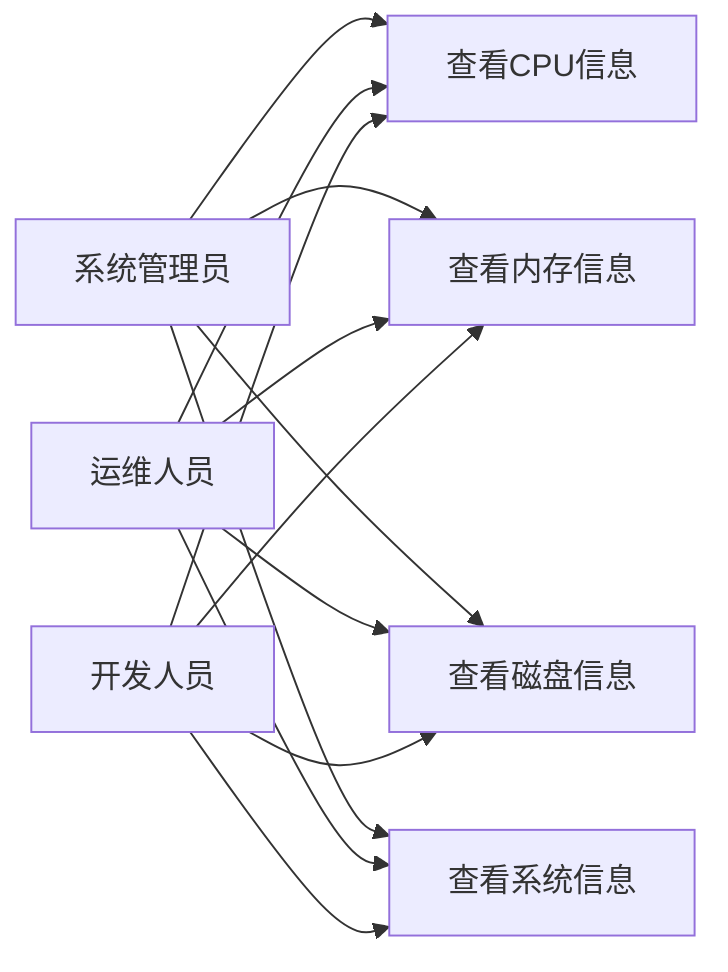
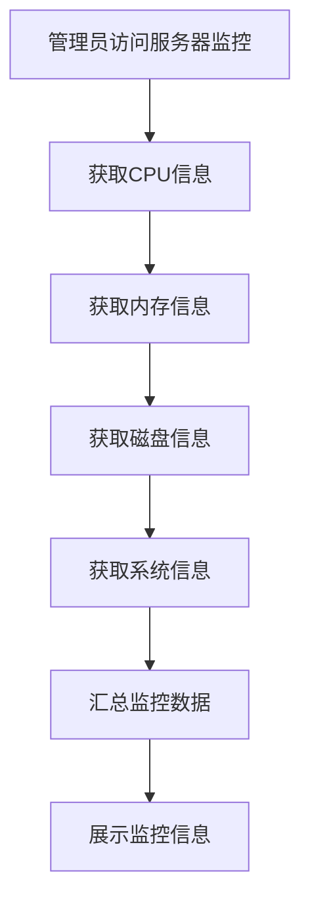
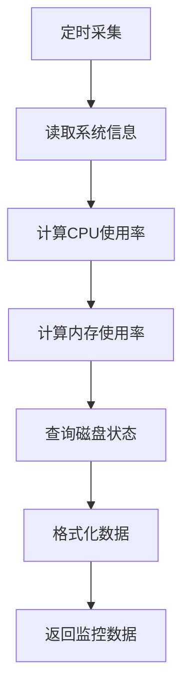
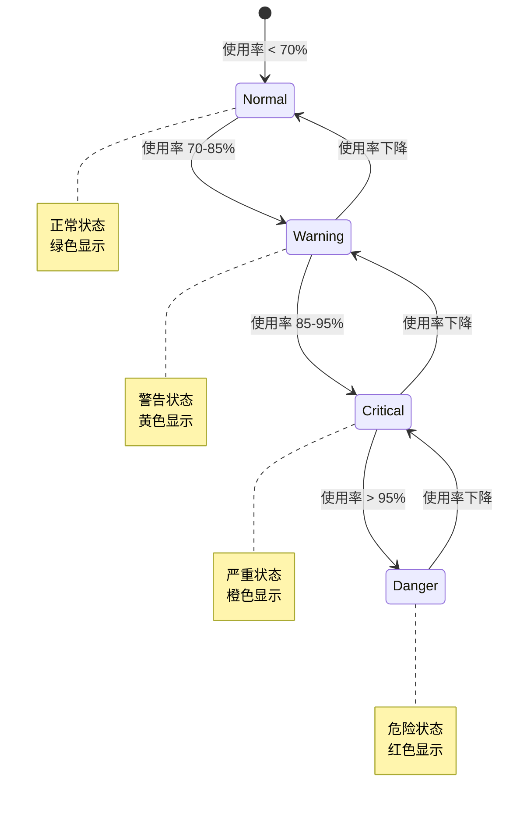

# 服务器监控模块需求文档

## 1. 概述

### 1.1 背景

服务器监控模块用于实时监控服务器的运行状态，包括CPU使用率、内存使用情况、磁盘空间、系统信息等。通过可视化的服务器监控，管理员可以及时发现性能瓶颈、预防系统故障、优化资源配置。

### 1.2 目标

- 实时监控服务器CPU使用情况
- 实时监控服务器内存使用情况
- 监控磁盘空间使用情况
- 展示系统基本信息
- 提供直观的可视化展示
- 支持跨平台监控（Windows、Linux、macOS）

### 1.3 范围

本文档涵盖服务器CPU、内存、磁盘、系统信息的监控功能，不包括网络监控、进程监控、日志监控等其他监控功能。

## 2. 角色与用例

### 2.1 角色定义

| 角色       | 说明                         |
| ---------- | ---------------------------- |
| 系统管理员 | 拥有查看服务器监控信息的权限 |
| 运维人员   | 拥有查看服务器监控信息的权限 |
| 开发人员   | 拥有查看服务器监控信息的权限 |

### 2.2 用例图



## 3. 业务流程

### 3.1 服务器监控流程



### 3.2 数据采集流程



## 4. 状态说明

### 4.1 资源使用状态

服务器资源使用状态分级：



## 5. 功能需求

### 5.1 CPU监控

#### 5.1.1 CPU信息

- CPU核心数（cpuNum）
- CPU总时间（total）
- 系统使用率（sys）：系统进程占用的CPU百分比
- 用户使用率（used）：用户进程占用的CPU百分比
- 空闲率（free）：CPU空闲百分比
- 等待率（wait）：IO等待占用的CPU百分比

#### 5.1.2 计算方式

```
总时间 = user时间 + sys时间 + idle时间
系统使用率 = (sys时间 / 总时间) * 100%
用户使用率 = (user时间 / 总时间) * 100%
空闲率 = (idle时间 / 总时间) * 100%
```

### 5.2 内存监控

#### 5.2.1 内存信息

- 总内存（total）：服务器总内存大小（GB）
- 已用内存（used）：已使用的内存大小（GB）
- 空闲内存（free）：空闲内存大小（GB）
- 使用率（usage）：内存使用百分比

#### 5.2.2 计算方式

```
已用内存 = 总内存 - 空闲内存
使用率 = (已用内存 / 总内存) * 100%
```

### 5.3 磁盘监控

#### 5.3.1 磁盘信息

每个磁盘分区显示：

- 挂载点（dirName）：磁盘挂载路径
- 文件系统类型（typeName）：如NTFS、ext4等
- 总空间（total）：磁盘总容量（GB）
- 已用空间（used）：已使用容量（GB）
- 可用空间（free）：剩余可用容量（GB）
- 使用率（usage）：磁盘使用百分比

#### 5.3.2 跨平台支持

- Windows：显示C:、D:等盘符
- Linux：显示/、/home等挂载点
- macOS：显示/、/Volumes等挂载点

### 5.4 系统信息

#### 5.4.1 基本信息

- 计算机名称（computerName）：主机名
- 计算机IP（computerIp）：服务器IP地址
- 用户目录（userDir）：项目根目录路径
- 操作系统（osName）：如win32、linux、darwin
- 系统架构（osArch）：如x64、arm64

#### 5.4.2 IP地址获取

- 获取外部可访问的IPv4地址
- 排除内部回环地址（127.0.0.1）
- 优先选择第一个外部网卡地址

## 6. 数据模型

### 6.1 服务器监控信息

```typescript
interface ServerInfo {
  cpu: CpuInfo;
  mem: MemInfo;
  sys: SysInfo;
  sysFiles: DiskInfo[];
}
```

### 6.2 CPU信息

```typescript
interface CpuInfo {
  cpuNum: number; // CPU核心数
  total: number; // 总时间
  sys: string; // 系统使用率（百分比）
  used: string; // 用户使用率（百分比）
  wait: number; // 等待率（百分比）
  free: string; // 空闲率（百分比）
}
```

### 6.3 内存信息

```typescript
interface MemInfo {
  total: string; // 总内存（GB）
  used: string; // 已用内存（GB）
  free: string; // 空闲内存（GB）
  usage: string; // 使用率（百分比）
}
```

### 6.4 磁盘信息

```typescript
interface DiskInfo {
  dirName: string; // 挂载点
  typeName: string; // 文件系统类型
  total: string; // 总空间（GB）
  used: string; // 已用空间（GB）
  free: string; // 可用空间（GB）
  usage: string; // 使用率（百分比）
}
```

### 6.5 系统信息

```typescript
interface SysInfo {
  computerName: string; // 计算机名称
  computerIp: string; // 计算机IP
  userDir: string; // 用户目录
  osName: string; // 操作系统
  osArch: string; // 系统架构
}
```

## 7. 非功能需求

### 7.1 性能要求

- 服务器信息查询响应时间 < 1s
- 支持高频查询（每5秒刷新一次）
- 数据采集不影响服务器性能

### 7.2 可用性要求

- 服务器监控服务可用性 >= 99.5%
- 数据采集失败时提供降级方案
- 跨平台兼容性

### 7.3 准确性要求

- CPU使用率误差 < 5%
- 内存使用率误差 < 1%
- 磁盘空间误差 < 1GB

### 7.4 实时性要求

- 数据实时采集，无缓存
- 每次请求获取最新数据
- 支持前端定时刷新

## 8. 验收标准

### 8.1 功能验收

- [ ] 能正确显示CPU信息
- [ ] 能正确显示内存信息
- [ ] 能正确显示磁盘信息
- [ ] 能正确显示系统信息
- [ ] 跨平台兼容（Windows、Linux、macOS）

### 8.2 性能验收

- [ ] 查询响应时间 < 1s
- [ ] 支持高频查询不影响性能
- [ ] 数据采集CPU占用 < 1%

### 8.3 准确性验收

- [ ] CPU使用率与系统监控工具对比误差 < 5%
- [ ] 内存使用率与系统监控工具对比误差 < 1%
- [ ] 磁盘空间与系统工具对比误差 < 1GB

## 9. 约束与限制

### 9.1 技术约束

- 基于NestJS框架
- 使用Node.js os模块获取系统信息
- 使用systeminformation库获取磁盘信息

### 9.2 业务约束

- 仅监控当前服务器
- 不支持远程服务器监控
- 不支持历史数据查询

### 9.3 数据约束

- 数据实时采集，不持久化
- 不支持数据导出
- 不支持告警配置

## 10. 依赖关系

### 10.1 上游依赖

- Node.js os模块：系统信息获取
- systeminformation库：磁盘信息获取

### 10.2 下游依赖

- 无

## 11. 风险与问题

### 11.1 性能风险

- **风险**：高频查询可能影响服务器性能
- **缓解措施**：
  - 限制查询频率
  - 优化数据采集逻辑
  - 监控采集性能

### 11.2 兼容性风险

- **风险**：不同操作系统API差异
- **缓解措施**：
  - 使用跨平台库
  - 针对不同平台测试
  - 提供降级方案

### 11.3 准确性风险

- **风险**：CPU使用率计算可能不准确
- **缓解措施**：
  - 使用标准计算方法
  - 与系统工具对比验证
  - 提供误差说明

## 12. 后续规划

### 12.1 短期规划

- 实现基本的服务器监控功能
- 支持主流操作系统
- 优化数据采集性能

### 12.2 中期规划

- 支持历史数据查询
- 提供数据导出功能
- 支持告警配置

### 12.3 长期规划

- 支持远程服务器监控
- 支持集群监控
- 提供性能分析报告
