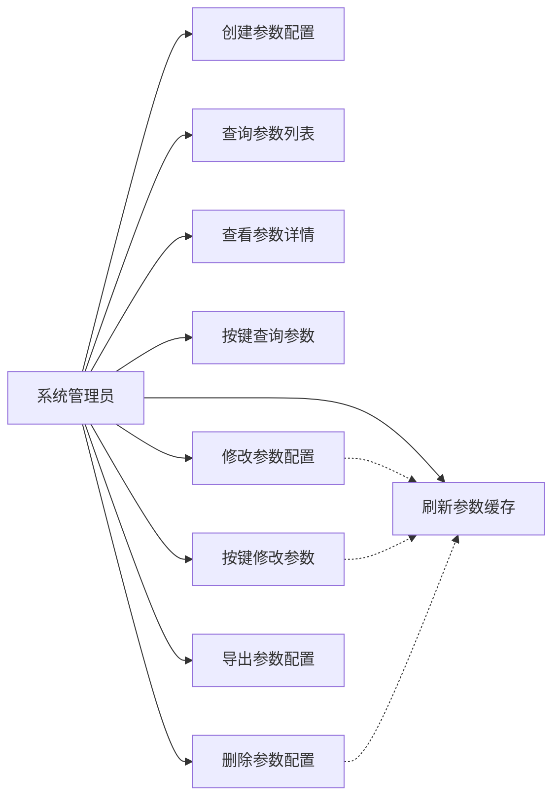
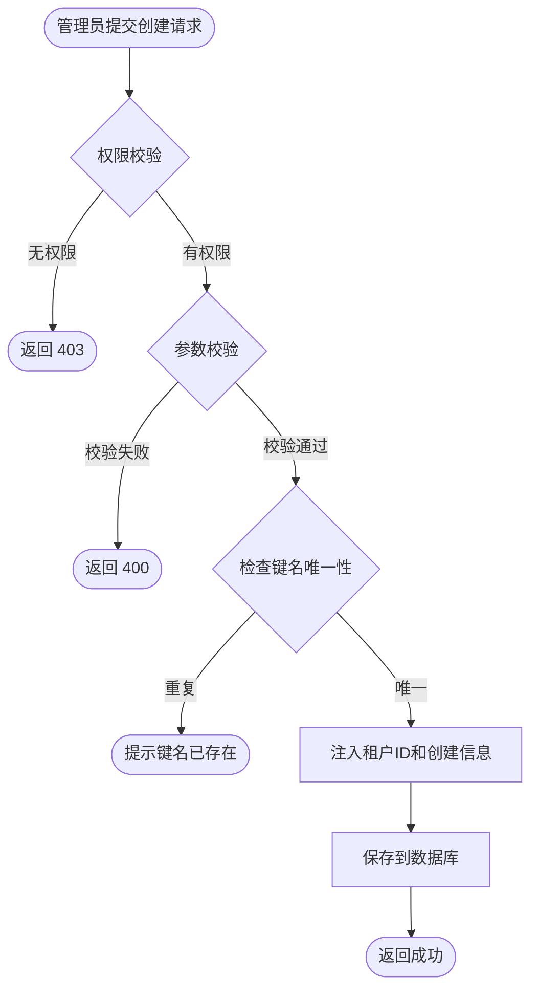
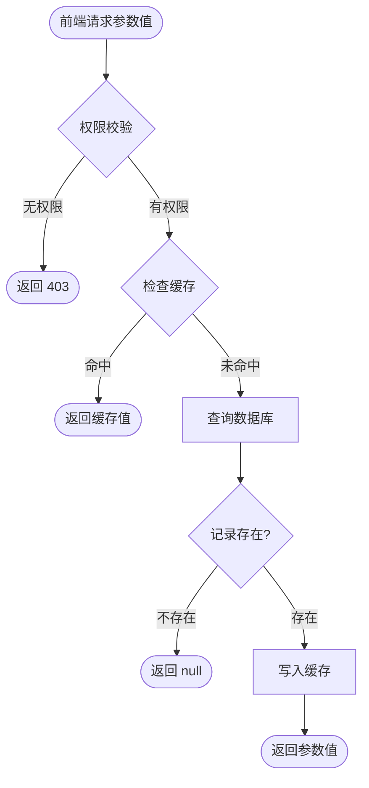
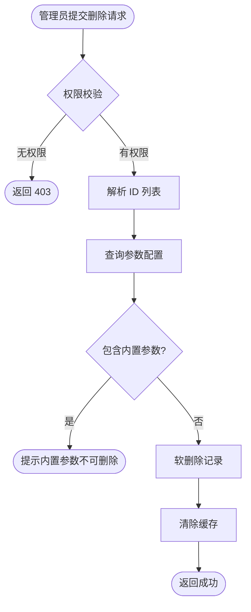
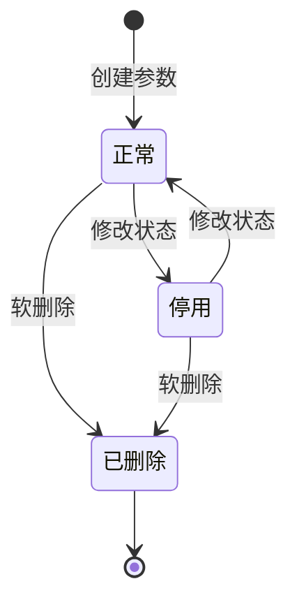

# 参数配置管理模块 — 需求文档

> 版本：1.0  
> 日期：2026-02-22  
> 状态：草案  
> 模块路径：`apps/backend/src/module/admin/system/config`

---

## 1. 概述

### 1.1 背景

系统需要提供灵活的参数配置管理能力，支持运行时动态调整系统行为，无需重启服务。参数配置分为租户级配置（sys_config）和系统级配置（sys_system_config），前者按租户隔离，后者全局共享。本文档聚焦租户级参数配置管理。

### 1.2 目标

- 提供参数配置的增删改查能力
- 支持按参数键快速查询，优先使用缓存
- 区分系统内置参数与自定义参数，内置参数不可删除
- 支持参数配置的导出与缓存刷新
- 确保租户间参数配置隔离

### 1.3 范围

- 租户级参数配置的 CRUD 操作
- 参数配置的缓存管理
- 参数配置的导出功能
- 不包含：系统级配置管理（由 system-config 模块负责）

---

## 2. 角色与用例

### 2.1 用例图



### 2.2 角色说明

| 角色       | 职责                                   |
| ---------- | -------------------------------------- |
| 系统管理员 | 管理租户内的参数配置，调整系统运行参数 |

---

## 3. 功能需求

### FR1: 创建参数配置

**描述**：管理员创建新的参数配置项。

**前置条件**：

- 用户已登录且拥有 `system:config:add` 权限
- 参数键名在当前租户内唯一

**输入**：

- configName: 参数名称（必填，最长 100 字符）
- configKey: 参数键名（必填，最长 100 字符）
- configValue: 参数键值（必填，最长 500 字符）
- configType: 系统内置标识（Y=内置，N=自定义）
- remark: 备注（可选，最长 500 字符）
- status: 状态（可选，默认正常）

**处理逻辑**：

1. 验证参数键名在当前租户内唯一性
2. 自动注入 createBy、createTime、tenantId
3. 保存到 sys_config 表
4. 返回成功响应

**输出**：操作成功提示

**异常**：

- 参数键名重复：提示「参数键名已存在」
- 权限不足：返回 403

### FR2: 查询参数列表

**描述**：分页查询参数配置列表，支持按名称、键名、类型筛选。

**前置条件**：

- 用户已登录且拥有 `system:config:list` 权限

**输入**：

- configName: 参数名称（可选，模糊匹配）
- configKey: 参数键名（可选，模糊匹配）
- configType: 系统内置标识（可选，精确匹配）
- beginTime / endTime: 创建时间范围（可选）
- pageNum / pageSize: 分页参数

**处理逻辑**：

1. 构建查询条件，仅查询当前租户且未删除的记录
2. 按创建时间倒序排列
3. 分页返回结果

**输出**：

- rows: 参数配置列表
- total: 总记录数

### FR3: 查看参数详情

**描述**：根据参数 ID 查询单条参数配置详情。

**前置条件**：

- 用户已登录且拥有 `system:config:query` 权限

**输入**：configId（参数 ID）

**处理逻辑**：

1. 根据 ID 查询参数配置
2. 验证记录属于当前租户
3. 返回详情

**输出**：参数配置完整信息

**异常**：

- 参数不存在或已删除：返回 404
- 跨租户访问：返回 404

### FR4: 按键查询参数（缓存优先）

**描述**：根据参数键名查询参数值，优先从缓存读取。

**前置条件**：

- 用户已登录且拥有 `system:config:query` 权限

**输入**：configKey（参数键名）

**处理逻辑**：

1. 尝试从 Redis 缓存读取 `sys:config:key:{configKey}`
2. 缓存命中：直接返回
3. 缓存未命中：查询数据库，写入缓存，返回结果
4. 缓存 TTL 根据系统配置决定

**输出**：参数键值（字符串）

**性能要求**：

- 缓存命中时响应时间 < 10ms
- 缓存未命中时响应时间 < 100ms

### FR5: 修改参数配置

**描述**：根据参数 ID 修改参数配置。

**前置条件**：

- 用户已登录且拥有 `system:config:edit` 权限

**输入**：

- configId: 参数 ID（必填）
- 其他字段同创建接口

**处理逻辑**：

1. 验证参数存在且属于当前租户
2. 更新参数配置
3. 清除对应缓存 `sys:config:key:{configKey}`
4. 自动更新 updateBy、updateTime

**输出**：操作成功提示

**异常**：

- 参数不存在：返回 404
- 修改内置参数的 configKey：建议阻止（当前未实现）

### FR6: 按键修改参数

**描述**：根据参数键名修改参数值，适用于前端仅知道键名的场景。

**前置条件**：

- 用户已登录且拥有 `system:config:edit` 权限

**输入**：

- configKey: 参数键名（必填）
- configValue: 新的参数值（必填）

**处理逻辑**：

1. 根据 configKey 查询参数配置
2. 验证参数存在且属于当前租户
3. 更新 configValue
4. 清除对应缓存

**输出**：操作成功提示

**异常**：

- 参数不存在：提示「参数不存在」，返回 404

### FR7: 删除参数配置

**描述**：批量软删除参数配置，支持逗号分隔的多个 ID。

**前置条件**：

- 用户已登录且拥有 `system:config:remove` 权限

**输入**：ids（逗号分隔的参数 ID 字符串）

**处理逻辑**：

1. 解析 ID 列表
2. 查询所有待删除参数的 configType
3. 检查是否包含系统内置参数（configType = 'Y'）
4. 若包含内置参数，阻止删除并提示「内置参数【{configKey}】不能删除」
5. 若全部为自定义参数，执行软删除（设置 delFlag = '1'）
6. 清除对应缓存

**输出**：删除成功的记录数

**异常**：

- 包含内置参数：提示具体参数键名，返回 400

### FR8: 导出参数配置

**描述**：导出参数配置为 Excel 文件。

**前置条件**：

- 用户已登录且拥有 `system:config:export` 权限

**输入**：查询条件（同列表查询，不含分页参数）

**处理逻辑**：

1. 根据查询条件获取所有匹配记录
2. 生成 Excel 文件，包含字段：参数主键、参数名称、参数键名、参数键值、系统内置
3. 字典映射：configType（Y=是，N=否）
4. 返回文件流

**输出**：Excel 文件（application/vnd.openxmlformats-officedocument.spreadsheetml.sheet）

### FR9: 刷新参数缓存

**描述**：清除所有参数配置缓存并重新加载。

**前置条件**：

- 用户已登录且拥有 `system:config:remove` 权限

**处理逻辑**：

1. 清除所有 `sys:config:key:*` 缓存
2. 查询当前租户所有有效参数配置
3. 逐条写入缓存
4. 返回成功提示

**输出**：操作成功提示

**使用场景**：

- 批量修改参数后统一刷新
- 缓存异常时手动修复

---

## 4. 业务流程

### 4.1 参数配置创建流程



### 4.2 参数查询流程（缓存优先）



### 4.3 参数删除流程



---

## 5. 状态说明

### 5.1 参数配置状态

参数配置本身有状态字段（status），但当前实现中未在业务逻辑中强制使用，仅作为标识。

| 状态   | 值  | 说明                       |
| ------ | --- | -------------------------- |
| 正常   | 0   | 参数可正常使用             |
| 停用   | 1   | 参数被停用，查询时可能过滤 |
| 已删除 | -   | delFlag = '1'，软删除状态  |

**状态转换**：



---

## 6. 验收标准

### AC1: 创建参数配置

- [ ] 填写完整信息后可成功创建参数
- [ ] 参数键名在当前租户内唯一，重复时提示错误
- [ ] 自动记录创建人、创建时间、租户 ID
- [ ] 无权限用户无法创建

### AC2: 查询参数列表

- [ ] 支持按参数名称、键名、类型筛选
- [ ] 支持按创建时间范围筛选
- [ ] 分页正常，仅返回当前租户的参数
- [ ] 已删除参数不显示

### AC3: 按键查询参数

- [ ] 首次查询从数据库读取并写入缓存
- [ ] 二次查询从缓存读取，响应时间 < 10ms
- [ ] 参数不存在时返回 null
- [ ] 跨租户查询返回 null

### AC4: 修改参数配置

- [ ] 修改后参数值立即生效
- [ ] 自动清除对应缓存
- [ ] 自动更新修改人、修改时间
- [ ] 跨租户修改被阻止

### AC5: 删除参数配置

- [ ] 支持批量删除（逗号分隔 ID）
- [ ] 系统内置参数（configType = 'Y'）不可删除
- [ ] 删除后记录不在列表中显示
- [ ] 删除后缓存被清除

### AC6: 导出参数配置

- [ ] 导出文件包含所有筛选后的记录
- [ ] 文件格式为 xlsx
- [ ] 字典值正确映射（Y=是，N=否）
- [ ] 无权限用户无法导出

### AC7: 刷新缓存

- [ ] 刷新后所有参数缓存被清除
- [ ] 刷新后重新加载当前租户所有有效参数
- [ ] 刷新不影响其他租户的缓存

---

## 7. 非功能需求

### 7.1 性能要求

| 接口             | SLO 类别 | P99 延迟 | 说明                 |
| ---------------- | -------- | -------- | -------------------- |
| 按键查询（缓存） | list     | < 50ms   | 缓存命中时 < 10ms    |
| 列表查询         | list     | < 500ms  | 单页 20 条           |
| 创建/修改/删除   | admin    | < 1000ms | 包含缓存清除操作     |
| 导出             | admin    | < 5000ms | 导出 1000 条以内记录 |

### 7.2 安全要求

- 所有接口需权限校验
- 租户隔离：通过 Repository 自动过滤 tenantId
- 内置参数保护：禁止删除 configType = 'Y' 的参数
- 参数值脱敏：敏感参数（如密钥）在日志中脱敏

### 7.3 可用性要求

- 缓存故障时自动降级到数据库查询
- 参数配置变更不需要重启服务

---

## 8. 数据模型

### 8.1 sys_config 表结构

| 字段         | 类型         | 说明                       |
| ------------ | ------------ | -------------------------- |
| config_id    | int          | 主键，自增                 |
| tenant_id    | varchar(20)  | 租户 ID，默认 '000000'     |
| config_name  | varchar(100) | 参数名称                   |
| config_key   | varchar(100) | 参数键名                   |
| config_value | varchar(500) | 参数键值                   |
| config_type  | char(1)      | 系统内置（Y=是，N=否）     |
| create_by    | varchar(64)  | 创建人                     |
| create_time  | timestamp    | 创建时间                   |
| update_by    | varchar(64)  | 更新人                     |
| update_time  | timestamp    | 更新时间                   |
| remark       | varchar(500) | 备注                       |
| status       | char(1)      | 状态（0=正常，1=停用）     |
| del_flag     | char(1)      | 删除标识（0=正常，1=删除） |

**索引**：

- 主键：config_id
- 唯一索引：(tenant_id, config_key)
- 普通索引：(tenant_id, status)、(tenant_id, config_type)、(tenant_id, del_flag, status)

---

## 9. 约束与限制

### 9.1 业务约束

- 参数键名在租户内唯一
- 系统内置参数不可删除
- 参数值最长 500 字符，超长需拆分或使用文件存储

### 9.2 技术约束

- 使用 SoftDeleteRepository 自动处理租户隔离和软删除
- 缓存键格式：`sys:config:key:{configKey}`
- 缓存清除使用 @CacheEvict 装饰器

---

## 10. 缺陷分析

基于当前实现代码分析，识别以下缺陷：

### D1: 创建时未校验参数键名唯一性（P0）

**现状**：create 方法直接调用 repository.create，未检查 configKey 是否已存在。

**风险**：虽然数据库有唯一索引，但会抛出数据库异常而非友好的业务提示。

**建议**：

```typescript
const exists = await this.configRepo.existsByConfigKey(createConfigDto.configKey);
BusinessException.throwIf(exists, '参数键名已存在', ResponseCode.BUSINESS_ERROR);
```

### D2: 修改时未校验参数键名唯一性（P0）

**现状**：update 方法允许修改 configKey，但未检查新键名是否与其他记录冲突。

**风险**：可能导致唯一索引冲突。

**建议**：

```typescript
if (updateConfigDto.configKey) {
  const exists = await this.configRepo.existsByConfigKey(updateConfigDto.configKey, updateConfigDto.configId);
  BusinessException.throwIf(exists, '参数键名已存在', ResponseCode.BUSINESS_ERROR);
}
```

### D3: 系统内置参数可被修改键名（P1）

**现状**：内置参数（configType = 'Y'）可通过 update 接口修改 configKey。

**风险**：可能导致系统依赖的参数键名失效。

**建议**：

```typescript
if (config.configType === 'Y' && updateConfigDto.configKey && updateConfigDto.configKey !== config.configKey) {
  throw new BusinessException(ResponseCode.BUSINESS_ERROR, '系统内置参数的键名不可修改');
}
```

### D4: 缓存刷新未清除旧键名缓存（P2）

**现状**：修改 configKey 后，仅清除新键名的缓存，旧键名缓存仍存在。

**风险**：旧键名查询可能返回过期数据。

**建议**：

```typescript
// 修改前先查询旧 configKey
const oldConfig = await this.configRepo.findById(updateConfigDto.configId);
// 修改后清除新旧两个缓存
await this.redisService.del(`${CacheEnum.SYS_CONFIG_KEY}${oldConfig.configKey}`);
await this.redisService.del(`${CacheEnum.SYS_CONFIG_KEY}${updateConfigDto.configKey}`);
```

### D5: 批量操作缺失（P2）

**现状**：仅支持单条创建和修改，无批量创建、批量修改接口。

**影响**：租户初始化或批量配置调整时效率低。

**建议**：新增 batchCreate、batchUpdate 接口，使用事务保证原子性。

---

## 11. 附录

### 11.1 相关文档

- [设计文档](../../design/admin/system/config-design.md)
- [后端开发规范](../../../../../.kiro/steering/backend-nestjs.md)

### 11.2 术语表

| 术语       | 说明                                        |
| ---------- | ------------------------------------------- |
| 参数配置   | 系统运行时可动态调整的键值对配置            |
| 租户级配置 | 按租户隔离的配置，存储在 sys_config 表      |
| 系统级配置 | 全局共享的配置，存储在 sys_system_config 表 |
| 内置参数   | configType = 'Y'，系统预置的参数，不可删除  |
| 自定义参数 | configType = 'N'，用户自行创建的参数        |

### 11.3 变更记录

| 版本 | 日期       | 变更内容 | 作者 |
| ---- | ---------- | -------- | ---- |
| 1.0  | 2026-02-22 | 初始版本 | Kiro |
