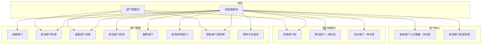
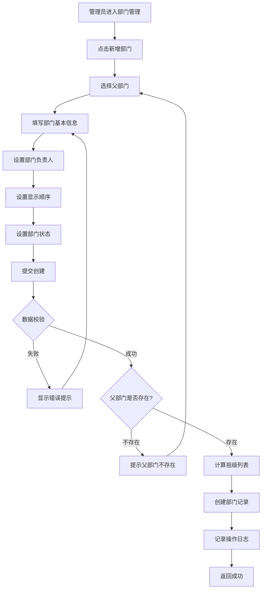
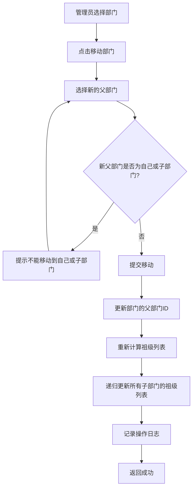
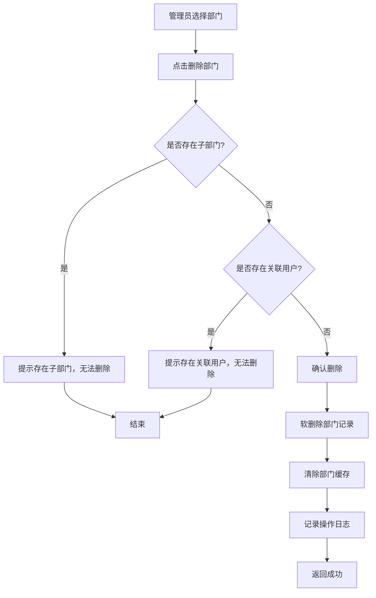
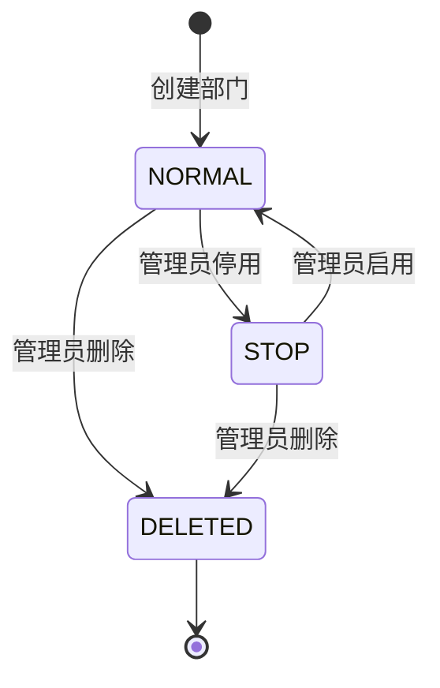

# 部门管理模块 (System Dept) — 需求文档

> 版本：1.0  
> 日期：2026-02-22  
> 状态：草案  
> 关联设计：[dept-design.md](../../../design/admin/system/dept-design.md)

---

## 1. 概述

### 1.1 背景

部门管理模块 (`module/admin/system/dept`) 是后台管理系统组织架构管理的核心模块，负责部门的全生命周期管理，包括部门的创建、查询、修改、删除、树形结构维护等功能。该模块与用户模块、角色模块紧密关联，是数据权限控制的基础。

当前实现已支持完整的部门 CRUD 操作、树形结构维护、部门选择框、排除节点查询等功能，但在以下方面存在改进空间：

1. 部门移动功能缺失，调整部门层级不便
2. 部门合并功能缺失，组织架构调整困难
3. 部门负责人变更缺少审计日志
4. 部门人员统计功能不足

### 1.2 目标

1. 完善部门管理的核心功能，提升管理效率
2. 增强部门树形结构的维护能力
3. 增强部门操作的可追溯性和安全性
4. 为后续扩展（如部门标签、部门类型）预留接口

### 1.3 范围

| 在范围内                  | 不在范围内                   |
| ------------------------- | ---------------------------- |
| 部门基本信息管理          | 部门预算管理（独立功能）     |
| 部门树形结构维护          | 部门考核管理（独立功能）     |
| 部门状态管理（启用/停用） | 部门权限审批流程（后续迭代） |
| 部门负责人管理            | 部门标签管理（后续迭代）     |
| 部门列表查询              | 部门类型管理（后续迭代）     |
| 部门选择框                | 部门人员调动（在用户模块）   |
| 排除节点查询              | 部门绩效分析（后续迭代）     |

---

## 2. 角色与用例

> 图 1：部门管理模块用例图



---

## 3. 业务流程

### 3.1 创建部门流程

> 图 2：创建部门活动图



### 3.2 移动部门流程

> 图 3：移动部门活动图



### 3.3 删除部门流程

> 图 4：删除部门活动图



---

## 4. 状态说明

### 4.1 部门状态机

> 图 5：部门状态图



**状态说明**：

- `NORMAL (0)`：正常状态，部门可以正常使用
- `STOP (1)`：停用状态，部门不能使用，但数据保留
- `DELETED (2)`：删除状态，软删除，数据标记为删除但不物理删除

---

## 5. 功能需求

### 5.1 创建部门 (POST /system/dept)

**功能描述**：管理员创建新部门，需要指定父部门。

**前置条件**：

- 用户已登录
- 拥有 `system:dept:add` 权限

**输入**：

- `parentId`: 父部门ID（必填，0表示顶级部门）
- `deptName`: 部门名称（必填，0-30 字符）
- `orderNum`: 显示顺序（必填，数字，最小0）
- `leader`: 负责人（可选）
- `phone`: 联系电话（可选，0-11 字符）
- `email`: 邮箱（可选，邮箱格式）
- `status`: 部门状态（可选，0=正常 1=停用，默认 0）
- `deptCategory`: 部门类别（可选）

**输出**：

- 成功：返回 200，无数据
- 失败：返回错误信息

**业务规则**：

1. 父部门ID为0时，创建顶级部门
2. 父部门ID不为0时，必须存在对应的父部门
3. 自动计算祖级列表（ancestors），格式为 "0,1,2"
4. 默认部门状态为正常（0）
5. 创建部门时自动设置创建人和创建时间
6. 记录操作日志
7. 清除部门缓存

**异常处理**：

- 父部门不存在：返回 500，"父级部门不存在"
- 邮箱格式错误：返回 400，"邮箱格式错误"

### 5.2 查询部门列表 (GET /system/dept/list)

**功能描述**：查询部门列表，支持按名称和状态筛选。

**前置条件**：

- 用户已登录
- 拥有 `system:dept:list` 权限

**输入**：

- `deptName`: 部门名称（可选，模糊查询）
- `status`: 部门状态（可选）

**输出**：

- 部门列表（按显示顺序升序排列）

**业务规则**：

1. 支持按部门名称模糊查询
2. 支持按状态筛选
3. 按显示顺序（orderNum）升序排列
4. 仅查询未删除的部门
5. 返回结果包含祖级列表（ancestors）

**异常处理**：

- 无权限：返回 403，"无权限访问"

### 5.3 查看部门详情 (GET /system/dept/:id)

**功能描述**：根据部门ID获取部门详细信息。

**前置条件**：

- 用户已登录
- 拥有 `system:dept:query` 权限

**输入**：

- `id`: 部门ID（路径参数）

**输出**：

- 部门详细信息

**业务规则**：

1. 查询部门基本信息
2. 使用缓存，TTL 24 小时

**异常处理**：

- 部门不存在：返回 404，"部门不存在"
- 无权限：返回 403，"无权限访问"

### 5.4 修改部门信息 (PUT /system/dept)

**功能描述**：修改部门的基本信息。

**前置条件**：

- 用户已登录
- 拥有 `system:dept:edit` 权限

**输入**：

- `deptId`: 部门ID（必填）
- 其他字段与创建部门相同（可选）

**输出**：

- 成功：返回 200，无数据
- 失败：返回错误信息

**业务规则**：

1. 修改部门基本信息
2. 如果修改了父部门，重新计算祖级列表
3. 更新部门的修改人和修改时间
4. 清除部门缓存
5. 记录操作日志

**异常处理**：

- 部门不存在：返回 404，"部门不存在"
- 无权限：返回 403，"无权限访问"
- 父部门不存在：返回 500，"父级部门不存在"

### 5.5 删除部门 (DELETE /system/dept/:id)

**功能描述**：删除部门（软删除）。

**前置条件**：

- 用户已登录
- 拥有 `system:dept:remove` 权限

**输入**：

- `id`: 部门ID（路径参数）

**输出**：

- 成功：返回 200，删除的记录数
- 失败：返回错误信息

**业务规则**：

1. 软删除，设置 `del_flag=2`
2. 删除前检查是否存在子部门
3. 删除前检查是否存在关联用户（建议）
4. 清除部门缓存
5. 记录操作日志

**异常处理**：

- 无权限：返回 403，"无权限访问"
- 存在子部门：返回 400，"该部门存在子部门，无法删除"
- 存在关联用户：返回 400，"该部门存在关联用户，无法删除"（建议）

### 5.6 获取部门选择框列表 (GET /system/dept/optionselect)

**功能描述**：获取部门选择框列表，用于其他模块选择部门。

**前置条件**：

- 用户已登录

**输入**：无

**输出**：

- 部门列表（仅包含正常状态的部门）

**业务规则**：

1. 查询所有正常状态的部门
2. 按显示顺序升序排列
3. 仅返回必要字段

**异常处理**：无

### 5.7 排除节点查询 (GET /system/dept/list/exclude/:id)

**功能描述**：查询部门列表，排除指定节点及其子节点，用于编辑时选择父部门。

**前置条件**：

- 用户已登录
- 拥有 `system:dept:query` 权限

**输入**：

- `id`: 需要排除的部门ID（路径参数）

**输出**：

- 部门列表（排除指定节点及其子节点）

**业务规则**：

1. 排除指定部门
2. 排除祖级列表中包含指定部门ID的所有部门（子部门）
3. 仅查询未删除的部门
4. 使用缓存，TTL 24 小时

**异常处理**：

- 无权限：返回 403，"无权限访问"

### 5.8 获取部门树 (内部方法)

**功能描述**：获取部门树形结构，供其他模块使用。

**前置条件**：无（内部方法）

**输入**：无

**输出**：

- 部门树形结构

**业务规则**：

1. 查询所有未删除的部门
2. 按显示顺序升序排列
3. 构建树形结构
4. 使用缓存，TTL 24 小时

**异常处理**：无

### 5.9 根据数据权限查询部门ID列表 (内部方法)

**功能描述**：根据数据权限范围和部门ID查询部门ID列表，供用户模块使用。

**前置条件**：无（内部方法）

**输入**：

- `deptId`: 部门ID
- `dataScope`: 数据权限范围（1-5）

**输出**：

- 部门ID列表

**业务规则**：

1. 仅本人数据权限（5）：返回空数组
2. 本部门数据权限（3）：返回指定部门ID
3. 本部门及下级数据权限（4）：返回指定部门及其所有子部门ID
4. 使用缓存，TTL 24 小时

**异常处理**：

- 查询失败：抛出 BusinessException

### 5.10 获取子部门ID列表 (内部方法)

**功能描述**：获取指定部门及其所有子部门的ID列表，供用户模块使用。

**前置条件**：无（内部方法）

**输入**：

- `deptId`: 部门ID

**输出**：

- 部门ID列表（包含指定部门）

**业务规则**：

1. 查询指定部门
2. 查询祖级列表中包含指定部门ID的所有部门（子部门）
3. 返回部门ID列表

**异常处理**：无

---

## 6. 验收标准

### 6.1 部门管理功能

| 编号 | 验收条件                                       | 可测试方式            |
| ---- | ---------------------------------------------- | --------------------- |
| AC-1 | 创建部门时，父部门ID为0时创建顶级部门          | 单元测试              |
| AC-2 | 创建部门时，自动计算祖级列表                   | 单元测试              |
| AC-3 | 创建部门时，父部门不存在时返回错误             | 单元测试              |
| AC-4 | 修改部门时，如果修改了父部门，重新计算祖级列表 | 单元测试              |
| AC-5 | 删除部门时，如果存在子部门，返回错误           | 单元测试              |
| AC-6 | 删除部门时，使用软删除，数据不物理删除         | 单元测试 + 数据库检查 |
| AC-7 | 删除部门后，清除部门缓存                       | 集成测试              |
| AC-8 | 修改部门后，清除部门缓存                       | 集成测试              |

### 6.2 部门树维护

| 编号  | 验收条件                                       | 可测试方式 |
| ----- | ---------------------------------------------- | ---------- |
| AC-9  | 排除节点查询时，排除指定节点及其所有子节点     | 单元测试   |
| AC-10 | 获取部门树时，按显示顺序升序排列               | 单元测试   |
| AC-11 | 获取子部门ID列表时，包含指定部门及其所有子部门 | 单元测试   |

### 6.3 数据权限支持

| 编号 | 验收条件 | 可测试方式 |
| AC-12 | 本部门数据权限时，返回指定部门ID | 单元测试 |
| AC-13 | 本部门及下级数据权限时，返回指定部门及其所有子部门ID | 单元测试 |
| AC-14 | 仅本人数据权限时，返回空数组 | 单元测试 |

---

## 7. 非功能需求

| 维度   | 要求                                                     |
| ------ | -------------------------------------------------------- |
| 性能   | 部门列表查询 P95 小于等于 300ms                          |
| 性能   | 部门详情查询 P95 小于等于 100ms                          |
| 性能   | 部门创建/修改 P95 小于等于 200ms                         |
| 可用性 | 部门管理接口可用性 99.9%                                 |
| 安全   | 敏感操作（删除、停用）需要 system:dept:\* 权限           |
| 幂等   | 删除部门接口幂等                                         |
| 可观测 | 所有部门操作记录操作日志，包含操作人、操作时间、操作内容 |
| 可观测 | 敏感操作（删除、停用）记录详细日志                       |
| 扩展性 | 支持扩展部门字段（如部门标签、部门类型）                 |
| 缓存   | 部门信息使用 Redis 缓存，TTL 24 小时                     |

---

## 8. 现有实现分析

### 8.1 已实现功能

| 功能             | 实现状态 | 代码位置                                       | 说明                             |
| ---------------- | -------- | ---------------------------------------------- | -------------------------------- |
| 创建部门         | ✅ 完整  | `dept.controller.ts` - `create()`              | 支持指定父部门，自动计算祖级列表 |
| 查询部门列表     | ✅ 完整  | `dept.controller.ts` - `findAll()`             | 支持按名称和状态筛选             |
| 查看部门详情     | ✅ 完整  | `dept.controller.ts` - `findOne()`             | 使用缓存                         |
| 修改部门信息     | ✅ 完整  | `dept.controller.ts` - `update()`              | 支持修改父部门，重新计算祖级列表 |
| 删除部门         | ✅ 完整  | `dept.controller.ts` - `remove()`              | 软删除，清除缓存                 |
| 获取部门选择框   | ✅ 完整  | `dept.controller.ts` - `optionselect()`        | 仅返回正常状态的部门             |
| 排除节点查询     | ✅ 完整  | `dept.controller.ts` - `findListExclude()`     | 用于编辑时选择父部门             |
| 获取部门树       | ✅ 完整  | `dept.service.ts` - `deptTree()`               | 使用缓存                         |
| 根据数据权限查询 | ✅ 完整  | `dept.service.ts` - `findDeptIdsByDataScope()` | 支持3种数据权限类型              |
| 获取子部门ID列表 | ✅ 完整  | `dept.service.ts` - `getChildDeptIds()`        | 供用户模块使用                   |
| 操作日志记录     | ✅ 完整  | 使用 `@Operlog` 装饰器                         | 自动记录操作日志                 |
| 缓存管理         | ✅ 完整  | 使用 `@Cacheable` 和 `@CacheEvict` 装饰器      | 自动管理缓存                     |

### 8.2 待优化功能

| 功能               | 实现状态  | 优先级 | 说明                                 |
| ------------------ | --------- | ------ | ------------------------------------ |
| 部门移动功能       | ❌ 未实现 | P1     | 调整部门层级，移动到新的父部门       |
| 部门合并功能       | ❌ 未实现 | P2     | 合并两个部门，迁移用户和子部门       |
| 部门负责人变更历史 | ❌ 未实现 | P2     | 记录部门负责人的变更历史             |
| 部门人员统计       | ❌ 未实现 | P2     | 统计部门的用户数量                   |
| 部门层级深度限制   | ❌ 未实现 | P3     | 限制部门树的最大层级深度             |
| 部门标签管理       | ❌ 未实现 | P3     | 为部门打标签，便于分类管理           |
| 部门类型管理       | ❌ 未实现 | P3     | 定义部门类型（如总部、分公司、部门） |

### 8.3 现有缺陷分析

经过仔细审查代码和项目结构，发现以下问题：

#### 8.3.1 删除部门前未检查关联用户

**问题描述**：

- 删除部门前，没有检查部门是否有关联用户
- 删除有用户的部门可能导致用户数据异常

**影响**：

- 误删除正在使用的部门
- 用户失去部门归属

**建议**：

- 删除部门前，检查部门是否有关联用户
- 如果有用户，提示"该部门存在关联用户，无法删除"
- 或者提供"强制删除"选项，同时将用户移动到其他部门

#### 8.3.2 部门移动功能缺失

**问题描述**：

- 无法直接移动部门到新的父部门
- 调整部门层级需要先删除再创建，操作繁琐

**影响**：

- 组织架构调整困难
- 操作效率低

**建议**：

- 实现部门移动功能
- 移动部门时，自动更新祖级列表
- 递归更新所有子部门的祖级列表

#### 8.3.3 祖级列表更新不完整

**问题描述**：

- 修改部门的父部门时，仅更新当前部门的祖级列表
- 没有递归更新所有子部门的祖级列表
- 可能导致子部门的祖级列表不正确

**影响**：

- 数据权限查询可能不准确
- 部门树结构可能错乱

**建议**：

- 修改部门的父部门时，递归更新所有子部门的祖级列表
- 使用事务保证数据一致性

#### 8.3.4 部门负责人变更缺少审计日志

**问题描述**：

- 修改部门负责人后，没有记录变更历史
- 无法追溯部门负责人的变更过程

**影响**：

- 出现问题时难以追溯
- 无法进行负责人变更审计

**建议**：

- 记录部门负责人变更历史（旧负责人、新负责人）
- 在部门详情页展示负责人变更历史

#### 8.3.5 部门人员统计功能不足

**问题描述**：

- 无法查询部门的用户数量
- 无法查询部门及其子部门的总用户数量

**影响**：

- 无法了解部门规模
- 组织架构分析困难

**建议**：

- 实现部门人员统计功能
- 统计部门的直接用户数量
- 统计部门及其子部门的总用户数量

---

## 9. 与市面上产品的差距

### 9.1 与主流后台管理系统对比

| 功能               | 本系统 | RuoYi-Vue-Plus | Ant Design Pro | 说明         |
| ------------------ | ------ | -------------- | -------------- | ------------ |
| 部门基本管理       | ✅     | ✅             | ✅             | 基础功能     |
| 部门树形结构       | ✅     | ✅             | ✅             | 基础功能     |
| 排除节点查询       | ✅     | ✅             | ✅             | 基础功能     |
| 部门移动功能       | ❌     | ✅             | ✅             | 本系统未实现 |
| 部门合并功能       | ❌     | ✅             | ❌             | 本系统未实现 |
| 部门负责人变更历史 | ❌     | ✅             | ❌             | 本系统未实现 |
| 部门人员统计       | ❌     | ✅             | ✅             | 本系统未实现 |
| 部门层级深度限制   | ❌     | ✅             | ❌             | 本系统未实现 |
| 部门标签管理       | ❌     | ❌             | ✅             | 本系统未实现 |
| 部门类型管理       | ❌     | ✅             | ❌             | 本系统未实现 |
| 部门缓存管理       | ✅     | ✅             | ✅             | 基础功能     |

### 9.2 差距总结

1. **基础功能完善度**：本系统已实现核心的部门管理功能，但缺少部门移动、部门合并等提升效率的功能
2. **可追溯性**：缺少部门负责人变更历史等审计功能
3. **数据分析**：缺少部门人员统计等便于管理的功能
4. **高级功能**：缺少部门标签、部门类型等高级功能

---

## 10. 改进建议与待办事项

### 10.1 短期改进（1-2 个迭代）

| 优先级 | 功能               | 工作量 | 说明                         |
| ------ | ------------------ | ------ | ---------------------------- |
| P0     | 删除前检查关联用户 | 1 天   | 检查部门是否有关联用户       |
| P0     | 修复祖级列表更新   | 2 天   | 递归更新所有子部门的祖级列表 |
| P1     | 实现部门移动功能   | 3 天   | 移动部门到新的父部门         |
| P2     | 实现部门人员统计   | 2 天   | 统计部门的用户数量           |

### 10.2 中期改进（3-6 个月）

| 优先级 | 功能               | 工作量 | 说明                           |
| ------ | ------------------ | ------ | ------------------------------ |
| P2     | 实现负责人变更历史 | 2 天   | 记录部门负责人的变更历史       |
| P2     | 实现部门合并功能   | 5 天   | 合并两个部门，迁移用户和子部门 |
| P3     | 实现层级深度限制   | 1 天   | 限制部门树的最大层级深度       |

### 10.3 长期规划（6 个月以上）

| 优先级 | 功能             | 工作量 | 说明                                 |
| ------ | ---------------- | ------ | ------------------------------------ |
| P3     | 实现部门标签管理 | 3 天   | 为部门打标签，便于分类管理           |
| P3     | 实现部门类型管理 | 3 天   | 定义部门类型（如总部、分公司、部门） |
| P3     | 实现部门权限审批 | 7 天   | 部门创建、修改需要审批               |

### 10.4 技术债务

| 问题                       | 影响       | 建议                       |
| -------------------------- | ---------- | -------------------------- |
| 删除前未检查关联用户       | 安全风险   | 立即修复，防止误删除       |
| 祖级列表更新不完整         | 数据一致性 | 立即修复，确保数据一致性   |
| 部门移动功能缺失           | 用户体验   | 补充实现，提升管理效率     |
| 部门负责人变更缺少审计日志 | 可追溯性   | 补充实现，提升系统可追溯性 |

---

## 11. 附录

### 11.1 相关文档

- [部门管理模块设计文档](../../../design/admin/system/dept-design.md)
- [用户管理模块需求文档](./user-requirements.md)
- [角色管理模块需求文档](./role-requirements.md)
- [后端开发规范](../../../../../.kiro/steering/backend-nestjs.md)

### 11.2 参考资料

- [组织架构管理最佳实践](https://www.owasp.org/index.php/Access_Control_Cheat_Sheet)
- [RuoYi-Vue-Plus 部门管理](https://gitee.com/dromara/RuoYi-Vue-Plus)

### 11.3 术语表

| 术语     | 说明                                   |
| -------- | -------------------------------------- |
| 部门     | 组织架构的基本单位                     |
| 父部门   | 上级部门                               |
| 子部门   | 下级部门                               |
| 祖级列表 | 从根部门到当前部门的所有父部门ID列表   |
| 顶级部门 | 没有父部门的部门，parentId=0           |
| 部门树   | 部门的树形结构                         |
| 排除节点 | 查询部门列表时，排除指定节点及其子节点 |
| 软删除   | 标记为删除但不物理删除数据             |
| 部门移动 | 将部门移动到新的父部门下               |
| 部门合并 | 将两个部门合并为一个部门               |
| 显示顺序 | 部门在列表中的排序位置                 |

### 11.4 祖级列表计算规则

**祖级列表（ancestors）** 是从根部门到当前部门的所有父部门ID列表，用逗号分隔。

**计算规则**：

1. 顶级部门（parentId=0）：ancestors = "0"
2. 二级部门（parentId=1）：ancestors = "0,1"
3. 三级部门（parentId=2，父部门ancestors="0,1"）：ancestors = "0,1,2"

**示例**：

```
部门结构：
- 总公司 (deptId=1, parentId=0, ancestors="0")
  - 技术部 (deptId=2, parentId=1, ancestors="0,1")
    - 前端组 (deptId=3, parentId=2, ancestors="0,1,2")
    - 后端组 (deptId=4, parentId=2, ancestors="0,1,2")
  - 市场部 (deptId=5, parentId=1, ancestors="0,1")
```

**查询子部门**：

- 查询技术部（deptId=2）的所有子部门：
  - 条件：`ancestors LIKE '%,2,%' OR ancestors LIKE '2,%' OR ancestors LIKE '%,2'`
  - 结果：前端组（deptId=3）、后端组（deptId=4）

---

**文档结束**
