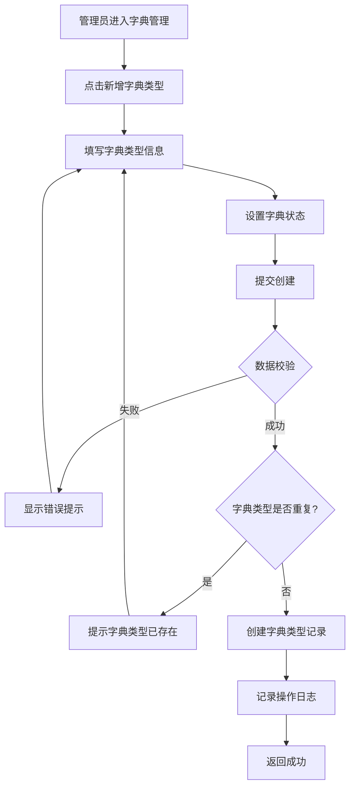
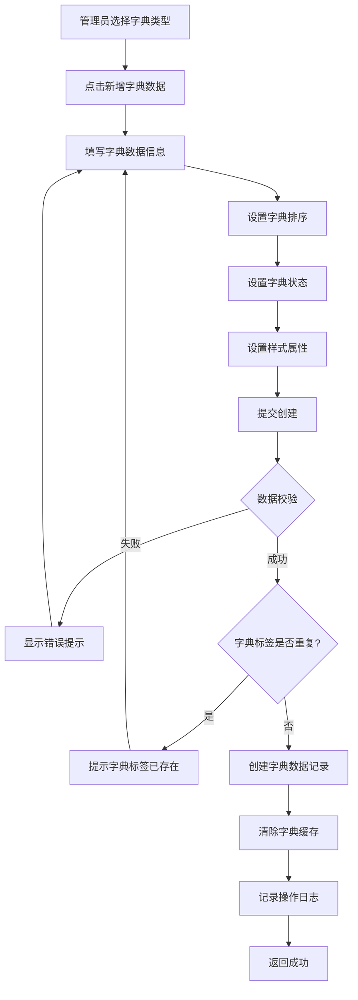
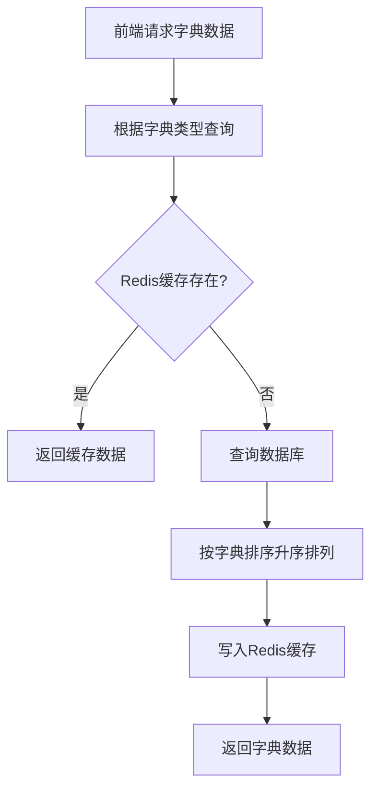
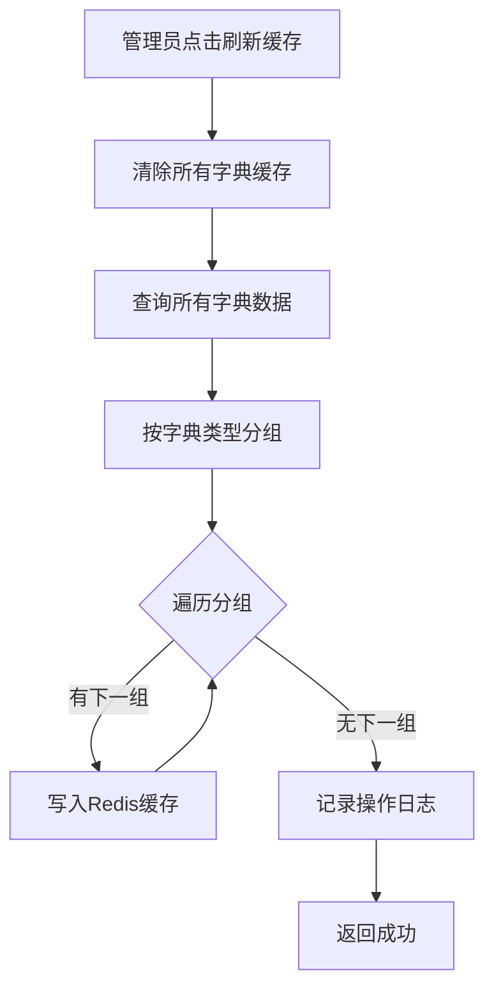
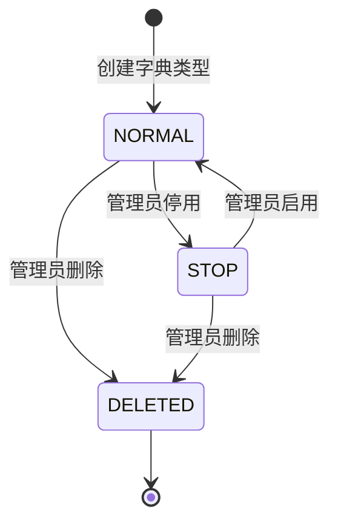
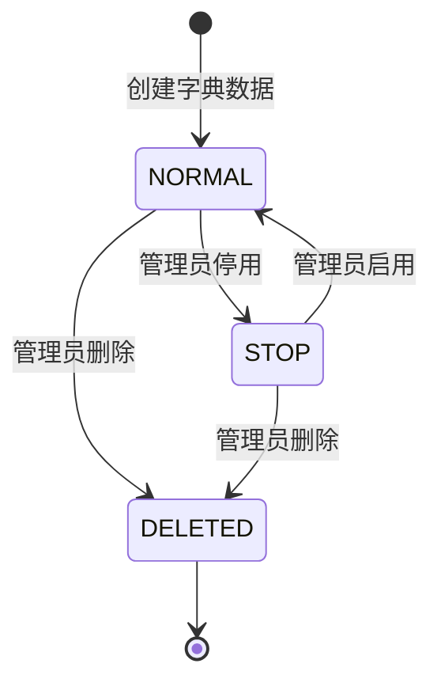

# 字典管理模块 (System Dict) — 需求文档

> 版本：1.0  
> 日期：2026-02-22  
> 状态：草案  
> 关联设计：[dict-design.md](../../../design/admin/system/dict-design.md)

---

## 1. 概述

### 1.1 背景

字典管理模块 (`module/admin/system/dict`) 是后台管理系统的基础数据管理模块，负责系统字典的全生命周期管理。字典管理分为字典类型和字典数据两个层级，字典类型定义字典的分类，字典数据定义具体的字典项。该模块为系统提供统一的数据字典服务，支持下拉框、单选框、复选框等前端组件的数据源。

当前实现已支持完整的字典类型和字典数据的 CRUD 操作、字典缓存管理、字典数据导出等功能，但在以下方面存在改进空间：

1. 删除字典类型前未检查是否有字典数据关联
2. 字典类型和字典数据的唯一性校验缺失
3. 字典数据的排序调整不够便捷
4. 缺少字典使用情况统计

### 1.2 目标

1. 完善字典管理的核心功能，提升管理效率
2. 增强字典数据的缓存管理，提高查询性能
3. 优化字典数据的查询和筛选功能
4. 为后续扩展（如字典国际化、字典版本管理）预留接口

### 1.3 范围

| 在范围内                   | 不在范围内               |
| -------------------------- | ------------------------ |
| 字典类型基本信息管理       | 字典国际化（后续迭代）   |
| 字典数据基本信息管理       | 字典版本管理（后续迭代） |
| 字典状态管理（启用/停用）  | 字典审批流程（后续迭代） |
| 字典缓存管理               | 字典权限控制（后续迭代） |
| 字典列表查询和导出         | 字典使用统计（后续迭代） |
| 字典数据按类型查询（缓存） | 字典变更历史（后续迭代） |

---

## 2. 角色与用例

> 图 1：字典管理模块用例图

```mermaid
graph TB
    subgraph 角色
        ADMIN[系统管理员]
        DEV[开发人员]
    end

    subgraph 字典类型管理
        UC1[创建字典类型]
        UC2[查询字典类型列表]
        UC3[查看字典类型详情]
        UC4[修改字典类型信息]
        UC5[删除字典类型]
        UC6[获取字典类型下拉选项]
        UC7[导出字典类型数据]
    end

    subgraph 字典数据管理
        UC8[创建字典数据]
        UC9[查询字典数据列表]
        UC10[查看字典数据详情]
        UC11[修改字典数据信息]
        UC12[删除字典数据]
        UC13[按类型查询字典数据]
        UC14[导出字典数据]
    end

    subgraph 字典缓存管理
        UC15[刷新字典缓存]
        UC16[清除字典缓存]
        UC17[加载字典缓存]
    end

    ADMIN --> UC1
    ADMIN --> UC2
    ADMIN --> UC3
    ADMIN --> UC4
    ADMIN --> UC5
    ADMIN --> UC6
    ADMIN --> UC7
    ADMIN --> UC8
    ADMIN --> UC9
    ADMIN --> UC10
    ADMIN --> UC11
    ADMIN --> UC12
    ADMIN --> UC13
    ADMIN --> UC14
    ADMIN --> UC15
    ADMIN --> UC16
    ADMIN --> UC17

    DEV --> UC2
    DEV --> UC6
    DEV --> UC9
    DEV --> UC13
```

---

## 3. 业务流程

### 3.1 创建字典类型流程

> 图 2：创建字典类型活动图

### 3.2 创建字典数据流程

> 图 3：创建字典数据活动图

### 3.3 查询字典数据流程（缓存）

> 图 4：查询字典数据活动图

### 3.4 刷新字典缓存流程

> 图 5：刷新字典缓存活动图

---

## 4. 状态说明

### 4.1 字典类型状态机

> 图 6：字典类型状态图

**状态说明**：

- `NORMAL (0)`：正常状态，字典类型可以正常使用
- `STOP (1)`：停用状态，字典类型不可用，但数据保留
- `DELETED (2)`：删除状态，软删除，数据标记为删除但不物理删除

### 4.2 字典数据状态机

> 图 7：字典数据状态图

**状态说明**：

- `NORMAL (0)`：正常状态，字典数据可以正常使用
- `STOP (1)`：停用状态，字典数据不可用，但数据保留
- `DELETED (2)`：删除状态，软删除，数据标记为删除但不物理删除

---

## 5. 功能需求

### 5.1 创建字典类型 (POST /system/dict/type)

**功能描述**：管理员创建新字典类型。

**前置条件**：

- 用户已登录
- 拥有 `system:dict:add` 权限

**输入**：

- `dictName`: 字典名称（必填，0-100 字符）
- `dictType`: 字典类型（必填，0-100 字符）
- `status`: 字典状态（可选，0=正常 1=停用）
- `remark`: 备注（可选，0-500 字符）

**输出**：

- 成功：返回 200，无数据
- 失败：返回错误信息

**业务规则**：

1. 字典类型在同一租户下必须唯一
2. 默认字典状态为正常（0）
3. 创建字典类型时自动设置创建人和创建时间
4. 记录操作日志

**异常处理**：

- 字典类型已存在：返回 400，"字典类型已存在"

### 5.2 查询字典类型列表 (GET /system/dict/type/list)

**功能描述**：分页查询字典类型列表，支持多条件筛选。

**前置条件**：

- 用户已登录
- 拥有 `system:dict:list` 权限

**输入**：

- `pageNum`: 页码（可选，默认 1）
- `pageSize`: 每页数量（可选，默认 10）
- `dictName`: 字典名称（可选，模糊查询）
- `dictType`: 字典类型（可选，模糊查询）
- `status`: 字典状态（可选）
- `params.beginTime`: 开始时间（可选）
- `params.endTime`: 结束时间（可选）

**输出**：

- `rows`: 字典类型列表
- `total`: 总记录数

**业务规则**：

1. 支持按字典名称模糊查询
2. 支持按字典类型模糊查询
3. 支持按状态筛选
4. 支持按创建时间范围筛选
5. 按创建时间降序排列
6. 仅查询未删除的字典类型

**异常处理**：

- 无权限：返回 403，"无权限访问"

### 5.3 查看字典类型详情 (GET /system/dict/type/:id)

**功能描述**：根据字典类型ID获取详细信息。

**前置条件**：

- 用户已登录
- 拥有 `system:dict:query` 权限

**输入**：

- `id`: 字典类型ID（路径参数）

**输出**：

- 字典类型详细信息

**业务规则**：

1. 查询字典类型基本信息
2. 返回完整的字典类型字段

**异常处理**：

- 字典类型不存在：返回 404，"字典类型不存在"
- 无权限：返回 403，"无权限访问"

### 5.4 修改字典类型信息 (PUT /system/dict/type)

**功能描述**：修改字典类型的基本信息。

**前置条件**：

- 用户已登录
- 拥有 `system:dict:edit` 权限

**输入**：

- `dictId`: 字典类型ID（必填）
- 其他字段与创建字典类型相同（可选）

**输出**：

- 成功：返回 200，无数据
- 失败：返回错误信息

**业务规则**：

1. 修改字典类型基本信息
2. 更新字典类型的修改人和修改时间
3. 清除字典缓存（如果修改了字典类型标识）
4. 记录操作日志

**异常处理**：

- 字典类型不存在：返回 404，"字典类型不存在"
- 无权限：返回 403，"无权限访问"
- 字典类型已存在：返回 400，"字典类型已存在"

### 5.5 删除字典类型 (DELETE /system/dict/type/:id)

**功能描述**：批量删除字典类型（软删除）。

**前置条件**：

- 用户已登录
- 拥有 `system:dict:remove` 权限

**输入**：

- `id`: 字典类型ID，多个用逗号分隔（路径参数）

**输出**：

- 成功：返回 200，无数据
- 失败：返回错误信息

**业务规则**：

1. 软删除，设置 `del_flag=2`
2. 删除前检查是否有字典数据关联（建议）
3. 批量删除时，如果某个字典类型删除失败，继续删除其他字典类型
4. 清除字典缓存
5. 记录操作日志

**异常处理**：

- 无权限：返回 403，"无权限访问"
- 存在关联字典数据：返回 400，"该字典类型存在关联数据，无法删除"（建议）

### 5.6 获取字典类型下拉选项 (GET /system/dict/type/optionselect)

**功能描述**：获取所有字典类型，用于下拉选择。

**前置条件**：

- 用户已登录
- 拥有 `system:dict:query` 权限

**输入**：无

**输出**：

- 字典类型列表（仅包含 dictId、dictName、dictType）

**业务规则**：

1. 查询所有未删除的字典类型
2. 按字典类型ID升序排列

**异常处理**：无

### 5.7 导出字典类型数据 (POST /system/dict/type/export)

**功能描述**：导出字典类型信息数据为 Excel 文件。

**前置条件**：

- 用户已登录
- 拥有 `system:dict:export` 权限

**输入**：

- 与查询字典类型列表相同的筛选条件

**输出**：

- Excel 文件流

**业务规则**：

1. 根据筛选条件查询字典类型列表（不分页）
2. 生成 Excel 文件
3. 记录操作日志
4. 导出字段：字典主键、字典名称、字典类型、状态

**异常处理**：

- 无权限：返回 403，"无权限访问"
- 数据量过大：返回 400，"导出数据量过大，请缩小查询范围"

### 5.8 创建字典数据 (POST /system/dict/data)

**功能描述**：在指定字典类型下创建字典数据。

**前置条件**：

- 用户已登录
- 拥有 `system:dict:add` 权限

**输入**：

- `dictType`: 字典类型（必填，0-100 字符）
- `dictLabel`: 字典标签（必填，0-100 字符）
- `dictValue`: 字典键值（必填，0-100 字符）
- `listClass`: 样式属性（必填，0-100 字符）
- `cssClass`: CSS样式（可选，0-100 字符）
- `dictSort`: 字典排序（可选，数字）
- `status`: 字典状态（可选，0=正常 1=停用）
- `remark`: 备注（可选，0-500 字符）

**输出**：

- 成功：返回 200，无数据
- 失败：返回错误信息

**业务规则**：

1. 字典标签在同一字典类型下必须唯一
2. 默认字典状态为正常（0）
3. 默认字典排序为 0
4. 默认 isDefault 为 'N'
5. 创建字典数据时自动设置创建人和创建时间
6. 清除字典缓存
7. 记录操作日志

**异常处理**：

- 字典类型不存在：返回 400，"字典类型不存在"
- 字典标签已存在：返回 400，"字典标签已存在"

### 5.9 查询字典数据列表 (GET /system/dict/data/list)

**功能描述**：查询指定字典类型下的数据列表，支持分页和筛选。

**前置条件**：

- 用户已登录
- 拥有 `system:dict:list` 权限

**输入**：

- `pageNum`: 页码（可选，默认 1）
- `pageSize`: 每页数量（可选，默认 10）
- `dictType`: 字典类型（可选）
- `dictLabel`: 字典标签（可选，模糊查询）
- `status`: 字典状态（可选）

**输出**：

- `rows`: 字典数据列表
- `total`: 总记录数

**业务规则**：

1. 支持按字典类型筛选
2. 支持按字典标签模糊查询
3. 支持按状态筛选
4. 按字典排序升序、字典编码升序排列
5. 仅查询未删除的字典数据

**异常处理**：

- 无权限：返回 403，"无权限访问"

### 5.10 查看字典数据详情 (GET /system/dict/data/:id)

**功能描述**：根据字典数据ID获取详细信息。

**前置条件**：

- 用户已登录

**输入**：

- `id`: 字典数据ID（路径参数）

**输出**：

- 字典数据详细信息

**业务规则**：

1. 查询字典数据基本信息
2. 返回完整的字典数据字段

**异常处理**：

- 字典数据不存在：返回 404，"字典数据不存在"

### 5.11 修改字典数据信息 (PUT /system/dict/data)

**功能描述**：修改字典数据的基本信息。

**前置条件**：

- 用户已登录
- 拥有 `system:dict:edit` 权限

**输入**：

- `dictCode`: 字典数据ID（必填）
- 其他字段与创建字典数据相同（可选）

**输出**：

- 成功：返回 200，无数据
- 失败：返回错误信息

**业务规则**：

1. 修改字典数据基本信息
2. 更新字典数据的修改人和修改时间
3. 清除字典缓存
4. 记录操作日志

**异常处理**：

- 字典数据不存在：返回 404，"字典数据不存在"
- 无权限：返回 403，"无权限访问"
- 字典标签已存在：返回 400，"字典标签已存在"

### 5.12 删除字典数据 (DELETE /system/dict/data/:id)

**功能描述**：批量删除字典数据（软删除）。

**前置条件**：

- 用户已登录
- 拥有 `system:dict:remove` 权限

**输入**：

- `id`: 字典数据ID，多个用逗号分隔（路径参数）

**输出**：

- 成功：返回 200，无数据
- 失败：返回错误信息

**业务规则**：

1. 软删除，设置 `del_flag=2`
2. 批量删除时，如果某个字典数据删除失败，继续删除其他字典数据
3. 清除字典缓存
4. 记录操作日志

**异常处理**：

- 无权限：返回 403，"无权限访问"

### 5.13 按类型查询字典数据（缓存）(GET /system/dict/data/type/:id)

**功能描述**：根据字典类型获取字典数据列表，优先使用缓存。

**前置条件**：

- 用户已登录

**输入**：

- `id`: 字典类型标识（路径参数）

**输出**：

- 字典数据列表

**业务规则**：

1. 优先从 Redis 缓存中读取
2. 如果缓存不存在，从数据库查询
3. 查询结果写入 Redis 缓存
4. 按字典排序升序排列
5. 仅返回正常状态的字典数据

**异常处理**：无

### 5.14 导出字典数据 (POST /system/dict/data/export)

**功能描述**：导出字典数据信息为 Excel 文件。

**前置条件**：

- 用户已登录
- 拥有 `system:dict:export` 权限

**输入**：

- 与查询字典数据列表相同的筛选条件

**输出**：

- Excel 文件流

**业务规则**：

1. 根据筛选条件查询字典数据列表（不分页）
2. 生成 Excel 文件
3. 记录操作日志
4. 导出字段：字典主键、字典名称、字典类型、备注

**异常处理**：

- 无权限：返回 403，"无权限访问"
- 数据量过大：返回 400，"导出数据量过大，请缩小查询范围"

### 5.15 刷新字典缓存 (DELETE /system/dict/type/refreshCache)

**功能描述**：清除并重新加载字典数据缓存。

**前置条件**：

- 用户已登录
- 拥有 `system:dict:remove` 权限

**输入**：无

**输出**：

- 成功：返回 200，无数据
- 失败：返回错误信息

**业务规则**：

1. 清除所有字典缓存（sys:dict:\* 键）
2. 查询所有未删除的字典数据
3. 按字典类型分组
4. 将每个字典类型的数据写入 Redis 缓存
5. 记录操作日志

**异常处理**：

- 无权限：返回 403，"无权限访问"

---

## 6. 验收标准

### 6.1 字典类型管理功能

| 编号 | 验收条件                                     | 可测试方式            |
| ---- | -------------------------------------------- | --------------------- |
| AC-1 | 创建字典类型时，字典类型在同一租户下必须唯一 | 单元测试              |
| AC-2 | 创建字典类型时，默认字典状态为正常（0）      | 单元测试              |
| AC-3 | 创建字典类型时，自动设置创建人和创建时间     | 单元测试 + 数据库检查 |
| AC-4 | 修改字典类型时，清除字典缓存                 | 集成测试              |
| AC-5 | 删除字典类型时，使用软删除，数据不物理删除   | 单元测试 + 数据库检查 |
| AC-6 | 删除字典类型时，批量删除指定的字典类型       | 集成测试              |

### 6.2 字典数据管理功能

| 编号  | 验收条件                                         | 可测试方式            |
| ----- | ------------------------------------------------ | --------------------- |
| AC-7  | 创建字典数据时，字典标签在同一字典类型下必须唯一 | 单元测试              |
| AC-8  | 创建字典数据时，默认字典状态为正常（0）          | 单元测试              |
| AC-9  | 创建字典数据时，清除字典缓存                     | 集成测试              |
| AC-10 | 修改字典数据时，清除字典缓存                     | 集成测试              |
| AC-11 | 删除字典数据时，使用软删除，数据不物理删除       | 单元测试 + 数据库检查 |
| AC-12 | 按类型查询字典数据时，优先使用 Redis 缓存        | 集成测试              |

### 6.3 字典缓存管理功能

| 编号  | 验收条件                                                     | 可测试方式 |
| ----- | ------------------------------------------------------------ | ---------- |
| AC-13 | 刷新字典缓存时，清除所有字典缓存                             | 集成测试   |
| AC-14 | 刷新字典缓存时，重新加载所有字典数据到缓存                   | 集成测试   |
| AC-15 | 按类型查询字典数据时，如果缓存不存在，从数据库查询并写入缓存 | 集成测试   |

---

## 7. 非功能需求

| 维度   | 要求                                                             |
| ------ | ---------------------------------------------------------------- |
| 性能   | 字典类型列表查询 P95 小于等于 200ms                              |
| 性能   | 字典数据列表查询 P95 小于等于 200ms                              |
| 性能   | 按类型查询字典数据（缓存）P95 小于等于 50ms                      |
| 可用性 | 字典管理接口可用性 99.9%                                         |
| 安全   | 字典操作需要对应权限（system:dict:add/edit/remove/query/export） |
| 幂等   | 删除字典类型接口幂等                                             |
| 幂等   | 删除字典数据接口幂等                                             |
| 可观测 | 所有字典操作记录操作日志，包含操作人、操作时间、操作内容         |
| 缓存   | 字典数据使用 Redis 缓存，提高查询性能                            |
| 缓存   | 字典数据修改/删除后，清除相关缓存                                |

---

## 8. 现有实现分析

### 8.1 已实现功能

| 功能                 | 实现状态 | 代码位置                                    | 说明                     |
| -------------------- | -------- | ------------------------------------------- | ------------------------ |
| 创建字典类型         | ✅ 完整  | `dict.controller.ts` - `createType()`       | 支持设置状态和备注       |
| 查询字典类型列表     | ✅ 完整  | `dict.controller.ts` - `findAllType()`      | 支持多条件筛选和分页     |
| 查看字典类型详情     | ✅ 完整  | `dict.controller.ts` - `findOneType()`      | 返回完整的字典类型字段   |
| 修改字典类型信息     | ✅ 完整  | `dict.controller.ts` - `updateType()`       | 修改字典类型基本信息     |
| 删除字典类型         | ✅ 完整  | `dict.controller.ts` - `deleteType()`       | 软删除，批量删除         |
| 获取字典类型下拉选项 | ✅ 完整  | `dict.controller.ts` - `findOptionselect()` | 用于下拉选择             |
| 导出字典类型数据     | ✅ 完整  | `dict.controller.ts` - `export()`           | 导出为 Excel             |
| 创建字典数据         | ✅ 完整  | `dict.controller.ts` - `createDictData()`   | 支持设置排序、状态、样式 |
| 查询字典数据列表     | ✅ 完整  | `dict.controller.ts` - `findAllData()`      | 支持多条件筛选和分页     |
| 查看字典数据详情     | ✅ 完整  | `dict.controller.ts` - `findOneDictData()`  | 返回完整的字典数据字段   |
| 修改字典数据信息     | ✅ 完整  | `dict.controller.ts` - `updateDictData()`   | 修改字典数据基本信息     |
| 删除字典数据         | ✅ 完整  | `dict.controller.ts` - `deleteDictData()`   | 软删除，批量删除         |
| 按类型查询字典数据   | ✅ 完整  | `dict.controller.ts` - `findOneDataType()`  | 优先使用 Redis 缓存      |
| 导出字典数据         | ✅ 完整  | `dict.controller.ts` - `exportData()`       | 导出为 Excel             |
| 刷新字典缓存         | ✅ 完整  | `dict.controller.ts` - `refreshCache()`     | 清除并重新加载缓存       |
| 操作日志记录         | ✅ 完整  | 使用 `@Operlog` 装饰器                      | 自动记录操作日志         |

### 8.2 待优化功能

| 功能             | 实现状态  | 优先级 | 说明                     |
| ---------------- | --------- | ------ | ------------------------ |
| 字典国际化       | ❌ 未实现 | P2     | 支持多语言字典标签       |
| 字典版本管理     | ❌ 未实现 | P3     | 记录字典的变更历史       |
| 字典使用统计     | ❌ 未实现 | P3     | 统计字典被哪些模块使用   |
| 字典批量导入     | ❌ 未实现 | P2     | 支持 Excel 批量导入字典  |
| 字典数据拖拽排序 | ❌ 未实现 | P2     | 支持拖拽调整字典数据顺序 |

### 8.3 现有缺陷分析

经过仔细审查代码和项目结构，发现以下问题：

#### 8.3.1 删除字典类型前未检查字典数据关联

**问题描述**：

- `deleteType()` 方法直接软删除字典类型，未检查是否有字典数据关联
- 可能导致字典类型删除后，字典数据成为孤儿数据

**影响**：

- 数据一致性问题
- 字典数据无法正常使用

**建议**：

- 删除前检查是否有字典数据关联
- 如果存在关联数据，提示用户先删除字典数据或禁止删除

#### 8.3.2 字典类型和字典数据的唯一性校验缺失

**问题描述**：

- 创建和修改字典类型时，未校验字典类型的唯一性
- 创建和修改字典数据时，未校验字典标签的唯一性
- Repository 提供了 `existsByDictType()` 和 `existsByDictLabel()` 方法，但未在 Service 中使用

**影响**：

- 可能创建重复的字典类型或字典标签
- 数据质量问题

**建议**：

- 在创建字典类型前，校验字典类型是否已存在
- 在修改字典类型时，校验字典类型是否与其他字典类型重复
- 在创建字典数据前，校验字典标签是否在同一字典类型下已存在
- 在修改字典数据时，校验字典标签是否与其他字典数据重复

#### 8.3.3 字典数据的排序调整不够便捷

**问题描述**：

- 修改字典数据顺序需要手动输入 `dictSort` 数字
- 无法通过拖拽方式调整字典数据顺序

**影响**：

- 用户体验差
- 调整多个字典数据顺序时效率低

**建议**：

- 实现拖拽排序接口
- 前端提供拖拽排序界面

#### 8.3.4 缺少字典使用情况统计

**问题描述**：

- 无法查看字典被哪些模块使用
- 无法统计字典的使用频率

**影响**：

- 无法评估字典的重要性
- 删除字典时无法评估影响范围

**建议**：

- 在字典详情页展示使用该字典的模块列表
- 统计字典的访问次数和频率

#### 8.3.5 字典缓存更新策略不够精细

**问题描述**：

- 修改或删除字典数据时，清除所有字典缓存
- 未实现按字典类型清除缓存

**影响**：

- 缓存清除范围过大，影响性能
- 其他字典类型的缓存被不必要地清除

**建议**：

- 修改或删除字典数据时，仅清除对应字典类型的缓存
- 提供按字典类型清除缓存的接口

---

## 9. 与市面上产品的差距

### 9.1 与主流后台管理系统对比

| 功能             | 本系统 | RuoYi-Vue-Plus | Ant Design Pro | 说明         |
| ---------------- | ------ | -------------- | -------------- | ------------ |
| 字典类型管理     | ✅     | ✅             | ✅             | 基础功能     |
| 字典数据管理     | ✅     | ✅             | ✅             | 基础功能     |
| 字典缓存管理     | ✅     | ✅             | ✅             | 基础功能     |
| 字典数据导出     | ✅     | ✅             | ✅             | 基础功能     |
| 字典批量导入     | ❌     | ✅             | ✅             | 本系统未实现 |
| 字典数据拖拽排序 | ❌     | ✅             | ✅             | 本系统未实现 |
| 字典使用统计     | ❌     | ✅             | ❌             | 本系统未实现 |
| 字典国际化       | ❌     | ✅             | ✅             | 本系统未实现 |
| 字典版本管理     | ❌     | ❌             | ✅             | 本系统未实现 |
| 字典唯一性校验   | ❌     | ✅             | ✅             | 本系统未实现 |
| 删除前关联检查   | ❌     | ✅             | ✅             | 本系统未实现 |

### 9.2 差距总结

1. **基础功能完善度**：本系统已实现核心的字典管理功能，满足基本需求
2. **数据校验**：缺少字典类型和字典数据的唯一性校验，缺少删除前的关联检查
3. **批量操作**：缺少批量导入、拖拽排序等提升效率的功能
4. **可观测性**：缺少字典使用情况统计等功能
5. **扩展性**：缺少字典国际化、字典版本管理等扩展功能

---

## 10. 改进建议与待办事项

### 10.1 短期改进（1-2 个迭代）

| 优先级 | 功能               | 工作量 | 说明                                     |
| ------ | ------------------ | ------ | ---------------------------------------- |
| P0     | 实现唯一性校验     | 1 天   | 创建和修改时校验字典类型和字典标签唯一性 |
| P0     | 删除前检查数据关联 | 1 天   | 删除字典类型前检查是否有字典数据关联     |
| P1     | 优化缓存更新策略   | 2 天   | 按字典类型清除缓存，而非清除所有缓存     |
| P1     | 实现字典批量导入   | 3 天   | 支持 Excel 批量导入字典                  |

### 10.2 中期改进（3-6 个月）

| 优先级 | 功能                 | 工作量 | 说明                     |
| ------ | -------------------- | ------ | ------------------------ |
| P2     | 实现字典数据拖拽排序 | 3 天   | 支持拖拽调整字典数据顺序 |
| P2     | 实现字典使用统计     | 3 天   | 统计字典被哪些模块使用   |
| P2     | 实现字典国际化       | 5 天   | 支持多语言字典标签       |

### 10.3 长期规划（6 个月以上）

| 优先级 | 功能             | 工作量 | 说明               |
| ------ | ---------------- | ------ | ------------------ |
| P3     | 实现字典版本管理 | 7 天   | 记录字典的变更历史 |
| P3     | 实现字典审批流程 | 7 天   | 字典变更需要审批   |

### 10.4 技术债务

| 问题                         | 影响       | 建议                       |
| ---------------------------- | ---------- | -------------------------- |
| 删除字典类型前未检查数据关联 | 数据一致性 | 立即修复，确保数据一致性   |
| 字典唯一性校验缺失           | 数据质量   | 立即修复，确保数据质量     |
| 字典缓存更新策略不够精细     | 性能       | 中期改进，提升缓存性能     |
| 字典数据排序调整不够便捷     | 用户体验   | 补充实现，提升用户体验     |
| 缺少字典使用统计             | 可观测性   | 补充实现，提升系统可观测性 |

---

## 11. 附录

### 11.1 相关文档

- [字典管理模块设计文档](../../../design/admin/system/dict-design.md)
- [后端开发规范](../../../../../.kiro/steering/backend-nestjs.md)

### 11.2 参考资料

- [数据字典管理最佳实践](https://www.owasp.org/index.php/Access_Control_Cheat_Sheet)
- [RuoYi-Vue-Plus 字典管理](https://gitee.com/dromara/RuoYi-Vue-Plus)

### 11.3 术语表

| 术语     | 说明                                  |
| -------- | ------------------------------------- |
| 字典类型 | 字典的分类，如性别、状态、类型等      |
| 字典数据 | 字典类型下的具体数据项                |
| 字典标签 | 字典数据的显示名称                    |
| 字典键值 | 字典数据的实际值                      |
| 字典排序 | 字典数据的显示顺序                    |
| 样式属性 | 字典数据的样式类名                    |
| 软删除   | 标记为删除但不物理删除数据            |
| 字典缓存 | 使用 Redis 缓存字典数据，提高查询性能 |
