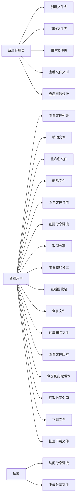
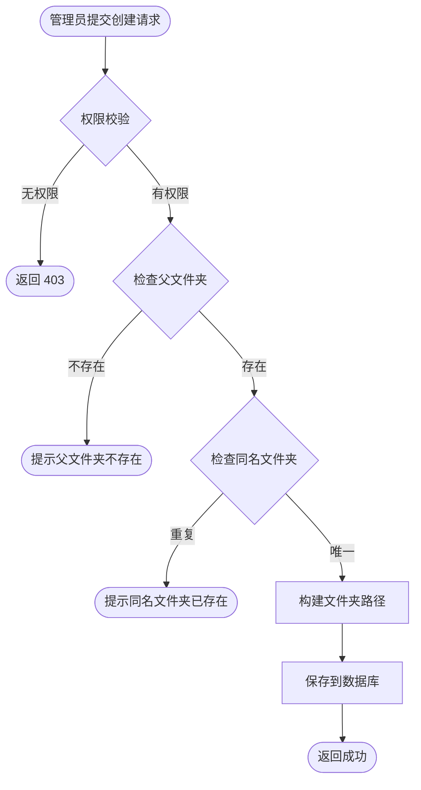
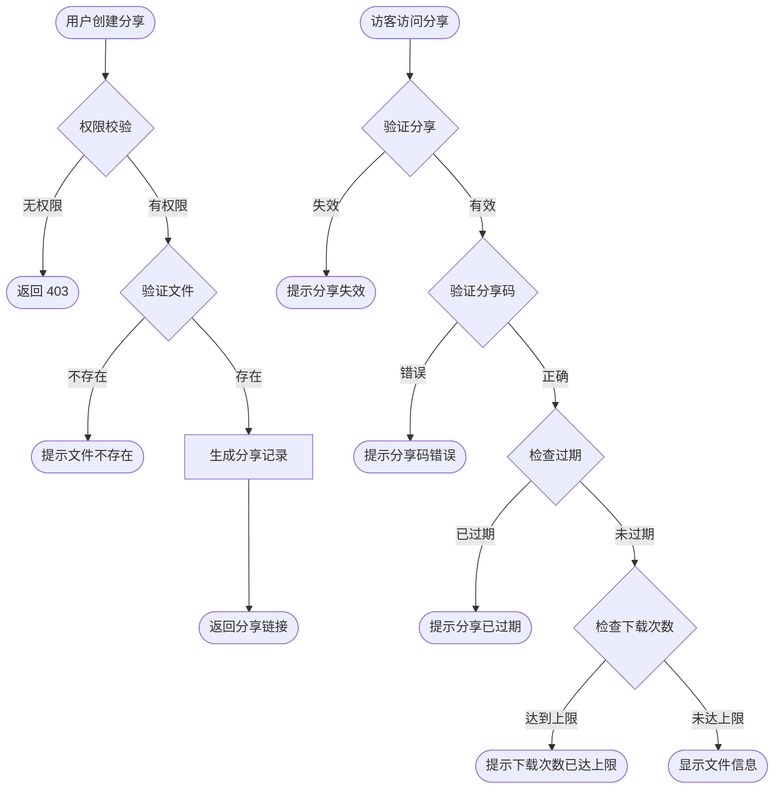
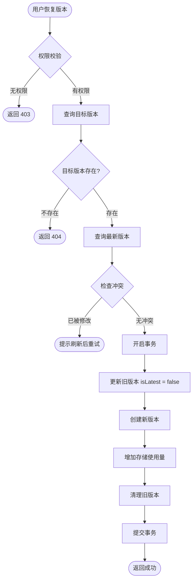

# 文件管理模块 — 需求文档

> 版本：1.0  
> 日期：2026-02-22  
> 状态：草案  
> 模块路径：`apps/backend/src/module/admin/system/file-manager`

---

## 1. 概述

### 1.1 背景

系统需要提供完整的文件管理能力，支持文件夹组织、文件上传下载、版本控制、分享链接、回收站等功能。文件管理模块基于已有的 upload 模块，提供更高级的文件组织和管理能力。

### 1.2 目标

- 提供文件夹树形结构管理，支持多级目录
- 支持文件的移动、重命名、删除、恢复
- 支持文件版本控制，可查看历史版本并恢复
- 支持文件分享链接生成，可设置密码和过期时间
- 支持回收站机制，防止误删
- 支持批量下载文件（打包为 zip）
- 统计租户存储使用情况

### 1.3 范围

- 文件夹管理：创建、修改、删除、查询、树形结构
- 文件管理：列表查询、移动、重命名、删除、详情
- 文件分享：创建分享、查看分享、下载分享、取消分享
- 回收站：查看回收站、恢复文件、彻底删除
- 版本控制：查看版本历史、恢复到指定版本
- 文件下载：获取访问令牌、下载文件、批量下载
- 存储统计：查看租户存储使用情况
- 不包含：文件上传功能（由 upload 模块负责）

---

## 2. 角色与用例

### 2.1 用例图

### 2.2 角色说明

| 角色       | 职责                                   |
| ---------- | -------------------------------------- |
| 系统管理员 | 管理文件夹结构，查看存储统计           |
| 普通用户   | 管理自己的文件，创建分享，使用回收站   |
| 访客       | 通过分享链接访问和下载文件（无需登录） |

---

## 3. 功能需求

### FR1: 创建文件夹

**描述**：管理员创建新的文件夹，支持多级目录。

**前置条件**：

- 用户已登录且拥有 `system:file:add` 权限
- 父文件夹存在（若指定）

**输入**：

- parentId: 父文件夹 ID（可选，默认 0 表示根目录）
- folderName: 文件夹名称（必填，最长 100 字符）
- orderNum: 排序号（可选，默认 0）
- remark: 备注（可选）

**处理逻辑**：

1. 验证父文件夹存在且未删除
2. 检查同级目录下是否存在同名文件夹
3. 构建文件夹路径（如 /parent/child/）
4. 创建文件夹记录
5. 自动注入 tenantId、createBy、createTime

**输出**：新创建的文件夹信息

**异常**：

- 父文件夹不存在：提示「父文件夹不存在」
- 同名文件夹已存在：提示「同级目录下已存在相同名称的文件夹」

### FR2: 修改文件夹

**描述**：修改文件夹名称、排序号、备注。

**前置条件**：

- 用户已登录且拥有 `system:file:edit` 权限
- 文件夹存在且属于当前租户

**输入**：

- folderId: 文件夹 ID（必填）
- folderName: 新名称（可选）
- orderNum: 新排序号（可选）
- remark: 新备注（可选）

**处理逻辑**：

1. 验证文件夹存在且属于当前租户
2. 若修改名称，检查同级目录下是否重名
3. 更新文件夹信息
4. 自动更新 updateBy、updateTime

**输出**：更新后的文件夹信息

**异常**：

- 文件夹不存在：返回 500
- 同名文件夹已存在：提示「同级目录下已存在相同名称的文件夹」

### FR3: 删除文件夹

**描述**：软删除文件夹，需确保文件夹为空。

**前置条件**：

- 用户已登录且拥有 `system:file:remove` 权限
- 文件夹存在且属于当前租户

**输入**：folderId（文件夹 ID）

**处理逻辑**：

1. 验证文件夹存在且属于当前租户
2. 检查是否有子文件夹，若有则阻止删除
3. 检查是否有文件，若有则阻止删除
4. 软删除文件夹（设置 delFlag = '1'）

**输出**：操作成功提示

**异常**：

- 文件夹不存在：返回 500
- 存在子文件夹：提示「该文件夹下存在子文件夹，无法删除」
- 存在文件：提示「该文件夹下存在文件，无法删除」

### FR4: 查看文件夹列表

**描述**：查询文件夹列表，支持按父文件夹和名称筛选。

**前置条件**：

- 用户已登录且拥有 `system:file:list` 权限

**输入**：

- parentId: 父文件夹 ID（可选）
- folderName: 文件夹名称（可选，模糊匹配）

**处理逻辑**：

1. 构建查询条件，仅查询当前租户且未删除的记录
2. 按 orderNum 升序、createTime 降序排列
3. 返回文件夹列表

**输出**：文件夹列表

### FR5: 查看文件夹树

**描述**：获取文件夹的树形结构，用于前端展示。

**前置条件**：

- 用户已登录且拥有 `system:file:list` 权限

**处理逻辑**：

1. 查询当前租户所有未删除的文件夹
2. 递归构建树形结构（parentId = 0 为根节点）
3. 按 orderNum 和 createTime 排序

**输出**：树形结构的文件夹列表

### FR6: 查看文件列表

**描述**：分页查询文件列表，支持按文件夹、文件名、扩展名筛选。

**前置条件**：

- 用户已登录且拥有 `system:file:list` 权限

**输入**：

- folderId: 文件夹 ID（可选，0 表示根目录，undefined 表示所有文件）
- fileName: 文件名（可选，模糊匹配）
- ext: 文件扩展名（可选，单个）
- exts: 文件扩展名列表（可选，逗号分隔）
- storageType: 存储类型（可选，local/cos）
- pageNum / pageSize: 分页参数

**处理逻辑**：

1. 构建查询条件，仅查询当前租户且未删除的文件
2. 支持按文件夹、文件名、扩展名、存储类型筛选
3. 分页返回结果，按 createTime 降序排列

**输出**：

- rows: 文件列表
- total: 总记录数

### FR7-FR24: 其他功能需求

由于篇幅限制，FR7-FR24 的详细需求包括：

- FR7: 移动文件 - 批量移动文件到指定文件夹
- FR8: 重命名文件 - 修改文件显示名称
- FR9: 删除文件 - 批量软删除文件，移入回收站
- FR10: 查看文件详情 - 查询文件详细信息
- FR11: 创建分享链接 - 生成分享链接，可设置密码和过期时间
- FR12: 访问分享链接 - 访客查看文件信息（无需登录）
- FR13: 下载分享文件 - 通过分享链接下载文件
- FR14: 取消分享 - 停用分享链接
- FR15: 查看我的分享列表 - 查询当前用户创建的分享
- FR16: 查看回收站文件列表 - 分页查询回收站文件
- FR17: 恢复回收站文件 - 批量恢复文件
- FR18: 彻底删除回收站文件 - 批量彻底删除文件
- FR19: 查看文件版本历史 - 查询所有历史版本
- FR20: 恢复到指定版本 - 创建新版本恢复历史内容
- FR21: 获取文件访问令牌 - 生成下载令牌
- FR22: 下载文件 - 通过令牌下载文件
- FR23: 批量下载文件 - 打包为 zip 下载
- FR24: 查看存储统计 - 查询租户存储使用情况

---

## 4. 业务流程

### 4.1 文件夹创建流程

### 4.2 文件分享流程

### 4.3 文件版本恢复流程

---

## 5. 状态说明

### 5.1 文件夹状态

| 状态   | 值  | 说明                  |
| ------ | --- | --------------------- |
| 正常   | 0   | 文件夹可正常使用      |
| 停用   | 1   | 文件夹被停用          |
| 已删除 | -   | delFlag = '1'，软删除 |

### 5.2 文件状态

| 状态   | 值  | 说明                    |
| ------ | --- | ----------------------- |
| 正常   | 0   | 文件可正常使用          |
| 停用   | 1   | 文件被停用              |
| 已删除 | -   | delFlag = '1'，在回收站 |

### 5.3 分享状态

| 状态 | 值  | 说明           |
| ---- | --- | -------------- |
| 正常 | 0   | 分享链接有效   |
| 停用 | 1   | 分享链接已失效 |

### 5.4 文件版本状态

| 字段         | 说明                      |
| ------------ | ------------------------- |
| version      | 版本号，从 1 开始递增     |
| isLatest     | 是否最新版本，true/false  |
| parentFileId | 父文件 ID，用于关联版本链 |

---

## 6. 验收标准

### AC1: 文件夹管理

- [ ] 可创建多级文件夹，路径正确构建
- [ ] 同级目录下文件夹名称唯一
- [ ] 修改文件夹名称时检查重名
- [ ] 删除文件夹前检查子文件夹和文件
- [ ] 文件夹树形结构正确展示

### AC2: 文件管理

- [ ] 文件列表支持按文件夹、文件名、扩展名筛选
- [ ] 支持批量移动文件到指定文件夹
- [ ] 重命名文件后名称立即生效
- [ ] 删除文件后移入回收站，存储使用量减少
- [ ] 文件详情包含完整信息

### AC3: 文件分享

- [ ] 创建分享后生成唯一链接
- [ ] 分享码验证正确
- [ ] 过期时间和下载次数限制生效
- [ ] 访客无需登录可访问分享
- [ ] 取消分享后链接失效

### AC4: 回收站

- [ ] 回收站仅显示已删除文件
- [ ] 恢复文件后存储使用量增加
- [ ] 彻底删除后物理文件和数据库记录都删除
- [ ] 恢复和删除操作使用事务保证原子性

### AC5: 版本控制

- [ ] 文件版本历史按版本号降序排列
- [ ] 恢复版本时创建新版本，版本号递增
- [ ] isLatest 标识正确更新
- [ ] 旧版本自动清理（根据配置）

### AC6: 文件下载

- [ ] 访问令牌有效期 30 分钟
- [ ] 令牌验证失败时返回 401
- [ ] 本地文件流式传输
- [ ] COS 文件重定向到 COS URL
- [ ] 批量下载打包为 zip

### AC7: 存储统计

- [ ] 存储使用量实时更新
- [ ] 使用百分比计算正确
- [ ] 剩余空间计算正确
- [ ] 超出配额时提示

---

## 7. 非功能需求

### 7.1 性能要求

| 接口     | SLO 类别 | P99 延迟 | 说明               |
| -------- | -------- | -------- | ------------------ |
| 文件夹树 | list     | < 500ms  | 文件夹数量 < 1000  |
| 文件列表 | list     | < 1000ms | 单页 20 条         |
| 文件下载 | core     | < 2000ms | 本地文件流式传输   |
| 批量下载 | admin    | < 10s    | 10 个文件以内      |
| 版本恢复 | admin    | < 2000ms | 包含事务和存储更新 |

### 7.2 安全要求

- 所有接口需权限校验（除分享相关公开接口）
- 租户隔离：通过 tenantId 自动过滤
- 文件访问令牌：30 分钟有效期，JWT 签名
- 分享链接：支持密码保护和过期时间
- 物理文件删除：仅在彻底删除时执行

### 7.3 可用性要求

- 文件删除使用软删除，支持恢复
- 版本控制支持历史回溯
- 存储使用量实时更新，防止超额
- 事务保证数据一致性

---

## 8. 数据模型

### 8.1 sys_file_folder 表结构

| 字段        | 类型         | 说明                  |
| ----------- | ------------ | --------------------- |
| folder_id   | int          | 主键，自增            |
| tenant_id   | varchar(20)  | 租户 ID               |
| parent_id   | int          | 父文件夹 ID，0 表示根 |
| folder_name | varchar(100) | 文件夹名称            |
| folder_path | varchar(500) | 文件夹路径            |
| order_num   | int          | 排序号                |
| status      | char(1)      | 状态                  |
| del_flag    | char(1)      | 删除标识              |
| create_by   | varchar(64)  | 创建人                |
| create_time | timestamp    | 创建时间              |
| update_by   | varchar(64)  | 更新人                |
| update_time | timestamp    | 更新时间              |
| remark      | varchar(500) | 备注                  |

**索引**：

- 主键：folder_id
- 普通索引：(tenant_id, parent_id)、(del_flag)

### 8.2 sys_upload 表结构（扩展）

| 字段           | 类型         | 说明                    |
| -------------- | ------------ | ----------------------- |
| upload_id      | varchar(255) | 主键，UUID              |
| tenant_id      | varchar(20)  | 租户 ID                 |
| folder_id      | int          | 文件夹 ID，0 表示根目录 |
| size           | int          | 文件大小（字节）        |
| file_name      | varchar(255) | 文件名                  |
| new_file_name  | varchar(255) | 存储文件名              |
| url            | varchar(500) | 文件 URL                |
| ext            | varchar(50)  | 文件扩展名              |
| mime_type      | varchar(100) | MIME 类型               |
| storage_type   | varchar(20)  | 存储类型（local/cos）   |
| file_md5       | varchar(32)  | 文件 MD5                |
| thumbnail      | varchar(500) | 缩略图 URL              |
| parent_file_id | varchar(255) | 父文件 ID（版本控制）   |
| version        | int          | 版本号                  |
| is_latest      | boolean      | 是否最新版本            |
| download_count | int          | 下载次数                |
| status         | char(1)      | 状态                    |
| del_flag       | char(1)      | 删除标识                |

**索引**：

- 主键：upload_id
- 普通索引：(tenant_id, folder_id)、(file_md5, del_flag)、(parent_file_id, version)、(del_flag)

### 8.3 sys_file_share 表结构

| 字段           | 类型         | 说明                  |
| -------------- | ------------ | --------------------- |
| share_id       | varchar(64)  | 主键，UUID            |
| tenant_id      | varchar(20)  | 租户 ID               |
| upload_id      | varchar(255) | 文件 ID               |
| share_code     | varchar(6)   | 分享码                |
| expire_time    | timestamp    | 过期时间              |
| max_download   | int          | 最大下载次数，-1 不限 |
| download_count | int          | 已下载次数            |
| status         | char(1)      | 状态                  |
| create_by      | varchar(64)  | 创建人                |
| create_time    | timestamp    | 创建时间              |

**索引**：

- 主键：share_id
- 普通索引：(share_id, share_code)、(upload_id)

---

## 9. 约束与限制

### 9.1 业务约束

- 文件夹名称在同级目录下唯一
- 删除文件夹前必须为空（无子文件夹和文件）
- 文件删除后移入回收站，彻底删除后不可恢复
- 分享链接过期或达到下载次数上限后失效
- 文件版本恢复时创建新版本，不修改历史版本

### 9.2 技术约束

- 文件访问令牌有效期 30 分钟
- 批量下载仅支持本地存储文件
- 版本控制使用 parentFileId 关联版本链
- 存储使用量以 MB 为单位，向上取整

---

## 10. 缺陷分析

基于当前实现代码分析，识别以下缺陷：

### D1: 文件夹路径未在修改名称时更新（P0）

**现状**：修改文件夹名称后，folderPath 未更新，导致路径不一致。

**风险**：文件夹路径显示错误，影响用户体验。

**建议**：修改文件夹名称时，递归更新所有子文件夹的 folderPath。

### D2: 删除文件夹未级联删除子文件夹（P1）

**现状**：仅检查子文件夹存在性，不支持级联删除。

**影响**：用户需要逐层删除文件夹，操作繁琐。

**建议**：提供级联删除选项，删除文件夹时同时删除所有子文件夹和文件。

### D3: 文件移动未验证目标文件夹权限（P1）

**现状**：移动文件时仅验证目标文件夹存在，未验证用户是否有权限。

**风险**：可能移动到无权访问的文件夹。

**建议**：增加文件夹权限验证机制。

### D4: 分享链接未记录访问日志（P2）

**现状**：分享链接访问和下载未记录详细日志。

**影响**：无法追踪分享链接的使用情况。

**建议**：新增分享访问日志表，记录访问时间、IP、下载次数等。

### D5: 批量下载不支持 COS 文件（P2）

**现状**：批量下载仅支持本地存储文件，COS 文件被跳过。

**影响**：混合存储场景下批量下载不完整。

**建议**：支持 COS 文件下载，先下载到临时目录再打包。

---

## 11. 附录

### 11.1 相关文档

- [设计文档](../../design/admin/system/file-manager-design.md)
- [后端开发规范](../../../../../.kiro/steering/backend-nestjs.md)

### 11.2 术语表

| 术语     | 说明                                 |
| -------- | ------------------------------------ |
| 文件夹   | 用于组织文件的目录结构               |
| 回收站   | 存放已删除文件的临时区域，支持恢复   |
| 分享链接 | 用于分享文件的公开链接，可设置密码   |
| 版本控制 | 记录文件的历史版本，支持回溯         |
| 访问令牌 | 用于下载文件的临时凭证，JWT 格式     |
| 存储配额 | 租户可使用的最大存储空间             |
| 软删除   | 标记删除但不删除物理文件和数据库记录 |
| 彻底删除 | 删除物理文件和数据库记录，不可恢复   |

### 11.3 变更记录

| 版本 | 日期       | 变更内容 | 作者 |
| ---- | ---------- | -------- | ---- |
| 1.0  | 2026-02-22 | 初始版本 | Kiro |
