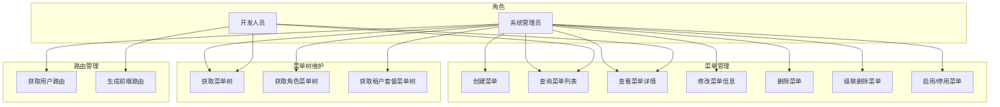
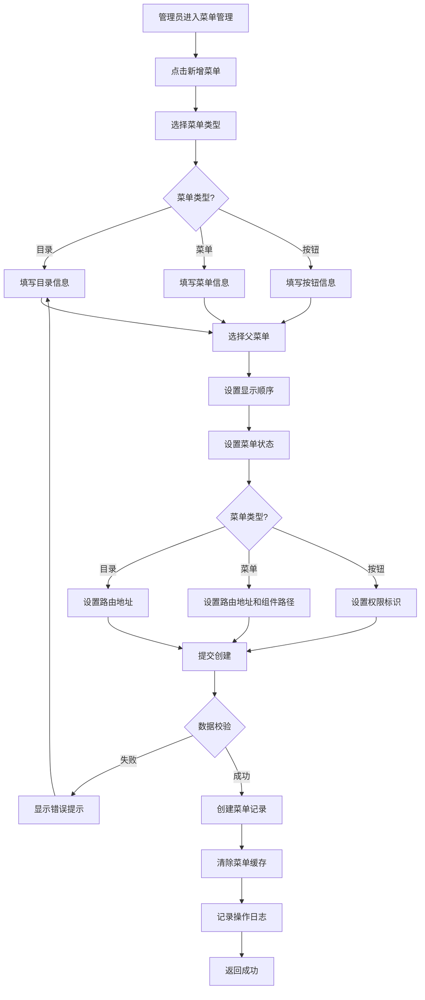
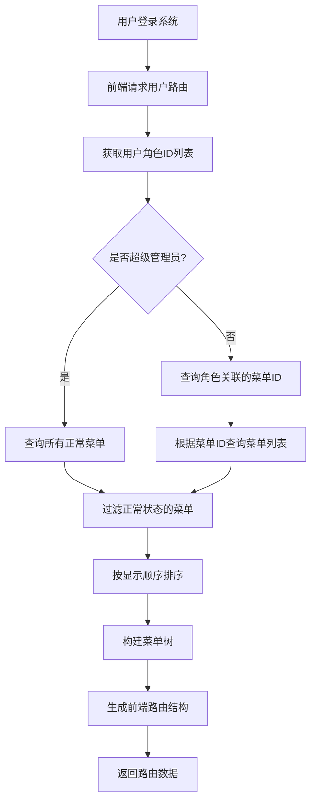
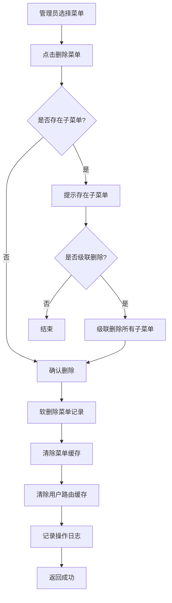
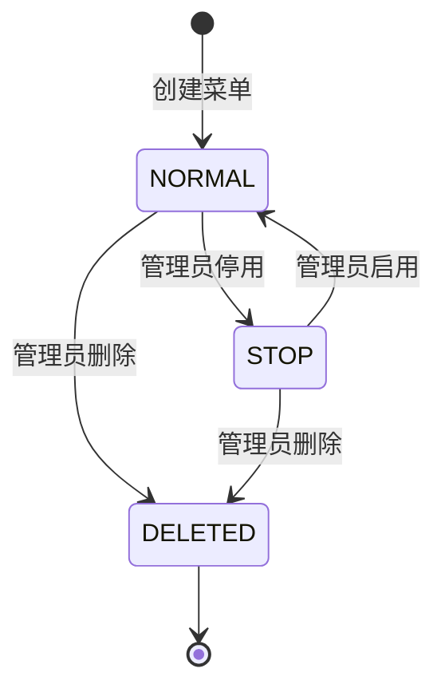
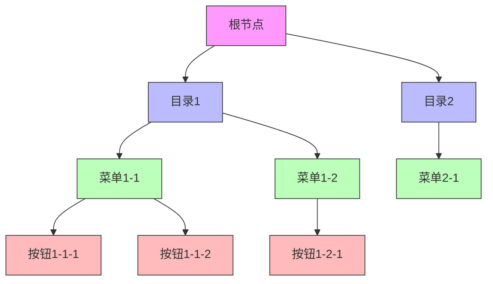

# 菜单管理模块 (System Menu) — 需求文档

> 版本：1.0  
> 日期：2026-02-22  
> 状态：草案  
> 关联设计：[menu-design.md](../../../design/admin/system/menu-design.md)

---

## 1. 概述

### 1.1 背景

菜单管理模块 (`module/admin/system/menu`) 是后台管理系统 RBAC 权限体系的核心模块，负责菜单的全生命周期管理，包括菜单的创建、查询、修改、删除、树形结构维护、路由生成等功能。该模块与角色模块、用户模块紧密关联，是前端路由和权限控制的基础。

当前实现已支持完整的菜单 CRUD 操作、树形结构维护、路由生成、角色菜单树、租户套餐菜单树等功能，但在以下方面存在改进空间：

1. 菜单排序调整不便，缺少拖拽排序功能
2. 菜单图标管理不够直观
3. 菜单权限标识生成不够智能
4. 菜单使用情况统计不足

### 1.2 目标

1. 完善菜单管理的核心功能，提升管理效率
2. 增强菜单树形结构的维护能力
3. 优化菜单路由生成逻辑
4. 为后续扩展（如菜单国际化、菜单模板）预留接口

### 1.3 范围

| 在范围内                  | 不在范围内                   |
| ------------------------- | ---------------------------- |
| 菜单基本信息管理          | 菜单国际化（后续迭代）       |
| 菜单树形结构维护          | 菜单模板管理（后续迭代）     |
| 菜单状态管理（启用/停用） | 菜单访问统计（后续迭代）     |
| 菜单路由生成              | 菜单权限审批流程（后续迭代） |
| 角色菜单树查询            | 菜单个性化配置（后续迭代）   |
| 租户套餐菜单树查询        | 菜单快捷方式（后续迭代）     |
| 菜单级联删除              | 菜单收藏功能（后续迭代）     |

---

## 2. 角色与用例

> 图 1：菜单管理模块用例图

---

## 3. 业务流程

### 3.1 创建菜单流程

> 图 2：创建菜单活动图

### 3.2 获取用户路由流程

> 图 3：获取用户路由活动图

### 3.3 删除菜单流程

> 图 4：删除菜单活动图

---

## 4. 状态说明

### 4.1 菜单状态机

> 图 5：菜单状态图

**状态说明**：

- `NORMAL (0)`：正常状态，菜单可以正常使用
- `STOP (1)`：停用状态，菜单不显示，但数据保留
- `DELETED (2)`：删除状态，软删除，数据标记为删除但不物理删除

### 4.2 菜单类型说明

> 图 6：菜单类型关系图

**菜单类型说明**：

- `目录 (M)`：一级菜单，用于分组，不对应具体页面
- `菜单 (C)`：二级或三级菜单，对应具体页面
- `按钮 (F)`：页面内的操作按钮，对应具体权限

---

## 5. 功能需求

### 5.1 创建菜单 (POST /system/menu)

**功能描述**：管理员创建新菜单，支持目录、菜单、按钮三种类型。

**前置条件**：

- 用户已登录
- 拥有 `system:menu:add` 权限

**输入**：

- `menuName`: 菜单名称（必填，0-50 字符）
- `parentId`: 父菜单ID（必填，0表示顶级菜单）
- `orderNum`: 显示顺序（可选，数字）
- `path`: 路由地址（可选，0-200 字符）
- `component`: 组件路径（可选，0-255 字符）
- `queryParam`: 路由参数（可选，0-200 字符）
- `icon`: 菜单图标（可选，0-100 字符）
- `menuType`: 菜单类型（可选，M=目录 C=菜单 F=按钮）
- `isFrame`: 是否外链（必填，0=是 1=否）
- `isCache`: 是否缓存（可选，0=缓存 1=不缓存）
- `visible`: 显示状态（可选，0=显示 1=隐藏）
- `status`: 菜单状态（可选，0=正常 1=停用）
- `perms`: 权限标识（可选，0-100 字符）
- `remark`: 备注（可选，0-500 字符）

**输出**：

- 成功：返回 200，创建的菜单信息
- 失败：返回错误信息

**业务规则**：

1. 父菜单ID为0时，创建顶级菜单
2. 默认菜单状态为正常（0）
3. 默认显示状态为显示（0）
4. 创建菜单时自动设置创建人和创建时间
5. 清除菜单缓存
6. 记录操作日志

**异常处理**：

- 菜单名称为空：返回 400，"菜单名称不能为空"
- 父菜单不存在：返回 400，"父菜单不存在"

### 5.2 查询菜单列表 (GET /system/menu/list)

**功能描述**：查询菜单列表，支持按名称和状态筛选。

**前置条件**：

- 用户已登录
- 拥有 `system:menu:list` 权限

**输入**：

- `menuName`: 菜单名称（可选，模糊查询）
- `status`: 菜单状态（可选）

**输出**：

- 菜单列表（按显示顺序升序排列）

**业务规则**：

1. 支持按菜单名称模糊查询
2. 支持按状态筛选
3. 按显示顺序（orderNum）升序排列
4. 仅查询未删除的菜单

**异常处理**：

- 无权限：返回 403，"无权限访问"

### 5.3 查看菜单详情 (GET /system/menu/:menuId)

**功能描述**：根据菜单ID获取菜单详细信息。

**前置条件**：

- 用户已登录
- 拥有 `system:menu:query` 权限

**输入**：

- `menuId`: 菜单ID（路径参数）

**输出**：

- 菜单详细信息

**业务规则**：

1. 查询菜单基本信息
2. 返回完整的菜单字段

**异常处理**：

- 菜单不存在：返回 404，"菜单不存在"
- 无权限：返回 403，"无权限访问"

### 5.4 修改菜单信息 (PUT /system/menu)

**功能描述**：修改菜单的基本信息。

**前置条件**：

- 用户已登录
- 拥有 `system:menu:edit` 权限

**输入**：

- `menuId`: 菜单ID（必填）
- 其他字段与创建菜单相同（可选）

**输出**：

- 成功：返回 200，更新后的菜单信息
- 失败：返回错误信息

**业务规则**：

1. 修改菜单基本信息
2. 更新菜单的修改人和修改时间
3. 清除菜单缓存
4. 清除用户路由缓存
5. 记录操作日志

**异常处理**：

- 菜单不存在：返回 404，"菜单不存在"
- 无权限：返回 403，"无权限访问"

### 5.5 删除菜单 (DELETE /system/menu/:menuId)

**功能描述**：删除菜单（软删除）。

**前置条件**：

- 用户已登录
- 拥有 `system:menu:remove` 权限

**输入**：

- `menuId`: 菜单ID（路径参数）

**输出**：

- 成功：返回 200，删除的记录数
- 失败：返回错误信息

**业务规则**：

1. 软删除，设置 `del_flag=2`
2. 删除前检查是否存在子菜单（建议）
3. 清除菜单缓存
4. 清除用户路由缓存
5. 记录操作日志

**异常处理**：

- 无权限：返回 403，"无权限访问"
- 存在子菜单：返回 400，"该菜单存在子菜单，无法删除"（建议）

### 5.6 级联删除菜单 (DELETE /system/menu/cascade/:menuIds)

**功能描述**：批量级联删除菜单及其所有子菜单。

**前置条件**：

- 用户已登录
- 拥有 `system:menu:remove` 权限

**输入**：

- `menuIds`: 菜单ID，多个用逗号分隔（路径参数）

**输出**：

- 成功：返回 200，删除的记录数
- 失败：返回错误信息

**业务规则**：

1. 软删除，设置 `del_flag=2`
2. 批量删除指定的菜单
3. 清除菜单缓存
4. 清除用户路由缓存
5. 记录操作日志

**异常处理**：

- 无权限：返回 403，"无权限访问"

### 5.7 获取菜单树 (GET /system/menu/treeselect)

**功能描述**：获取菜单树形结构，用于下拉选择。

**前置条件**：

- 用户已登录
- 拥有 `system:menu:query` 权限

**输入**：无

**输出**：

- 菜单树形结构

**业务规则**：

1. 查询所有未删除的菜单
2. 按显示顺序升序排列
3. 构建树形结构

**异常处理**：

- 无权限：返回 403，"无权限访问"

### 5.8 获取角色菜单树 (GET /system/menu/roleMenuTreeselect/:roleId)

**功能描述**：获取角色已分配的菜单树结构。

**前置条件**：

- 用户已登录
- 拥有 `system:menu:query` 权限

**输入**：

- `roleId`: 角色ID（路径参数）

**输出**：

- `menus`: 菜单树形结构
- `checkedKeys`: 角色已选中的菜单ID列表

**业务规则**：

1. 查询所有未删除的菜单
2. 构建树形结构
3. 查询角色已分配的菜单ID列表

**异常处理**：

- 角色不存在：返回 404，"角色不存在"
- 无权限：返回 403，"无权限访问"

### 5.9 获取租户套餐菜单树 (GET /system/menu/tenantPackageMenuTreeselect/:packageId)

**功能描述**：获取租户套餐已分配的菜单树结构。

**前置条件**：

- 用户已登录

**输入**：

- `packageId`: 套餐ID（路径参数）

**输出**：

- `menus`: 菜单树形结构
- `checkedKeys`: 套餐已选中的菜单ID列表

**业务规则**：

1. 查询所有未删除的菜单
2. 构建树形结构
3. 查询租户套餐已分配的菜单ID列表

**异常处理**：

- 套餐不存在：返回 404，"套餐不存在"

### 5.10 获取用户路由 (GET /system/menu/getRouters)

**功能描述**：获取当前用户的路由菜单，供前端使用。

**前置条件**：

- 用户已登录

**输入**：无（从 Token 中解析）

**输出**：

- 用户路由菜单树

**业务规则**：

1. 获取用户的角色ID列表
2. 如果是超级管理员（roleId=1），返回所有正常菜单
3. 否则，根据角色查询菜单ID列表
4. 根据菜单ID查询菜单列表
5. 过滤正常状态的菜单
6. 按显示顺序排序
7. 构建前端路由树
8. 使用缓存，TTL 24 小时

**异常处理**：

- Token 无效：返回 401，"未授权"

---

## 6. 验收标准

### 6.1 菜单管理功能

| 编号 | 验收条件                               | 可测试方式            |
| ---- | -------------------------------------- | --------------------- |
| AC-1 | 创建菜单时，父菜单ID为0时创建顶级菜单  | 单元测试              |
| AC-2 | 创建菜单时，默认菜单状态为正常（0）    | 单元测试              |
| AC-3 | 创建菜单时，自动设置创建人和创建时间   | 单元测试 + 数据库检查 |
| AC-4 | 修改菜单时，清除菜单缓存和用户路由缓存 | 集成测试              |
| AC-5 | 删除菜单时，使用软删除，数据不物理删除 | 单元测试 + 数据库检查 |
| AC-6 | 级联删除菜单时，批量删除指定的菜单     | 集成测试              |

### 6.2 菜单树维护

| 编号 | 验收条件                                             | 可测试方式 |
| ---- | ---------------------------------------------------- | ---------- |
| AC-7 | 获取菜单树时，按显示顺序升序排列                     | 单元测试   |
| AC-8 | 获取角色菜单树时，返回菜单树和已选中的菜单ID列表     | 集成测试   |
| AC-9 | 获取租户套餐菜单树时，返回菜单树和已选中的菜单ID列表 | 集成测试   |

### 6.3 路由管理

| 编号  | 验收条件                                 | 可测试方式 |
| ----- | ---------------------------------------- | ---------- |
| AC-10 | 超级管理员获取路由时，返回所有正常菜单   | 集成测试   |
| AC-11 | 普通用户获取路由时，根据角色返回对应菜单 | 集成测试   |
| AC-12 | 获取路由时，过滤正常状态的菜单           | 单元测试   |
| AC-13 | 获取路由时，按显示顺序排序               | 单元测试   |
| AC-14 | 获取路由时，构建前端路由树结构           | 单元测试   |

---

## 7. 非功能需求

| 维度   | 要求                                                      |
| ------ | --------------------------------------------------------- |
| 性能   | 菜单列表查询 P95 小于等于 200ms                           |
| 性能   | 菜单详情查询 P95 小于等于 100ms                           |
| 性能   | 用户路由查询 P95 小于等于 300ms（含缓存）                 |
| 可用性 | 菜单管理接口可用性 99.9%                                  |
| 安全   | 菜单操作需要对应权限（system:menu:add/edit/remove/query） |
| 幂等   | 删除菜单接口幂等                                          |
| 幂等   | 修改菜单接口幂等                                          |
| 可观测 | 所有菜单操作记录操作日志，包含操作人、操作时间、操作内容  |
| 缓存   | 用户路由使用 Redis 缓存，TTL 24 小时                      |
| 缓存   | 菜单修改/删除后，清除相关缓存                             |

---

## 8. 现有实现分析

### 8.1 已实现功能

| 功能               | 实现状态 | 代码位置                                               | 说明                         |
| ------------------ | -------- | ------------------------------------------------------ | ---------------------------- |
| 创建菜单           | ✅ 完整  | `menu.controller.ts` - `create()`                      | 支持目录、菜单、按钮三种类型 |
| 查询菜单列表       | ✅ 完整  | `menu.controller.ts` - `findAll()`                     | 支持按名称和状态筛选         |
| 查看菜单详情       | ✅ 完整  | `menu.controller.ts` - `findOne()`                     | 返回完整的菜单字段           |
| 修改菜单信息       | ✅ 完整  | `menu.controller.ts` - `update()`                      | 清除菜单缓存                 |
| 删除菜单           | ✅ 完整  | `menu.controller.ts` - `remove()`                      | 软删除                       |
| 级联删除菜单       | ✅ 完整  | `menu.controller.ts` - `cascadeRemove()`               | 批量软删除                   |
| 获取菜单树         | ✅ 完整  | `menu.controller.ts` - `treeSelect()`                  | 用于下拉选择                 |
| 获取角色菜单树     | ✅ 完整  | `menu.controller.ts` - `roleMenuTreeselect()`          | 包含已选中的菜单ID           |
| 获取租户套餐菜单树 | ✅ 完整  | `menu.controller.ts` - `tenantPackageMenuTreeselect()` | 包含已选中的菜单ID           |
| 获取用户路由       | ✅ 完整  | `menu.controller.ts` - `getRouters()`                  | 使用缓存，构建前端路由树     |
| 菜单缓存管理       | ✅ 完整  | `menu.service.ts` - `clearCache()`                     | 修改/删除后清除缓存          |
| 操作日志记录       | ✅ 完整  | 使用 `@Operlog` 装饰器                                 | 自动记录操作日志             |

### 8.2 待优化功能

| 功能             | 实现状态  | 优先级 | 说明                           |
| ---------------- | --------- | ------ | ------------------------------ |
| 菜单拖拽排序     | ❌ 未实现 | P2     | 支持拖拽调整菜单顺序           |
| 菜单图标选择器   | ❌ 未实现 | P2     | 提供图标选择界面，而非手动输入 |
| 菜单权限标识生成 | ❌ 未实现 | P3     | 根据菜单路径自动生成权限标识   |
| 菜单使用情况统计 | ❌ 未实现 | P3     | 统计菜单被哪些角色使用         |
| 菜单国际化       | ❌ 未实现 | P3     | 支持多语言菜单名称             |
| 菜单模板管理     | ❌ 未实现 | P3     | 预定义常用菜单模板，快速创建   |
| 菜单访问统计     | ❌ 未实现 | P3     | 统计菜单访问次数和频率         |

### 8.3 现有缺陷分析

经过仔细审查代码和项目结构，发现以下问题：

#### 8.3.1 删除菜单前未检查子菜单

**问题描述**：

- `remove()` 方法直接软删除菜单，未检查是否存在子菜单
- 可能导致父菜单删除后，子菜单成为孤儿节点

**影响**：

- 数据一致性问题
- 菜单树结构可能出现异常

**建议**：

- 删除前检查是否存在子菜单
- 如果存在子菜单，提示用户先删除子菜单或使用级联删除

#### 8.3.2 菜单排序调整不便

**问题描述**：

- 修改菜单顺序需要手动输入 `orderNum` 数字
- 无法通过拖拽方式调整菜单顺序

**影响**：

- 用户体验差
- 调整多个菜单顺序时效率低

**建议**：

- 实现拖拽排序接口
- 前端提供拖拽排序界面

#### 8.3.3 菜单图标管理不够直观

**问题描述**：

- 菜单图标需要手动输入图标名称
- 无法预览图标效果

**影响**：

- 用户体验差
- 容易输入错误的图标名称

**建议**：

- 提供图标选择器界面
- 支持图标预览和搜索

#### 8.3.4 菜单权限标识生成不够智能

**问题描述**：

- 权限标识需要手动输入
- 无法根据菜单路径自动生成

**影响**：

- 容易输入错误的权限标识
- 权限标识不统一

**建议**：

- 根据菜单路径自动生成权限标识
- 提供权限标识模板

#### 8.3.5 菜单使用情况统计不足

**问题描述**：

- 无法查看菜单被哪些角色使用
- 无法统计菜单访问次数

**影响**：

- 无法评估菜单的重要性
- 删除菜单时无法评估影响范围

**建议**：

- 在菜单详情页展示使用该菜单的角色列表
- 统计菜单访问次数和频率

---

## 9. 与市面上产品的差距

### 9.1 与主流后台管理系统对比

| 功能             | 本系统 | RuoYi-Vue-Plus | Ant Design Pro | 说明         |
| ---------------- | ------ | -------------- | -------------- | ------------ |
| 菜单基本管理     | ✅     | ✅             | ✅             | 基础功能     |
| 菜单树形结构     | ✅     | ✅             | ✅             | 基础功能     |
| 菜单路由生成     | ✅     | ✅             | ✅             | 基础功能     |
| 角色菜单树       | ✅     | ✅             | ✅             | 基础功能     |
| 菜单拖拽排序     | ❌     | ✅             | ✅             | 本系统未实现 |
| 菜单图标选择器   | ❌     | ✅             | ✅             | 本系统未实现 |
| 菜单权限标识生成 | ❌     | ✅             | ❌             | 本系统未实现 |
| 菜单使用情况统计 | ❌     | ✅             | ❌             | 本系统未实现 |
| 菜单国际化       | ❌     | ✅             | ✅             | 本系统未实现 |
| 菜单模板管理     | ❌     | ❌             | ✅             | 本系统未实现 |
| 菜单访问统计     | ❌     | ❌             | ✅             | 本系统未实现 |

### 9.2 差距总结

1. **基础功能完善度**：本系统已实现核心的菜单管理功能，满足基本需求
2. **用户体验**：缺少拖拽排序、图标选择器等提升用户体验的功能
3. **智能化**：缺少权限标识自动生成等智能化功能
4. **可观测性**：缺少菜单使用情况统计、访问统计等功能
5. **国际化**：缺少多语言支持

---

## 10. 改进建议与待办事项

### 10.1 短期改进（1-2 个迭代）

| 优先级 | 功能               | 工作量 | 说明                     |
| ------ | ------------------ | ------ | ------------------------ |
| P1     | 删除前检查子菜单   | 1 天   | 删除前检查是否存在子菜单 |
| P2     | 实现菜单拖拽排序   | 3 天   | 支持拖拽调整菜单顺序     |
| P2     | 实现菜单图标选择器 | 2 天   | 提供图标选择界面         |

### 10.2 中期改进（3-6 个月）

| 优先级 | 功能                 | 工作量 | 说明                         |
| ------ | -------------------- | ------ | ---------------------------- |
| P3     | 实现权限标识自动生成 | 2 天   | 根据菜单路径自动生成权限标识 |
| P3     | 实现菜单使用情况统计 | 3 天   | 统计菜单被哪些角色使用       |
| P3     | 实现菜单国际化       | 5 天   | 支持多语言菜单名称           |

### 10.3 长期规划（6 个月以上）

| 优先级 | 功能             | 工作量 | 说明                         |
| ------ | ---------------- | ------ | ---------------------------- |
| P3     | 实现菜单模板管理 | 5 天   | 预定义常用菜单模板，快速创建 |
| P3     | 实现菜单访问统计 | 7 天   | 统计菜单访问次数和频率       |

### 10.4 技术债务

| 问题                     | 影响       | 建议                       |
| ------------------------ | ---------- | -------------------------- |
| 删除菜单前未检查子菜单   | 数据一致性 | 立即修复，确保数据一致性   |
| 菜单排序调整不便         | 用户体验   | 补充实现，提升用户体验     |
| 菜单图标管理不够直观     | 用户体验   | 补充实现，提升用户体验     |
| 菜单权限标识生成不够智能 | 效率低     | 补充实现，提升管理效率     |
| 菜单使用情况统计不足     | 可观测性   | 补充实现，提升系统可观测性 |

---

## 11. 附录

### 11.1 相关文档

- [菜单管理模块设计文档](../../../design/admin/system/menu-design.md)
- [角色管理模块需求文档](./role-requirements.md)
- [用户管理模块需求文档](./user-requirements.md)
- [后端开发规范](../../../../../CODING_RULES.md)

### 11.2 参考资料

- [RBAC 权限模型](https://en.wikipedia.org/wiki/Role-based_access_control)
- [前端路由最佳实践](https://router.vuejs.org/guide/)
- [RuoYi-Vue-Plus 菜单管理](https://gitee.com/dromara/RuoYi-Vue-Plus)

### 11.3 术语表

| 术语     | 说明                                     |
| -------- | ---------------------------------------- |
| 菜单     | 系统中的导航菜单项                       |
| 目录     | 一级菜单，用于分组，不对应具体页面       |
| 菜单     | 二级或三级菜单，对应具体页面             |
| 按钮     | 页面内的操作按钮，对应具体权限           |
| 路由     | 前端路由，用于页面跳转                   |
| 权限标识 | 用于权限控制的字符串，如 system:menu:add |
| 软删除   | 标记为删除但不物理删除数据               |
| 级联删除 | 删除父节点时同时删除所有子节点           |
