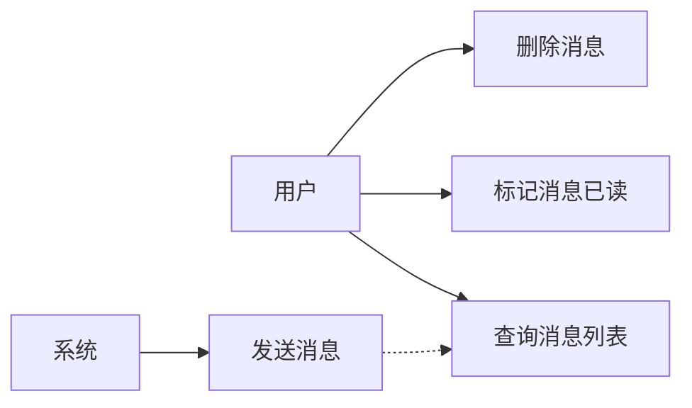
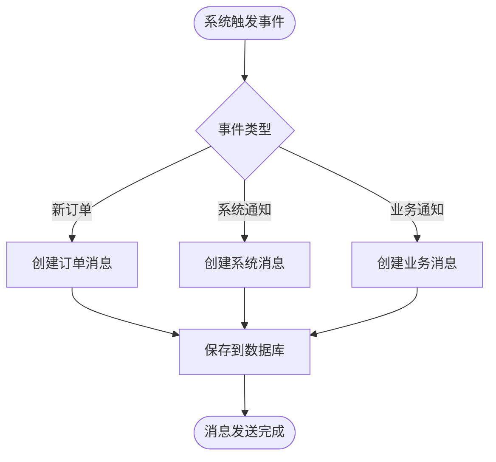
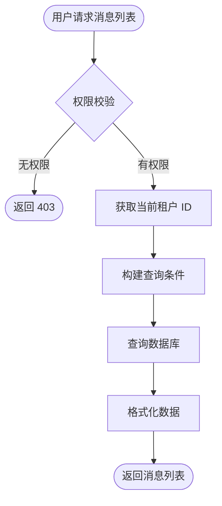
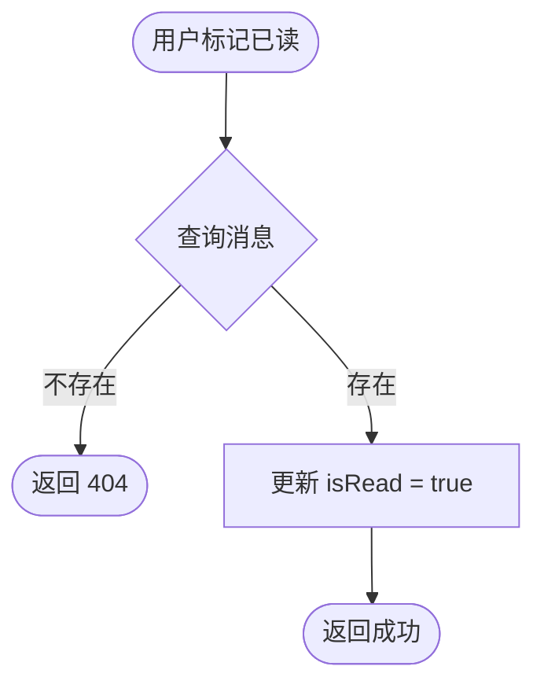
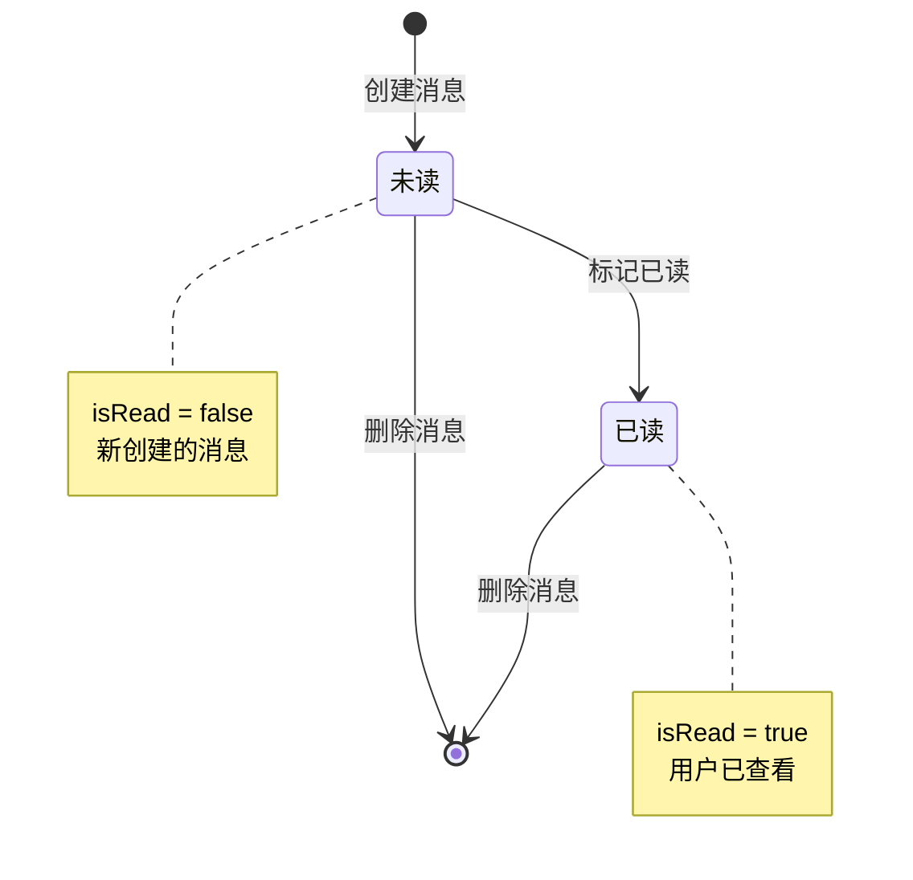

# 消息管理模块 — 需求文档

> 版本：1.0  
> 日期：2026-02-22  
> 状态：草案  
> 模块路径：`apps/backend/src/module/admin/system/message`

---

## 1. 概述

### 1.1 背景

系统需要提供站内消息功能，用于向用户发送系统通知、订单通知等信息。消息模块是通知系统的基础组件，当前实现为简单的站内信功能，未来将扩展为完整的通知服务。

### 1.2 目标

- 提供站内消息的创建、查询、标记已读、删除功能
- 支持按消息类型和已读状态筛选
- 支持分页查询消息列表
- 为未来的通知服务预留扩展接口

### 1.3 范围

- 站内消息的 CRUD 操作
- 消息列表查询和筛选
- 消息已读状态管理
- 不包含：短信通知、邮件通知、推送通知（预留扩展）

---

## 2. 角色与用例

### 2.1 用例图



### 2.2 角色说明

| 角色 | 职责                             |
| ---- | -------------------------------- |
| 系统 | 自动发送系统通知、订单通知等消息 |
| 用户 | 查看消息、标记已读、删除消息     |

---

## 3. 功能需求

### FR1: 发送消息

**描述**：系统自动发送消息给指定用户。

**前置条件**：无（系统内部调用）

**输入**：

- title: 消息标题（必填，最长 100 字符）
- content: 消息内容（可选，文本类型）
- type: 消息类型（必填，如 ORDER、SYSTEM、NOTICE）
- receiverId: 接收人 ID（必填）
- tenantId: 租户 ID（必填）

**处理逻辑**：

1. 验证输入参数
2. 创建消息记录
3. 默认 isRead = false
4. 自动记录 createTime

**输出**：新创建的消息信息

**使用场景**：

- 新订单通知：用户下单后通知商家
- 系统通知：系统维护、功能更新等
- 业务通知：支付成功、发货通知等

### FR2: 查询消息列表

**描述**：用户查询自己的消息列表，支持按类型和已读状态筛选。

**前置条件**：用户已登录

**输入**：

- type: 消息类型（可选，筛选条件）
- isRead: 已读状态（可选，true/false）
- pageNum / pageSize: 分页参数

**处理逻辑**：

1. 获取当前租户 ID
2. 构建查询条件，仅查询当前租户的消息
3. 支持按类型和已读状态筛选
4. 按创建时间降序排列
5. 分页返回结果

**输出**：

- rows: 消息列表
- total: 总记录数

### FR3: 标记消息已读

**描述**：用户标记消息为已读状态。

**前置条件**：

- 用户已登录
- 消息存在

**输入**：id（消息 ID）

**处理逻辑**：

1. 根据 ID 查询消息
2. 更新 isRead = true

**输出**：操作成功提示

**异常**：

- 消息不存在：返回 404

### FR4: 删除消息

**描述**：用户删除消息（物理删除）。

**前置条件**：

- 用户已登录
- 消息存在

**输入**：id（消息 ID）

**处理逻辑**：

1. 根据 ID 查询消息
2. 物理删除消息记录

**输出**：操作成功提示

**异常**：

- 消息不存在：返回 404

---

## 4. 业务流程

### 4.1 消息发送流程



### 4.2 消息查询流程



### 4.3 消息已读流程



---

## 5. 状态说明

### 5.1 消息状态

| 状态 | 值    | 说明         |
| ---- | ----- | ------------ |
| 未读 | false | 消息未被查看 |
| 已读 | true  | 消息已被查看 |

**状态转换**：



---

## 6. 验收标准

### AC1: 发送消息

- [ ] 可成功创建消息记录
- [ ] 消息默认为未读状态
- [ ] 自动记录创建时间
- [ ] 支持不同消息类型

### AC2: 查询消息列表

- [ ] 仅返回当前租户的消息
- [ ] 支持按消息类型筛选
- [ ] 支持按已读状态筛选
- [ ] 按创建时间降序排列
- [ ] 分页正常工作

### AC3: 标记已读

- [ ] 标记后 isRead 变为 true
- [ ] 消息不存在时返回 404
- [ ] 已读消息可重复标记

### AC4: 删除消息

- [ ] 删除后消息不在列表中
- [ ] 消息不存在时返回 404
- [ ] 物理删除，不可恢复

---

## 7. 非功能需求

### 7.1 性能要求

| 接口         | SLO 类别 | P99 延迟 | 说明       |
| ------------ | -------- | -------- | ---------- |
| 查询消息列表 | list     | < 500ms  | 单页 20 条 |
| 发送消息     | admin    | < 200ms  | 单条消息   |
| 标记已读     | admin    | < 100ms  | 单条消息   |
| 删除消息     | admin    | < 100ms  | 单条消息   |

### 7.2 安全要求

- 查询消息时按租户隔离
- 用户只能查看自己租户的消息
- 标记已读和删除需验证消息归属

### 7.3 可用性要求

- 消息发送失败不影响主业务流程
- 支持异步发送消息（未来扩展）

---

## 8. 数据模型

### 8.1 sys_message 表结构

| 字段        | 类型         | 说明                            |
| ----------- | ------------ | ------------------------------- |
| id          | int          | 主键，自增                      |
| title       | varchar(100) | 消息标题                        |
| content     | text         | 消息内容                        |
| type        | varchar(50)  | 消息类型（ORDER/SYSTEM/NOTICE） |
| receiver_id | varchar      | 接收人 ID                       |
| is_read     | boolean      | 是否已读，默认 false            |
| tenant_id   | varchar(20)  | 租户 ID                         |
| create_time | timestamp    | 创建时间                        |

**索引**：

- 主键：id
- 普通索引：(receiver_id)、(tenant_id)

---

## 9. 约束与限制

### 9.1 业务约束

- 消息标题最长 100 字符
- 消息内容为文本类型，无长度限制
- 消息类型需预定义（ORDER、SYSTEM、NOTICE）

### 9.2 技术约束

- 当前为物理删除，不支持恢复
- 未实现消息推送功能
- 未实现批量操作

---

## 10. 缺陷分析

基于当前实现代码分析，识别以下缺陷：

### D1: 缺少权限校验（P0）

**现状**：查询消息列表接口的权限校验被注释掉。

**风险**：任何登录用户都可以查询消息，可能导致越权访问。

**建议**：

```typescript
@RequirePermission('system:message:list')
```

### D2: 缺少消息归属验证（P0）

**现状**：标记已读和删除消息时未验证消息是否属于当前用户或租户。

**风险**：用户可能操作其他用户的消息。

**建议**：

```typescript
// 标记已读前验证
const message = await this.prisma.sysMessage.findUnique({ where: { id } });
if (!message || message.tenantId !== currentTenantId) {
  throw new BusinessException(ResponseCode.DATA_NOT_FOUND, '消息不存在');
}
```

### D3: receiverId 语义不清晰（P1）

**现状**：receiverId 可能是 MemberID 或 TenantID，语义不明确。

**影响**：查询消息时难以确定接收人。

**建议**：

- 明确 receiverId 的含义（建议使用 userId）
- 或增加 receiverType 字段区分接收人类型

### D4: 缺少批量操作（P2）

**现状**：仅支持单条消息的标记已读和删除。

**影响**：用户需要逐条操作，体验不佳。

**建议**：新增批量标记已读和批量删除接口。

### D5: 缺少未读消息数量统计（P2）

**现状**：未提供未读消息数量查询接口。

**影响**：前端无法显示未读消息数量徽章。

**建议**：

```typescript
async getUnreadCount(tenantId: string): Promise<number> {
  return this.prisma.sysMessage.count({
    where: { tenantId, isRead: false }
  });
}
```

---

## 11. 附录

### 11.1 相关文档

- [设计文档](../../design/admin/system/message-design.md)
- [后端开发规范](../../../../../.kiro/steering/backend-nestjs.md)

### 11.2 术语表

| 术语      | 说明                                 |
| --------- | ------------------------------------ |
| 站内消息  | 系统内部的消息通知，用户登录后可查看 |
| 消息类型  | 区分不同业务场景的消息分类           |
| 接收人 ID | 消息接收者的唯一标识                 |
| 已读状态  | 标识消息是否被用户查看               |

### 11.3 变更记录

| 版本 | 日期       | 变更内容 | 作者 |
| ---- | ---------- | -------- | ---- |
| 1.0  | 2026-02-22 | 初始版本 | Kiro |
