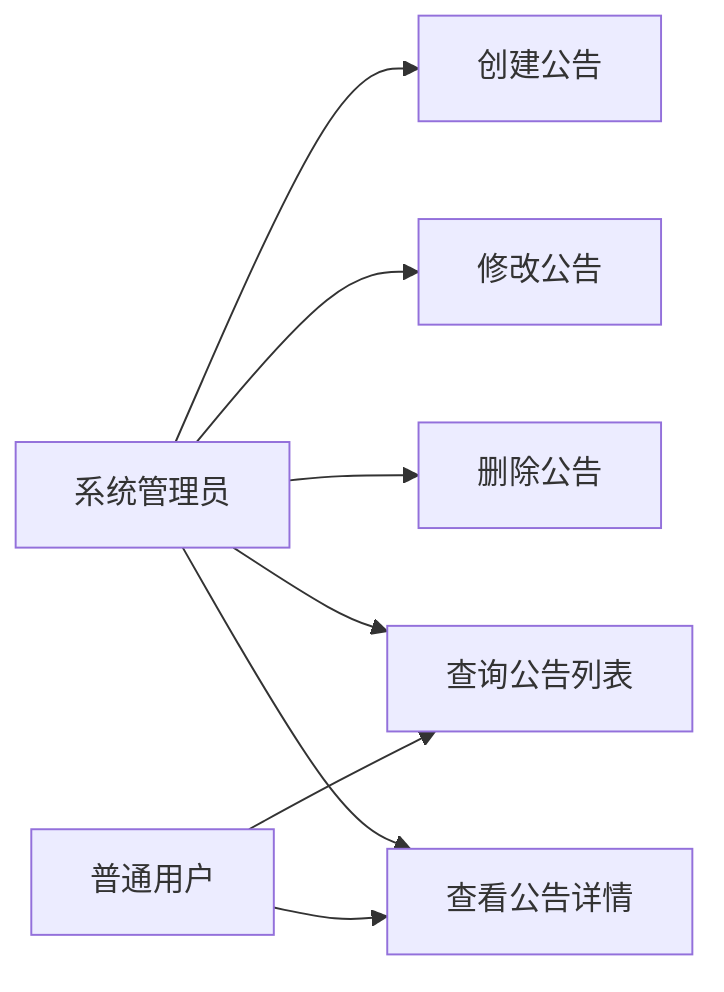
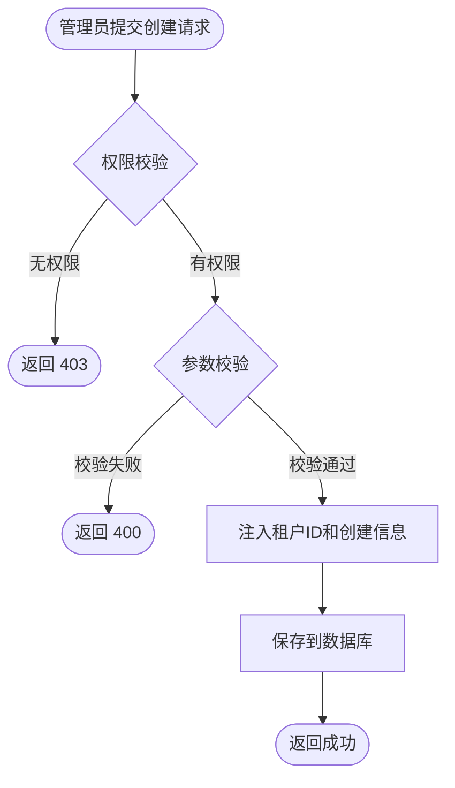
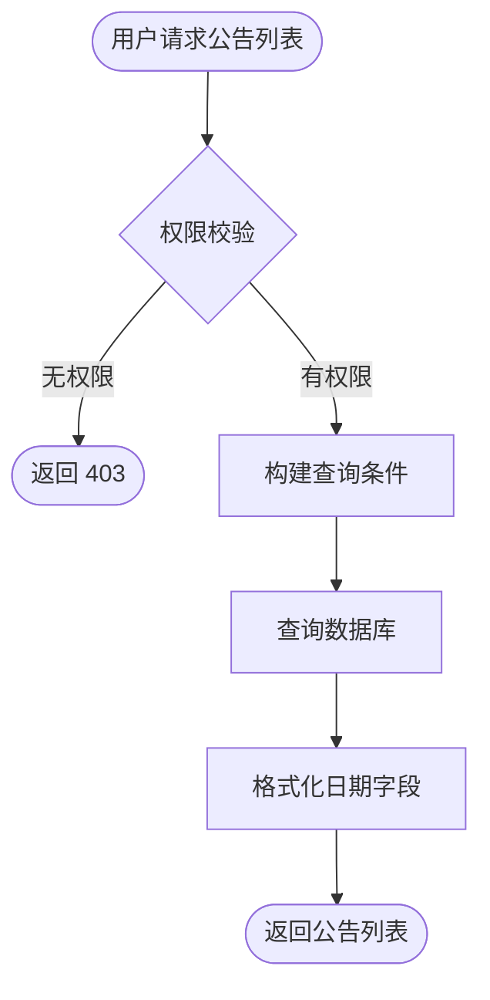
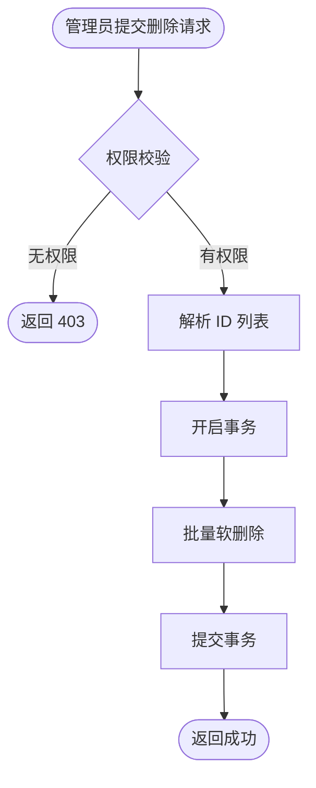
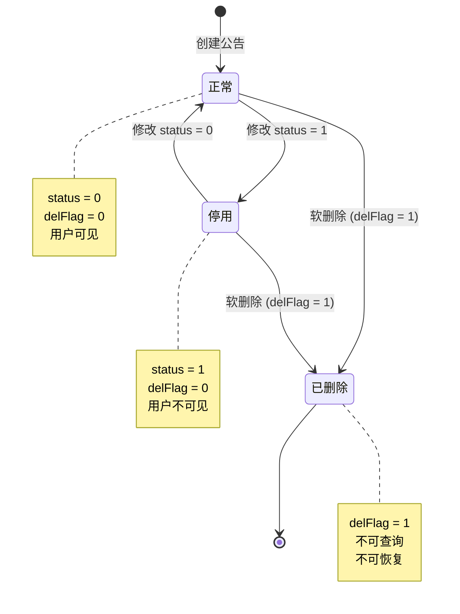

# 通知公告管理模块 — 需求文档

> 版本：1.0  
> 日期：2026-02-22  
> 状态：草案  
> 模块路径：`apps/backend/src/module/admin/system/notice`

---

## 1. 概述

### 1.1 背景

系统需要提供通知公告管理功能，用于发布系统通知、公司公告等信息。通知公告模块支持管理员发布、编辑、删除公告，用户可查看公告列表和详情。

### 1.2 目标

- 提供通知公告的创建、修改、删除、查询功能
- 支持按公告标题、类型、创建人筛选
- 支持公告状态管理（正常/停用）
- 支持分页查询公告列表
- 按租户隔离公告数据

### 1.3 范围

- 通知公告的 CRUD 操作
- 公告列表查询和筛选
- 公告状态管理
- 不包含：公告阅读统计、公告推送通知

---

## 2. 角色与用例

### 2.1 用例图



### 2.2 角色说明

| 角色       | 职责                     |
| ---------- | ------------------------ |
| 系统管理员 | 发布、编辑、删除通知公告 |
| 普通用户   | 查看通知公告列表和详情   |

---

## 3. 功能需求

### FR1: 创建通知公告

**描述**：管理员创建新的通知公告。

**前置条件**：

- 用户已登录且拥有 `system:notice:add` 权限

**输入**：

- noticeTitle: 公告标题（必填，最长 50 字符）
- noticeType: 公告类型（必填，1=通知，2=公告）
- noticeContent: 公告内容（可选，文本类型）
- status: 状态（可选，0=正常，1=停用，默认正常）
- remark: 备注（可选，最长 500 字符）

**处理逻辑**：

1. 验证输入参数
2. 自动注入 createBy、createTime、tenantId
3. 创建公告记录
4. 返回成功响应

**输出**：操作成功提示

**异常**：

- 权限不足：返回 403

### FR2: 查询公告列表

**描述**：分页查询通知公告列表，支持按标题、类型、创建人筛选。

**前置条件**：

- 用户已登录且拥有 `system:notice:list` 权限

**输入**：

- noticeTitle: 公告标题（可选，模糊匹配）
- noticeType: 公告类型（可选，精确匹配）
- createBy: 创建人（可选，模糊匹配）
- beginTime / endTime: 创建时间范围（可选）
- pageNum / pageSize: 分页参数

**处理逻辑**：

1. 构建查询条件，仅查询当前租户且未删除的记录
2. 按创建时间降序排列
3. 分页返回结果

**输出**：

- rows: 公告列表
- total: 总记录数

### FR3: 查看公告详情

**描述**：根据公告 ID 查询单条公告详情。

**前置条件**：

- 用户已登录且拥有 `system:notice:query` 权限

**输入**：noticeId（公告 ID）

**处理逻辑**：

1. 根据 ID 查询公告
2. 验证记录属于当前租户
3. 返回详情

**输出**：公告完整信息

**异常**：

- 公告不存在或已删除：返回 404
- 跨租户访问：返回 404

### FR4: 修改通知公告

**描述**：管理员修改通知公告内容。

**前置条件**：

- 用户已登录且拥有 `system:notice:edit` 权限

**输入**：

- noticeId: 公告 ID（必填）
- 其他字段同创建接口

**处理逻辑**：

1. 验证公告存在且属于当前租户
2. 更新公告信息
3. 自动更新 updateBy、updateTime

**输出**：操作成功提示

**异常**：

- 公告不存在：返回 404

### FR5: 删除通知公告

**描述**：批量软删除通知公告，支持逗号分隔的多个 ID。

**前置条件**：

- 用户已登录且拥有 `system:notice:remove` 权限

**输入**：ids（逗号分隔的公告 ID 字符串）

**处理逻辑**：

1. 解析 ID 列表
2. 批量软删除公告（设置 delFlag = '1'）
3. 使用事务保证原子性

**输出**：删除成功的记录数

---

## 4. 业务流程

### 4.1 公告创建流程



### 4.2 公告查询流程



### 4.3 公告删除流程



---

## 5. 状态说明

### 5.1 公告状态

| 状态   | 值  | 说明                  |
| ------ | --- | --------------------- |
| 正常   | 0   | 公告正常显示          |
| 停用   | 1   | 公告停用，不显示      |
| 已删除 | -   | delFlag = '1'，软删除 |

**状态转换**：



---

## 6. 验收标准

### AC1: 创建公告

- [ ] 填写完整信息后可成功创建公告
- [ ] 自动记录创建人、创建时间、租户 ID
- [ ] 公告默认为正常状态
- [ ] 无权限用户无法创建

### AC2: 查询公告列表

- [ ] 支持按公告标题、类型、创建人筛选
- [ ] 支持按创建时间范围筛选
- [ ] 分页正常，仅返回当前租户的公告
- [ ] 已删除公告不显示
- [ ] 停用公告在管理端显示，用户端不显示

### AC3: 查看公告详情

- [ ] 可查看公告完整信息
- [ ] 跨租户访问被阻止
- [ ] 已删除公告返回 404

### AC4: 修改公告

- [ ] 修改后公告信息立即生效
- [ ] 自动更新修改人、修改时间
- [ ] 跨租户修改被阻止

### AC5: 删除公告

- [ ] 支持批量删除（逗号分隔 ID）
- [ ] 删除后公告不在列表中显示
- [ ] 使用事务保证原子性

---

## 7. 非功能需求

### 7.1 性能要求

| 接口         | SLO 类别 | P99 延迟 | 说明           |
| ------------ | -------- | -------- | -------------- |
| 查询公告列表 | list     | < 500ms  | 单页 20 条     |
| 创建公告     | admin    | < 200ms  | 单条公告       |
| 修改公告     | admin    | < 200ms  | 单条公告       |
| 删除公告     | admin    | < 500ms  | 批量删除 10 条 |

### 7.2 安全要求

- 所有接口需权限校验
- 租户隔离：通过 Repository 自动过滤 tenantId
- 跨租户访问被阻止

### 7.3 可用性要求

- 公告删除使用软删除，支持数据恢复（需手动）
- 公告状态变更不需要重启服务

---

## 8. 数据模型

### 8.1 sys_notice 表结构

| 字段           | 类型         | 说明                       |
| -------------- | ------------ | -------------------------- |
| notice_id      | int          | 主键，自增                 |
| tenant_id      | varchar(20)  | 租户 ID，默认 '000000'     |
| notice_title   | varchar(50)  | 公告标题                   |
| notice_type    | char(1)      | 公告类型（1=通知，2=公告） |
| notice_content | text         | 公告内容                   |
| status         | char(1)      | 状态（0=正常，1=停用）     |
| create_by      | varchar(64)  | 创建人                     |
| create_time    | timestamp    | 创建时间                   |
| update_by      | varchar(64)  | 更新人                     |
| update_time    | timestamp    | 更新时间                   |
| del_flag       | char(1)      | 删除标识（0=正常，1=删除） |
| remark         | varchar(500) | 备注                       |

**索引**：

- 主键：notice_id
- 普通索引：(tenant_id, status)、(tenant_id, notice_type)、(tenant_id, create_time)、(tenant_id, del_flag, status)

---

## 9. 约束与限制

### 9.1 业务约束

- 公告标题最长 50 字符
- 公告内容为文本类型，无长度限制
- 公告类型需预定义（1=通知，2=公告）

### 9.2 技术约束

- 使用 SoftDeleteRepository 自动处理租户隔离和软删除
- 删除操作使用事务保证原子性

---

## 10. 缺陷分析

基于当前实现代码分析，识别以下缺陷：

### D1: 缺少公告标题唯一性校验（P2）

**现状**：创建和修改公告时未检查标题是否重复。

**影响**：可能存在多个同名公告，用户难以区分。

**建议**：

```typescript
const exists = await this.noticeRepo.existsByNoticeTitle(createNoticeDto.noticeTitle);
BusinessException.throwIf(exists, '公告标题已存在', ResponseCode.DATA_ALREADY_EXISTS);
```

### D2: 缺少公告阅读统计（P2）

**现状**：未记录公告的阅读次数和阅读人。

**影响**：无法统计公告的传播效果。

**建议**：

- 新增 readCount 字段记录阅读次数
- 新增 sys_notice_read 表记录阅读人和阅读时间

### D3: 缺少公告发布时间控制（P2）

**现状**：公告创建后立即生效，无法定时发布。

**影响**：无法提前准备公告并定时发布。

**建议**：

- 新增 publishTime 字段
- 查询公告时过滤未到发布时间的公告

### D4: 缺少公告置顶功能（P2）

**现状**：公告仅按创建时间排序，无法置顶重要公告。

**影响**：重要公告可能被新公告覆盖。

**建议**：

- 新增 isTop 字段
- 查询时先按 isTop 降序，再按 createTime 降序

### D5: 缺少公告附件功能（P3）

**现状**：公告仅支持文本内容，不支持附件。

**影响**：无法发布带附件的公告（如文档、图片）。

**建议**：

- 新增 sys_notice_attachment 表
- 关联 sys_upload 表存储附件

---

## 11. 附录

### 11.1 相关文档

- [设计文档](../../design/admin/system/notice-design.md)
- [后端开发规范](../../../../../.kiro/steering/backend-nestjs.md)

### 11.2 术语表

| 术语     | 说明                       |
| -------- | -------------------------- |
| 通知公告 | 系统发布的通知或公告信息   |
| 公告类型 | 区分通知和公告的分类       |
| 公告状态 | 标识公告是否正常显示       |
| 软删除   | 标记删除但不删除数据库记录 |

### 11.3 变更记录

| 版本 | 日期       | 变更内容 | 作者 |
| ---- | ---------- | -------- | ---- |
| 1.0  | 2026-02-22 | 初始版本 | Kiro |
