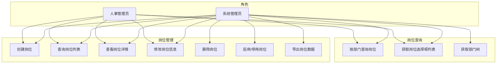
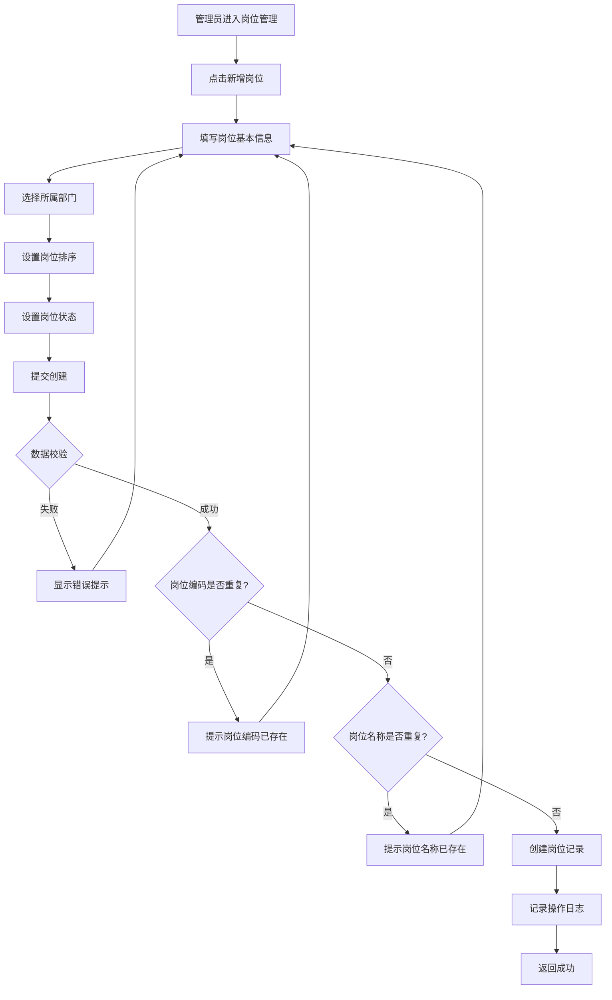
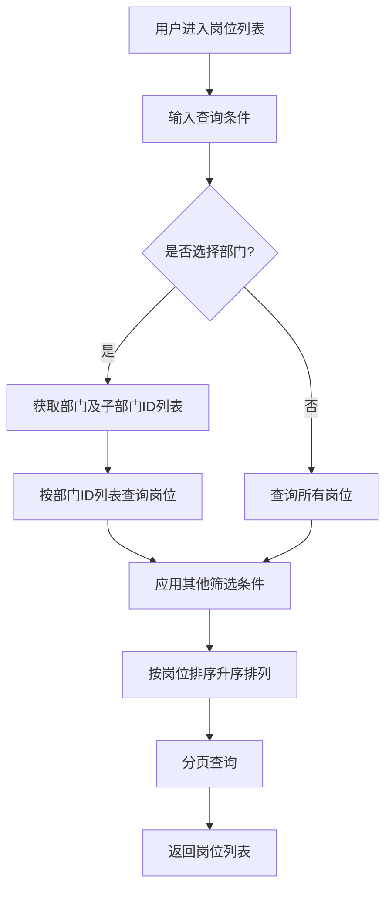
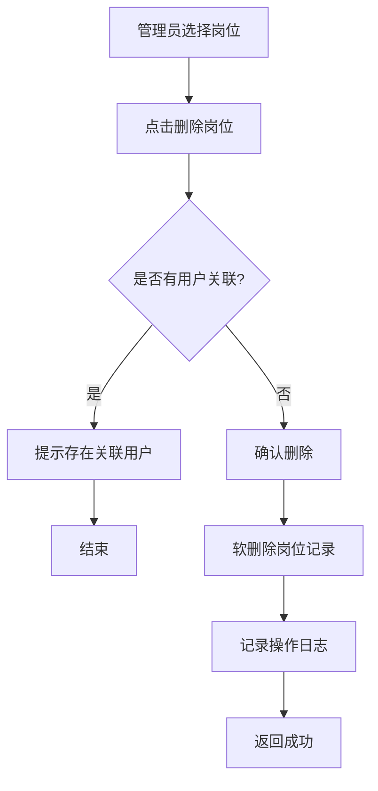
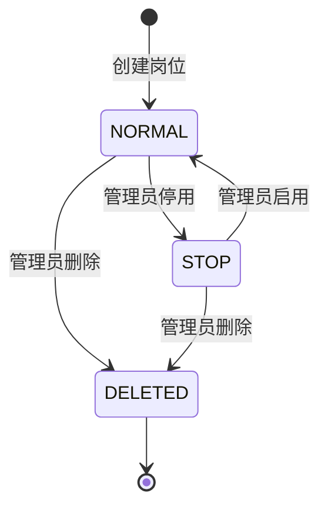

# 岗位管理模块 (System Post) — 需求文档

> 版本：1.0  
> 日期：2026-02-22  
> 状态：草案  
> 关联设计：[post-design.md](../../../design/admin/system/post-design.md)

---

## 1. 概述

### 1.1 背景

岗位管理模块 (`module/admin/system/post`) 是后台管理系统的基础模块，负责岗位的全生命周期管理，包括岗位的创建、查询、修改、删除、状态管理等功能。该模块与用户模块、部门模块紧密关联，是组织架构管理的重要组成部分。

当前实现已支持完整的岗位 CRUD 操作、岗位与部门关联、岗位选择框列表等功能，但在以下方面存在改进空间：

1. 删除岗位前未检查是否有用户关联
2. 缺少岗位使用情况统计
3. 岗位与部门的关联关系不够灵活
4. 缺少岗位批量操作功能

### 1.2 目标

1. 完善岗位管理的核心功能，提升管理效率
2. 增强岗位与部门的关联管理
3. 优化岗位查询和筛选功能
4. 为后续扩展（如岗位职责、岗位等级）预留接口

### 1.3 范围

| 在范围内                  | 不在范围内               |
| ------------------------- | ------------------------ |
| 岗位基本信息管理          | 岗位职责管理（后续迭代） |
| 岗位状态管理（启用/停用） | 岗位等级管理（后续迭代） |
| 岗位与部门关联            | 岗位薪资管理（业务功能） |
| 岗位列表查询和导出        | 岗位绩效管理（业务功能） |
| 岗位选择框列表            | 岗位晋升管理（后续迭代） |
| 岗位批量删除              | 岗位培训管理（后续迭代） |

---

## 2. 角色与用例

> 图 1：岗位管理模块用例图

---

## 3. 业务流程

### 3.1 创建岗位流程

> 图 2：创建岗位活动图

### 3.2 查询岗位流程

> 图 3：查询岗位活动图

### 3.3 删除岗位流程

> 图 4：删除岗位活动图

---

## 4. 状态说明

### 4.1 岗位状态机

> 图 5：岗位状态图

**状态说明**：

- `NORMAL (0)`：正常状态，岗位可以正常使用
- `STOP (1)`：停用状态，岗位不可用，但数据保留
- `DELETED (2)`：删除状态，软删除，数据标记为删除但不物理删除

---

## 5. 功能需求

### 5.1 创建岗位 (POST /system/post)

**功能描述**：管理员创建新岗位，可关联部门。

**前置条件**：

- 用户已登录
- 拥有 `system:post:add` 权限

**输入**：

- `postName`: 岗位名称（必填，0-50 字符）
- `postCode`: 岗位编码（必填，0-64 字符）
- `deptId`: 部门ID（可选）
- `postCategory`: 类别编码（可选，0-100 字符）
- `postSort`: 岗位排序（可选，数字）
- `status`: 岗位状态（可选，0=正常 1=停用）
- `remark`: 备注（可选，0-500 字符）

**输出**：

- 成功：返回 200，无数据
- 失败：返回错误信息

**业务规则**：

1. 岗位编码在同一租户下必须唯一
2. 岗位名称在同一租户下必须唯一
3. 默认岗位状态为正常（0）
4. 默认岗位排序为 0
5. 创建岗位时自动设置创建人和创建时间
6. 记录操作日志

**异常处理**：

- 岗位编码已存在：返回 400，"岗位编码已存在"
- 岗位名称已存在：返回 400，"岗位名称已存在"
- 部门不存在：返回 400，"部门不存在"

### 5.2 查询岗位列表 (GET /system/post/list)

**功能描述**：分页查询岗位列表，支持多条件筛选。

**前置条件**：

- 用户已登录
- 拥有 `system:post:list` 权限

**输入**：

- `pageNum`: 页码（可选，默认 1）
- `pageSize`: 每页数量（可选，默认 10）
- `postName`: 岗位名称（可选，模糊查询）
- `postCode`: 岗位编码（可选，模糊查询）
- `status`: 岗位状态（可选）
- `belongDeptId`: 所属部门ID（可选）

**输出**：

- `rows`: 岗位列表
- `total`: 总记录数

**业务规则**：

1. 支持按岗位名称模糊查询
2. 支持按岗位编码模糊查询
3. 支持按状态筛选
4. 支持按部门筛选（包含子部门）
5. 按岗位排序（postSort）升序排列
6. 仅查询未删除的岗位

**异常处理**：

- 无权限：返回 403，"无权限访问"

### 5.3 查看岗位详情 (GET /system/post/:id)

**功能描述**：根据岗位ID获取岗位详细信息。

**前置条件**：

- 用户已登录
- 拥有 `system:post:query` 权限

**输入**：

- `id`: 岗位ID（路径参数）

**输出**：

- 岗位详细信息

**业务规则**：

1. 查询岗位基本信息
2. 返回完整的岗位字段

**异常处理**：

- 岗位不存在：返回 404，"岗位不存在"
- 无权限：返回 403，"无权限访问"

### 5.4 修改岗位信息 (PUT /system/post)

**功能描述**：修改岗位的基本信息。

**前置条件**：

- 用户已登录
- 拥有 `system:post:edit` 权限

**输入**：

- `postId`: 岗位ID（必填）
- 其他字段与创建岗位相同（可选）

**输出**：

- 成功：返回 200，更新后的岗位信息
- 失败：返回错误信息

**业务规则**：

1. 修改岗位基本信息
2. 更新岗位的修改人和修改时间
3. 记录操作日志
4. 岗位编码不能与其他岗位重复
5. 岗位名称不能与其他岗位重复

**异常处理**：

- 岗位不存在：返回 404，"岗位不存在"
- 无权限：返回 403，"无权限访问"
- 岗位编码已存在：返回 400，"岗位编码已存在"
- 岗位名称已存在：返回 400，"岗位名称已存在"

### 5.5 删除岗位 (DELETE /system/post/:ids)

**功能描述**：批量删除岗位（软删除）。

**前置条件**：

- 用户已登录
- 拥有 `system:post:remove` 权限

**输入**：

- `ids`: 岗位ID，多个用逗号分隔（路径参数）

**输出**：

- 成功：返回 200，删除的记录数
- 失败：返回错误信息

**业务规则**：

1. 软删除，设置 `del_flag=2`
2. 删除前检查是否有用户关联（建议）
3. 批量删除时，如果某个岗位删除失败，继续删除其他岗位
4. 记录操作日志

**异常处理**：

- 无权限：返回 403，"无权限访问"
- 存在关联用户：返回 400，"该岗位存在关联用户，无法删除"（建议）

### 5.6 获取岗位选择框列表 (GET /system/post/optionselect)

**功能描述**：获取岗位选择框列表，用于其他模块选择岗位。

**前置条件**：

- 用户已登录

**输入**：

- `deptId`: 部门ID（可选）
- `postIds`: 岗位ID列表，逗号分隔（可选）

**输出**：

- 岗位列表（仅包含 postId、postCode、postName、postSort）

**业务规则**：

1. 查询所有正常状态的岗位
2. 如果指定了部门ID，仅返回该部门的岗位
3. 如果指定了岗位ID列表，仅返回这些岗位
4. 按岗位排序升序排列

**异常处理**：无

### 5.7 获取部门树 (GET /system/post/deptTree)

**功能描述**：获取部门树形结构，用于岗位筛选和分配。

**前置条件**：

- 用户已登录

**输入**：无

**输出**：

- 部门树形结构

**业务规则**：

1. 查询所有正常状态的部门
2. 构建树形结构
3. 按排序字段排序

**异常处理**：无

### 5.8 导出岗位数据 (POST /system/post/export)

**功能描述**：导出岗位信息数据为 Excel 文件。

**前置条件**：

- 用户已登录
- 拥有 `system:post:export` 权限

**输入**：

- 与查询岗位列表相同的筛选条件

**输出**：

- Excel 文件流

**业务规则**：

1. 根据筛选条件查询岗位列表（不分页）
2. 生成 Excel 文件
3. 记录操作日志
4. 导出字段：岗位序号、岗位编码、岗位名称、岗位排序、状态

**异常处理**：

- 无权限：返回 403，"无权限访问"
- 数据量过大：返回 400，"导出数据量过大，请缩小查询范围"

---

## 6. 验收标准

### 6.1 岗位管理功能

| 编号 | 验收条件                                 | 可测试方式            |
| ---- | ---------------------------------------- | --------------------- |
| AC-1 | 创建岗位时，岗位编码在同一租户下必须唯一 | 单元测试              |
| AC-2 | 创建岗位时，岗位名称在同一租户下必须唯一 | 单元测试              |
| AC-3 | 创建岗位时，默认岗位状态为正常（0）      | 单元测试              |
| AC-4 | 创建岗位时，自动设置创建人和创建时间     | 单元测试 + 数据库检查 |
| AC-5 | 修改岗位时，岗位编码不能与其他岗位重复   | 单元测试              |
| AC-6 | 修改岗位时，岗位名称不能与其他岗位重复   | 单元测试              |
| AC-7 | 删除岗位时，使用软删除，数据不物理删除   | 单元测试 + 数据库检查 |
| AC-8 | 删除岗位时，批量删除指定的岗位           | 集成测试              |

### 6.2 岗位查询功能

| 编号  | 验收条件                                     | 可测试方式 |
| ----- | -------------------------------------------- | ---------- |
| AC-9  | 查询岗位列表时，支持按岗位名称模糊查询       | 单元测试   |
| AC-10 | 查询岗位列表时，支持按岗位编码模糊查询       | 单元测试   |
| AC-11 | 查询岗位列表时，支持按状态筛选               | 单元测试   |
| AC-12 | 查询岗位列表时，支持按部门筛选（包含子部门） | 集成测试   |
| AC-13 | 查询岗位列表时，按岗位排序升序排列           | 单元测试   |
| AC-14 | 获取岗位选择框列表时，仅返回正常状态的岗位   | 单元测试   |

---

## 7. 非功能需求

| 维度   | 要求                                                             |
| ------ | ---------------------------------------------------------------- |
| 性能   | 岗位列表查询 P95 小于等于 200ms                                  |
| 性能   | 岗位详情查询 P95 小于等于 100ms                                  |
| 性能   | 岗位创建/修改 P95 小于等于 200ms                                 |
| 可用性 | 岗位管理接口可用性 99.9%                                         |
| 安全   | 岗位操作需要对应权限（system:post:add/edit/remove/query/export） |
| 幂等   | 删除岗位接口幂等                                                 |
| 幂等   | 修改岗位接口幂等                                                 |
| 可观测 | 所有岗位操作记录操作日志，包含操作人、操作时间、操作内容         |
| 扩展性 | 支持扩展岗位字段（如岗位职责、岗位等级）                         |

---

## 8. 现有实现分析

### 8.1 已实现功能

| 功能               | 实现状态 | 代码位置                                | 说明                           |
| ------------------ | -------- | --------------------------------------- | ------------------------------ |
| 创建岗位           | ✅ 完整  | `post.controller.ts` - `create()`       | 支持关联部门                   |
| 查询岗位列表       | ✅ 完整  | `post.controller.ts` - `findAll()`      | 支持多条件筛选，包含按部门筛选 |
| 查看岗位详情       | ✅ 完整  | `post.controller.ts` - `findOne()`      | 返回完整的岗位字段             |
| 修改岗位信息       | ✅ 完整  | `post.controller.ts` - `update()`       | 修改岗位基本信息               |
| 删除岗位           | ✅ 完整  | `post.controller.ts` - `remove()`       | 软删除，批量删除               |
| 获取岗位选择框列表 | ✅ 完整  | `post.controller.ts` - `optionselect()` | 支持按部门和岗位ID筛选         |
| 获取部门树         | ✅ 完整  | `post.controller.ts` - `deptTree()`     | 用于岗位筛选                   |
| 导出岗位数据       | ✅ 完整  | `post.controller.ts` - `export()`       | 导出为 Excel                   |
| 操作日志记录       | ✅ 完整  | 使用 `@Operlog` 装饰器                  | 自动记录操作日志               |

### 8.2 待优化功能

| 功能             | 实现状态  | 优先级 | 说明                     |
| ---------------- | --------- | ------ | ------------------------ |
| 岗位职责管理     | ❌ 未实现 | P2     | 定义岗位的职责和要求     |
| 岗位等级管理     | ❌ 未实现 | P3     | 定义岗位的等级和晋升路径 |
| 岗位使用情况统计 | ❌ 未实现 | P2     | 统计岗位被多少用户使用   |
| 岗位批量导入     | ❌ 未实现 | P2     | 支持 Excel 批量导入岗位  |
| 岗位状态变更审计 | ❌ 未实现 | P3     | 记录岗位状态变更历史     |

### 8.3 现有缺陷分析

经过仔细审查代码和项目结构，发现以下问题：

#### 8.3.1 删除岗位前未检查用户关联

**问题描述**：

- `remove()` 方法直接软删除岗位，未检查是否有用户关联
- 可能导致用户关联的岗位被删除，数据一致性问题

**影响**：

- 数据一致性问题
- 用户的岗位信息可能丢失

**建议**：

- 删除前检查是否有用户关联（使用 `countUsers()` 方法）
- 如果存在关联用户，提示用户先解除关联或禁止删除

#### 8.3.2 岗位编码和名称唯一性校验缺失

**问题描述**：

- 创建和修改岗位时，未校验岗位编码和名称的唯一性
- Repository 提供了 `existsByPostCode()` 和 `existsByPostName()` 方法，但未在 Service 中使用

**影响**：

- 可能创建重复的岗位编码或名称
- 数据质量问题

**建议**：

- 在创建岗位前，校验岗位编码和名称是否已存在
- 在修改岗位时，校验岗位编码和名称是否与其他岗位重复

#### 8.3.3 岗位使用情况统计不足

**问题描述**：

- 无法查看岗位被多少用户使用
- 无法统计岗位的使用情况

**影响**：

- 无法评估岗位的重要性
- 删除岗位时无法评估影响范围

**建议**：

- 在岗位详情页展示使用该岗位的用户数量
- 提供岗位使用情况统计接口

#### 8.3.4 岗位与部门的关联关系不够灵活

**问题描述**：

- 一个岗位只能关联一个部门
- 无法支持跨部门的岗位（如总经理、项目经理）

**影响**：

- 组织架构灵活性不足
- 无法满足复杂的组织架构需求

**建议**：

- 考虑支持一个岗位关联多个部门
- 或者支持岗位不关联部门（全局岗位）

#### 8.3.5 缺少岗位批量操作功能

**问题描述**：

- 仅支持批量删除，不支持批量启用/停用
- 不支持批量导入岗位

**影响**：

- 管理大量岗位时效率低
- 初始化系统时需要逐个创建岗位

**建议**：

- 实现批量启用/停用接口
- 实现 Excel 批量导入岗位功能

---

## 9. 与市面上产品的差距

### 9.1 与主流后台管理系统对比

| 功能              | 本系统 | RuoYi-Vue-Plus | Ant Design Pro | 说明         |
| ----------------- | ------ | -------------- | -------------- | ------------ |
| 岗位基本管理      | ✅     | ✅             | ✅             | 基础功能     |
| 岗位与部门关联    | ✅     | ✅             | ✅             | 基础功能     |
| 岗位批量删除      | ✅     | ✅             | ✅             | 基础功能     |
| 岗位导出          | ✅     | ✅             | ✅             | 基础功能     |
| 岗位批量导入      | ❌     | ✅             | ✅             | 本系统未实现 |
| 岗位批量启用/停用 | ❌     | ✅             | ✅             | 本系统未实现 |
| 岗位使用情况统计  | ❌     | ✅             | ❌             | 本系统未实现 |
| 岗位职责管理      | ❌     | ✅             | ❌             | 本系统未实现 |
| 岗位等级管理      | ❌     | ❌             | ✅             | 本系统未实现 |
| 岗位唯一性校验    | ❌     | ✅             | ✅             | 本系统未实现 |
| 删除前关联检查    | ❌     | ✅             | ✅             | 本系统未实现 |

### 9.2 差距总结

1. **基础功能完善度**：本系统已实现核心的岗位管理功能，满足基本需求
2. **数据校验**：缺少岗位编码和名称的唯一性校验，缺少删除前的关联检查
3. **批量操作**：缺少批量启用/停用、批量导入等提升效率的功能
4. **可观测性**：缺少岗位使用情况统计等功能
5. **扩展性**：缺少岗位职责、岗位等级等扩展功能

---

## 10. 改进建议与待办事项

### 10.1 短期改进（1-2 个迭代）

| 优先级 | 功能               | 工作量 | 说明                                 |
| ------ | ------------------ | ------ | ------------------------------------ |
| P0     | 实现唯一性校验     | 1 天   | 创建和修改时校验岗位编码和名称唯一性 |
| P0     | 删除前检查用户关联 | 1 天   | 删除前检查是否有用户关联             |
| P1     | 实现岗位批量导入   | 3 天   | 支持 Excel 批量导入岗位              |
| P1     | 实现批量启用/停用  | 1 天   | 批量修改岗位状态                     |

### 10.2 中期改进（3-6 个月）

| 优先级 | 功能                 | 工作量 | 说明                     |
| ------ | -------------------- | ------ | ------------------------ |
| P2     | 实现岗位使用情况统计 | 2 天   | 统计岗位被多少用户使用   |
| P2     | 实现岗位职责管理     | 5 天   | 定义岗位的职责和要求     |
| P2     | 优化岗位与部门关联   | 3 天   | 支持一个岗位关联多个部门 |

### 10.3 长期规划（6 个月以上）

| 优先级 | 功能                 | 工作量 | 说明                     |
| ------ | -------------------- | ------ | ------------------------ |
| P3     | 实现岗位等级管理     | 5 天   | 定义岗位的等级和晋升路径 |
| P3     | 实现岗位状态变更审计 | 3 天   | 记录岗位状态变更历史     |

### 10.4 技术债务

| 问题                         | 影响       | 建议                       |
| ---------------------------- | ---------- | -------------------------- |
| 删除岗位前未检查用户关联     | 数据一致性 | 立即修复，确保数据一致性   |
| 岗位编码和名称唯一性校验缺失 | 数据质量   | 立即修复，确保数据质量     |
| 岗位使用情况统计不足         | 可观测性   | 补充实现，提升系统可观测性 |
| 岗位与部门的关联关系不够灵活 | 扩展性     | 中期改进，提升系统灵活性   |
| 缺少岗位批量操作             | 效率低     | 补充实现，提升管理效率     |

---

## 11. 附录

### 11.1 相关文档

- [岗位管理模块设计文档](../../../design/admin/system/post-design.md)
- [用户管理模块需求文档](./user-requirements.md)
- [部门管理模块需求文档](./dept-requirements.md)
- [后端开发规范](../../../../../.kiro/steering/backend-nestjs.md)

### 11.2 参考资料

- [组织架构管理最佳实践](https://www.owasp.org/index.php/Access_Control_Cheat_Sheet)
- [RuoYi-Vue-Plus 岗位管理](https://gitee.com/dromara/RuoYi-Vue-Plus)

### 11.3 术语表

| 术语     | 说明                                 |
| -------- | ------------------------------------ |
| 岗位     | 组织中的职位，如经理、工程师、助理等 |
| 岗位编码 | 岗位的唯一标识符                     |
| 岗位名称 | 岗位的名称                           |
| 岗位排序 | 岗位的显示顺序                       |
| 岗位状态 | 岗位的启用/停用状态                  |
| 软删除   | 标记为删除但不物理删除数据           |
| 岗位职责 | 岗位的职责和要求                     |
| 岗位等级 | 岗位的等级和晋升路径                 |
