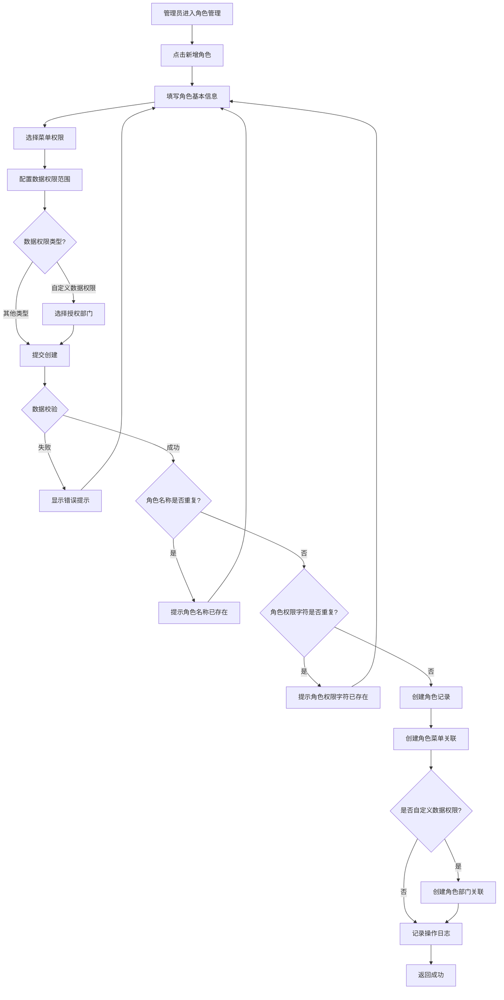
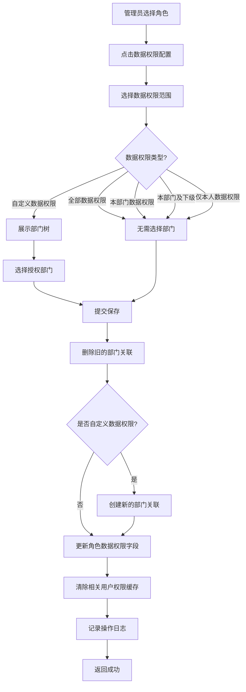
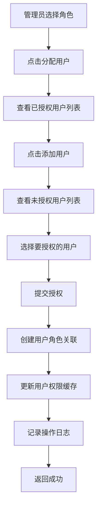
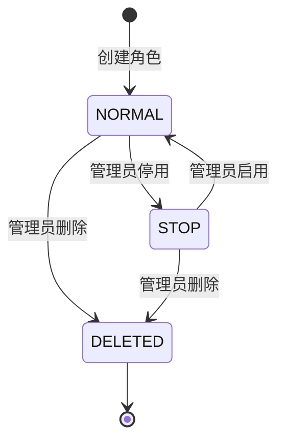
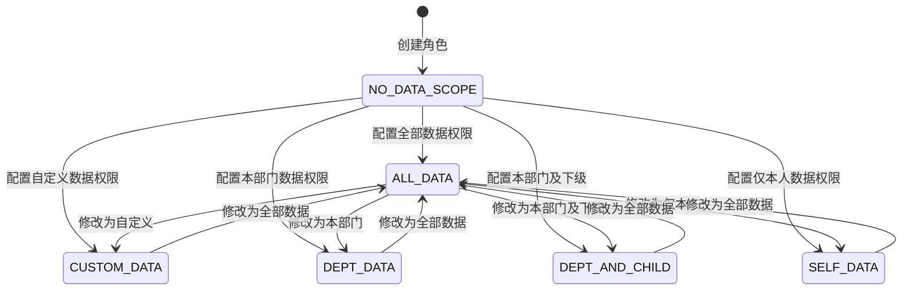

# 角色管理模块 (System Role) — 需求文档

> 版本：1.0  
> 日期：2026-02-22  
> 状态：草案  
> 关联设计：[role-design.md](../../../design/admin/system/role-design.md)

---

## 1. 概述

### 1.1 背景

角色管理模块 (`module/admin/system/role`) 是后台管理系统 RBAC 权限体系的核心模块，负责角色的全生命周期管理，包括角色的创建、查询、修改、删除、权限分配、数据权限配置、用户授权等功能。该模块与用户模块、菜单模块、部门模块紧密关联，是整个权限体系的中枢。

当前实现已支持完整的角色 CRUD 操作、菜单权限分配、数据权限配置、用户授权管理、角色导出等功能，但在以下方面存在改进空间：

1. 角色权限变更缺少审计日志
2. 角色复制功能缺失，创建相似角色效率低
3. 角色使用情况统计不足
4. 角色权限预览功能不够直观

### 1.2 目标

1. 完善角色管理的核心功能，提升管理效率
2. 增强角色权限配置的可视化和易用性
3. 增强角色操作的可追溯性和安全性
4. 为后续扩展（如角色模板、角色继承）预留接口

### 1.3 范围

| 在范围内                  | 不在范围内                 |
| ------------------------- | -------------------------- |
| 角色基本信息管理          | 角色继承机制（后续迭代）   |
| 角色菜单权限分配          | 角色模板管理（后续迭代）   |
| 角色数据权限配置          | 角色审批流程（独立功能）   |
| 角色状态管理（启用/停用） | 角色有效期管理（后续迭代） |
| 角色用户授权管理          | 角色动态权限（后续迭代）   |
| 角色列表查询和导出        | 角色使用分析（后续迭代）   |
| 角色权限预览              | 角色权限对比（后续迭代）   |

---

## 2. 角色与用例

> 图 1：角色管理模块用例图

```mermaid
graph TB
    subgraph 角色
        ADMIN[系统管理员]
        DEPT_ADMIN[部门管理员]
    end

    subgraph 角色管理
        UC1[创建角色]
        UC2[查询角色列表]
        UC3[查看角色详情]
        UC4[修改角色信息]
        UC5[删除角色]
        UC6[启用/停用角色]
        UC7[分配菜单权限]
        UC8[配置数据权限]
        UC9[导出角色数据]
        UC10[获取角色选择框]
    end

    subgraph 用户授权
        UC11[查看已授权用户]
        UC12[查看未授权用户]
        UC13[授权用户到角色]
        UC14[取消用户授权]
        UC15[批量授权用户]
        UC16[批量取消授权]
    end

    subgraph 权限查询
        UC17[获取角色权限列表]
        UC18[获取部门树]
    end

    ADMIN --> UC1
    ADMIN --> UC2
    ADMIN --> UC3
    ADMIN --> UC4
    ADMIN --> UC5
    ADMIN --> UC6
    ADMIN --> UC7
    ADMIN --> UC8
    ADMIN --> UC9
    ADMIN --> UC10
    ADMIN --> UC11
    ADMIN --> UC12
    ADMIN --> UC13
    ADMIN --> UC14
    ADMIN --> UC15
    ADMIN --> UC16
    ADMIN --> UC17
    ADMIN --> UC18

    DEPT_ADMIN --> UC2
    DEPT_ADMIN --> UC3
    DEPT_ADMIN --> UC11
```

---

## 3. 业务流程

### 3.1 创建角色流程

> 图 2：创建角色活动图

### 3.2 配置数据权限流程

> 图 3：配置数据权限活动图

### 3.3 用户授权流程

> 图 4：用户授权活动图

---

## 4. 状态说明

### 4.1 角色状态机

> 图 5：角色状态图

**状态说明**：

- `NORMAL (0)`：正常状态，角色可以被分配给用户
- `STOP (1)`：停用状态，角色不能被分配，已分配的用户权限失效
- `DELETED (2)`：删除状态，软删除，数据标记为删除但不物理删除

### 4.2 数据权限状态

> 图 6：数据权限配置状态图

**数据权限类型说明**：

- `ALL_DATA (1)`：全部数据权限，可以查看所有数据
- `CUSTOM_DATA (2)`：自定义数据权限，可以查看指定部门的数据
- `DEPT_DATA (3)`：本部门数据权限，只能查看本部门的数据
- `DEPT_AND_CHILD (4)`：本部门及下级数据权限，可以查看本部门及下级部门的数据
- `SELF_DATA (5)`：仅本人数据权限，只能查看自己的数据

---

## 5. 功能需求

### 5.1 创建角色 (POST /system/role)

**功能描述**：管理员创建新角色，可同时分配菜单权限和配置数据权限。

**前置条件**：

- 用户已登录
- 拥有 `system:role:add` 权限

**输入**：

- `roleName`: 角色名称（必填，0-30 字符，租户内唯一）
- `roleKey`: 角色权限字符（必填，0-100 字符，租户内唯一）
- `roleSort`: 角色排序（可选，数字，默认 0）
- `status`: 角色状态（可选，0=正常 1=停用，默认 0）
- `dataScope`: 数据权限范围（可选，1-5，默认 5）
- `menuIds`: 菜单ID列表（可选）
- `deptIds`: 部门ID列表（可选，仅当 dataScope=2 时有效）
- `remark`: 备注（可选，0-500 字符）
- `menuCheckStrictly`: 菜单树选择项是否关联显示（可选，布尔值）
- `deptCheckStrictly`: 部门树选择项是否关联显示（可选，布尔值）

**输出**：

- 成功：返回 200，创建的角色信息
- 失败：返回错误信息

**业务规则**：

1. 角色名称在同一租户下必须唯一
2. 角色权限字符在同一租户下必须唯一
3. 默认角色状态为正常（0）
4. 默认数据权限为仅本人（5）
5. 创建角色时自动设置创建人和创建时间
6. 如果指定了菜单权限，创建角色菜单关联记录
7. 如果数据权限为自定义（2）且指定了部门，创建角色部门关联记录
8. 记录操作日志

**异常处理**：

- 角色名称已存在：返回 400，"角色名称已存在"
- 角色权限字符已存在：返回 400，"角色权限字符已存在"
- 菜单不存在：返回 400，"菜单不存在"
- 部门不存在：返回 400，"部门不存在"

### 5.2 查询角色列表 (GET /system/role/list)

**功能描述**：分页查询角色列表，支持多条件筛选。

**前置条件**：

- 用户已登录
- 拥有 `system:role:list` 权限

**输入**：

- `pageNum`: 页码（可选，默认 1）
- `pageSize`: 每页数量（可选，默认 10）
- `roleName`: 角色名称（可选，模糊查询）
- `roleKey`: 角色权限字符（可选，模糊查询）
- `roleId`: 角色ID（可选，精确查询）
- `status`: 角色状态（可选）
- `params.beginTime`: 开始时间（可选）
- `params.endTime`: 结束时间（可选）

**输出**：

- `rows`: 角色列表（包含菜单数量）
- `total`: 总记录数

**业务规则**：

1. 支持按角色名称、角色权限字符模糊查询
2. 支持按状态、创建时间范围筛选
3. 返回结果包含角色关联的菜单数量
4. 按角色排序字段升序排列
5. 仅查询未删除的角色

**异常处理**：

- 无权限：返回 403，"无权限访问"

### 5.3 查看角色详情 (GET /system/role/:id)

**功能描述**：根据角色ID获取角色详细信息，包括菜单权限和数据权限。

**前置条件**：

- 用户已登录
- 拥有 `system:role:query` 权限

**输入**：

- `id`: 角色ID（路径参数）

**输出**：

- 角色基本信息
- 角色关联的菜单ID列表
- 角色关联的部门ID列表（如果是自定义数据权限）

**业务规则**：

1. 查询角色基本信息
2. 查询角色关联的菜单ID列表
3. 如果是自定义数据权限，查询角色关联的部门ID列表

**异常处理**：

- 角色不存在：返回 404，"角色不存在"
- 无权限：返回 403，"无权限访问"

### 5.4 修改角色信息 (PUT /system/role)

**功能描述**：修改角色的基本信息和菜单权限。

**前置条件**：

- 用户已登录
- 拥有 `system:role:edit` 权限

**输入**：

- `roleId`: 角色ID（必填）
- 其他字段与创建角色相同（可选）

**输出**：

- 成功：返回 200，更新后的角色信息
- 失败：返回错误信息

**业务规则**：

1. 修改角色基本信息
2. 先删除旧的菜单关联，再创建新的
3. 更新角色的修改人和修改时间
4. 清除相关用户的权限缓存
5. 记录操作日志

**异常处理**：

- 角色不存在：返回 404，"角色不存在"
- 无权限：返回 403，"无权限访问"
- 角色名称已存在：返回 400，"角色名称已存在"
- 角色权限字符已存在：返回 400，"角色权限字符已存在"

### 5.5 配置数据权限 (PUT /system/role/dataScope)

**功能描述**：修改角色的数据权限范围和授权部门。

**前置条件**：

- 用户已登录
- 拥有 `system:role:edit` 权限

**输入**：

- `roleId`: 角色ID（必填）
- `dataScope`: 数据权限范围（必填，1-5）
- `deptIds`: 部门ID列表（可选，仅当 dataScope=2 时有效）

**输出**：

- 成功：返回 200，更新后的角色信息
- 失败：返回错误信息

**业务规则**：

1. 先删除旧的部门关联
2. 如果是自定义数据权限（2）且指定了部门，创建新的部门关联
3. 更新角色的数据权限字段
4. 清除相关用户的权限缓存
5. 记录操作日志

**异常处理**：

- 角色不存在：返回 404，"角色不存在"
- 无权限：返回 403，"无权限访问"
- 部门不存在：返回 400，"部门不存在"

### 5.6 启用/停用角色 (PUT /system/role/changeStatus)

**功能描述**：修改角色的启用/停用状态。

**前置条件**：

- 用户已登录
- 拥有 `system:role:edit` 权限

**输入**：

- `roleId`: 角色ID（必填）
- `status`: 角色状态（必填，0=正常 1=停用）

**输出**：

- 成功：返回 200，更新后的角色信息
- 失败：返回错误信息

**业务规则**：

1. 更新角色状态
2. 停用角色后，清除相关用户的权限缓存
3. 记录操作日志

**异常处理**：

- 角色不存在：返回 404，"角色不存在"
- 无权限：返回 403，"无权限访问"

### 5.7 删除角色 (DELETE /system/role/:id)

**功能描述**：批量删除角色（软删除）。

**前置条件**：

- 用户已登录
- 拥有 `system:role:remove` 权限

**输入**：

- `id`: 角色ID，多个用逗号分隔（路径参数）

**输出**：

- 成功：返回 200，删除的记录数
- 失败：返回错误信息

**业务规则**：

1. 软删除，设置 `del_flag=2`
2. 不能删除超级管理员角色（roleId=1）
3. 批量删除时，如果某个角色删除失败，继续删除其他角色
4. 清除相关用户的权限缓存
5. 记录操作日志

**异常处理**：

- 无权限：返回 403，"无权限访问"
- 删除超级管理员角色：返回 400，"不能删除超级管理员角色"
- 角色已分配给用户：返回 400，"角色已分配给用户，不能删除"（建议）

### 5.8 获取角色选择框列表 (GET /system/role/optionselect)

**功能描述**：获取角色选择框列表，用于其他模块选择角色。

**前置条件**：

- 用户已登录

**输入**：

- `roleIds`: 角色ID列表，逗号分隔（可选，用于过滤）

**输出**：

- 角色列表（仅包含 roleId、roleName、roleKey）

**业务规则**：

1. 查询所有正常状态的角色
2. 如果指定了 roleIds，仅返回指定的角色
3. 按角色排序字段升序排列
4. 仅返回必要字段

**异常处理**：无

### 5.9 获取角色部门树 (GET /system/role/deptTree/:id)

**功能描述**：获取角色数据权限的部门树，用于配置自定义数据权限。

**前置条件**：

- 用户已登录
- 拥有 `system:role:edit` 权限

**输入**：

- `id`: 角色ID（路径参数）

**输出**：

- `depts`: 部门树形结构
- `checkedKeys`: 角色已授权的部门ID列表

**业务规则**：

1. 查询所有正常状态的部门
2. 构建树形结构
3. 查询角色已授权的部门ID列表

**异常处理**：

- 角色不存在：返回 404，"角色不存在"
- 无权限：返回 403，"无权限访问"

### 5.10 查看已授权用户列表 (GET /system/role/authUser/allocatedList)

**功能描述**：获取角色已分配的用户列表。

**前置条件**：

- 用户已登录
- 拥有 `system:role:query` 权限

**输入**：

- `roleId`: 角色ID（必填）
- `pageNum`: 页码（可选，默认 1）
- `pageSize`: 每页数量（可选，默认 10）
- `userName`: 用户账号（可选，模糊查询）
- `phonenumber`: 手机号码（可选，模糊查询）

**输出**：

- `rows`: 用户列表
- `total`: 总记录数

**业务规则**：

1. 查询角色已分配的用户列表
2. 支持按用户账号、手机号码模糊查询
3. 分页查询

**异常处理**：

- 角色不存在：返回 404，"角色不存在"
- 无权限：返回 403，"无权限访问"

### 5.11 查看未授权用户列表 (GET /system/role/authUser/unallocatedList)

**功能描述**：获取角色未分配的用户列表。

**前置条件**：

- 用户已登录
- 拥有 `system:role:query` 权限

**输入**：

- `roleId`: 角色ID（必填）
- `pageNum`: 页码（可选，默认 1）
- `pageSize`: 每页数量（可选，默认 10）
- `userName`: 用户账号（可选，模糊查询）
- `phonenumber`: 手机号码（可选，模糊查询）

**输出**：

- `rows`: 用户列表
- `total`: 总记录数

**业务规则**：

1. 查询角色未分配的用户列表
2. 支持按用户账号、手机号码模糊查询
3. 分页查询

**异常处理**：

- 角色不存在：返回 404，"角色不存在"
- 无权限：返回 403，"无权限访问"

### 5.12 取消用户授权 (PUT /system/role/authUser/cancel)

**功能描述**：取消单个用户与角色的绑定关系。

**前置条件**：

- 用户已登录
- 拥有 `system:role:edit` 权限

**输入**：

- `roleId`: 角色ID（必填）
- `userId`: 用户ID（必填）

**输出**：

- 成功：返回 200，无数据
- 失败：返回错误信息

**业务规则**：

1. 删除用户角色关联记录
2. 更新用户的权限缓存
3. 记录操作日志

**异常处理**：

- 角色不存在：返回 404，"角色不存在"
- 用户不存在：返回 404，"用户不存在"
- 无权限：返回 403，"无权限访问"

### 5.13 批量取消用户授权 (PUT /system/role/authUser/cancelAll)

**功能描述**：批量取消用户与角色的绑定关系。

**前置条件**：

- 用户已登录
- 拥有 `system:role:edit` 权限

**输入**：

- `roleId`: 角色ID（必填）
- `userIds`: 用户ID列表，逗号分隔（必填）

**输出**：

- 成功：返回 200，无数据
- 失败：返回错误信息

**业务规则**：

1. 批量删除用户角色关联记录
2. 更新相关用户的权限缓存
3. 记录操作日志

**异常处理**：

- 角色不存在：返回 404，"角色不存在"
- 无权限：返回 403，"无权限访问"

### 5.14 批量授权用户 (PUT /system/role/authUser/selectAll)

**功能描述**：批量将用户绑定到角色。

**前置条件**：

- 用户已登录
- 拥有 `system:role:edit` 权限

**输入**：

- `roleId`: 角色ID（必填）
- `userIds`: 用户ID列表，逗号分隔（必填）

**输出**：

- 成功：返回 200，无数据
- 失败：返回错误信息

**业务规则**：

1. 批量创建用户角色关联记录
2. 更新相关用户的权限缓存
3. 记录操作日志
4. 如果用户已分配该角色，跳过

**异常处理**：

- 角色不存在：返回 404，"角色不存在"
- 无权限：返回 403，"无权限访问"

### 5.15 导出角色数据 (POST /system/role/export)

**功能描述**：导出角色信息数据为 Excel 文件。

**前置条件**：

- 用户已登录
- 拥有 `system:role:export` 权限

**输入**：

- 与查询角色列表相同的筛选条件

**输出**：

- Excel 文件流

**业务规则**：

1. 根据筛选条件查询角色列表（不分页）
2. 生成 Excel 文件
3. 记录操作日志
4. 导出字段：角色编号、角色名称、权限字符、显示顺序、状态、创建时间

**异常处理**：

- 无权限：返回 403，"无权限访问"
- 数据量过大：返回 400，"导出数据量过大，请缩小查询范围"

---

## 6. 验收标准

### 6.1 角色管理功能

| 编号  | 验收条件                                     | 可测试方式            |
| ----- | -------------------------------------------- | --------------------- |
| AC-1  | 创建角色时，角色名称在同一租户下必须唯一     | 单元测试              |
| AC-2  | 创建角色时，角色权限字符在同一租户下必须唯一 | 单元测试              |
| AC-3  | 创建角色时，可同时分配菜单权限               | 集成测试              |
| AC-4  | 创建角色时，可配置数据权限范围               | 集成测试              |
| AC-5  | 修改角色时，先删除旧的菜单关联再创建新的     | 集成测试              |
| AC-6  | 删除角色时，不能删除超级管理员角色           | 单元测试              |
| AC-7  | 删除角色时，使用软删除，数据不物理删除       | 单元测试 + 数据库检查 |
| AC-8  | 停用角色后，清除相关用户的权限缓存           | 集成测试              |
| AC-9  | 修改角色权限后，清除相关用户的权限缓存       | 集成测试              |
| AC-10 | 配置数据权限后，清除相关用户的权限缓存       | 集成测试              |

### 6.2 数据权限配置

| 编号  | 验收条件                                                 | 可测试方式 |
| ----- | -------------------------------------------------------- | ---------- |
| AC-11 | 全部数据权限的角色可以查询所有数据                       | 集成测试   |
| AC-12 | 自定义数据权限的角色只能查询指定部门的数据               | 集成测试   |
| AC-13 | 本部门数据权限的角色只能查询本部门的数据                 | 集成测试   |
| AC-14 | 本部门及下级数据权限的角色可以查询本部门及下级部门的数据 | 集成测试   |
| AC-15 | 仅本人数据权限的角色只能查询自己的数据                   | 集成测试   |

### 6.3 用户授权功能

| 编号  | 验收条件                            | 可测试方式 |
| ----- | ----------------------------------- | ---------- |
| AC-16 | 可以查看角色已授权的用户列表        | 单元测试   |
| AC-17 | 可以查看角色未授权的用户列表        | 单元测试   |
| AC-18 | 可以取消单个用户的角色授权          | 单元测试   |
| AC-19 | 可以批量取消用户的角色授权          | 单元测试   |
| AC-20 | 可以批量授权用户到角色              | 单元测试   |
| AC-21 | 授权/取消授权后，更新用户的权限缓存 | 集成测试   |

---

## 7. 非功能需求

| 维度   | 要求                                                     |
| ------ | -------------------------------------------------------- |
| 性能   | 角色列表查询 P95 小于等于 500ms                          |
| 性能   | 角色详情查询 P95 小于等于 200ms                          |
| 性能   | 角色创建/修改 P95 小于等于 300ms                         |
| 可用性 | 角色管理接口可用性 99.9%                                 |
| 安全   | 敏感操作（删除、停用、修改权限）需要 system:role:\* 权限 |
| 安全   | 不能删除超级管理员角色                                   |
| 幂等   | 删除角色接口幂等                                         |
| 幂等   | 修改角色状态接口幂等                                     |
| 可观测 | 所有角色操作记录操作日志，包含操作人、操作时间、操作内容 |
| 可观测 | 敏感操作（删除、停用、修改权限）记录详细日志             |
| 扩展性 | 支持扩展角色字段（如角色有效期、角色模板）               |
| 扩展性 | 支持扩展数据权限类型                                     |

---

## 8. 现有实现分析

### 8.1 已实现功能

| 功能             | 实现状态 | 代码位置                                           | 说明                           |
| ---------------- | -------- | -------------------------------------------------- | ------------------------------ |
| 创建角色         | ✅ 完整  | `role.controller.ts` - `create()`                  | 支持分配菜单权限和配置数据权限 |
| 查询角色列表     | ✅ 完整  | `role.controller.ts` - `findAll()`                 | 支持多条件筛选，包含菜单数量   |
| 查看角色详情     | ✅ 完整  | `role.controller.ts` - `findOne()`                 | 包含基本信息                   |
| 修改角色信息     | ✅ 完整  | `role.controller.ts` - `update()`                  | 支持修改菜单权限               |
| 配置数据权限     | ✅ 完整  | `role.controller.ts` - `dataScope()`               | 支持配置数据权限和授权部门     |
| 删除角色         | ✅ 完整  | `role.controller.ts` - `remove()`                  | 软删除，批量删除               |
| 启用/停用角色    | ✅ 完整  | `role.controller.ts` - `changeStatus()`            | 修改角色状态                   |
| 获取角色选择框   | ✅ 完整  | `role.controller.ts` - `optionselect()`            | 供其他模块使用                 |
| 获取部门树       | ✅ 完整  | `role.controller.ts` - `deptTree()`                | 用于配置数据权限               |
| 查看已授权用户   | ✅ 完整  | `role.controller.ts` - `authUserAllocatedList()`   | 分页查询                       |
| 查看未授权用户   | ✅ 完整  | `role.controller.ts` - `authUserUnAllocatedList()` | 分页查询                       |
| 取消用户授权     | ✅ 完整  | `role.controller.ts` - `authUserCancel()`          | 单个取消                       |
| 批量取消用户授权 | ✅ 完整  | `role.controller.ts` - `authUserCancelAll()`       | 批量取消                       |
| 批量授权用户     | ✅ 完整  | `role.controller.ts` - `authUserSelectAll()`       | 批量授权                       |
| 导出角色数据     | ✅ 完整  | `role.controller.ts` - `export()`                  | 导出为 Excel                   |
| 获取角色权限列表 | ✅ 完整  | `role.service.ts` - `getPermissionsByRoleIds()`    | 供认证模块使用                 |
| 操作日志记录     | ✅ 完整  | 使用 `@Operlog` 装饰器                             | 自动记录操作日志               |

### 8.2 待优化功能

| 功能             | 实现状态  | 优先级 | 说明                       |
| ---------------- | --------- | ------ | -------------------------- |
| 角色复制功能     | ❌ 未实现 | P1     | 快速创建相似角色           |
| 角色权限变更历史 | ❌ 未实现 | P2     | 记录角色权限的变更历史     |
| 角色使用情况统计 | ❌ 未实现 | P2     | 统计角色分配的用户数量     |
| 角色权限预览     | ❌ 未实现 | P2     | 直观展示角色拥有的所有权限 |
| 角色模板管理     | ❌ 未实现 | P3     | 预定义常用角色模板         |
| 角色有效期管理   | ❌ 未实现 | P3     | 设置角色的有效期           |
| 角色继承机制     | ❌ 未实现 | P3     | 角色可以继承其他角色的权限 |

### 8.3 现有缺陷分析

经过仔细审查代码和项目结构，发现以下问题：

#### 8.3.1 角色权限变更缺少审计日志

**问题描述**：

- 修改角色菜单权限后，没有记录变更历史
- 修改角色数据权限后，没有记录变更历史
- 无法追溯角色权限的变更过程

**影响**：

- 出现权限问题时难以追溯
- 无法进行权限变更审计

**建议**：

- 记录角色菜单权限变更历史（旧菜单ID列表、新菜单ID列表）
- 记录角色数据权限变更历史（旧数据权限类型、新数据权限类型、旧部门列表、新部门列表）
- 在角色详情页展示权限变更历史

#### 8.3.2 角色删除前未检查使用情况

**问题描述**：

- 删除角色前，没有检查角色是否已分配给用户
- 删除已分配的角色可能导致用户权限异常

**影响**：

- 误删除正在使用的角色
- 用户权限突然失效

**建议**：

- 删除角色前，检查角色是否已分配给用户
- 如果已分配，提示"角色已分配给用户，不能删除"
- 或者提供"强制删除"选项，同时取消所有用户的该角色

#### 8.3.3 角色权限缓存更新不完整

**问题描述**：

- 修改角色权限后，没有清除相关用户的权限缓存
- 用户需要重新登录才能获取最新权限

**影响**：

- 权限变更不能立即生效
- 用户体验差

**建议**：

- 修改角色权限后，清除所有拥有该角色的用户的权限缓存
- 提供手动刷新权限的接口

#### 8.3.4 角色名称和权限字符唯一性校验不足

**问题描述**：

- 创建和修改角色时，没有在 Service 层校验角色名称和权限字符的唯一性
- 依赖数据库唯一约束，错误信息不友好

**影响**：

- 错误信息不友好
- 无法提前校验

**建议**：

- 在 Service 层添加唯一性校验
- 返回友好的错误信息

#### 8.3.5 超级管理员角色保护不足

**问题描述**：

- 仅在删除时检查超级管理员角色
- 没有防止修改超级管理员角色的权限

**影响**：

- 可能误修改超级管理员角色的权限
- 导致系统无法管理

**建议**：

- 修改角色时，检查是否为超级管理员角色
- 如果是，禁止修改关键字段（如 roleKey、dataScope）

---

## 9. 与市面上产品的差距

### 9.1 与主流后台管理系统对比

| 功能             | 本系统 | RuoYi-Vue-Plus | Ant Design Pro | 说明                  |
| ---------------- | ------ | -------------- | -------------- | --------------------- |
| 角色基本管理     | ✅     | ✅             | ✅             | 基础功能              |
| 菜单权限分配     | ✅     | ✅             | ✅             | 基础功能              |
| 数据权限配置     | ✅     | ✅             | ✅             | 支持 5 种数据权限类型 |
| 用户授权管理     | ✅     | ✅             | ✅             | 基础功能              |
| 角色复制功能     | ❌     | ✅             | ✅             | 本系统未实现          |
| 角色权限变更历史 | ❌     | ✅             | ✅             | 本系统未实现          |
| 角色使用情况统计 | ❌     | ✅             | ✅             | 本系统未实现          |
| 角色权限预览     | ❌     | ✅             | ✅             | 本系统未实现          |
| 角色模板管理     | ❌     | ✅             | ❌             | 本系统未实现          |
| 角色有效期管理   | ❌     | ✅             | ❌             | 本系统未实现          |
| 角色继承机制     | ❌     | ❌             | ✅             | 本系统未实现          |
| 角色导出         | ✅     | ✅             | ✅             | 基础功能              |

### 9.2 差距总结

1. **基础功能完善度**：本系统已实现核心的角色管理功能，但缺少角色复制、权限预览等提升效率的功能
2. **可追溯性**：缺少角色权限变更历史等审计功能
3. **用户体验**：缺少角色使用情况统计、权限预览等便于管理的功能
4. **高级功能**：缺少角色模板、角色有效期、角色继承等高级功能

---

## 10. 改进建议与待办事项

### 10.1 短期改进（1-2 个迭代）

| 优先级 | 功能               | 工作量 | 说明                                   |
| ------ | ------------------ | ------ | -------------------------------------- |
| P0     | 修复权限缓存更新   | 1 天   | 修改角色权限后清除相关用户缓存         |
| P0     | 添加唯一性校验     | 0.5 天 | Service 层校验角色名称和权限字符唯一性 |
| P1     | 实现角色复制功能   | 2 天   | 快速创建相似角色                       |
| P1     | 删除前检查使用情况 | 1 天   | 检查角色是否已分配给用户               |
| P2     | 增强超管角色保护   | 0.5 天 | 禁止修改超管角色的关键字段             |

### 10.2 中期改进（3-6 个月）

| 优先级 | 功能             | 工作量 | 说明                       |
| ------ | ---------------- | ------ | -------------------------- |
| P2     | 实现权限变更历史 | 3 天   | 记录角色权限的变更历史     |
| P2     | 实现角色使用统计 | 2 天   | 统计角色分配的用户数量     |
| P2     | 实现权限预览功能 | 3 天   | 直观展示角色拥有的所有权限 |
| P3     | 实现角色模板管理 | 5 天   | 预定义常用角色模板         |

### 10.3 长期规划（6 个月以上）

| 优先级 | 功能               | 工作量 | 说明                       |
| ------ | ------------------ | ------ | -------------------------- |
| P3     | 实现角色有效期管理 | 3 天   | 设置角色的有效期           |
| P3     | 实现角色继承机制   | 7 天   | 角色可以继承其他角色的权限 |
| P3     | 实现角色权限对比   | 3 天   | 对比两个角色的权限差异     |

### 10.4 技术债务

| 问题                     | 影响     | 建议                                  |
| ------------------------ | -------- | ------------------------------------- |
| 权限缓存更新不完整       | 功能缺陷 | 立即修复，确保权限变更立即生效        |
| 唯一性校验不足           | 用户体验 | 补充 Service 层校验，返回友好错误信息 |
| 删除前未检查使用情况     | 安全风险 | 补充检查逻辑，防止误删除              |
| 角色权限变更缺少审计日志 | 可追溯性 | 补充实现，提升系统可追溯性            |

---

## 11. 附录

### 11.1 相关文档

- [角色管理模块设计文档](../../../design/admin/system/role-design.md)
- [用户管理模块需求文档](./user-requirements.md)
- [菜单管理模块需求文档](./menu-requirements.md)
- [部门管理模块需求文档](./dept-requirements.md)
- [后端开发规范](../../../../../.kiro/steering/backend-nestjs.md)

### 11.2 参考资料

- [RBAC 权限模型](https://en.wikipedia.org/wiki/Role-based_access_control)
- [数据权限控制最佳实践](https://www.owasp.org/index.php/Access_Control_Cheat_Sheet)
- [RuoYi-Vue-Plus 角色管理](https://gitee.com/dromara/RuoYi-Vue-Plus)

### 11.3 术语表

| 术语           | 说明                                          |
| -------------- | --------------------------------------------- |
| 角色           | 权限的集合，可以分配给用户                    |
| 菜单权限       | 控制用户可以访问哪些菜单和功能的权限          |
| 数据权限       | 控制用户可以查看哪些数据的权限                |
| 全部数据权限   | 可以查看所有数据                              |
| 本部门数据权限 | 只能查看本部门的数据                          |
| 本部门及下级   | 可以查看本部门及下级部门的数据                |
| 仅本人数据权限 | 只能查看自己的数据                            |
| 自定义数据权限 | 可以查看指定部门的数据                        |
| 软删除         | 标记为删除但不物理删除数据                    |
| RBAC           | Role-Based Access Control，基于角色的访问控制 |
| 超级管理员     | 拥有所有权限的特殊角色                        |
