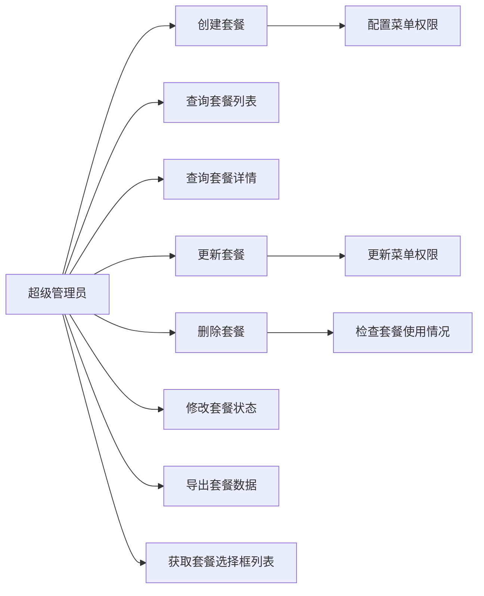
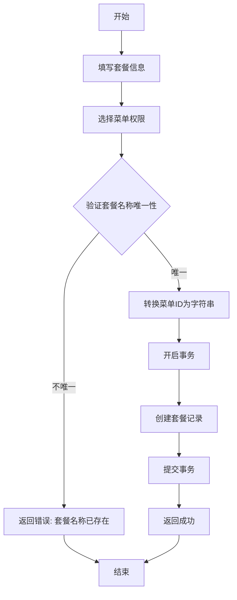
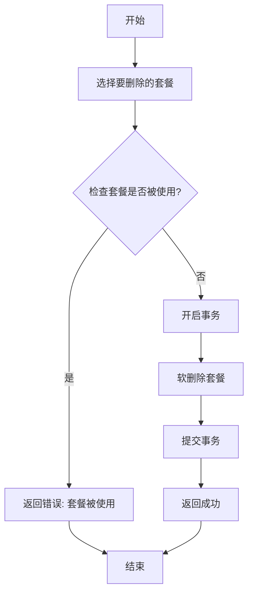
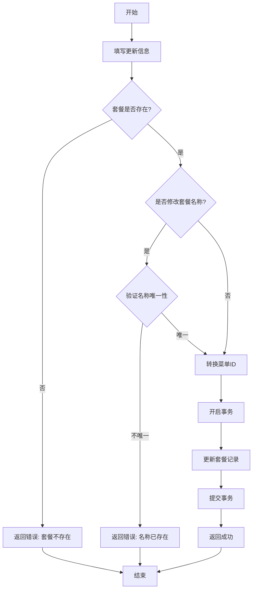
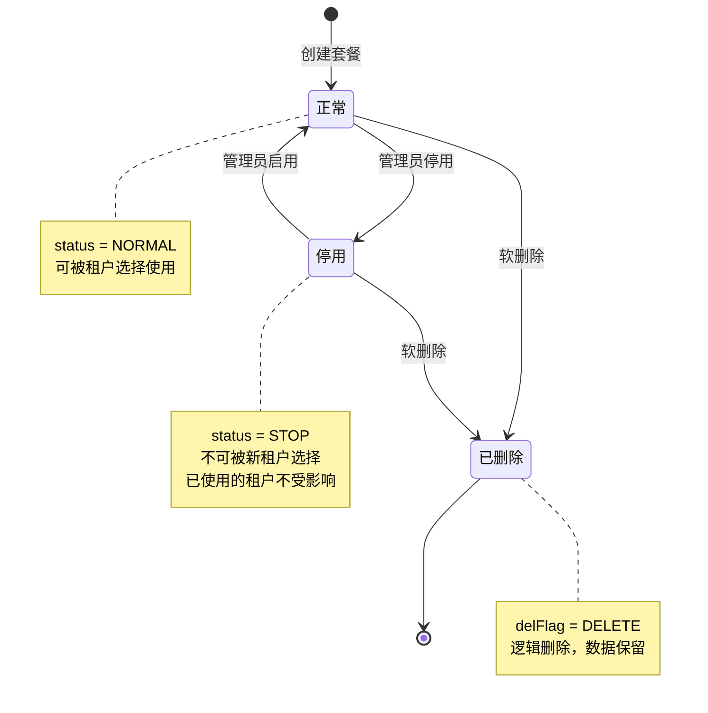
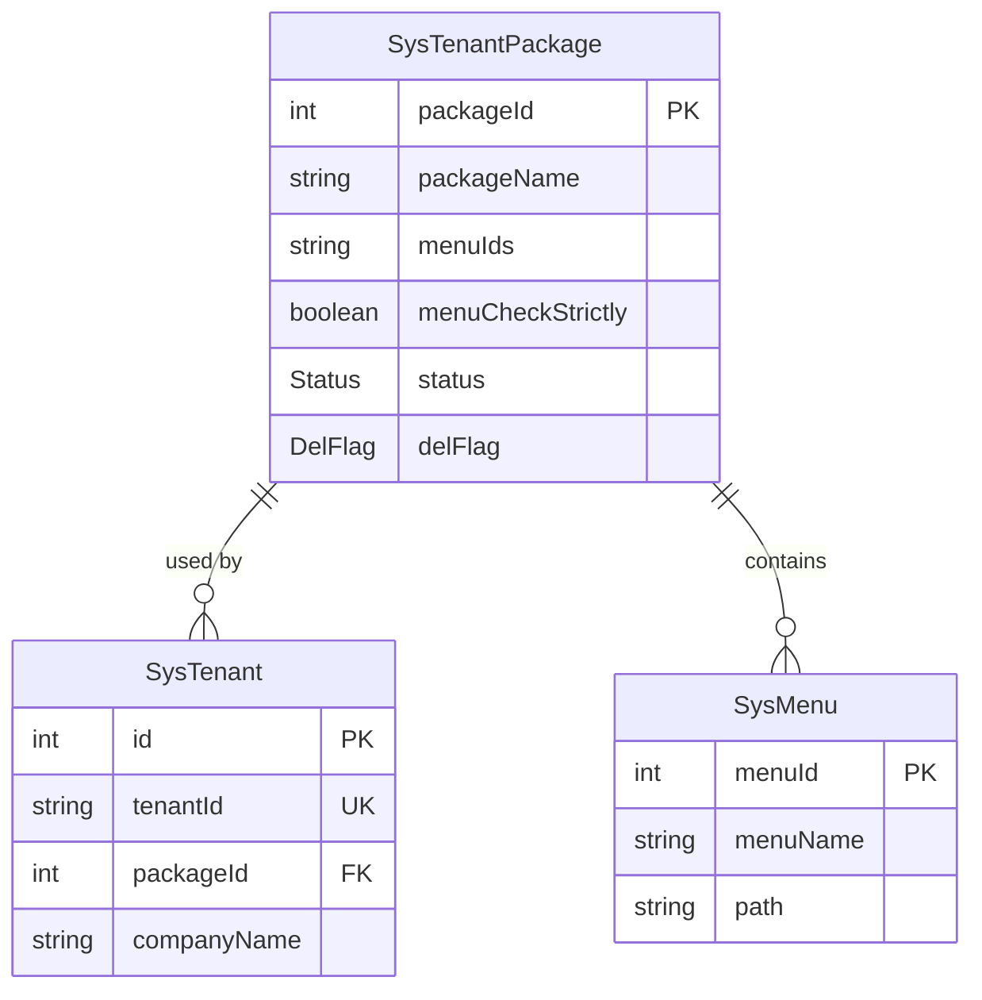

# 租户套餐管理模块需求文档

## 1. 概述

### 1.1 模块简介

租户套餐管理模块负责管理多租户SaaS系统中的套餐配置，包括套餐的创建、查询、更新、删除以及菜单权限关联。套餐是租户权限管理的核心，通过套餐可以灵活控制不同租户的功能权限范围。

### 1.2 核心功能

- 租户套餐CRUD操作（创建、查询、更新、删除）
- 套餐状态管理（启用/停用）
- 套餐菜单权限配置
- 套餐选择框列表查询
- 套餐使用情况检查
- 套餐数据导出

### 1.3 业务价值

- 实现租户权限的灵活配置和管理
- 支持不同租户订阅不同功能套餐
- 简化租户权限分配流程
- 提供套餐级别的功能控制
- 支持套餐的统一管理和维护

## 2. 用例分析

### 2.1 用例图

### 2.2 用例描述

#### UC-01: 创建租户套餐

- 参与者: 超级管理员
- 前置条件: 用户已登录且具有 `system:tenantPackage:add` 权限
- 主流程:
  1. 超级管理员填写套餐基本信息（套餐名称、状态、备注）
  2. 超级管理员选择关联的菜单权限
  3. 系统验证套餐名称唯一性
  4. 系统将菜单ID数组转换为逗号分隔字符串
  5. 系统创建套餐记录
  6. 返回创建成功
- 异常流程:
  - 套餐名称已存在：提示"套餐名称已存在"
  - 创建失败：回滚事务，返回错误信息

#### UC-02: 查询租户套餐列表

- 参与者: 超级管理员
- 前置条件: 用户已登录且具有 `system:tenantPackage:list` 权限
- 主流程:
  1. 超级管理员输入查询条件（套餐名称、状态）
  2. 系统根据条件分页查询套餐列表
  3. 系统返回套餐列表及总数
- 性能要求:
  - 支持分页，默认每页10条
  - 按创建时间倒序排列

#### UC-03: 查询套餐详情

- 参与者: 超级管理员
- 前置条件: 用户已登录且具有 `system:tenantPackage:query` 权限
- 主流程:
  1. 超级管理员选择要查看的套餐
  2. 系统根据套餐ID查询详情
  3. 系统返回套餐详细信息（包括关联的菜单ID）
- 异常流程:
  - 套餐不存在：提示"租户套餐不存在"

#### UC-04: 更新租户套餐

- 参与者: 超级管理员
- 前置条件: 用户已登录且具有 `system:tenantPackage:edit` 权限
- 主流程:
  1. 超级管理员选择要修改的套餐
  2. 系统验证套餐是否存在
  3. 如修改套餐名称，系统验证名称唯一性
  4. 系统将菜单ID数组转换为逗号分隔字符串
  5. 系统更新套餐信息
  6. 返回更新成功
- 异常流程:
  - 套餐不存在：提示"租户套餐不存在"
  - 套餐名称重复：提示"套餐名称已存在"

#### UC-05: 删除租户套餐

- 参与者: 超级管理员
- 前置条件: 用户已登录且具有 `system:tenantPackage:remove` 权限
- 主流程:
  1. 超级管理员选择要删除的套餐（支持批量）
  2. 系统检查是否有租户正在使用这些套餐
  3. 如无租户使用，系统执行软删除（设置delFlag为DELETE）
  4. 返回删除成功
- 异常流程:
  - 套餐被使用：提示"存在租户正在使用该套餐，无法删除"
- 说明: 采用软删除，不物理删除数据

#### UC-06: 修改套餐状态

- 参与者: 超级管理员
- 前置条件: 用户已登录且具有 `system:tenantPackage:edit` 权限
- 主流程:
  1. 超级管理员选择要修改状态的套餐
  2. 系统验证套餐是否存在
  3. 系统更新套餐状态（启用/停用）
  4. 返回更新成功
- 异常流程:
  - 套餐不存在：提示"租户套餐不存在"

#### UC-07: 获取套餐选择框列表

- 参与者: 超级管理员
- 前置条件: 用户已登录
- 主流程:
  1. 系统查询所有正常状态且未删除的套餐
  2. 系统返回套餐ID和名称列表
- 说明: 用于租户管理等模块的套餐选择下拉框

#### UC-08: 导出套餐数据

- 参与者: 超级管理员
- 前置条件: 用户已登录且具有 `system:tenantPackage:export` 权限
- 主流程:
  1. 超级管理员选择导出条件
  2. 系统查询符合条件的所有套餐数据
  3. 系统生成Excel文件
  4. 系统返回文件流供下载
- 导出字段: 套餐ID、套餐名称、关联菜单、状态、创建时间、备注

## 3. 业务流程

### 3.1 创建套餐流程

### 3.2 删除套餐流程

### 3.3 更新套餐流程

## 4. 状态管理

### 4.1 套餐状态图

### 4.2 状态说明

| 状态   | 枚举值            | 说明           | 允许操作             |
| ------ | ----------------- | -------------- | -------------------- |
| 正常   | NORMAL            | 套餐可正常使用 | 所有操作             |
| 停用   | STOP              | 套餐被停用     | 仅超管可查看和修改   |
| 已删除 | DELETE（delFlag） | 套餐已删除     | 不可见，仅数据库保留 |

### 4.3 状态转换规则

- 创建套餐时默认状态为NORMAL
- 超级管理员可将套餐状态在NORMAL和STOP之间切换
- 删除操作设置delFlag为DELETE，不改变status
- 已删除的套餐不参与任何业务逻辑
- 停用的套餐不影响已使用该套餐的租户

## 5. 数据模型

### 5.1 核心实体

#### 5.1.1 租户套餐表（SysTenantPackage）

| 字段              | 类型        | 必填 | 说明                         |
| ----------------- | ----------- | ---- | ---------------------------- |
| packageId         | Int         | 是   | 套餐ID（主键）               |
| packageName       | String(50)  | 是   | 套餐名称                     |
| menuIds           | Text        | 否   | 关联的菜单ID列表（逗号分隔） |
| menuCheckStrictly | Boolean     | 是   | 菜单树选择项是否关联显示     |
| status            | Status      | 是   | 状态（NORMAL/STOP）          |
| delFlag           | DelFlag     | 是   | 删除标志                     |
| createBy          | String(64)  | 是   | 创建者                       |
| createTime        | DateTime    | 是   | 创建时间                     |
| updateBy          | String(64)  | 是   | 更新者                       |
| updateTime        | DateTime    | 是   | 更新时间                     |
| remark            | String(500) | 否   | 备注                         |

### 5.2 实体关系图

## 6. 接口定义

### 6.1 接口列表

| 接口路径                            | 方法   | 权限                        | 说明           | 租户范围     |
| ----------------------------------- | ------ | --------------------------- | -------------- | ------------ |
| /system/tenant/package              | POST   | system:tenantPackage:add    | 创建套餐       | PlatformOnly |
| /system/tenant/package/list         | GET    | system:tenantPackage:list   | 套餐列表       | PlatformOnly |
| /system/tenant/package/selectList   | GET    | 无                          | 套餐选择框列表 | PlatformOnly |
| /system/tenant/package/:id          | GET    | system:tenantPackage:query  | 套餐详情       | PlatformOnly |
| /system/tenant/package              | PUT    | system:tenantPackage:edit   | 更新套餐       | PlatformOnly |
| /system/tenant/package/:ids         | DELETE | system:tenantPackage:remove | 删除套餐       | PlatformOnly |
| /system/tenant/package/changeStatus | PUT    | system:tenantPackage:edit   | 修改状态       | PlatformOnly |
| /system/tenant/package/export       | POST   | system:tenantPackage:export | 导出数据       | PlatformOnly |

### 6.2 接口详细说明

#### 6.2.1 创建套餐

- 请求方式: POST /system/tenant/package
- 请求体: CreateTenantPackageDto
- 响应: Result<void>
- 业务规则:
  - 套餐名称必须唯一
  - menuIds数组转换为逗号分隔字符串存储
  - 默认状态为NORMAL
  - 使用事务确保数据一致性

#### 6.2.2 查询套餐列表

- 请求方式: GET /system/tenant/package/list
- 查询参数: ListTenantPackageDto
- 响应: Result<{ rows: TenantPackageVo[], total: number }>
- 业务规则:
  - 支持按套餐名称、状态筛选
  - 分页查询，默认每页10条
  - 按创建时间倒序排列
  - 状态转换为前端格式（"0"/"1"）

#### 6.2.3 更新套餐

- 请求方式: PUT /system/tenant/package
- 请求体: UpdateTenantPackageDto
- 响应: Result<void>
- 业务规则:
  - 验证套餐是否存在
  - 如修改套餐名称，验证唯一性
  - menuIds数组转换为逗号分隔字符串
  - 使用事务确保数据一致性

#### 6.2.4 删除套餐

- 请求方式: DELETE /system/tenant/package/:ids
- 路径参数: ids（套餐ID列表，逗号分隔）
- 响应: Result<void>
- 业务规则:
  - 检查套餐是否被租户使用
  - 如被使用，禁止删除
  - 软删除，设置delFlag为DELETE
  - 使用事务确保数据一致性

#### 6.2.5 获取套餐选择框列表

- 请求方式: GET /system/tenant/package/selectList
- 响应: Result<{ packageId: number, packageName: string }[]>
- 业务规则:
  - 仅返回正常状态且未删除的套餐
  - 仅返回packageId和packageName字段
  - 按创建时间倒序排列

## 7. 非功能需求

### 7.1 性能要求

| 指标         | 要求          | 说明               |
| ------------ | ------------- | ------------------ |
| 接口响应时间 | P99 < 1000ms  | 后台管理级别       |
| 并发支持     | 支持50并发    | 套餐管理为低频操作 |
| 数据库查询   | 使用索引优化  | 套餐名称、状态字段 |
| 分页深度     | offset ≤ 5000 | 超限抛错           |

### 7.2 安全要求

- 所有接口仅超级管理员可访问（PlatformOnly）
- 使用@IgnoreTenant装饰器忽略租户隔离
- 删除前检查套餐使用情况，防止误删
- 使用软删除保留数据

### 7.3 数据一致性

- 创建和更新操作使用@Transactional装饰器保证事务一致性
- 删除前检查关联数据，防止数据不一致
- menuIds存储格式统一（逗号分隔字符串）

### 7.4 可观测性

- 关键操作记录日志（创建、更新、删除）
- 使用Logger记录错误堆栈
- 记录套餐使用情况检查结果

### 7.5 扩展性

- 支持菜单权限灵活配置
- 支持套餐状态管理
- 支持套餐选择框列表查询
- 预留套餐扩展字段

## 8. 业务规则

### 8.1 套餐名称规则

- 套餐名称长度1-50字符
- 套餐名称在未删除套餐中必须唯一
- 套餐名称不能为空

### 8.2 菜单权限规则

- menuIds存储为逗号分隔的字符串
- 前端传入为数组，后端转换为字符串
- 查询时可将字符串转换为数组返回
- menuCheckStrictly控制菜单树选择模式

### 8.3 套餐删除规则

- 被租户使用的套餐不能删除
- 删除采用软删除方式
- 删除前必须检查使用情况
- 支持批量删除

### 8.4 套餐状态规则

- 创建时默认状态为NORMAL
- 停用的套餐不影响已使用该套餐的租户
- 停用的套餐不能被新租户选择
- 状态可在NORMAL和STOP之间切换

### 8.5 套餐使用规则

- 租户创建时可选择套餐
- 租户可更换套餐
- 套餐变更不影响已有权限
- 套餐删除不影响已使用的租户

## 9. 异常处理

### 9.1 业务异常

| 异常场景           | 错误码                | 错误信息                         |
| ------------------ | --------------------- | -------------------------------- |
| 套餐名称已存在     | BAD_REQUEST           | 套餐名称已存在                   |
| 套餐不存在         | NOT_FOUND             | 租户套餐不存在                   |
| 套餐被使用无法删除 | BAD_REQUEST           | 存在租户正在使用该套餐，无法删除 |
| 创建失败           | INTERNAL_SERVER_ERROR | 创建套餐失败                     |
| 更新失败           | INTERNAL_SERVER_ERROR | 更新套餐失败                     |

### 9.2 异常处理策略

- 使用BusinessException抛出业务异常
- 事务操作失败自动回滚
- 记录详细错误日志
- 返回友好的错误信息

## 10. 测试要点

### 10.1 单元测试

- 套餐名称唯一性验证
- menuIds数组与字符串转换
- 套餐使用情况检查
- 状态转换逻辑

### 10.2 集成测试

- 创建套餐完整流程
- 更新套餐完整流程
- 删除套餐完整流程（包括使用检查）
- 修改套餐状态流程

### 10.3 边界测试

- 套餐名称重复
- 套餐不存在
- 删除被使用的套餐
- menuIds为空或null
- 批量删除多个套餐

### 10.4 性能测试

- 批量创建套餐性能
- 分页查询大量套餐性能
- 套餐使用情况检查性能

## 11. 缺陷与改进建议

### 11.1 已识别缺陷

| 优先级 | 缺陷描述                         | 影响                 | 建议                   |
| ------ | -------------------------------- | -------------------- | ---------------------- |
| P1     | menuIds仅存储ID，未关联菜单表    | 无法验证菜单是否存在 | 添加菜单存在性验证     |
| P2     | 缺少套餐功能点配置               | 仅能控制菜单权限     | 添加功能点配置表       |
| P2     | 缺少套餐价格和有效期配置         | 无法支持商业化       | 添加价格和有效期字段   |
| P3     | 缺少套餐使用统计                 | 无法了解套餐使用情况 | 添加使用统计功能       |
| P3     | 停用套餐对已使用租户的影响未明确 | 可能导致业务混乱     | 明确停用规则和影响范围 |

### 11.2 改进建议

1. 菜单权限管理
   - 添加菜单存在性验证
   - 支持菜单树结构展示
   - 支持菜单权限继承

2. 套餐功能扩展
   - 添加套餐价格配置
   - 添加套餐有效期配置
   - 添加套餐功能点配置
   - 支持套餐升级和降级

3. 使用统计
   - 统计每个套餐的使用租户数
   - 统计套餐的创建和使用趋势
   - 提供套餐使用报表

4. 权限细化
   - 支持更细粒度的权限控制
   - 支持功能点级别的权限配置
   - 支持数据权限配置

## 12. 依赖关系

### 12.1 上游依赖

- 认证模块：提供用户登录和权限验证
- 菜单管理模块：提供菜单数据

### 12.2 下游依赖

- 租户管理模块：使用套餐配置租户权限
- 权限管理模块：根据套餐控制功能权限

### 12.3 外部依赖

- Prisma ORM：数据库访问
- class-validator：DTO验证
- NestJS：框架支持

## 13. 版本历史

| 版本 | 日期       | 作者   | 变更说明                                   |
| ---- | ---------- | ------ | ------------------------------------------ |
| 1.0  | 2026-02-22 | System | 初始版本，包含套餐CRUD、状态管理、使用检查 |
