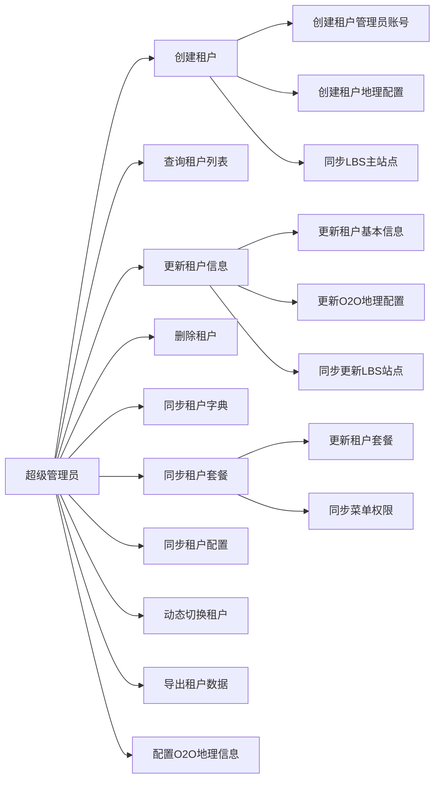
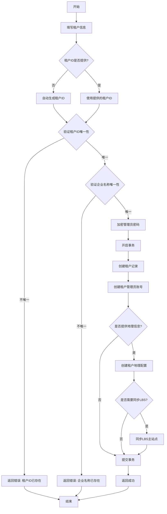
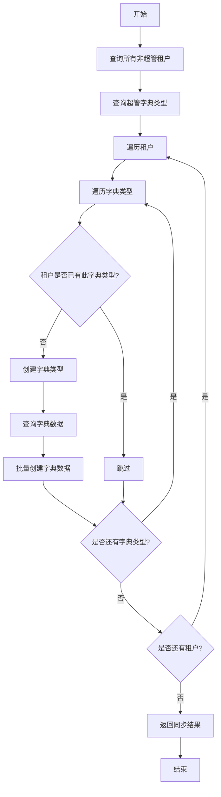
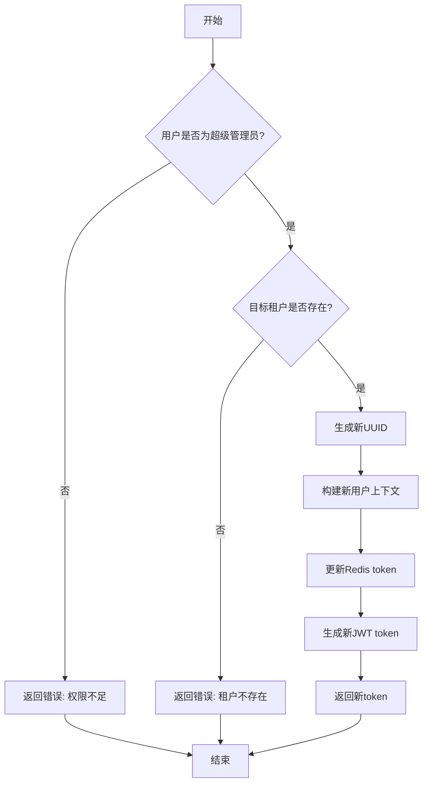
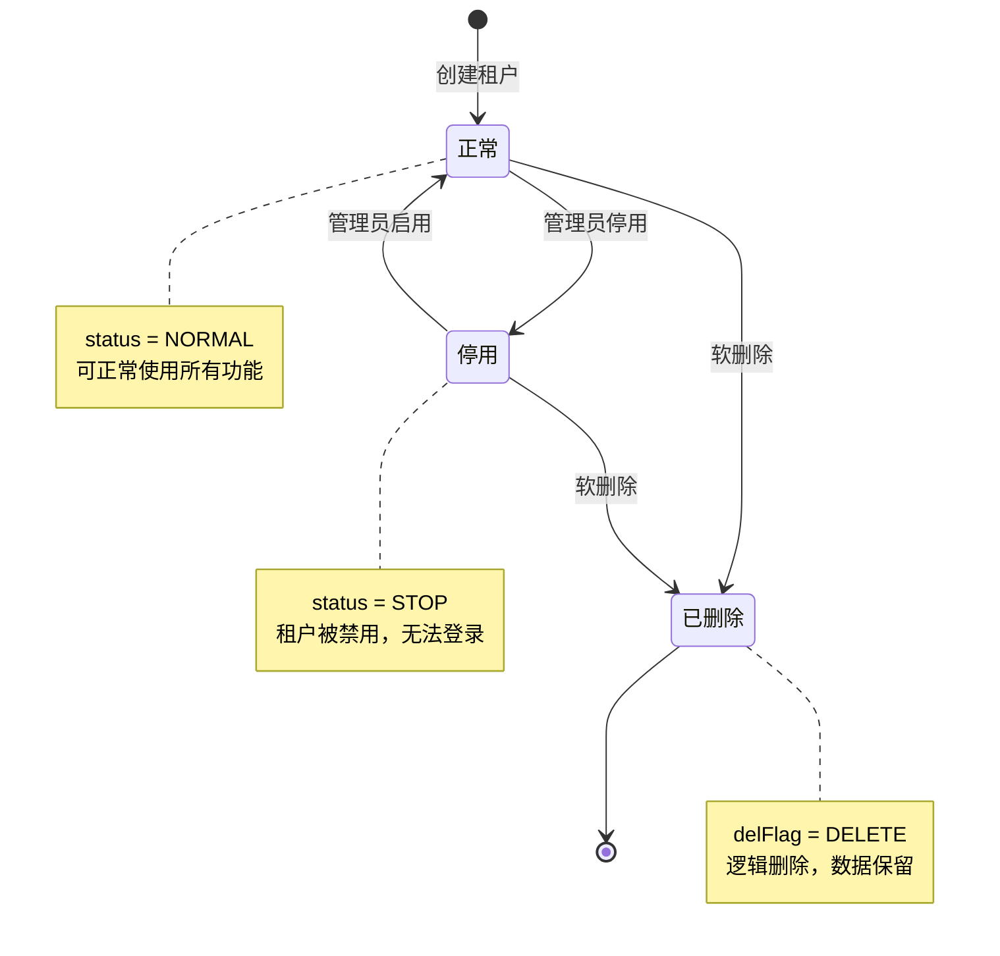
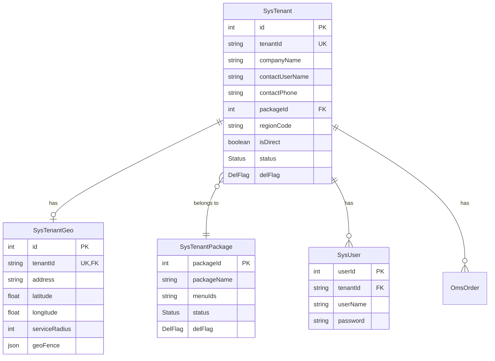

# 租户管理模块需求文档

## 1. 概述

### 1.1 模块简介

租户管理模块是多租户SaaS系统的核心基础模块，负责租户的全生命周期管理、数据隔离、套餐管理、配置同步以及O2O地理服务支持。该模块支持超级管理员对所有租户进行统一管理，并提供动态租户切换能力。

### 1.2 核心功能

- 租户CRUD操作（创建、查询、更新、删除）
- 租户套餐管理与同步
- 租户字典数据同步
- 租户参数配置同步
- 超级管理员动态租户切换
- O2O地理位置配置（地址、经纬度、服务半径、电子围栏）
- 与LBS站点服务集成
- 租户数据导出

### 1.3 业务价值

- 实现多租户数据隔离，保障数据安全
- 统一管理租户生命周期，降低运营成本
- 支持租户套餐灵活配置，满足不同业务需求
- 提供配置同步能力，简化租户初始化流程
- 支持O2O业务场景，实现地理位置服务

## 2. 用例分析

### 2.1 用例图

### 2.2 用例描述

#### UC-01: 创建租户

- 参与者: 超级管理员
- 前置条件: 用户已登录且具有 `system:tenant:add` 权限
- 主流程:
  1. 超级管理员填写租户基本信息（企业名称、联系人、联系电话等）
  2. 系统自动生成租户ID（6位数字，从100001开始）或使用指定ID
  3. 系统验证租户ID和企业名称唯一性
  4. 系统创建租户记录
  5. 系统创建租户管理员账号（密码加密存储）
  6. 如提供地理信息，系统创建租户地理配置（SysTenantGeo）
  7. 如提供地理信息，系统自动同步LBS主站点
  8. 返回创建成功
- 异常流程:
  - 租户ID已存在：提示"租户ID已存在"
  - 企业名称已存在：提示"企业名称已存在"
  - 创建失败：回滚事务，返回错误信息

#### UC-02: 查询租户列表

- 参与者: 超级管理员
- 前置条件: 用户已登录且具有 `system:tenant:list` 权限
- 主流程:
  1. 超级管理员输入查询条件（租户ID、企业名称、联系人、状态、时间范围）
  2. 系统根据条件分页查询租户列表
  3. 系统批量查询套餐名称（避免N+1问题）
  4. 系统批量查询区域名称（支持市-区格式显示）
  5. 系统返回租户列表及总数
- 性能要求:
  - 使用批量查询优化，避免N+1问题
  - 支持分页，默认每页10条

#### UC-03: 更新租户信息

- 参与者: 超级管理员
- 前置条件: 用户已登录且具有 `system:tenant:edit` 权限
- 主流程:
  1. 超级管理员选择要修改的租户
  2. 系统验证租户是否存在
  3. 如修改企业名称，系统验证名称唯一性
  4. 系统更新租户基本信息
  5. 如更新O2O地理字段，系统同步更新SysTenantGeo
  6. 如更新O2O地理字段，系统同步更新LBS站点
  7. 返回更新成功
- 异常流程:
  - 租户不存在：提示"租户不存在"
  - 企业名称重复：提示"企业名称已存在"

#### UC-04: 删除租户

- 参与者: 超级管理员
- 前置条件: 用户已登录且具有 `system:tenant:remove` 权限
- 主流程:
  1. 超级管理员选择要删除的租户（支持批量）
  2. 系统执行软删除（设置delFlag为DELETE）
  3. 返回删除成功
- 说明: 采用软删除，不物理删除数据

#### UC-05: 同步租户字典

- 参与者: 超级管理员
- 前置条件: 用户已登录且具有 `system:tenant:edit` 权限
- 主流程:
  1. 超级管理员触发同步租户字典操作
  2. 系统查询所有正常状态的非超管租户
  3. 系统获取超级管理员租户的所有字典类型
  4. 对每个租户，系统检查并创建缺失的字典类型
  5. 对每个字典类型，系统批量创建字典数据（跳过重复）
  6. 返回同步结果（租户数、新增数、跳过数）
- 性能要求:
  - 使用批量创建（createMany）提升性能
  - 使用skipDuplicates避免重复插入错误
  - 记录详细日志便于追踪

#### UC-06: 同步租户套餐

- 参与者: 超级管理员
- 前置条件: 用户已登录且具有 `system:tenant:edit` 权限
- 主流程:
  1. 超级管理员选择租户和套餐
  2. 系统验证租户和套餐是否存在
  3. 系统更新租户的套餐ID
  4. 系统根据套餐的menuIds同步菜单权限
  5. 返回同步成功
- 异常流程:
  - 租户不存在：提示"租户不存在"
  - 套餐不存在：提示"租户套餐不存在"

#### UC-07: 同步租户配置

- 参与者: 超级管理员
- 前置条件: 用户已登录且具有 `system:tenant:edit` 权限
- 主流程:
  1. 超级管理员触发同步租户配置操作
  2. 系统查询所有正常状态的非超管租户
  3. 系统获取超级管理员租户的所有配置项
  4. 对每个租户，系统批量创建配置项（跳过重复）
  5. 系统清除租户配置缓存
  6. 返回同步结果（租户数、新增数、跳过数）
- 性能要求:
  - 使用批量创建（createMany）提升性能
  - 同步后清除Redis缓存确保配置生效

#### UC-08: 动态切换租户

- 参与者: 超级管理员（userId=1）
- 前置条件: 用户已登录且具有 `system:tenant:dynamic` 权限，且userId为1
- 主流程:
  1. 超级管理员选择要切换的租户
  2. 系统验证用户是否为超级管理员（userId=1）
  3. 系统验证目标租户是否存在
  4. 系统生成新的UUID token
  5. 系统创建新的用户上下文（tenantId切换为目标租户）
  6. 系统更新Redis中的token信息
  7. 系统生成新的JWT token
  8. 返回新token
- 异常流程:
  - 非超级管理员：提示"只有超级管理员才能切换租户"
  - 租户不存在：提示"租户不存在"
- 说明: 切换后，超级管理员可以以目标租户身份操作数据

#### UC-09: 清除动态租户

- 参与者: 超级管理员（userId=1）
- 前置条件: 用户已登录且具有 `system:tenant:dynamic` 权限
- 主流程:
  1. 超级管理员触发清除操作
  2. 系统验证用户是否为超级管理员
  3. 系统切换回默认租户（000000）
  4. 系统生成新token并返回
- 说明: 恢复超级管理员的默认租户上下文

#### UC-10: 导出租户数据

- 参与者: 超级管理员
- 前置条件: 用户已登录且具有 `system:tenant:export` 权限
- 主流程:
  1. 超级管理员选择导出条件
  2. 系统查询符合条件的所有租户数据
  3. 系统生成Excel文件
  4. 系统返回文件流供下载
- 导出字段: 租户编号、企业名称、联系人、联系电话、统一社会信用代码、地址、套餐名称、过期时间、账号数量、状态、创建时间

## 3. 业务流程

### 3.1 创建租户流程

### 3.2 同步租户字典流程

### 3.3 动态切换租户流程

## 4. 状态管理

### 4.1 租户状态图

### 4.2 状态说明

| 状态   | 枚举值            | 说明             | 允许操作             |
| ------ | ----------------- | ---------------- | -------------------- |
| 正常   | NORMAL            | 租户正常运营状态 | 所有操作             |
| 停用   | STOP              | 租户被暂停服务   | 仅超管可查看和修改   |
| 已删除 | DELETE（delFlag） | 租户已删除       | 不可见，仅数据库保留 |

### 4.3 状态转换规则

- 创建租户时默认状态为NORMAL
- 超级管理员可将租户状态在NORMAL和STOP之间切换
- 删除操作设置delFlag为DELETE，不改变status
- 已删除的租户不参与任何业务逻辑

## 5. 数据模型

### 5.1 核心实体

#### 5.1.1 租户表（SysTenant）

| 字段            | 类型        | 必填 | 说明                      |
| --------------- | ----------- | ---- | ------------------------- |
| id              | Int         | 是   | 主键ID                    |
| tenantId        | String(20)  | 是   | 租户编号（唯一）          |
| contactUserName | String(50)  | 否   | 联系人                    |
| contactPhone    | String(20)  | 否   | 联系电话                  |
| companyName     | String(100) | 是   | 企业名称                  |
| licenseNumber   | String(50)  | 否   | 统一社会信用代码          |
| address         | String(200) | 否   | 地址                      |
| intro           | Text        | 否   | 企业简介                  |
| domain          | String(100) | 否   | 域名                      |
| packageId       | Int         | 否   | 租户套餐ID                |
| expireTime      | DateTime    | 否   | 过期时间                  |
| accountCount    | Int         | 是   | 账号数量（-1不限制）      |
| storageQuota    | Int         | 是   | 存储配额（MB，默认10240） |
| storageUsed     | Int         | 是   | 已使用存储（MB，默认0）   |
| status          | Status      | 是   | 状态（NORMAL/STOP）       |
| delFlag         | DelFlag     | 是   | 删除标志                  |
| regionCode      | String      | 否   | 行政区划代码（O2O）       |
| isDirect        | Boolean     | 是   | 是否直营（默认true）      |
| createBy        | String(64)  | 是   | 创建者                    |
| createTime      | DateTime    | 是   | 创建时间                  |
| updateBy        | String(64)  | 是   | 更新者                    |
| updateTime      | DateTime    | 是   | 更新时间                  |
| remark          | String(500) | 否   | 备注                      |

#### 5.1.2 租户地理配置表（SysTenantGeo）

| 字段          | 类型   | 必填 | 说明                        |
| ------------- | ------ | ---- | --------------------------- |
| id            | Int    | 是   | 主键ID                      |
| tenantId      | String | 是   | 租户编号（唯一）            |
| address       | String | 否   | 地址                        |
| latitude      | Float  | 否   | 纬度                        |
| longitude     | Float  | 否   | 经度                        |
| serviceRadius | Int    | 是   | 服务半径（米，默认3000）    |
| geoFence      | Json   | 否   | 电子围栏（GeoJSON Polygon） |

#### 5.1.3 租户套餐表（SysTenantPackage）

| 字段              | 类型        | 必填 | 说明                   |
| ----------------- | ----------- | ---- | ---------------------- |
| packageId         | Int         | 是   | 套餐ID                 |
| packageName       | String(50)  | 是   | 套餐名称               |
| menuIds           | Text        | 否   | 菜单ID列表（逗号分隔） |
| menuCheckStrictly | Boolean     | 是   | 菜单树选择严格模式     |
| status            | Status      | 是   | 状态                   |
| delFlag           | DelFlag     | 是   | 删除标志               |
| createBy          | String(64)  | 是   | 创建者                 |
| createTime        | DateTime    | 是   | 创建时间               |
| updateBy          | String(64)  | 是   | 更新者                 |
| updateTime        | DateTime    | 是   | 更新时间               |
| remark            | String(500) | 否   | 备注                   |

### 5.2 实体关系图

## 6. 接口定义

### 6.1 接口列表

| 接口路径                         | 方法   | 权限                  | 说明         | 租户范围     |
| -------------------------------- | ------ | --------------------- | ------------ | ------------ |
| /system/tenant                   | POST   | system:tenant:add     | 创建租户     | PlatformOnly |
| /system/tenant/list              | GET    | system:tenant:list    | 租户列表     | PlatformOnly |
| /system/tenant/:id               | GET    | system:tenant:query   | 租户详情     | PlatformOnly |
| /system/tenant                   | PUT    | system:tenant:edit    | 更新租户     | PlatformOnly |
| /system/tenant/:ids              | DELETE | system:tenant:remove  | 删除租户     | PlatformOnly |
| /system/tenant/syncTenantDict    | GET    | system:tenant:edit    | 同步租户字典 | PlatformOnly |
| /system/tenant/syncTenantPackage | GET    | system:tenant:edit    | 同步租户套餐 | PlatformOnly |
| /system/tenant/syncTenantConfig  | GET    | system:tenant:edit    | 同步租户配置 | PlatformOnly |
| /system/tenant/dynamic/:tenantId | GET    | system:tenant:dynamic | 动态切换租户 | PlatformOnly |
| /system/tenant/dynamic/clear     | GET    | system:tenant:dynamic | 清除动态租户 | PlatformOnly |
| /system/tenant/export            | POST   | system:tenant:export  | 导出租户数据 | PlatformOnly |

### 6.2 接口详细说明

#### 6.2.1 创建租户

- 请求方式: POST /system/tenant
- 请求体: CreateTenantDto
- 响应: Result<void>
- 业务规则:
  - 租户ID不提供时自动生成（6位数字，从100001开始）
  - 租户ID和企业名称必须唯一
  - 管理员密码必须符合强密码规则
  - 创建租户和管理员账号在同一事务中
  - 如提供地理信息，自动创建SysTenantGeo和同步LBS站点

#### 6.2.2 查询租户列表

- 请求方式: GET /system/tenant/list
- 查询参数: ListTenantDto
- 响应: Result<{ rows: TenantVo[], total: number }>
- 业务规则:
  - 支持按租户ID、企业名称、联系人、状态、时间范围筛选
  - 分页查询，默认每页10条
  - 批量查询套餐名称和区域名称，避免N+1问题
  - 区域名称显示格式：市-区（level 3）或市（level 2）

#### 6.2.3 更新租户

- 请求方式: PUT /system/tenant
- 请求体: UpdateTenantDto
- 响应: Result<void>
- 业务规则:
  - 验证租户是否存在
  - 如修改企业名称，验证唯一性
  - 如更新O2O地理字段，同步更新SysTenantGeo和LBS站点

#### 6.2.4 同步租户字典

- 请求方式: GET /system/tenant/syncTenantDict
- 响应: Result<{ message: string, detail: { tenants: number, synced: number, skipped: number } }>
- 业务规则:
  - 仅同步正常状态的非超管租户
  - 从超级管理员租户（000000）获取字典模板
  - 使用createMany批量创建，skipDuplicates跳过重复
  - 记录详细日志

#### 6.2.5 动态切换租户

- 请求方式: GET /system/tenant/dynamic/:tenantId
- 路径参数: tenantId（租户编号）
- 响应: Result<string>（新token）
- 业务规则:
  - 仅超级管理员（userId=1）可调用
  - 验证目标租户存在
  - 生成新UUID和JWT token
  - 更新Redis中的用户上下文（tenantId切换为目标租户）
  - 切换后超级管理员以目标租户身份操作

## 7. 非功能需求

### 7.1 性能要求

| 指标         | 要求          | 说明               |
| ------------ | ------------- | ------------------ |
| 接口响应时间 | P99 < 1000ms  | 后台管理级别       |
| 并发支持     | 支持100并发   | 租户管理为低频操作 |
| 数据库查询   | 避免N+1问题   | 使用批量查询优化   |
| 分页深度     | offset ≤ 5000 | 超限抛错           |

### 7.2 安全要求

- 所有接口仅超级管理员可访问（PlatformOnly）
- 使用@IgnoreTenant装饰器忽略租户隔离
- 管理员密码使用bcrypt加密（salt rounds=10）
- 动态切换租户仅限userId=1的超级管理员
- 敏感信息（密码）不记录日志

### 7.3 数据一致性

- 创建租户使用@Transactional装饰器保证事务一致性
- 同步操作使用事务确保数据完整性
- 软删除保留数据，避免数据丢失

### 7.4 可观测性

- 关键操作记录详细日志（创建、更新、删除、同步）
- 同步操作记录统计信息（租户数、成功数、失败数）
- 使用Logger记录错误堆栈

### 7.5 扩展性

- 支持O2O地理位置扩展（地址、经纬度、服务半径、电子围栏）
- 支持与LBS站点服务集成
- 支持租户套餐灵活配置
- 支持租户配置和字典同步机制

## 8. 业务规则

### 8.1 租户ID生成规则

- 自动生成：6位数字，从100001开始递增
- 手动指定：长度1-20字符，必须唯一
- 超级管理员租户ID固定为"000000"

### 8.2 租户唯一性规则

- 租户ID全局唯一
- 企业名称在未删除租户中唯一

### 8.3 账号数量规则

- -1表示不限制账号数量
- 正数表示最大账号数量
- 创建用户时需验证是否超过限制

### 8.4 存储配额规则

- 默认存储配额：10GB（10240MB）
- 上传文件时需验证是否超过配额
- storageUsed记录已使用存储

### 8.5 租户过期规则

- expireTime为空表示永久有效
- 过期后租户状态自动变为STOP
- 需定时任务检查并更新过期租户状态

### 8.6 O2O业务规则

- regionCode关联行政区划表（SysRegion）
- isDirect区分直营和加盟模式
- serviceRadius默认3000米
- geoFence使用GeoJSON Polygon格式
- 地理信息变更自动同步LBS站点

### 8.7 同步规则

- 字典同步：从超级管理员租户同步到所有租户
- 配置同步：从超级管理员租户同步到所有租户
- 套餐同步：更新指定租户的套餐和菜单权限
- 同步操作跳过已存在的数据（skipDuplicates）

## 9. 异常处理

### 9.1 业务异常

| 异常场景             | 错误码                | 错误信息                   |
| -------------------- | --------------------- | -------------------------- |
| 租户ID已存在         | BAD_REQUEST           | 租户ID已存在               |
| 企业名称已存在       | BAD_REQUEST           | 企业名称已存在             |
| 租户不存在           | NOT_FOUND             | 租户不存在                 |
| 租户套餐不存在       | NOT_FOUND             | 租户套餐不存在             |
| 非超级管理员切换租户 | BUSINESS_ERROR        | 只有超级管理员才能切换租户 |
| 创建租户失败         | INTERNAL_SERVER_ERROR | 创建租户失败               |
| 同步失败             | INTERNAL_SERVER_ERROR | 同步租户字典/配置失败      |

### 9.2 异常处理策略

- 使用BusinessException抛出业务异常
- catch块使用getErrorMessage安全提取错误信息
- 记录详细错误日志（message + stack）
- 事务操作失败自动回滚

## 10. 测试要点

### 10.1 单元测试

- 租户ID自动生成逻辑
- 租户唯一性验证
- 密码加密逻辑
- 批量查询优化（套餐名称、区域名称）
- 动态切换租户上下文构建
- O2O地理信息同步逻辑

### 10.2 集成测试

- 创建租户完整流程（租户+管理员+地理配置+LBS同步）
- 同步租户字典完整流程
- 同步租户配置完整流程
- 动态切换租户完整流程
- 更新租户并同步O2O信息

### 10.3 边界测试

- 租户ID重复
- 企业名称重复
- 非超级管理员调用动态切换
- 目标租户不存在
- 同步时租户列表为空
- 同步时字典/配置列表为空

### 10.4 性能测试

- 批量创建租户性能
- 同步1000个租户的字典性能
- 分页查询大量租户性能
- N+1查询优化验证

## 11. 缺陷与改进建议

### 11.1 已识别缺陷

| 优先级 | 缺陷描述                         | 影响                       | 建议                          |
| ------ | -------------------------------- | -------------------------- | ----------------------------- |
| P1     | 同步租户套餐的菜单权限逻辑未实现 | 套餐同步不完整             | 实现menuIds解析和权限同步逻辑 |
| P2     | 缺少租户过期自动停用的定时任务   | 过期租户仍可使用           | 添加定时任务检查expireTime    |
| P2     | 缺少账号数量限制验证             | 可能超过accountCount限制   | 在创建用户时验证账号数量      |
| P2     | 缺少存储配额验证                 | 可能超过storageQuota限制   | 在上传文件时验证存储配额      |
| P3     | 动态切换租户后缺少审计日志       | 无法追踪切换记录           | 添加操作日志记录              |
| P3     | 同步操作缺少进度反馈             | 大量租户同步时无法感知进度 | 添加进度回调或事件通知        |

### 11.2 改进建议

1. 租户生命周期管理
   - 添加租户试用期功能
   - 添加租户续费提醒
   - 添加租户到期前自动通知

2. 性能优化
   - 同步操作支持异步执行
   - 添加同步进度查询接口
   - 大量租户同步使用消息队列

3. 安全增强
   - 动态切换租户添加二次验证
   - 记录所有租户管理操作的审计日志
   - 添加租户数据隔离验证机制

4. 功能扩展
   - 支持租户自定义域名
   - 支持租户主题配置
   - 支持租户级别的功能开关

## 12. 依赖关系

### 12.1 上游依赖

- 认证模块：提供用户登录和权限验证
- Redis服务：存储token和配置缓存
- LBS站点服务：同步租户地理信息
- 区域管理模块：提供行政区划数据

### 12.2 下游依赖

- 用户管理模块：创建租户管理员账号
- 字典管理模块：同步字典数据
- 配置管理模块：同步配置数据
- 所有租户隔离模块：提供租户上下文

### 12.3 外部依赖

- Prisma ORM：数据库访问
- bcryptjs：密码加密
- class-validator：DTO验证
- nestjs-cls：上下文管理

## 13. 版本历史

| 版本 | 日期       | 作者   | 变更说明                                        |
| ---- | ---------- | ------ | ----------------------------------------------- |
| 1.0  | 2026-02-22 | System | 初始版本，包含租户CRUD、同步、动态切换、O2O支持 |
