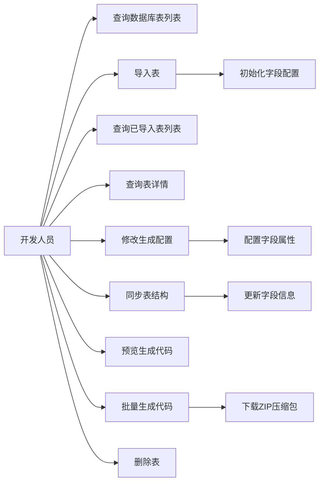
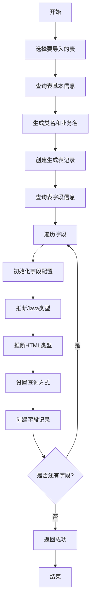
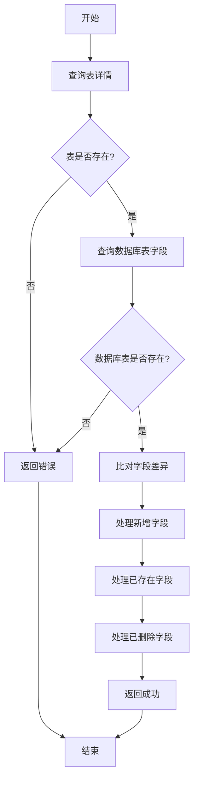
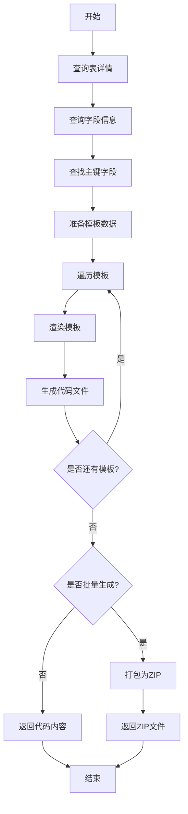
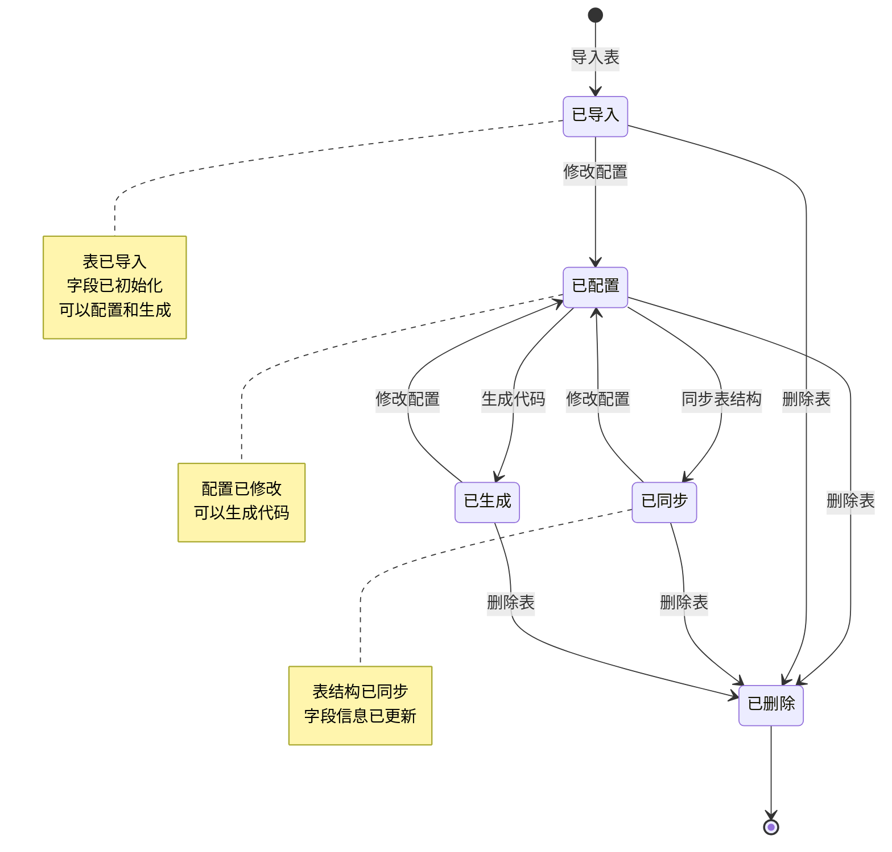
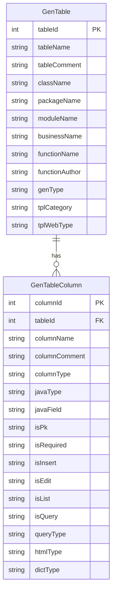

# 代码生成工具模块需求文档

## 1. 概述

### 1.1 模块简介

代码生成工具模块是一个自动化代码生成系统，能够根据数据库表结构自动生成标准的CRUD代码，包括后端NestJS代码（Controller、Service、Module、DTO、Entity）和前端Vue代码（API、页面、组件）。该模块大幅提升开发效率，确保代码规范统一。

### 1.2 核心功能

- 数据库表导入和管理
- 表结构同步
- 代码生成配置管理
- 字段属性配置（Java类型、HTML类型、查询方式等）
- 代码预览
- 批量代码生成并打包下载
- 多模板支持（NestJS、Vue）

### 1.3 业务价值

- 大幅提升开发效率，减少重复劳动
- 确保代码规范统一，降低维护成本
- 支持快速原型开发
- 减少人为错误，提高代码质量
- 支持自定义模板，灵活扩展

## 2. 用例分析

### 2.1 用例图



### 2.2 用例描述

#### UC-01: 查询数据库表列表

- 参与者: 开发人员
- 前置条件: 用户已登录
- 主流程:
  1. 开发人员输入查询条件（表名、表注释）
  2. 系统查询数据库中未导入的表
  3. 系统过滤系统表（qrtz*、gen*前缀）
  4. 系统返回表列表及总数
- 性能要求:
  - 支持分页查询
  - 使用数据库元数据查询

#### UC-02: 导入表

- 参与者: 开发人员
- 前置条件: 用户已登录
- 主流程:
  1. 开发人员选择要导入的表（支持多选）
  2. 系统查询表的基本信息（表名、注释）
  3. 系统根据配置生成类名、业务名等
  4. 系统创建生成表记录
  5. 系统查询表的字段信息
  6. 系统初始化每个字段的配置（Java类型、HTML类型、查询方式等）
  7. 系统创建字段记录
  8. 返回导入成功
- 业务规则:
  - 自动去除表前缀（如sys\_）
  - 表名转换为PascalCase作为类名
  - 业务名取表名最后一个下划线后的部分
  - 字段名转换为camelCase作为Java字段名
  - 根据字段类型自动推断Java类型和HTML类型

#### UC-03: 同步表结构

- 参与者: 开发人员
- 前置条件: 表已导入
- 主流程:
  1. 开发人员选择要同步的表
  2. 系统查询表的当前字段信息
  3. 系统查询数据库中表的最新字段信息
  4. 系统比对字段差异
  5. 对于新增字段，系统初始化配置并插入
  6. 对于已存在字段，系统更新字段信息（保留查询方式和字典类型）
  7. 对于已删除字段，系统从数据库删除
  8. 返回同步成功
- 异常流程:
  - 表不存在：提示"同步数据失败，原表结构不存在"
  - 数据库表不存在：提示"同步数据失败，原表结构不存在"

#### UC-04: 修改生成配置

- 参与者: 开发人员
- 前置条件: 表已导入
- 主流程:
  1. 开发人员查询表详情
  2. 开发人员修改表配置（类名、业务名、功能名等）
  3. 开发人员修改字段配置（Java类型、HTML类型、是否必填、是否查询等）
  4. 系统更新表配置
  5. 系统更新字段配置
  6. 返回更新成功
- 配置项:
  - 表配置：类名、包路径、模块名、业务名、功能名、作者、模板类型
  - 字段配置：Java类型、Java字段名、是否必填、是否插入、是否编辑、是否列表、是否查询、查询方式、HTML类型、字典类型

#### UC-05: 预览生成代码

- 参与者: 开发人员
- 前置条件: 表已导入并配置
- 主流程:
  1. 开发人员选择要预览的表
  2. 系统查询表详情和字段信息
  3. 系统根据模板生成代码
  4. 系统返回生成的代码内容（多个文件）
- 生成文件:
  - NestJS: entity.ts, dto.ts, controller.ts, service.ts, module.ts
  - Vue: api.js, index.vue, indexDialog.vue

#### UC-06: 批量生成代码

- 参与者: 开发人员
- 前置条件: 表已导入并配置
- 主流程:
  1. 开发人员选择要生成代码的表（支持多选）
  2. 系统查询表详情和字段信息
  3. 系统根据模板生成代码
  4. 系统将生成的代码打包为ZIP文件
  5. 系统返回ZIP文件供下载
  6. 下载完成后删除临时文件
- 文件结构:
  ```
  download.zip
  ├── nestjs/
  │   └── {BusinessName}/
  │       ├── entities/{businessName}.entity.ts
  │       ├── dto/{businessName}.dto.ts
  │       ├── {businessName}.controller.ts
  │       ├── {businessName}.service.ts
  │       └── {businessName}.module.ts
  └── vue/
      └── {BusinessName}/
          ├── {businessName}.js
          └── {businessName}/
              ├── index.vue
              └── components/indexDialog.vue
  ```

#### UC-07: 删除表

- 参与者: 开发人员
- 前置条件: 表已导入
- 主流程:
  1. 开发人员选择要删除的表
  2. 系统删除表的所有字段记录
  3. 系统删除表记录
  4. 返回删除成功
- 说明: 物理删除，不可恢复

## 3. 业务流程

### 3.1 导入表流程



### 3.2 同步表结构流程



### 3.3 生成代码流程



## 4. 状态管理

### 4.1 生成表状态图



## 5. 数据模型

### 5.1 核心实体

#### 5.1.1 生成表（GenTable）

| 字段           | 类型     | 必填 | 说明                                    |
| -------------- | -------- | ---- | --------------------------------------- |
| tableId        | Int      | 是   | 表ID（主键）                            |
| tableName      | String   | 是   | 表名称                                  |
| tableComment   | String   | 否   | 表注释                                  |
| className      | String   | 是   | 实体类名称                              |
| packageName    | String   | 是   | 生成包路径                              |
| moduleName     | String   | 是   | 生成模块名                              |
| businessName   | String   | 是   | 生成业务名                              |
| functionName   | String   | 是   | 生成功能名                              |
| functionAuthor | String   | 是   | 生成功能作者                            |
| genType        | String   | 是   | 生成代码方式（0zip压缩包 1自定义路径）  |
| genPath        | String   | 否   | 生成路径                                |
| tplCategory    | String   | 是   | 使用的模板（crud单表操作 tree树表操作） |
| tplWebType     | String   | 是   | 前端模板类型（element-plus）            |
| options        | String   | 否   | 其他生成选项                            |
| status         | Status   | 是   | 状态                                    |
| delFlag        | DelFlag  | 是   | 删除标志                                |
| createBy       | String   | 是   | 创建者                                  |
| createTime     | DateTime | 是   | 创建时间                                |
| updateBy       | String   | 是   | 更新者                                  |
| updateTime     | DateTime | 是   | 更新时间                                |
| remark         | String   | 否   | 备注                                    |

#### 5.1.2 生成表字段（GenTableColumn）

| 字段          | 类型     | 必填 | 说明                                                                                                                                                |
| ------------- | -------- | ---- | --------------------------------------------------------------------------------------------------------------------------------------------------- |
| columnId      | Int      | 是   | 字段ID（主键）                                                                                                                                      |
| tableId       | Int      | 是   | 归属表ID                                                                                                                                            |
| columnName    | String   | 是   | 列名称                                                                                                                                              |
| columnComment | String   | 否   | 列描述                                                                                                                                              |
| columnType    | String   | 是   | 列类型                                                                                                                                              |
| javaType      | String   | 是   | Java类型                                                                                                                                            |
| javaField     | String   | 是   | Java字段名                                                                                                                                          |
| isPk          | String   | 是   | 是否主键（1是 0否）                                                                                                                                 |
| isIncrement   | String   | 是   | 是否自增（1是 0否）                                                                                                                                 |
| isRequired    | String   | 是   | 是否必填（1是 0否）                                                                                                                                 |
| isInsert      | String   | 是   | 是否为插入字段（1是 0否）                                                                                                                           |
| isEdit        | String   | 是   | 是否编辑字段（1是 0否）                                                                                                                             |
| isList        | String   | 是   | 是否列表字段（1是 0否）                                                                                                                             |
| isQuery       | String   | 是   | 是否查询字段（1是 0否）                                                                                                                             |
| queryType     | String   | 是   | 查询方式（EQ等于 NE不等于 GT大于 LT小于 LIKE模糊 BETWEEN范围）                                                                                      |
| htmlType      | String   | 是   | 显示类型（input文本框 textarea文本域 select下拉框 checkbox复选框 radio单选框 datetime日期控件 imageUpload图片上传 fileUpload文件上传 editor富文本） |
| dictType      | String   | 否   | 字典类型                                                                                                                                            |
| columnDefault | String   | 否   | 列默认值                                                                                                                                            |
| sort          | Int      | 是   | 排序                                                                                                                                                |
| status        | Status   | 是   | 状态                                                                                                                                                |
| delFlag       | DelFlag  | 是   | 删除标志                                                                                                                                            |
| createBy      | String   | 是   | 创建者                                                                                                                                              |
| createTime    | DateTime | 是   | 创建时间                                                                                                                                            |
| updateBy      | String   | 是   | 更新者                                                                                                                                              |
| updateTime    | DateTime | 是   | 更新时间                                                                                                                                            |
| remark        | String   | 否   | 备注                                                                                                                                                |

### 5.2 实体关系图



## 6. 接口定义

### 6.1 接口列表

| 接口路径                     | 方法   | 说明               |
| ---------------------------- | ------ | ------------------ |
| /tool/gen/list               | GET    | 查询已导入表列表   |
| /tool/gen/db/list            | GET    | 查询数据库表列表   |
| /tool/gen/getDataNames       | GET    | 获取数据源名称列表 |
| /tool/gen/importTable        | POST   | 导入表             |
| /tool/gen/synchDb/:tableName | GET    | 同步表结构         |
| /tool/gen/:id                | GET    | 查询表详情         |
| /tool/gen                    | PUT    | 修改生成配置       |
| /tool/gen/:id                | DELETE | 删除表             |
| /tool/gen/batchGenCode/zip   | GET    | 批量生成代码       |
| /tool/gen/preview/:id        | GET    | 预览生成代码       |

### 6.2 接口详细说明

#### 6.2.1 导入表

- 请求方式: POST /tool/gen/importTable
- 请求体: TableName
- 响应: Result<string>
- 业务规则:
  - 支持批量导入（逗号分隔）
  - 自动去除表前缀
  - 自动生成类名和业务名
  - 自动初始化字段配置

#### 6.2.2 同步表结构

- 请求方式: GET /tool/gen/synchDb/:tableName
- 路径参数: tableName（表名称）
- 响应: Result<void>
- 业务规则:
  - 比对字段差异
  - 新增字段自动初始化
  - 已存在字段保留查询方式和字典类型
  - 删除已不存在的字段

#### 6.2.3 批量生成代码

- 请求方式: GET /tool/gen/batchGenCode/zip
- 查询参数: tableNames（表名列表，逗号分隔）
- 响应: ZIP文件流
- 业务规则:
  - 支持批量生成
  - 生成NestJS和Vue代码
  - 打包为ZIP文件
  - 下载后删除临时文件

## 7. 非功能需求

### 7.1 性能要求

| 指标         | 要求         | 说明                     |
| ------------ | ------------ | ------------------------ |
| 接口响应时间 | P99 < 2000ms | 代码生成为计算密集型操作 |
| 并发支持     | 支持10并发   | 代码生成为低频操作       |
| 生成速度     | 单表 < 3秒   | 包含模板渲染和文件打包   |
| ZIP文件大小  | < 10MB       | 单次生成                 |

### 7.2 安全要求

- 仅开发人员可访问
- 生成的代码不包含敏感信息
- 临时文件及时清理
- 防止SQL注入（使用参数化查询）

### 7.3 数据一致性

- 导入表使用事务确保数据一致性
- 同步表结构使用事务
- 删除表级联删除字段

### 7.4 可观测性

- 记录导入、同步、生成操作日志
- 记录错误堆栈
- 记录生成代码的表名和文件数

### 7.5 扩展性

- 支持自定义模板
- 支持多数据源
- 支持自定义字段类型映射
- 支持自定义命名规则

## 8. 业务规则

### 8.1 表名转换规则

- 去除表前缀（如sys\_）
- 转换为PascalCase作为类名
- 业务名取表名最后一个下划线后的部分
- 示例：sys_user -> User (className), user (businessName)

### 8.2 字段名转换规则

- 列名转换为camelCase作为Java字段名
- 示例：user_name -> userName

### 8.3 Java类型推断规则

| 数据库类型                | Java类型 |
| ------------------------- | -------- |
| varchar, char, text       | String   |
| int, bigint, smallint     | Number   |
| decimal, numeric          | Number   |
| date, timestamp, datetime | Date     |
| boolean                   | Boolean  |

### 8.4 HTML类型推断规则

| 字段特征             | HTML类型    |
| -------------------- | ----------- |
| 字段名包含name       | input       |
| 字段名包含status     | radio       |
| 字段名包含type或sex  | select      |
| 字段名包含time或date | datetime    |
| 字段名包含image      | imageUpload |
| 字段名包含file       | fileUpload  |
| 字段名包含content    | editor      |
| 字段类型为text       | textarea    |
| 字段长度>=500        | textarea    |
| 其他                 | input       |

### 8.5 查询方式推断规则

| 字段特征             | 查询方式 |
| -------------------- | -------- |
| 字段名包含name       | LIKE     |
| 字段名包含time或date | BETWEEN  |
| 其他                 | EQ       |

### 8.6 字段配置规则

- 主键字段：不插入、可编辑、可查询、可列表
- 创建时间、更新时间、创建人、更新人：不插入、不编辑、不查询、不列表
- 删除标志、备注：不查询、不列表
- 其他字段：默认可插入、可编辑、可列表、可查询

## 9. 异常处理

### 9.1 业务异常

| 异常场景       | 错误码                | 错误信息                     |
| -------------- | --------------------- | ---------------------------- |
| 表不存在       | BUSINESS_ERROR        | 同步数据失败，原表结构不存在 |
| 数据库表不存在 | BUSINESS_ERROR        | 同步数据失败，原表结构不存在 |
| 代码模板不存在 | DATA_NOT_FOUND        | 代码模板内容不存在           |
| 生成失败       | INTERNAL_SERVER_ERROR | 生成代码失败                 |

### 9.2 异常处理策略

- 使用BusinessException抛出业务异常
- 事务操作失败自动回滚
- 记录详细错误日志
- 临时文件异常时清理资源

## 10. 测试要点

### 10.1 单元测试

- 表名转换逻辑
- 字段名转换逻辑
- Java类型推断
- HTML类型推断
- 查询方式推断
- 字段配置初始化

### 10.2 集成测试

- 导入表完整流程
- 同步表结构完整流程
- 生成代码完整流程
- 预览代码完整流程

### 10.3 边界测试

- 表不存在
- 字段为空
- 特殊字符表名
- 超长表名
- 大量字段（100+）

### 10.4 性能测试

- 批量导入性能
- 批量生成性能
- 大表同步性能

## 11. 缺陷与改进建议

### 11.1 已识别缺陷

| 优先级 | 缺陷描述               | 影响               | 建议                          |
| ------ | ---------------------- | ------------------ | ----------------------------- |
| P2     | 仅支持PostgreSQL数据库 | 无法支持其他数据库 | 添加MySQL、Oracle等数据库支持 |
| P2     | 模板硬编码在代码中     | 无法自定义模板     | 支持模板文件配置              |
| P3     | 缺少代码生成历史记录   | 无法追溯生成记录   | 添加生成历史表                |
| P3     | 缺少模板预览功能       | 无法预览模板效果   | 添加模板预览接口              |

### 11.2 改进建议

1. 多数据库支持
   - 支持MySQL、Oracle、SQL Server
   - 抽象数据库元数据查询接口
   - 支持数据库类型映射配置

2. 模板管理
   - 支持模板文件上传
   - 支持模板在线编辑
   - 支持模板版本管理
   - 支持模板分类和标签

3. 代码生成增强
   - 支持增量生成（仅生成变更部分）
   - 支持代码合并（保留手动修改）
   - 支持自定义生成规则
   - 支持代码格式化

4. 用户体验优化
   - 添加生成进度提示
   - 支持在线预览生成代码
   - 支持代码高亮显示
   - 支持代码下载单个文件

## 12. 依赖关系

### 12.1 上游依赖

- 认证模块：提供用户登录和权限验证
- 数据库：提供表结构元数据

### 12.2 下游依赖

- 无（独立模块）

### 12.3 外部依赖

- Prisma ORM：数据库访问和元数据查询
- archiver：ZIP文件打包
- fs-extra：文件系统操作
- lodash：工具函数
- 模板引擎：代码模板渲染

## 13. 版本历史

| 版本 | 日期       | 作者   | 变更说明                          |
| ---- | ---------- | ------ | --------------------------------- |
| 1.0  | 2026-02-22 | System | 初始版本，支持NestJS和Vue代码生成 |
