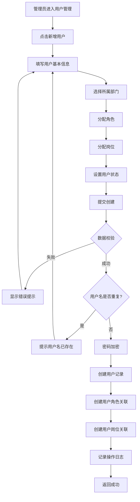
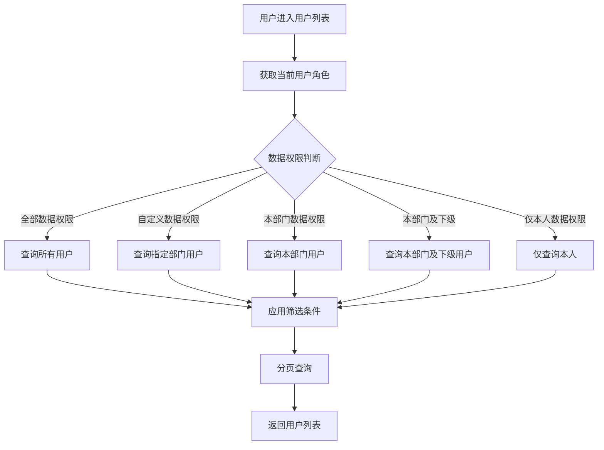
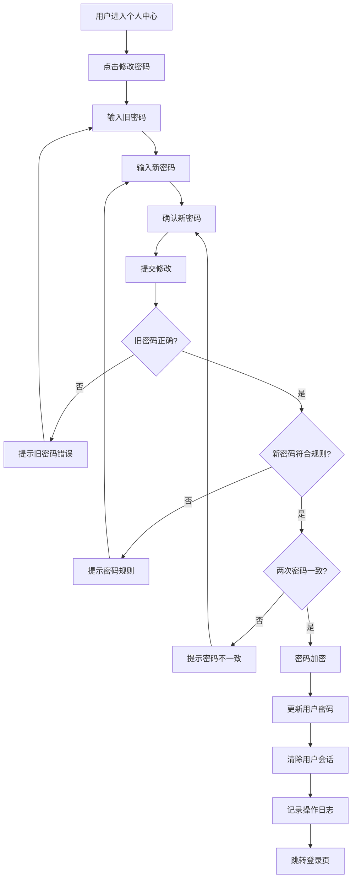
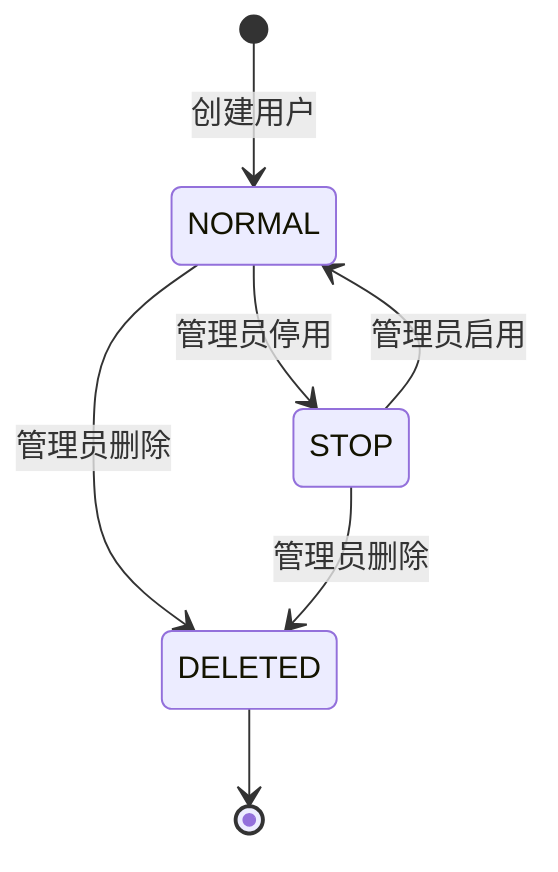
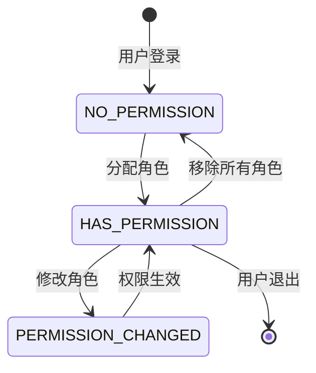

# 用户管理模块 (System User) — 需求文档

> 版本：1.0  
> 日期：2026-02-22  
> 状态：草案  
> 关联设计：[user-design.md](../../../design/admin/system/user-design.md)

---

## 1. 概述

### 1.1 背景

用户管理模块 (`module/admin/system/user`) 是后台管理系统的核心基础模块，负责系统用户的全生命周期管理，包括用户的创建、查询、修改、删除、角色分配、权限管理等功能。该模块与认证模块、角色模块、部门模块、岗位模块紧密关联，是整个权限体系的基础。

当前实现已支持完整的用户 CRUD 操作、数据权限控制、用户导出等功能，但在以下方面存在改进空间：

1. 用户批量操作功能不够完善
2. 用户状态变更缺少审计日志
3. 用户数据权限控制逻辑复杂，需要优化
4. 缺少用户操作历史记录功能

### 1.2 目标

1. 完善用户管理的核心功能，提升用户体验
2. 优化数据权限控制逻辑，提高查询性能
3. 增强用户操作的可追溯性和安全性
4. 为后续扩展（如用户标签、用户分组）预留接口

### 1.3 范围

| 在范围内                  | 不在范围内                  |
| ------------------------- | --------------------------- |
| 用户基本信息管理          | 用户社交账号绑定（在 auth） |
| 用户角色和岗位分配        | 用户登录认证（在 auth）     |
| 用户状态管理（启用/停用） | 用户密码找回（独立功能）    |
| 用户数据权限控制          | 用户行为分析（后续迭代）    |
| 用户列表查询和导出        | 用户标签管理（后续迭代）    |
| 个人中心信息管理          | 用户分组管理（后续迭代）    |
| 用户密码重置              | 用户积分系统（业务功能）    |

---

## 2. 角色与用例

> 图 1：用户管理模块用例图

```mermaid
graph TB
    subgraph 角色
        ADMIN[系统管理员]
        DEPT_ADMIN[部门管理员]
        USER[普通用户]
    end

    subgraph 用户管理
        UC1[创建用户]
        UC2[查询用户列表]
        UC3[查看用户详情]
        UC4[修改用户信息]
        UC5[删除用户]
        UC6[启用/停用用户]
        UC7[重置用户密码]
        UC8[分配用户角色]
        UC9[导出用户数据]
    end

    subgraph 个人中心
        UC10[查看个人信息]
        UC11[修改个人信息]
        UC12[修改个人密码]
        UC13[上传个人头像]
    end

    subgraph 数据权限
        UC14[查看全部用户]
        UC15[查看本部门用户]
        UC16[查看本部门及下级用户]
        UC17[仅查看本人]
    end

    ADMIN --> UC1
    ADMIN --> UC2
    ADMIN --> UC3
    ADMIN --> UC4
    ADMIN --> UC5
    ADMIN --> UC6
    ADMIN --> UC7
    ADMIN --> UC8
    ADMIN --> UC9
    ADMIN --> UC14

    DEPT_ADMIN --> UC2
    DEPT_ADMIN --> UC3
    DEPT_ADMIN --> UC4
    DEPT_ADMIN --> UC15
    DEPT_ADMIN --> UC16

    USER --> UC10
    USER --> UC11
    USER --> UC12
    USER --> UC13
    USER --> UC17
```

---

## 3. 业务流程

### 3.1 创建用户流程

> 图 2：创建用户活动图

### 3.2 用户查询流程

> 图 3：用户查询活动图

### 3.3 修改用户密码流程

> 图 4：修改密码活动图

---

## 4. 状态说明

### 4.1 用户状态机

> 图 5：用户状态图

**状态说明**：

- `NORMAL (0)`：正常状态，用户可以登录和使用系统
- `STOP (1)`：停用状态，用户无法登录，但数据保留
- `DELETED (2)`：删除状态，软删除，数据标记为删除但不物理删除

### 4.2 用户操作权限状态

> 图 6：用户操作权限状态图

---

## 5. 功能需求

### 5.1 创建用户 (POST /system/user)

**功能描述**：管理员创建新用户，可同时分配角色和岗位。

**前置条件**：

- 用户已登录
- 拥有 `system:user:add` 权限

**输入**：

- `userName`: 用户账号（必填，2-30 字符，租户内唯一）
- `nickName`: 用户昵称（必填，0-30 字符）
- `password`: 用户密码（必填，5-200 字符，需符合强密码规则）
- `deptId`: 部门ID（可选）
- `email`: 邮箱地址（可选，0-50 字符）
- `phonenumber`: 手机号码（可选）
- `sex`: 性别（可选，0=男 1=女 2=未知）
- `status`: 用户状态（可选，默认 0=正常）
- `roleIds`: 角色ID列表（可选）
- `postIds`: 岗位ID列表（可选）
- `remark`: 备注（可选，0-500 字符）

**输出**：

- 成功：返回 200，无数据
- 失败：返回错误信息

**业务规则**：

1. 用户名在同一租户下必须唯一
2. 密码使用 bcrypt 加密存储
3. 默认用户类型为 `SYS_USER_TYPE.CUSTOM`（自定义用户）
4. 创建用户时自动设置创建人和创建时间
5. 如果指定了角色，创建用户角色关联记录
6. 如果指定了岗位，创建用户岗位关联记录
7. 记录操作日志

**异常处理**：

- 用户名已存在：返回 400，"用户名已存在"
- 密码不符合规则：返回 400，"密码必须包含字母和数字"
- 部门不存在：返回 400，"部门不存在"
- 角色不存在：返回 400，"角色不存在"

### 5.2 查询用户列表 (GET /system/user/list)

**功能描述**：分页查询用户列表，支持多条件筛选和数据权限控制。

**前置条件**：

- 用户已登录
- 拥有 `system:user:list` 权限

**输入**：

- `pageNum`: 页码（可选，默认 1）
- `pageSize`: 每页数量（可选，默认 10）
- `userName`: 用户账号（可选，模糊查询）
- `nickName`: 用户昵称（可选，模糊查询）
- `email`: 邮箱地址（可选，模糊查询）
- `phonenumber`: 手机号码（可选，模糊查询）
- `status`: 用户状态（可选）
- `deptId`: 部门ID（可选）
- `params.beginTime`: 开始时间（可选）
- `params.endTime`: 结束时间（可选）

**输出**：

- `rows`: 用户列表
- `total`: 总记录数

**业务规则**：

1. 根据当前用户的数据权限过滤结果：
   - 全部数据权限：查询所有用户
   - 自定义数据权限：查询指定部门的用户
   - 本部门数据权限：查询本部门用户
   - 本部门及下级数据权限：查询本部门及下级部门用户
   - 仅本人数据权限：仅查询本人
2. 支持按用户名、昵称、邮箱、手机号模糊查询
3. 支持按状态、部门、创建时间范围筛选
4. 返回结果包含用户的部门信息
5. 密码字段不返回

**异常处理**：

- 无权限：返回 403，"无权限访问"

### 5.3 查看用户详情 (GET /system/user/:userId)

**功能描述**：根据用户ID获取用户详细信息，包括角色和岗位。

**前置条件**：

- 用户已登录
- 拥有 `system:user:query` 权限

**输入**：

- `userId`: 用户ID（路径参数）

**输出**：

- 用户基本信息
- 用户所属部门信息
- 用户已分配的角色列表
- 用户已分配的岗位列表
- 所有可用的角色列表（用于编辑）
- 所有可用的岗位列表（用于编辑）

**业务规则**：

1. 查询用户基本信息
2. 查询用户所属部门
3. 查询用户已分配的角色
4. 查询用户已分配的岗位
5. 查询所有可用的角色（状态为正常）
6. 查询所有可用的岗位（状态为正常）
7. 密码字段不返回

**异常处理**：

- 用户不存在：返回 404，"用户不存在"
- 无权限：返回 403，"无权限访问"

### 5.4 修改用户信息 (PUT /system/user)

**功能描述**：修改用户的基本信息、角色和岗位分配。

**前置条件**：

- 用户已登录
- 拥有 `system:user:edit` 权限

**输入**：

- `userId`: 用户ID（必填）
- 其他字段与创建用户相同（可选）

**输出**：

- 成功：返回 200，无数据
- 失败：返回错误信息

**业务规则**：

1. 不能修改用户名（userName）
2. 如果修改了密码，需要加密后存储
3. 如果修改了角色，先删除旧的角色关联，再创建新的
4. 如果修改了岗位，先删除旧的岗位关联，再创建新的
5. 更新用户的修改人和修改时间
6. 清除用户的 Redis 缓存
7. 记录操作日志

**异常处理**：

- 用户不存在：返回 404，"用户不存在"
- 无权限：返回 403，"无权限访问"
- 部门不存在：返回 400，"部门不存在"

### 5.5 删除用户 (DELETE /system/user/:id)

**功能描述**：批量删除用户（软删除）。

**前置条件**：

- 用户已登录
- 拥有 `admin` 角色

**输入**：

- `id`: 用户ID，多个用逗号分隔（路径参数）

**输出**：

- 成功：返回 200，删除的记录数
- 失败：返回错误信息

**业务规则**：

1. 软删除，设置 `del_flag=2`
2. 不能删除自己
3. 不能删除超级管理员
4. 批量删除时，如果某个用户删除失败，继续删除其他用户
5. 清除被删除用户的 Redis 缓存
6. 记录操作日志

**异常处理**：

- 无权限：返回 403，"无权限访问"
- 删除自己：返回 400，"不能删除自己"
- 删除超级管理员：返回 400，"不能删除超级管理员"

### 5.6 启用/停用用户 (PUT /system/user/changeStatus)

**功能描述**：修改用户的启用/停用状态。

**前置条件**：

- 用户已登录
- 拥有 `admin` 角色

**输入**：

- `userId`: 用户ID（必填）
- `status`: 用户状态（必填，0=正常 1=停用）

**输出**：

- 成功：返回 200，无数据
- 失败：返回错误信息

**业务规则**：

1. 不能停用自己
2. 不能停用超级管理员
3. 停用用户后，清除用户的 Redis 会话
4. 记录操作日志

**异常处理**：

- 无权限：返回 403，"无权限访问"
- 停用自己：返回 400，"不能停用自己"
- 停用超级管理员：返回 400，"不能停用超级管理员"

### 5.7 重置用户密码 (PUT /system/user/resetPwd)

**功能描述**：管理员重置用户密码为默认密码。

**前置条件**：

- 用户已登录
- 拥有 `admin` 角色

**输入**：

- `userId`: 用户ID（必填）
- `password`: 新密码（必填）

**输出**：

- 成功：返回 200，无数据
- 失败：返回错误信息

**业务规则**：

1. 密码使用 bcrypt 加密存储
2. 重置密码后，清除用户的 Redis 会话，强制重新登录
3. 记录操作日志
4. 建议：重置后用户首次登录强制修改密码（待实现）

**异常处理**：

- 无权限：返回 403，"无权限访问"
- 用户不存在：返回 404，"用户不存在"
- 密码不符合规则：返回 400，"密码必须包含字母和数字"

### 5.8 分配用户角色 (PUT /system/user/authRole)

**功能描述**：为用户分配角色。

**前置条件**：

- 用户已登录
- 拥有 `admin` 角色

**输入**：

- `userId`: 用户ID（必填）
- `roleIds`: 角色ID列表，逗号分隔（必填）

**输出**：

- 成功：返回 200，无数据
- 失败：返回错误信息

**业务规则**：

1. 先删除用户的所有角色关联
2. 再创建新的角色关联
3. 更新用户的 Redis 缓存中的角色和权限信息
4. 记录操作日志

**异常处理**：

- 无权限：返回 403，"无权限访问"
- 用户不存在：返回 404，"用户不存在"
- 角色不存在：返回 400，"角色不存在"

### 5.9 获取当前用户信息 (GET /system/user/getInfo)

**功能描述**：获取当前登录用户的详细信息、角色和权限（供前端调用）。

**前置条件**：

- 用户已登录

**输入**：无（从 Token 中解析）

**输出**：

- `user`: 用户基本信息（不含密码）
- `roles`: 角色标识列表（如 ["admin", "common"]）
- `permissions`: 权限标识列表（如 ["system:user:list", "system:user:add"]）

**业务规则**：

1. 从 Redis 会话中读取用户信息
2. 移除密码等敏感字段
3. 返回用户的角色标识列表
4. 返回用户的权限标识列表

**异常处理**：

- Token 无效：返回 401，"未授权"
- 会话不存在：返回 401，"会话已失效"

### 5.10 查看个人信息 (GET /system/user/profile)

**功能描述**：查看当前登录用户的个人信息。

**前置条件**：

- 用户已登录
- 拥有 `system:user:query` 权限

**输入**：无（从 Token 中解析）

**输出**：

- 用户基本信息（不含密码）

**业务规则**：

1. 从 Redis 会话中读取用户信息
2. 移除密码等敏感字段

**异常处理**：

- Token 无效：返回 401，"未授权"

### 5.11 修改个人信息 (PUT /system/user/profile)

**功能描述**：修改当前用户的个人基本信息。

**前置条件**：

- 用户已登录
- 拥有 `system:user:edit` 权限

**输入**：

- `nickName`: 用户昵称（可选）
- `email`: 邮箱地址（可选）
- `phonenumber`: 手机号码（可选）
- `sex`: 性别（可选）

**输出**：

- 成功：返回 200，无数据
- 失败：返回错误信息

**业务规则**：

1. 只能修改自己的信息
2. 不能修改用户名、密码、状态、角色等敏感字段
3. 更新 Redis 会话中的用户信息
4. 记录操作日志

**异常处理**：

- Token 无效：返回 401，"未授权"

### 5.12 修改个人密码 (PUT /system/user/profile/updatePwd)

**功能描述**：修改当前用户的登录密码。

**前置条件**：

- 用户已登录
- 拥有 `system:user:edit` 权限

**输入**：

- `oldPassword`: 旧密码（必填）
- `newPassword`: 新密码（必填）

**输出**：

- 成功：返回 200，无数据
- 失败：返回错误信息

**业务规则**：

1. 验证旧密码是否正确
2. 验证新密码是否符合强密码规则
3. 新密码使用 bcrypt 加密存储
4. 修改密码后，清除用户的所有 Redis 会话，强制重新登录
5. 记录操作日志

**异常处理**：

- 旧密码错误：返回 400，"旧密码错误"
- 新密码不符合规则：返回 400，"密码必须包含字母和数字"

### 5.13 上传个人头像 (POST /system/user/profile/avatar)

**功能描述**：上传并更新当前用户的头像。

**前置条件**：

- 用户已登录
- 拥有 `system:user:edit` 权限

**输入**：

- `avatarfile`: 头像图片文件（必填，支持 jpg/png/gif，最大 2MB）

**输出**：

- `imgUrl`: 头像图片 URL

**业务规则**：

1. 上传图片到文件存储服务
2. 更新用户的头像字段
3. 更新 Redis 会话中的用户信息
4. 记录操作日志

**异常处理**：

- 文件格式不支持：返回 400，"仅支持 jpg/png/gif 格式"
- 文件过大：返回 400，"文件大小不能超过 2MB"
- 上传失败：返回 500，"上传失败，请重试"

### 5.14 导出用户数据 (POST /system/user/export)

**功能描述**：导出用户信息数据为 Excel 文件。

**前置条件**：

- 用户已登录
- 拥有 `system:user:export` 权限

**输入**：

- 与查询用户列表相同的筛选条件

**输出**：

- Excel 文件流

**业务规则**：

1. 根据筛选条件查询用户列表（不分页）
2. 应用数据权限控制
3. 生成 Excel 文件
4. 记录操作日志
5. 导出字段：用户ID、用户账号、用户昵称、部门、邮箱、手机号、状态、创建时间

**异常处理**：

- 无权限：返回 403，"无权限访问"
- 数据量过大：返回 400，"导出数据量过大，请缩小查询范围"

### 5.15 获取部门树 (GET /system/user/deptTree)

**功能描述**：获取部门树形结构，用于用户筛选和分配。

**前置条件**：

- 用户已登录
- 拥有 `system:dept:query` 权限

**输入**：无

**输出**：

- 部门树形结构

**业务规则**：

1. 查询所有正常状态的部门
2. 构建树形结构
3. 按排序字段排序

**异常处理**：

- 无权限：返回 403，"无权限访问"

### 5.16 获取用户选择框列表 (GET /system/user/optionselect)

**功能描述**：获取用户选择框列表，用于其他模块选择用户。

**前置条件**：

- 用户已登录

**输入**：无

**输出**：

- 用户列表（仅包含 userId、userName、nickName）

**业务规则**：

1. 查询所有正常状态的用户
2. 仅返回必要字段

**异常处理**：无

---

## 6. 验收标准

### 6.1 用户管理功能

| 编号  | 验收条件                                            | 可测试方式            |
| ----- | --------------------------------------------------- | --------------------- |
| AC-1  | 创建用户时，用户名在同一租户下必须唯一              | 单元测试              |
| AC-2  | 创建用户时，密码使用 bcrypt 加密存储                | 单元测试 + 数据库检查 |
| AC-3  | 创建用户时，可同时分配角色和岗位                    | 集成测试              |
| AC-4  | 修改用户时，不能修改用户名                          | 单元测试              |
| AC-5  | 修改用户时，如果修改了角色，先删除旧的再创建新的    | 集成测试              |
| AC-6  | 删除用户时，不能删除自己和超级管理员                | 单元测试              |
| AC-7  | 删除用户时，使用软删除，数据不物理删除              | 单元测试 + 数据库检查 |
| AC-8  | 停用用户时，清除用户的 Redis 会话                   | 集成测试              |
| AC-9  | 重置密码后，清除用户的 Redis 会话，强制重新登录     | 集成测试              |
| AC-10 | 分配角色后，更新用户的 Redis 缓存中的角色和权限信息 | 集成测试              |

### 6.2 数据权限控制

| 编号  | 验收条件                                               | 可测试方式 |
| ----- | ------------------------------------------------------ | ---------- |
| AC-11 | 全部数据权限的用户可以查询所有用户                     | 集成测试   |
| AC-12 | 本部门数据权限的用户只能查询本部门用户                 | 集成测试   |
| AC-13 | 本部门及下级数据权限的用户可以查询本部门及下级部门用户 | 集成测试   |
| AC-14 | 仅本人数据权限的用户只能查询自己                       | 集成测试   |
| AC-15 | 自定义数据权限的用户只能查询指定部门的用户             | 集成测试   |

### 6.3 个人中心功能

| 编号  | 验收条件                                       | 可测试方式 |
| ----- | ---------------------------------------------- | ---------- |
| AC-16 | 用户可以查看自己的个人信息                     | 单元测试   |
| AC-17 | 用户可以修改自己的昵称、邮箱、手机号、性别     | 单元测试   |
| AC-18 | 用户不能修改自己的用户名、状态、角色等敏感字段 | 单元测试   |
| AC-19 | 修改密码时，必须验证旧密码                     | 单元测试   |
| AC-20 | 修改密码后，清除所有会话，强制重新登录         | 集成测试   |
| AC-21 | 上传头像时，仅支持 jpg/png/gif 格式，最大 2MB  | 单元测试   |

---

## 7. 非功能需求

| 维度   | 要求                                                     |
| ------ | -------------------------------------------------------- |
| 性能   | 用户列表查询 P95 小于等于 500ms                          |
| 性能   | 用户详情查询 P95 小于等于 200ms                          |
| 性能   | 用户创建/修改 P95 小于等于 300ms                         |
| 可用性 | 用户管理接口可用性 99.9%                                 |
| 安全   | 密码使用 bcrypt 加密存储，不存储明文                     |
| 安全   | 敏感操作（删除、停用、重置密码）需要 admin 角色          |
| 安全   | 用户列表查询必须应用数据权限控制                         |
| 幂等   | 删除用户接口幂等                                         |
| 幂等   | 修改用户状态接口幂等                                     |
| 可观测 | 所有用户操作记录操作日志，包含操作人、操作时间、操作内容 |
| 可观测 | 敏感操作（删除、停用、重置密码）记录详细日志             |
| 扩展性 | 支持扩展用户字段（如用户标签、用户分组）                 |
| 扩展性 | 支持扩展数据权限类型                                     |

---

## 8. 现有实现分析

### 8.1 已实现功能

| 功能               | 实现状态 | 代码位置                                         | 说明                         |
| ------------------ | -------- | ------------------------------------------------ | ---------------------------- |
| 创建用户           | ✅ 完整  | `user.controller.ts` - `create()`                | 支持分配角色和岗位           |
| 查询用户列表       | ✅ 完整  | `user.controller.ts` - `findAll()`               | 支持多条件筛选和数据权限控制 |
| 查看用户详情       | ✅ 完整  | `user.controller.ts` - `findOne()`               | 包含角色和岗位信息           |
| 修改用户信息       | ✅ 完整  | `user.controller.ts` - `update()`                | 支持修改角色和岗位           |
| 删除用户           | ✅ 完整  | `user.controller.ts` - `remove()`                | 软删除，批量删除             |
| 启用/停用用户      | ✅ 完整  | `user.controller.ts` - `changeStatus()`          | 停用后清除会话               |
| 重置用户密码       | ✅ 完整  | `user.controller.ts` - `resetPwd()`              | 管理员重置密码               |
| 分配用户角色       | ✅ 完整  | `user.controller.ts` - `updateAuthRole()`        | 更新角色关联                 |
| 获取当前用户信息   | ✅ 完整  | `user.controller.ts` - `getInfo()`               | 供前端调用                   |
| 查看个人信息       | ✅ 完整  | `user.controller.ts` - `profile()`               | 个人中心                     |
| 修改个人信息       | ✅ 完整  | `user.controller.ts` - `updateProfile()`         | 个人中心                     |
| 修改个人密码       | ✅ 完整  | `user.controller.ts` - `updatePwd()`             | 个人中心                     |
| 上传个人头像       | ✅ 完整  | `user.controller.ts` - `avatar()`                | 个人中心                     |
| 导出用户数据       | ✅ 完整  | `user.controller.ts` - `export()`                | 导出为 Excel                 |
| 获取部门树         | ✅ 完整  | `user.controller.ts` - `deptTree()`              | 用于用户筛选                 |
| 获取用户选择框列表 | ✅ 完整  | `user.controller.ts` - `optionselect()`          | 用于其他模块选择用户         |
| 数据权限控制       | ✅ 完整  | `user.service.ts` - `buildDataScopeConditions()` | 支持 5 种数据权限类型        |
| 密码加密存储       | ✅ 完整  | `user-auth.service.ts` - `register()`            | 使用 bcrypt 加密             |
| 操作日志记录       | ✅ 完整  | 使用 `@Operlog` 装饰器                           | 自动记录操作日志             |

### 8.2 待优化功能

| 功能                 | 实现状态  | 优先级 | 说明                                   |
| -------------------- | --------- | ------ | -------------------------------------- |
| 用户批量导入         | ❌ 未实现 | P1     | 支持 Excel 批量导入用户                |
| 用户操作历史         | ❌ 未实现 | P2     | 记录用户的所有操作历史                 |
| 用户登录历史         | ✅ 部分   | P2     | 已有登录日志，但未关联到用户管理       |
| 用户标签管理         | ❌ 未实现 | P3     | 为用户打标签，便于分类管理             |
| 用户分组管理         | ❌ 未实现 | P3     | 将用户分组，便于批量操作               |
| 用户数据统计         | ❌ 未实现 | P3     | 统计用户数量、活跃度等                 |
| 密码过期提醒         | ❌ 未实现 | P2     | 密码超过 90 天提醒修改                 |
| 首次登录强制修改密码 | ❌ 未实现 | P2     | 管理员重置密码后，用户首次登录强制修改 |

### 8.3 现有缺陷分析

经过仔细审查代码和项目结构，发现以下问题：

#### 8.3.1 数据权限控制逻辑复杂

**问题描述**：

- `buildDataScopeConditions()` 方法逻辑复杂，包含大量嵌套判断
- 数据权限类型硬编码在代码中，不易扩展
- 自定义数据权限的部门ID解析逻辑不够清晰

**影响**：

- 代码可维护性差
- 性能可能受影响（多次数据库查询）
- 扩展新的数据权限类型困难

**建议**：

- 使用策略模式重构数据权限控制逻辑
- 将数据权限类型配置化
- 优化部门查询，使用缓存减少数据库查询

#### 8.3.2 用户修改后 Redis 缓存更新不完整

**问题描述**：

- 修改用户信息后，注释掉了更新 Redis 缓存的代码
- 用户角色变更后，需要手动清除缓存才能生效

**影响**：

- 用户信息修改后，前端显示的信息可能不是最新的
- 用户权限变更后，可能需要重新登录才能生效

**建议**：

- 修改用户信息后，更新 Redis 会话中的用户信息
- 修改用户角色后，更新 Redis 会话中的角色和权限信息
- 提供手动刷新缓存的接口

#### 8.3.3 缺少用户批量操作功能

**问题描述**：

- 仅支持批量删除，不支持批量启用/停用
- 不支持批量分配角色
- 不支持批量导入用户

**影响**：

- 管理大量用户时效率低
- 初始化系统时需要逐个创建用户

**建议**：

- 实现批量启用/停用接口
- 实现批量分配角色接口
- 实现 Excel 批量导入用户功能

#### 8.3.4 密码安全策略不够完善

**问题描述**：

- 管理员重置密码后，用户不需要首次登录强制修改
- 没有密码过期策略
- 没有密码历史记录，用户可以重复使用旧密码

**影响**：

- 密码泄露后风险持续存在
- 用户可能长期使用弱密码

**建议**：

- 实现首次登录强制修改密码
- 实现密码过期策略（如 90 天强制修改）
- 记录密码历史，禁止重复使用最近 3 次密码

#### 8.3.5 用户操作审计不够完善

**问题描述**：

- 仅记录操作日志，没有记录用户状态变更历史
- 无法追溯用户的角色变更历史
- 无法查看用户的登录历史（虽然有登录日志表，但未关联到用户管理）

**影响**：

- 出现问题时难以追溯
- 无法进行用户行为分析

**建议**：

- 记录用户状态变更历史（创建、修改、删除、启用、停用）
- 记录用户角色变更历史
- 在用户详情页展示用户的登录历史

---

## 9. 与市面上产品的差距

### 9.1 与主流后台管理系统对比

| 功能                 | 本系统 | RuoYi-Vue-Plus | Ant Design Pro | 说明                                 |
| -------------------- | ------ | -------------- | -------------- | ------------------------------------ |
| 用户基本管理         | ✅     | ✅             | ✅             | 基础功能                             |
| 数据权限控制         | ✅     | ✅             | ✅             | 支持 5 种数据权限类型                |
| 用户批量导入         | ❌     | ✅             | ✅             | 本系统未实现                         |
| 用户批量操作         | 部分   | ✅             | ✅             | 本系统仅支持批量删除                 |
| 用户操作历史         | ❌     | ✅             | ✅             | 本系统未实现                         |
| 用户登录历史         | 部分   | ✅             | ✅             | 本系统有登录日志，但未关联到用户管理 |
| 用户标签管理         | ❌     | ✅             | ❌             | 本系统未实现                         |
| 用户分组管理         | ❌     | ❌             | ✅             | 本系统未实现                         |
| 密码过期策略         | ❌     | ✅             | ❌             | 本系统未实现                         |
| 首次登录强制修改密码 | ❌     | ✅             | ❌             | 本系统未实现                         |
| 用户数据统计         | ❌     | ✅             | ✅             | 本系统未实现                         |
| 用户头像上传         | ✅     | ✅             | ✅             | 基础功能                             |
| 用户导出             | ✅     | ✅             | ✅             | 基础功能                             |

### 9.2 差距总结

1. **基础功能完善度**：本系统已实现核心的用户管理功能，但缺少批量操作、批量导入等提升效率的功能
2. **安全性**：缺少密码过期策略、首次登录强制修改密码等安全机制
3. **可追溯性**：缺少用户操作历史、状态变更历史等审计功能
4. **用户体验**：缺少用户标签、用户分组等便于管理的功能
5. **数据分析**：缺少用户数据统计、活跃度分析等功能

---

## 10. 改进建议与待办事项

### 10.1 短期改进（1-2 个迭代）

| 优先级 | 功能                | 工作量 | 说明                       |
| ------ | ------------------- | ------ | -------------------------- |
| P0     | 修复 Redis 缓存更新 | 1 天   | 修改用户后更新 Redis 缓存  |
| P1     | 实现用户批量导入    | 3 天   | 支持 Excel 批量导入用户    |
| P1     | 实现批量启用/停用   | 1 天   | 批量修改用户状态           |
| P1     | 实现批量分配角色    | 2 天   | 批量为用户分配角色         |
| P2     | 优化数据权限控制    | 3 天   | 使用策略模式重构，提升性能 |

### 10.2 中期改进（3-6 个月）

| 优先级 | 功能                     | 工作量 | 说明                                   |
| ------ | ------------------------ | ------ | -------------------------------------- |
| P2     | 实现用户操作历史         | 3 天   | 记录用户的所有操作历史                 |
| P2     | 实现用户状态变更历史     | 2 天   | 记录用户状态变更历史                   |
| P2     | 实现密码过期策略         | 3 天   | 密码超过 90 天强制修改                 |
| P2     | 实现首次登录强制修改密码 | 2 天   | 管理员重置密码后，用户首次登录强制修改 |
| P3     | 关联登录历史到用户管理   | 2 天   | 在用户详情页展示登录历史               |

### 10.3 长期规划（6 个月以上）

| 优先级 | 功能             | 工作量 | 说明                         |
| ------ | ---------------- | ------ | ---------------------------- |
| P3     | 实现用户标签管理 | 5 天   | 为用户打标签，便于分类管理   |
| P3     | 实现用户分组管理 | 5 天   | 将用户分组，便于批量操作     |
| P3     | 实现用户数据统计 | 3 天   | 统计用户数量、活跃度等       |
| P3     | 实现用户行为分析 | 7 天   | 分析用户的操作行为，生成报表 |

### 10.4 技术债务

| 问题                 | 影响     | 建议                       |
| -------------------- | -------- | -------------------------- |
| 数据权限控制逻辑复杂 | 可维护性 | 使用策略模式重构           |
| Redis 缓存更新不完整 | 功能缺陷 | 立即修复，确保缓存一致性   |
| 缺少用户批量操作     | 效率低   | 补充实现，提升管理效率     |
| 密码安全策略不完善   | 安全风险 | 逐步完善，降低密码泄露风险 |
| 用户操作审计不完善   | 可追溯性 | 补充实现，提升系统可追溯性 |

---

## 11. 附录

### 11.1 相关文档

- [用户管理模块设计文档](../../../design/admin/system/user-design.md)
- [认证模块需求文档](../../auth/auth-requirements.md)
- [角色管理模块需求文档](./role-requirements.md)
- [部门管理模块需求文档](./dept-requirements.md)
- [后端开发规范](../../../../../CODING_RULES.md)

### 11.2 参考资料

- [RBAC 权限模型](https://en.wikipedia.org/wiki/Role-based_access_control)
- [数据权限控制最佳实践](https://www.owasp.org/index.php/Access_Control_Cheat_Sheet)
- [RuoYi-Vue-Plus 用户管理](https://gitee.com/dromara/RuoYi-Vue-Plus)

### 11.3 术语表

| 术语           | 说明                                          |
| -------------- | --------------------------------------------- |
| 数据权限       | 控制用户可以查看哪些数据的权限                |
| 全部数据权限   | 可以查看所有数据                              |
| 本部门数据权限 | 只能查看本部门的数据                          |
| 本部门及下级   | 可以查看本部门及下级部门的数据                |
| 仅本人数据权限 | 只能查看自己的数据                            |
| 自定义数据权限 | 可以查看指定部门的数据                        |
| 软删除         | 标记为删除但不物理删除数据                    |
| bcrypt         | 一种密码哈希算法                              |
| RBAC           | Role-Based Access Control，基于角色的访问控制 |
