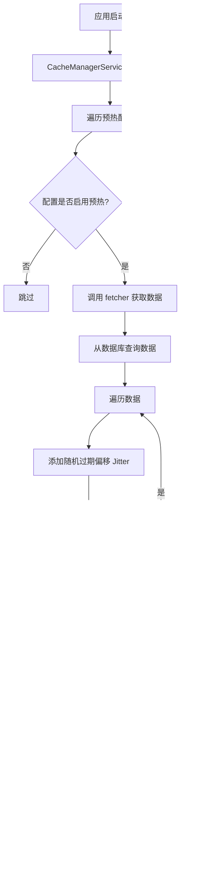

# Common（公共基础设施）模块 — 需求文档

> 版本：1.0
> 日期：2026-02-22
> 模块路径：`src/module/common/`
> 设计文档：[common-design.md](../../design/common/common-design.md)
> 状态：现状分析 + 改进建议

---

## 1. 概述

### 1.1 背景

Common 模块是整个后端系统的核心基础设施层，为所有业务模块提供通用能力。使用 `@Global()` 装饰器全局导出，无需在各业务模块重复导入。包含 3 个子模块：

| 子模块 | 职责                                 | 复杂度 | 代码文件数 |
| ------ | ------------------------------------ | ------ | ---------- |
| redis  | 缓存管理、分布式锁、缓存预热、防雪崩 | 中     | 3          |
| bull   | 异步队列、任务调度、重试机制         | 中     | 2          |
| axios  | HTTP 客户端、IP 地理位置查询         | 低     | 2          |

### 1.2 目标

1. 提供高性能的缓存能力（Redis）
2. 提供可靠的异步任务调度能力（Bull）
3. 提供 HTTP 客户端和 IP 地理位置查询能力（Axios）
4. 支持分布式锁，保证并发安全
5. 支持缓存预热和防雪崩机制
6. 支持任务重试和失败处理

### 1.3 范围

本文档覆盖 Common 模块的 3 个子模块，包括：

- Redis 缓存管理（String、Hash、List、分布式锁）
- Bull 异步队列（任务调度、重试机制、监控）
- Axios HTTP 客户端（IP 地理位置查询）

---

## 2. 角色与用例

### 2.1 角色定义

| 角色       | 说明           | 权限                                 |
| ---------- | -------------- | ------------------------------------ |
| 系统管理员 | 管理缓存和队列 | 查看缓存统计、查看队列状态、清理缓存 |
| 开发者     | 使用公共服务   | 调用 Redis、Bull、Axios 服务         |
| 系统       | 自动化处理     | 缓存预热、任务调度、IP 查询          |

### 2.2 用例图

> 图 1：Common 模块用例图


---

## 3. 业务流程

### 3.1 缓存预热流程

> 图 2：缓存预热活动图



**关键设计**：

1. 模块启动时自动预热字典和配置数据
2. 使用 Jitter 策略防止缓存雪崩（随机 0-5 分钟偏移）
3. 预热失败不影响应用启动

### 3.2 分布式锁使用流程

> 图 3：分布式锁使用活动图


**关键设计**：

1. 使用 Redis `SET key val PX ttl NX` 实现分布式锁
2. 锁自动过期，防止死锁
3. 业务执行完成后释放锁

### 3.3 异步任务调度流程

> 图 4：异步任务调度活动图


**关键设计**：

1. 任务异步执行，不阻塞主流程
2. 失败自动重试 3 次，使用指数退避策略
3. 已完成任务自动清理，防止 Redis 堆积

### 3.4 IP 地理位置查询流程

> 图 5：IP 地理位置查询活动图


**关键设计**：

1. 异步查询，不阻塞登录/操作流程
2. 使用 3 秒超时，防止第三方 API 延迟
3. 失败降级返回"未知"，不影响主流程

---

## 4. 状态说明

Common 模块本身无状态机，但管理的资源有状态：

### 4.1 缓存状态

| 状态   | 说明              | 允许操作                   |
| ------ | ----------------- | -------------------------- |
| 未缓存 | 数据不在 Redis 中 | 查询数据库并缓存           |
| 已缓存 | 数据在 Redis 中   | 直接返回                   |
| 已过期 | TTL 到期          | 自动删除，下次查询重新缓存 |

### 4.2 任务状态

| 状态      | 说明     | 允许操作   |
| --------- | -------- | ---------- |
| waiting   | 等待执行 | 取消、查看 |
| active    | 正在执行 | 查看       |
| completed | 执行成功 | 查看、删除 |
| failed    | 执行失败 | 重试、删除 |
| delayed   | 延迟执行 | 取消、查看 |

---

## 5. 现有功能详述

### 5.1 Redis 子模块

#### 5.1.1 核心方法

| 方法    | 说明              | 参数              | 返回值           |
| ------- | ----------------- | ----------------- | ---------------- |
| set     | 设置缓存          | key, value, ttl   | 'OK' 或 null     |
| get     | 获取缓存          | key               | any              |
| del     | 删除缓存          | keys              | number           |
| tryLock | 尝试获取分布式锁  | key, ttl          | boolean          |
| unlock  | 释放分布式锁      | key               | number           |
| hset    | Hash 设置单个字段 | key, field, value | string 或 number |
| hget    | Hash 获取单个字段 | key, field        | string 或 number |
| lPush   | List 头部插入     | key, values       | number           |
| lRange  | List 范围查询     | key, start, stop  | string[]         |

#### 5.1.2 CacheManager 方法

| 方法        | 说明                  | 参数            | 返回值    |
| ----------- | --------------------- | --------------- | --------- |
| warmup      | 预热指定缓存          | name            | void      |
| warmupAll   | 预热所有缓存          | 无              | void      |
| refresh     | 刷新指定缓存          | name            | void      |
| set         | 设置缓存（带 Jitter） | key, value, ttl | void      |
| get         | 获取缓存              | key             | T 或 null |
| delByPrefix | 按前缀批量删除        | prefix          | void      |

### 5.2 Bull 子模块

#### 5.2.1 核心配置

| 配置项           | 值          | 说明                      |
| ---------------- | ----------- | ------------------------- |
| keyPrefix        | `bull:`     | Redis 键前缀，防止污染    |
| attempts         | 3           | 失败重试次数              |
| backoff          | exponential | 重试策略（指数退避）      |
| removeOnComplete | 100         | 保留最近 100 个已完成任务 |
| removeOnFail     | 1000        | 保留最近 1000 个失败任务  |

#### 5.2.2 队列守卫

| 守卫             | 说明                 | 权限                      |
| ---------------- | -------------------- | ------------------------- |
| QueueAccessGuard | 控制队列监控面板访问 | monitor:queue:view/manage |

### 5.3 Axios 子模块

#### 5.3.1 核心方法

| 方法         | 说明             | 参数 | 返回值 |
| ------------ | ---------------- | ---- | ------ |
| getIpAddress | 获取 IP 地理位置 | ip   | string |

#### 5.3.2 第三方 API

| API      | 说明            | 编码 | 超时 |
| -------- | --------------- | ---- | ---- |
| pconline | IP 地理位置查询 | GBK  | 3 秒 |

---

## 6. 现有逻辑不足分析

### 6.1 Redis 子模块缺陷

| 编号 | 问题                   | 严重度 | 详述                                                                               |
| ---- | ---------------------- | ------ | ---------------------------------------------------------------------------------- |
| D-1  | 分布式锁释放不安全     | P1     | `unlock` 直接 `del`，未比对锁的值（Token），可能误删其他进程的锁。                 |
| D-2  | reset 方法使用 keys \* | P1     | `reset()` 使用 `keys *` 后跟 `del`，在生产环境海量 Key 场景下会阻塞 Redis 主线程。 |
| D-3  | 无缓存穿透保护         | P2     | 缓存未命中时直接查询数据库，高并发下可能导致缓存穿透。                             |
| D-4  | 无缓存击穿保护         | P2     | 热点 Key 过期时，大量请求同时查询数据库，可能导致缓存击穿。                        |
| D-5  | 无缓存监控             | P2     | 缺少缓存命中率、QPS、慢查询等监控指标。                                            |
| D-6  | 无缓存版本控制         | P3     | 缓存数据结构变更时，无法平滑升级，可能导致反序列化失败。                           |

### 6.2 Bull 子模块缺陷

| 编号 | 问题             | 严重度 | 详述                                                                   |
| ---- | ---------------- | ------ | ---------------------------------------------------------------------- |
| D-7  | 无任务幂等性保护 | P1     | 任务重试时，如果业务逻辑不具备幂等性，可能导致重复执行（如重复入账）。 |
| D-8  | 无任务优先级     | P2     | 所有任务按 FIFO 顺序执行，无法优先处理重要任务。                       |
| D-9  | 无任务超时控制   | P2     | 任务执行时间过长时，无法自动终止，可能导致 Worker 阻塞。               |
| D-10 | 无任务监控告警   | P2     | 缺少任务失败率、执行时长等监控指标和告警。                             |
| D-11 | 无任务依赖管理   | P3     | 无法定义任务之间的依赖关系（如任务 B 依赖任务 A 完成）。               |

### 6.3 Axios 子模块缺陷

| 编号 | 问题            | 严重度 | 详述                                                                           |
| ---- | --------------- | ------ | ------------------------------------------------------------------------------ |
| D-12 | IP API 单点依赖 | P1     | 仅依赖单一第三方查询源，若该源永久失效或限制频率，地理位置功能将降级为"未知"。 |
| D-13 | IP API 硬编码   | P2     | `IP_URL` 硬编码在方法内，建议迁移至配置文件。                                  |
| D-14 | 无 IP 查询缓存  | P2     | 同一 IP 重复查询时，未使用缓存，浪费第三方 API 配额。                          |
| D-15 | 无 IP 查询限流  | P2     | 高并发下可能触发第三方 API 限流，导致查询失败。                                |

### 6.4 跨模块缺陷

| 编号 | 问题           | 严重度 | 涉及模块             | 详述                                               |
| ---- | -------------- | ------ | -------------------- | -------------------------------------------------- |
| X-1  | 无统一监控面板 | P1     | redis + bull         | 缺少统一的监控面板，无法查看缓存和队列的实时状态。 |
| X-2  | 无统一告警机制 | P1     | redis + bull         | 缺少统一的告警机制，无法及时发现缓存和队列异常。   |
| X-3  | 无统一日志规范 | P2     | redis + bull + axios | 日志格式不统一，难以追踪问题。                     |

### 6.5 架构层面不足

| 编号 | 问题         | 详述                                                         |
| ---- | ------------ | ------------------------------------------------------------ |
| A-1  | 无多级缓存   | 缺少本地缓存（如 LRU），所有请求都访问 Redis，增加网络开销。 |
| A-2  | 无缓存预加载 | 缺少缓存预加载机制，热点数据首次访问时仍需查询数据库。       |
| A-3  | 无任务编排   | 缺少任务编排能力，无法定义复杂的任务流（如 DAG）。           |
| A-4  | 无分布式追踪 | 缺少分布式追踪，无法追踪跨服务的请求链路。                   |
| A-5  | 无服务降级   | 缺少服务降级机制，Redis 或 Bull 故障时，无法自动降级。       |

---

## 7. 市面主流系统对标

### 7.1 功能对比矩阵

| 功能         | 本系统 | Spring Boot | Django | Express | 差距评估   |
| ------------ | ------ | ----------- | ------ | ------- | ---------- |
| Redis 缓存   | 有     | 有          | 有     | 有      | 持平       |
| 分布式锁     | 有     | 有          | 有     | 有      | 持平       |
| 缓存预热     | 有     | 有          | 有     | 有      | 持平       |
| 防雪崩       | 有     | 有          | 有     | 有      | 持平       |
| 异步队列     | 有     | 有          | 有     | 有      | 持平       |
| 任务重试     | 有     | 有          | 有     | 有      | 持平       |
| IP 地理位置  | 有     | 有          | 有     | 有      | 持平       |
| 缓存穿透保护 | 无     | 有          | 有     | 有      | 缺失（P2） |
| 缓存击穿保护 | 无     | 有          | 有     | 有      | 缺失（P2） |
| 多级缓存     | 无     | 有          | 有     | 有      | 缺失（P2） |
| 任务优先级   | 无     | 有          | 有     | 有      | 缺失（P2） |
| 任务编排     | 无     | 有          | 有     | 有      | 缺失（P3） |
| 统一监控面板 | 无     | 有          | 有     | 有      | 缺失（P1） |
| 分布式追踪   | 无     | 有          | 有     | 有      | 缺失（P3） |

### 7.2 差距总结

本系统在 Common 的核心功能（Redis 缓存、分布式锁、异步队列、IP 查询）上已具备基本能力，但在以下方面存在明显差距：

1. 缓存保护机制缺失（P2）：无缓存穿透保护、无缓存击穿保护
2. 监控告警缺失（P1）：无统一监控面板、无统一告警机制
3. 任务管理不足（P2）：无任务优先级、无任务超时控制
4. 架构扩展性不足（P2）：无多级缓存、无任务编排

---

## 8. 验收标准

### 8.1 现有功能验收

| 编号 | 验收条件                          | 状态   |
| ---- | --------------------------------- | ------ |
| AC-1 | 缓存预热在应用启动时自动执行      | 已通过 |
| AC-2 | 缓存预热使用 Jitter 策略防止雪崩  | 已通过 |
| AC-3 | 分布式锁使用 SET NX PX 实现       | 已通过 |
| AC-4 | 异步任务失败自动重试 3 次         | 已通过 |
| AC-5 | IP 地理位置查询失败降级返回"未知" | 已通过 |

### 8.2 待修复验收

| 编号  | 验收条件                             | 状态   | 对应缺陷 |
| ----- | ------------------------------------ | ------ | -------- |
| AC-6  | 分布式锁释放时比对 Token，防止误删   | 未实现 | D-1      |
| AC-7  | reset 方法使用 SCAN 代替 keys \*     | 未实现 | D-2      |
| AC-8  | 缓存穿透保护（布隆过滤器或空值缓存） | 未实现 | D-3      |
| AC-9  | 缓存击穿保护（互斥锁或逻辑过期）     | 未实现 | D-4      |
| AC-10 | 任务幂等性保护（业务表状态检查）     | 未实现 | D-7      |
| AC-11 | IP 查询缓存（同一 IP 缓存 1 小时）   | 未实现 | D-14     |
| AC-12 | 统一监控面板（缓存 + 队列）          | 未实现 | X-1      |

---

## 9. 演进建议与待办

### 9.1 第一阶段：核心修复（1-2 周）

| 编号 | 任务                 | 对应缺陷 | 预估工时 |
| ---- | -------------------- | -------- | -------- |
| T-1  | 分布式锁释放安全优化 | D-1      | 0.5d     |
| T-2  | reset 方法使用 SCAN  | D-2      | 0.5d     |
| T-3  | IP 查询缓存          | D-14     | 1d       |
| T-4  | IP API 配置化        | D-13     | 0.5d     |
| T-5  | 任务幂等性文档和示例 | D-7      | 1d       |

### 9.2 第二阶段：缓存保护（2-3 周）

| 编号 | 任务                       | 对应缺陷 | 预估工时 |
| ---- | -------------------------- | -------- | -------- |
| T-6  | 缓存穿透保护（布隆过滤器） | D-3      | 2-3d     |
| T-7  | 缓存击穿保护（互斥锁）     | D-4      | 2d       |
| T-8  | 缓存监控指标               | D-5      | 2d       |
| T-9  | 任务监控指标               | D-10     | 2d       |

### 9.3 第三阶段：监控告警（1-2 月）

| 编号 | 任务         | 对应缺陷 | 预估工时 |
| ---- | ------------ | -------- | -------- |
| T-10 | 统一监控面板 | X-1      | 1-2w     |
| T-11 | 统一告警机制 | X-2      | 1w       |
| T-12 | 任务优先级   | D-8      | 1w       |
| T-13 | 任务超时控制 | D-9      | 1w       |

### 9.4 第四阶段：架构优化（3-6 月）

| 编号 | 任务       | 说明                      |
| ---- | ---------- | ------------------------- |
| T-14 | 多级缓存   | 本地缓存 + Redis 缓存     |
| T-15 | 任务编排   | 支持 DAG 任务流           |
| T-16 | 分布式追踪 | 集成 OpenTelemetry        |
| T-17 | 服务降级   | Redis/Bull 故障时自动降级 |

### 9.5 关键路径

```
T-1(分布式锁优化) → T-2(SCAN 优化) → T-6(缓存穿透保护) → T-7(缓存击穿保护) → T-10(监控面板)
```

**优先级总结**：

| 优先级 | 任务数 | 核心内容                                          | 预估工时 |
| ------ | ------ | ------------------------------------------------- | -------- |
| P0     | 5 项   | 分布式锁优化 + SCAN 优化 + IP 缓存 + 幂等性文档   | 1-2 周   |
| P1     | 4 项   | 缓存穿透保护 + 缓存击穿保护 + 缓存监控 + 任务监控 | 2-3 周   |
| P2     | 4 项   | 监控面板 + 告警机制 + 任务优先级 + 任务超时       | 1-2 月   |
| P3     | 4 项   | 多级缓存 + 任务编排 + 分布式追踪 + 服务降级       | 3-6 月   |

---

**文档版本**：1.0
**最后更新**：2026-02-22
**维护者**：Backend Team
