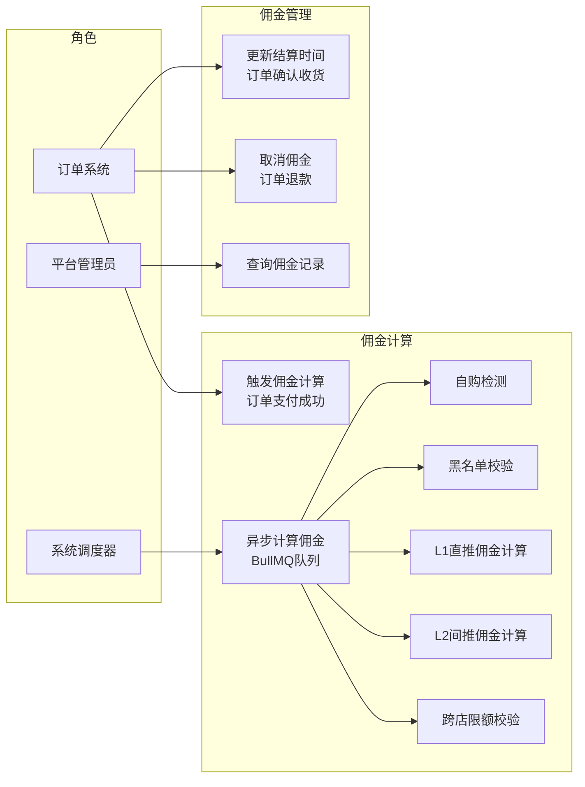
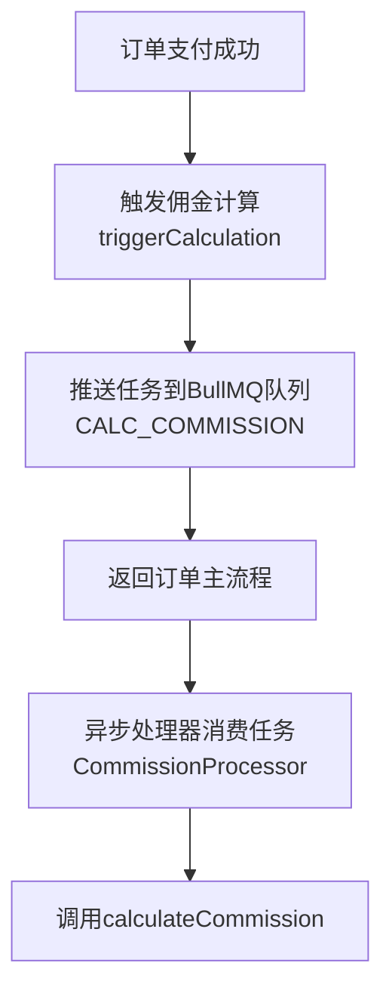
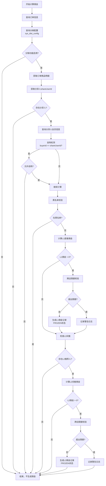
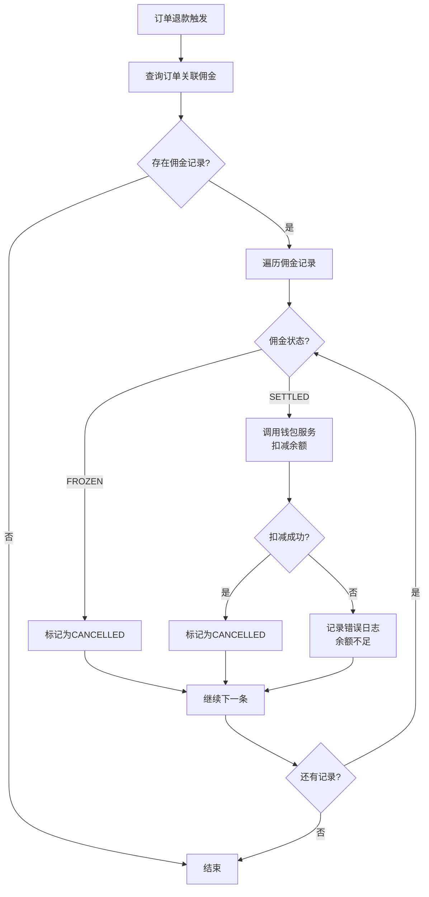
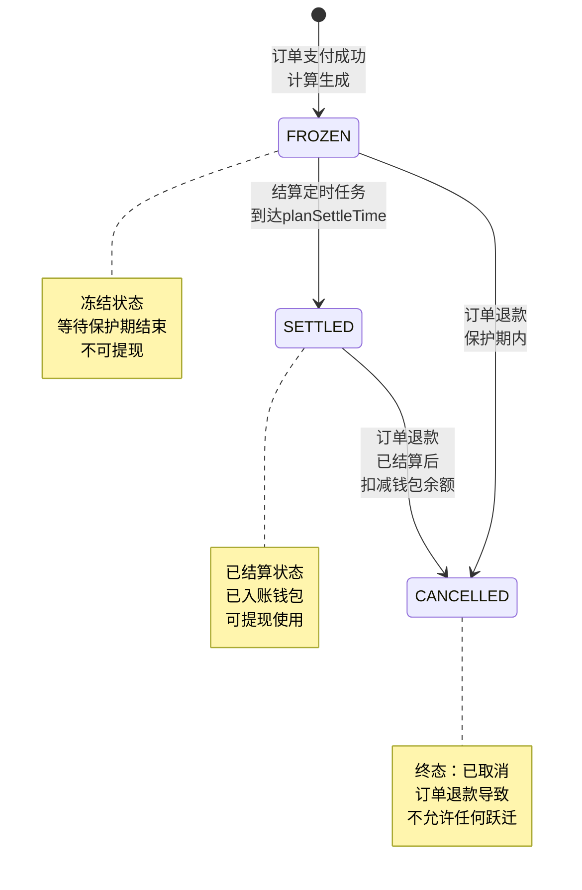

# 佣金模块 - 需求文档

> 版本：1.0  
> 日期：2026-02-24  
> 模块路径：`src/module/finance/commission/`  
> 关联模块：`src/module/client/order`（订单支付回调）、`src/module/finance/wallet`（钱包入账）、`src/module/ums`（会员推荐关系）  
> 状态：现状分析 + 演进规划

---

## 1. 概述

### 1.1 背景

佣金模块是财务系统的资金产生层，负责在订单支付成功后，根据分销配置和推荐关系链，计算并生成冻结状态的佣金记录。系统支持两级分佣（L1 直推、L2 间推），通过 BullMQ 异步队列解耦佣金计算与订单支付主流程，保障交易性能。

当前系统支持自购检测、黑名单校验、跨店分销限额控制、按商品分佣模式（比例/固定）计算等核心能力。佣金在生成时处于 FROZEN 状态，经过保护期后由结算模块自动解冻入账。

核心组件：

| 组件                 | 路径                       | 职责                               |
| -------------------- | -------------------------- | ---------------------------------- |
| CommissionService    | `commission.service.ts`    | 核心业务逻辑：分佣算法、限额校验   |
| CommissionProcessor  | `commission.processor.ts`  | BullMQ 异步处理器：离线计算佣金    |
| CommissionRepository | `commission.repository.ts` | 数据访问层：fin_commission 表 CRUD |

### 1.2 目标

1. 完整描述佣金模块的功能现状、计算规则与数据流
2. 分析系统自身的代码缺陷与架构不足
3. 分析与外部模块（订单、钱包、会员）的跨模块设计缺陷
4. 提出演进建议和优先级排序

### 1.3 范围

| 在范围内                                 | 不在范围内          |
| ---------------------------------------- | ------------------- |
| 佣金计算算法（L1/L2 两级分佣）           | 订单支付流程        |
| 自购检测与黑名单校验                     | 钱包余额管理        |
| 跨店分销限额控制                         | 结算定时任务        |
| 异步队列处理（BullMQ）                   | 前端 Admin Web 页面 |
| 佣金状态管理（FROZEN/SETTLED/CANCELLED） | 提现审核流程        |
| 按商品分佣模式（比例/固定）              | 会员推荐关系维护    |

---

## 2. 角色与用例

> 图 1：佣金模块用例图

**角色说明**：

| 角色       | 职责                                         | 触发方式                 |
| ---------- | -------------------------------------------- | ------------------------ |
| 订单系统   | 支付成功后触发佣金计算，确认收货更新结算时间 | 订单状态变更事件         |
| 系统调度器 | 异步处理佣金计算任务                         | BullMQ 队列消费          |
| 平台管理员 | 查询佣金记录，配置分销规则                   | Admin 后台接口（待建设） |

---

## 3. 业务流程

### 3.1 佣金计算触发流程

> 图 2：佣金计算触发活动图

### 3.2 佣金计算核心流程

> 图 3：佣金计算活动图

### 3.3 佣金取消流程

> 图 4：佣金取消活动图

---

## 4. 状态说明

### 4.1 佣金状态机

> 图 5：佣金状态图

**状态说明**：

| 状态      | 业务含义                         | 是否终态 | 允许跃迁到          |
| --------- | -------------------------------- | -------- | ------------------- |
| FROZEN    | 冻结：等待保护期结束，不可提现   | 否       | SETTLED, CANCELLED  |
| SETTLED   | 已结算：已入账钱包，可提现使用   | 否       | CANCELLED（退款时） |
| CANCELLED | 已取消：订单退款导致，资金已回收 | 是       | 无                  |

---

## 5. 现有功能详述

### 5.1 接口清单

佣金模块为纯内部服务，不暴露 HTTP 接口，由订单支付回调和退款流程内部调用。

| 接口类型  | 说明                                  |
| --------- | ------------------------------------- |
| HTTP 端点 | 无（待建设管理端查询接口）            |
| 内部调用  | 由 OrderService 在支付成功/退款时调用 |
| 异步队列  | BullMQ CALC_COMMISSION 队列           |

### 5.2 核心方法清单

| 方法                 | 类型      | 说明                                 |
| -------------------- | --------- | ------------------------------------ |
| triggerCalculation   | Service   | 触发佣金计算，推送任务到 BullMQ 队列 |
| calculateCommission  | Service   | 核心计算逻辑，生成 L1/L2 佣金记录    |
| checkSelfPurchase    | Service   | 自购检测，判断是否允许自购分佣       |
| checkDailyLimit      | Service   | 跨店限额校验，防止超出单日发放上限   |
| updatePlanSettleTime | Service   | 更新结算时间，订单确认收货时触发     |
| cancelCommissions    | Service   | 取消佣金，订单退款时触发             |
| handleCalcCommission | Processor | BullMQ 异步处理器，消费计算任务      |

### 5.3 分佣计算规则

#### 5.3.1 两级分佣

| 级别 | 名称 | 受益人                     | 计算基数               |
| ---- | ---- | -------------------------- | ---------------------- |
| L1   | 直推 | 订单分享人（shareUserId）  | 商品分佣金额 × L1 比例 |
| L2   | 间推 | 分享人的推荐人（parentId） | 商品分佣金额 × L2 比例 |

#### 5.3.2 商品分佣模式

| 模式     | 说明                   | 计算公式            |
| -------- | ---------------------- | ------------------- |
| 比例分佣 | 按商品价格的百分比计算 | 商品价格 × 分佣比例 |
| 固定分佣 | 每件商品固定金额       | 固定金额 × 商品数量 |

#### 5.3.3 保护期规则

| 商品类型 | 保护期 | 说明                |
| -------- | ------ | ------------------- |
| 实物商品 | T+7    | 确认收货后 7 天解冻 |
| 虚拟商品 | T+1    | 核销后 1 天解冻     |

### 5.4 限制与校验

| 校验项     | 说明                                 | 配置来源           |
| ---------- | ------------------------------------ | ------------------ |
| 自购检测   | 判断购买人是否为分享人本人           | sys_dist_config    |
| 黑名单校验 | 检查分享人是否在黑名单中             | sys_dist_config    |
| 跨店限额   | 单日跨店分销佣金总额不超过配置上限   | sys_dist_config    |
| 佣金上限   | 单笔订单佣金总额不超过订单金额的 50% | 代码硬编码（建议） |

---

## 6. 现有逻辑不足分析

### 6.1 P0 级缺陷（阻塞性）

#### D-1：跨店限额并发漏洞

- 现状：checkDailyLimit 使用 SELECT SUM FOR UPDATE，当天首笔无法命中行锁
- 影响：高并发下多笔订单可能同时读取到 SUM=0，绕过限额逻辑，造成严重超发
- 建议：引入专门的 fin_user_daily_quota 计数器表，锁定具体用户配额行而非聚合结果

#### D-2：佣金上限熔断缺失

- 现状：仅依赖配置比例，缺乏对订单实付金额的最终比例校验
- 影响：若配置被恶意篡改（如比例 >100%），将产生远超订单金额的亏损
- 建议：持久化前增加硬性熔断：Sum(Commissions) <= Order.ActualAmount × 50%

#### D-3：cancelCommissions 非原子操作

- 现状：循环回滚佣金时若发生中断，会导致部分佣金回收失败
- 影响：用户获得退款的同时，仍持有部分已结算佣金，产生财务损失
- 建议：标记为 @Transactional，确保所有佣金回滚在同一事务内完成

### 6.2 P1 级缺陷（高优先级）

#### D-4：幂等性静默忽略风险

- 现状：calculateCommission 使用 upsert 且 update: {}，屏蔽异常重试修正机会
- 影响：若首次计算因配置错误生成 0 元佣金，后续重试无法更新
- 建议：记录计算版本号，仅在 PENDING 状态下允许重算覆盖

#### D-5：钱包余额不足回滚挂起

- 现状：退款触发佣金回滚时，若受益人余额不足，deductBalance 抛出异常
- 影响：回滚失败导致退款流程卡死，或造成系统佣金与钱包状态永久失衡
- 建议：允许负余额存在（作为债权），或建立待回收佣金台账

#### D-6：部分退款分佣逻辑缺失

- 现状：cancelCommissions 采用一刀切策略，未支持按商品比例回滚
- 影响：多商品订单单件退款时，无法精准回收对应比例佣金
- 建议：重构分佣结构，将佣金记录关联至 order_item_id

### 6.3 P2 级缺陷（中优先级）

#### D-7：精度舍入偏差累加

- 现状：L1/L2 计算中过早使用 toDecimalPlaces(2) 执行舍入
- 影响：大规模交易下，微小舍入误差累加导致总账不平
- 建议：内部计算保持 4-6 位精度，仅最终入账时舍入为 2 位

#### D-8：结算时间操纵风险

- 现状：updatePlanSettleTime 缺乏当前状态校验，直接覆盖结算时间
- 影响：虚假事件可能扰乱结算保护期
- 建议：增加单向状态控制，结算时间确定后禁止缩短

#### D-9：交叉受益人死锁风险

- 现状：处理 L1/L2 佣金时，锁定受益人配额顺序依赖订单推荐链
- 影响：A 推荐 B 且 B 推荐 A 的复杂链路同时产生订单时，可能导致死锁
- 建议：预先提取所有受益人 ID，按 ID 升序一次性锁定

### 6.4 P3 级缺陷（低优先级）

#### D-10：缺少佣金查询接口

- 现状：无 HTTP 端点供管理员查询佣金记录
- 影响：运营无法查看佣金明细，排查问题困难
- 建议：新增 GET /admin/finance/commission 接口

#### D-11：缺少佣金统计功能

- 现状：无按时间、用户、商品维度的佣金统计
- 影响：无法分析分销效果，优化分佣策略
- 建议：新增统计接口，支持多维度分析

---

## 7. 市面主流分佣系统对标

### 7.1 功能对比矩阵

| 功能                         | 本系统 | 有赞分销 | 美团联盟 | 拼多多多多进宝 | 差距评估     |
| ---------------------------- | ------ | -------- | -------- | -------------- | ------------ |
| 两级分佣（L1/L2）            | ✅     | ✅       | ✅       | ✅             | 持平         |
| 异步队列解耦                 | ✅     | ✅       | ✅       | ✅             | 持平         |
| 自购检测                     | ✅     | ✅       | ✅       | ✅             | 持平         |
| 黑名单校验                   | ✅     | ✅       | ✅       | ✅             | 持平         |
| 跨店分销限额控制             | ✅     | ✅       | ❌       | ❌             | 领先         |
| 按商品分佣模式（比例/固定）  | ✅     | ✅       | ✅       | ✅             | 持平         |
| 保护期机制（T+7/T+1）        | ✅     | ✅       | ✅       | ✅             | 持平         |
| 佣金状态机（FROZEN/SETTLED） | ✅     | ✅       | ✅       | ✅             | 持平         |
| 订单退款佣金回收             | ✅     | ✅       | ✅       | ✅             | 持平         |
| 幂等性保障                   | ✅     | ✅       | ✅       | ✅             | 持平         |
| 佣金查询接口                 | ❌     | ✅       | ✅       | ✅             | 缺失（P3）   |
| 佣金统计功能                 | ❌     | ✅       | ✅       | ✅             | 缺失（P3）   |
| 佣金上限熔断                 | ❌     | ✅       | ✅       | ✅             | 缺失（P0）   |
| 部分退款按比例回收           | ❌     | ✅       | ✅       | ✅             | 缺失（P1）   |
| 佣金预估功能                 | ❌     | ✅       | ✅       | ✅             | 缺失（低优） |
| 佣金排行榜                   | ❌     | ✅       | ❌       | ✅             | 缺失（低优） |
| 三级及以上分佣               | ❌     | ✅       | ❌       | ❌             | 缺失（低优） |
| 团队佣金（团队长额外奖励）   | ❌     | ✅       | ❌       | ❌             | 缺失（低优） |
| 佣金提现门槛设置             | ❌     | ✅       | ✅       | ✅             | 缺失（低优） |
| 佣金自动结算周期配置         | ❌     | ✅       | ✅       | ❌             | 缺失（低优） |

### 7.2 差距总结

本系统在佣金核心流程（计算 → 冻结 → 结算 → 回收）上功能完整，异步队列解耦和跨店限额控制具有差异化优势。主要差距集中在：

1. 安全基线缺失（P0）：佣金上限熔断缺失，配置被篡改时可能产生超额亏损
2. 并发安全漏洞（P0）：跨店限额首笔并发漏洞、cancelCommissions 非原子操作
3. 功能完善度不足（P1）：部分退款无法按比例回收、钱包余额不足时回滚挂起
4. 运营能力不足（P3）：无查询接口、无统计功能、无佣金预估

---

## 8. 跨模块缺陷

### X-1：直接访问 omsOrder 表

- 现状：calculateCommission 直接 prisma.omsOrder.findUnique
- 影响：绕过订单模块 Service 层，违反模块边界原则
- 建议：通过 OrderService 获取订单信息，或使用事件驱动

### X-2：直接访问 umsMember 表

- 现状：查询推荐关系时直接访问 umsMember 表
- 影响：跨模块直接访问，违反模块边界
- 建议：通过 MemberService 获取会员信息

### X-3：与钱包模块耦合

- 现状：cancelCommissions 直接调用 WalletService.deductBalance
- 影响：钱包余额不足时抛出异常，导致退款流程中断
- 建议：钱包模块支持负余额，或佣金模块建立待回收台账

---

## 9. 验收标准

### 9.1 现有功能验收

| 编号  | 验收条件                                        | 状态      |
| ----- | ----------------------------------------------- | --------- |
| AC-1  | 订单支付成功后触发佣金计算任务                  | ✅ 已通过 |
| AC-2  | 异步队列处理佣金计算，不阻塞订单主流程          | ✅ 已通过 |
| AC-3  | 自购检测：buyerId == shareUserId 时根据配置处理 | ✅ 已通过 |
| AC-4  | 黑名单校验：分享人在黑名单中不生成佣金          | ✅ 已通过 |
| AC-5  | L1 直推佣金计算：商品分佣金额 × L1 比例         | ✅ 已通过 |
| AC-6  | L2 间推佣金计算：商品分佣金额 × L2 比例         | ✅ 已通过 |
| AC-7  | 跨店限额校验：单日跨店佣金不超过配置上限        | ✅ 已通过 |
| AC-8  | 佣金生成时状态为 FROZEN                         | ✅ 已通过 |
| AC-9  | 订单确认收货后更新 planSettleTime               | ✅ 已通过 |
| AC-10 | 订单退款时取消 FROZEN 状态佣金                  | ✅ 已通过 |
| AC-11 | 订单退款时回收 SETTLED 状态佣金（扣减钱包余额） | ✅ 已通过 |
| AC-12 | 幂等性保障：同一订单重复计算不生成重复佣金      | ✅ 已通过 |

### 9.2 待修复验收

| 编号  | 验收条件                                     | 状态      | 对应缺陷 |
| ----- | -------------------------------------------- | --------- | -------- |
| AC-13 | 跨店限额并发安全：高并发下不超发             | ❌ 未实现 | D-1      |
| AC-14 | 佣金上限熔断：总佣金不超过订单金额 50%       | ❌ 未实现 | D-2      |
| AC-15 | cancelCommissions 原子性：所有回滚在同一事务 | ❌ 未实现 | D-3      |
| AC-16 | 幂等性修正：配置错误后重试可更新             | ❌ 未实现 | D-4      |
| AC-17 | 钱包余额不足时支持负余额或台账               | ❌ 未实现 | D-5      |
| AC-18 | 部分退款按商品比例回收佣金                   | ❌ 未实现 | D-6      |
| AC-19 | 精度保持：内部计算 4-6 位，最终入账 2 位     | ❌ 未实现 | D-7      |
| AC-20 | 结算时间单向控制：确定后禁止缩短             | ❌ 未实现 | D-8      |
| AC-21 | 死锁预防：按 ID 升序锁定受益人               | ❌ 未实现 | D-9      |

---

## 10. 演进建议与待办

### 10.1 第一阶段：安全基线修复（1-2 周）

| 编号 | 任务                                    | 对应缺陷 | 预估工时 |
| ---- | --------------------------------------- | -------- | -------- |
| T-1  | 引入 fin_user_daily_quota 计数器表      | D-1      | 1d       |
| T-2  | 增加佣金上限熔断逻辑                    | D-2      | 0.5d     |
| T-3  | cancelCommissions 标记为 @Transactional | D-3      | 0.5h     |
| T-4  | 钱包模块支持负余额或待回收台账          | D-5      | 1d       |

### 10.2 第二阶段：功能完善（2-3 周）

| 编号 | 任务                       | 对应缺陷 | 预估工时 |
| ---- | -------------------------- | -------- | -------- |
| T-5  | 佣金记录关联 order_item_id | D-6      | 1d       |
| T-6  | 精度保持优化               | D-7      | 0.5d     |
| T-7  | 结算时间单向控制           | D-8      | 0.5h     |
| T-8  | 死锁预防：按 ID 升序锁定   | D-9      | 0.5d     |
| T-9  | 新增佣金查询接口           | D-10     | 1d       |
| T-10 | 新增佣金统计功能           | D-11     | 2d       |

### 10.3 第三阶段：架构优化（长期）

| 编号 | 任务                          | 预估工时 |
| ---- | ----------------------------- | -------- |
| T-11 | 消除对 omsOrder 表的直接访问  | 1d       |
| T-12 | 消除对 umsMember 表的直接访问 | 1d       |
| T-13 | 引入事件驱动架构              | 3d       |
| T-14 | 佣金计算规则引擎化            | 5d       |

---

## 11. 非功能需求

### 11.1 性能要求

- 佣金计算任务处理延迟 < 5 秒
- 支持每秒 100 笔订单的佣金计算
- 跨店限额校验响应时间 < 100ms

### 11.2 可靠性要求

- 佣金计算失败自动重试，最多 3 次
- 异常情况下不丢失佣金记录
- 支持手动触发重新计算

### 11.3 安全性要求

- 佣金金额精度保持 2 位小数
- 防止并发超发
- 所有佣金变动记录审计日志

### 11.4 可维护性要求

- 分佣规则配置化，支持动态调整
- 提供完善的日志记录
- 支持佣金计算规则的版本管理
