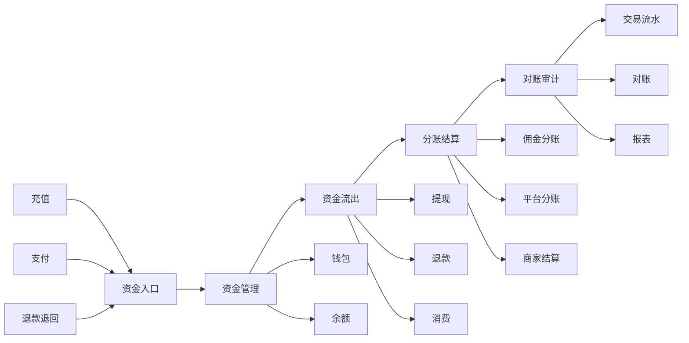
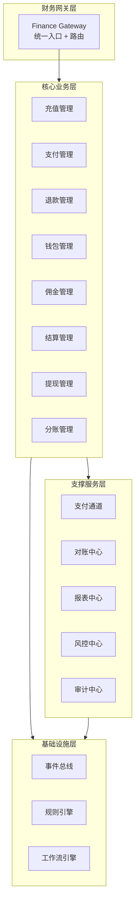
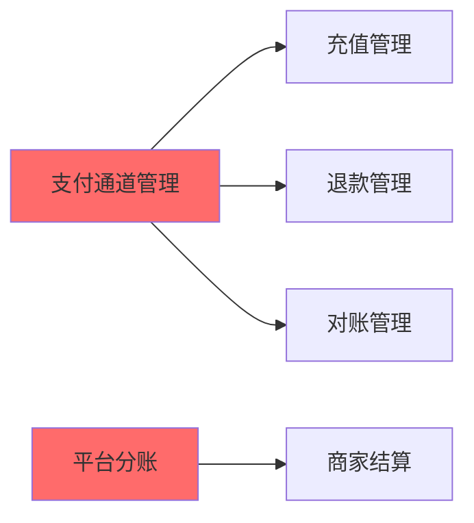
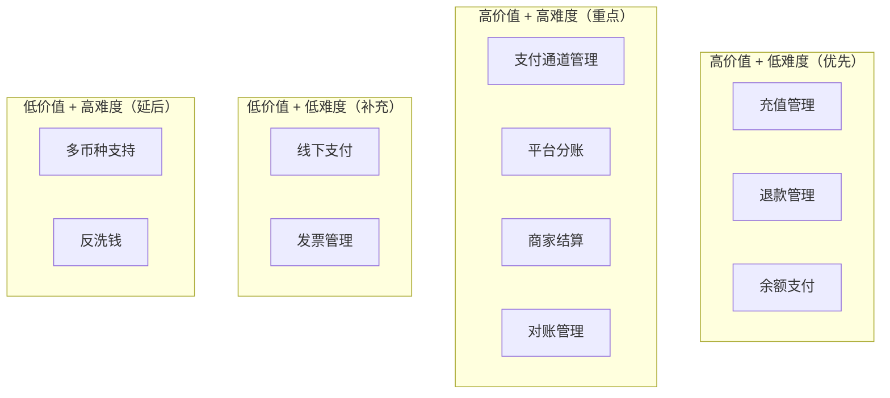

# Finance 模块整体需求分析与架构评估

> 版本：1.0  
> 日期：2026-02-24  
> 模块路径：`src/module/finance/`  
> 文档类型：整体架构评估与演进规划  
> 状态：现状评估 + 缺失模块识别 + 演进路线图

---

## 1. 概述

### 1.1 背景

本文档旨在从更高层面评估现有 finance 模块的完整性，对标主流电商和 SaaS 平台的财务系统架构，识别缺失的核心模块，并提出中长期演进规划。

当前 finance 模块包含 4 个子模块：

| 子模块     | 职责           | 状态    |
| ---------- | -------------- | ------- |
| commission | 佣金计算与冻结 | ✅ 已有 |
| settlement | 佣金结算与入账 | ✅ 已有 |
| wallet     | 钱包余额管理   | ✅ 已有 |
| withdrawal | 提现申请与审核 | ✅ 已有 |

### 1.2 评估目标

1. 对标主流电商平台（淘宝、京东、拼多多、有赞）的财务系统架构
2. 对标主流 SaaS 平台（Shopify、Stripe、Square）的财务模块设计
3. 识别现有模块的缺失功能和架构不足
4. 提出缺失模块的优先级和实施路线图

### 1.3 评估方法

- 功能对比矩阵：与主流平台逐项对比
- 业务场景覆盖度：评估是否覆盖完整的资金流转链路
- 架构完整性：评估是否具备财务系统的核心能力
- 合规性：评估是否满足财务合规要求

---

## 2. 主流平台财务系统对标

### 2.1 功能对比矩阵

| 功能模块             | 本系统 | 淘宝 | 京东 | 拼多多 | 有赞 | Shopify | Stripe | 差距评估   |
| -------------------- | ------ | ---- | ---- | ------ | ---- | ------- | ------ | ---------- |
| **资金入口**         |        |      |      |        |      |         |        |            |
| 充值管理             | ❌     | ✅   | ✅   | ✅     | ✅   | ✅      | ✅     | 缺失（P0） |
| 在线支付             | ⚠️     | ✅   | ✅   | ✅     | ✅   | ✅      | ✅     | 部分（P0） |
| 线下支付             | ❌     | ✅   | ✅   | ❌     | ✅   | ✅      | ✅     | 缺失（P2） |
| 预付款/押金          | ❌     | ✅   | ✅   | ❌     | ✅   | ✅      | ❌     | 缺失（P2） |
| **资金管理**         |        |      |      |        |      |         |        |            |
| 钱包余额             | ✅     | ✅   | ✅   | ✅     | ✅   | ✅      | ✅     | 持平       |
| 冻结金额             | ✅     | ✅   | ✅   | ✅     | ✅   | ✅      | ✅     | 持平       |
| 余额支付             | ❌     | ✅   | ✅   | ✅     | ✅   | ✅      | ✅     | 缺失（P1） |
| 混合支付             | ❌     | ✅   | ✅   | ✅     | ✅   | ✅      | ✅     | 缺失（P1） |
| 多币种支持           | ❌     | ✅   | ✅   | ❌     | ❌   | ✅      | ✅     | 缺失（P3） |
| **资金流出**         |        |      |      |        |      |         |        |            |
| 提现管理             | ✅     | ✅   | ✅   | ✅     | ✅   | ✅      | ✅     | 持平       |
| 退款管理             | ⚠️     | ✅   | ✅   | ✅     | ✅   | ✅      | ✅     | 部分（P0） |
| 消费扣款             | ⚠️     | ✅   | ✅   | ✅     | ✅   | ✅      | ✅     | 部分（P1） |
| **分账与结算**       |        |      |      |        |      |         |        |            |
| 佣金分账             | ✅     | ✅   | ✅   | ✅     | ✅   | ✅      | ✅     | 持平       |
| 平台分账             | ❌     | ✅   | ✅   | ✅     | ✅   | ✅      | ✅     | 缺失（P0） |
| 商家结算             | ❌     | ✅   | ✅   | ✅     | ✅   | ✅      | ✅     | 缺失（P0） |
| 自动结算             | ✅     | ✅   | ✅   | ✅     | ✅   | ✅      | ✅     | 持平       |
| 手动结算             | ❌     | ✅   | ✅   | ✅     | ✅   | ✅      | ✅     | 缺失（P1） |
| **对账与审计**       |        |      |      |        |      |         |        |            |
| 交易流水             | ✅     | ✅   | ✅   | ✅     | ✅   | ✅      | ✅     | 持平       |
| 对账管理             | ❌     | ✅   | ✅   | ✅     | ✅   | ✅      | ✅     | 缺失（P0） |
| 财务报表             | ❌     | ✅   | ✅   | ✅     | ✅   | ✅      | ✅     | 缺失（P1） |
| 发票管理             | ❌     | ✅   | ✅   | ✅     | ✅   | ✅      | ✅     | 缺失（P2） |
| 审计日志             | ⚠️     | ✅   | ✅   | ✅     | ✅   | ✅      | ✅     | 部分（P1） |
| **风控与合规**       |        |      |      |        |      |         |        |            |
| 风险监控             | ❌     | ✅   | ✅   | ✅     | ✅   | ✅      | ✅     | 缺失（P1） |
| 反洗钱（AML）        | ❌     | ✅   | ✅   | ✅     | ✅   | ✅      | ✅     | 缺失（P2） |
| 实名认证             | ❌     | ✅   | ✅   | ✅     | ✅   | ✅      | ✅     | 缺失（P1） |
| 限额管理             | ⚠️     | ✅   | ✅   | ✅     | ✅   | ✅      | ✅     | 部分（P1） |
| **支付通道**         |        |      |      |        |      |         |        |            |
| 支付宝               | ⚠️     | ✅   | ✅   | ✅     | ✅   | ✅      | ✅     | 部分（P0） |
| 微信支付             | ⚠️     | ✅   | ✅   | ✅     | ✅   | ✅      | ✅     | 部分（P0） |
| 银联支付             | ❌     | ✅   | ✅   | ✅     | ✅   | ✅      | ✅     | 缺失（P2） |
| 国际支付（PayPal等） | ❌     | ✅   | ✅   | ❌     | ❌   | ✅      | ✅     | 缺失（P3） |

### 2.2 差距总结

根据对比矩阵，现有 finance 模块存在以下主要差距：

**说明**：

- 积分系统和优惠券系统已在 Marketing 模块中实现（`marketing/points` 和 `marketing/coupon`）
- Finance 模块专注于资金流转和财务管理，与 Marketing 模块协作完成完整的用户激励体系

#### 2.2.1 P0 级缺失（阻塞性，必须建设）

1. **充值管理模块**：用户无法充值到钱包，限制了资金入口
2. **退款管理模块**：订单退款流程不完整，缺少独立的退款管理
3. **平台分账模块**：多租户 SaaS 平台必需，平台抽成无法实现
4. **商家结算模块**：商家无法结算货款，核心业务流程缺失
5. **对账管理模块**：无法与支付平台对账，存在资金风险
6. **支付通道管理**：支付宝、微信支付集成不完整

#### 2.2.2 P1 级缺失（高优先级，近期建设）

1. **余额支付模块**：用户无法使用钱包余额支付订单
2. **财务报表模块**：运营决策缺少数据支撑
3. **风险监控模块**：缺少异常交易监控
4. **消费扣款模块**：缺少完整的消费扣款流程
5. **手动结算模块**：特殊情况无法手动干预结算
6. **实名认证模块**：合规性不足
7. **审计日志模块**：审计能力不完整

#### 2.2.3 P2 级缺失（中优先级，中期建设）

1. **线下支付模块**：支持货到付款、POS 机支付等
2. **预付款/押金模块**：支持预付款、押金管理
3. **发票管理模块**：支持电子发票、纸质发票
4. **反洗钱（AML）模块**：合规性要求

#### 2.2.4 P3 级缺失（低优先级，长期建设）

1. **多币种支持**：国际化需求
2. **银联支付**：支付通道扩展
3. **国际支付**：国际化需求

---

## 3. 业务场景覆盖度评估

### 3.1 完整的资金流转链路

一个完整的电商/SaaS 平台资金流转链路应包含：



### 3.2 现有模块覆盖度

| 环节     | 覆盖度 | 缺失功能                       |
| -------- | ------ | ------------------------------ |
| 资金入口 | 20%    | 缺少充值、完整的支付集成       |
| 资金管理 | 50%    | 缺少余额支付、混合支付         |
| 资金流出 | 60%    | 缺少独立的退款管理、消费扣款   |
| 分账结算 | 50%    | 缺少平台分账、商家结算         |
| 对账审计 | 30%    | 缺少对账、报表、完整的审计日志 |

**总体覆盖度：约 40%**

---

## 4. 缺失模块详细分析

### 4.1 P0 级缺失模块

#### 4.1.1 充值管理模块（Recharge）

**业务价值**：

- 用户可充值到钱包，增加平台资金沉淀
- 支持充值优惠活动，提升用户粘性
- 完善资金入口，形成闭环

**核心功能**：

- 充值申请与支付
- 充值记录查询
- 充值优惠配置
- 充值到账通知
- 充值退款（未到账）

**技术要点**：

- 对接支付通道（支付宝、微信支付）
- 充值状态机（待支付、已支付、已到账、已退款）
- 充值流水记录
- 充值金额校验（最小/最大金额）

**预估工时**：2-3 周

---

#### 4.1.2 退款管理模块（Refund）

**业务价值**：

- 完善订单退款流程
- 支持部分退款、全额退款
- 支持退款到原支付方式或钱包
- 提升用户体验

**核心功能**：

- 退款申请与审核
- 退款到账处理
- 退款记录查询
- 退款失败重试
- 退款对账

**技术要点**：

- 退款状态机（待审核、审核通过、退款中、已退款、退款失败）
- 对接支付通道退款接口
- 退款流水记录
- 退款与订单、佣金的联动

**预估工时**：2-3 周

---

#### 4.1.3 平台分账模块（Platform Split）

**业务价值**：

- 多租户 SaaS 平台核心能力
- 平台抽成自动化
- 支持灵活的分账规则
- 提升平台盈利能力

**核心功能**：

- 分账规则配置（固定金额、比例、阶梯）
- 订单自动分账
- 分账记录查询
- 分账统计报表
- 分账结算

**技术要点**：

- 分账规则引擎
- 分账计算算法
- 分账流水记录
- 与订单、商家结算的联动

**预估工时**：3-4 周

---

#### 4.1.4 商家结算模块（Merchant Settlement）

**业务价值**：

- 商家货款结算自动化
- 支持多种结算周期（T+1、T+7、周结、月结）
- 支持结算审核
- 提升商家满意度

**核心功能**：

- 结算规则配置
- 自动结算任务
- 结算单生成
- 结算审核
- 结算打款
- 结算记录查询

**技术要点**：

- 结算规则引擎
- 结算计算算法（扣除平台分账、退款、售后）
- 结算定时任务
- 结算流水记录
- 对接支付通道批量打款

**预估工时**：4-5 周

---

#### 4.1.5 对账管理模块（Reconciliation）

**业务价值**：

- 与支付平台对账，确保资金安全
- 及时发现账务差异
- 支持自动对账和手动对账
- 合规性要求

**核心功能**：

- 对账文件下载（支付宝、微信支付）
- 对账文件解析
- 自动对账
- 差异处理
- 对账报表

**技术要点**：

- 对接支付平台对账接口
- 对账文件解析（CSV、Excel）
- 对账算法（金额、笔数）
- 差异记录与处理
- 对账定时任务

**预估工时**：3-4 周

---

#### 4.1.6 支付通道管理模块（Payment Gateway）

**业务价值**：

- 统一支付通道管理
- 支持多种支付方式
- 支付通道配置化
- 支付通道监控

**核心功能**：

- 支付通道配置（支付宝、微信支付、银联）
- 支付通道路由
- 支付回调处理
- 支付通道监控
- 支付通道切换

**技术要点**：

- 支付通道抽象接口
- 支付通道适配器模式
- 支付回调统一处理
- 支付通道健康检查
- 支付通道降级

**预估工时**：3-4 周

---

### 4.2 P1 级缺失模块

#### 4.2.1 余额支付模块（Balance Payment）

**业务价值**：

- 用户可使用钱包余额支付订单
- 支持余额与第三方支付混合支付
- 提升支付成功率
- 增加资金留存

**核心功能**：

- 余额支付
- 混合支付（余额+支付宝/微信）
- 支付密码验证
- 支付限额控制
- 支付流水记录

**技术要点**：

- 支付密码加密存储
- 余额扣款原子性
- 混合支付事务一致性
- 支付限额校验

**预估工时**：2-3 周

---

#### 4.2.2 消费扣款模块（Consumption Deduction）

**业务价值**：

- 完善消费扣款流程
- 支持订单支付、服务费扣款
- 支持自动扣款、手动扣款
- 提升资金流转效率

**核心功能**：

- 订单支付扣款
- 服务费扣款
- 自动扣款
- 扣款失败重试
- 扣款流水记录

**技术要点**：

- 扣款原子性
- 扣款失败补偿
- 扣款通知
- 扣款对账

**预估工时**：2-3 周

---

#### 4.2.3 手动结算模块（Manual Settlement）

**业务价值**：

- 支持特殊情况手动干预结算
- 支持结算调整
- 提升结算灵活性
- 满足特殊业务需求

**核心功能**：

- 手动结算申请
- 结算金额调整
- 结算审批
- 结算执行
- 结算记录查询

**技术要点**：

- 结算权限控制
- 结算审批流程
- 结算调整记录
- 结算对账

**预估工时**：2-3 周

---

#### 4.2.4 财务报表模块（Financial Report）

**业务价值**：

- 运营决策数据支撑
- 财务分析
- 合规性要求
- 投资人汇报

**核心功能**：

- 收入报表
- 支出报表
- 利润报表
- 现金流报表
- 自定义报表

**预估工时**：3-4 周

---

#### 4.2.5 风险监控模块（Risk Monitor）

**业务价值**：

- 异常交易监控
- 风险预警
- 防止资金损失
- 合规性要求

**核心功能**：

- 异常交易识别
- 风险规则配置
- 风险预警
- 风险处置
- 风险报表

**预估工时**：3-4 周

---

#### 4.2.6 实名认证模块（KYC）

**业务价值**：

- 提升合规性
- 防止洗钱风险
- 提升资金安全
- 满足监管要求

**核心功能**：

- 实名认证申请
- 身份证验证
- 人脸识别
- 认证审核
- 认证记录查询

**技术要点**：

- 对接第三方实名认证服务
- 身份信息加密存储
- 认证状态管理
- 认证失败重试

**预估工时**：2-3 周

---

#### 4.2.7 审计日志增强（Audit Log Enhancement）

**业务价值**：

- 完善审计能力
- 满足合规要求
- 问题追溯
- 安全审计

**核心功能**：

- 操作日志记录（充值、提现、结算、对账）
- 日志查询与导出
- 日志归档
- 日志分析

**技术要点**：

- 日志采集
- 日志存储（ES）
- 日志查询优化
- 日志归档策略

**预估工时**：1-2 周

---

## 5. 架构完整性评估

### 5.1 现有架构优势

1. **模块化设计**：commission、settlement、wallet、withdrawal 职责清晰
2. **异步解耦**：commission 使用 BullMQ 异步队列
3. **事务保障**：使用 @Transactional 装饰器
4. **多租户支持**：通过 BaseRepository 自动注入 tenantId

### 5.2 现有架构不足

1. **缺少统一的财务网关**：各模块独立，缺少统一入口
2. **缺少事件驱动架构**：模块间耦合，缺少事件总线
3. **缺少规则引擎**：分账、结算规则硬编码
4. **缺少对账中心**：无法与外部系统对账
5. **缺少报表中心**：无法生成财务报表
6. **缺少风控中心**：无法监控异常交易

### 5.3 建议的目标架构



---

## 6. 演进路线图

### 6.1 第一阶段：P0 级核心能力建设（3-4 个月）

**目标**：补齐核心缺失模块，形成完整的资金流转闭环

**建设内容**：

| 模块         | 工时   | 优先级 | 依赖关系     |
| ------------ | ------ | ------ | ------------ |
| 支付通道管理 | 3-4 周 | P0-1   | 无           |
| 充值管理     | 2-3 周 | P0-2   | 支付通道管理 |
| 退款管理     | 2-3 周 | P0-3   | 支付通道管理 |
| 平台分账     | 3-4 周 | P0-4   | 无           |
| 商家结算     | 4-5 周 | P0-5   | 平台分账     |
| 对账管理     | 3-4 周 | P0-6   | 支付通道管理 |

**实施顺序**：



**里程碑**：

- M1（1 个月）：支付通道管理上线，支持支付宝、微信支付
- M2（2 个月）：充值、退款上线，资金入口完善
- M3（3 个月）：平台分账、商家结算上线，分账体系完整
- M4（4 个月）：对账管理上线，资金安全保障

**验收标准**：

- 用户可充值到钱包
- 订单可正常退款
- 平台可自动抽成
- 商家可正常结算
- 每日自动对账

---

### 6.2 第二阶段：P1 级能力增强（2-3 个月）

**目标**：增强营销能力、风控能力、数据能力

**建设内容**：

| 模块         | 工时   | 优先级 | 依赖关系 |
| ------------ | ------ | ------ | -------- |
| 积分账户     | 2-3 周 | P1-1   | 钱包管理 |
| 优惠券账户   | 2-3 周 | P1-2   | 钱包管理 |
| 财务报表     | 3-4 周 | P1-3   | 所有模块 |
| 风险监控     | 3-4 周 | P1-4   | 所有模块 |
| 实名认证     | 2-3 周 | P1-5   | 用户模块 |
| 审计日志增强 | 1-2 周 | P1-6   | 所有模块 |

**里程碑**：

- M5（1 个月）：余额支付、消费扣款、手动结算上线
- M6（2 个月）：财务报表上线，数据决策支撑
- M7（3 个月）：风险监控、实名认证上线，合规性增强

---

### 6.3 第三阶段：P2 级功能完善（2-3 个月）

**目标**：完善支付方式、合规能力

**建设内容**：

| 模块          | 工时   | 优先级 | 依赖关系     |
| ------------- | ------ | ------ | ------------ |
| 线下支付      | 2-3 周 | P2-1   | 支付通道管理 |
| 预付款/押金   | 2-3 周 | P2-2   | 钱包管理     |
| 发票管理      | 3-4 周 | P2-3   | 订单模块     |
| 反洗钱（AML） | 3-4 周 | P2-4   | 风险监控     |

---

### 6.4 第四阶段：P3 级国际化（按需）

**目标**：支持国际化业务

**建设内容**：

| 模块       | 工时   | 优先级 | 依赖关系     |
| ---------- | ------ | ------ | ------------ |
| 多币种支持 | 4-5 周 | P3-1   | 所有模块     |
| 银联支付   | 2-3 周 | P3-2   | 支付通道管理 |
| 国际支付   | 3-4 周 | P3-3   | 支付通道管理 |

---

## 7. 实施优先级与资源评估

### 7.1 优先级矩阵

按业务价值和实施难度评估：



### 7.2 资源需求评估

**人力需求**：

| 阶段     | 后端开发 | 前端开发 | 测试 | 产品 | 总人月 |
| -------- | -------- | -------- | ---- | ---- | ------ |
| 第一阶段 | 2 人     | 1 人     | 1 人 | 0.5  | 18     |
| 第二阶段 | 2 人     | 1 人     | 1 人 | 0.5  | 13.5   |
| 第三阶段 | 1 人     | 1 人     | 1 人 | 0.5  | 9      |
| 第四阶段 | 1 人     | 1 人     | 0.5  | 0.5  | 9      |

**技能要求**：

- 后端：NestJS、TypeORM、BullMQ、支付接口对接经验
- 前端：Vue3、Ant Design Vue、财务报表可视化
- 测试：接口测试、性能测试、安全测试
- 产品：财务系统产品经验、支付行业经验

### 7.3 成本估算

**开发成本**：

- 第一阶段：18 人月 x 2 万 = 36 万
- 第二阶段：13.5 人月 x 2 万 = 27 万
- 第三阶段：9 人月 x 2 万 = 18 万
- 第四阶段：9 人月 x 2 万 = 18 万
- 总计：99 万

**基础设施成本**：

- 支付通道接入费：5-10 万/年
- 服务器扩容：2-3 万/月
- 第三方服务（短信、实名认证）：1-2 万/月

**总成本**：约 125-155 万（含第一年运营成本）

---

## 8. 风险与挑战

### 8.1 技术风险

#### 8.1.1 支付通道对接复杂度

**风险描述**：

- 支付宝、微信支付接口复杂，文档更新频繁
- 回调处理、签名验证容易出错
- 不同支付方式（扫码、H5、APP）接口不同

**应对措施**：

- 使用成熟的 SDK（如 egg-alipay、wechatpay-axios-plugin）
- 建立完善的测试环境和沙箱测试
- 统一回调处理逻辑，抽象支付通道接口
- 建立支付通道监控和告警

#### 8.1.2 分布式事务一致性

**风险描述**：

- 充值、退款、分账涉及多个系统
- 支付成功但业务失败的补偿处理
- 并发场景下的数据一致性

**应对措施**：

- 使用 SAGA 模式或 TCC 模式
- 建立完善的补偿机制
- 使用分布式锁（Redis）防止并发问题
- 建立对账机制，及时发现不一致

#### 8.1.3 性能瓶颈

**风险描述**：

- 大促期间支付、充值并发量高
- 对账、结算任务耗时长
- 财务报表查询慢

**应对措施**：

- 使用消息队列（BullMQ）异步处理
- 对账、结算使用分片处理
- 财务报表使用 OLAP 数据库（ClickHouse）
- 关键接口使用缓存（Redis）

---

### 8.2 业务风险

#### 8.2.1 资金安全风险

**风险描述**：

- 充值、提现可能被恶意利用
- 对账不及时导致资金损失
- 退款被恶意申请

**应对措施**：

- 建立风险监控系统，实时监控异常交易
- 每日自动对账，及时发现差异
- 提现、退款增加人工审核
- 建立黑名单机制

#### 8.2.2 合规风险

**风险描述**：

- 支付业务需要支付牌照
- 反洗钱（AML）合规要求
- 用户资金安全监管

**应对措施**：

- 使用持牌支付机构（支付宝、微信支付）
- 建立实名认证机制
- 建立反洗钱监控
- 定期审计，确保合规

#### 8.2.3 用户体验风险

**风险描述**：

- 充值、提现到账慢
- 退款流程复杂
- 财务数据不透明

**应对措施**：

- 优化充值、提现流程，提升到账速度
- 简化退款流程，自动化审核
- 提供完善的财务报表和流水查询
- 建立用户通知机制（短信、站内信）

---

### 8.3 项目风险

#### 8.3.1 进度风险

**风险描述**：

- 支付通道对接耗时超预期
- 测试周期长
- 需求变更频繁

**应对措施**：

- 预留 20% 的缓冲时间
- 分阶段交付，降低风险
- 需求冻结机制，控制变更
- 建立每周进度同步机制

#### 8.3.2 人员风险

**风险描述**：

- 关键人员离职
- 技能不足
- 团队协作问题

**应对措施**：

- 建立完善的文档和知识库
- 代码 Review 机制，知识共享
- 技术培训，提升团队能力
- 建立备份人员机制

---

## 9. 总结与建议

### 9.1 现状总结

现有 finance 模块包含 4 个子模块（commission、settlement、wallet、withdrawal），覆盖了佣金管理和提现管理的基本功能，但与主流电商/SaaS 平台相比，存在以下主要差距：

1. **资金入口不完整**：缺少充值管理，用户无法充值到钱包
2. **资金流出不完整**：缺少独立的退款管理，退款流程不规范
3. **分账体系不完整**：缺少平台分账和商家结算，无法支持多租户 SaaS 平台
4. **对账能力缺失**：无法与支付平台对账，存在资金风险
5. **支付通道不完善**：支付宝、微信支付集成不完整
6. **余额支付缺失**：用户无法使用钱包余额支付订单
7. **数据能力不足**：缺少财务报表，运营决策缺少数据支撑
8. **风控能力不足**：缺少风险监控、实名认证，合规性不足

**总体覆盖度约 40%**，无法支撑完整的电商/SaaS 平台财务需求。

---

### 9.2 核心建议

#### 9.2.1 短期建议（3-6 个月）

**优先建设 P0 级模块**，形成完整的资金流转闭环：

1. **支付通道管理**（3-4 周）：统一支付通道管理，支持支付宝、微信支付
2. **充值管理**（2-3 周）：用户可充值到钱包，完善资金入口
3. **退款管理**（2-3 周）：独立的退款管理，规范退款流程
4. **平台分账**（3-4 周）：支持平台抽成，多租户 SaaS 平台核心能力
5. **商家结算**（4-5 周）：商家货款结算自动化
6. **对账管理**（3-4 周）：与支付平台对账，确保资金安全

**预期效果**：

- 资金流转闭环形成
- 多租户 SaaS 平台核心能力具备
- 资金安全得到保障
- 业务场景覆盖度提升至 70%

---

#### 9.2.2 中期建议（6-12 个月）

**建设 P1 级模块**，增强支付能力、风控能力、数据能力：

1. **余额支付**（2-3 周）：用户可使用钱包余额支付订单
2. **消费扣款**（2-3 周）：完善消费扣款流程
3. **手动结算**（2-3 周）：支持特殊情况手动干预结算
4. **财务报表**（3-4 周）：提供运营决策数据支撑
5. **风险监控**（3-4 周）：监控异常交易，防止资金损失
6. **实名认证**（2-3 周）：提升合规性
7. **审计日志增强**（1-2 周）：完善审计能力

**预期效果**：

- 支付能力增强
- 数据决策能力提升
- 风控能力增强
- 合规性提升
- 业务场景覆盖度提升至 85%

---

#### 9.2.3 长期建议（12-24 个月）

**建设 P2/P3 级模块**，完善功能、支持国际化：

1. **线下支付**（2-3 周）：支持货到付款、POS 机支付
2. **预付款/押金**（2-3 周）：支持预付款、押金管理
3. **发票管理**（3-4 周）：支持电子发票、纸质发票
4. **反洗钱（AML）**（3-4 周）：合规性要求
5. **多币种支持**（4-5 周）：国际化需求
6. **国际支付**（3-4 周）：支持 PayPal、Stripe 等

**预期效果**：

- 功能完善
- 国际化能力具备
- 业务场景覆盖度提升至 95%

---

### 9.3 架构建议

#### 9.3.1 建立统一的财务网关

**目标**：统一财务模块入口，提供路由、鉴权、限流等能力

**实现**：

```typescript
@Module({
  imports: [
    RechargeModule,
    PaymentModule,
    RefundModule,
    WalletModule,
    CommissionModule,
    SettlementModule,
    WithdrawalModule,
    SplitModule,
  ],
  controllers: [FinanceGatewayController],
  providers: [FinanceGatewayService],
})
export class FinanceGatewayModule {}
```

---

#### 9.3.2 建立事件驱动架构

**目标**：解耦模块间依赖，提升系统扩展性

**实现**：

```typescript
// 充值成功事件
@EventPattern('recharge.success')
async handleRechargeSuccess(data: RechargeSuccessEvent) {
  // 钱包入账
  await this.walletService.deposit(data.userId, data.amount);
  // 发送通知
  await this.notificationService.send(data.userId, '充值成功');
}
```

---

#### 9.3.3 建立规则引擎

**目标**：分账、结算规则配置化，提升灵活性

**实现**：

```typescript
// 分账规则配置
const splitRule = {
  type: 'percentage', // 比例分账
  platform: 0.05, // 平台 5%
  merchant: 0.9, // 商家 90%
  promoter: 0.05, // 推广者 5%
};

// 规则引擎执行
const result = await this.ruleEngine.execute(splitRule, order);
```

---

### 9.4 实施建议

#### 9.4.1 分阶段交付

- 不要一次性建设所有模块
- 按优先级分阶段交付
- 每个阶段验收后再进入下一阶段
- 降低风险，快速迭代

#### 9.4.2 建立完善的测试体系

- 单元测试覆盖率 > 80%
- 集成测试覆盖核心流程
- 性能测试确保高并发场景
- 安全测试防止资金风险

#### 9.4.3 建立监控告警体系

- 支付通道监控（成功率、耗时）
- 对账监控（差异告警）
- 风险监控（异常交易告警）
- 性能监控（接口耗时、队列积压）

#### 9.4.4 建立文档体系

- 需求文档（每个模块）
- 设计文档（每个模块）
- 接口文档（Swagger）
- 运维文档（部署、监控）

---

### 9.5 成功标准

**第一阶段成功标准**（3-4 个月）：

- [ ] 用户可充值到钱包
- [ ] 订单可正常退款
- [ ] 平台可自动抽成
- [ ] 商家可正常结算
- [ ] 每日自动对账
- [ ] 支付成功率 > 99%
- [ ] 对账准确率 100%

**第二阶段成功标准**（6-9 个月）：

- [ ] 积分、优惠券账户上线
- [ ] 财务报表可查询
- [ ] 风险监控上线
- [ ] 实名认证上线
- [ ] 异常交易识别率 > 95%

**第三阶段成功标准**（9-12 个月）：

- [ ] 线下支付上线
- [ ] 发票管理上线
- [ ] 反洗钱监控上线
- [ ] 业务场景覆盖度 > 85%

---

## 10. 附录

### 10.1 参考资料

**主流平台财务系统**：

- 淘宝：https://open.taobao.com/
- 京东：https://open.jd.com/
- 有赞：https://www.youzan.com/
- Shopify：https://shopify.dev/
- Stripe：https://stripe.com/docs

**支付接口文档**：

- 支付宝：https://opendocs.alipay.com/
- 微信支付：https://pay.weixin.qq.com/wiki/doc/api/
- 银联支付：https://open.unionpay.com/

**合规参考**：

- 反洗钱法：http://www.gov.cn/
- 支付业务许可：http://www.pbc.gov.cn/

---

### 10.2 术语表

| 术语     | 英文                | 说明                                  |
| -------- | ------------------- | ------------------------------------- |
| 充值     | Recharge            | 用户向钱包充值                        |
| 退款     | Refund              | 订单退款                              |
| 分账     | Split               | 订单金额按规则分配                    |
| 结算     | Settlement          | 商家货款结算                          |
| 对账     | Reconciliation      | 与支付平台对账                        |
| 提现     | Withdrawal          | 用户从钱包提现到银行卡                |
| 佣金     | Commission          | 推广者获得的佣金                      |
| 钱包     | Wallet              | 用户资金账户                          |
| 余额支付 | Balance Payment     | 使用钱包余额支付订单                  |
| 混合支付 | Mixed Payment       | 余额+第三方支付组合支付               |
| 积分     | Points              | 用户积分账户（属于 Marketing 模块）   |
| 优惠券   | Coupon              | 用户优惠券账户（属于 Marketing 模块） |
| 风控     | Risk Control        | 风险监控与控制                        |
| 反洗钱   | AML                 | Anti-Money Laundering                 |
| 实名认证 | KYC                 | Know Your Customer                    |
| 支付通道 | Payment Gateway     | 支付宝、微信支付等支付方式            |
| 财务报表 | Financial Report    | 收入、支出、利润等财务报表            |
| 审计日志 | Audit Log           | 操作日志，用于审计                    |
| 多租户   | Multi-Tenant        | 多个租户共享同一系统                  |
| SaaS     | Software as Service | 软件即服务                            |
| OLAP     | Online Analytical   | 在线分析处理，用于数据分析            |
| SAGA     | SAGA Pattern        | 分布式事务模式                        |
| TCC      | Try-Confirm-Cancel  | 分布式事务模式                        |

---

### 10.3 相关文档

**需求文档**：

- `docs/requirements/finance/commission/commission-requirements.md`
- `docs/requirements/finance/settlement/settlement-requirements.md`
- `docs/requirements/finance/wallet/wallet-requirements.md`
- `docs/requirements/finance/withdrawal/withdrawal-requirements.md`

**设计文档**：

- `docs/design/finance/commission/commission-design.md`
- `docs/design/finance/settlement/settlement-design.md`
- `docs/design/finance/wallet/wallet-design.md`
- `docs/design/finance/withdrawal/withdrawal-design.md`

**后端开发规范**：

- `.kiro/steering/backend-nestjs.md`

---

**文档结束**
