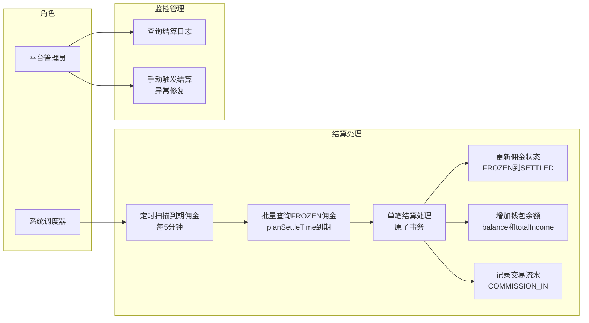
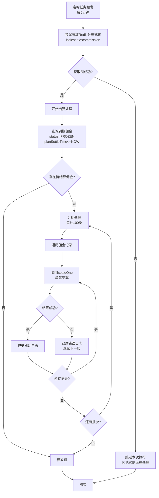
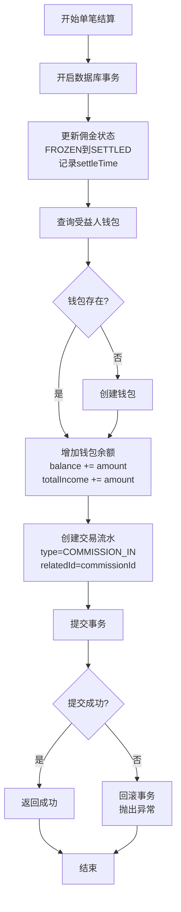
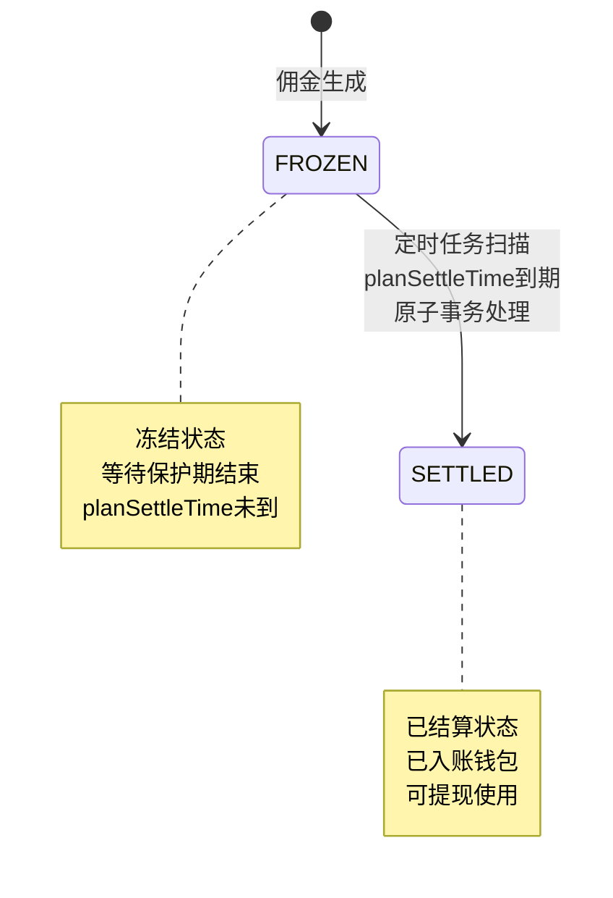

# 结算模块 - 需求文档

> 版本：1.0  
> 日期：2026-02-24  
> 模块路径：`src/module/finance/settlement/`  
> 关联模块：`src/module/finance/commission`（佣金冻结）、`src/module/finance/wallet`（钱包入账）  
> 状态：现状分析 + 演进规划

---

## 1. 概述

### 1.1 背景

结算模块是财务系统的流转层，负责将冻结状态的佣金在保护期结束后自动解冻并入账到用户钱包。系统通过定时任务扫描到期佣金，在单一事务内完成佣金状态更新、钱包余额增加、交易流水记录三个步骤，确保资金流转的原子性和可追溯性。

当前系统采用每 5 分钟执行一次的定时任务，通过 Redis 分布式锁保障多实例部署时的并发安全，采用分批处理机制（每批 100 条）保障系统吞吐量。

核心组件：

| 组件                | 路径                      | 职责                               |
| ------------------- | ------------------------- | ---------------------------------- |
| SettlementScheduler | `settlement.scheduler.ts` | 定时任务调度器：扫描并结算到期佣金 |

### 1.2 目标

1. 完整描述结算模块的功能现状、结算规则与数据流
2. 分析系统自身的代码缺陷与架构不足
3. 分析与外部模块（佣金、钱包）的跨模块设计缺陷
4. 提出演进建议和优先级排序

### 1.3 范围

| 在范围内                         | 不在范围内          |
| -------------------------------- | ------------------- |
| 定时扫描到期佣金                 | 佣金计算逻辑        |
| 佣金状态更新（FROZEN → SETTLED） | 钱包余额管理        |
| 钱包余额增加                     | 提现审核流程        |
| 交易流水记录                     | 前端 Admin Web 页面 |
| 分布式锁并发控制                 | 订单支付流程        |
| 批量处理机制                     | 会员推荐关系维护    |

---

## 2. 角色与用例

> 图 1：结算模块用例图

**角色说明**：

| 角色       | 职责                           | 触发方式                   |
| ---------- | ------------------------------ | -------------------------- |
| 系统调度器 | 定时扫描并结算到期佣金         | Cron 定时任务（每 5 分钟） |
| 平台管理员 | 查询结算日志，手动触发异常修复 | Admin 后台接口（待建设）   |

---

## 3. 业务流程

### 3.1 结算定时任务流程

> 图 2：结算定时任务活动图

### 3.2 单笔结算处理流程

> 图 3：单笔结算活动图

---

## 4. 状态说明

### 4.1 结算流程状态转换

> 图 4：结算状态图

---

## 5. 现有功能详述

### 5.1 接口清单

结算模块为纯内部服务，不暴露 HTTP 接口，由定时任务自动执行。

| 接口类型  | 说明                             |
| --------- | -------------------------------- |
| HTTP 端点 | 无（待建设管理端手动触发接口）   |
| 定时任务  | Cron 定时任务，每 5 分钟执行一次 |
| 内部调用  | 无外部模块直接调用               |

### 5.2 核心方法清单

| 方法      | 类型      | 说明                                       |
| --------- | --------- | ------------------------------------------ |
| settleJob | Scheduler | 定时任务入口，每 5 分钟执行一次            |
| doSettle  | Scheduler | 结算处理逻辑，分批查询并处理到期佣金       |
| settleOne | Scheduler | 单笔结算处理，原子事务更新佣金、钱包、流水 |

### 5.3 结算规则

| 规则项   | 说明                                 |
| -------- | ------------------------------------ |
| 扫描频率 | 每 5 分钟执行一次                    |
| 批量大小 | 每批处理 100 条记录                  |
| 并发控制 | Redis 分布式锁，TTL 5 分钟           |
| 事务保障 | 单笔结算在一个事务内完成             |
| 错误处理 | 单条失败不影响其他记录，记录错误日志 |

### 5.4 结算条件

| 条件                  | 说明                     |
| --------------------- | ------------------------ |
| status = FROZEN       | 佣金状态为冻结           |
| planSettleTime <= NOW | 计划结算时间已到         |
| 钱包存在或可创建      | 受益人钱包存在或自动创建 |

---

## 6. 现有逻辑不足分析

### 6.1 P0 级缺陷（阻塞性）

#### D-1：锁超时导致重入风险

- 现状：Redis 锁 TTL 5 分钟，若任务执行超时，锁自动释放导致第二个实例启动
- 影响：可能导致同一批佣金被多个实例同时处理，虽有事务保障但增加数据库压力
- 建议：引入看门狗机制，任务执行期间自动续期锁

#### D-2：settleOne 缺少状态校验

- 现状：settleOne 直接使用传入的 commission 对象，未在事务内重新查询状态
- 影响：两个线程同时处理同一记录时，可能导致余额重复增加
- 建议：事务起始处执行 SELECT FOR UPDATE 或 update 时限定 where: { status: 'FROZEN' }

### 6.2 P1 级缺陷（高优先级）

#### D-3：单条失败无重试机制

- 现状：单条记录结算失败仅记录日志，不会自动重试
- 影响：钱包不存在或被锁定等临时性错误导致佣金永久无法结算
- 建议：增加重试指数退避机制或标记为异常单，定期人工处理

#### D-4：缺少结算前订单状态校验

- 现状：未校验关联订单是否已退款
- 影响：若订单在结算前退款但异步延迟未及时标记 CANCELLED，会错误入账
- 建议：结算前检查订单状态，确保处于已支付/已完成状态

#### D-5：批量处理无进度记录

- 现状：批量处理过程中无进度记录，任务中断后从头开始
- 影响：大批量结算时任务中断导致重复处理，浪费资源
- 建议：记录处理进度，支持断点续传

### 6.3 P2 级缺陷（中优先级）

#### D-6：缺少结算统计功能

- 现状：无结算成功/失败数量统计
- 影响：运营无法了解结算情况，排查问题困难
- 建议：每次任务执行后记录统计信息

#### D-7：缺少手动触发接口

- 现状：无手动触发结算的接口
- 影响：异常情况下无法及时修复，只能等待下次定时任务
- 建议：新增 POST /admin/finance/settlement/trigger 接口

#### D-8：缺少结算日志查询

- 现状：无结算日志查询接口
- 影响：排查问题时只能查看应用日志，效率低
- 建议：新增结算日志表和查询接口

### 6.4 P3 级缺陷（低优先级）

#### D-9：批量大小硬编码

- 现状：批量大小固定为 100，无法动态调整
- 影响：无法根据系统负载动态优化性能
- 建议：批量大小配置化，支持动态调整

#### D-10：缺少结算监控告警

- 现状：无结算失败告警机制
- 影响：结算异常无法及时发现
- 建议：集成监控系统，结算失败率超过阈值时告警

---

## 7. 市面主流结算系统对标

### 7.1 功能对比矩阵

| 功能               | 本系统 | 有赞分销 | 美团联盟 | 拼多多多多进宝 | 差距评估     |
| ------------------ | ------ | -------- | -------- | -------------- | ------------ |
| 定时扫描到期佣金   | ✅     | ✅       | ✅       | ✅             | 持平         |
| 批量处理机制       | ✅     | ✅       | ✅       | ✅             | 持平         |
| 分布式锁并发控制   | ✅     | ✅       | ✅       | ✅             | 持平         |
| 原子事务保障       | ✅     | ✅       | ✅       | ✅             | 持平         |
| 单条失败不影响其他 | ✅     | ✅       | ✅       | ✅             | 持平         |
| 钱包余额自动增加   | ✅     | ✅       | ✅       | ✅             | 持平         |
| 交易流水记录       | ✅     | ✅       | ✅       | ✅             | 持平         |
| 结算前订单状态校验 | ❌     | ✅       | ✅       | ✅             | 缺失（P1）   |
| 单条失败自动重试   | ❌     | ✅       | ✅       | ✅             | 缺失（P1）   |
| 批量处理断点续传   | ❌     | ✅       | ✅       | ✅             | 缺失（P1）   |
| 结算统计功能       | ❌     | ✅       | ✅       | ✅             | 缺失（P1）   |
| 手动触发结算接口   | ❌     | ✅       | ✅       | ✅             | 缺失（P1）   |
| 结算日志查询       | ❌     | ✅       | ✅       | ✅             | 缺失（P2）   |
| 结算失败告警       | ❌     | ✅       | ✅       | ✅             | 缺失（P3）   |
| 结算周期配置化     | ❌     | ✅       | ✅       | ❌             | 缺失（低优） |
| 结算规则自定义     | ❌     | ✅       | ❌       | ❌             | 缺失（低优） |

### 7.2 差距总结

本系统在结算核心流程（扫描 → 批量处理 → 原子入账）上功能完整，分布式锁和事务保障机制可靠。主要差距集中在：

1. 可靠性不足（P1）：无订单状态校验、无自动重试、无断点续传
2. 可观测性缺失（P1）：无统计功能、无手动触发接口、无日志查询
3. 运营能力不足（P2-P3）：无结算失败告警、无周期配置化

---

## 8. 跨模块缺陷

### X-1：与佣金模块耦合

- 现状：直接查询 fin_commission 表
- 影响：跨模块直接访问数据表，违反模块边界
- 建议：通过 CommissionService 获取待结算佣金列表

### X-2：与钱包模块耦合

- 现状：直接调用 WalletService.addBalance
- 影响：钱包服务异常时结算失败，缺少降级方案
- 建议：引入消息队列解耦，结算失败时重试

---

## 9. 验收标准

### 8.1 现有功能验收

| 编号 | 验收条件                                     | 状态      |
| ---- | -------------------------------------------- | --------- |
| AC-1 | 定时任务每 5 分钟执行一次                    | ✅ 已通过 |
| AC-2 | Redis 分布式锁保障多实例并发安全             | ✅ 已通过 |
| AC-3 | 批量查询 FROZEN 且 planSettleTime 到期的佣金 | ✅ 已通过 |
| AC-4 | 单笔结算在一个事务内完成                     | ✅ 已通过 |
| AC-5 | 更新佣金状态为 SETTLED                       | ✅ 已通过 |
| AC-6 | 增加钱包余额和累计收益                       | ✅ 已通过 |
| AC-7 | 创建 COMMISSION_IN 类型交易流水              | ✅ 已通过 |
| AC-8 | 单条失败不影响其他记录                       | ✅ 已通过 |

### 9.2 待修复验收

| 编号  | 验收条件                     | 状态      | 对应缺陷 |
| ----- | ---------------------------- | --------- | -------- |
| AC-9  | 锁超时前自动续期，防止重入   | ❌ 未实现 | D-1      |
| AC-10 | settleOne 事务内重新查询状态 | ❌ 未实现 | D-2      |
| AC-11 | 单条失败自动重试，最多 3 次  | ❌ 未实现 | D-3      |
| AC-12 | 结算前校验订单状态           | ❌ 未实现 | D-4      |
| AC-13 | 批量处理支持断点续传         | ❌ 未实现 | D-5      |
| AC-14 | 每次任务记录结算统计信息     | ❌ 未实现 | D-6      |
| AC-15 | 支持手动触发结算             | ❌ 未实现 | D-7      |
| AC-16 | 支持查询结算日志             | ❌ 未实现 | D-8      |

---

## 10. 演进建议与待办

### 10.1 第一阶段：安全基线修复（1 周）

| 编号 | 任务                         | 对应缺陷 | 预估工时 |
| ---- | ---------------------------- | -------- | -------- |
| T-1  | 引入看门狗机制，锁自动续期   | D-1      | 0.5d     |
| T-2  | settleOne 事务内重新查询状态 | D-2      | 0.5h     |
| T-3  | 增加重试指数退避机制         | D-3      | 1d       |
| T-4  | 结算前校验订单状态           | D-4      | 0.5d     |

### 10.2 第二阶段：功能完善（1-2 周）

| 编号 | 任务                     | 对应缺陷 | 预估工时 |
| ---- | ------------------------ | -------- | -------- |
| T-5  | 批量处理支持断点续传     | D-5      | 1d       |
| T-6  | 新增结算统计功能         | D-6      | 0.5d     |
| T-7  | 新增手动触发结算接口     | D-7      | 0.5d     |
| T-8  | 新增结算日志表和查询接口 | D-8      | 1d       |
| T-9  | 批量大小配置化           | D-9      | 0.5h     |
| T-10 | 集成监控告警             | D-10     | 1d       |

### 10.3 第三阶段：架构优化（长期）

| 编号 | 任务                                  | 预估工时 |
| ---- | ------------------------------------- | -------- |
| T-11 | 通过 CommissionService 获取待结算佣金 | 1d       |
| T-12 | 引入消息队列解耦钱包服务              | 2d       |
| T-13 | 引入事件驱动架构                      | 3d       |

---

## 11. 非功能需求

### 11.1 性能要求

- 单批次（100 条）结算处理时间 < 10 秒
- 支持每小时结算 10000 笔佣金
- 定时任务执行延迟 < 1 分钟

### 11.2 可靠性要求

- 结算失败自动重试，最多 3 次
- 异常情况下不丢失待结算佣金
- 支持手动触发重新结算

### 11.3 安全性要求

- 防止重复结算
- 所有结算操作记录审计日志
- 结算金额精度保持 2 位小数

### 11.4 可维护性要求

- 提供完善的日志记录
- 支持结算规则的配置化
- 提供结算监控和告警
