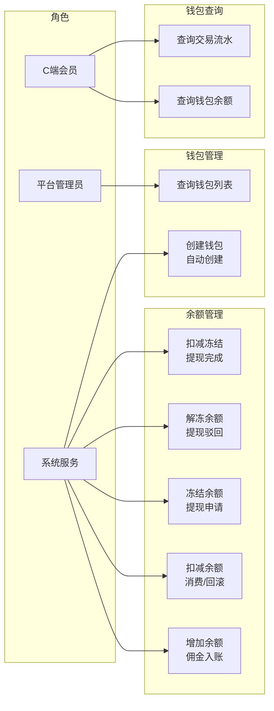
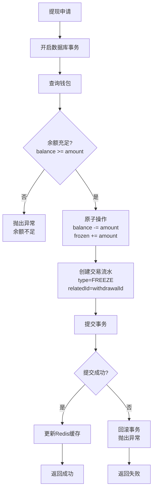
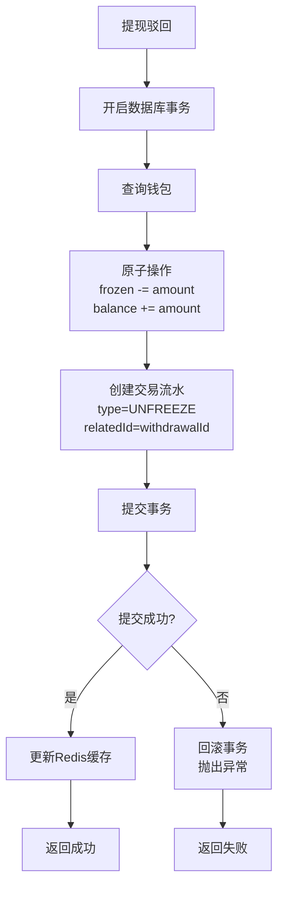

# 钱包模块 - 需求文档

> 版本：1.0  
> 日期：2026-02-24  
> 模块路径：`src/module/finance/wallet/`  
> 关联模块：`src/module/finance/commission`（佣金入账）、`src/module/finance/settlement`（结算入账）、`src/module/finance/withdrawal`（提现扣减）  
> 状态：现状分析 + 演进规划

---

## 1. 概述

### 1.1 背景

钱包模块是财务系统的余额层，负责管理用户的可用余额、冻结金额和累计收益。系统通过乐观锁和原子操作保障高并发场景下的余额安全，通过交易流水记录所有余额变动，实现财务审计的可追溯性。

当前系统支持余额增加、余额扣减、余额冻结、余额解冻四大核心操作，所有操作均在事务内完成并同步记录交易流水。系统采用 Redis 缓存提升查询性能，使用 @CachePut 装饰器保障缓存一致性。

核心组件：

| 组件                  | 路径                        | 职责                                |
| --------------------- | --------------------------- | ----------------------------------- |
| WalletService         | `wallet.service.ts`         | 核心业务逻辑：余额变动、冻结管理    |
| WalletRepository      | `wallet.repository.ts`      | 数据访问层：fin_wallet 表 CRUD      |
| TransactionRepository | `transaction.repository.ts` | 数据访问层：fin_transaction 表 CRUD |

### 1.2 目标

1. 完整描述钱包模块的功能现状、余额管理规则与数据流
2. 分析系统自身的代码缺陷与架构不足
3. 分析与外部模块（佣金、结算、提现）的跨模块设计缺陷
4. 提出演进建议和优先级排序

### 1.3 范围

| 在范围内                  | 不在范围内          |
| ------------------------- | ------------------- |
| 钱包创建与查询            | 佣金计算逻辑        |
| 余额增加（入账）          | 结算定时任务        |
| 余额扣减（消费/回滚）     | 提现审核流程        |
| 余额冻结/解冻（提现流程） | 订单支付流程        |
| 交易流水记录              | 前端 Admin Web 页面 |
| Redis 缓存管理            | 会员推荐关系维护    |

---

## 2. 角色与用例

> 图 1：钱包模块用例图



**角色说明**：

| 角色       | 职责                               | 接口前缀                        |
| ---------- | ---------------------------------- | ------------------------------- |
| C 端会员   | 查询钱包余额和交易流水             | client/finance/wallet（待建设） |
| 平台管理员 | 查询钱包列表，管理异常钱包         | admin/finance/wallet（待建设）  |
| 系统服务   | 余额变动操作（入账、扣减、冻结等） | 内部 Service 调用               |

---

## 3. 业务流程

### 3.1 余额增加流程

> 图 2：余额增加活动图

```mermaid
flowchart TD
    A[触发余额增加<br/>佣金结算/充值] --> B[开启数据库事务]
    B --> C[查询或创建钱包]
    C --> D[原子增加余额<br/>balance += amount<br/>totalIncome += amount]
    D --> E[创建交易流水<br/>type=WALLET_IN/COMMISSION_IN<br/>relatedId]
    E --> F[提交事务]
    F --> G{提交成功?}
    G -->|是| H[更新Redis缓存<br/>@CachePut]
    G -->|否| I[回滚事务<br/>抛出异常]
    H --> J[返回成功]
    I --> K[返回失败]
```

### 3.2 余额扣减流程

> 图 3：余额扣减活动图

```mermaid
flowchart TD
    A[触发余额扣减<br/>消费/佣金回滚] --> B[开启数据库事务]
    B --> C[查询钱包]
    C --> D{钱包存在?}
    D -->|否| E[抛出异常<br/>钱包不存在]
    D -->|是| F{余额充足?<br/>balance >= amount}
    F -->|否| G[抛出异常<br/>余额不足]
    F -->|是| H[原子扣减余额<br/>balance -= amount]
    H --> I[创建交易流水<br/>type=CONSUME_OUT/REFUND_OUT<br/>relatedId]
    I --> J[提交事务]
    J --> K{提交成功?}
    K -->|是| L[更新Redis缓存<br/>@CachePut]
    K -->|否| M[回滚事务<br/>抛出异常]
    L --> N[返回成功]
    M --> O[返回失败]
```

### 3.3 余额冻结流程

> 图 4：余额冻结活动图



### 3.4 余额解冻流程

> 图 5：余额解冻活动图



---

## 4. 状态说明

### 4.1 钱包余额状态

钱包模块不涉及复杂状态机，主要管理三个余额字段：

| 字段        | 说明                         | 变动场景                    |
| ----------- | ---------------------------- | --------------------------- |
| balance     | 可用余额，可提现可消费       | 入账增加，消费/冻结扣减     |
| frozen      | 冻结金额，提现申请中不可使用 | 提现申请增加，驳回/完成扣减 |
| totalIncome | 累计收益，只增不减           | 佣金入账时增加              |

---

## 5. 现有功能详述

### 5.1 接口清单

钱包模块为纯内部服务，不暴露 HTTP 接口，由其他财务模块内部调用。

| 接口类型  | 说明                                     |
| --------- | ---------------------------------------- |
| HTTP 端点 | 无（待建设 C 端查询接口）                |
| 内部调用  | 由 Commission/Settlement/Withdrawal 调用 |

#### 5.1.1 待建设 C 端接口

| 接口     | 方法 | 路径                                  | 说明                       |
| -------- | ---- | ------------------------------------- | -------------------------- |
| 钱包余额 | GET  | `/client/finance/wallet`              | 查询个人钱包余额（待建设） |
| 交易流水 | GET  | `/client/finance/wallet/transactions` | 查询交易流水（待建设）     |

### 5.2 核心方法清单

| 方法              | 类型    | 说明                                 |
| ----------------- | ------- | ------------------------------------ |
| getOrCreateWallet | Service | 查询或创建钱包，自动创建不存在的钱包 |
| getWallet         | Service | 查询钱包，带 Redis 缓存              |
| addBalance        | Service | 增加余额，同步记录流水，更新缓存     |
| deductBalance     | Service | 扣减余额，同步记录流水，更新缓存     |
| freezeBalance     | Service | 冻结余额，balance 转 frozen          |
| unfreezeBalance   | Service | 解冻余额，frozen 转 balance          |
| deductFrozen      | Service | 扣减冻结，提现完成时调用             |

### 5.3 交易流水类型

| 类型          | 说明                 | 金额方向 |
| ------------- | -------------------- | -------- |
| WALLET_IN     | 钱包入账（充值）     | 正       |
| COMMISSION_IN | 佣金入账             | 正       |
| CONSUME_OUT   | 消费支出             | 负       |
| WITHDRAW_OUT  | 提现支出             | 负       |
| REFUND_OUT    | 退款支出（佣金回滚） | 负       |
| FREEZE        | 余额冻结             | 0        |
| UNFREEZE      | 余额解冻             | 0        |

### 5.4 并发控制机制

| 机制       | 说明                                |
| ---------- | ----------------------------------- |
| 乐观锁     | version 字段，每次更新自增          |
| 原子操作   | Prisma increment/decrement 原子指令 |
| 事务保障   | @Transactional 装饰器，确保原子性   |
| Redis 缓存 | @CachePut 装饰器，更新后刷新缓存    |

---

## 6. 现有逻辑不足分析

### 6.1 P0 级缺陷（阻塞性）

#### D-1：余额扣减缺少原子性校验

- 现状：deductBalance 使用 decrement 指令，但未在 where 条件中校验 balance >= amount
- 影响：高并发下可能导致余额变负，产生坏账
- 建议：update 时增加 where: { balance: { gte: amount } }，扣减失败时抛出异常

#### D-2：缓存与数据库双写不一致

- 现状：使用 @CachePut 装饰器，DB 事务提交后更新缓存
- 影响：高并发下若 DB 提交成功但缓存更新失败，或多个写请求导致缓存顺序错乱，会读取到旧余额
- 建议：核心账务逻辑依赖数据库，缓存仅用于展示；或引入缓存更新失败重试机制

### 6.2 P1 级缺陷（高优先级）

#### D-3：缺少余额变动通知

- 现状：余额变动后无通知机制
- 影响：用户无法及时感知余额变化
- 建议：引入事件驱动，余额变动后发送通知事件

#### D-4：缺少余额变动限制

- 现状：单笔入账/扣减无金额上限
- 影响：异常情况下可能产生超大金额变动
- 建议：增加单笔金额上限校验，超过阈值需人工审核

#### D-5：缺少钱包查询接口

- 现状：无 HTTP 端点供 C 端用户查询钱包
- 影响：用户无法查看余额和流水
- 建议：新增 GET /client/finance/wallet 接口

### 6.3 P2 级缺陷（中优先级）

#### D-6：乐观锁冗余

- 现状：version 字段存在但未实际使用
- 影响：在已有 Prisma 原子指令的情况下，version 字段冗余
- 建议：明确 version 字段用途，或移除

#### D-7：缺少钱包统计功能

- 现状：无按时间、类型维度的余额统计
- 影响：无法分析用户资金流向
- 建议：新增统计接口，支持多维度分析

#### D-8：缺少异常钱包监控

- 现状：无异常钱包（余额异常、流水异常）监控
- 影响：异常情况无法及时发现
- 建议：定期扫描异常钱包，告警通知

### 6.4 P3 级缺陷（低优先级）

#### D-9：缺少钱包冻结功能

- 现状：无钱包冻结功能，无法限制异常用户
- 影响：异常用户可继续使用钱包
- 建议：新增钱包状态字段，支持冻结/解冻

#### D-10：缺少批量查询优化

- 现状：批量查询钱包时逐个查询
- 影响：性能较差
- 建议：支持批量查询接口

---

## 7. 市面主流钱包系统对标

### 7.1 功能对比矩阵

| 功能                  | 本系统 | 支付宝 | 微信支付 | 有赞钱包 | 差距评估     |
| --------------------- | ------ | ------ | -------- | -------- | ------------ |
| 余额增加（入账）      | ✅     | ✅     | ✅       | ✅       | 持平         |
| 余额扣减（消费/回滚） | ✅     | ✅     | ✅       | ✅       | 持平         |
| 余额冻结/解冻         | ✅     | ✅     | ✅       | ✅       | 持平         |
| 交易流水记录          | ✅     | ✅     | ✅       | ✅       | 持平         |
| 原子操作保障          | ✅     | ✅     | ✅       | ✅       | 持平         |
| 事务保障              | ✅     | ✅     | ✅       | ✅       | 持平         |
| Redis 缓存            | ✅     | ✅     | ✅       | ✅       | 持平         |
| 乐观锁版本控制        | ✅     | ✅     | ✅       | ✅       | 持平         |
| 余额扣减原子性校验    | ❌     | ✅     | ✅       | ✅       | 缺失（P0）   |
| 缓存更新失败重试      | ❌     | ✅     | ✅       | ✅       | 缺失（P1）   |
| 余额变动通知          | ❌     | ✅     | ✅       | ✅       | 缺失（P1）   |
| 单笔金额上限校验      | ❌     | ✅     | ✅       | ✅       | 缺失（P1）   |
| C 端查询接口          | ❌     | ✅     | ✅       | ✅       | 缺失（P1）   |
| 钱包统计功能          | ❌     | ✅     | ✅       | ✅       | 缺失（P2）   |
| 异常钱包监控          | ❌     | ✅     | ✅       | ✅       | 缺失（P2）   |
| 钱包冻结功能          | ❌     | ✅     | ✅       | ✅       | 缺失（P3）   |
| 批量查询优化          | ❌     | ✅     | ✅       | ✅       | 缺失（P3）   |
| 负余额支持            | ❌     | ✅     | ❌       | ✅       | 缺失（P1）   |
| 多币种支持            | ❌     | ✅     | ✅       | ❌       | 缺失（低优） |
| 钱包分级（普通/企业） | ❌     | ✅     | ✅       | ❌       | 缺失（低优） |

### 7.2 差距总结

本系统在钱包核心流程（入账 → 扣减 → 冻结 → 解冻）上功能完整，原子操作和事务保障机制可靠。主要差距集中在：

1. 安全基线缺失（P0）：余额扣减缺少原子性校验，可能导致余额变负
2. 可靠性不足（P1）：缓存更新失败无重试、负余额不支持导致退款流程中断
3. 用户体验不足（P1）：无余额变动通知、无 C 端查询接口
4. 运营能力不足（P2-P3）：无统计功能、无异常监控、无钱包冻结

---

## 8. 跨模块缺陷

### X-1：与佣金模块耦合

- 现状：佣金回滚时直接调用 deductBalance
- 影响：余额不足时抛出异常，导致退款流程中断
- 建议：支持负余额或建立待回收台账

### X-2：与提现模块耦合

- 现状：提现流程直接调用 freezeBalance/unfreezeBalance/deductFrozen
- 影响：钱包服务异常时提现流程中断
- 建议：引入消息队列解耦，提现失败时重试

---

## 9. 验收标准

### 9.1 现有功能验收

| 编号  | 验收条件                         | 状态      |
| ----- | -------------------------------- | --------- |
| AC-1  | 查询或创建钱包，不存在时自动创建 | ✅ 已通过 |
| AC-2  | 增加余额，同步记录流水           | ✅ 已通过 |
| AC-3  | 扣减余额，同步记录流水           | ✅ 已通过 |
| AC-4  | 冻结余额，balance 转 frozen      | ✅ 已通过 |
| AC-5  | 解冻余额，frozen 转 balance      | ✅ 已通过 |
| AC-6  | 扣减冻结，提现完成时调用         | ✅ 已通过 |
| AC-7  | 所有操作在事务内完成             | ✅ 已通过 |
| AC-8  | 使用 Prisma 原子指令保障并发安全 | ✅ 已通过 |
| AC-9  | 使用 Redis 缓存提升查询性能      | ✅ 已通过 |
| AC-10 | 所有余额变动记录交易流水         | ✅ 已通过 |

### 9.2 待修复验收

| 编号  | 验收条件                               | 状态      | 对应缺陷 |
| ----- | -------------------------------------- | --------- | -------- |
| AC-11 | 余额扣减时原子性校验 balance >= amount | ❌ 未实现 | D-1      |
| AC-12 | 缓存更新失败时重试                     | ❌ 未实现 | D-2      |
| AC-13 | 余额变动后发送通知事件                 | ❌ 未实现 | D-3      |
| AC-14 | 单笔金额上限校验                       | ❌ 未实现 | D-4      |
| AC-15 | C 端用户可查询钱包余额和流水           | ❌ 未实现 | D-5      |
| AC-16 | 支持钱包统计功能                       | ❌ 未实现 | D-7      |
| AC-17 | 支持异常钱包监控                       | ❌ 未实现 | D-8      |

---

## 10. 演进建议与待办

### 10.1 第一阶段：安全基线修复（1 周）

| 编号 | 任务                   | 对应缺陷 | 预估工时 |
| ---- | ---------------------- | -------- | -------- |
| T-1  | 余额扣减增加原子性校验 | D-1      | 0.5h     |
| T-2  | 缓存更新失败重试机制   | D-2      | 1d       |
| T-3  | 单笔金额上限校验       | D-4      | 0.5d     |

### 10.2 第二阶段：功能完善（1-2 周）

| 编号 | 任务                       | 对应缺陷 | 预估工时 |
| ---- | -------------------------- | -------- | -------- |
| T-4  | 引入事件驱动，余额变动通知 | D-3      | 1d       |
| T-5  | 新增 C 端钱包查询接口      | D-5      | 1d       |
| T-6  | 新增钱包统计功能           | D-7      | 2d       |
| T-7  | 新增异常钱包监控           | D-8      | 1d       |
| T-8  | 新增钱包冻结功能           | D-9      | 1d       |
| T-9  | 支持批量查询优化           | D-10     | 0.5d     |

### 10.3 第三阶段：架构优化（长期）

| 编号 | 任务                     | 预估工时 |
| ---- | ------------------------ | -------- |
| T-10 | 支持负余额或待回收台账   | 2d       |
| T-11 | 引入消息队列解耦提现流程 | 2d       |
| T-12 | 引入事件驱动架构         | 3d       |

---

## 11. 非功能需求

### 11.1 性能要求

- 钱包查询响应时间 < 100ms（含缓存）
- 余额变动操作响应时间 < 200ms
- 支持每秒 1000 次余额变动操作

### 11.2 可靠性要求

- 余额变动失败自动回滚
- 异常情况下不丢失交易流水
- 支持手动修正异常余额

### 11.3 安全性要求

- 防止余额变负
- 防止重复扣减
- 所有余额变动记录审计日志
- 余额金额精度保持 2 位小数

### 11.4 可维护性要求

- 提供完善的日志记录
- 支持余额变动规则的配置化
- 提供余额监控和告警
