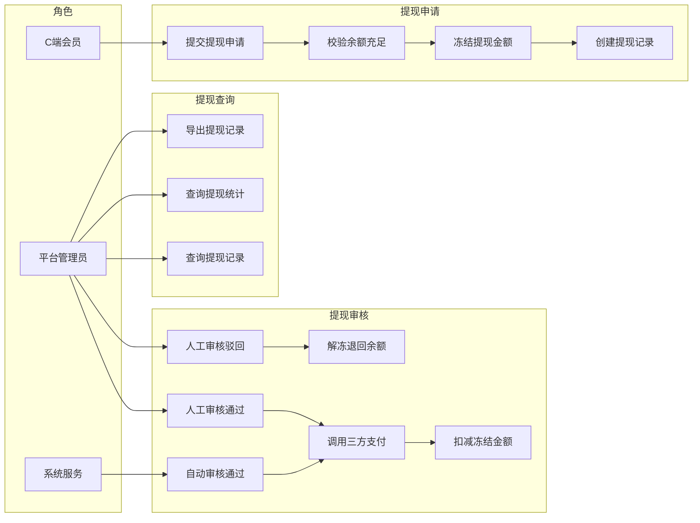
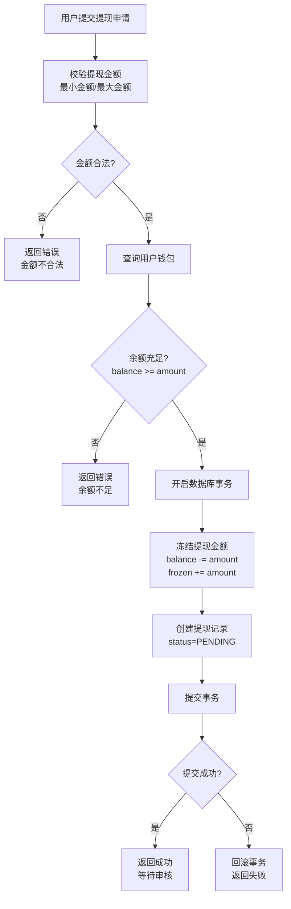
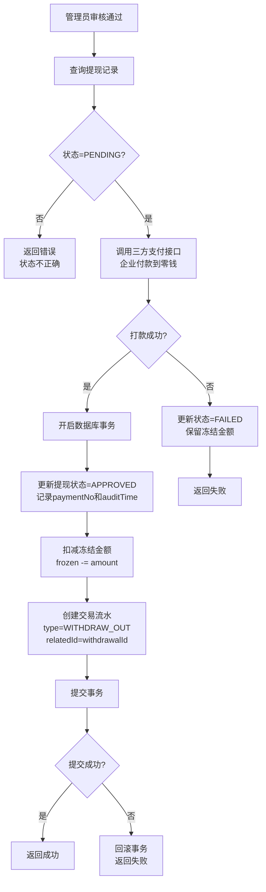
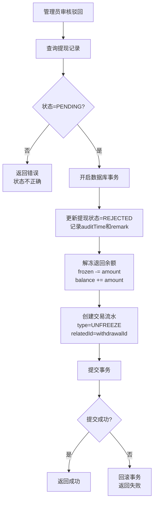
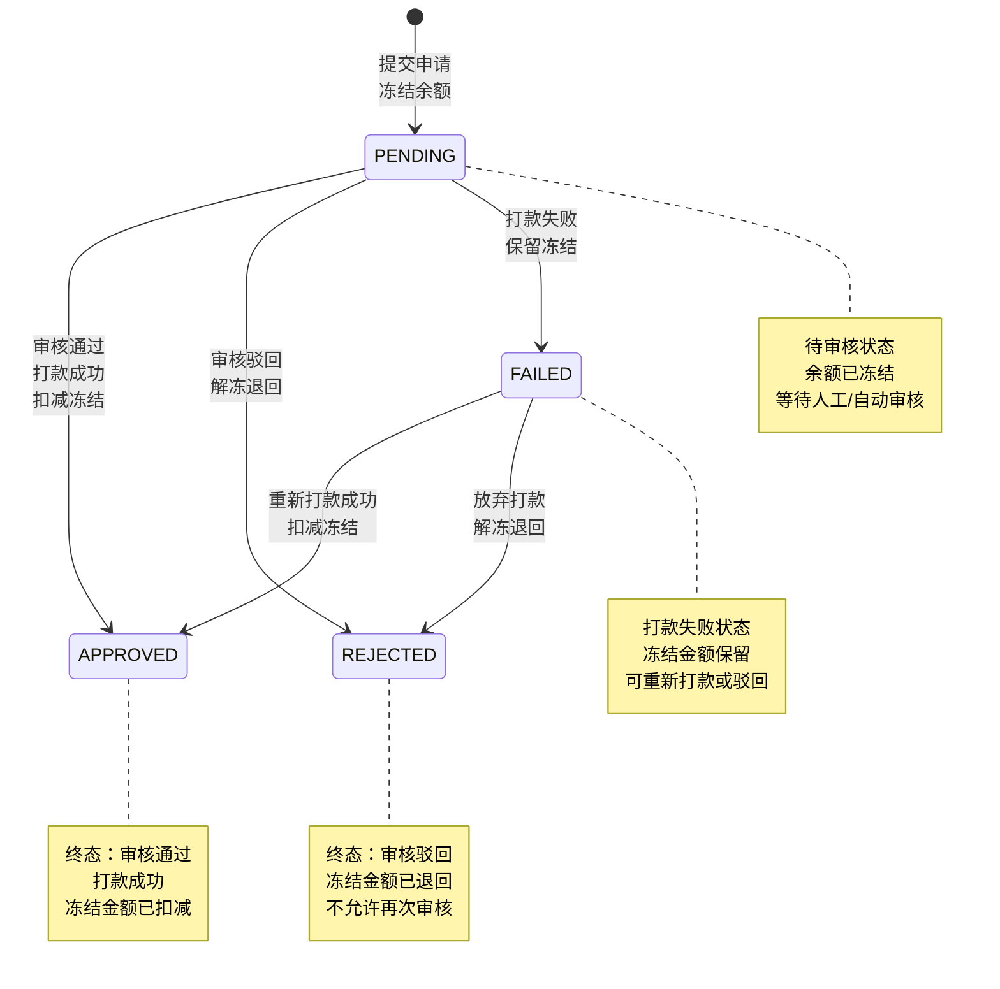

# 提现模块 - 需求文档

> 版本：1.0  
> 日期：2026-02-24  
> 模块路径：`src/module/finance/withdrawal/`  
> 关联模块：`src/module/finance/wallet`（钱包冻结/扣减）、`src/module/ums`（会员信息）  
> 状态：现状分析 + 演进规划

---

## 1. 概述

### 1.1 背景

提现模块是财务系统的流出层，负责处理用户的提现申请、审核流程和三方支付对接。系统采用申请即冻结的策略，在提现申请时立即冻结用户余额，审核通过后调用三方支付接口打款，打款成功后扣减冻结金额并记录流水。

当前系统支持人工审核和自动审核两种模式，对接微信支付企业付款到零钱接口。提现流程包含申请、审核、打款、记账四个核心环节，通过状态机管理提现单据的生命周期。

核心组件：

| 组件                     | 路径                            | 职责                               |
| ------------------------ | ------------------------------- | ---------------------------------- |
| WithdrawalController     | `withdrawal.controller.ts`      | 控制层：暴露申请、审核、查询接口   |
| WithdrawalService        | `withdrawal.service.ts`         | 核心业务逻辑：申请链路与审核入口   |
| WithdrawalAuditService   | `withdrawal-audit.service.ts`   | 审核逻辑：状态流转与资金解冻/扣减  |
| WithdrawalPaymentService | `withdrawal-payment.service.ts` | 打款通道：对接三方支付接口         |
| WithdrawalRepository     | `withdrawal.repository.ts`      | 数据访问层：fin_withdrawal 表 CRUD |

### 1.2 目标

1. 完整描述提现模块的功能现状、审核流程与数据流
2. 分析系统自身的代码缺陷与架构不足
3. 分析与外部模块（钱包、会员、支付）的跨模块设计缺陷
4. 提出演进建议和优先级排序

### 1.3 范围

| 在范围内                                  | 不在范围内          |
| ----------------------------------------- | ------------------- |
| 提现申请与校验                            | 钱包余额管理        |
| 人工审核与自动审核                        | 佣金计算逻辑        |
| 三方支付对接（微信企业付款）              | 结算定时任务        |
| 提现状态管理（PENDING/APPROVED/REJECTED） | 订单支付流程        |
| 提现记录查询与导出                        | 前端 Admin Web 页面 |
| 余额冻结/解冻/扣减                        | 会员推荐关系维护    |

---

## 2. 角色与用例

> 图 1：提现模块用例图

**角色说明**：

| 角色       | 职责                       | 接口前缀                            |
| ---------- | -------------------------- | ----------------------------------- |
| C 端会员   | 提交提现申请               | client/finance/withdrawal（待建设） |
| 平台管理员 | 审核提现申请，查询提现记录 | admin/finance/withdrawal            |
| 系统服务   | 自动审核，三方支付对接     | 内部 Service 调用                   |

---

## 3. 业务流程

### 3.1 提现申请流程

> 图 2：提现申请活动图

### 3.2 提现审核通过流程

> 图 3：提现审核通过活动图

### 3.3 提现审核驳回流程

> 图 4：提现审核驳回活动图

---

## 4. 状态说明

### 4.1 提现状态机

> 图 5：提现状态图

**状态说明**：

| 状态     | 业务含义                           | 是否终态 | 允许跃迁到                 |
| -------- | ---------------------------------- | -------- | -------------------------- |
| PENDING  | 待审核：余额已冻结，等待审核       | 否       | APPROVED, REJECTED, FAILED |
| APPROVED | 审核通过：打款成功，冻结金额已扣减 | 是       | 无                         |
| REJECTED | 审核驳回：冻结金额已退回           | 是       | 无                         |
| FAILED   | 打款失败：冻结金额保留             | 否       | APPROVED, REJECTED         |

---

## 5. 现有功能详述

### 5.1 接口清单

#### 5.1.1 管理端接口（`admin/finance/withdrawal`）— 2 个端点

| 接口     | 方法 | 路径                                  | 权限  | 说明                     |
| -------- | ---- | ------------------------------------- | ----- | ------------------------ |
| 提现列表 | GET  | `/admin/finance/withdrawal`           | ⚠️ 无 | 分页查询，支持按状态筛选 |
| 提现审核 | POST | `/admin/finance/withdrawal/:id/audit` | ⚠️ 无 | 审核通过/驳回            |

> 注：所有端点均缺少 `@ApiBearerAuth` 和 `@RequirePermission` 装饰器。

#### 5.1.2 C 端接口（待建设）

| 接口     | 方法 | 路径                               | 说明                       |
| -------- | ---- | ---------------------------------- | -------------------------- |
| 提现申请 | POST | `/client/finance/withdrawal/apply` | 用户提交提现申请（待建设） |
| 提现记录 | GET  | `/client/finance/withdrawal/list`  | 查询个人提现记录（待建设） |

### 5.2 核心方法清单

| 方法     | 类型    | 说明                               |
| -------- | ------- | ---------------------------------- |
| apply    | Service | 提现申请，校验余额并冻结           |
| audit    | Service | 审核入口，调用 approve 或 reject   |
| approve  | Audit   | 审核通过，调用三方支付并扣减冻结   |
| reject   | Audit   | 审核驳回，解冻退回余额             |
| transfer | Payment | 三方支付对接，调用微信企业付款接口 |
| getList  | Service | 查询提现列表，支持分页和筛选       |

### 5.3 提现规则

| 规则项   | 说明                           |
| -------- | ------------------------------ |
| 最小金额 | 单笔提现最小金额（如 1 元）    |
| 最大金额 | 单笔提现最大金额（如 5000 元） |
| 手续费   | 提现手续费（当前未实现）       |
| 到账时间 | T+1 工作日到账                 |
| 审核方式 | 人工审核或自动审核             |

---

## 6. 现有逻辑不足分析

### 6.1 P0 级缺陷（阻塞性）

#### D-1：申请接口缺少防重缓存

- 现状：apply 方法使用 @Transactional，但 Controller 层无防重机制
- 影响：高并发下连续点击可能导致多次余额检查通过，产生重复提现申请
- 建议：Controller 层增加 Redis setnx 防重缓存（1 秒）

#### D-2：audit 方法缺少状态校验

- 现状：查询提现记录时未限定 status = PENDING
- 影响：已处理的订单可能被并发审核，导致重复打款或重复退回
- 建议：查询时携带 where: { status: 'PENDING' }

#### D-3：approve 方法分布式事务失衡

- 现状：transfer 调用置于数据库事务外
- 影响：若外部打款超时或状态未知，事务回滚将产生钱已出但状态没变的灾难
- 建议：引入对账补偿机制，定时任务轮询支付平台终态

### 6.2 P1 级缺陷（高优先级）

#### D-4：缺少提现限额控制

- 现状：无单日提现次数和金额限制
- 影响：用户可无限次提现，增加审核成本和风险
- 建议：增加单日提现次数（如 3 次）和金额（如 10000 元）限制

#### D-5：缺少提现手续费

- 现状：提现无手续费
- 影响：无法覆盖支付通道成本
- 建议：增加提现手续费配置，支持固定金额或比例

#### D-6：缺少提现失败重试

- 现状：打款失败后状态为 FAILED，无自动重试机制
- 影响：需人工介入处理，效率低
- 建议：增加自动重试机制，最多 3 次

### 6.3 P2 级缺陷（中优先级）

#### D-7：缺少提现统计功能

- 现状：无按时间、状态维度的提现统计
- 影响：无法分析提现趋势
- 建议：新增统计接口，支持多维度分析

#### D-8：缺少提现导出功能

- 现状：无提现记录导出功能
- 影响：财务对账困难
- 建议：新增导出接口，支持 Excel 导出

#### D-9：缺少 C 端提现接口

- 现状：无 C 端提现申请接口
- 影响：用户无法自助提现
- 建议：新增 POST /client/finance/withdrawal/apply 接口

### 6.4 P3 级缺陷（低优先级）

#### D-10：缺少提现到账通知

- 现状：提现成功后无通知
- 影响：用户无法及时感知到账
- 建议：引入事件驱动，提现成功后发送通知

#### D-11：缺少提现记录详情接口

- 现状：无提现记录详情查询接口
- 影响：用户无法查看提现详情
- 建议：新增 GET /admin/finance/withdrawal/:id 接口

---

## 8. 验收标准

### X-1：与钱包模块耦合

- 现状：直接调用 WalletService.freezeBalance/unfreezeBalance/deductFrozen
- 影响：钱包服务异常时提现流程中断
- 建议：引入消息队列解耦，提现失败时重试

### X-2：与支付模块耦合

- 现状：直接调用 WithdrawalPaymentService.transfer
- 影响：支付服务异常时提现流程中断，缺少降级方案
- 建议：引入对账补偿机制，支持手动重新打款

### X-3：缺少会员信息校验

- 现状：未校验会员实名认证状态
- 影响：未实名用户可提现，存在风险
- 建议：提现前校验会员实名状态

---

## 9. 验收标准

### 9.1 现有功能验收

| 编号 | 验收条件                              | 状态      |
| ---- | ------------------------------------- | --------- |
| AC-1 | 提现申请时校验余额充足                | ✅ 已通过 |
| AC-2 | 提现申请时冻结余额                    | ✅ 已通过 |
| AC-3 | 创建提现记录，状态为 PENDING          | ✅ 已通过 |
| AC-4 | 审核通过时调用三方支付接口            | ✅ 已通过 |
| AC-5 | 打款成功后扣减冻结金额                | ✅ 已通过 |
| AC-6 | 打款成功后创建 WITHDRAW_OUT 流水      | ✅ 已通过 |
| AC-7 | 审核驳回时解冻退回余额                | ✅ 已通过 |
| AC-8 | 打款失败时状态为 FAILED，保留冻结金额 | ✅ 已通过 |
| AC-9 | 查询提现列表，支持分页和筛选          | ✅ 已通过 |

### 9.2 待修复验收

| 编号  | 验收条件                         | 状态      | 对应缺陷 |
| ----- | -------------------------------- | --------- | -------- |
| AC-10 | 申请接口防重，1 秒内不可重复提交 | ❌ 未实现 | D-1      |
| AC-11 | 审核时校验状态为 PENDING         | ❌ 未实现 | D-2      |
| AC-12 | 打款失败时支持对账补偿           | ❌ 未实现 | D-3      |
| AC-13 | 单日提现次数和金额限制           | ❌ 未实现 | D-4      |
| AC-14 | 支持提现手续费                   | ❌ 未实现 | D-5      |
| AC-15 | 打款失败自动重试，最多 3 次      | ❌ 未实现 | D-6      |
| AC-16 | 支持提现统计功能                 | ❌ 未实现 | D-7      |
| AC-17 | 支持提现记录导出                 | ❌ 未实现 | D-8      |
| AC-18 | C 端用户可自助提现               | ❌ 未实现 | D-9      |

---

## 10. 演进建议与待办

### 10.1 第一阶段：安全基线修复（1 周）

| 编号 | 任务                     | 对应缺陷 | 预估工时 |
| ---- | ------------------------ | -------- | -------- |
| T-1  | 申请接口增加防重缓存     | D-1      | 0.5h     |
| T-2  | 审核时校验状态为 PENDING | D-2      | 0.5h     |
| T-3  | 引入对账补偿机制         | D-3      | 2d       |
| T-4  | 增加单日提现限额控制     | D-4      | 1d       |

### 10.2 第二阶段：功能完善（1-2 周）

| 编号 | 任务                 | 对应缺陷 | 预估工时 |
| ---- | -------------------- | -------- | -------- |
| T-5  | 增加提现手续费       | D-5      | 1d       |
| T-6  | 增加打款失败自动重试 | D-6      | 1d       |
| T-7  | 新增提现统计功能     | D-7      | 2d       |
| T-8  | 新增提现导出功能     | D-8      | 1d       |
| T-9  | 新增 C 端提现接口    | D-9      | 1d       |
| T-10 | 新增提现到账通知     | D-10     | 1d       |
| T-11 | 新增提现详情接口     | D-11     | 0.5d     |

### 10.3 第三阶段：架构优化（长期）

| 编号 | 任务                     | 预估工时 |
| ---- | ------------------------ | -------- |
| T-12 | 引入消息队列解耦钱包服务 | 2d       |
| T-13 | 引入事件驱动架构         | 3d       |
| T-14 | 增加会员实名校验         | 1d       |

---

## 11. 非功能需求

### 11.1 性能要求

- 提现申请响应时间 < 500ms
- 提现审核响应时间 < 2s（含三方支付）
- 支持每秒 100 次提现申请

### 11.2 可靠性要求

- 提现申请失败自动回滚
- 打款失败支持重试，最多 3 次
- 异常情况下不丢失提现记录

### 11.3 安全性要求

- 防止重复提现
- 防止超额提现
- 所有提现操作记录审计日志
- 提现金额精度保持 2 位小数

### 11.4 可维护性要求

- 提供完善的日志记录
- 支持提现规则的配置化
- 提供提现监控和告警
- 支持手动重新打款
