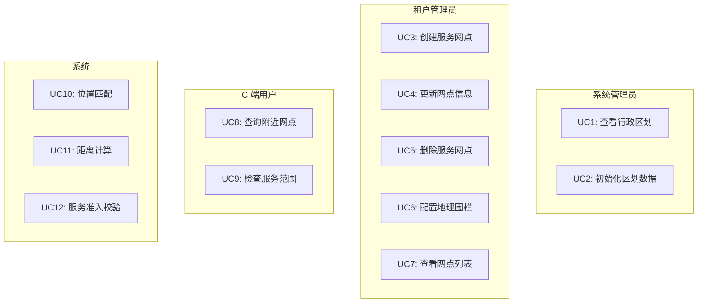
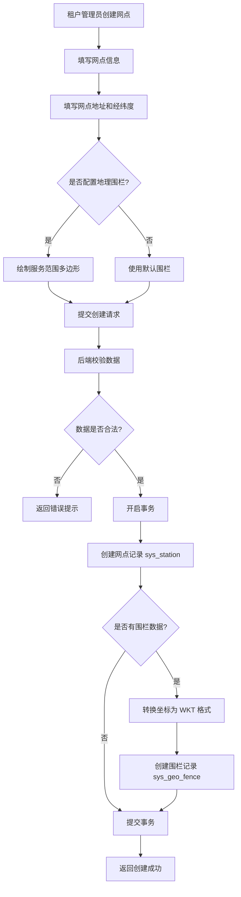
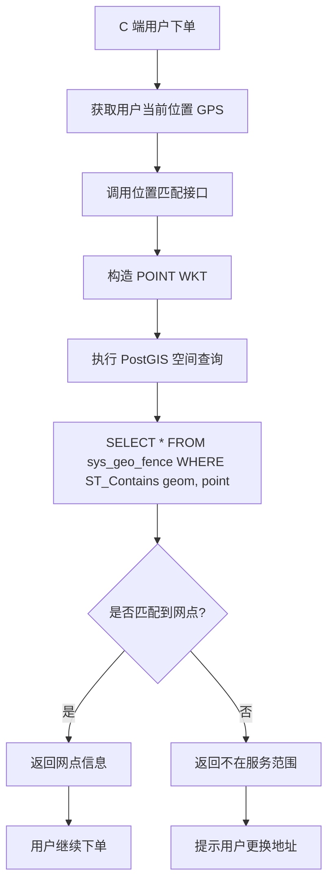
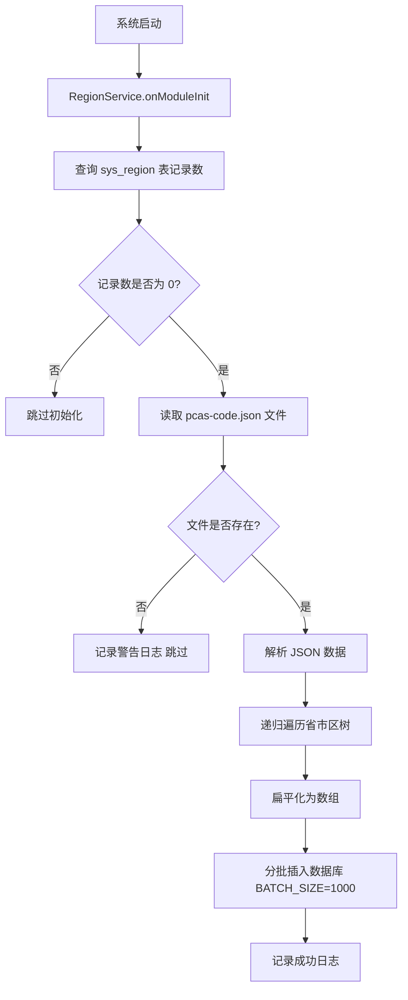

# LBS（位置服务）模块 — 需求文档

> 版本：1.0
> 日期：2026-02-22
> 模块路径：`src/module/lbs/`
> 设计文档：[lbs-design.md](../../design/lbs/lbs-design.md)
> 状态：现状分析 + 改进建议

---

## 1. 概述

### 1.1 背景

LBS（Location Based Services，位置服务）模块是 O2O 平台的核心基础设施，为整个系统提供地理位置相关的能力。包含 3 个子模块：

| 子模块  | 职责                               | 复杂度 | 代码文件数 |
| ------- | ---------------------------------- | ------ | ---------- |
| geo     | 地理空间运算核心（PostGIS 适配层） | 低     | 2          |
| region  | 行政区划管理（省市区基础维度数据） | 低     | 5          |
| station | 服务网点与地理围栏业务逻辑         | 中     | 5          |

### 1.2 目标

1. 提供高性能的地理空间计算能力（PostGIS）
2. 提供标准化的行政区划数据（省市区街道）
3. 支持服务网点的地理围栏管理
4. 实现基于位置的服务准入校验
5. 支持多租户隔离的网点管理

### 1.3 范围

本文档覆盖 LBS 模块的 3 个子模块，包括：

- 地理空间计算（WKT 转换、点在多边形内判断、距离计算）
- 行政区划数据管理（数据初始化、树形查询、缓存）
- 服务网点管理（网点 CRUD、地理围栏同步、位置匹配）

---

## 2. 角色与用例

### 2.1 角色定义

| 角色       | 说明             | 权限                                       |
| ---------- | ---------------- | ------------------------------------------ |
| 系统管理员 | 管理行政区划数据 | 查看行政区划、初始化数据                   |
| 租户管理员 | 管理服务网点     | 创建网点、更新网点、删除网点、配置地理围栏 |
| C 端用户   | 使用位置服务     | 查询附近网点、检查服务范围                 |
| 系统       | 自动化处理       | 位置匹配、距离计算、服务准入校验           |

### 2.2 用例图

> 图 1：LBS 模块用例图



---

## 3. 业务流程

### 3.1 服务网点创建流程

> 图 2：服务网点创建活动图



**关键设计**：

1. 网点创建和围栏创建使用事务包裹，确保数据一致性
2. 坐标数据转换为 WKT（Well-Known Text）格式存储
3. 使用 PostGIS 的 Geometry 类型存储围栏数据

### 3.2 位置匹配流程

> 图 3：用户位置匹配服务网点活动图



**关键设计**：

1. 使用 PostGIS 的 `ST_Contains` 函数判断点是否在多边形内
2. 使用参数化查询防止 SQL 注入
3. 使用空间索引（GIST）提升查询性能

### 3.3 行政区划数据初始化流程

> 图 4：行政区划数据初始化活动图



**关键设计**：

1. 模块启动时自动检测并初始化数据
2. 使用批量插入提升性能（每批 1000 条）
3. 支持省市区街道四级行政区划

---

## 4. 状态说明

LBS 模块本身无状态机，但服务网点支持软删除：

| 状态   | 说明               | 允许操作             |
| ------ | ------------------ | -------------------- |
| 正常   | deleted_at = NULL  | 查询、更新、删除     |
| 已删除 | deleted_at != NULL | 仅查询（需显式指定） |

---

## 5. 现有功能详述

### 5.1 Geo 子模块

#### 5.1.1 核心方法

| 方法               | 说明                                         | 参数                     | 返回值          |
| ------------------ | -------------------------------------------- | ------------------------ | --------------- |
| toPolygonWKT       | 将 GeoJSON 坐标数组转换为 WKT Polygon 字符串 | coordinates: number[][]  | string          |
| findStationByPoint | 判断经纬度点是否在地理围栏内                 | lat: number, lng: number | Station 或 null |
| calculateDistance  | 计算地球表面两点间的直线距离（米）           | lat1, lng1, lat2, lng2   | number          |

#### 5.1.2 PostGIS 函数使用

| PostGIS 函数      | 用途                              | 示例                                         |
| ----------------- | --------------------------------- | -------------------------------------------- |
| ST_GeomFromText   | 将 WKT 字符串转换为 Geometry 对象 | `ST_GeomFromText('POINT(121.5 31.2)', 4326)` |
| ST_Contains       | 判断几何对象 A 是否包含几何对象 B | `ST_Contains(fence.geom, point)`             |
| ST_DistanceSphere | 计算球面距离（米）                | `ST_DistanceSphere(point1, point2)`          |

### 5.2 Region 子模块

#### 5.2.1 核心方法

| 方法          | 说明                     | 参数                | 返回值   |
| ------------- | ------------------------ | ------------------- | -------- |
| getTree       | 获取所有区域树（带缓存） | 无                  | Region[] |
| getChildren   | 获取指定父级的子区域     | parentCode?: string | Region[] |
| getRegionName | 根据编码获取区域名称     | code: string        | string   |
| seedRegions   | 初始化行政区划数据       | 无                  | void     |

#### 5.2.2 数据结构

```typescript
interface Region {
  code: string; // 行政区划编码（主键）
  name: string; // 区域名称
  parentId: string; // 父级编码
  level: number; // 层级（1=省，2=市，3=区，4=街道）
  latitude: number; // 纬度
  longitude: number; // 经度
  children?: Region[]; // 子区域（树形结构）
}
```

### 5.3 Station 子模块

#### 5.3.1 核心方法

| 方法              | 说明                         | 参数              | 返回值          |
| ----------------- | ---------------------------- | ----------------- | --------------- |
| create            | 创建服务站及其地理围栏       | CreateStationDto  | Station         |
| findAll           | 查询服务站列表               | tenantId?: string | Station[]       |
| findNearby        | 根据地理位置查询最近的服务站 | lat, lng          | Station 或 null |
| upsertMainStation | 同步/更新租户的主站点信息    | tenantId, data    | Station         |

#### 5.3.2 数据结构

```typescript
interface Station {
  stationId: number; // 网点 ID
  tenantId: string; // 租户 ID
  name: string; // 网点名称
  address: string; // 网点地址
  latitude: number; // 纬度
  longitude: number; // 经度
  deletedAt: Date; // 删除时间（软删除）
}

interface GeoFence {
  fenceId: number; // 围栏 ID
  stationId: number; // 关联网点 ID
  fenceType: string; // 围栏类型（SERVICE=服务范围）
  geom: Geometry; // PostGIS Geometry 对象
}
```

---

## 6. 现有逻辑不足分析

### 6.1 Geo 子模块缺陷

| 编号 | 问题               | 严重度 | 详述                                                                                                    |
| ---- | ------------------ | ------ | ------------------------------------------------------------------------------------------------------- |
| D-1  | 无坐标系校验       | P2     | `toPolygonWKT` 方法未校验输入坐标是否在合法范围内（经度 -180~180，纬度 -90~90），可能导致无效数据入库。 |
| D-2  | 无多边形闭合校验   | P2     | `toPolygonWKT` 方法虽然会自动闭合多边形，但未校验首尾点是否重复，可能导致数据冗余。                     |
| D-3  | 无空间索引使用说明 | P3     | 代码中未明确说明 `sys_geo_fence.geom` 字段需要创建 GIST 空间索引，可能导致性能问题。                    |
| D-4  | 距离计算无单位转换 | P3     | `calculateDistance` 方法返回米，但未提供单位转换工具（如转换为公里），使用不便。                        |

### 6.2 Region 子模块缺陷

| 编号 | 问题                   | 严重度 | 详述                                                                               |
| ---- | ---------------------- | ------ | ---------------------------------------------------------------------------------- |
| D-5  | 数据初始化无幂等性保护 | P1     | `seedRegions` 方法未使用分布式锁，多实例部署时可能重复初始化数据。                 |
| D-6  | 缓存装饰器未实现       | P1     | `@SystemCacheable` 装饰器仅定义了元数据，未实现实际的缓存逻辑（需要 AOP 拦截器）。 |
| D-7  | 无数据更新机制         | P2     | 行政区划数据变更后（如新增街道），无法自动更新，需要手动清理数据库重新初始化。     |
| D-8  | JSON 文件路径硬编码    | P2     | `pcas-code.json` 文件路径硬编码，生产环境可能找不到文件。                          |

### 6.3 Station 子模块缺陷

| 编号 | 问题                     | 严重度 | 详述                                                                                                                      |
| ---- | ------------------------ | ------ | ------------------------------------------------------------------------------------------------------------------------- |
| D-9  | DTO 与 Entity 映射不一致 | P1     | `create` 方法中 DTO 使用嵌套结构（`location: {lat, lng}`），但代码中同时支持扁平结构（`latitude, longitude`），逻辑混乱。 |
| D-10 | 无围栏类型枚举           | P2     | 围栏类型（`SERVICE`）使用字符串硬编码，未定义枚举，容易出错。                                                             |
| D-11 | 无围栏数量限制           | P2     | 单个网点可以创建无限个围栏，可能导致性能问题和数据冗余。                                                                  |
| D-12 | 无围栏面积校验           | P2     | 未校验围栏面积是否合理（如过大或过小），可能导致业务异常。                                                                |
| D-13 | 软删除后围栏未清理       | P1     | 网点软删除后，关联的围栏记录未清理，可能导致空间查询返回已删除网点。                                                      |

### 6.4 跨模块缺陷

| 编号 | 问题             | 严重度 | 涉及模块         | 详述                                                                  |
| ---- | ---------------- | ------ | ---------------- | --------------------------------------------------------------------- |
| X-1  | 无 C 端接口      | P1     | station → client | 缺少 C 端查询附近网点、检查服务范围的接口，C 端无法直接使用位置服务。 |
| X-2  | 无与订单模块集成 | P1     | station → order  | 订单创建时未调用位置匹配服务，无法自动分配网点。                      |
| X-3  | 无与配送模块集成 | P2     | geo → delivery   | 缺少配送距离计算、配送范围校验等功能。                                |

### 6.5 架构层面不足

| 编号 | 问题             | 详述                                                                |
| ---- | ---------------- | ------------------------------------------------------------------- |
| A-1  | 无地理编码服务   | 缺少地址到坐标的转换（Geocoding），需要手动输入经纬度，用户体验差。 |
| A-2  | 无逆地理编码服务 | 缺少坐标到地址的转换（Reverse Geocoding），无法自动填充地址信息。   |
| A-3  | 无路径规划服务   | 缺少路径规划（Routing）功能，无法计算配送路线和预估时间。           |
| A-4  | 无地图可视化     | 缺少地图可视化工具，运营无法直观查看网点分布和服务范围。            |
| A-5  | 无围栏热力图     | 缺少围栏覆盖热力图，无法分析服务盲区。                              |
| A-6  | 无多围栏类型支持 | 仅支持 SERVICE 类型围栏，无法支持配送范围、营业范围等多种类型。     |

---

## 7. 市面主流 O2O 平台对标

### 7.1 功能对比矩阵

| 功能         | 本系统 | 美团 | 饿了么 | 京东到家 | 差距评估   |
| ------------ | ------ | ---- | ------ | -------- | ---------- |
| 地理空间计算 | 有     | 有   | 有     | 有       | 持平       |
| 行政区划数据 | 有     | 有   | 有     | 有       | 持平       |
| 服务网点管理 | 有     | 有   | 有     | 有       | 持平       |
| 地理围栏     | 有     | 有   | 有     | 有       | 持平       |
| 位置匹配     | 有     | 有   | 有     | 有       | 持平       |
| 距离计算     | 有     | 有   | 有     | 有       | 持平       |
| C 端接口     | 无     | 有   | 有     | 有       | 缺失（P1） |
| 地理编码     | 无     | 有   | 有     | 有       | 缺失（P1） |
| 逆地理编码   | 无     | 有   | 有     | 有       | 缺失（P1） |
| 路径规划     | 无     | 有   | 有     | 有       | 缺失（P2） |
| 地图可视化   | 无     | 有   | 有     | 有       | 缺失（P2） |
| 多围栏类型   | 无     | 有   | 有     | 有       | 缺失（P2） |

### 7.2 差距总结

本系统在 LBS 的核心功能（地理空间计算、行政区划、服务网点、地理围栏）上已具备基本能力，但在以下方面存在明显差距：

1. C 端能力缺失（P1）：无 C 端接口、无地理编码、无逆地理编码
2. 业务集成不足（P1）：未与订单模块集成、未与配送模块集成
3. 运营工具缺失（P2）：无地图可视化、无围栏热力图
4. 功能扩展性不足（P2）：无路径规划、无多围栏类型支持

---

## 8. 验收标准

### 8.1 现有功能验收

| 编号 | 验收条件                                             | 状态   |
| ---- | ---------------------------------------------------- | ------ |
| AC-1 | 坐标数组正确转换为 WKT Polygon 格式                  | 已通过 |
| AC-2 | 点在多边形内判断正确（使用 PostGIS ST_Contains）     | 已通过 |
| AC-3 | 两点间距离计算正确（使用 PostGIS ST_DistanceSphere） | 已通过 |
| AC-4 | 行政区划数据自动初始化                               | 已通过 |
| AC-5 | 行政区划树形查询正确                                 | 已通过 |
| AC-6 | 服务网点创建成功，同时创建地理围栏                   | 已通过 |
| AC-7 | 根据位置查询最近网点正确                             | 已通过 |
| AC-8 | 网点软删除后不出现在查询结果中                       | 已通过 |

### 8.2 待修复验收

| 编号  | 验收条件                                   | 状态   | 对应缺陷 |
| ----- | ------------------------------------------ | ------ | -------- |
| AC-9  | 数据初始化添加分布式锁，多实例不重复初始化 | 未实现 | D-5      |
| AC-10 | 缓存装饰器实现实际的缓存逻辑               | 未实现 | D-6      |
| AC-11 | DTO 与 Entity 映射统一，移除扁平结构支持   | 未实现 | D-9      |
| AC-12 | 网点软删除后自动清理关联围栏               | 未实现 | D-13     |
| AC-13 | 提供 C 端查询附近网点接口                  | 未实现 | X-1      |
| AC-14 | 订单创建时自动调用位置匹配服务             | 未实现 | X-2      |

---

## 9. 演进建议与待办

### 9.1 第一阶段：核心修复（1-2 周）

| 编号 | 任务                      | 对应缺陷 | 预估工时 |
| ---- | ------------------------- | -------- | -------- |
| T-1  | 数据初始化添加分布式锁    | D-5      | 2h       |
| T-2  | 缓存装饰器实现 AOP 拦截器 | D-6      | 2d       |
| T-3  | DTO 与 Entity 映射统一    | D-9      | 1d       |
| T-4  | 网点软删除后自动清理围栏  | D-13     | 0.5d     |
| T-5  | 定义围栏类型枚举          | D-10     | 0.5h     |

### 9.2 第二阶段：C 端能力（2-3 周）

| 编号 | 任务                                | 对应缺陷 | 预估工时 |
| ---- | ----------------------------------- | -------- | -------- |
| T-6  | 创建 C 端查询附近网点接口           | X-1      | 1d       |
| T-7  | 创建 C 端检查服务范围接口           | X-1      | 0.5d     |
| T-8  | 集成第三方地理编码服务（高德/百度） | A-1      | 2-3d     |
| T-9  | 集成第三方逆地理编码服务            | A-2      | 1-2d     |

### 9.3 第三阶段：业务集成（1-2 月）

| 编号 | 任务                                           | 对应缺陷 | 预估工时 |
| ---- | ---------------------------------------------- | -------- | -------- |
| T-10 | 订单创建时自动调用位置匹配                     | X-2      | 1-2d     |
| T-11 | 配送模块集成距离计算                           | X-3      | 2-3d     |
| T-12 | 支持多围栏类型（服务范围、配送范围、营业范围） | A-6      | 2-3d     |
| T-13 | 添加围栏面积校验                               | D-12     | 1d       |

### 9.4 第四阶段：运营工具（3-6 月）

| 编号 | 任务                 | 说明                                            |
| ---- | -------------------- | ----------------------------------------------- |
| T-14 | 地图可视化工具       | 使用高德/百度地图 SDK，可视化网点分布和服务范围 |
| T-15 | 围栏热力图           | 分析服务盲区，优化网点布局                      |
| T-16 | 路径规划服务         | 集成第三方路径规划 API，计算配送路线和预估时间  |
| T-17 | 行政区划数据更新机制 | 支持增量更新，无需重新初始化                    |

### 9.5 关键路径

```
T-1(分布式锁) → T-2(缓存装饰器) → T-3(DTO 映射) → T-6(C 端接口) → T-8(地理编码) → T-10(订单集成)
```

**优先级总结**：

| 优先级 | 任务数 | 核心内容                                                   | 预估工时 |
| ------ | ------ | ---------------------------------------------------------- | -------- |
| P0     | 5 项   | 分布式锁 + 缓存装饰器 + DTO 映射 + 围栏清理 + 围栏类型枚举 | 1-2 周   |
| P1     | 4 项   | C 端接口 + 地理编码 + 逆地理编码                           | 2-3 周   |
| P2     | 4 项   | 订单集成 + 配送集成 + 多围栏类型 + 围栏面积校验            | 1-2 月   |
| P3     | 4 项   | 地图可视化 + 围栏热力图 + 路径规划 + 数据更新机制          | 3-6 月   |

---

**文档版本**：1.0
**最后更新**：2026-02-22
**维护者**：Backend Team
