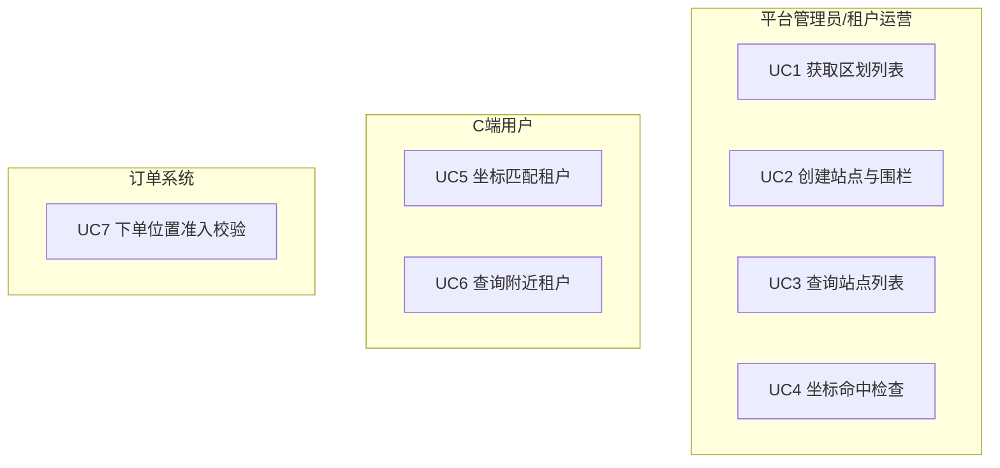
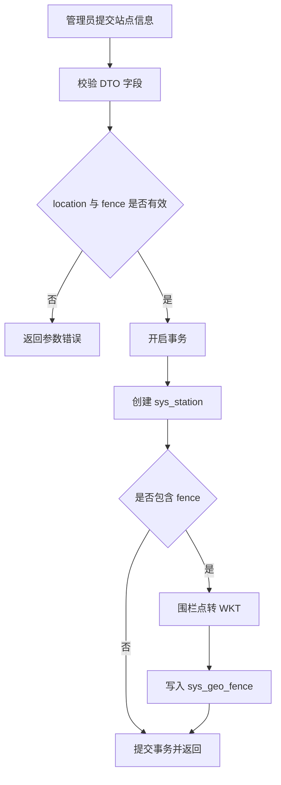
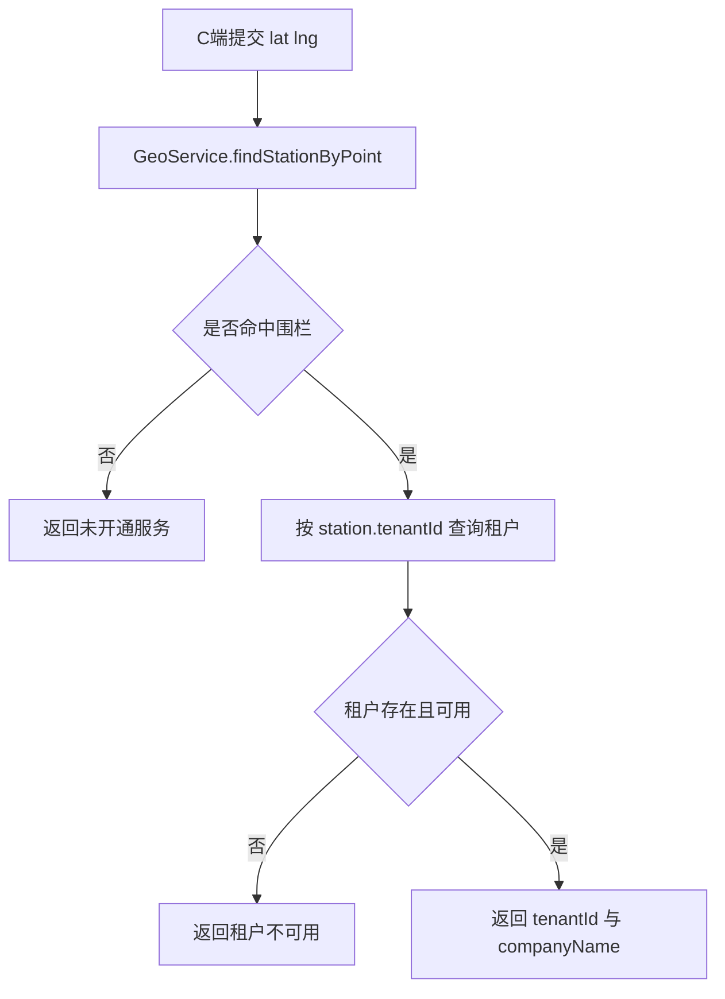
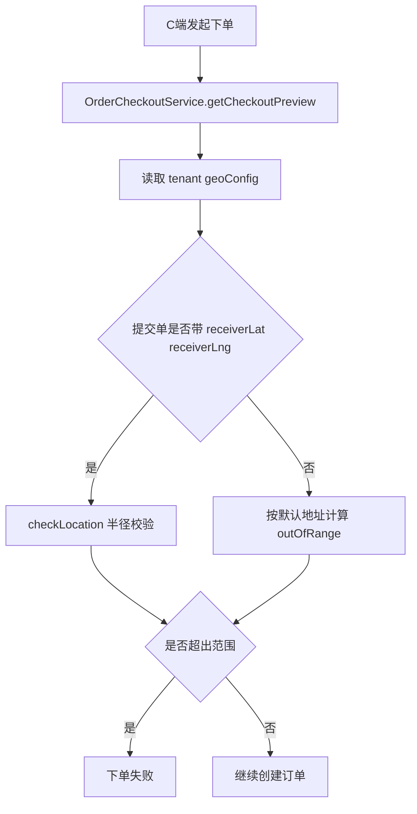
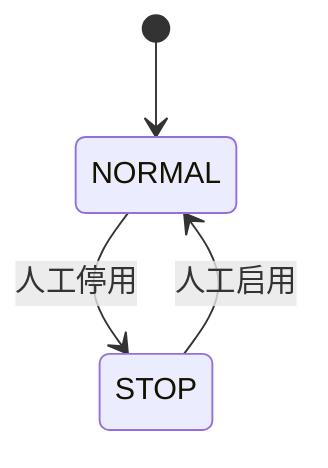

# LBS（位置服务）模块需求文档（重分析版）

> 版本：2.0  
> 日期：2026-03-02  
> 模块路径：`apps/backend/src/module/lbs/`  
> 关联模块：`apps/backend/src/module/client/location/`、`apps/backend/src/module/client/order/`  
> 状态：重分析完成（基于现网代码复核）

---

## 1. 概述

### 1.1 背景

LBS（Location Based Services）是平台的基础能力域，负责：

- 地理围栏匹配（点是否命中站点服务区）
- 行政区划数据管理（省市区街道）
- 站点与租户的地理映射（租户可服务范围）

本次为重分析版本，目标是修正旧文档中已过时结论，并补齐当前代码中的高优先级风险。

### 1.2 目标

1. 明确 LBS 在后端中的能力边界（LBS vs Client Location vs Order Checkout）。
2. 将代码现状中 P0/P1 风险转化为可执行需求与验收项。
3. 统一服务范围判定模型，避免前台匹配与下单校验规则冲突。
4. 建立可观测、可扩展、可运维的 LBS 基线能力。

### 1.3 范围

本文档覆盖：

- `geo`：空间计算与 PostGIS 查询
- `region`：区划数据初始化与查询
- `station`：站点与围栏管理
- `client/location`：C 端租户匹配与附近租户查询
- `client/order`：下单时位置准入校验（集成点）

---

## 2. 角色与用例

### 2.1 角色定义

| 角色       | 说明                   | 核心权限                             |
| ---------- | ---------------------- | ------------------------------------ |
| 平台管理员 | 维护区域与站点地理基线 | 初始化区划、配置站点、维护围栏       |
| 租户运营   | 维护本网点服务范围     | 新增站点、调整围栏、查询命中         |
| C 端用户   | 位置匹配与下单         | 坐标匹配租户、查询附近租户、下单准入 |
| 订单系统   | 交易链路准入校验       | 下单前服务范围校验                   |

### 2.2 用例图

> 图 1：LBS 模块用例图

```mermaid
graph TB
    subgraph Admin["平台管理员/租户运营"]
        UC1[UC1 获取区划列表]
        UC2[UC2 创建站点与围栏]
        UC3[UC3 查询站点列表]
        UC4[UC4 坐标命中检查]
    end

    subgraph Client["C端用户"]
        UC5[UC5 坐标匹配租户]
        UC6[UC6 查询附近租户]
    end

    subgraph Order["订单系统"]
        UC7[UC7 下单位置准入校验]
    end
```

---

## 3. 业务流程

### 3.1 站点创建与围栏写入流程

> 图 2：站点创建活动图

```mermaid
flowchart TD
    A[管理员提交站点信息] --> B[校验 DTO 字段]
    B --> C{location 与 fence 是否有效}
    C -->|否| D[返回参数错误]
    C -->|是| E[开启事务]
    E --> F[创建 sys_station]
    F --> G{是否包含 fence}
    G -->|否| H[提交事务并返回]
    G -->|是| I[围栏点转 WKT]
    I --> J[写入 sys_geo_fence]
    J --> H
```

### 3.2 C 端坐标匹配租户流程

> 图 3：坐标匹配租户活动图

```mermaid
flowchart TD
    A[C端提交 lat lng] --> B[GeoService.findStationByPoint]
    B --> C{是否命中围栏}
    C -->|否| D[返回未开通服务]
    C -->|是| E[按 station.tenantId 查询租户]
    E --> F{租户存在且可用}
    F -->|否| G[返回租户不可用]
    F -->|是| H[返回 tenantId 与 companyName]
```

### 3.3 下单位置准入流程

> 图 4：订单创建位置校验活动图

```mermaid
flowchart TD
    A[C端发起下单] --> B[OrderCheckoutService.getCheckoutPreview]
    B --> C[读取 tenant geoConfig]
    C --> D{提交单是否带 receiverLat receiverLng}
    D -->|是| E[checkLocation 半径校验]
    D -->|否| F[按默认地址计算 outOfRange]
    E --> G{是否超出范围}
    F --> G
    G -->|是| H[下单失败]
    G -->|否| I[继续创建订单]
```

---

## 4. 状态说明

### 4.1 状态机图（站点可用状态）

> 图 5：站点状态图

```mermaid
stateDiagram-v2
    [*] --> NORMAL
    NORMAL --> STOP: 人工停用
    STOP --> NORMAL: 人工启用
```

### 4.2 状态说明表

| 状态   | 说明           | 允许操作                     |
| ------ | -------------- | ---------------------------- |
| NORMAL | 站点可提供服务 | 可被位置匹配命中、可下单     |
| STOP   | 站点停用       | 不应被匹配命中、不应参与准入 |

---

## 5. 现有功能详述

### 5.1 接口清单

| 接口                              | 方法 | 说明             | 调用方      |
| --------------------------------- | ---- | ---------------- | ----------- |
| `/lbs/region/list`                | GET  | 查询下级行政区划 | 管理端      |
| `/lbs/region/name/:code`          | GET  | 按编码查区划名称 | 管理端      |
| `/lbs/station`                    | POST | 创建站点与围栏   | 管理端      |
| `/lbs/station/list`               | GET  | 查询站点列表     | 管理端      |
| `/lbs/station/check-region`       | GET  | 坐标命中站点查询 | 管理端/调试 |
| `/client/location/match-tenant`   | POST | 按坐标匹配租户   | C 端        |
| `/client/location/nearby-tenants` | GET  | 查询附近租户     | C 端        |

### 5.2 核心方法清单

| 方法                                          | 所在模块        | 说明                   |
| --------------------------------------------- | --------------- | ---------------------- |
| `GeoService.toPolygonWKT`                     | geo             | 围栏点转 WKT           |
| `GeoService.findStationByPoint`               | geo             | PostGIS 点命中围栏查询 |
| `GeoService.calculateDistance`                | geo             | 球面距离计算           |
| `RegionService.seedRegions`                   | region          | 区划初始化             |
| `RegionService.getTree/getChildren`           | region          | 区划查询               |
| `StationService.create`                       | station         | 创建站点与围栏         |
| `StationService.upsertMainStation`            | station         | 主站点覆盖更新         |
| `ClientLocationService.matchTenantByLocation` | client/location | C 端租户匹配           |
| `OrderCheckoutService.checkLocation`          | client/order    | 下单准入校验           |

### 5.3 业务规则详述

1. 围栏坐标统一按 WGS84 经纬度处理。
2. 位置命中优先通过围栏多边形判断，命中后再映射租户。
3. 下单准入当前使用 `tenant.geoConfig` 半径模型，不直接复用围栏模型。
4. 区划数据为空时在模块初始化阶段自动导入 JSON。

---

## 6. 现有逻辑不足分析

### 6.1 P0 级缺陷

| 编号 | 问题                                                       | 影响                                        |
| ---- | ---------------------------------------------------------- | ------------------------------------------- |
| D-1  | 站点创建围栏坐标转换链路存在数组维度错误风险               | 围栏 WKT 可能错误入库，导致命中结果不可预测 |
| D-2  | `StationRepository` 软删基类与 `SysStation` 模型字段不一致 | 查询/统计条件可能失真，存在运行时风险       |
| D-3  | LBS 管理接口使用 `@Body() any` 且未补齐权限约束            | 输入质量和权限边界风险高                    |

### 6.2 P1 级缺陷

| 编号 | 问题                                      | 影响                           |
| ---- | ----------------------------------------- | ------------------------------ |
| D-4  | 空间命中查询未显式过滤站点状态            | 停用站点可能被命中             |
| D-5  | `sys_geo_fence.geom` 缺少 GIST 空间索引   | 围栏规模增长后查询性能恶化     |
| D-6  | 区划初始化无分布式锁                      | 多实例并发启动可能重复种子写入 |
| D-7  | 区划缓存装饰器在 LBS 服务中可能未真正生效 | 高并发下重复查询 DB            |

### 6.3 P2 级缺陷

| 编号 | 问题                                         | 影响                         |
| ---- | -------------------------------------------- | ---------------------------- |
| D-8  | 缺少经纬度范围、围栏自交、点数下限等完整校验 | 无效几何数据入库             |
| D-9  | 准入模型双轨（围栏 vs 半径）未统一           | 匹配成功但下单失败等体验冲突 |
| D-10 | 围栏类型字符串硬编码（`SERVICE`）            | 扩展多围栏类型困难           |
| D-11 | DTO 声明支持圆形围栏但实现仅支持多边形       | 文档与实现不一致             |

### 6.4 P3 级缺陷

| 编号 | 问题                                     | 影响             |
| ---- | ---------------------------------------- | ---------------- |
| D-12 | 缺少核心指标监控（命中率、延迟、异常率） | 线上问题发现滞后 |
| D-13 | 缺少站点/围栏批量维护能力                | 运维效率低       |
| D-14 | 缺少统一距离单位转换与展示工具           | 上层业务重复实现 |

---

## 7. 市面主流系统对标

### 7.1 功能对比矩阵

| 能力               | 当前系统 | 美团 | 饿了么 | 京东到家 | 差距 |
| ------------------ | -------- | ---- | ------ | -------- | ---- |
| 围栏命中           | 有       | 有   | 有     | 有       | 持平 |
| 附近租户查询       | 有       | 有   | 有     | 有       | 持平 |
| 统一准入模型       | 弱       | 强   | 强     | 强       | P1   |
| 空间索引与调优体系 | 弱       | 强   | 强     | 强       | P1   |
| 围栏运营工具       | 弱       | 强   | 强     | 中       | P2   |
| 地址解析服务       | 无       | 有   | 有     | 有       | P2   |

### 7.2 差距总结

1. 核心差距不在“有没有接口”，而在“规则是否统一、是否可运维”。
2. 需要优先完成数据正确性和性能基线，再建设高级功能（地理编码、热力图）。

---

## 8. 跨模块缺陷

| 编号 | 问题                                               | 涉及模块                           | 影响                 |
| ---- | -------------------------------------------------- | ---------------------------------- | -------------------- |
| X-1  | `client/location` 与 `client/order` 准入模型不一致 | client/location, client/order, lbs | 用户体验冲突         |
| X-2  | LBS 命中结果缺少站点可用性统一过滤规范             | lbs, tenant                        | 业务结果不稳定       |
| X-3  | 站点围栏变更与租户地理配置未定义同步策略           | lbs, tenant geo                    | 数据漂移             |
| X-4  | 下单链路未直接复用围栏命中服务                     | client/order, lbs                  | 逻辑重复，维护成本高 |

---

## 9. 验收标准

### 9.1 现有能力验收

| 编号 | 验收条件                       | 状态   |
| ---- | ------------------------------ | ------ |
| AC-1 | 围栏点可转换为合法 WKT 并入库  | 需复核 |
| AC-2 | 坐标可命中站点并返回租户       | 已具备 |
| AC-3 | C 端可查询附近租户并按距离排序 | 已具备 |
| AC-4 | 区划数据可初始化并查询         | 已具备 |

### 9.2 待修复验收

| 编号  | 验收条件                                       | 对应缺陷 |
| ----- | ---------------------------------------------- | -------- |
| AC-5  | 围栏写入链路通过单测与集成测验证，避免维度错误 | D-1      |
| AC-6  | 站点仓储基类与数据模型一致，查询结果稳定       | D-2      |
| AC-7  | LBS 管理接口完成 DTO 化与权限控制              | D-3      |
| AC-8  | 空间命中仅返回 NORMAL 站点，且租户可用         | D-4, X-2 |
| AC-9  | `geom` 字段建立 GIST 索引，命中查询性能达标    | D-5      |
| AC-10 | 区划初始化具备分布式幂等保护                   | D-6      |
| AC-11 | 准入模型统一，避免匹配成功但下单失败冲突       | D-9, X-1 |

---

## 10. 演进建议与待办

### 10.1 第一阶段：稳定性修复（1 周）

| 编号 | 任务                                              | 预估 |
| ---- | ------------------------------------------------- | ---- |
| T-1  | 修复站点创建围栏坐标转换与 WKT 入库链路           | 1d   |
| T-2  | 对齐 `StationRepository` 与 `SysStation` 软删策略 | 0.5d |
| T-3  | LBS Controller 全量 DTO 化并补齐权限装饰器        | 1d   |
| T-4  | 补齐 geo/station 关键单测与集成测试               | 1d   |

### 10.2 第二阶段：规则统一（1-2 周）

| 编号 | 任务                                                 | 预估 |
| ---- | ---------------------------------------------------- | ---- |
| T-5  | 统一位置准入模型（围栏优先或半径优先，形成唯一口径） | 2d   |
| T-6  | 下单链路复用统一准入服务                             | 1d   |
| T-7  | 空间命中查询增加站点状态与租户状态过滤               | 1d   |
| T-8  | 区划缓存接入与失效策略落地                           | 1d   |

### 10.3 第三阶段：性能与运维（2-4 周）

| 编号 | 任务                                          | 预估 |
| ---- | --------------------------------------------- | ---- |
| T-9  | 新增 `sys_geo_fence.geom` GIST 索引与迁移脚本 | 1d   |
| T-10 | 位置服务监控看板（命中率、P95、错误率）       | 2d   |
| T-11 | 区划种子初始化增加分布式锁                    | 1d   |
| T-12 | 围栏数据质量校验工具（批量巡检）              | 2d   |

### 10.4 第四阶段：能力增强（1-2 月）

| 编号 | 任务                                     | 预估 |
| ---- | ---------------------------------------- | ---- |
| T-13 | 地址地理编码与逆地理编码能力接入         | 1-2w |
| T-14 | 多围栏类型支持（服务区、禁行区、营业区） | 1-2w |
| T-15 | 围栏可视化与运营分析工具                 | 2-4w |

---

## 11. 非功能需求

### 11.1 性能

- 位置命中接口 P95 小于 500ms（围栏规模 10 万级）。
- 附近租户查询 P95 小于 300ms（50km 半径）。
- 区划树查询命中缓存后 P95 小于 100ms。

### 11.2 可靠性

- 区划初始化需幂等，多实例并发启动不得重复写入脏数据。
- 围栏写入与站点创建必须事务一致，失败可回滚。
- 空间查询失败需返回统一业务错误并记录 traceId。

### 11.3 安全性

- 管理端 LBS 接口必须鉴权并配置权限点。
- 输入坐标与围栏点必须经过白名单校验和范围校验。
- 日志不得打印敏感个人信息，手机号等字段需脱敏。

### 11.4 可维护性

- 明确 LBS 与 client/order 的依赖边界，统一准入服务出口。
- 关键规则沉淀 Process Spec 与 Rule ID 测试映射。
- 变更围栏模型时必须同步更新需求文档、设计文档和任务清单。

---

**文档版本**：2.0  
**最后更新**：2026-03-02  
**维护者**：Backend Team
