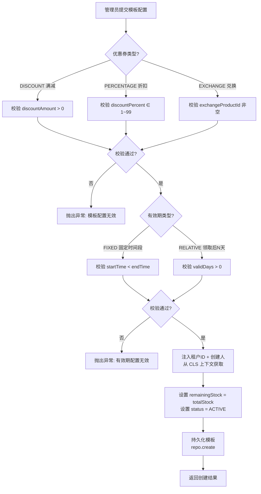
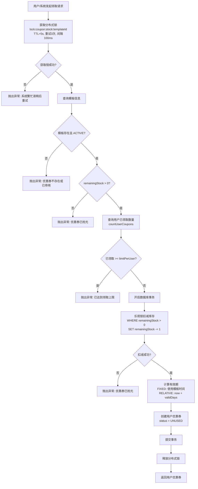
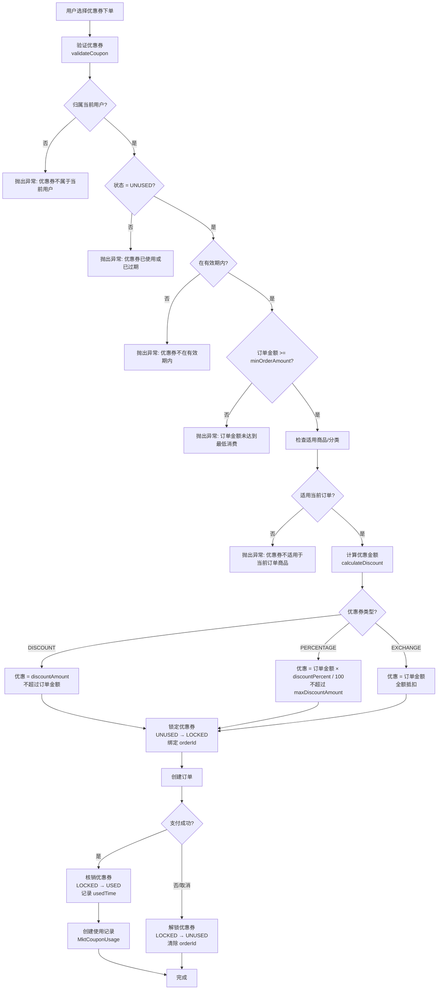
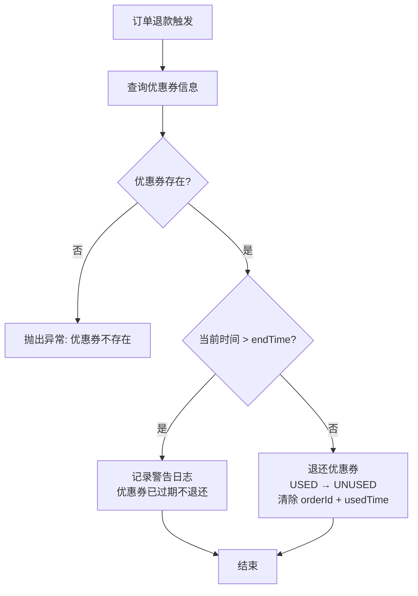
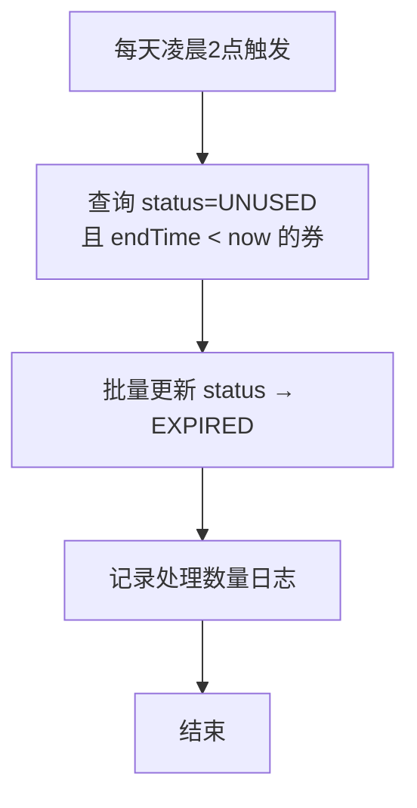
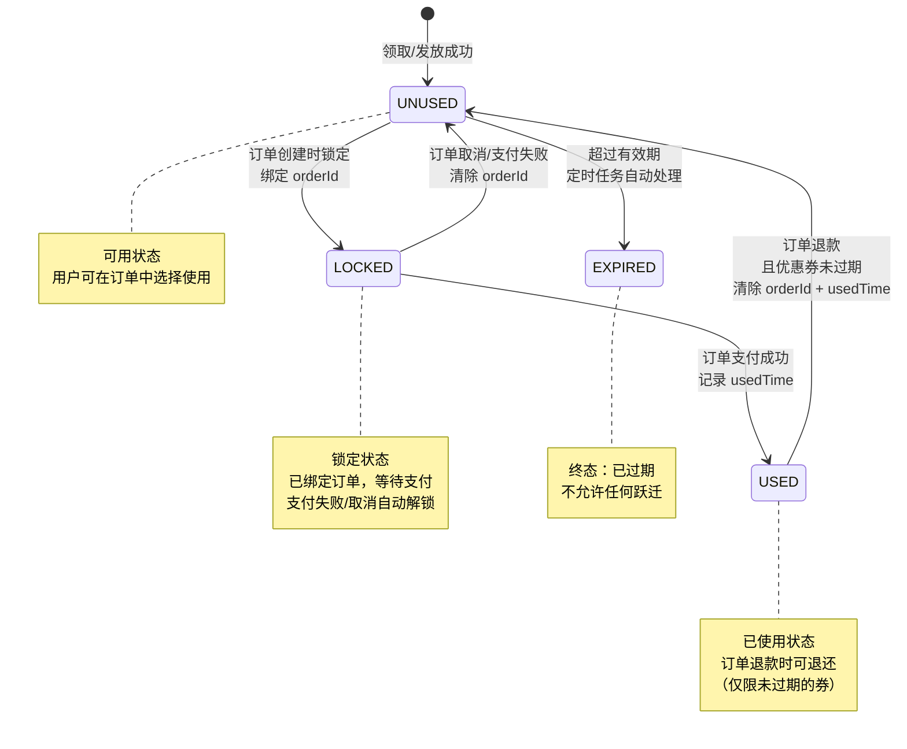

# 优惠券系统 — 需求文档

> 版本：1.0
> 日期：2026-02-22
> 模块路径：`src/module/marketing/coupon/`（template, distribution, usage, management, statistics, scheduler 六个子模块）
> 关联模块：`src/module/client/order`（订单支付回调）、`src/module/marketing/integration`（订单集成）、`src/module/pms`（商品关联）
> 状态：现状分析 + 演进规划

---

## 1. 概述

### 1.1 背景

优惠券系统是 Marketing 模块中独立于 MaaS 核心引擎的业务域，负责优惠券的全生命周期管理：模板定义 → 发放 → 使用 → 统计。系统通过 Redis 分布式锁保障高并发场景下的库存安全，通过定时任务处理过期券的自动清理。

当前系统支持 3 种优惠券类型、2 种有效期策略、3 种发放方式，覆盖满减、折扣、兑换三大核心场景。优惠券与订单系统通过 `marketing/integration` 桥接模块对接，在订单创建时锁定、支付时核销、取消时解锁、退款时退还。

核心子模块：

| 子模块       | 路径                   | 职责                                       | 核心类                       |
| ------------ | ---------------------- | ------------------------------------------ | ---------------------------- |
| template     | `coupon/template/`     | 模板中心：优惠券蓝图定义与配置校验         | `CouponTemplateService`      |
| distribution | `coupon/distribution/` | 发放中心：手动发放、用户领取、订单赠送     | `CouponDistributionService`  |
| usage        | `coupon/usage/`        | 使用中心：验证、计算、锁定、核销、退还     | `CouponUsageService`         |
| management   | `coupon/management/`   | 管理中心：用户券查询、使用记录、统计、导出 | `CouponManagementController` |
| statistics   | `coupon/statistics/`   | 统计中心：核销率、趋势分析、数据导出       | `CouponStatisticsService`    |
| scheduler    | `coupon/scheduler/`    | 调度中心：过期券自动清理                   | `CouponSchedulerService`     |

辅助组件：

| 组件                 | 路径                                     | 职责                           |
| -------------------- | ---------------------------------------- | ------------------------------ |
| RedisLockService     | `distribution/redis-lock.service.ts`     | 分布式锁封装：库存扣减并发控制 |
| UserCouponRepository | `distribution/user-coupon.repository.ts` | 用户券仓储：状态流转原子操作   |
| CouponErrorCode      | `constants/error-codes.ts`               | 错误码定义：4 类 20 个错误码   |

### 1.2 目标

1. 完整描述优惠券系统 6 个子模块的功能现状与数据流
2. 分析系统自身的代码缺陷与架构不足
3. 分析与外部模块（订单、商品、会员）的跨模块设计缺陷
4. 对标市面主流优惠券系统（有赞、美团、拼多多），识别功能差距
5. 提出演进建议和优先级排序

### 1.3 范围

| 在范围内                                                     | 不在范围内                               |
| ------------------------------------------------------------ | ---------------------------------------- |
| 优惠券模板 CRUD + 配置校验（template）                       | MaaS 核心引擎（`marketing/template` 等） |
| 手动发放 + 用户领取 + 订单赠送（distribution）               | 积分系统（`marketing/points`）           |
| 验证 + 计算 + 锁定 + 核销 + 退还（usage）                    | 订单集成桥接（`marketing/integration`）  |
| 用户券查询 + 使用记录 + 统计 + 导出（management/statistics） | 前端 Admin Web 页面                      |
| 过期券定时清理（scheduler）                                  | C 端优惠券展示页面                       |
| Redis 分布式锁（distribution/redis-lock）                    | 第三方优惠券对接                         |

---

## 2. 角色与用例

> 图 1：优惠券系统用例图

```mermaid
graph LR
    subgraph 角色
        PA[平台管理员]
        SA[门店管理员]
        MB[C端会员]
        SYS[系统调度器]
    end

    subgraph 模板管理 template
        UC1[创建优惠券模板]
        UC2[更新优惠券模板]
        UC3[查询模板列表<br/>含统计信息]
        UC4[查询模板详情<br/>含核销率]
        UC5[启用/停用模板]
        UC6[停用模板<br/>DELETE 软停用]
    end

    subgraph 发放管理 distribution
        UC7[手动批量发放<br/>指定用户列表]
        UC8[用户主动领取]
        UC9[订单赠送优惠券]
        UC10[检查领取资格]
    end

    subgraph 使用管理 usage
        UC11[查询可用优惠券<br/>按订单上下文过滤]
        UC12[验证优惠券可用性]
        UC13[计算优惠金额<br/>3种类型算法]
        UC14[锁定优惠券<br/>订单创建时]
        UC15[核销优惠券<br/>订单支付时]
        UC16[解锁优惠券<br/>订单取消时]
        UC17[退还优惠券<br/>订单退款时]
    end

    subgraph 统计管理 management
        UC18[查询用户券列表]
        UC19[查询使用记录<br/>含会员信息]
        UC20[查询统计概览<br/>含7日趋势]
        UC21[导出使用记录<br/>xlsx]
    end

    subgraph 系统自动化
        UC22[过期券自动清理<br/>每天凌晨2点]
    end

    subgraph 待建设功能
        UC25[优惠券叠加规则]
        UC26[优惠券分享/转赠]
        UC27[发放时间窗口控制]
        UC28[会员等级限制领取]
    end

    PA --> UC1
    PA --> UC2
    PA --> UC3
    PA --> UC4
    PA --> UC5
    PA --> UC6
    SA --> UC7

    MB --> UC8
    MB --> UC10
    MB --> UC11
    MB --> UC12

    SYS --> UC9
    SYS --> UC13
    SYS --> UC14
    SYS --> UC15
    SYS --> UC16
    SYS --> UC17

    SA --> UC18
    SA --> UC19
    SA --> UC20
    SA --> UC21

    SYS --> UC22

    PA -.-> UC25
    MB -.-> UC26
    PA -.-> UC27
    PA -.-> UC28

    style UC25 stroke-dasharray: 5 5
    style UC26 stroke-dasharray: 5 5
    style UC27 stroke-dasharray: 5 5
    style UC28 stroke-dasharray: 5 5
```

**角色说明**：

| 角色       | 职责                                              | 接口前缀                                                       |
| ---------- | ------------------------------------------------- | -------------------------------------------------------------- |
| 平台管理员 | 创建和管理优惠券模板，定义优惠规则和库存          | `admin/marketing/coupon/templates`                             |
| 门店管理员 | 手动发放优惠券给指定用户，查看统计数据            | `admin/marketing/coupon/distribute`                            |
| C 端会员   | 领取优惠券、在订单中使用优惠券                    | `client/marketing/coupon/*`（已有 Controller，部分端点待完善） |
| 系统调度器 | 定时清理过期券；订单流程中自动锁定/核销/解锁/退还 | 内部 Cron 任务 + Service 内部调用                              |

---

## 3. 业务流程

### 3.1 优惠券模板创建流程

> 图 2：优惠券模板创建活动图

### 3.2 优惠券领取流程（含分布式锁）

> 图 3：优惠券领取活动图

### 3.3 优惠券在订单中的使用流程

> 图 4：优惠券订单使用活动图

### 3.4 优惠券退还流程

> 图 5：优惠券退还活动图

### 3.5 过期券定时清理流程

> 图 6：过期券清理活动图

---

## 4. 状态说明

### 4.1 用户优惠券状态机

> 图 7：UserCoupon 状态图

**状态说明**：

| 状态    | 业务含义                             | 是否终态       | 允许跃迁到             |
| ------- | ------------------------------------ | -------------- | ---------------------- |
| UNUSED  | 未使用：用户可在订单中选择使用       | 否             | LOCKED, EXPIRED        |
| LOCKED  | 已锁定：已绑定订单，等待支付完成     | 否             | USED, UNUSED           |
| USED    | 已使用：订单支付成功后标记           | 否（允许退还） | UNUSED（退款且未过期） |
| EXPIRED | 已过期：超过有效期，定时任务自动标记 | 是             | 无                     |

### 4.2 优惠券模板状态

| 状态     | 含义                                         | 触发方式               |
| -------- | -------------------------------------------- | ---------------------- |
| ACTIVE   | 启用：可发放、可领取                         | 创建时默认 / 手动启用  |
| INACTIVE | 停用：不可发放、不可领取，已发放的券不受影响 | 手动停用 / DELETE 接口 |

---

## 5. 现有功能详述

### 5.1 接口清单

#### 5.1.1 优惠券模板（`coupon/template`）— 5 个端点

| 接口     | 方法   | 路径                                           | 权限  | 说明                                             |
| -------- | ------ | ---------------------------------------------- | ----- | ------------------------------------------------ |
| 模板列表 | GET    | `/admin/marketing/coupon/templates`            | ⚠️ 无 | 分页查询，含批量统计信息（发放数/使用数/核销率） |
| 模板详情 | GET    | `/admin/marketing/coupon/templates/:id`        | ⚠️ 无 | 单条查询，含统计信息                             |
| 创建模板 | POST   | `/admin/marketing/coupon/templates`            | ⚠️ 无 | 配置校验 + 租户注入 + 事务                       |
| 更新模板 | PUT    | `/admin/marketing/coupon/templates/:id`        | ⚠️ 无 | 已发放的模板禁止修改                             |
| 更新状态 | PATCH  | `/admin/marketing/coupon/templates/:id/status` | ⚠️ 无 | 启用/停用切换                                    |
| 停用模板 | DELETE | `/admin/marketing/coupon/templates/:id`        | ⚠️ 无 | 等同于设置 INACTIVE，非硬删除                    |

> 注：DELETE 端点实际调用 `deactivate`，与 PATCH status 功能重叠。

#### 5.1.2 优惠券发放（`coupon/distribution`）— 1 个端点

| 接口     | 方法 | 路径                                        | 权限  | 说明                                       |
| -------- | ---- | ------------------------------------------- | ----- | ------------------------------------------ |
| 手动发放 | POST | `/admin/marketing/coupon/distribute/manual` | ⚠️ 无 | 批量发放给指定用户列表，逐条处理含错误容忍 |

> 注：`claimCoupon`（用户领取）和 `grantByOrder`（订单赠送）为 Service 内部方法，无 HTTP 端点。

#### 5.1.3 优惠券管理（`coupon/management`）— 4 个端点

| 接口       | 方法 | 路径                                    | 权限  | 说明                                                  |
| ---------- | ---- | --------------------------------------- | ----- | ----------------------------------------------------- |
| 用户券列表 | GET  | `/admin/marketing/coupon/user-coupons`  | ⚠️ 无 | 分页查询，支持按用户/状态筛选                         |
| 使用记录   | GET  | `/admin/marketing/coupon/usage-records` | ⚠️ 无 | 分页查询，含会员信息 JOIN                             |
| 统计数据   | GET  | `/admin/marketing/coupon/statistics`    | ⚠️ 无 | 传 templateId 返回核销率；不传返回全局概览含 7 日趋势 |
| 导出记录   | GET  | `/admin/marketing/coupon/export`        | ⚠️ 无 | 导出 xlsx 文件流                                      |

#### 5.1.4 内部服务方法（无 HTTP 端点）

| 服务                        | 方法                                               | 说明                              |
| --------------------------- | -------------------------------------------------- | --------------------------------- |
| `CouponDistributionService` | `claimCoupon(memberId, templateId)`                | 用户领取优惠券（分布式锁 + 事务） |
| `CouponDistributionService` | `grantByOrder(orderId, templateIds)`               | 订单赠送优惠券（批量，错误容忍）  |
| `CouponDistributionService` | `checkEligibility(memberId, templateId)`           | 检查领取资格                      |
| `CouponUsageService`        | `findAvailableCoupons(memberId, orderContext)`     | 查询可用优惠券                    |
| `CouponUsageService`        | `validateCoupon(userCouponId, orderContext)`       | 验证优惠券可用性                  |
| `CouponUsageService`        | `calculateDiscount(userCouponId, orderAmount)`     | 计算优惠金额                      |
| `CouponUsageService`        | `lockCoupon(userCouponId, orderId)`                | 锁定优惠券                        |
| `CouponUsageService`        | `useCoupon(userCouponId, orderId, discountAmount)` | 核销优惠券                        |
| `CouponUsageService`        | `unlockCoupon(userCouponId)`                       | 解锁优惠券                        |
| `CouponUsageService`        | `refundCoupon(userCouponId)`                       | 退还优惠券                        |

### 5.2 优惠券类型

| 类型代码   | 名称   | 优惠算法                           | 关键字段                                                       |
| ---------- | ------ | ---------------------------------- | -------------------------------------------------------------- |
| DISCOUNT   | 满减券 | 固定减免 `discountAmount`          | `discountAmount`（减免金额）、`minOrderAmount`（最低消费）     |
| PERCENTAGE | 折扣券 | 订单金额 × `discountPercent` / 100 | `discountPercent`（1~99）、`maxDiscountAmount`（最高优惠上限） |
| EXCHANGE   | 兑换券 | 全额抵扣（优惠 = 订单金额）        | `exchangeProductId`（关联商品）                                |

### 5.3 有效期策略

| 策略代码 | 名称        | 计算方式                             |
| -------- | ----------- | ------------------------------------ |
| FIXED    | 固定时间段  | 使用模板的 `startTime` ~ `endTime`   |
| RELATIVE | 领取后 N 天 | 领取时刻 ~ 领取时刻 + `validDays` 天 |

### 5.4 发放方式

| 方式代码 | 名称     | 触发方式                   | 并发控制          |
| -------- | -------- | -------------------------- | ----------------- |
| MANUAL   | 手动发放 | 管理员指定用户列表批量发放 | 分布式锁（逐条）  |
| ACTIVITY | 活动领取 | 用户主动领取               | 分布式锁 + 乐观锁 |
| ORDER    | 订单赠送 | 订单支付成功后自动赠送     | 分布式锁（逐条）  |

---

## 6. 现有逻辑不足分析

### 6.1 优惠券系统自身缺陷

| 编号 | 问题                                                   | 严重度 | 子模块       | 详述                                                                                                                                                                                      |
| ---- | ------------------------------------------------------ | ------ | ------------ | ----------------------------------------------------------------------------------------------------------------------------------------------------------------------------------------- | --- | ------------------ | --- | -------------------------------------------------------------------------------- |
| D-1  | 所有 Controller 缺少 `@ApiBearerAuth`                  | 🟡 P1  | 全部         | `CouponTemplateController`、`CouponDistributionController`、`CouponManagementController` 均缺少 `@ApiBearerAuth('Authorization')` 装饰器，Swagger 文档不显示认证要求。                    |
| D-2  | 所有 Controller 缺少 `@RequirePermission`              | 🔴 P0  | 全部         | 10 个端点均无权限控制装饰器，任何已登录用户可执行所有操作（含手动发放、导出等敏感操作）。                                                                                                 |
| D-3  | 所有写操作缺少 `@Operlog`                              | 🟡 P1  | 全部         | 创建模板、更新模板、手动发放、状态变更等写操作未记录操作日志，无法审计追踪。                                                                                                              |
| D-4  | 错误码定义但未使用                                     | 🟡 P1  | 全部         | `CouponErrorCode` 定义了 20 个错误码和对应消息，但所有 Service 中使用硬编码字符串抛出异常（如 `'优惠券模板不存在'`），错误码体系形同虚设。                                                |
| D-5  | 定时任务无分布式锁                                     | 🟡 P1  | scheduler    | `CouponSchedulerService.cleanExpiredCoupons` 无分布式锁，多实例部署时同一批过期券可能被多个节点同时处理，导致重复更新。                                                                   |
| D-6  | 定时任务 catch 不安全                                  | 🟢 P2  | scheduler    | `catch (error)` 直接传递 `error` 给 `logger.error`，未使用 `getErrorMessage(error)` 安全提取错误信息，违反后端规范 §2.1。                                                                 |
| D-7  | 统计概览 7 日趋势 N+1 查询                             | 🟡 P1  | statistics   | `getLast7DaysTrend` 循环 7 天，每天执行 2 次 `count` 查询（共 14 次 DB 查询），应改为单次聚合查询。                                                                                       |
| D-8  | 导出无数量限制                                         | 🟡 P1  | statistics   | `exportUsageRecords` 使用 `findMany` 无分页限制，大数据量时可能导致内存溢出。违反后端规范 §10.5「单接口返回 > 1000 条须分页或异步」。                                                     |
| D-9  | 手动发放无总量限制                                     | 🟢 P2  | distribution | `distributeManually` 接受任意长度的 `memberIds` 数组，无上限校验。大批量发放时可能导致长事务和锁竞争。                                                                                    |
| D-10 | `grantByOrder` 直接查询 `omsOrder` 表                  | 🟡 P1  | distribution | `CouponDistributionService.grantByOrder` 直接 `prisma.omsOrder.findUnique`，跨模块直接访问订单表，违反模块边界。应通过 `OrderService` 或事件驱动。                                        |
| D-11 | `useCoupon` 中 `getOrderAmount` 直接查询 `omsOrder` 表 | 🟡 P1  | usage        | `CouponUsageService.getOrderAmount` 直接 `prisma.omsOrder.findUnique`，同 D-10，跨模块直接访问订单表。                                                                                    |
| D-12 | DELETE 与 PATCH status 功能重叠                        | 🟢 P2  | template     | `DELETE /templates/:id` 调用 `deactivate` 等同于 `PATCH /templates/:id/status { status: 'INACTIVE' }`，语义混淆。RESTful 规范中 DELETE 应表示删除资源。                                   |
| D-13 | 模板更新校验不完整                                     | 🟢 P2  | template     | `update` 方法仅在部分字段变更时触发校验（`dto.type                                                                                                                                        |     | dto.discountAmount |     | ...`），遗漏了 `minOrderAmount`、`totalStock`、`limitPerUser` 等字段的变更校验。 |
| D-14 | `findAvailableCoupons` 适用性检查依赖模板关联字段      | 🟢 P2  | usage        | `isApplicableToOrder` 检查 `coupon.applicableProducts` 和 `coupon.applicableCategories`，但这些字段存储在模板表而非用户券表，需要 JOIN 查询才能获取，当前实现可能因字段缺失导致过滤失效。 |

### 6.2 跨模块缺陷

| 编号 | 问题                                        | 严重度 | 涉及模块             | 详述                                                                                                                                                                                                                                                                                                                                   |
| ---- | ------------------------------------------- | ------ | -------------------- | -------------------------------------------------------------------------------------------------------------------------------------------------------------------------------------------------------------------------------------------------------------------------------------------------------------------------------------- |
| X-1  | 直接访问 `omsOrder` 表                      | 🟡 P1  | coupon → order       | `distribution.service.ts` 和 `usage.service.ts` 均直接 `prisma.omsOrder.findUnique`，绕过订单模块的 Service 层，违反模块边界原则。                                                                                                                                                                                                     |
| X-2  | C 端 Controller 规范不完整                  | 🟡 P1  | coupon → client      | `client/marketing/coupon/` 下已有 `ClientCouponController`（claim、available、my-coupons 3 个端点），但存在以下问题：(1) 缺少 `@ApiBearerAuth('Authorization')` 装饰器；(2) 缺少 `/** @tenantScope TenantScoped */` JSDoc 注解；(3) `available` 端点返回硬编码占位（`功能开发中`），未对接 `CouponUsageService.findAvailableCoupons`。 |
| X-3  | 统计服务直接查询 `umsMember` 表             | 🟢 P2  | statistics → ums     | `getUsageRecords` 直接 `prisma.umsMember.findMany` 查询会员信息，应通过 `MemberService` 获取。                                                                                                                                                                                                                                         |
| X-4  | 与 `marketing/integration` 的对接方式不明确 | 🟡 P1  | coupon → integration | `CouponUsageService` 提供了完整的锁定/核销/解锁/退还方法，但 `marketing/integration` 如何调用这些方法、调用时机、错误处理策略未在代码中体现。                                                                                                                                                                                          |
| X-5  | 库存扣减未使用 Redis 原子操作               | 🟡 P1  | distribution → redis | 与 MaaS 的 `MarketingStockService`（Redis Lua 原子扣减）不同，优惠券库存扣减使用「分布式锁 + 数据库乐观锁」双重机制。虽然安全，但锁粒度为整个模板（`lock:coupon:stock:templateId`），高并发时锁竞争严重，吞吐量受限。                                                                                                                  |

### 6.3 架构层面不足

| 编号 | 问题              | 详述                                                                                                                   |
| ---- | ----------------- | ---------------------------------------------------------------------------------------------------------------------- |
| A-1  | 无优惠券叠加规则  | 当前系统不支持多张优惠券叠加使用，也无互斥规则定义。市面主流系统均支持「满减+折扣可叠加，同类互斥」等规则。            |
| A-2  | 无发放时间窗口    | 模板无「可领取时间段」字段，无法实现「限时抢券」场景。当前仅有有效期控制（领取后的使用时间），缺少领取时间控制。       |
| A-3  | 无会员等级限制    | 模板有 `memberLevels` 字段但发放流程未校验，任何会员均可领取。                                                         |
| A-4  | 无优惠券分享/转赠 | 不支持用户间转赠优惠券，缺少社交裂变能力。                                                                             |
| A-5  | 无批量操作        | 不支持批量启用/停用模板、批量删除过期模板等操作。                                                                      |
| A-6  | 无优惠券使用提醒  | 优惠券即将过期时无通知机制，用户可能错过使用时机。                                                                     |
| A-7  | 无事件驱动        | 优惠券的领取、使用、过期等关键节点未发送事件，下游系统（如统计、通知）无法实时感知。与 MaaS 引擎的事件驱动架构不一致。 |
| A-8  | 统计维度单一      | 仅有核销率和 7 日趋势，缺少按门店、按类型、按时段的多维分析，缺少 ROI（优惠金额 vs 带来的订单增量）分析。              |
| A-9  | 无优惠券预算控制  | 无总预算上限和单日发放上限，运营无法控制优惠券的总成本。                                                               |

---

## 7. 市面主流优惠券系统对标

### 7.1 功能对比矩阵

| 功能                             | 本系统               | 有赞优惠券 | 美团商家版 | 拼多多商家后台 | 差距评估     |
| -------------------------------- | -------------------- | ---------- | ---------- | -------------- | ------------ |
| 3 种优惠券类型（满减/折扣/兑换） | ✅                   | ✅         | ✅         | ✅             | 持平         |
| 2 种有效期策略（固定/相对）      | ✅                   | ✅         | ✅         | ✅             | 持平         |
| 分布式锁防超发                   | ✅                   | ✅         | ✅         | ✅             | 持平         |
| 乐观锁库存扣减                   | ✅                   | ✅         | ✅         | ✅             | 持平         |
| 订单锁定/核销/解锁/退还          | ✅                   | ✅         | ✅         | ✅             | 持平         |
| 适用商品/分类限制                | ✅                   | ✅         | ✅         | ✅             | 持平         |
| 每人限领控制                     | ✅                   | ✅         | ✅         | ✅             | 持平         |
| 统计概览 + 7 日趋势              | ✅                   | ✅         | ✅         | ✅             | 持平         |
| 使用记录导出                     | ✅                   | ✅         | ✅         | ✅             | 持平         |
| 权限控制                         | ❌                   | ✅         | ✅         | ✅             | 缺失（P0）   |
| 操作日志审计                     | ❌                   | ✅         | ✅         | ✅             | 缺失（P1）   |
| C 端专用接口                     | 有（部分端点待完善） | ✅         | ✅         | ✅             | 部分（P1）   |
| 优惠券叠加规则                   | ❌                   | ✅         | ✅         | ✅             | 缺失（P1）   |
| 发放时间窗口（限时抢券）         | ❌                   | ✅         | ✅         | ✅             | 缺失（P1）   |
| 会员等级限制                     | ❌                   | ✅         | ✅         | ❌             | 缺失（P2）   |
| 优惠券分享/转赠                  | ❌                   | ✅         | ❌         | ✅             | 缺失（低优） |
| 批量操作                         | ❌                   | ✅         | ✅         | ✅             | 缺失（P2）   |
| 即将过期提醒                     | ❌                   | ✅         | ✅         | ❌             | 缺失（P2）   |
| 事件驱动                         | ❌                   | ✅         | ✅         | ✅             | 缺失（P1）   |
| 多维统计分析                     | ❌                   | ✅         | ✅         | ✅             | 缺失（P2）   |
| 预算控制                         | ❌                   | ✅         | ✅         | ❌             | 缺失（P2）   |
| Redis Lua 原子库存扣减           | ❌                   | ✅         | ✅         | ✅             | 缺失（P2）   |
| 优惠券码（兑换码）               | ❌                   | ✅         | ❌         | ✅             | 缺失（低优） |

### 7.2 差距总结

本系统在优惠券核心流程（模板 → 发放 → 使用 → 退还）上功能完整，分布式锁 + 乐观锁的双重并发控制方案安全可靠。主要差距集中在：

1. 安全基线缺失（P0）：10 个端点无权限控制，任何登录用户可执行手动发放等敏感操作
2. 架构规范偏离（P1）：C 端接口装饰器不规范且 available 端点未实现、跨模块直接访问订单表、错误码未使用
3. 运营能力不足（P1）：无叠加规则、无发放时间窗口、无事件驱动
4. 性能瓶颈（P2）：库存锁粒度过粗（模板级）、统计 N+1 查询、导出无限制

---

## 8. 验收标准

### 8.1 现有功能验收

| 编号  | 验收条件                                                                | 状态      |
| ----- | ----------------------------------------------------------------------- | --------- |
| AC-1  | 创建满减券时校验 `discountAmount > 0`                                   | ✅ 已通过 |
| AC-2  | 创建折扣券时校验 `discountPercent ∈ [1, 99]`                            | ✅ 已通过 |
| AC-3  | 创建兑换券时校验 `exchangeProductId` 非空                               | ✅ 已通过 |
| AC-4  | FIXED 有效期校验 `startTime < endTime`                                  | ✅ 已通过 |
| AC-5  | RELATIVE 有效期校验 `validDays > 0`                                     | ✅ 已通过 |
| AC-6  | 已发放的模板禁止修改（`hasDistributed` 检查）                           | ✅ 已通过 |
| AC-7  | 领取时分布式锁保障并发安全（TTL=5s, 重试 3 次）                         | ✅ 已通过 |
| AC-8  | 领取时乐观锁扣减库存（`WHERE remainingStock > 0`）                      | ✅ 已通过 |
| AC-9  | 领取时校验每人限领数量（`limitPerUser`）                                | ✅ 已通过 |
| AC-10 | FIXED 有效期使用模板时间，RELATIVE 有效期使用领取时刻 + validDays       | ✅ 已通过 |
| AC-11 | 锁定优惠券：UNUSED → LOCKED，绑定 orderId                               | ✅ 已通过 |
| AC-12 | 核销优惠券：LOCKED → USED，记录 usedTime，创建使用记录                  | ✅ 已通过 |
| AC-13 | 解锁优惠券：LOCKED → UNUSED，清除 orderId                               | ✅ 已通过 |
| AC-14 | 退还优惠券：USED → UNUSED（仅限未过期），清除 orderId + usedTime        | ✅ 已通过 |
| AC-15 | 满减券优惠 = discountAmount，不超过订单金额                             | ✅ 已通过 |
| AC-16 | 折扣券优惠 = 订单金额 × discountPercent / 100，不超过 maxDiscountAmount | ✅ 已通过 |
| AC-17 | 兑换券优惠 = 订单金额（全额抵扣）                                       | ✅ 已通过 |
| AC-18 | 定时任务每天凌晨 2 点清理过期券（UNUSED + endTime < now → EXPIRED）     | ✅ 已通过 |
| AC-19 | 模板列表含批量统计信息（发放数/使用数/核销率）                          | ✅ 已通过 |
| AC-20 | 统计概览含 7 日趋势数据                                                 | ✅ 已通过 |
| AC-21 | 使用记录导出为 xlsx 文件                                                | ✅ 已通过 |

### 8.2 待修复验收

| 编号  | 验收条件                                                                                                | 状态      | 对应缺陷        |
| ----- | ------------------------------------------------------------------------------------------------------- | --------- | --------------- |
| AC-22 | 所有 Controller 添加 `@ApiBearerAuth` 和 `@RequirePermission`                                           | ❌ 未实现 | D-1, D-2        |
| AC-23 | 所有写操作添加 `@Operlog` 装饰器                                                                        | ❌ 未实现 | D-3             |
| AC-24 | Service 中使用 `CouponErrorCode` 替代硬编码字符串                                                       | ❌ 未实现 | D-4             |
| AC-25 | 定时任务添加分布式锁防止多实例重复处理                                                                  | ❌ 未实现 | D-5             |
| AC-26 | 7 日趋势改为单次聚合查询（消除 N+1）                                                                    | ❌ 未实现 | D-7             |
| AC-27 | 导出接口添加数量限制（最大 10000 条或异步导出）                                                         | ❌ 未实现 | D-8             |
| AC-28 | 消除对 `omsOrder` 表的直接访问                                                                          | ❌ 未实现 | D-10, D-11, X-1 |
| AC-29 | C 端 Controller 添加 `@ApiBearerAuth`、`@tenantScope` 注解，`available` 端点对接 `findAvailableCoupons` | ❌ 未实现 | X-2             |

---

## 9. 演进建议与待办

### 9.1 第一阶段：安全基线 + 核心修复（1-2 周）

| 编号 | 任务                                                         | 对应缺陷             | 预估工时 |
| ---- | ------------------------------------------------------------ | -------------------- | -------- |
| T-1  | 所有 Controller 添加 `@ApiBearerAuth` + `@RequirePermission` | D-1, D-2             | 2h       |
| T-2  | 所有写操作添加 `@Operlog`                                    | D-3                  | 1h       |
| T-3  | Service 中统一使用 `CouponErrorCode` + `CouponErrorMessages` | D-4                  | 3h       |
| T-4  | 定时任务添加分布式锁                                         | D-5                  | 1h       |
| T-5  | 定时任务 catch 使用 `getErrorMessage`                        | D-6                  | 0.5h     |
| T-6  | 消除对 `omsOrder` 和 `umsMember` 的直接访问                  | D-10, D-11, X-1, X-3 | 2h       |

### 9.2 第二阶段：架构规范对齐（2-3 周）

| 编号 | 任务                                                                               | 对应缺陷 | 预估工时 |
| ---- | ---------------------------------------------------------------------------------- | -------- | -------- |
| T-7  | C 端 Controller 规范化（`@ApiBearerAuth` + `@tenantScope` + `available` 端点实现） | X-2      | 0.5d     |
| T-8  | 7 日趋势改为单次聚合查询                                                           | D-7      | 0.5d     |
| T-9  | 导出接口添加数量限制 + 异步导出方案                                                | D-8      | 1d       |
| T-10 | 手动发放添加批量上限（如 500 人）                                                  | D-9      | 0.5h     |
| T-11 | 添加事件驱动（领取/使用/过期事件）                                                 | A-7      | 2d       |
| T-12 | 明确与 `marketing/integration` 的对接契约                                          | X-4      | 1d       |

### 9.3 第三阶段：运营能力增强（1-2 月）

| 编号 | 任务                                         | 对应缺陷 | 预估工时 |
| ---- | -------------------------------------------- | -------- | -------- |
| T-13 | 优惠券叠加规则引擎                           | A-1      | 3-5d     |
| T-14 | 发放时间窗口（限时抢券）                     | A-2      | 1-2d     |
| T-15 | 会员等级限制领取（集成 `memberLevels` 校验） | A-3      | 1d       |
| T-16 | 多维统计分析（按门店/类型/时段）             | A-8      | 3-5d     |
| T-17 | 预算控制（总预算 + 单日上限）                | A-9      | 2-3d     |

### 9.4 第四阶段：体验优化（3-6 月）

| 编号 | 任务                                            | 说明                |
| ---- | ----------------------------------------------- | ------------------- |
| T-18 | Redis Lua 原子库存扣减（替代分布式锁 + 乐观锁） | 提升高并发吞吐量    |
| T-19 | 优惠券即将过期提醒                              | 到期前 N 天推送通知 |
| T-20 | 批量操作（启用/停用/删除）                      | 提升管理效率        |
| T-21 | 优惠券分享/转赠                                 | 社交裂变能力        |
| T-22 | 优惠券码（兑换码）                              | 线下推广场景        |
| T-23 | DELETE 端点语义修正（真正的软删除或移除）       | D-12                |
