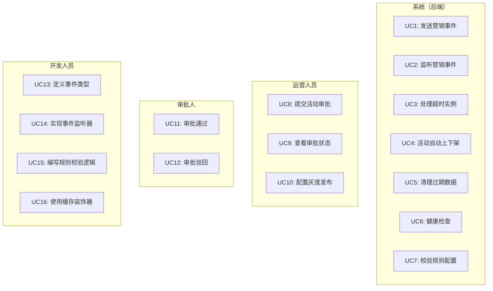
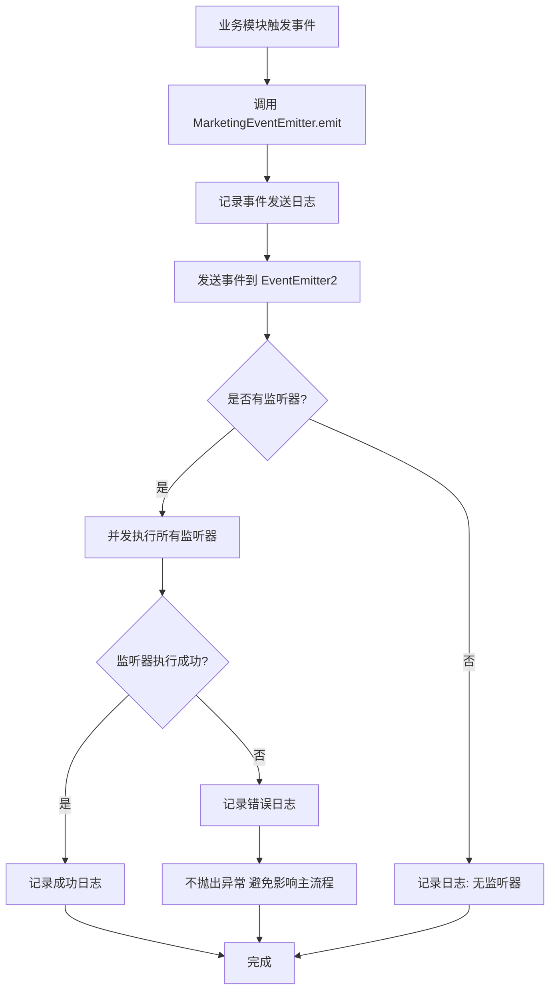
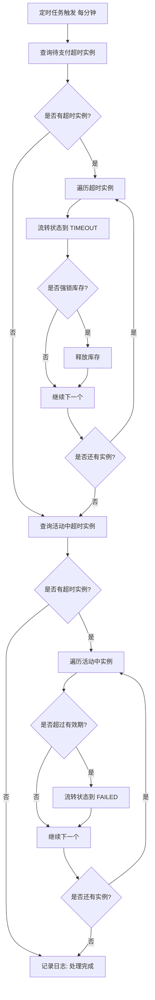
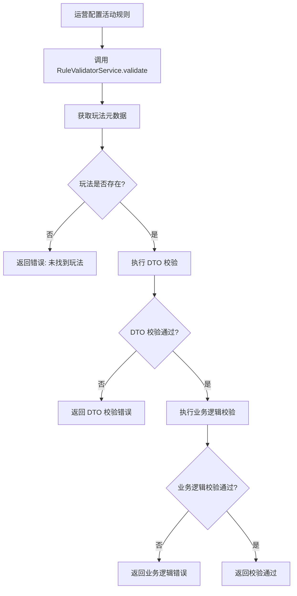
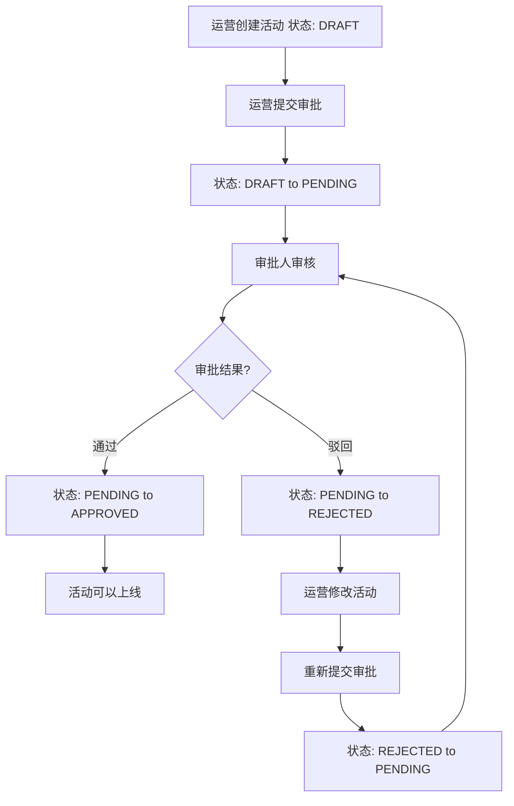
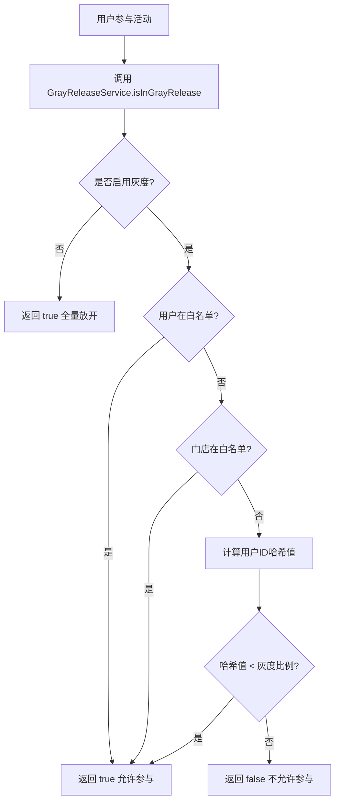
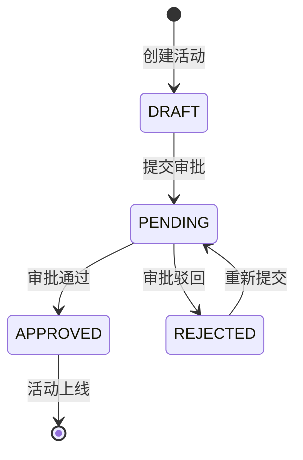

# 营销基础设施层 — 需求文档

> 版本：1.0
> 日期：2026-02-22
> 模块路径：`src/module/marketing/events/`, `src/module/marketing/scheduler/`, `src/module/marketing/rule/`, `src/module/marketing/approval/`, `src/module/marketing/gray/`, `src/module/marketing/common/`
> 设计文档：[infra-design.md](../../../design/marketing/infra/infra-design.md)
> 状态：现状分析 + 改进建议

---

## 1. 概述

### 1.1 背景

营销基础设施层是 Marketing 模块的支撑层，为核心引擎层（MaaS 平台）和独立业务域（优惠券、积分、订单集成）提供通用能力。包含 6 个子模块：

| 子模块    | 职责                                   | 复杂度 | 代码文件数 |
| --------- | -------------------------------------- | ------ | ---------- |
| events    | 事件驱动：营销事件发布/监听            | 低     | 5          |
| scheduler | 生命周期调度：活动自动上下架、超时处理 | 低     | 2          |
| rule      | 规则校验：运营配置合法性校验           | 低     | 4          |
| approval  | 审批流：活动上线审核                   | 低     | 3          |
| gray      | 灰度发布：按比例/白名单控制            | 低     | 3          |
| common    | 公共工具：缓存装饰器等                 | 低     | 1          |

### 1.2 目标

1. 提供统一的事件驱动机制，解耦模块依赖
2. 自动化活动生命周期管理，减少人工干预
3. 提前校验运营配置，降低线上故障率
4. 支持活动审批流程，规范上线流程
5. 支持灰度发布，降低新功能上线风险
6. 提供通用工具，提升开发效率

### 1.3 范围

本文档覆盖基础设施层的 6 个子模块，包括：

- 事件类型定义、事件发送、事件监听
- 定时任务：超时实例处理、活动自动上下架、数据归档、健康检查
- 规则校验：DTO 校验、业务逻辑校验、表单 Schema 生成
- 审批流程：提交审批、审批通过、审批驳回、状态查询
- 灰度发布：白名单控制、按比例灰度、哈希算法
- 缓存装饰器：方法级缓存、缓存失效

---

## 2. 角色与用例

### 2.1 角色定义

| 角色     | 说明         | 权限                                           |
| -------- | ------------ | ---------------------------------------------- |
| 系统     | 后端系统自身 | 发送事件、执行定时任务、校验规则               |
| 运营人员 | 配置营销活动 | 创建活动、提交审批、查看审批状态               |
| 审批人   | 审核活动配置 | 审批通过、审批驳回                             |
| 开发人员 | 扩展营销玩法 | 定义事件类型、实现事件监听器、编写规则校验逻辑 |

### 2.2 用例图

> 图 1：营销基础设施层用例图



---

## 3. 业务流程

### 3.1 事件驱动流程

> 图 2：营销事件发送与监听活动图



**关键设计**：

1. 事件发送失败不影响主流程：捕获异常并记录日志，不抛出
2. 支持同步和异步发送：`emit`（同步）和 `emitAsync`（异步）
3. 批量发送：`emitBatch` 并发发送多个事件

### 3.2 定时任务流程

> 图 3：超时实例处理活动图



**关键设计**：

1. 批量处理：每次最多处理 100 条，防止长时间阻塞
2. 异常隔离：单个实例处理失败不影响其他实例
3. 库存释放：超时后自动释放强锁库存

### 3.3 规则校验流程

> 图 4：规则校验活动图



**关键设计**：

1. 两层校验：DTO 校验（class-validator）+ 业务逻辑校验（Strategy.validateConfig）
2. 提前发现错误：运营配置时即校验，避免线上故障
3. 清晰的错误提示：返回字段名和错误描述

### 3.4 审批流程

> 图 5：活动审批流程活动图



**关键设计**：

1. 状态机：DRAFT → PENDING → APPROVED/REJECTED
2. 可重新提交：REJECTED → PENDING
3. 驳回必须说明原因：remark 字段必填

### 3.5 灰度发布流程

> 图 6：灰度发布判断活动图



**关键设计**：

1. 优先级：未启用 > 用户白名单 > 门店白名单 > 按比例灰度
2. 哈希算法：MD5 哈希 + 取模，确保稳定性
3. 灰度比例：0-100，表示允许参与的用户百分比

---

## 4. 状态说明

### 4.1 审批状态机

> 图 7：活动审批状态机



**状态说明**：

| 状态     | 说明                       | 允许操作           |
| -------- | -------------------------- | ------------------ |
| DRAFT    | 草稿状态，运营正在编辑配置 | 编辑、提交审批     |
| PENDING  | 待审批状态，已提交等待审批 | 审批通过、审批驳回 |
| APPROVED | 已通过状态，审批人已批准   | 上线活动           |
| REJECTED | 已驳回状态，审批人拒绝     | 修改、重新提交     |

---

## 5. 现有功能详述

### 5.1 事件系统（events）

#### 5.1.1 事件类型

| 事件类型            | 触发时机                                       | 用途                                         |
| ------------------- | ---------------------------------------------- | -------------------------------------------- |
| INSTANCE_CREATED    | 用户参与活动，创建实例成功后                   | 记录用户参与行为、触发数据分析               |
| INSTANCE_PAID       | 用户完成支付，实例状态从 PENDING_PAY 变为 PAID | 触发后续业务逻辑（如拼团检查、权益发放准备） |
| INSTANCE_SUCCESS    | 活动条件达成，实例状态变为 SUCCESS             | 发放权益、结算资金、发送通知、记录成功数据   |
| INSTANCE_FAILED     | 活动条件未达成，实例状态变为 FAILED            | 触发退款流程、发送失败通知、记录失败原因     |
| INSTANCE_TIMEOUT    | 实例超过有效期，状态变为 TIMEOUT               | 释放库存、触发退款、发送超时通知             |
| INSTANCE_REFUNDED   | 用户申请退款或系统自动退款，状态变为 REFUNDED  | 处理退款逻辑、发送退款通知、更新财务数据     |
| GROUP_FULL          | 拼团人数达到要求                               | 触发拼团成功逻辑、通知所有参团用户           |
| GROUP_FAILED        | 拼团超时未满员                                 | 触发退款流程、通知所有参团用户               |
| FLASH_SALE_SOLD_OUT | 秒杀商品库存为0                                | 关闭秒杀活动、更新前端展示                   |
| COURSE_OPEN         | 拼班课程人数达到开班要求                       | 通知所有学员、安排课程、发放学习资料         |

#### 5.1.2 事件发送方法

| 方法                        | 说明                             | 同步/异步 |
| --------------------------- | -------------------------------- | --------- |
| `emit(event)`               | 发送事件，等待所有监听器处理完成 | 同步      |
| `emitAsync(event)`          | 发送事件，不等待监听器处理完成   | 异步      |
| `emitBatch(events)`         | 批量发送多个事件                 | 异步      |
| `emitInstanceCreated(...)`  | 便捷方法：发送实例创建事件       | 同步      |
| `emitInstancePaid(...)`     | 便捷方法：发送实例支付成功事件   | 同步      |
| `emitInstanceSuccess(...)`  | 便捷方法：发送实例成功事件       | 同步      |
| `emitInstanceFailed(...)`   | 便捷方法：发送实例失败事件       | 同步      |
| `emitInstanceTimeout(...)`  | 便捷方法：发送实例超时事件       | 同步      |
| `emitInstanceRefunded(...)` | 便捷方法：发送实例退款事件       | 同步      |

### 5.2 定时任务（scheduler）

#### 5.2.1 任务清单

| 任务                   | 执行频率    | 说明                                                         |
| ---------------------- | ----------- | ------------------------------------------------------------ |
| handleTimeoutInstances | 每分钟      | 处理超时实例：待支付超时（30分钟）、活动中超时（根据有效期） |
| handleActivityStatus   | 每小时      | 活动自动上下架：到达开始时间自动上架、到达结束时间自动下架   |
| cleanupExpiredData     | 每天凌晨2点 | 清理过期数据：归档30天前的终态实例                           |
| healthCheck            | 每5分钟     | 健康检查：统计各状态实例数量、检查异常堆积                   |

#### 5.2.2 超时处理规则

| 状态        | 超时条件                          | 处理方式                     |
| ----------- | --------------------------------- | ---------------------------- |
| PENDING_PAY | 创建时间超过30分钟                | 流转到 TIMEOUT，释放强锁库存 |
| ACTIVE      | 创建时间超过活动有效期（默认7天） | 流转到 FAILED                |

### 5.3 规则校验（rule）

#### 5.3.1 校验层级

| 层级         | 说明                                | 实现方式                         |
| ------------ | ----------------------------------- | -------------------------------- |
| DTO 校验     | 基于 class-validator 装饰器自动校验 | `validate(dtoInstance)`          |
| 业务逻辑校验 | 调用策略的 validateConfig 方法      | `strategy.validateConfig(rules)` |

#### 5.3.2 支持的装饰器

| 装饰器      | 用途       | 示例                             |
| ----------- | ---------- | -------------------------------- |
| @IsNotEmpty | 必填字段   | `@IsNotEmpty() price: number;`   |
| @IsOptional | 可选字段   | `@IsOptional() remark?: string;` |
| @IsNumber   | 数字类型   | `@IsNumber() minCount: number;`  |
| @IsString   | 字符串类型 | `@IsString() name: string;`      |
| @IsBoolean  | 布尔类型   | `@IsBoolean() enabled: boolean;` |
| @IsArray    | 数组类型   | `@IsArray() items: string[];`    |
| @Min        | 最小值     | `@Min(0) price: number;`         |
| @Max        | 最大值     | `@Max(100) percentage: number;`  |
| @MinLength  | 最小长度   | `@MinLength(1) name: string;`    |
| @MaxLength  | 最大长度   | `@MaxLength(50) name: string;`   |

### 5.4 审批流（approval）

#### 5.4.1 审批方法

| 方法              | 说明             | 前置条件                         | 状态变更                 |
| ----------------- | ---------------- | -------------------------------- | ------------------------ |
| submitApproval    | 提交审批         | 状态为 DRAFT 或 REJECTED         | DRAFT/REJECTED → PENDING |
| approve           | 审批通过         | 状态为 PENDING                   | PENDING → APPROVED       |
| reject            | 审批驳回         | 状态为 PENDING，必须提供驳回原因 | PENDING → REJECTED       |
| getApprovalStatus | 查询审批状态     | 无                               | 无                       |
| canPublish        | 检查是否可以上线 | 无                               | 无                       |

#### 5.4.2 审批记录

| 字段         | 说明           | 类型                                  |
| ------------ | -------------- | ------------------------------------- |
| status       | 审批状态       | DRAFT / PENDING / APPROVED / REJECTED |
| approver     | 审批人ID       | string                                |
| approvalTime | 审批时间       | Date                                  |
| remark       | 审批意见/备注  | string                                |
| submitTime   | 提交审批的时间 | Date                                  |
| submitter    | 提交人ID       | string                                |

### 5.5 灰度发布（gray）

#### 5.5.1 灰度配置

| 字段              | 说明              | 类型     | 默认值 |
| ----------------- | ----------------- | -------- | ------ |
| enabled           | 是否启用灰度发布  | boolean  | false  |
| whitelistUserIds  | 白名单用户ID列表  | string[] | []     |
| whitelistStoreIds | 白名单门店ID列表  | string[] | []     |
| percentage        | 灰度比例（0-100） | number   | 0      |

#### 5.5.2 灰度判断方法

| 方法               | 说明                     | 返回值            |
| ------------------ | ------------------------ | ----------------- |
| isInGrayRelease    | 检查用户是否在灰度范围内 | boolean           |
| getGrayConfig      | 获取活动的灰度配置       | GrayReleaseConfig |
| validateGrayConfig | 验证灰度配置的合法性     | void（抛出异常）  |

### 5.6 公共工具（common）

#### 5.6.1 缓存装饰器

| 装饰器      | 说明                   | 参数                                          |
| ----------- | ---------------------- | --------------------------------------------- |
| @Cacheable  | 标记需要缓存的方法     | key（缓存键前缀）、ttl（过期时间，默认300秒） |
| @CacheEvict | 标记需要清除缓存的方法 | keys（需要清除的缓存键前缀数组）              |

---

## 6. 现有逻辑不足分析

### 6.1 事件系统缺陷

| 编号 | 问题                 | 严重度 | 详述                                                                                                 |
| ---- | -------------------- | ------ | ---------------------------------------------------------------------------------------------------- |
| D-1  | 事件监听器无重试机制 | P2     | 监听器处理失败后不会重试，可能导致数据不一致。例如：实例成功事件触发权益发放失败，用户无法获得权益。 |
| D-2  | 事件监听器无超时控制 | P2     | 监听器处理时间过长会阻塞事件发送，影响主流程性能。                                                   |
| D-3  | 无事件持久化         | P1     | 事件仅在内存中传递，系统重启后丢失。无法追溯历史事件，排查问题困难。                                 |
| D-4  | 无事件顺序保证       | P2     | 并发发送多个事件时，监听器处理顺序不确定。可能导致业务逻辑错误（如先收到成功事件，后收到支付事件）。 |

### 6.2 定时任务缺陷

| 编号 | 问题           | 严重度 | 详述                                                                             |
| ---- | -------------- | ------ | -------------------------------------------------------------------------------- |
| D-5  | 无分布式锁     | P0     | 多实例部署时，定时任务会重复执行，导致重复处理（如重复释放库存、重复发送通知）。 |
| D-6  | 批量处理无事务 | P1     | 批量更新活动状态时未使用事务，部分成功部分失败会导致数据不一致。                 |
| D-7  | 无任务执行记录 | P2     | 无法追溯定时任务的执行历史，排查问题困难。                                       |
| D-8  | 健康检查无告警 | P2     | 健康检查发现异常后仅记录日志，未触发告警，运营无法及时感知。                     |

### 6.3 规则校验缺陷

| 编号 | 问题                   | 严重度 | 详述                                                                                  |
| ---- | ---------------------- | ------ | ------------------------------------------------------------------------------------- |
| D-9  | 表单 Schema 生成不完整 | P2     | `getRuleFormSchema` 方法未完全实现，无法生成完整的表单 Schema，前端无法动态生成表单。 |
| D-10 | 无规则版本管理         | P2     | 规则变更后无版本记录，无法追溯历史配置，排查问题困难。                                |
| D-11 | 无规则校验缓存         | P3     | 每次校验都重新执行，高频场景性能较差。                                                |

### 6.4 审批流缺陷

| 编号 | 问题           | 严重度 | 详述                                                                           |
| ---- | -------------- | ------ | ------------------------------------------------------------------------------ |
| D-12 | 审批逻辑未实现 | P0     | `ApprovalService` 的所有方法均为示例代码（TODO），未连接数据库，无法实际使用。 |
| D-13 | 无审批历史记录 | P1     | 仅记录当前审批状态，无法追溯审批历史（如谁在什么时间审批通过/驳回）。          |
| D-14 | 无审批通知     | P2     | 审批通过/驳回后未发送通知给提交人，运营无法及时感知。                          |
| D-15 | 无审批权限控制 | P1     | 未校验审批人权限，任何人都可以审批，存在安全风险。                             |

### 6.5 灰度发布缺陷

| 编号 | 问题               | 严重度 | 详述                                                                                               |
| ---- | ------------------ | ------ | -------------------------------------------------------------------------------------------------- |
| D-16 | 灰度配置未持久化   | P1     | 灰度配置存储在活动配置的 JSON 字段中，但 Prisma schema 中未定义 `grayRelease` 字段，无法实际使用。 |
| D-17 | 无灰度日志记录     | P2     | 灰度判断结果未记录到数据库，无法追溯用户的灰度状态，排查问题困难。                                 |
| D-18 | 无灰度配置变更通知 | P3     | 灰度配置变更后未通知相关人员，运营无法及时感知。                                                   |

### 6.6 公共工具缺陷

| 编号 | 问题             | 严重度 | 详述                                                                                          |
| ---- | ---------------- | ------ | --------------------------------------------------------------------------------------------- |
| D-19 | 缓存装饰器未实现 | P1     | `@Cacheable` 和 `@CacheEvict` 装饰器仅定义了元数据，未实现实际的缓存逻辑（需要 AOP 拦截器）。 |
| D-20 | 无缓存统计       | P3     | 无法统计缓存命中率、缓存大小等指标，无法评估缓存效果。                                        |

### 6.7 跨模块缺陷

| 编号 | 问题                         | 严重度 | 涉及模块                        | 详述                                                                       |
| ---- | ---------------------------- | ------ | ------------------------------- | -------------------------------------------------------------------------- |
| X-1  | 事件系统未集成到核心流程     | P1     | events → instance/coupon/points | 实例状态流转、优惠券使用、积分变动等关键节点未发送事件，下游系统无法感知。 |
| X-2  | 定时任务未集成到优惠券和积分 | P2     | scheduler → coupon/points       | 优惠券过期处理、积分过期处理未集成到定时任务，需要手动执行。               |
| X-3  | 规则校验未集成到配置接口     | P1     | rule → config                   | 活动配置接口未调用规则校验服务，运营可以提交非法配置。                     |
| X-4  | 审批流未集成到上线流程       | P0     | approval → config               | 活动上线接口未校验审批状态，未通过审批的活动可以直接上线。                 |
| X-5  | 灰度发布未集成到参与接口     | P1     | gray → instance                 | 活动参与接口未调用灰度发布服务，灰度配置无法生效。                         |

### 6.8 架构层面不足

| 编号 | 问题             | 详述                                                             |
| ---- | ---------------- | ---------------------------------------------------------------- |
| A-1  | 无事件溯源       | 缺少事件存储和回放机制，无法追溯系统状态变更历史，排查问题困难。 |
| A-2  | 无定时任务监控   | 缺少定时任务执行状态监控和告警，无法及时发现任务失败。           |
| A-3  | 无规则版本管理   | 缺少规则配置的版本管理和回滚机制，规则变更风险高。               |
| A-4  | 无审批流程可配置 | 审批流程固定为单级审批，无法支持多级审批、会签等复杂场景。       |
| A-5  | 无灰度策略扩展   | 灰度策略固定为白名单+按比例，无法支持按地域、按设备等其他维度。  |
| A-6  | 无缓存预热       | 缺少缓存预热机制，系统启动后首次访问性能较差。                   |

---

## 7. 市面主流电商平台对标

### 7.1 功能对比矩阵

| 功能             | 本系统 | 有赞 | 美团 | 拼多多 | 差距评估   |
| ---------------- | ------ | ---- | ---- | ------ | ---------- |
| 事件驱动         | 有     | 有   | 有   | 有     | 持平       |
| 事件持久化       | 无     | 有   | 有   | 有     | 缺失（P1） |
| 事件重试         | 无     | 有   | 有   | 有     | 缺失（P2） |
| 定时任务         | 有     | 有   | 有   | 有     | 持平       |
| 分布式锁         | 无     | 有   | 有   | 有     | 缺失（P0） |
| 任务监控         | 无     | 有   | 有   | 有     | 缺失（P2） |
| 规则校验         | 有     | 有   | 有   | 有     | 持平       |
| 表单 Schema 生成 | 部分   | 有   | 有   | 有     | 缺失（P2） |
| 审批流           | 部分   | 有   | 有   | 有     | 缺失（P0） |
| 多级审批         | 无     | 有   | 有   | 有     | 缺失（P2） |
| 灰度发布         | 有     | 有   | 有   | 有     | 持平       |
| 灰度日志         | 无     | 有   | 有   | 有     | 缺失（P2） |
| 缓存装饰器       | 部分   | 有   | 有   | 有     | 缺失（P1） |

### 7.2 差距总结

本系统在基础设施层的核心功能（事件驱动、定时任务、规则校验、灰度发布）上已具备基本能力，但在以下方面存在明显差距：

1. 安全基线缺失（P0）：定时任务无分布式锁、审批流未实现、审批流未集成到上线流程
2. 可靠性不足（P1）：事件无持久化、缓存装饰器未实现、灰度配置未持久化、规则校验未集成到配置接口
3. 可观测性缺失（P2）：无事件溯源、无任务监控、无审批历史、无灰度日志
4. 扩展性不足（P2）：无多级审批、无灰度策略扩展、无规则版本管理

---

## 8. 验收标准

### 8.1 现有功能验收

| 编号 | 验收条件                                     | 状态   |
| ---- | -------------------------------------------- | ------ |
| AC-1 | 事件发送成功后，所有监听器正确执行           | 已通过 |
| AC-2 | 事件发送失败不影响主流程                     | 已通过 |
| AC-3 | 定时任务每分钟正确处理超时实例               | 已通过 |
| AC-4 | 定时任务每小时正确处理活动自动上下架         | 已通过 |
| AC-5 | 规则校验正确识别 DTO 校验错误                | 已通过 |
| AC-6 | 规则校验正确识别业务逻辑错误                 | 已通过 |
| AC-7 | 灰度发布正确判断用户是否在灰度范围内         | 已通过 |
| AC-8 | 灰度哈希算法稳定（相同用户ID返回相同哈希值） | 已通过 |

### 8.2 待修复验收

| 编号  | 验收条件                                   | 状态   | 对应缺陷 |
| ----- | ------------------------------------------ | ------ | -------- |
| AC-9  | 定时任务添加分布式锁，多实例部署不重复执行 | 未实现 | D-5      |
| AC-10 | 审批流完整实现（提交、通过、驳回、查询）   | 未实现 | D-12     |
| AC-11 | 活动上线前校验审批状态，未通过审批不能上线 | 未实现 | X-4      |
| AC-12 | 活动配置接口调用规则校验，非法配置不能保存 | 未实现 | X-3      |
| AC-13 | 活动参与接口调用灰度发布服务，灰度配置生效 | 未实现 | X-5      |
| AC-14 | 缓存装饰器实现实际的缓存逻辑               | 未实现 | D-19     |
| AC-15 | 事件持久化到数据库，支持历史查询           | 未实现 | D-3      |
| AC-16 | 事件监听器添加重试机制                     | 未实现 | D-1      |

---

## 9. 演进建议与待办

### 9.1 第一阶段：安全基线（1-2 周）

| 编号 | 任务                                 | 对应缺陷 | 预估工时 |
| ---- | ------------------------------------ | -------- | -------- |
| T-1  | 定时任务添加分布式锁（Redis SET NX） | D-5      | 2h       |
| T-2  | 审批流完整实现（连接数据库）         | D-12     | 1d       |
| T-3  | 活动上线接口集成审批流校验           | X-4      | 0.5d     |
| T-4  | 活动配置接口集成规则校验             | X-3      | 0.5d     |
| T-5  | 活动参与接口集成灰度发布             | X-5      | 0.5d     |

### 9.2 第二阶段：可靠性增强（2-3 周）

| 编号 | 任务                                     | 对应缺陷 | 预估工时 |
| ---- | ---------------------------------------- | -------- | -------- |
| T-6  | 事件持久化到数据库                       | D-3      | 2d       |
| T-7  | 事件监听器添加重试机制                   | D-1      | 1d       |
| T-8  | 缓存装饰器实现 AOP 拦截器                | D-19     | 2d       |
| T-9  | 灰度配置持久化（Prisma schema 添加字段） | D-16     | 0.5d     |
| T-10 | 批量处理添加事务包裹                     | D-6      | 1d       |

### 9.3 第三阶段：可观测性提升（1-2 月）

| 编号 | 任务                       | 对应缺陷  | 预估工时 |
| ---- | -------------------------- | --------- | -------- |
| T-11 | 定时任务执行记录和监控     | D-7, A-2  | 2-3d     |
| T-12 | 审批历史记录               | D-13      | 1-2d     |
| T-13 | 灰度日志记录               | D-17      | 1d       |
| T-14 | 事件溯源（Event Sourcing） | A-1       | 3-5d     |
| T-15 | 规则版本管理               | D-10, A-3 | 2-3d     |

### 9.4 第四阶段：扩展性优化（3-6 月）

| 编号 | 任务               | 说明                                     |
| ---- | ------------------ | ---------------------------------------- |
| T-16 | 多级审批流程       | 支持多级审批、会签、或签等复杂场景       |
| T-17 | 灰度策略扩展       | 支持按地域、按设备、按用户标签等维度灰度 |
| T-18 | 缓存预热           | 系统启动时自动加载热点数据到缓存         |
| T-19 | 事件监听器超时控制 | 添加超时配置，超时后自动终止             |
| T-20 | 健康检查告警       | 集成告警系统（钉钉、企业微信等）         |

### 9.5 关键路径

```
T-1(分布式锁) → T-2(审批流实现) → T-3(审批流集成) → T-6(事件持久化) → T-11(任务监控) → T-14(事件溯源)
```

**优先级总结**：

| 优先级 | 任务数 | 核心内容                                                         | 预估工时 |
| ------ | ------ | ---------------------------------------------------------------- | -------- |
| P0     | 5 项   | 分布式锁 + 审批流实现 + 审批流集成 + 规则校验集成 + 灰度发布集成 | 1-2 周   |
| P1     | 5 项   | 事件持久化 + 事件重试 + 缓存装饰器 + 灰度配置持久化 + 批量事务   | 2-3 周   |
| P2     | 5 项   | 任务监控 + 审批历史 + 灰度日志 + 事件溯源 + 规则版本管理         | 1-2 月   |
| P3     | 5 项   | 多级审批 + 灰度策略扩展 + 缓存预热 + 监听器超时 + 健康检查告警   | 3-6 月   |

---

**文档版本**：1.0
**最后更新**：2026-02-22
**维护者**：Backend Team
