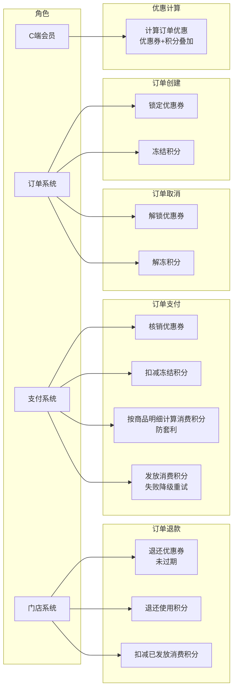
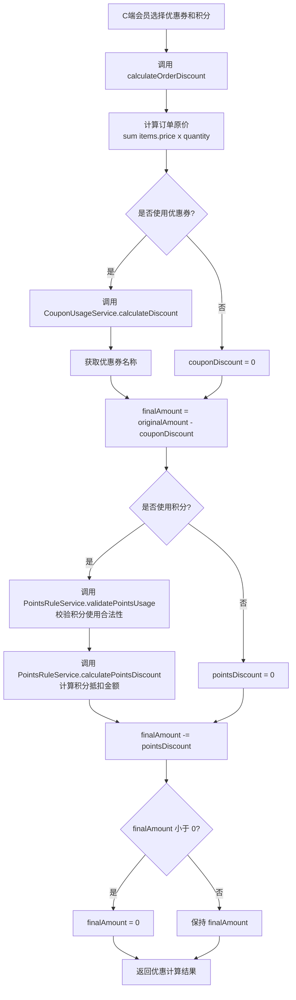
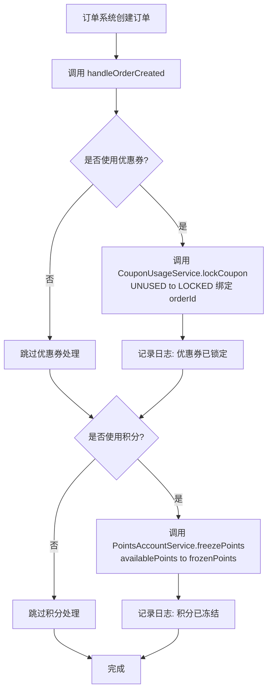
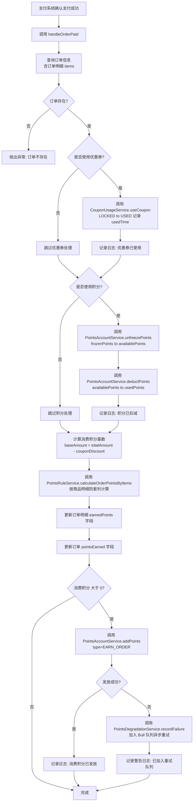
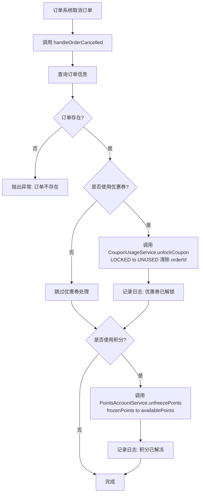
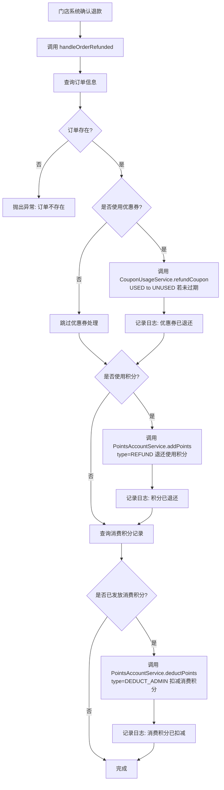

# 订单集成系统 — 需求文档

> 版本：1.0
> 日期：2026-02-22
> 模块路径：`src/module/marketing/integration/`
> 关联模块：`src/module/marketing/coupon`（优惠券）、`src/module/marketing/points`（积分）、`src/module/client/order`（C 端订单）、`src/module/client/payment`（支付）、`src/module/store/order`（门店订单）
> 状态：现状分析 + 演进规划

---

## 1. 概述

### 1.1 背景

订单集成系统（OrderIntegrationService）是 Marketing 模块中的桥接层，负责将优惠券系统和积分系统与订单流程无缝对接。系统在订单生命周期的 4 个关键节点（创建、支付、取消、退款）触发相应的营销逻辑，确保优惠券和积分的状态流转与订单状态保持一致。

核心职责：

| 职责     | 说明                               | 涉及模块                                         |
| -------- | ---------------------------------- | ------------------------------------------------ |
| 优惠计算 | 计算订单的优惠券+积分叠加抵扣金额  | coupon/usage, points/rule                        |
| 订单创建 | 锁定优惠券、冻结积分               | coupon/usage, points/account                     |
| 订单支付 | 核销优惠券、扣减积分、发放消费积分 | coupon/usage, points/account, points/degradation |
| 订单取消 | 解锁优惠券、解冻积分               | coupon/usage, points/account                     |
| 订单退款 | 退还优惠券、退还积分、扣减消费积分 | coupon/usage, points/account                     |

### 1.2 目标

1. 完整描述订单集成系统的功能现状与数据流
2. 分析系统自身的代码缺陷与架构不足
3. 分析与外部模块（订单、支付、优惠券、积分）的跨模块设计缺陷
4. 对标市面主流电商平台（有赞、美团、拼多多）的订单优惠集成方案
5. 提出演进建议和优先级排序

### 1.3 范围

| 在范围内                                     | 不在范围内                                        |
| -------------------------------------------- | ------------------------------------------------- |
| 优惠计算（优惠券+积分叠加）                  | 优惠券系统内部逻辑（`marketing/coupon`）          |
| 订单创建时的优惠券锁定+积分冻结              | 积分系统内部逻辑（`marketing/points`）            |
| 订单支付时的优惠券核销+积分扣减+消费积分发放 | 订单系统内部逻辑（`client/order`、`store/order`） |
| 订单取消时的优惠券解锁+积分解冻              | 支付系统内部逻辑（`client/payment`）              |
| 订单退款时的优惠券退还+积分退还+消费积分扣减 | 前端 Admin Web 页面                               |
| 消费积分防套利计算（按商品明细）             | C 端小程序页面                                    |

---

## 2. 角色与用例

> 图 1：订单集成系统用例图



**角色说明**：

| 角色     | 职责                                                                 | 接口前缀                          |
| -------- | -------------------------------------------------------------------- | --------------------------------- |
| C 端会员 | 下单时选择优惠券和积分，查看优惠计算结果                             | `client/order/calculate-discount` |
| 订单系统 | 订单创建时调用集成服务锁定优惠券和冻结积分；订单取消时调用解锁和解冻 | 内部 Service 调用                 |
| 支付系统 | 订单支付成功后调用集成服务核销优惠券、扣减积分、发放消费积分         | 内部 Service 调用                 |
| 门店系统 | 订单退款时调用集成服务退还优惠券和积分、扣减消费积分                 | 内部 Service 调用                 |

---

## 3. 业务流程

### 3.1 优惠计算流程

> 图 2：优惠计算活动图



**关键规则**：

1. 优惠券先于积分计算：积分抵扣基于优惠券抵扣后的金额
2. 最终金额不为负：若优惠总额超过订单原价，最终金额为 0
3. 积分使用需校验：单笔上限、最大抵扣比例等规则

### 3.2 订单创建流程

> 图 3：订单创建时的优惠券和积分处理活动图



**异常处理**：若锁定或冻结失败，抛出异常，订单创建流程回滚。

### 3.3 订单支付流程

> 图 4：订单支付时的优惠券和积分处理活动图



**关键设计**：

1. 积分扣减分两步：先解冻（frozenPoints → availablePoints），再扣减（availablePoints → usedPoints）
2. 消费积分防套利：按商品明细 + 金额占比计算，防止拆单获取更多积分
3. 消费积分发放失败不影响支付：通过降级服务异步重试，避免阻塞订单流程

### 3.4 订单取消流程

> 图 5：订单取消时的优惠券和积分处理活动图



### 3.5 订单退款流程

> 图 6：订单退款时的优惠券和积分处理活动图



**关键规则**：

1. 优惠券退还仅限未过期：已过期的券不退还，静默处理
2. 积分退还 = 使用积分 + 消费积分：两者独立处理
3. 消费积分扣减：查询 EARN_ORDER 类型的交易记录，扣减对应金额

---

## 4. 状态说明

订单集成系统本身无状态机，其职责是协调优惠券和积分的状态流转。相关状态机详见：

- 优惠券状态机：[coupon-requirements.md § 4.1](../../coupon/coupon-requirements.md#41-用户优惠券状态机)
- 积分账户余额联动：[points-requirements.md § 4.2](../../points/points-requirements.md#42-积分账户余额联动)

---

## 5. 现有功能详述

### 5.1 接口清单

#### 5.1.1 C 端接口（`client/order`）— 1 个端点

| 接口         | 方法 | 路径                               | 权限            | 说明                        |
| ------------ | ---- | ---------------------------------- | --------------- | --------------------------- |
| 计算订单优惠 | POST | `/client/order/calculate-discount` | MemberAuthGuard | 计算优惠券+积分叠加抵扣金额 |

> 注：该接口位于 `module/client/order/order-integration.controller.ts`，使用 `@ApiOperation` 而非 `@Api`，缺少 `@ApiBearerAuth` 和 `@tenantScope` 注解。

#### 5.1.2 内部服务方法（无 HTTP 端点）

| 服务                      | 方法                                                                | 说明                                         |
| ------------------------- | ------------------------------------------------------------------- | -------------------------------------------- |
| `OrderIntegrationService` | `calculateOrderDiscount(memberId, dto)`                             | 计算订单优惠（优惠券+积分叠加）              |
| `OrderIntegrationService` | `handleOrderCreated(orderId, memberId, userCouponId?, pointsUsed?)` | 订单创建时锁定优惠券和冻结积分               |
| `OrderIntegrationService` | `handleOrderPaid(orderId, memberId, payAmount)`                     | 订单支付时核销优惠券、扣减积分、发放消费积分 |
| `OrderIntegrationService` | `handleOrderCancelled(orderId, memberId)`                           | 订单取消时解锁优惠券和解冻积分               |
| `OrderIntegrationService` | `handleOrderRefunded(orderId, memberId)`                            | 订单退款时退还优惠券和积分、扣减消费积分     |

### 5.2 调用方与调用时机

| 调用方               | 调用方法                 | 调用时机           | 文件路径                                 |
| -------------------- | ------------------------ | ------------------ | ---------------------------------------- |
| `ClientOrderService` | `calculateOrderDiscount` | 订单预览时计算优惠 | `client/order/order.service.ts:105`      |
| `ClientOrderService` | `handleOrderCreated`     | 订单创建成功后     | `client/order/order.service.ts:189`      |
| `ClientOrderService` | `handleOrderCancelled`   | 用户主动取消订单后 | `client/order/order.service.ts:366, 433` |
| `PaymentService`     | `handleOrderPaid`        | 支付成功回调后     | `client/payment/payment.service.ts:144`  |
| `StoreOrderService`  | `handleOrderRefunded`    | 门店确认退款后     | `store/order/store-order.service.ts:484` |

### 5.3 优惠叠加规则

当前系统支持优惠券和积分叠加使用，计算顺序为：

1. 订单原价 = Σ(商品单价 × 数量)
2. 优惠券抵扣：finalAmount = originalAmount - couponDiscount
3. 积分抵扣：finalAmount = finalAmount - pointsDiscount
4. 最终金额：max(finalAmount, 0)

**限制**：

- 积分抵扣基于优惠券抵扣后的金额，不能基于原价
- 积分使用需满足单笔上限（`maxPointsPerOrder`）和最大抵扣比例（`maxDiscountPercentOrder`）
- 优惠券和积分可同时使用，无互斥规则

### 5.4 消费积分防套利机制

订单支付成功后，系统按商品明细计算消费积分，防止用户通过拆单获取更多积分。

**计算公式**：

```
积分计算基数 = 订单原价 - 优惠券抵扣（不包括积分抵扣）
每个商品的积分 = floor(itemBaseAmount / base) × ratio × (pointsRatio / 100)
其中 itemBaseAmount = baseAmount × (itemAmount / totalAmount)
```

**示例**：

订单原价 200 元（商品 A 100 元，商品 B 100 元），使用 20 元优惠券，积分计算基数 = 180 元。若商品 A 积分比例 100%，商品 B 积分比例 50%，则：

- 商品 A 积分 = floor(90 / 10) × 1 × 100% = 9 积分
- 商品 B 积分 = floor(90 / 10) × 1 × 50% = 4 积分
- 总积分 = 13 积分

---

## 6. 现有逻辑不足分析

### 6.1 订单集成系统自身缺陷

| 编号 | 问题                           | 严重度 | 详述                                                                                                                                       |
| ---- | ------------------------------ | ------ | ------------------------------------------------------------------------------------------------------------------------------------------ |
| D-1  | C 端接口装饰器不规范           | P1     | `OrderIntegrationController` 使用 `@ApiOperation` 而非 `@Api`，缺少 `@ApiBearerAuth`，缺少 `@tenantScope` 注解。                           |
| D-2  | 直接访问 `omsOrder` 表         | P1     | `handleOrderPaid`、`handleOrderCancelled`、`handleOrderRefunded` 均直接 `prisma.omsOrder.findUnique`，跨模块直接访问订单表，违反模块边界。 |
| D-3  | 直接访问 `omsOrderItem` 表     | P1     | `handleOrderPaid` 中直接 `prisma.omsOrderItem.updateMany` 更新订单明细的 `earnedPoints` 字段，跨模块直接访问订单明细表。                   |
| D-4  | 积分扣减分两步非事务           | P0     | `handleOrderPaid` 中先 `unfreezePoints` 再 `deductPoints`，两个操作非事务包裹，若解冻成功但扣减失败，积分状态不一致。                      |
| D-5  | 消费积分发放失败静默处理       | P2     | `handleOrderPaid` 中消费积分发放失败时仅记录警告日志并加入重试队列，不抛出异常。虽然不影响订单流程，但缺少监控告警机制。                   |
| D-6  | 退款时消费积分扣减无余额校验   | P1     | `handleOrderRefunded` 中扣减消费积分时未校验账户余额是否足够，若用户已使用消费积分，扣减会失败。                                           |
| D-7  | 无幂等性保护                   | P0     | 5 个 `handle*` 方法均无幂等性保护，若订单系统重复调用（如网络重试），会导致重复处理（如重复解锁优惠券、重复解冻积分）。                    |
| D-8  | 无分布式锁                     | P1     | 5 个 `handle*` 方法均无分布式锁，高并发场景下可能出现竞态条件（如同一订单被多个请求同时处理）。                                            |
| D-9  | 错误日志未使用 `getErrorStack` | P2     | 所有 `catch (error)` 块中仅使用 `getErrorMessage(error)`，未使用 `getErrorStack(error)` 记录堆栈，排查问题困难。                           |

### 6.2 跨模块缺陷

| 编号 | 问题                           | 严重度 | 涉及模块                    | 详述                                                                                                                                              |
| ---- | ------------------------------ | ------ | --------------------------- | ------------------------------------------------------------------------------------------------------------------------------------------------- |
| X-1  | 直接访问订单表                 | P1     | integration → order         | `handleOrderPaid`、`handleOrderCancelled`、`handleOrderRefunded` 均直接访问 `omsOrder` 和 `omsOrderItem` 表，应通过 `OrderService` 获取订单信息。 |
| X-2  | 订单系统未封装集成调用         | P2     | order → integration         | `ClientOrderService` 和 `StoreOrderService` 直接调用 `OrderIntegrationService` 的 5 个方法，未封装为统一的订单事件处理器。                        |
| X-3  | 支付系统未封装集成调用         | P2     | payment → integration       | `PaymentService` 直接调用 `handleOrderPaid`，未封装为支付事件处理器。                                                                             |
| X-4  | 无事件驱动                     | P1     | integration → events        | 订单集成的 5 个关键节点（创建、支付、取消、退款、优惠计算）未发送事件到 `marketing/events`，下游系统无法感知。                                    |
| X-5  | 优惠券和积分模块未导出必要方法 | P2     | coupon/points → integration | `CouponUsageService` 和 `PointsAccountService` 的部分方法（如 `lockCoupon`、`freezePoints`）未在模块的 `exports` 中显式声明，依赖隐式导出。       |

### 6.3 架构层面不足

| 编号 | 问题               | 详述                                                                                                                    |
| ---- | ------------------ | ----------------------------------------------------------------------------------------------------------------------- |
| A-1  | 无优惠叠加规则配置 | 当前优惠券和积分可无限制叠加，缺少「同类互斥」「最多 N 张券」等规则配置。市面主流系统均支持灵活的叠加规则。             |
| A-2  | 无优惠上限配置     | 缺少「单笔订单最大优惠金额」「单笔订单最大优惠比例」等全局上限配置，运营无法控制优惠成本。                              |
| A-3  | 无优惠计算缓存     | `calculateOrderDiscount` 每次调用均重新计算，高频场景（如购物车页面）性能较差。                                         |
| A-4  | 无优惠计算审计日志 | 优惠计算结果未记录到数据库，无法追溯用户的优惠使用历史（如「为什么我的优惠券不能用」）。                                |
| A-5  | 无订单优惠快照     | 订单表中仅记录 `couponDiscount` 和 `pointsDiscount`，未记录优惠券名称、积分规则等详细信息，退款时无法还原优惠计算逻辑。 |
| A-6  | 无优惠预占机制     | 优惠券和积分在订单创建时锁定/冻结，但未预占优惠金额。若规则变更（如优惠券被停用），支付时优惠金额可能与创建时不一致。   |
| A-7  | 无优惠失效通知     | 订单创建后，若优惠券过期或积分不足，用户无感知，支付时才发现优惠失效。                                                  |
| A-8  | 无优惠使用统计     | 缺少「优惠券使用率」「积分使用率」「平均优惠金额」等运营指标统计。                                                      |

---

## 7. 市面主流电商平台对标

### 7.1 功能对比矩阵

| 功能                 | 本系统 | 有赞 | 美团 | 拼多多 | 差距评估   |
| -------------------- | ------ | ---- | ---- | ------ | ---------- |
| 优惠券+积分叠加      | 有     | 有   | 有   | 有     | 持平       |
| 优惠计算接口         | 有     | 有   | 有   | 有     | 持平       |
| 订单创建时锁定/冻结  | 有     | 有   | 有   | 有     | 持平       |
| 订单支付时核销/扣减  | 有     | 有   | 有   | 有     | 持平       |
| 订单取消时解锁/解冻  | 有     | 有   | 有   | 有     | 持平       |
| 订单退款时退还       | 有     | 有   | 有   | 有     | 持平       |
| 消费积分防套利       | 有     | 有   | 有   | 有     | 持平       |
| 消费积分发放失败降级 | 有     | 有   | 有   | 有     | 持平       |
| 幂等性保护           | 无     | 有   | 有   | 有     | 缺失（P0） |
| 分布式锁             | 无     | 有   | 有   | 有     | 缺失（P1） |
| 优惠叠加规则配置     | 无     | 有   | 有   | 有     | 缺失（P1） |
| 优惠上限配置         | 无     | 有   | 有   | 有     | 缺失（P1） |
| 优惠计算缓存         | 无     | 有   | 有   | 有     | 缺失（P2） |
| 优惠计算审计日志     | 无     | 有   | 有   | 有     | 缺失（P2） |
| 订单优惠快照         | 无     | 有   | 有   | 有     | 缺失（P2） |
| 优惠预占机制         | 无     | 有   | 有   | 有     | 缺失（P2） |
| 优惠失效通知         | 无     | 有   | 有   | 有     | 缺失（P2） |
| 优惠使用统计         | 无     | 有   | 有   | 有     | 缺失（P2） |
| 事件驱动             | 无     | 有   | 有   | 有     | 缺失（P1） |

### 7.2 差距总结

本系统在订单集成的核心流程（优惠计算、锁定/冻结、核销/扣减、解锁/解冻、退还）上功能完整，消费积分防套利计算和发放失败降级机制设计合理。主要差距集中在：

1. 安全基线缺失（P0）：无幂等性保护、积分扣减非事务、退款时无余额校验
2. 架构规范偏离（P1）：跨模块直接访问订单表、无分布式锁、无事件驱动、C 端接口装饰器不规范
3. 运营能力不足（P1-P2）：无优惠叠加规则配置、无优惠上限配置、无优惠计算审计日志、无优惠使用统计
4. 体验优化缺失（P2）：无优惠计算缓存、无订单优惠快照、无优惠预占机制、无优惠失效通知

---

## 8. 验收标准

### 8.1 现有功能验收

| 编号  | 验收条件                                                              | 状态   |
| ----- | --------------------------------------------------------------------- | ------ |
| AC-1  | `calculateOrderDiscount` 正确计算优惠券+积分叠加抵扣金额              | 已通过 |
| AC-2  | 优惠券先于积分计算，积分抵扣基于优惠券抵扣后的金额                    | 已通过 |
| AC-3  | 最终金额不为负数                                                      | 已通过 |
| AC-4  | `handleOrderCreated` 正确锁定优惠券（UNUSED → LOCKED）                | 已通过 |
| AC-5  | `handleOrderCreated` 正确冻结积分（availablePoints → frozenPoints）   | 已通过 |
| AC-6  | `handleOrderPaid` 正确核销优惠券（LOCKED → USED）                     | 已通过 |
| AC-7  | `handleOrderPaid` 正确扣减积分（先解冻再扣减）                        | 已通过 |
| AC-8  | `handleOrderPaid` 按商品明细计算消费积分（防套利）                    | 已通过 |
| AC-9  | `handleOrderPaid` 消费积分发放失败时加入降级队列                      | 已通过 |
| AC-10 | `handleOrderCancelled` 正确解锁优惠券（LOCKED → UNUSED）              | 已通过 |
| AC-11 | `handleOrderCancelled` 正确解冻积分（frozenPoints → availablePoints） | 已通过 |
| AC-12 | `handleOrderRefunded` 正确退还优惠券（USED → UNUSED，仅限未过期）     | 已通过 |
| AC-13 | `handleOrderRefunded` 正确退还使用积分（type=REFUND）                 | 已通过 |
| AC-14 | `handleOrderRefunded` 正确扣减消费积分（type=DEDUCT_ADMIN）           | 已通过 |

### 8.2 待修复验收

| 编号  | 验收条件                                                          | 状态   | 对应缺陷      |
| ----- | ----------------------------------------------------------------- | ------ | ------------- |
| AC-15 | C 端接口使用 `@Api`、添加 `@ApiBearerAuth`、添加 `@tenantScope`   | 未实现 | D-1           |
| AC-16 | 消除对 `omsOrder` 和 `omsOrderItem` 的直接访问                    | 未实现 | D-2, D-3, X-1 |
| AC-17 | `handleOrderPaid` 中积分扣减添加 `@Transactional()` 事务包裹      | 未实现 | D-4           |
| AC-18 | 退款时消费积分扣减添加余额校验                                    | 未实现 | D-6           |
| AC-19 | 5 个 `handle*` 方法添加幂等性保护（Redis SetNX 或数据库唯一约束） | 未实现 | D-7           |
| AC-20 | 5 个 `handle*` 方法添加分布式锁                                   | 未实现 | D-8           |
| AC-21 | 错误日志使用 `getErrorStack` 记录堆栈                             | 未实现 | D-9           |
| AC-22 | 订单集成的 5 个关键节点发送事件到 `marketing/events`              | 未实现 | X-4           |

---

## 9. 演进建议与待办

### 9.1 第一阶段：安全基线 + 核心修复（1-2 周）

| 编号 | 任务                                                               | 对应缺陷      | 预估工时 |
| ---- | ------------------------------------------------------------------ | ------------- | -------- |
| T-1  | C 端接口装饰器规范化（`@Api` + `@ApiBearerAuth` + `@tenantScope`） | D-1           | 0.5h     |
| T-2  | 消除对 `omsOrder` 和 `omsOrderItem` 的直接访问                     | D-2, D-3, X-1 | 2h       |
| T-3  | `handleOrderPaid` 中积分扣减添加 `@Transactional()`                | D-4           | 0.5h     |
| T-4  | 退款时消费积分扣减添加余额校验                                     | D-6           | 1h       |
| T-5  | 5 个 `handle*` 方法添加幂等性保护                                  | D-7           | 3h       |
| T-6  | 5 个 `handle*` 方法添加分布式锁                                    | D-8           | 2h       |
| T-7  | 错误日志使用 `getErrorStack`                                       | D-9           | 0.5h     |

### 9.2 第二阶段：架构规范对齐（2-3 周）

| 编号 | 任务                             | 对应缺陷 | 预估工时 |
| ---- | -------------------------------- | -------- | -------- |
| T-8  | 订单集成的 5 个关键节点发送事件  | X-4      | 2d       |
| T-9  | 订单系统封装集成调用为事件处理器 | X-2      | 1d       |
| T-10 | 支付系统封装集成调用为事件处理器 | X-3      | 0.5d     |
| T-11 | 优惠券和积分模块显式导出必要方法 | X-5      | 0.5h     |

### 9.3 第三阶段：运营能力增强（1-2 月）

| 编号 | 任务                                       | 对应缺陷 | 预估工时 |
| ---- | ------------------------------------------ | -------- | -------- |
| T-12 | 优惠叠加规则配置（同类互斥、最多 N 张券）  | A-1      | 3-5d     |
| T-13 | 优惠上限配置（单笔最大优惠金额/比例）      | A-2      | 1-2d     |
| T-14 | 优惠计算审计日志（记录到数据库）           | A-4      | 2-3d     |
| T-15 | 订单优惠快照（记录优惠券名称、积分规则等） | A-5      | 2-3d     |
| T-16 | 优惠使用统计（优惠券使用率、积分使用率等） | A-8      | 3-5d     |

### 9.4 第四阶段：体验优化（3-6 月）

| 编号 | 任务                                       | 说明                       |
| ---- | ------------------------------------------ | -------------------------- |
| T-17 | 优惠计算缓存（Redis 缓存，TTL 5 分钟）     | 提升高频场景性能           |
| T-18 | 优惠预占机制（订单创建时预占优惠金额）     | 防止规则变更导致优惠不一致 |
| T-19 | 优惠失效通知（优惠券过期、积分不足时推送） | 提升用户体验               |
| T-20 | 消费积分发放失败监控告警                   | 及时发现降级队列积压       |

### 9.5 关键路径

```
T-5(幂等性) → T-6(分布式锁) → T-3(事务) → T-2(消除跨模块访问) → T-8(事件驱动) → T-12(叠加规则) → T-14(审计日志)
```

**优先级总结**：

| 优先级 | 任务数 | 核心内容                                                                          | 预估工时 |
| ------ | ------ | --------------------------------------------------------------------------------- | -------- |
| P0     | 7 项   | 安全基线（幂等性+分布式锁+事务+余额校验）+ 核心修复（装饰器+跨模块访问+错误日志） | 1-2 周   |
| P1     | 4 项   | 架构对齐（事件驱动+事件处理器封装+模块导出）                                      | 2-3 周   |
| P2     | 5 项   | 运营增强（叠加规则+优惠上限+审计日志+优惠快照+使用统计）                          | 1-2 月   |
| P3     | 4 项   | 体验优化（计算缓存+优惠预占+失效通知+监控告警）                                   | 3-6 月   |
