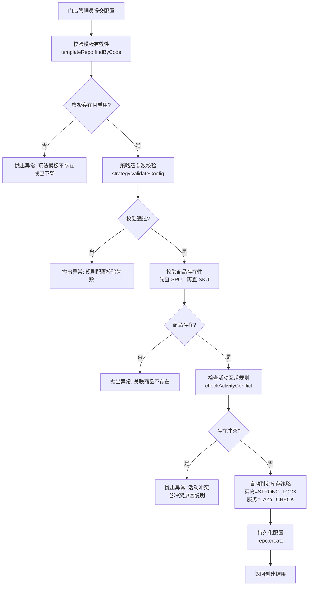
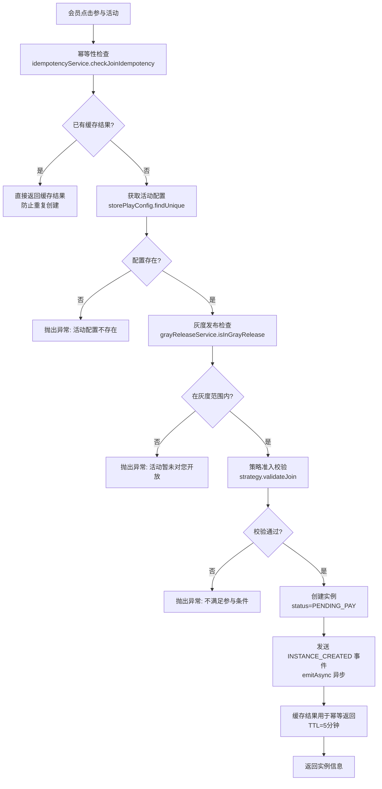
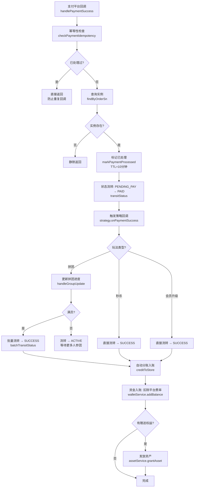
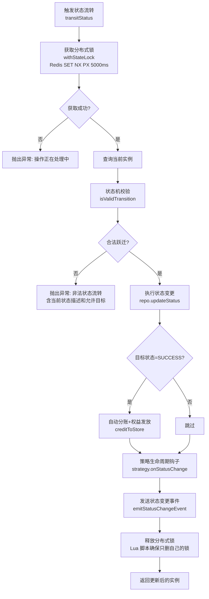
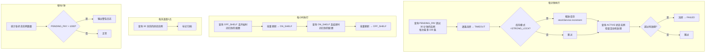
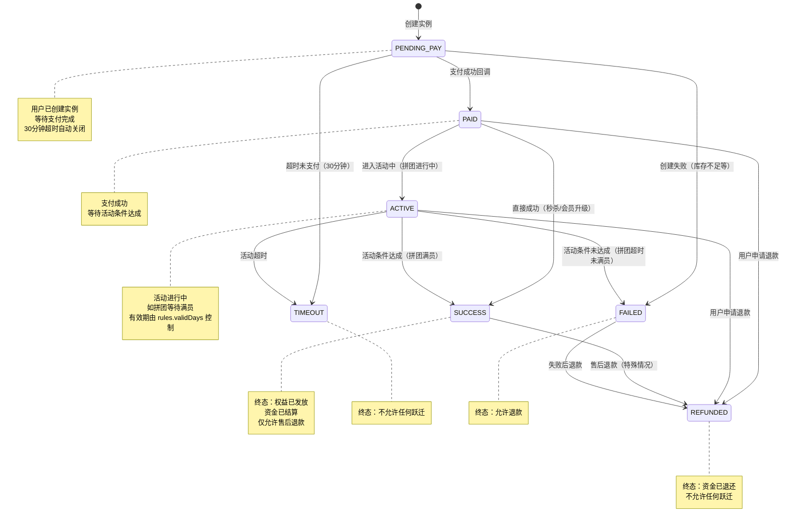

# MaaS 营销核心引擎 — 需求文档

> 版本：1.0
> 日期：2026-02-22
> 模块路径：`src/module/marketing/`（template, config, instance, play, stock, asset 六个子模块）
> 关联模块：`src/module/pms`（商品关联）、`src/module/store`（门店关联）、`src/module/client/order`（订单支付回调）、`src/module/finance/wallet`（钱包结算）
> 状态：现状分析 + 演进规划

---

## 1. 概述

### 1.1 背景

MaaS（Marketing as a Service）是本平台的营销核心引擎，采用「模板 → 配置 → 实例 → 资产」四阶段流水线架构，将营销活动的定义、配置、执行、履约四个阶段解耦为独立子模块。引擎通过策略模式（Strategy Pattern）实现玩法插件化，当前已注册 5 种玩法：普通拼团（GROUP_BUY）、拼班课程（COURSE_GROUP_BUY）、限时秒杀（FLASH_SALE）、满减活动（FULL_REDUCTION）、会员升级（MEMBER_UPGRADE）。

核心引擎包含 6 个紧密耦合的子模块：

| 子模块   | 路径                  | 职责                               | 核心类                               |
| -------- | --------------------- | ---------------------------------- | ------------------------------------ |
| template | `marketing/template/` | 元数据中心：定义玩法蓝图           | `PlayTemplateService`                |
| config   | `marketing/config/`   | 配置中心：门店绑定商品与玩法规则   | `StorePlayConfigService`             |
| instance | `marketing/instance/` | 执行中心：用户参与记录与状态机流转 | `PlayInstanceService`                |
| play     | `marketing/play/`     | 策略中心：各玩法的具体业务逻辑     | `PlayStrategyFactory` + 5 个策略实现 |
| stock    | `marketing/stock/`    | 库存中心：Redis Lua 原子扣减名额   | `MarketingStockService`              |
| asset    | `marketing/asset/`    | 履约中心：虚拟权益资产的发放与核销 | `UserAssetService`                   |

此外，引擎依赖 3 个基础设施子模块提供横切关注点支撑：

| 子模块    | 路径                   | 职责                                                 |
| --------- | ---------------------- | ---------------------------------------------------- |
| events    | `marketing/events/`    | 事件驱动：解耦模块间通信                             |
| scheduler | `marketing/scheduler/` | 生命周期调度：超时关闭、自动上下架、数据归档         |
| rule      | `marketing/rule/`      | 规则校验：DTO 校验 + 业务逻辑校验 + 表单 Schema 生成 |

### 1.2 目标

1. 完整描述 MaaS 核心引擎 6 个子模块的功能现状与数据流
2. 分析引擎自身的代码缺陷与架构不足
3. 分析引擎与外部模块（PMS、Store、Finance）的跨模块设计缺陷
4. 对标市面主流营销引擎（有赞、美团、拼多多），识别功能差距
5. 提出演进建议和优先级排序

### 1.3 范围

| 在范围内                                 | 不在范围内                          |
| ---------------------------------------- | ----------------------------------- |
| 玩法模板 CRUD（template）                | 优惠券系统（`marketing/coupon`）    |
| 活动配置管理 + 版本控制（config）        | 积分系统（`marketing/points`）      |
| 实例生命周期 + 状态机（instance）        | 订单集成（`marketing/integration`） |
| 策略模式 + 5 种玩法实现（play）          | 审批流（`marketing/approval`）      |
| Redis Lua 库存扣减（stock）              | 灰度发布（`marketing/gray`）        |
| 资产发放与核销（asset）                  | C 端营销接口（`client/marketing`）  |
| 事件驱动 + 调度器 + 规则校验（基础设施） | 前端 Admin Web 页面                 |

---

## 2. 角色与用例

> 图 1：MaaS 核心引擎用例图

```mermaid
graph LR
    subgraph 角色
        PA[平台管理员]
        SA[门店管理员]
        MB[C端会员]
        SYS[系统调度器]
    end

    subgraph 模板管理 template
        UC1[创建玩法模板]
        UC2[更新玩法模板]
        UC3[查询模板列表]
        UC4[删除玩法模板]
    end

    subgraph 活动配置 config
        UC5[创建活动配置<br/>绑定商品+玩法规则]
        UC6[更新活动配置<br/>自动版本控制]
        UC7[查询配置列表<br/>含商品信息组装]
        UC8[上下架活动]
        UC9[删除活动配置]
        UC10[查看规则历史版本]
        UC11[回滚到指定版本]
        UC12[比较版本差异]
    end

    subgraph 实例管理 instance
        UC13[参与活动<br/>创建实例]
        UC14[查询实例列表]
        UC15[查询实例详情<br/>含策略增强数据]
        UC16[手动状态流转]
        UC17[支付成功回调]
    end

    subgraph 资产管理 asset
        UC18[查询资产列表]
        UC19[查询资产详情]
        UC20[核销资产]
    end

    subgraph 系统自动化
        UC21[超时实例自动关闭]
        UC22[活动自动上下架]
        UC23[过期数据归档]
        UC24[系统健康检查]
    end

    subgraph 待建设功能
        UC25[活动数据统计/报表]
        UC26[活动审批流程]
        UC27[活动复制/克隆]
        UC28[批量上下架]
        UC29[资产转赠/退还]
        UC30[库存预警通知]
    end

    PA --> UC1
    PA --> UC2
    PA --> UC3
    PA --> UC4

    SA --> UC5
    SA --> UC6
    SA --> UC7
    SA --> UC8
    SA --> UC9
    SA --> UC10
    SA --> UC11
    SA --> UC12

    MB --> UC13
    MB --> UC14
    MB --> UC15
    MB --> UC18
    MB --> UC19
    MB --> UC20

    SA --> UC16
    SA --> UC17

    SYS --> UC21
    SYS --> UC22
    SYS --> UC23
    SYS --> UC24

    PA -.-> UC25
    PA -.-> UC26
    SA -.-> UC27
    SA -.-> UC28
    MB -.-> UC29
    SYS -.-> UC30

    style UC25 stroke-dasharray: 5 5
    style UC26 stroke-dasharray: 5 5
    style UC27 stroke-dasharray: 5 5
    style UC28 stroke-dasharray: 5 5
    style UC29 stroke-dasharray: 5 5
    style UC30 stroke-dasharray: 5 5
```

**角色说明**：

| 角色       | 职责                                                        | 接口前缀                       |
| ---------- | ----------------------------------------------------------- | ------------------------------ |
| 平台管理员 | 维护玩法模板元数据，定义系统支持的营销玩法类型              | `admin/marketing/template`     |
| 门店管理员 | 创建活动配置（绑定商品+规则），管理活动上下架，处理异常实例 | `admin/marketing/config`       |
| C 端会员   | 参与活动、查看参与记录、核销权益资产                        | `client/marketing/*`（待建设） |
| 系统调度器 | 定时处理超时实例、自动上下架、数据归档、健康检查            | 内部 Cron 任务                 |

---

## 3. 业务流程

### 3.1 活动配置创建流程

> 图 2：活动配置创建活动图

### 3.2 用户参与活动流程

> 图 3：用户参与活动（创建实例）活动图

### 3.3 支付成功回调流程

> 图 4：支付成功回调处理活动图

### 3.4 状态机流转流程

> 图 5：实例状态流转活动图

### 3.5 定时调度流程

> 图 6：生命周期调度器活动图

---

## 4. 状态说明

### 4.1 营销实例状态机

> 图 7：PlayInstance 状态图

**状态说明**：

| 状态        | 业务含义                         | 是否终态       | 允许跃迁到                         |
| ----------- | -------------------------------- | -------------- | ---------------------------------- |
| PENDING_PAY | 待支付：用户已创建实例，等待支付 | 否             | PAID, TIMEOUT, FAILED              |
| PAID        | 已支付：等待活动条件达成         | 否             | ACTIVE, SUCCESS, REFUNDED          |
| ACTIVE      | 活动中：等待最终结果             | 否             | SUCCESS, FAILED, TIMEOUT, REFUNDED |
| SUCCESS     | 活动成功：权益已发放，资金已结算 | 是（允许退款） | REFUNDED                           |
| TIMEOUT     | 超时关闭：用户未在规定时间内完成 | 是             | 无                                 |
| FAILED      | 活动失败：条件未达成             | 是（允许退款） | REFUNDED                           |
| REFUNDED    | 已退款：资金已退还               | 是             | 无                                 |

### 4.2 活动配置发布状态

活动配置使用 `PublishStatus` 枚举控制上下架：

| 状态      | 含义                       | 触发方式                                    |
| --------- | -------------------------- | ------------------------------------------- |
| ON_SHELF  | 上架：C 端可见，会员可参与 | 手动上架 / 调度器自动上架（到达 startTime） |
| OFF_SHELF | 下架：C 端不可见           | 手动下架 / 调度器自动下架（到达 endTime）   |

---

## 5. 现有功能详述

### 5.1 接口清单

#### 5.1.1 玩法模板（`marketing/template`）— 5 个端点

| 接口     | 方法   | 路径                       | 权限  | 说明                  |
| -------- | ------ | -------------------------- | ----- | --------------------- |
| 模板列表 | GET    | `/marketing/template/list` | ⚠️ 无 | 分页查询              |
| 模板详情 | GET    | `/marketing/template/:id`  | ⚠️ 无 | 单条查询              |
| 创建模板 | POST   | `/marketing/template`      | ⚠️ 无 | 编码唯一性校验 + 事务 |
| 更新模板 | PUT    | `/marketing/template/:id`  | ⚠️ 无 | 编码唯一性校验 + 事务 |
| 删除模板 | DELETE | `/marketing/template/:id`  | ⚠️ 无 | 软删除                |

#### 5.1.2 活动配置（`marketing/config`）— 9 个端点

| 接口     | 方法   | 路径                                     | 权限  | 说明                                          |
| -------- | ------ | ---------------------------------------- | ----- | --------------------------------------------- |
| 配置列表 | GET    | `/marketing/config/list`                 | ⚠️ 无 | 分页 + 商品信息组装（批量查询防 N+1）         |
| 配置详情 | GET    | `/marketing/config/:id`                  | ⚠️ 无 | 含策略增强展示数据                            |
| 创建配置 | POST   | `/marketing/config`                      | ⚠️ 无 | 模板校验 + 商品校验 + 互斥检查 + 自动库存策略 |
| 更新配置 | PUT    | `/marketing/config/:id`                  | ⚠️ 无 | 规则变更自动保存历史版本                      |
| 更新状态 | PATCH  | `/marketing/config/:id/status`           | ⚠️ 无 | 上下架切换                                    |
| 删除配置 | DELETE | `/marketing/config/:id`                  | ⚠️ 无 | 软删除                                        |
| 历史版本 | GET    | `/marketing/config/:id/history`          | ⚠️ 无 | 查询规则变更历史                              |
| 版本回滚 | POST   | `/marketing/config/:id/rollback`         | ⚠️ 无 | 回滚到指定版本                                |
| 版本比较 | GET    | `/marketing/config/:id/compare/:version` | ⚠️ 无 | 比较当前与历史版本差异                        |

#### 5.1.3 实例管理（`marketing/instance`）— 4 个端点

| 接口     | 方法  | 路径                             | 权限  | 说明                              |
| -------- | ----- | -------------------------------- | ----- | --------------------------------- |
| 实例列表 | GET   | `/marketing/instance/list`       | ⚠️ 无 | 分页查询                          |
| 实例详情 | GET   | `/marketing/instance/:id`        | ⚠️ 无 | 含策略增强展示数据（如拼团进度）  |
| 参与活动 | POST  | `/marketing/instance`            | ⚠️ 无 | 幂等 + 灰度 + 策略校验 + 事件发送 |
| 状态流转 | PATCH | `/marketing/instance/:id/status` | ⚠️ 无 | 手动触发状态变更                  |

#### 5.1.4 资产管理（`marketing/asset`）— 3 个端点

| 接口     | 方法 | 路径                           | 权限  | 说明                                        |
| -------- | ---- | ------------------------------ | ----- | ------------------------------------------- |
| 资产列表 | GET  | `/marketing/asset/list`        | ⚠️ 无 | 分页查询                                    |
| 资产详情 | GET  | `/marketing/asset/:id`         | ⚠️ 无 | 单条查询                                    |
| 核销资产 | POST | `/marketing/asset/:id/consume` | ⚠️ 无 | 状态预检 + 有效期校验 + 余额扣减 + 自动终态 |

#### 5.1.5 库存引擎（`marketing/stock`）— 无 HTTP 端点

库存引擎为纯内部服务，不暴露 HTTP 接口，由 `PlayInstanceService` 和 `ActivityLifecycleScheduler` 内部调用。

| 方法                                | 说明                                     |
| ----------------------------------- | ---------------------------------------- |
| `initStock(configId, stock)`        | 初始化库存到 Redis                       |
| `decrement(configId, amount, mode)` | 原子扣减（Lua 脚本），支持缓存失效懒加载 |
| `increment(configId, amount)`       | 归还库存（取消/超时/退款）               |

#### 5.1.6 策略工厂（`marketing/play`）— 无 HTTP 端点

策略工厂为纯内部服务，提供策略实例管理和元数据查询。

| 方法                        | 说明                 |
| --------------------------- | -------------------- |
| `getStrategy(code)`         | 获取策略实例         |
| `getMetadata(code)`         | 获取玩法元数据       |
| `getAllPlayTypes()`         | 获取所有玩法类型列表 |
| `hasInstance(code)`         | 判断玩法是否有实例   |
| `canFail(code)`             | 判断玩法是否可失败   |
| `getDefaultStockMode(code)` | 获取默认库存模式     |

### 5.2 已注册玩法清单

| 玩法代码         | 名称     | 有实例 | 有状态 | 可失败 | 可并行 | 默认库存模式 |
| ---------------- | -------- | ------ | ------ | ------ | ------ | ------------ |
| GROUP_BUY        | 普通拼团 | ✅     | ✅     | ✅     | ✅     | STRONG_LOCK  |
| COURSE_GROUP_BUY | 拼班课程 | ✅     | ✅     | ✅     | ✅     | LAZY_CHECK   |
| FLASH_SALE       | 限时秒杀 | ✅     | ✅     | ❌     | ❌     | STRONG_LOCK  |
| FULL_REDUCTION   | 满减活动 | ❌     | ❌     | ❌     | ✅     | LAZY_CHECK   |
| MEMBER_UPGRADE   | 会员升级 | ✅     | ✅     | ❌     | ❌     | LAZY_CHECK   |

### 5.3 活动互斥矩阵

|                  | GROUP_BUY | COURSE_GROUP_BUY | SECKILL   | MEMBER_UPGRADE | FULL_REDUCTION |
| ---------------- | --------- | ---------------- | --------- | -------------- | -------------- |
| GROUP_BUY        | ❌ 互斥   | ❌ 互斥          | ❌ 互斥   | ✅ 可叠加      | ✅ 可叠加      |
| COURSE_GROUP_BUY | ❌ 互斥   | ❌ 互斥          | ❌ 互斥   | ✅ 可叠加      | —              |
| SECKILL          | ❌ 互斥   | ❌ 互斥          | ❌ 互斥   | 🔶 优先级      | —              |
| MEMBER_UPGRADE   | ✅ 可叠加 | ✅ 可叠加        | 🔶 优先级 | ❌ 互斥        | —              |
| FULL_REDUCTION   | ✅ 可叠加 | ✅ 可叠加        | ✅ 可叠加 | ✅ 可叠加      | ✅ 可叠加      |

**说明**：互斥矩阵中 `SECKILL` 与代码中的 `FLASH_SALE` 存在命名不一致（详见缺陷 D-7）。

---

## 6. 现有逻辑不足分析

### 6.1 MaaS 引擎自身缺陷

| 编号 | 问题                                              | 严重度 | 子模块         | 详述                                                                                                                                                                                 |
| ---- | ------------------------------------------------- | ------ | -------------- | ------------------------------------------------------------------------------------------------------------------------------------------------------------------------------------ |
| D-1  | 所有 Controller 缺少 `@ApiBearerAuth`             | 🟡 P1  | 全部           | `PlayTemplateController`、`StorePlayConfigController`、`PlayInstanceController`、`UserAssetController` 均缺少 `@ApiBearerAuth('Authorization')` 装饰器，Swagger 文档不显示认证要求。 |
| D-2  | 所有 Controller 缺少 `@RequirePermission`         | 🔴 P0  | 全部           | 21 个端点均无权限控制装饰器，任何已登录用户可执行所有操作（含删除、回滚等高危操作）。                                                                                                |
| D-3  | 所有写操作缺少 `@Operlog`                         | 🟡 P1  | 全部           | 创建、更新、删除、状态变更、回滚等写操作未记录操作日志，无法审计追踪。                                                                                                               |
| D-4  | 互斥矩阵 templateCode 与注册表不一致              | 🟡 P1  | config         | `activity-conflict.matrix.ts` 使用 `SECKILL` 作为键名，但 `play.registry.ts` 注册的代码为 `FLASH_SALE`。互斥检查对秒杀活动永远不生效。                                               |
| D-5  | `creditToStore` 平台费率硬编码回退值              | 🟡 P1  | instance       | 当系统配置 `marketing.fee_rate` 不存在时回退到 `0.01`（1%），但此默认值未在任何文档或配置中声明，运营无感知。                                                                        |
| D-6  | `creditToStore` 资产类型硬编码 `VOUCHER`          | 🟢 P2  | instance       | 权益发放时 `assetType` 固定为 `'VOUCHER'`，不支持次卡、课程等其他资产类型。应从 `rules.giftAssetType` 读取。                                                                         |
| D-7  | `batchTransitStatus` 未执行状态机校验             | 🔴 P0  | instance       | 批量状态流转方法直接调用 `repo.batchUpdateStatus`，跳过了 `isValidTransition` 状态机校验和分布式锁，可能导致非法状态跃迁。                                                           |
| D-8  | `batchTransitStatus` 未发送状态变更事件           | 🟡 P1  | instance       | 批量流转后未调用 `emitStatusChangeEvent`，下游监听器无法感知批量状态变更。                                                                                                           |
| D-9  | `emitAsync` 使用 `setImmediate` 丢失错误上下文    | 🟡 P1  | events         | `MarketingEventEmitter.emitAsync` 使用 `setImmediate` 异步发送事件，事件处理失败仅打印日志，无重试机制，关键事件（如 INSTANCE_SUCCESS）可能静默丢失。                                |
| D-10 | 库存扣减未在参与流程中调用                        | 🔴 P0  | instance/stock | `PlayInstanceService.create` 中未调用 `MarketingStockService.decrement`，库存扣减逻辑未接入主流程，STRONG_LOCK 模式形同虚设。                                                        |
| D-11 | 资产核销缺少并发控制                              | 🟡 P1  | asset          | `consumeAsset` 使用 `@Transactional` 但未加分布式锁或乐观锁，高并发下同一资产可能被重复核销（余额扣减竞态）。                                                                        |
| D-12 | 调度器 `handleTimeoutInstances` 无分布式锁        | 🟡 P1  | scheduler      | 多实例部署时，同一超时实例可能被多个节点同时处理，导致重复状态流转和重复库存释放。                                                                                                   |
| D-13 | 调度器归档任务 `updateMany` 的 `data` 为空对象    | 🟢 P2  | scheduler      | `cleanupExpiredData` 中 `updateMany` 的 `data: {}` 实际不执行任何更新，归档功能无效。注释提到 `archived` 字段但未实现。                                                              |
| D-14 | `checkTransition` 方法标记 `@deprecated` 但未删除 | 🟢 P2  | instance       | `PlayInstanceService` 中保留了已废弃的 `checkTransition` 私有方法，增加代码噪音。                                                                                                    |

### 6.2 跨模块缺陷

| 编号 | 问题                                  | 严重度 | 涉及模块                | 详述                                                                                                                                 |
| ---- | ------------------------------------- | ------ | ----------------------- | ------------------------------------------------------------------------------------------------------------------------------------ |
| X-1  | 活动配置创建依赖 PMS 但无模块导入声明 | 🟢 P2  | config → pms            | `StorePlayConfigService` 注入 `PmsProductService`，但 `MarketingConfigModule` 未显式导入 `PmsModule`，依赖关系隐式通过全局模块解析。 |
| X-2  | `creditToStore` 使用约定式门店钱包 ID | 🟡 P1  | instance → finance      | 门店钱包 `memberId` 使用 `STORE_${storeId}` 字符串拼接约定，未在 `WalletService` 或文档中声明此约定，其他模块可能使用不同格式。      |
| X-3  | 支付回调入口未暴露 HTTP 端点          | 🟡 P1  | instance → client/order | `handlePaymentSuccess(orderSn)` 方法存在但无对应的 Controller 端点，支付平台无法直接回调。需由 `client/order` 模块内部调用。         |
| X-4  | 活动配置下架不通知已参与用户          | 🟡 P1  | config → instance       | 活动配置状态变更为 OFF_SHELF 时，不检查是否有 PENDING_PAY 或 ACTIVE 状态的实例，可能导致用户已支付但活动被关闭。                     |
| X-5  | 库存初始化时机不明确                  | 🟡 P1  | config → stock          | `MarketingStockService.initStock` 需要在活动上架时调用，但 `StorePlayConfigService.updateStatus` 未调用此方法，库存缓存依赖懒加载。  |

### 6.3 架构层面不足

| 编号 | 问题                             | 详述                                                                                                                                                     |
| ---- | -------------------------------- | -------------------------------------------------------------------------------------------------------------------------------------------------------- |
| A-1  | 无活动数据统计                   | 无参与人数、转化率、GMV 等统计接口，运营无法评估活动效果。                                                                                               |
| A-2  | 无活动审批流程                   | 活动创建后直接生效，无草稿→审核→发布的流程。`marketing/approval` 子模块已存在但未与 config 集成。                                                        |
| A-3  | 无活动复制/克隆                  | 门店无法基于已有活动快速创建相似活动，每次需从零配置。                                                                                                   |
| A-4  | 无批量操作                       | 不支持批量上下架、批量删除等操作，管理效率低。                                                                                                           |
| A-5  | 无资产退还/转赠                  | 资产仅支持核销，不支持退还（退款场景）和转赠（社交场景）。                                                                                               |
| A-6  | 无库存预警                       | 库存低于阈值时无通知机制，运营无法及时补充名额。                                                                                                         |
| A-7  | 事件监听器未实现                 | `MarketingEventEmitter` 发送了 10 种事件类型，但未找到对应的 `@OnEvent` 监听器实现，事件发送后无消费者处理。                                             |
| A-8  | 无 C 端专用接口                  | 所有端点均在 `marketing/*` 路径下，未按规范在 `client/marketing/` 下创建 C 端薄 Controller。会员直接调用管理端接口。                                     |
| A-9  | 规则校验服务未集成到配置创建流程 | `RuleValidatorService` 提供了统一的 `validate` 方法和表单 Schema 生成，但 `StorePlayConfigService.create` 未调用它，仅调用了 `strategy.validateConfig`。 |

---

## 7. 市面主流营销引擎对标

### 7.1 功能对比矩阵

| 功能                           | 本系统 | 有赞营销中心 | 美团商家版 | 拼多多商家后台 | 差距评估                 |
| ------------------------------ | ------ | ------------ | ---------- | -------------- | ------------------------ |
| 策略模式插件化玩法             | ✅     | ✅           | ✅         | ✅             | 持平                     |
| 活动互斥矩阵                   | ✅     | ✅           | ✅         | ✅             | 持平（命名不一致需修复） |
| 7 状态状态机                   | ✅     | ✅           | ✅         | ✅             | 持平                     |
| 版本控制（规则历史/回滚/比较） | ✅     | ❌           | ❌         | ❌             | 领先                     |
| 灰度发布                       | ✅     | ✅           | ❌         | ❌             | 领先                     |
| 幂等性保障（参与+支付）        | ✅     | ✅           | ✅         | ✅             | 持平                     |
| Redis Lua 原子库存扣减         | ✅     | ✅           | ✅         | ✅             | 持平                     |
| 事件驱动架构                   | ✅     | ✅           | ✅         | ✅             | 持平（缺监听器）         |
| 规则校验 + 表单 Schema 生成    | ✅     | ✅           | ❌         | ❌             | 领先                     |
| 生命周期调度器                 | ✅     | ✅           | ✅         | ✅             | 持平                     |
| 权限控制                       | ❌     | ✅           | ✅         | ✅             | 缺失（P0）               |
| 操作日志审计                   | ❌     | ✅           | ✅         | ✅             | 缺失（P1）               |
| 活动数据统计                   | ❌     | ✅           | ✅         | ✅             | 缺失（P1）               |
| 活动审批流程                   | ❌     | ✅           | ❌         | ❌             | 缺失（低优）             |
| 活动复制/克隆                  | ❌     | ✅           | ✅         | ✅             | 缺失（P2）               |
| 批量操作                       | ❌     | ✅           | ✅         | ✅             | 缺失（P2）               |
| 库存预警                       | ❌     | ✅           | ✅         | ✅             | 缺失（P2）               |
| 资产退还/转赠                  | ❌     | ✅           | ❌         | ✅             | 缺失（低优）             |
| C 端专用接口层                 | ❌     | ✅           | ✅         | ✅             | 缺失（P1）               |
| 砍价玩法                       | ❌     | ✅           | ❌         | ✅             | 缺失（低优）             |
| 抽奖玩法                       | ❌     | ✅           | ❌         | ❌             | 缺失（低优）             |

### 7.2 差距总结

本系统在版本控制、灰度发布、规则校验+表单 Schema 生成方面具有差异化优势。主要差距集中在：

1. 安全基线缺失（P0）：21 个端点无权限控制，任何登录用户可执行高危操作
2. 核心逻辑断裂（P0）：库存扣减未接入参与流程、批量状态流转跳过状态机校验
3. 可观测性不足（P1）：无操作日志、无数据统计、事件无消费者
4. 架构规范偏离（P1）：未按 Client/能力域分层规范创建 C 端接口

---

## 8. 验收标准

### 8.1 现有功能验收

| 编号  | 验收条件                                                          | 状态      |
| ----- | ----------------------------------------------------------------- | --------- |
| AC-1  | 创建活动配置时校验模板有效性、商品存在性、活动互斥规则            | ✅ 已通过 |
| AC-2  | 活动配置更新时自动保存规则历史版本（含版本号、时间、操作人）      | ✅ 已通过 |
| AC-3  | 支持回滚到指定历史版本，回滚前保存当前版本快照                    | ✅ 已通过 |
| AC-4  | 支持比较当前版本与历史版本的差异                                  | ✅ 已通过 |
| AC-5  | 参与活动时执行幂等性检查（5 分钟内重复请求返回缓存结果）          | ✅ 已通过 |
| AC-6  | 参与活动时执行灰度发布检查（白名单/门店白名单/按比例）            | ✅ 已通过 |
| AC-7  | 状态流转使用分布式锁防止并发变更（Redis SET NX PX 5000ms）        | ✅ 已通过 |
| AC-8  | 状态流转严格遵循状态机约束，非法跃迁抛出含描述的异常              | ✅ 已通过 |
| AC-9  | 活动成功（SUCCESS）时自动执行分账入账和权益发放                   | ✅ 已通过 |
| AC-10 | 支付回调幂等性保障（10 分钟内重复回调直接返回）                   | ✅ 已通过 |
| AC-11 | 拼团满员时批量流转所有参团实例到 SUCCESS                          | ✅ 已通过 |
| AC-12 | 资产核销执行状态预检、有效期校验、余额扣减，余额耗尽自动标记 USED | ✅ 已通过 |
| AC-13 | 调度器每分钟处理超时实例（PENDING_PAY 超 30 分钟 → TIMEOUT）      | ✅ 已通过 |
| AC-14 | 调度器每小时自动上下架活动（根据 startTime/endTime）              | ✅ 已通过 |

### 8.2 待修复验收

| 编号  | 验收条件                                                      | 状态      | 对应缺陷 |
| ----- | ------------------------------------------------------------- | --------- | -------- |
| AC-15 | 所有 Controller 添加 `@ApiBearerAuth` 和 `@RequirePermission` | ❌ 未实现 | D-1, D-2 |
| AC-16 | 所有写操作添加 `@Operlog` 装饰器                              | ❌ 未实现 | D-3      |
| AC-17 | 互斥矩阵 templateCode 与注册表一致（SECKILL → FLASH_SALE）    | ❌ 未实现 | D-4      |
| AC-18 | 参与活动时调用库存扣减（STRONG_LOCK 模式）                    | ❌ 未实现 | D-10     |
| AC-19 | 批量状态流转执行状态机校验和事件发送                          | ❌ 未实现 | D-7, D-8 |
| AC-20 | 资产核销添加分布式锁或乐观锁防止并发重复扣减                  | ❌ 未实现 | D-11     |
| AC-21 | 调度器添加分布式锁防止多实例重复处理                          | ❌ 未实现 | D-12     |
| AC-22 | 活动下架时检查并处理进行中的实例                              | ❌ 未实现 | X-4      |
| AC-23 | 活动上架时初始化库存到 Redis                                  | ❌ 未实现 | X-5      |

---

## 9. 演进建议与待办

### 9.1 第一阶段：安全基线 + 核心修复（1-2 周）

| 编号 | 任务                                                         | 对应缺陷 | 预估工时 |
| ---- | ------------------------------------------------------------ | -------- | -------- |
| T-1  | 所有 Controller 添加 `@ApiBearerAuth` + `@RequirePermission` | D-1, D-2 | 2h       |
| T-2  | 所有写操作添加 `@Operlog`                                    | D-3      | 1h       |
| T-3  | 互斥矩阵 `SECKILL` → `FLASH_SALE`                            | D-4      | 0.5h     |
| T-4  | 参与活动流程接入库存扣减                                     | D-10     | 2h       |
| T-5  | `batchTransitStatus` 增加状态机校验和事件发送                | D-7, D-8 | 2h       |
| T-6  | `creditToStore` 资产类型从 rules 读取                        | D-6      | 0.5h     |
| T-7  | 删除废弃的 `checkTransition` 方法                            | D-14     | 0.5h     |

### 9.2 第二阶段：可靠性加固（2-3 周）

| 编号 | 任务                                           | 对应缺陷 | 预估工时 |
| ---- | ---------------------------------------------- | -------- | -------- |
| T-8  | 资产核销添加分布式锁                           | D-11     | 1d       |
| T-9  | 调度器添加分布式锁（多实例部署安全）           | D-12     | 1d       |
| T-10 | 修复归档任务（实现 archived 字段或改用软删除） | D-13     | 1d       |
| T-11 | 事件发送增加重试机制（替代 setImmediate）      | D-9      | 1d       |
| T-12 | 活动上架时初始化库存到 Redis                   | X-5      | 0.5d     |
| T-13 | 活动下架时检查进行中实例并通知                 | X-4      | 1d       |
| T-14 | 平台费率默认值写入系统配置表并添加管理接口     | D-5      | 0.5d     |
| T-15 | 门店钱包 ID 约定文档化并统一到常量             | X-2      | 0.5d     |

### 9.3 第三阶段：架构规范对齐（1-2 月）

| 编号 | 任务                                              | 对应缺陷 | 预估工时 |
| ---- | ------------------------------------------------- | -------- | -------- |
| T-16 | 创建 `client/marketing/` C 端薄 Controller 层     | A-8      | 2-3d     |
| T-17 | 实现事件监听器（至少覆盖 SUCCESS/FAILED/TIMEOUT） | A-7      | 2-3d     |
| T-18 | 集成 `RuleValidatorService` 到配置创建流程        | A-9      | 1d       |
| T-19 | 集成 `marketing/approval` 审批流到配置发布流程    | A-2      | 2-3d     |
| T-20 | 活动数据统计接口（参与人数、转化率、GMV）         | A-1      | 3-5d     |

### 9.4 第四阶段：体验优化（3-6 月）

| 编号 | 任务                 | 说明                         |
| ---- | -------------------- | ---------------------------- |
| T-21 | 活动复制/克隆功能    | 基于已有配置快速创建相似活动 |
| T-22 | 批量上下架/删除      | 提升管理效率                 |
| T-23 | 库存预警通知         | 库存低于阈值时推送通知       |
| T-24 | 资产退还（退款场景） | 退款时自动回收已发放资产     |
| T-25 | 新增砍价/抽奖玩法    | 扩展玩法生态                 |
