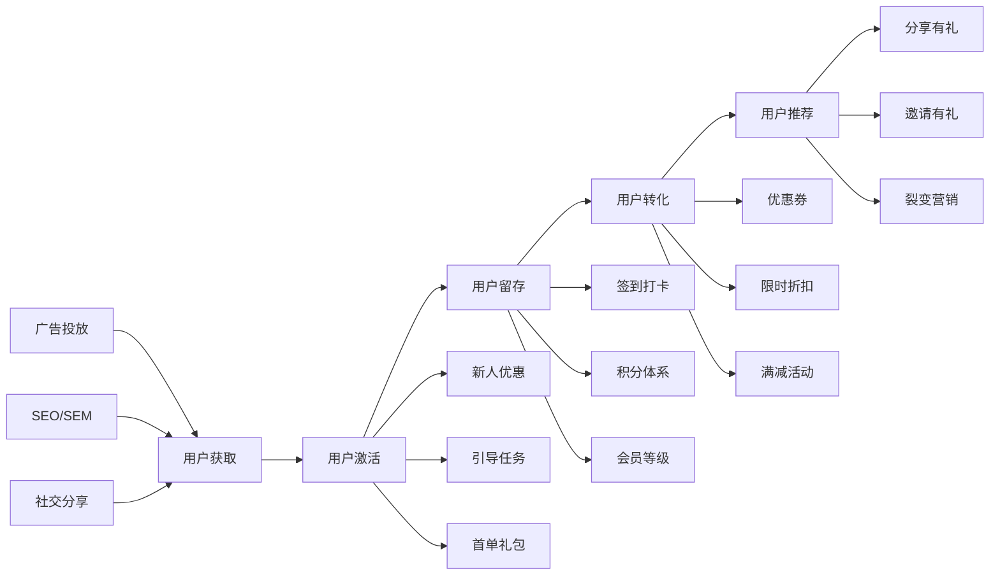
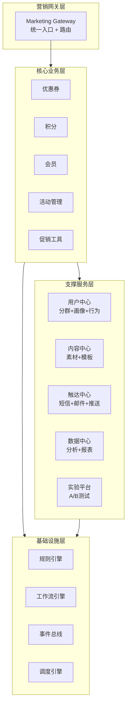
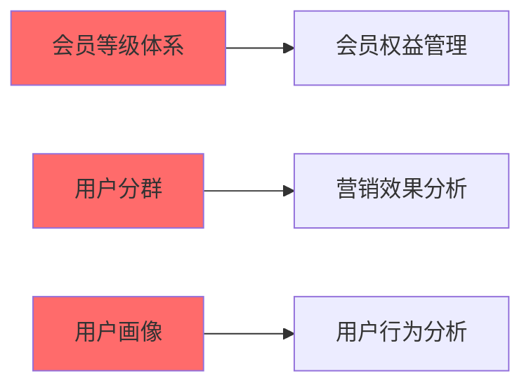
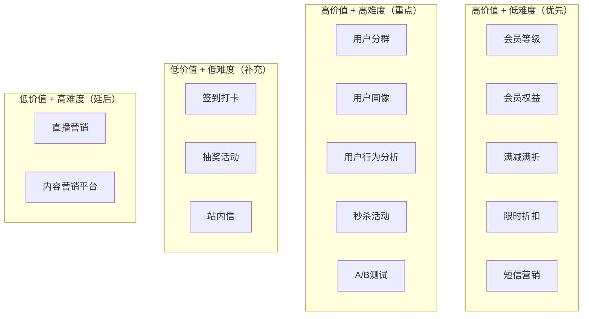

# Marketing 模块整体需求分析与架构评估

> 版本：1.0  
> 日期：2026-02-24  
> 模块路径：`src/module/marketing/`  
> 文档类型：整体架构评估与演进规划  
> 状态：现状评估 + 缺失模块识别 + 演进路线图

---

## 1. 概述

### 1.1 背景

本文档旨在从更高层面评估现有 marketing 模块的完整性，对标主流电商和 SaaS 平台的营销系统架构，识别缺失的核心模块，并提出中长期演进规划。

当前 marketing 模块包含 15 个子模块：

| 子模块      | 职责         | 状态    |
| ----------- | ------------ | ------- |
| coupon      | 优惠券管理   | ✅ 已有 |
| points      | 积分管理     | ✅ 已有 |
| approval    | 审批流程     | ✅ 已有 |
| asset       | 营销素材管理 | ✅ 已有 |
| config      | 营销配置     | ✅ 已有 |
| events      | 营销事件     | ✅ 已有 |
| gray        | 灰度发布     | ✅ 已有 |
| instance    | 营销活动实例 | ✅ 已有 |
| integration | 第三方集成   | ✅ 已有 |
| play        | 营销玩法     | ✅ 已有 |
| rule        | 营销规则引擎 | ✅ 已有 |
| scheduler   | 定时任务调度 | ✅ 已有 |
| stock       | 库存管理     | ✅ 已有 |
| template    | 营销模板     | ✅ 已有 |
| common      | 公共模块     | ✅ 已有 |

### 1.2 评估目标

1. 对标主流电商平台（淘宝、京东、拼多多、有赞）的营销系统架构
2. 对标主流 SaaS 平台（Shopify、HubSpot、Salesforce）的营销自动化设计
3. 识别现有模块的缺失功能和架构不足
4. 提出缺失模块的优先级和实施路线图

### 1.3 评估方法

- 功能对比矩阵：与主流平台逐项对比
- 业务场景覆盖度：评估是否覆盖完整的营销链路
- 架构完整性：评估是否具备营销系统的核心能力
- 扩展性：评估是否支持灵活的营销玩法扩展

---

## 2. 主流平台营销系统对标

### 2.1 功能对比矩阵

| 功能模块         | 本系统 | 淘宝 | 京东 | 拼多多 | 有赞 | Shopify | HubSpot | 差距评估   |
| ---------------- | ------ | ---- | ---- | ------ | ---- | ------- | ------- | ---------- |
| **基础营销工具** |        |      |      |        |      |         |         |            |
| 优惠券管理       | ✅     | ✅   | ✅   | ✅     | ✅   | ✅      | ✅      | 持平       |
| 积分管理         | ✅     | ✅   | ✅   | ✅     | ✅   | ✅      | ✅      | 持平       |
| 会员等级         | ❌     | ✅   | ✅   | ✅     | ✅   | ✅      | ✅      | 缺失（P0） |
| 满减满折         | ⚠️     | ✅   | ✅   | ✅     | ✅   | ✅      | ✅      | 部分（P1） |
| 限时折扣         | ⚠️     | ✅   | ✅   | ✅     | ✅   | ✅      | ✅      | 部分（P1） |
| 秒杀活动         | ❌     | ✅   | ✅   | ✅     | ✅   | ✅      | ❌      | 缺失（P1） |
| 拼团活动         | ❌     | ❌   | ❌   | ✅     | ✅   | ✅      | ❌      | 缺失（P2） |
| 砍价活动         | ❌     | ❌   | ❌   | ✅     | ✅   | ❌      | ❌      | 缺失（P2） |
| **营销自动化**   |        |      |      |        |      |         |         |            |
| 营销活动编排     | ✅     | ✅   | ✅   | ✅     | ✅   | ✅      | ✅      | 持平       |
| 规则引擎         | ✅     | ✅   | ✅   | ✅     | ✅   | ✅      | ✅      | 持平       |
| 用户分群         | ❌     | ✅   | ✅   | ✅     | ✅   | ✅      | ✅      | 缺失（P0） |
| 用户画像         | ❌     | ✅   | ✅   | ✅     | ✅   | ✅      | ✅      | 缺失（P0） |
| 自动化营销流程   | ⚠️     | ✅   | ✅   | ✅     | ✅   | ✅      | ✅      | 部分（P1） |
| A/B测试          | ❌     | ✅   | ✅   | ✅     | ✅   | ✅      | ✅      | 缺失（P1） |
| 灰度发布         | ✅     | ✅   | ✅   | ✅     | ✅   | ✅      | ✅      | 持平       |
| **内容营销**     |        |      |      |        |      |         |         |            |
| 营销素材管理     | ✅     | ✅   | ✅   | ✅     | ✅   | ✅      | ✅      | 持平       |
| 营销模板         | ✅     | ✅   | ✅   | ✅     | ✅   | ✅      | ✅      | 持平       |
| 短信营销         | ❌     | ✅   | ✅   | ✅     | ✅   | ✅      | ✅      | 缺失（P1） |
| 邮件营销         | ❌     | ✅   | ✅   | ✅     | ✅   | ✅      | ✅      | 缺失（P1） |
| 推送通知         | ❌     | ✅   | ✅   | ✅     | ✅   | ✅      | ✅      | 缺失（P1） |
| 站内信           | ❌     | ✅   | ✅   | ✅     | ✅   | ✅      | ✅      | 缺失（P1） |
| **社交营销**     |        |      |      |        |      |         |         |            |
| 分享有礼         | ❌     | ✅   | ✅   | ✅     | ✅   | ✅      | ❌      | 缺失（P1） |
| 邀请有礼         | ❌     | ✅   | ✅   | ✅     | ✅   | ✅      | ❌      | 缺失（P1） |
| 裂变营销         | ❌     | ✅   | ✅   | ✅     | ✅   | ✅      | ❌      | 缺失（P2） |
| 社交分享追踪     | ❌     | ✅   | ✅   | ✅     | ✅   | ✅      | ✅      | 缺失（P2） |
| **数据分析**     |        |      |      |        |      |         |         |            |
| 营销效果分析     | ⚠️     | ✅   | ✅   | ✅     | ✅   | ✅      | ✅      | 部分（P0） |
| 用户行为分析     | ❌     | ✅   | ✅   | ✅     | ✅   | ✅      | ✅      | 缺失（P0） |
| 转化漏斗分析     | ❌     | ✅   | ✅   | ✅     | ✅   | ✅      | ✅      | 缺失（P1） |
| ROI分析          | ❌     | ✅   | ✅   | ✅     | ✅   | ✅      | ✅      | 缺失（P1） |
| 实时数据看板     | ❌     | ✅   | ✅   | ✅     | ✅   | ✅      | ✅      | 缺失（P1） |
| **会员营销**     |        |      |      |        |      |         |         |            |
| 会员等级体系     | ❌     | ✅   | ✅   | ✅     | ✅   | ✅      | ✅      | 缺失（P0） |
| 会员权益管理     | ❌     | ✅   | ✅   | ✅     | ✅   | ✅      | ✅      | 缺失（P0） |
| 会员成长体系     | ❌     | ✅   | ✅   | ✅     | ✅   | ✅      | ✅      | 缺失（P1） |
| 会员生命周期管理 | ❌     | ✅   | ✅   | ✅     | ✅   | ✅      | ✅      | 缺失（P1） |
| **游戏化营销**   |        |      |      |        |      |         |         |            |
| 签到打卡         | ❌     | ✅   | ✅   | ✅     | ✅   | ✅      | ❌      | 缺失（P2） |
| 抽奖活动         | ❌     | ✅   | ✅   | ✅     | ✅   | ✅      | ❌      | 缺失（P2） |
| 任务系统         | ❌     | ✅   | ✅   | ✅     | ✅   | ✅      | ❌      | 缺失（P2） |
| 勋章系统         | ❌     | ✅   | ✅   | ✅     | ✅   | ❌      | ❌      | 缺失（P3） |

### 2.2 差距总结

根据对比矩阵，现有 marketing 模块存在以下主要差距：

#### 2.2.1 P0 级缺失（阻塞性，必须建设）

1. **会员等级体系**：缺少会员分级，无法实现差异化营销
2. **会员权益管理**：缺少会员权益配置，会员价值无法体现
3. **用户分群模块**：无法按条件筛选用户群体，精准营销受限
4. **用户画像模块**：缺少用户标签体系，无法个性化推荐
5. **营销效果分析**：现有分析能力不足，缺少完整的数据看板
6. **用户行为分析**：无法追踪用户行为，营销决策缺少数据支撑

#### 2.2.2 P1 级缺失（高优先级，近期建设）

1. **满减满折活动**：现有实现不完整，需要独立模块
2. **限时折扣活动**：缺少完整的限时促销能力
3. **秒杀活动模块**：高并发秒杀场景支持不足
4. **自动化营销流程**：现有编排能力有限，需要增强
5. **A/B测试模块**：无法进行营销策略测试
6. **短信营销模块**：缺少短信触达能力
7. **邮件营销模块**：缺少邮件营销能力
8. **推送通知模块**：缺少APP推送能力
9. **站内信模块**：缺少站内消息通知
10. **分享有礼模块**：缺少社交分享激励
11. **邀请有礼模块**：缺少用户裂变能力
12. **会员成长体系**：缺少会员成长路径设计
13. **会员生命周期管理**：缺少会员流失预警
14. **转化漏斗分析**：缺少转化路径分析
15. **ROI分析**：缺少营销投入产出分析
16. **实时数据看板**：缺少实时监控能力

#### 2.2.3 P2 级缺失（中优先级，中期建设）

1. **拼团活动模块**：社交电商玩法
2. **砍价活动模块**：社交电商玩法
3. **裂变营销模块**：病毒式传播能力
4. **社交分享追踪**：分享效果追踪
5. **签到打卡模块**：用户留存工具
6. **抽奖活动模块**：游戏化营销
7. **任务系统模块**：用户激励体系

#### 2.2.4 P3 级缺失（低优先级，长期建设）

1. **勋章系统**：用户荣誉体系
2. **直播营销**：直播带货能力
3. **内容营销平台**：内容创作与分发

---

## 3. 业务场景覆盖度评估

### 3.1 完整的营销链路

一个完整的电商/SaaS 平台营销链路应包含：



### 3.2 现有模块覆盖度

| 环节     | 覆盖度 | 缺失功能                           |
| -------- | ------ | ---------------------------------- |
| 用户获取 | 30%    | 缺少广告追踪、落地页、社交分享追踪 |
| 用户激活 | 50%    | 缺少新人礼包、引导任务             |
| 用户留存 | 40%    | 缺少签到、任务系统、会员等级       |
| 用户转化 | 60%    | 缺少秒杀、拼团、满减满折独立模块   |
| 用户推荐 | 20%    | 缺少分享有礼、邀请有礼、裂变营销   |
| 数据分析 | 30%    | 缺少用户画像、行为分析、转化漏斗   |

**总体覆盖度：约 40%**

---

## 4. 缺失模块详细分析

### 4.1 P0 级缺失模块

#### 4.1.1 会员等级体系（Member Level）

**业务价值**：

- 用户分层运营，差异化营销
- 提升用户粘性和忠诚度
- 增加用户生命周期价值（LTV）
- 促进用户消费升级

**核心功能**：

- 会员等级配置（普通、银卡、金卡、钻石等）
- 等级升级规则（消费金额、订单数、积分）
- 等级降级规则（时间衰减、活跃度）
- 等级权益配置（折扣、积分倍率、专属优惠）
- 等级展示与提醒

**技术要点**：

- 等级计算引擎
- 等级变更事件
- 等级权益应用
- 等级数据统计

**预估工时**：3-4 周

---

#### 4.1.2 会员权益管理（Member Benefits）

**业务价值**：

- 会员权益可配置化
- 提升会员价值感知
- 促进会员升级
- 增强用户粘性

**核心功能**：

- 权益类型配置（折扣、包邮、积分倍率、专属客服）
- 权益与等级关联
- 权益使用记录
- 权益到期提醒
- 权益统计分析

**技术要点**：

- 权益配置引擎
- 权益应用拦截器
- 权益使用追踪
- 权益效果分析

**预估工时**：2-3 周

---

#### 4.1.3 用户分群模块（User Segmentation）

**业务价值**：

- 精准营销，提升转化率
- 降低营销成本
- 个性化推荐
- 用户分层运营

**核心功能**：

- 分群条件配置（人口属性、行为属性、消费属性）
- 动态分群（实时计算）
- 静态分群（定时计算）
- 分群预览与导出
- 分群应用（营销活动、推送）

**技术要点**：

- 分群规则引擎
- 分群计算任务
- 分群缓存策略
- 分群数据同步

**预估工时**：4-5 周

---

#### 4.1.4 用户画像模块（User Profile）

**业务价值**：

- 360度了解用户
- 个性化推荐
- 精准营销
- 用户价值评估

**核心功能**：

- 用户标签体系（人口属性、行为标签、消费标签、兴趣标签）
- 标签自动打标
- 标签手动维护
- 标签权重计算
- 画像查询与展示

**技术要点**：

- 标签体系设计
- 标签计算引擎
- 标签存储（宽表 vs 标签表）
- 标签实时更新

**预估工时**：5-6 周

---

#### 4.1.5 营销效果分析增强（Marketing Analytics）

**业务价值**：

- 数据驱动决策
- 优化营销策略
- 提升ROI
- 发现营销机会

**核心功能**：

- 活动效果分析（参与人数、转化率、GMV）
- 优惠券效果分析（领取率、使用率、核销率）
- 积分效果分析（获取、消耗、留存）
- 渠道效果分析（来源、转化、成本）
- 实时数据看板

**技术要点**：

- 数据采集埋点
- 数据清洗与聚合
- OLAP数据库（ClickHouse）
- 可视化报表

**预估工时**：4-5 周

---

#### 4.1.6 用户行为分析（User Behavior Analytics）

**业务价值**：

- 了解用户行为路径
- 发现用户痛点
- 优化用户体验
- 提升转化率

**核心功能**：

- 行为事件追踪（浏览、点击、加购、下单）
- 行为路径分析
- 行为热力图
- 行为漏斗分析
- 行为留存分析

**技术要点**：

- 埋点SDK
- 事件采集与存储
- 行为分析算法
- 可视化展示

**预估工时**：5-6 周

---

### 4.2 P1 级缺失模块

#### 4.2.1 满减满折活动（Full Reduction）

**业务价值**：

- 提升客单价
- 促进多件购买
- 清理库存
- 提升GMV

**核心功能**：

- 满减规则配置（满100减10、满200减30）
- 满折规则配置（满3件8折、满5件7折）
- 阶梯优惠
- 商品范围限制
- 活动时间限制

**预估工时**：2-3 周

---

#### 4.2.2 限时折扣活动（Flash Sale）

**业务价值**：

- 制造紧迫感
- 促进快速下单
- 提升转化率
- 清理库存

**核心功能**：

- 折扣规则配置
- 时间段配置
- 商品范围配置
- 库存限制
- 倒计时展示

**预估工时**：2-3 周

---

#### 4.2.3 秒杀活动模块（Seckill）

**业务价值**：

- 高并发营销场景
- 制造抢购氛围
- 提升用户活跃度
- 引流爆款

**核心功能**：

- 秒杀商品配置
- 秒杀时间段配置
- 库存预扣
- 防刷机制
- 秒杀排队

**技术要点**：

- Redis库存预扣
- 消息队列削峰
- 分布式锁
- 限流降级

**预估工时**：4-5 周

---

#### 4.2.4 短信营销模块（SMS Marketing）

**业务价值**：

- 触达用户
- 促进转化
- 活动通知
- 用户召回

**核心功能**：

- 短信模板管理
- 短信发送（单发、群发）
- 短信变量替换
- 发送记录查询
- 短信效果分析

**预估工时**：2-3 周

---

#### 4.2.5 邮件营销模块（Email Marketing）

**业务价值**：

- 低成本触达
- 内容营销
- 用户培育
- 品牌传播

**核心功能**：

- 邮件模板管理
- 邮件发送（单发、群发）
- 邮件个性化
- 发送记录查询
- 邮件效果分析（打开率、点击率）

**预估工时**：3-4 周

---

## 5. 架构完整性评估

### 5.1 现有架构优势

1. **模块化设计**：15个子模块职责清晰，边界明确
2. **规则引擎**：支持灵活的营销规则配置
3. **活动编排**：支持复杂的营销活动组合
4. **灰度发布**：支持营销活动灰度测试
5. **审批流程**：支持营销活动审批
6. **定时调度**：支持定时任务执行
7. **库存管理**：支持营销库存管理
8. **第三方集成**：支持外部系统集成

### 5.2 现有架构不足

1. **缺少用户中心**：用户分群、画像、行为分析分散
2. **缺少数据中心**：营销数据分析能力不足
3. **缺少触达中心**：短信、邮件、推送能力缺失
4. **缺少会员中心**：会员等级、权益管理缺失
5. **缺少内容中心**：营销内容管理能力不足
6. **缺少实验平台**：A/B测试能力缺失

### 5.3 建议的目标架构



---

## 6. 演进路线图

### 6.1 第一阶段：P0 级核心能力建设（4-5 个月）

**目标**：补齐核心缺失模块，建立完整的用户运营体系

**建设内容**：

| 模块             | 工时   | 优先级 | 依赖关系     |
| ---------------- | ------ | ------ | ------------ |
| 会员等级体系     | 3-4 周 | P0-1   | 无           |
| 会员权益管理     | 2-3 周 | P0-2   | 会员等级体系 |
| 用户分群         | 4-5 周 | P0-3   | 无           |
| 用户画像         | 5-6 周 | P0-4   | 无           |
| 营销效果分析增强 | 4-5 周 | P0-5   | 所有营销模块 |
| 用户行为分析     | 5-6 周 | P0-6   | 无           |

**实施顺序**：



**里程碑**：

- M1（1.5 个月）：会员等级体系、会员权益管理上线
- M2（3 个月）：用户分群、用户画像上线
- M3（4.5 个月）：营销效果分析、用户行为分析上线

**验收标准**：

- 会员可按等级享受差异化权益
- 可按条件筛选用户群体
- 用户画像标签体系完整
- 营销数据可视化看板上线
- 用户行为路径可追踪

---

### 6.2 第二阶段：P1 级能力增强（3-4 个月）

**目标**：增强营销工具、触达能力、数据能力

**建设内容**：

| 模块         | 工时   | 优先级 | 依赖关系     |
| ------------ | ------ | ------ | ------------ |
| 满减满折活动 | 2-3 周 | P1-1   | 无           |
| 限时折扣活动 | 2-3 周 | P1-2   | 无           |
| 秒杀活动     | 4-5 周 | P1-3   | 库存管理     |
| 短信营销     | 2-3 周 | P1-4   | 用户分群     |
| 邮件营销     | 3-4 周 | P1-5   | 用户分群     |
| 推送通知     | 2-3 周 | P1-6   | 用户分群     |
| 站内信       | 2-3 周 | P1-7   | 无           |
| 分享有礼     | 3-4 周 | P1-8   | 优惠券       |
| 邀请有礼     | 3-4 周 | P1-9   | 优惠券       |
| A/B测试      | 4-5 周 | P1-10  | 灰度发布     |
| 转化漏斗分析 | 3-4 周 | P1-11  | 用户行为分析 |
| ROI分析      | 2-3 周 | P1-12  | 营销效果分析 |

**里程碑**：

- M4（1.5 个月）：满减满折、限时折扣、秒杀上线
- M5（2.5 个月）：短信、邮件、推送、站内信上线
- M6（3.5 个月）：分享有礼、邀请有礼、A/B测试上线
- M7（4 个月）：转化漏斗、ROI分析上线

---

### 6.3 第三阶段：P2 级功能完善（2-3 个月）

**目标**：完善社交营销、游戏化营销

**建设内容**：

| 模块         | 工时   | 优先级 | 依赖关系     |
| ------------ | ------ | ------ | ------------ |
| 拼团活动     | 4-5 周 | P2-1   | 订单模块     |
| 砍价活动     | 3-4 周 | P2-2   | 订单模块     |
| 裂变营销     | 4-5 周 | P2-3   | 分享有礼     |
| 社交分享追踪 | 2-3 周 | P2-4   | 用户行为分析 |
| 签到打卡     | 2-3 周 | P2-5   | 积分         |
| 抽奖活动     | 3-4 周 | P2-6   | 优惠券       |
| 任务系统     | 4-5 周 | P2-7   | 积分         |

---

### 6.4 第四阶段：P3 级增强（按需）

**目标**：游戏化、内容化

**建设内容**：

| 模块         | 工时   | 优先级 | 依赖关系 |
| ------------ | ------ | ------ | -------- |
| 勋章系统     | 3-4 周 | P3-1   | 任务系统 |
| 直播营销     | 6-8 周 | P3-2   | 直播模块 |
| 内容营销平台 | 8-10周 | P3-3   | CMS      |

---

## 7. 实施优先级与资源评估

### 7.1 优先级矩阵

按业务价值和实施难度评估：



### 7.2 资源需求评估

**人力需求**：

| 阶段     | 后端开发 | 前端开发 | 数据开发 | 测试 | 产品 | 总人月 |
| -------- | -------- | -------- | -------- | ---- | ---- | ------ |
| 第一阶段 | 2 人     | 1 人     | 1 人     | 1 人 | 0.5  | 22.5   |
| 第二阶段 | 2 人     | 1 人     | 1 人     | 1 人 | 0.5  | 18     |
| 第三阶段 | 2 人     | 1 人     | 0.5      | 1 人 | 0.5  | 12.5   |
| 第四阶段 | 1 人     | 1 人     | 0.5      | 0.5  | 0.5  | 10.5   |

**技能要求**：

- 后端：NestJS、TypeORM、BullMQ、规则引擎、高并发优化
- 前端：Vue3、Ant Design Vue、数据可视化（ECharts）
- 数据：ClickHouse、数据建模、ETL、数据分析
- 测试：接口测试、性能测试、A/B测试
- 产品：营销系统产品经验、用户运营经验

### 7.3 成本估算

**开发成本**：

- 第一阶段：22.5 人月 x 2 万 = 45 万
- 第二阶段：18 人月 x 2 万 = 36 万
- 第三阶段：12.5 人月 x 2 万 = 25 万
- 第四阶段：10.5 人月 x 2 万 = 21 万
- 总计：127 万

**基础设施成本**：

- ClickHouse集群：3-5 万/月
- 短信服务：0.05 元/条，预估 5 万/月
- 邮件服务：0.01 元/封，预估 1 万/月
- 推送服务：1-2 万/月
- CDN加速：2-3 万/月

**总成本**：约 160-200 万（含第一年运营成本）

---

## 8. 风险与挑战

### 8.1 技术风险

#### 8.1.1 高并发场景

**风险描述**：

- 秒杀、抽奖等高并发场景
- 库存超卖问题
- 系统雪崩风险

**应对措施**：

- Redis库存预扣
- 消息队列削峰
- 限流降级
- 分布式锁
- 压力测试

#### 8.1.2 数据一致性

**风险描述**：

- 营销活动与订单、库存的一致性
- 积分、优惠券的一致性
- 会员等级变更的一致性

**应对措施**：

- 分布式事务（SAGA）
- 最终一致性
- 补偿机制
- 对账机制

#### 8.1.3 性能瓶颈

**风险描述**：

- 用户画像计算耗时
- 用户分群计算耗时
- 营销数据分析慢

**应对措施**：

- 离线计算 + 实时计算
- 缓存策略
- OLAP数据库（ClickHouse）
- 数据分片

---

### 8.2 业务风险

#### 8.2.1 营销作弊

**风险描述**：

- 优惠券被刷
- 积分被刷
- 邀请有礼被刷
- 秒杀被刷

**应对措施**：

- 风控规则引擎
- 黑名单机制
- 行为分析
- 人机验证
- 限制规则

#### 8.2.2 营销成本失控

**风险描述**：

- 优惠券发放过多
- 积分发放过多
- 营销活动亏损

**应对措施**：

- 预算控制
- 成本预估
- 实时监控
- 自动熔断
- 审批流程

#### 8.2.3 用户体验

**风险描述**：

- 营销规则复杂
- 营销信息骚扰
- 营销活动不公平

**应对措施**：

- 规则简化
- 触达频次控制
- 用户偏好设置
- 公平性保障

---

### 8.3 项目风险

#### 8.3.1 进度风险

**风险描述**：

- 用户画像、分群开发复杂
- 数据分析开发耗时
- 需求变更频繁

**应对措施**：

- 预留 20% 缓冲时间
- 分阶段交付
- 需求冻结机制
- 每周进度同步

#### 8.3.2 人员风险

**风险描述**：

- 数据开发人员稀缺
- 营销产品经验不足
- 团队协作问题

**应对措施**：

- 提前招聘
- 外部顾问
- 技术培训
- 知识共享

---

## 9. 总结与建议

### 9.1 现状总结

现有 marketing 模块包含 15 个子模块，覆盖了优惠券、积分、活动编排、规则引擎等基础能力，但与主流电商/SaaS 平台相比，存在以下主要差距：

1. **用户运营能力不足**：缺少会员等级、用户分群、用户画像
2. **营销工具不完整**：缺少秒杀、拼团、满减满折独立模块
3. **触达能力缺失**：缺少短信、邮件、推送、站内信
4. **社交营销缺失**：缺少分享有礼、邀请有礼、裂变营销
5. **数据能力不足**：缺少用户行为分析、转化漏斗、ROI分析
6. **实验能力缺失**：缺少A/B测试平台

**总体覆盖度约 40%**，无法支撑完整的营销自动化需求。

---

### 9.2 核心建议

#### 9.2.1 短期建议（4-6 个月）

**优先建设 P0 级模块**，建立完整的用户运营体系：

1. **会员等级体系**（3-4 周）：用户分层运营基础
2. **会员权益管理**（2-3 周）：会员价值体现
3. **用户分群**（4-5 周）：精准营销基础
4. **用户画像**（5-6 周）：个性化推荐基础
5. **营销效果分析增强**（4-5 周）：数据驱动决策
6. **用户行为分析**（5-6 周）：用户洞察基础

**预期效果**：

- 用户运营体系完整
- 精准营销能力具备
- 数据驱动决策
- 业务场景覆盖度提升至 60%

---

#### 9.2.2 中期建议（6-12 个月）

**建设 P1 级模块**，增强营销工具、触达能力：

1. **满减满折、限时折扣、秒杀**：丰富营销工具
2. **短信、邮件、推送、站内信**：建立触达中心
3. **分享有礼、邀请有礼**：社交营销能力
4. **A/B测试**：实验平台
5. **转化漏斗、ROI分析**：数据分析增强

**预期效果**：

- 营销工具丰富
- 触达能力完善
- 社交营销能力具备
- 业务场景覆盖度提升至 80%

---

#### 9.2.3 长期建议（12-24 个月）

**建设 P2/P3 级模块**，完善游戏化、内容化：

1. **拼团、砍价、裂变营销**：社交电商玩法
2. **签到、抽奖、任务、勋章**：游戏化营销
3. **直播营销、内容营销平台**：内容化营销

**预期效果**：

- 营销玩法丰富
- 用户粘性提升
- 业务场景覆盖度提升至 95%

---

### 9.3 架构建议

#### 9.3.1 建立用户中心

**目标**：统一用户分群、画像、行为分析

**实现**：

```typescript
@Module({
  imports: [
    SegmentationModule, // 用户分群
    ProfileModule, // 用户画像
    BehaviorModule, // 行为分析
  ],
  controllers: [UserCenterController],
  providers: [UserCenterService],
})
export class UserCenterModule {}
```

---

#### 9.3.2 建立触达中心

**目标**：统一短信、邮件、推送、站内信

**实现**：

```typescript
@Module({
  imports: [SmsModule, EmailModule, PushModule, MessageModule],
  controllers: [ChannelController],
  providers: [ChannelService],
})
export class ChannelModule {}
```

---

#### 9.3.3 建立数据中心

**目标**：统一营销数据分析

**实现**：

```typescript
@Module({
  imports: [
    AnalyticsModule, // 效果分析
    FunnelModule, // 漏斗分析
    RoiModule, // ROI分析
    DashboardModule, // 数据看板
  ],
  controllers: [DataCenterController],
  providers: [DataCenterService],
})
export class DataCenterModule {}
```

---

### 9.4 实施建议

#### 9.4.1 分阶段交付

- 按优先级分阶段交付
- 每个阶段验收后再进入下一阶段
- 快速迭代，持续优化

#### 9.4.2 建立完善的测试体系

- 单元测试覆盖率 > 80%
- 集成测试覆盖核心流程
- 性能测试（秒杀、分群计算）
- A/B测试验证效果

#### 9.4.3 建立监控告警体系

- 营销活动监控（参与人数、转化率）
- 触达监控（发送成功率、到达率）
- 性能监控（接口耗时、队列积压）
- 成本监控（优惠券、积分发放）

#### 9.4.4 建立文档体系

- 需求文档（每个模块）
- 设计文档（每个模块）
- 接口文档（Swagger）
- 运营手册（营销玩法）

---

### 9.5 成功标准

**第一阶段成功标准**（4-5 个月）：

- [ ] 会员等级体系上线
- [ ] 用户可按条件分群
- [ ] 用户画像标签体系完整
- [ ] 营销数据看板上线
- [ ] 用户行为可追踪
- [ ] 精准营销转化率提升 30%

**第二阶段成功标准**（6-10 个月）：

- [ ] 秒杀活动上线，支持 10万+ QPS
- [ ] 短信、邮件、推送上线
- [ ] 分享有礼、邀请有礼上线
- [ ] A/B测试平台上线
- [ ] 营销ROI可计算
- [ ] 用户裂变率提升 50%

**第三阶段成功标准**（10-13 个月）：

- [ ] 拼团、砍价上线
- [ ] 签到、抽奖、任务上线
- [ ] 用户日活提升 40%
- [ ] 业务场景覆盖度 > 80%

---

## 10. 附录

### 10.1 参考资料

**主流平台营销系统**：

- 淘宝营销平台：https://open.taobao.com/
- 京东营销平台：https://open.jd.com/
- 有赞营销：https://www.youzan.com/
- Shopify Marketing：https://shopify.dev/
- HubSpot Marketing：https://www.hubspot.com/

**营销自动化**：

- Salesforce Marketing Cloud
- Adobe Marketing Cloud
- Marketo

---

### 10.2 术语表

| 术语       | 英文                   | 说明                         |
| ---------- | ---------------------- | ---------------------------- |
| 会员等级   | Member Level           | 用户分层体系                 |
| 用户分群   | User Segmentation      | 按条件筛选用户群体           |
| 用户画像   | User Profile           | 用户标签体系                 |
| 行为分析   | Behavior Analytics     | 用户行为追踪与分析           |
| 转化漏斗   | Conversion Funnel      | 转化路径分析                 |
| ROI        | Return on Investment   | 投资回报率                   |
| A/B测试    | A/B Testing            | 对比测试                     |
| 秒杀       | Seckill                | 限时抢购                     |
| 拼团       | Group Buy              | 多人成团购买                 |
| 砍价       | Bargain                | 邀请好友砍价                 |
| 裂变营销   | Viral Marketing        | 病毒式传播                   |
| 游戏化     | Gamification           | 游戏化设计                   |
| 营销自动化 | Marketing Automation   | 自动化营销流程               |
| 触达       | Reach                  | 触达用户（短信、邮件、推送） |
| LTV        | Lifetime Value         | 用户生命周期价值             |
| AARRR      | Acquisition Activation | 用户增长模型                 |

---

### 10.3 相关文档

**需求文档**：

- `docs/requirements/marketing/coupon/coupon-requirements.md`
- `docs/requirements/marketing/points/points-requirements.md`
- `docs/requirements/marketing/maas/maas-requirements.md`

**设计文档**：

- `docs/design/marketing/coupon/coupon-design.md`
- `docs/design/marketing/points/points-design.md`

**后端开发规范**：

- `.kiro/steering/backend-nestjs.md`

---

**文档结束**
