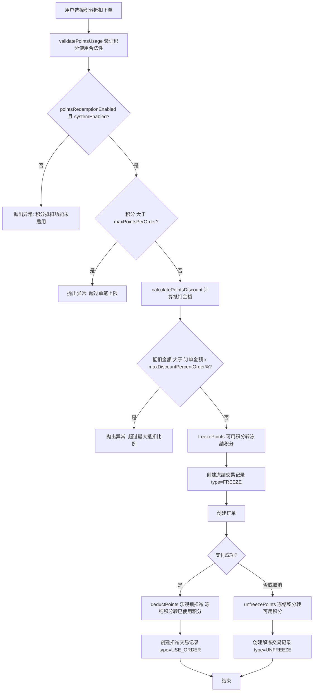
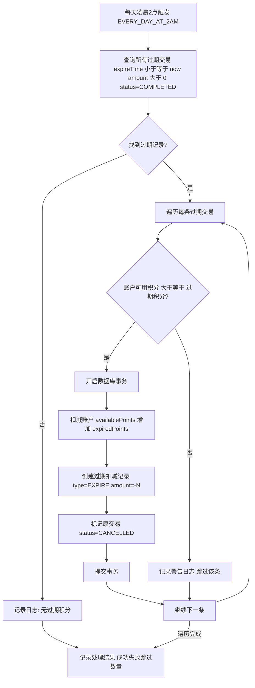
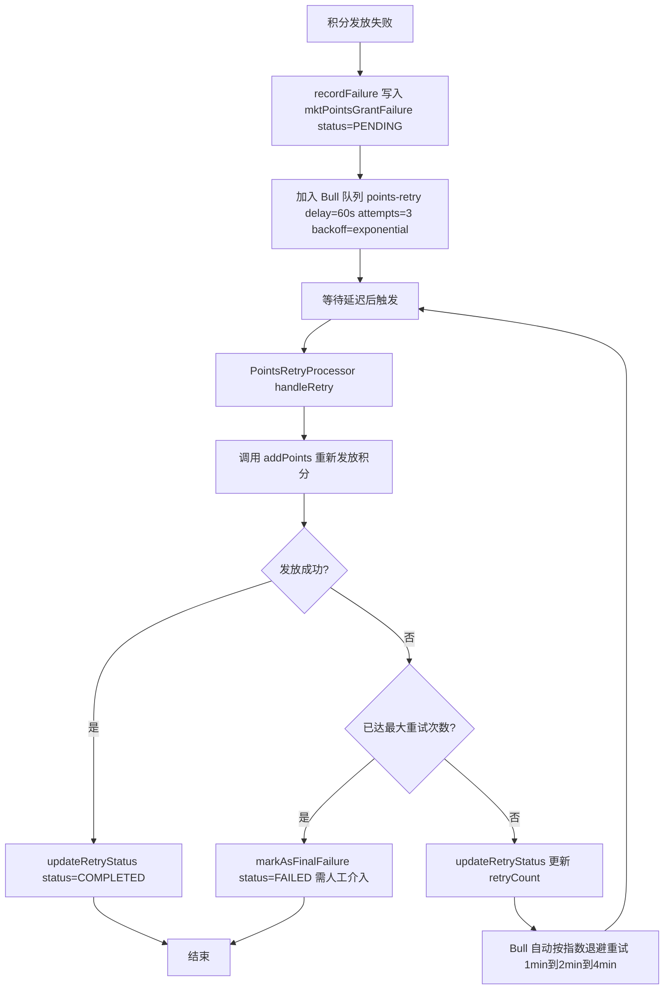
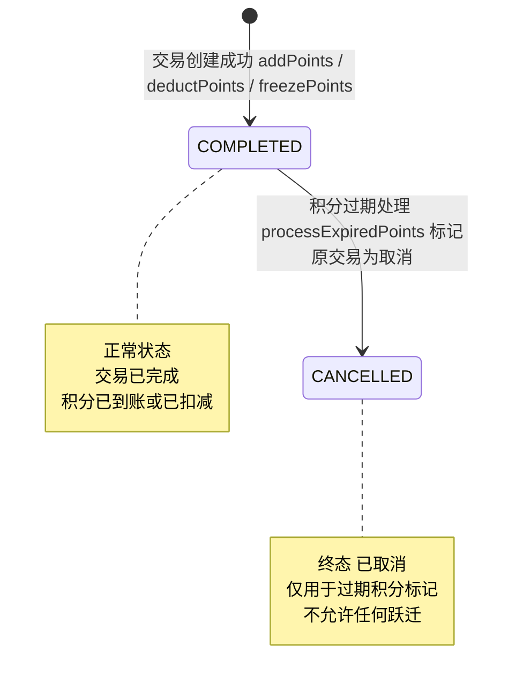
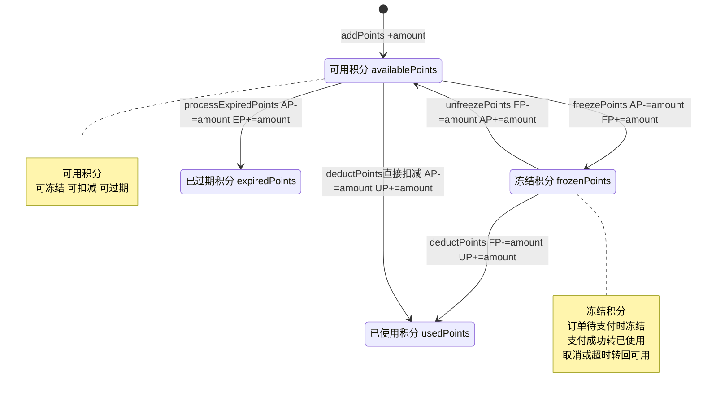

# 积分系统 — 需求文档

> 版本：1.0
> 日期：2026-02-22
> 模块路径：`src/module/marketing/points/`（account, rule, signin, task, degradation, management, statistics, scheduler, constants 九个子模块）
> 关联模块：`src/module/marketing/integration`（订单集成）、`src/module/client/order`（订单支付回调）、`src/module/marketing/coupon`（优惠券叠加）
> 状态：现状分析 + 演进规划

---

## 1. 概述

### 1.1 背景

积分系统是 Marketing 模块中独立于 MaaS 核心引擎和优惠券系统的业务域，负责积分的全生命周期管理：规则配置、积分获取、积分使用、积分过期。系统通过乐观锁保障积分扣减的并发安全，通过 Bull 队列实现积分发放失败的优雅降级与异步重试。

当前系统支持 4 种积分获取方式（消费、签到、任务、管理员调整）、3 种积分使用方式（订单抵扣、兑换优惠券、兑换商品），并具备积分过期自动处理、防套利计算、降级重试等高级能力。

核心子模块：

| 子模块      | 路径                  | 职责                                           | 核心类                             |
| ----------- | --------------------- | ---------------------------------------------- | ---------------------------------- |
| account     | `points/account/`     | 账户中心：积分余额管理、增减冻结解冻、交易记录 | `PointsAccountService`             |
| rule        | `points/rule/`        | 规则中心：积分获取/使用/抵扣规则配置           | `PointsRuleService`                |
| signin      | `points/signin/`      | 签到中心：每日签到、连续签到统计               | `PointsSigninService`              |
| task        | `points/task/`        | 任务中心：积分任务定义、完成与奖励发放         | `PointsTaskService`                |
| degradation | `points/degradation/` | 降级中心：发放失败记录、Bull 队列异步重试      | `PointsGracefulDegradationService` |
| management  | `points/management/`  | 管理中心：统计查询、排行榜、导出               | `PointsManagementController`       |
| statistics  | `points/statistics/`  | 统计中心：发放/使用/余额/过期多维统计          | `PointsStatisticsService`          |
| scheduler   | `points/scheduler/`   | 调度中心：过期积分自动处理                     | `PointsSchedulerService`           |
| constants   | `points/constants/`   | 常量定义：6 类 23 个错误码                     | `PointsErrorCode`                  |

### 1.2 目标

1. 完整描述积分系统 9 个子模块的功能现状与数据流
2. 分析系统自身的代码缺陷与架构不足
3. 分析与外部模块（订单、会员、优惠券）的跨模块设计缺陷
4. 对标市面主流积分系统（有赞、美团、星巴克），识别功能差距
5. 提出演进建议和优先级排序

### 1.3 范围

| 在范围内                                          | 不在范围内                               |
| ------------------------------------------------- | ---------------------------------------- |
| 积分账户管理 + 增减冻结（account）                | MaaS 核心引擎（`marketing/template` 等） |
| 积分规则配置 + 防套利计算（rule）                 | 优惠券系统（`marketing/coupon`）         |
| 每日签到 + 连续签到（signin）                     | 订单集成桥接（`marketing/integration`）  |
| 积分任务 CRUD + 完成奖励（task）                  | 前端 Admin Web 页面                      |
| 降级重试 + Bull 队列（degradation）               | C 端积分商城页面                         |
| 统计查询 + 排行榜 + 导出（management/statistics） | 第三方积分对接                           |
| 过期积分定时处理（scheduler）                     |                                          |

---

## 2. 角色与用例

> 图 1：积分系统用例图

````mermaid
graph LR
    subgraph 角色
        PA[平台管理员]
        SA[门店管理员]
        MB[C端会员]
        SYS[系统调度器]
    end

    subgraph 规则管理
        UC1[查询积分规则配置]
        UC2[更新积分规则配置 含校验]
    end

    subgraph 账户管理
        UC3[管理员调整积分 手动增加]
        UC4[查询积分账户列表 含会员信息]
        UC5[查询积分交易记录]
        UC6[获取或创建积分账户]
        UC7[查询积分余额 含即将过期]
        UC8[查询积分明细]
    end

    subgraph 积分获取
        UC9[消费获取积分 防套利计算]
        UC10[每日签到获取积分]
        UC11[完成任务获取积分]
    end

    subgraph 积分使用
        UC12[订单抵扣积分 冻结后扣减]
        UC13[验证积分使用合法性 上限+比例]
        UC14[计算积分抵扣金额]
    end

    subgraph 任务管理
        UC15[创建积分任务]
        UC16[更新积分任务]
        UC17[查询任务列表]
        UC18[删除积分任务]
        UC19[检查任务资格]
        UC20[查询完成记录]
    end

    subgraph 统计管理
        UC21[发放统计 按类型分组]
        UC22[使用统计 按类型分组]
        UC23[余额统计 全局汇总]
        UC24[过期统计]
        UC25[积分排行榜]
        UC26[导出积分明细]
    end

    subgraph 系统自动化
        UC27[过期积分自动处理 每天凌晨2点]
        UC28[发放失败异步重试 Bull队列 指数退避]
        UC29[最终失败标记 需人工介入]
    end
    subgraph 待建设功能
        UC33[积分商城兑换]
        UC34[连续签到奖励递增]
        UC35[积分等级体系]
    end UC35[积分等级体系]
    end

    SA --> UC1
    SA --> UC2
    SA --> UC3
    SA --> UC4
    SA --> UC5
    SA --> UC15
    SA --> UC16
    SA --> UC17
    SA --> UC18

    PA --> UC21
    PA --> UC22
    PA --> UC23
    PA --> UC24
    PA --> UC25
    PA --> UC26

    MB --> UC7
    MB --> UC8
    MB --> UC10
    MB --> UC11
    MB --> UC19
    MB --> UC20

    SYS --> UC6
    SYS --> UC9
    SYS --> UC12
    SYS --> UC13
    SYS --> UC14
    SYS --> UC27
    SYS --> UC28
    SYS --> UC29

    MB -.-> UC30
    MB -.-> UC31
    MB -.-> UC33
    SA -.-> UC34
    PA -.-> UC35

    style UC33 stroke-dasharray: 5 5
    style UC34 stroke-dasharray: 5 5
    style UC35 stroke-dasharray: 5 5
**角色说明**：

| 角色 | 职责 | 接口前缀 |
|------|------|----------|
| 平台管理员 | 查看统计数据、排行榜、导出积分明细 | `admin/marketing/points/statistics` |
| C 端会员 | 查询余额、签到、完成任务、使用积分抵扣 | `client/marketing/points/*`（已有 3 个 Controller，装饰器待规范化） ||
| C 端会员 | 查询余额、签到、完成任务、使用积分抵扣 | `client/marketing/points/*`（待建设） |
| 系统调度器 | 过期积分处理、发放失败重试；订单流程中自动计算/冻结/扣减积分 | 内部 Cron + Bull 队列 + Service 调用 |

---

## 3. 业务流程

### 3.1 消费获取积分流程

> 图 2：消费获取积分活动图

```mermaid
flowchart TD
    A[订单支付成功回调] --> B[获取积分规则配置]
    B --> C{orderPointsEnabled 且 systemEnabled?}
    C -->|否| D[不发放积分 结束]
    C -->|是| E{使用防套利计算?}
    E -->|是 有商品明细| F[calculateOrderPointsByItems 按商品明细+金额占比计算]
    E -->|否 仅订单金额| G[calculateOrderPoints floor 订单金额/orderPointsBase x orderPointsRatio]
    F --> H[计算每个商品的积分 itemBaseAmount x pointsRatio/100]
    G --> I[得到总积分数]
    H --> I
    I --> J{积分 大于 0?}
    J -->|否| D
    J -->|是| K[调用 addPoints type=EARN_ORDER]
    K --> L{发放成功?}
    L -->|是| M[创建交易记录 status=COMPLETED]
    L -->|否| N[调用降级服务 recordFailure]
    N --> O[写入 mktPointsGrantFailure status=PENDING]
    O --> P[加入 Bull 队列 points-retry 延迟1分钟 指数退避]
    M --> Q[结束]
    P --> Q
````

### 3.2 每日签到获取积分流程

> 图 3：每日签到活动图

```mermaid
flowchart TD
    A[会员发起签到请求] --> B[获取积分规则配置]
    B --> C{signinPointsEnabled 且 systemEnabled?}
    C -->|否| D[抛出异常: 签到功能未启用]
    C -->|是| E[查询今日签到记录 mktPointsTransaction type=EARN_SIGNIN createTime 在 today~tomorrow]
    E --> F{今日已签到?}
    F -->|是| G[抛出异常: 今日已签到]
    F -->|否| H[调用 addPoints amount=signinPointsAmount type=EARN_SIGNIN]
    H --> I[创建交易记录]
    I --> J[返回签到结果 含获得积分数]
```

### 3.3 积分使用流程（冻结后扣减）

> 图 4：积分订单使用活动图



### 3.4 积分过期处理流程

> 图 5：积分过期处理活动图



### 3.5 降级重试流程

> 图 6：积分发放降级重试活动图



---

## 4. 状态说明

### 4.1 积分交易状态机

> 图 7：积分交易状态图



**状态说明**：

| 状态      | 业务含义                                       | 是否终态 | 允许跃迁到            |
| --------- | ---------------------------------------------- | -------- | --------------------- |
| COMPLETED | 交易已完成：积分已到账（获取）或已扣减（使用） | 否       | CANCELLED（过期标记） |
| CANCELLED | 已取消：过期积分处理后标记原获取交易           | 是       | 无                    |

> 注：积分系统的核心复杂度不在交易状态流转（仅 2 个状态），而在账户 5 个余额字段的联动更新。详见 4.2。

### 4.2 积分账户余额联动

积分账户包含 5 个余额字段，满足恒等关系：`totalPoints = availablePoints + frozenPoints + usedPoints + expiredPoints`。

> 图 8：积分账户余额联动状态图



**余额操作与并发控制对比**：

| 操作                   | 使用乐观锁                   | 使用事务           | 问题                               |
| ---------------------- | ---------------------------- | ------------------ | ---------------------------------- |
| `addPoints`            | 否                           | 否                 | 与 deductPoints 策略不一致（D-12） |
| `deductPoints`         | 是（version 字段，3 次重试） | 否                 | 正常                               |
| `freezePoints`         | 否                           | 否                 | 并发场景可能余额不一致（D-11）     |
| `unfreezePoints`       | 否                           | 否                 | 同上（D-11）                       |
| `processExpiredPoints` | 否                           | 是（$transaction） | 正常（事务内原子操作）             |

### 4.3 降级记录状态机

降级记录状态通过 `mktPointsGrantFailure.status` 字段控制。

| 状态      | 含义                                   | 触发方式                          | 允许跃迁到          |
| --------- | -------------------------------------- | --------------------------------- | ------------------- |
| PENDING   | 待重试：已记录失败，等待 Bull 队列处理 | `recordFailure` 创建              | COMPLETED, FAILED   |
| COMPLETED | 重试成功：积分已补发                   | `updateRetryStatus(success=true)` | 无（终态）          |
| FAILED    | 最终失败：达到最大重试次数，需人工介入 | `markAsFinalFailure`              | PENDING（人工重试） |

---

## 5. 现有功能详述

### 5.1 接口清单

#### 5.1.1 积分账户（`points/account`）-- 3 个端点

| 接口     | 方法 | 路径                                   | 权限 | 说明                                       |
| -------- | ---- | -------------------------------------- | ---- | ------------------------------------------ |
| 调整积分 | POST | `/admin/marketing/points/adjust`       | 无   | 管理员手动增加积分                         |
| 账户列表 | GET  | `/admin/marketing/points/accounts`     | 无   | 分页查询，含会员信息（直接访问 umsMember） |
| 交易记录 | GET  | `/admin/marketing/points/transactions` | 无   | 分页查询积分交易流水                       |

#### 5.1.2 积分规则（`points/rule`）-- 2 个端点

| 接口     | 方法 | 路径                            | 权限 | 说明                     |
| -------- | ---- | ------------------------------- | ---- | ------------------------ |
| 查询规则 | GET  | `/admin/marketing/points/rules` | 无   | 获取当前租户积分规则配置 |
| 更新规则 | PUT  | `/admin/marketing/points/rules` | 无   | 更新规则配置，含字段校验 |

#### 5.1.3 积分任务（`points/task`）-- 4 个端点

| 接口     | 方法   | 路径                                | 权限 | 说明               |
| -------- | ------ | ----------------------------------- | ---- | ------------------ |
| 创建任务 | POST   | `/admin/marketing/points/tasks`     | 无   | 创建积分任务定义   |
| 更新任务 | PUT    | `/admin/marketing/points/tasks/:id` | 无   | 更新任务配置       |
| 任务列表 | GET    | `/admin/marketing/points/tasks`     | 无   | 分页查询任务列表   |
| 删除任务 | DELETE | `/admin/marketing/points/tasks/:id` | 无   | 硬删除（非软删除） |

#### 5.1.4 积分管理（`points/management`）-- 6 个端点

| 接口     | 方法 | 路径                                         | 权限 | 说明                   |
| -------- | ---- | -------------------------------------------- | ---- | ---------------------- |
| 发放统计 | GET  | `/admin/marketing/points/statistics/grant`   | 无   | 按类型分组统计发放数据 |
| 使用统计 | GET  | `/admin/marketing/points/statistics/usage`   | 无   | 按类型分组统计使用数据 |
| 余额统计 | GET  | `/admin/marketing/points/statistics/balance` | 无   | 全局汇总余额数据       |
| 过期统计 | GET  | `/admin/marketing/points/statistics/expired` | 无   | 过期积分统计           |
| 积分排行 | GET  | `/admin/marketing/points/statistics/ranking` | 无   | 按可用积分排行         |
| 导出明细 | GET  | `/admin/marketing/points/statistics/export`  | 无   | 导出积分明细 xlsx      |

> 注：15 个端点全部缺少 `@ApiBearerAuth`、`@RequirePermission`、`@Operlog` 装饰器，且使用 `@ApiOperation` 而非项目标准 `@Api` 装饰器。

#### 5.1.5 内部服务方法（无 HTTP 端点）

| 服务                               | 方法                                              | 说明                         |
| ---------------------------------- | ------------------------------------------------- | ---------------------------- |
| `PointsAccountService`             | `addPoints(dto)`                                  | 增加积分（获取类操作）       |
| `PointsAccountService`             | `deductPoints(dto)`                               | 扣减积分（乐观锁，3 次重试） |
| `PointsAccountService`             | `freezePoints(memberId, amount, relatedId)`       | 冻结积分（订单创建时）       |
| `PointsAccountService`             | `unfreezePoints(memberId, amount, relatedId)`     | 解冻积分（订单取消时）       |
| `PointsAccountService`             | `getBalance(memberId)`                            | 查询积分余额（含即将过期）   |
| `PointsAccountService`             | `getOrCreateAccount(memberId)`                    | 获取或创建积分账户           |
| `PointsRuleService`                | `calculateOrderPoints(orderAmount)`               | 计算消费积分（简单模式）     |
| `PointsRuleService`                | `calculateOrderPointsByItems(items, base, total)` | 计算消费积分（防套利模式）   |
| `PointsRuleService`                | `validatePointsUsage(amount)`                     | 验证积分使用合法性           |
| `PointsRuleService`                | `calculatePointsDiscount(amount)`                 | 计算积分抵扣金额             |
| `PointsSigninService`              | `signin(memberId)`                                | 每日签到                     |
| `PointsSigninService`              | `checkSigninStatus(memberId)`                     | 查询签到状态                 |
| `PointsTaskService`                | `completeTask(memberId, taskKey)`                 | 完成任务获取积分             |
| `PointsTaskService`                | `checkTaskEligibility(memberId, taskId)`          | 检查任务资格                 |
| `PointsGracefulDegradationService` | `recordFailure(data)`                             | 记录发放失败                 |
| `PointsGracefulDegradationService` | `updateRetryStatus(...)`                          | 更新重试状态                 |
| `PointsGracefulDegradationService` | `markAsFinalFailure(...)`                         | 标记最终失败                 |

### 5.2 积分交易类型

| 类型代码    | 名称       | 方向      | 触发方式         |
| ----------- | ---------- | --------- | ---------------- |
| EARN_ORDER  | 消费获取   | +（获取） | 订单支付成功回调 |
| EARN_SIGNIN | 签到获取   | +（获取） | 会员每日签到     |
| EARN_TASK   | 任务获取   | +（获取） | 完成积分任务     |
| EARN_ADMIN  | 管理员调整 | +（获取） | 管理员手动增加   |
| USE_ORDER   | 订单抵扣   | -（使用） | 订单支付时扣减   |
| USE_COUPON  | 兑换优惠券 | -（使用） | 积分兑换优惠券   |
| USE_PRODUCT | 兑换商品   | -（使用） | 积分兑换商品     |
| FREEZE      | 冻结       | -（冻结） | 订单创建时冻结   |
| UNFREEZE    | 解冻       | +（解冻） | 订单取消时解冻   |
| EXPIRE      | 过期       | -（过期） | 定时任务自动处理 |

### 5.3 积分规则配置字段

| 字段                      | 类型    | 说明                                      |
| ------------------------- | ------- | ----------------------------------------- |
| `systemEnabled`           | Boolean | 积分系统总开关                            |
| `orderPointsEnabled`      | Boolean | 消费获取积分开关                          |
| `orderPointsRatio`        | Decimal | 消费积分比例（每 base 元获得 ratio 积分） |
| `orderPointsBase`         | Decimal | 消费积分基数（元）                        |
| `signinPointsEnabled`     | Boolean | 签到获取积分开关                          |
| `signinPointsAmount`      | Int     | 每次签到获得积分数                        |
| `pointsRedemptionEnabled` | Boolean | 积分抵扣开关                              |
| `pointsRedemptionRatio`   | Decimal | 积分抵扣比例（ratio 积分 = base 元）      |
| `pointsRedemptionBase`    | Decimal | 积分抵扣基数（元）                        |
| `maxPointsPerOrder`       | Int     | 单笔订单最大使用积分数                    |
| `maxDiscountPercentOrder` | Int     | 单笔订单最大抵扣比例（%）                 |
| `pointsValidityEnabled`   | Boolean | 积分有效期开关                            |
| `pointsValidityDays`      | Int     | 积分有效天数                              |

### 5.4 积分账户字段

| 字段              | 类型 | 说明                     |
| ----------------- | ---- | ------------------------ |
| `totalPoints`     | Int  | 累计获得积分总数         |
| `availablePoints` | Int  | 当前可用积分             |
| `frozenPoints`    | Int  | 冻结中积分（订单待支付） |
| `usedPoints`      | Int  | 已使用积分               |
| `expiredPoints`   | Int  | 已过期积分               |
| `version`         | Int  | 乐观锁版本号             |

### 5.5 防套利机制

消费获取积分支持两种计算模式：

1. 简单模式（`calculateOrderPoints`）：`floor(订单金额 / orderPointsBase) * orderPointsRatio`
2. 防套利模式（`calculateOrderPointsByItems`）：按商品明细逐项计算，每个商品的积分 = `floor(itemBaseAmount / base) * ratio * (pointsRatio / 100)`，其中 `itemBaseAmount = baseAmount * (itemAmount / totalAmount)`

防套利模式防止用户通过拆单获取更多积分，确保积分与实际消费金额严格对应。

---

## 6. 现有逻辑不足分析

### 6.1 积分系统自身缺陷

| 编号 | 问题                                             | 严重度 | 子模块    | 详述                                                                                             |
| ---- | ------------------------------------------------ | ------ | --------- | ------------------------------------------------------------------------------------------------ |
| D-1  | 所有 Controller 缺少 `@ApiBearerAuth`            | P1     | 全部      | 4 个 Controller 均缺少 `@ApiBearerAuth('Authorization')` 装饰器，Swagger 文档不显示认证要求。    |
| D-2  | 所有 Controller 缺少 `@RequirePermission`        | P0     | 全部      | 15 个端点均无权限控制装饰器，任何已登录用户可执行所有操作（含积分调整、导出等敏感操作）。        |
| D-3  | 所有写操作缺少 `@Operlog`                        | P1     | 全部      | 积分调整、规则更新、任务创建/更新/删除等写操作未记录操作日志，无法审计追踪。                     |
| D-4  | 所有 Controller 使用 `@ApiOperation` 而非 `@Api` | P1     | 全部      | 项目标准使用 `@Api` 装饰器（支持 `isPager` 等扩展），当前 15 个端点均使用原生 `@ApiOperation`。  |
| D-5  | 错误码定义但未使用                               | P1     | constants | `PointsErrorCode` 定义了 6 类 23 个错误码和对应消息，但所有 Service 中使用硬编码字符串抛出异常。 |
| D-6  | 签到连续天数 N+1 查询                            | P1     | signin    | `calculateContinuousDays` 逐天查询数据库判断是否签到，最多执行 100 次 DB 查询。                  |
| D-7  | 任务完成记录 N+1 查询                            | P1     | task      | `getUserCompletions` 对每条完成记录逐个查询任务信息，应改为 `WHERE IN` 批量查询。                |

| D-8 | 导出无数量限制 | P1 | statistics | `exportPointsDetails` 使用 `findMany` 无分页限制，大数据量时可能导致内存溢出。 |
| D-9 | 定时任务无分布式锁 | P1 | scheduler | `processExpiredPoints` 无分布式锁，多实例部署时同一批过期积分可能被多个节点同时处理。 |
| D-10 | 定时任务 findMany 无分页 | P1 | scheduler | `processExpiredPoints` 一次性加载所有过期交易记录，大数据量时可能 OOM。 |
| D-11 | 冻结/解冻未使用乐观锁 | P0 | account | `freezePoints` 和 `unfreezePoints` 直接更新余额字段，未使用 `updateWithOptimisticLock`，并发场景下可能导致余额不一致。 |
| D-12 | `addPoints` 未使用乐观锁 | P2 | account | `addPoints` 直接更新余额，与 `deductPoints` 的乐观锁策略不一致。 |
| X-2 | C 端 Controller 装饰器不规范 | P1 | points -> client | `client/marketing/points/` 下已有 3 个 C 端 Controller（account、signin、task），但存在以下问题：(1) 使用 `@ApiOperation` 而非项目标准 `@Api` 装饰器；(2) 缺少 `@ApiBearerAuth('Authorization')` 装饰器；(3) 缺少 `/** @tenantScope TenantScoped */` JSDoc 注解。 |
| D-14 | `completeTask` 非事务 | P0 | task | 发放积分和记录完成是两个独立操作，非事务包裹。若发放成功但记录失败，用户可重复完成任务。 |

### 6.2 跨模块缺陷

| 编号 | 问题                                      | 严重度                                                                                                                                                                                                                                                               | 涉及模块              | 详述                                                                                                            |
| ---- | ----------------------------------------- | -------------------------------------------------------------------------------------------------------------------------------------------------------------------------------------------------------------------------------------------------------------------- | --------------------- | --------------------------------------------------------------------------------------------------------------- |
| X-1  | 直接访问 `umsMember` 表                   | P1                                                                                                                                                                                                                                                                   | account -> ums        | `getAccountsForAdmin` 直接 `prisma.umsMember.findMany` 查询会员信息，绕过会员模块的 Service 层。                |
| X-2  | 无 C 端专用接口                           | P1                                                                                                                                                                                                                                                                   | points -> client      | 签到、余额查询、任务列表等 C 端能力仅为 Service 内部方法，未在 `client/marketing/points/` 下创建薄 Controller。 |
| X-3  | 与 `marketing/integration` 的对接方式隐式 | P2                                                                                                                                                                                                                                                                   | points -> integration | 调用时机、错误处理策略、参数约定未在代码中显式定义。                                                            |
| A-1  | C 端接口层装饰器不规范                    | `client/marketing/points/` 下已有 3 个 C 端 Controller（`ClientPointsAccountController`、`ClientPointsSigninController`、`ClientPointsTaskController`），但均使用 `@ApiOperation` 而非 `@Api`，缺少 `@ApiBearerAuth`，缺少 `@tenantScope` 注解，需统一对齐项目规范。 |
| X-5  | 未集成事件系统                            | P1                                                                                                                                                                                                                                                                   | points -> events      | 积分的获取、使用、过期等关键节点未发送事件到 `marketing/events`。                                               |
| X-6  | 积分商城兑换未实现                        | P2                                                                                                                                                                                                                                                                   | points -> product     | 交易类型定义了 `USE_PRODUCT`（积分兑换商品），但无对应的实现代码。                                              |

### 6.3 架构层面不足

| 编号 | 问题               | 详述                                                                                          |
| ---- | ------------------ | --------------------------------------------------------------------------------------------- |
| A-1  | 无 C 端接口层      | 签到、余额、任务等 C 端能力仅为 Service 方法，缺少 `client/marketing/points/` 薄 Controller。 |
| A-2  | 无连续签到递增奖励 | 每次签到固定获得 `signinPointsAmount` 积分，无递增机制。市面主流系统均支持连续签到额外奖励。  |
| A-3  | 无积分等级体系     | 无基于积分累计的会员等级划分，缺少等级权益（如高等级用户积分倍率加成）。                      |
| A-4  | 无积分商城         | `USE_PRODUCT` 类型已定义但无实现，缺少积分兑换商品的完整流程。                                |
| A-5  | 无事件驱动         | 积分变动未发送事件，与 MaaS 引擎的事件驱动架构不一致。                                        |
| A-6  | 无积分过期提醒     | 积分即将过期时无通知机制，用户可能错过使用时机。                                              |
| A-7  | 统计维度单一       | 仅有按类型分组的发放/使用统计和排行榜，缺少按时段、按门店的多维分析。                         |
| A-8  | 无风控机制         | 无积分获取频率限制、异常积分变动告警、单日获取上限等风控能力。                                |
| A-9  | 无冻结超时自动解冻 | 订单创建时冻结积分，若订单长时间未支付也未取消，冻结积分将永久锁定。                          |

---

## 7. 市面主流积分系统对标

### 7.1 功能对比矩阵

| 功能                                  | 本系统                | 有赞积分 | 星巴克星星 | 美团商家版 | 差距评估     |
| ------------------------------------- | --------------------- | -------- | ---------- | ---------- | ------------ |
| 4 种获取方式（消费/签到/任务/管理员） | 有                    | 有       | 有         | 有         | 持平         |
| 3 种使用方式（订单/优惠券/商品）      | 部分（仅订单实现）    | 有       | 有         | 有         | 差距（P2）   |
| 积分账户 5 字段余额管理               | 有                    | 有       | 有         | 有         | 持平         |
| 乐观锁并发控制                        | 有（仅 deductPoints） | 有       | 有         | 有         | 部分（D-11） |
| 防套利计算（按商品明细）              | 有                    | 有       | 有         | 有         | 持平         |
| 积分过期自动处理                      | 有                    | 有       | 有         | 有         | 持平         |
| 降级重试（Bull 队列）                 | 有                    | 有       | 有         | 有         | 持平         |
| 积分规则可配置                        | 有                    | 有       | 有         | 有         | 持平         |
| 统计 + 排行榜 + 导出                  | 有                    | 有       | 有         | 有         | 持平         |
| 权限控制                              | 无                    | 有       | 有         | 有         | 缺失（P0）   |
| 操作日志审计                          | 无                    | 有       | 有         | 有         | 缺失（P1）   |
| C 端专用接口                          | 有（装饰器待规范）    | 有       | 有         | 有         | 部分（P1）   |
| 连续签到递增奖励                      | 无                    | 有       | 有         | 有         | 缺失（P1）   |

| 积分等级体系 | 无 | 有 | 有（金/玉/绿星） | 有 | 缺失（P2） |
| 积分商城兑换 | 无 | 有 | 有 | 有 | 缺失（P2） |
| 事件驱动 | 无 | 有 | 有 | 有 | 缺失（P1） |
| 积分过期提醒 | 无 | 有 | 有 | 无 | 缺失（P2） |
| 风控机制 | 无 | 有 | 有 | 有 | 缺失（P2） |
| 积分转赠 | 无 | 无 | 无 | 无 | 持平（低优） |
| 冻结超时自动解冻 | 无 | 有 | 有 | 有 | 缺失（P2） |
| 分布式锁（定时任务） | 无 | 有 | 有 | 有 | 缺失（P1） |

### 7.2 差距总结

本系统在积分核心流程（规则配置、积分获取、积分使用、积分过期）上功能完整，乐观锁 + Bull 队列降级的技术方案设计合理。防套利计算（按商品明细 + 金额占比）是亮点。主要差距集中在：

2. 架构规范偏离（P1）：C 端接口装饰器不规范、跨模块直接访问 umsMember 表、错误码未使用、N+1 查询
3. 架构规范偏离（P1）：无 C 端接口层、跨模块直接访问 umsMember 表、错误码未使用、N+1 查询
4. 运营能力不足（P1-P2）：无签到递增、无积分等级、无积分商城、无事件驱动
5. 稳定性风险（P1）：定时任务无分布式锁且无分页、导出无限制

---

## 8. 验收标准

### 8.1 现有功能验收

| 编号  | 验收条件                                                                                         | 状态   |
| ----- | ------------------------------------------------------------------------------------------------ | ------ |
| AC-1  | `addPoints` 正确增加 `totalPoints` 和 `availablePoints`                                          | 已通过 |
| AC-2  | `deductPoints` 使用乐观锁（version 字段），最多重试 3 次                                         | 已通过 |
| AC-3  | `deductPoints` 余额不足时抛出异常                                                                | 已通过 |
| AC-4  | `freezePoints` 正确转移 `availablePoints` 到 `frozenPoints`                                      | 已通过 |
| AC-5  | `unfreezePoints` 正确转移 `frozenPoints` 回 `availablePoints`                                    | 已通过 |
| AC-6  | 恒等关系始终成立：`totalPoints = availablePoints + frozenPoints + usedPoints + expiredPoints`    | 已通过 |
| AC-7  | 消费积分计算：`floor(orderAmount / base) * ratio`                                                | 已通过 |
| AC-8  | 防套利计算：按商品明细 + 金额占比逐项计算                                                        | 已通过 |
| AC-9  | 签到时校验 `signinPointsEnabled` 和 `systemEnabled`                                              | 已通过 |
| AC-10 | 签到时校验今日是否已签到（同一天不可重复签到）                                                   | 已通过 |
| AC-11 | 积分使用验证：`maxPointsPerOrder` 上限 + `maxDiscountPercentOrder` 比例                          | 已通过 |
| AC-12 | 积分抵扣金额计算：`amount * (redemptionBase / redemptionRatio)`                                  | 已通过 |
| AC-13 | 降级记录：发放失败时写入 `mktPointsGrantFailure`（status=PENDING）                               | 已通过 |
| AC-14 | Bull 队列：延迟 60s，最多 3 次重试，指数退避                                                     | 已通过 |
| AC-15 | 重试成功：降级记录 status 更新为 COMPLETED                                                       | 已通过 |
| AC-16 | 最终失败：降级记录 status 更新为 FAILED                                                          | 已通过 |
| AC-17 | 过期处理：每天凌晨 2 点扫描过期交易                                                              | 已通过 |
| AC-18 | 过期处理：事务内扣减 availablePoints、增加 expiredPoints、创建 EXPIRE 记录、标记原交易 CANCELLED | 已通过 |
| AC-19 | 规则更新含字段校验（ratio > 0, base > 0 等）                                                     | 已通过 |
| AC-20 | 任务完成时校验资格（isEnabled、maxCompletions、isRepeatable）                                    | 已通过 |

### 8.2 待修复验收

| 编号  | 验收条件                                                                         | 状态   | 对应缺陷 |
| ----- | -------------------------------------------------------------------------------- | ------ | -------- |
| AC-21 | 所有 Controller 添加 `@ApiBearerAuth` 和 `@RequirePermission`                    | 未实现 | D-1, D-2 |
| AC-22 | 所有写操作添加 `@Operlog` 装饰器                                                 | 未实现 | D-3      |
| AC-23 | 所有 Controller 使用 `@Api` 替代 `@ApiOperation`                                 | 未实现 | D-4      |
| AC-24 | Service 中使用 `PointsErrorCode` 替代硬编码字符串                                | 未实现 | D-5      |
| AC-25 | 签到连续天数改为单次查询 + 内存计算（消除 N+1）                                  | 未实现 | D-6      |
| AC-26 | 任务完成记录改为 `WHERE IN` 批量查询（消除 N+1）                                 | 未实现 | D-7      |
| AC-27 | 导出接口添加数量限制（最大 10000 条或异步导出）                                  | 未实现 | D-8      |
| AC-28 | 定时任务添加分布式锁防止多实例重复处理                                           | 未实现 | D-9      |
| AC-29 | 定时任务改为分批处理（每批 500 条）                                              | 未实现 | D-10     |
| AC-30 | `freezePoints` 和 `unfreezePoints` 添加乐观锁                                    | 未实现 | D-11     |
| AC-31 | 任务删除改为软删除                                                               | 未实现 | D-13     |
| AC-34 | C 端 Controller 统一使用 `@Api`、添加 `@ApiBearerAuth`、添加 `@tenantScope` 注解 | 未实现 | X-2, A-1 |
| AC-33 | 消除对 `umsMember` 表的直接访问，改用 `MemberService`                            | 未实现 | X-1      |
| AC-34 | 创建 `client/marketing/points/` C 端薄 Controller                                | 未实现 | X-2      |

---

## 9. 演进建议与待办

### 9.1 第一阶段：安全基线 + 核心修复（1-2 周）

| 编号 | 任务                                                         | 对应缺陷  | 预估工时 |
| ---- | ------------------------------------------------------------ | --------- | -------- |
| T-1  | 所有 Controller 添加 `@ApiBearerAuth` + `@RequirePermission` | D-1, D-2  | 2h       |
| T-2  | 所有写操作添加 `@Operlog`                                    | D-3       | 1h       |
| T-3  | 所有 Controller 使用 `@Api` 替代 `@ApiOperation`             | D-4       | 1h       |
| T-4  | Service 中统一使用 `PointsErrorCode` + 辅助函数              | D-5       | 3h       |
| T-5  | 定时任务添加分布式锁 + 分批处理                              | D-9, D-10 | 2h       |
| T-6  | `completeTask` 添加 `@Transactional()` 事务包裹              | D-14      | 0.5h     |
| T-7  | `freezePoints` / `unfreezePoints` 添加乐观锁                 | D-11      | 2h       |
| T-8  | 消除对 `umsMember` 表的直接访问                              | X-1       | 1h       |

### 9.2 第二阶段：架构规范对齐（2-3 周）

| T-9 | C 端 Controller 装饰器规范化（`@Api` + `@ApiBearerAuth` + `@tenantScope`） | X-2, A-1 | 0.5d |
| 编号 | 任务 | 对应缺陷 | 预估工时 |
|------|------|----------|----------|
| T-9 | 创建 `client/marketing/points/` C 端薄 Controller | X-2, A-1 | 2d |
| T-10 | 签到连续天数 N+1 优化（单次查询 + 内存计算） | D-6 | 0.5d |
| T-11 | 任务完成记录 N+1 优化（WHERE IN 批量查询） | D-7 | 0.5d |
| T-12 | 导出接口添加数量限制 + 异步导出方案 | D-8 | 1d |
| T-13 | 任务删除改为软删除 | D-13 | 0.5d |
| T-14 | 添加事件驱动（积分获取/使用/过期事件） | X-5, A-5 | 2d |
| T-15 | 明确与 `marketing/integration` 的对接契约 | X-3 | 1d |

### 9.3 第三阶段：运营能力增强（1-2 月）

| 编号 | 任务                                               | 对应缺陷 | 预估工时 |
| ---- | -------------------------------------------------- | -------- | -------- |
| T-16 | 连续签到递增奖励（规则表新增 `signinBonusConfig`） | A-2      | 2-3d     |
| T-17 | 积分等级体系（等级定义 + 权益配置 + 倍率加成）     | A-3      | 5-7d     |
| T-18 | 积分商城兑换（商品列表 + 兑换 + 库存 + 履约）      | A-4      | 5-7d     |
| T-19 | 积分兑换优惠券（对接 coupon 模块）                 | X-4      | 2-3d     |
| T-20 | 多维统计分析（按时段/门店/类型）                   | A-7      | 3-5d     |
| T-21 | 冻结超时自动解冻（定时任务扫描 + 配置化超时时间）  | A-9      | 1-2d     |

### 9.4 第四阶段：体验优化（3-6 月）

| 编号 | 任务                                           | 说明           |
| ---- | ---------------------------------------------- | -------------- |
| T-22 | 风控机制（获取频率限制 + 异常告警 + 单日上限） | 防止积分刷取   |
| T-23 | 积分过期提醒（到期前 N 天推送通知）            | 提升积分使用率 |
| T-24 | `addPoints` 添加乐观锁（与 deductPoints 一致） | 并发一致性     |
| T-25 | 积分转赠（用户间转移积分）                     | 社交裂变能力   |
| T-26 | 排行榜增强（周榜/月榜 + Redis 缓存）           | 运营活动支撑   |

### 9.5 关键路径

```
T-1(权限) -> T-6(事务) -> T-7(乐观锁) -> T-5(分布式锁) -> T-9(C端接口) -> T-14(事件驱动) -> T-16(签到递增) -> T-17(积分等级) -> T-18(积分商城)
```

**优先级总结**：

| P1  | 7 项 | 架构对齐（C 端装饰器规范化 + N+1 优化 + 导出限制 + 事件驱动 + 集成契约）    | 2-3 周 |
| --- | ---- | --------------------------------------------------------------------------- | ------ |
| P0  | 8 项 | 安全基线（权限 + 日志 + 错误码）+ 核心修复（事务 + 乐观锁 + 分布式锁）      | 1-2 周 |
| P1  | 7 项 | 架构对齐（C 端接口 + N+1 优化 + 导出限制 + 事件驱动 + 集成契约）            | 2-3 周 |
| P2  | 6 项 | 运营增强（签到递增 + 积分等级 + 积分商城 + 多维统计 + 过期提醒 + 冻结超时） | 1-2 月 |
| P3  | 5 项 | 体验优化（风控 + 转赠 + 排行榜增强 + 降级事件 + addPoints 乐观锁）          | 3-6 月 |
