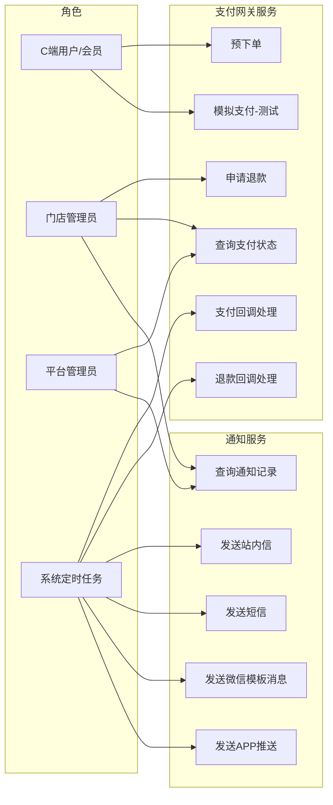
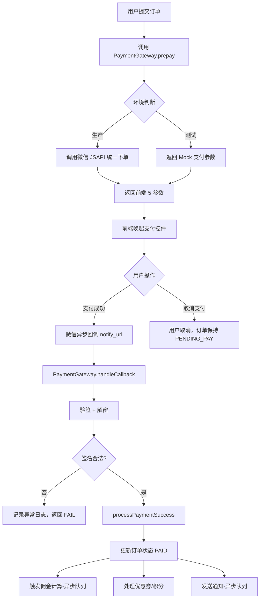
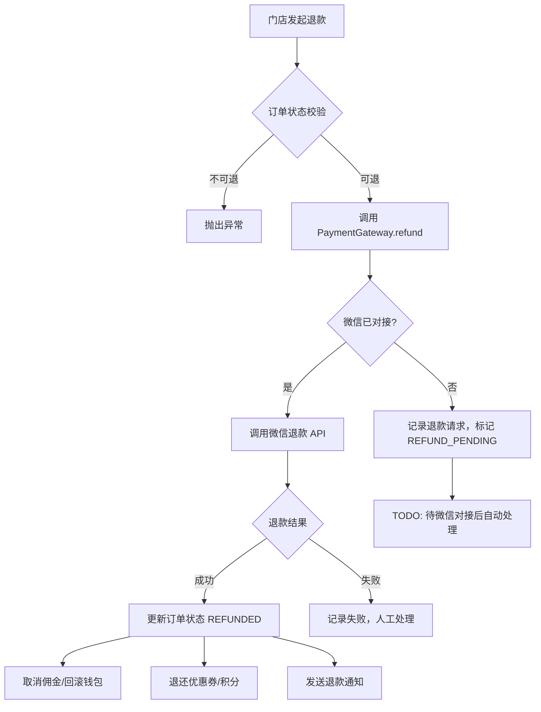
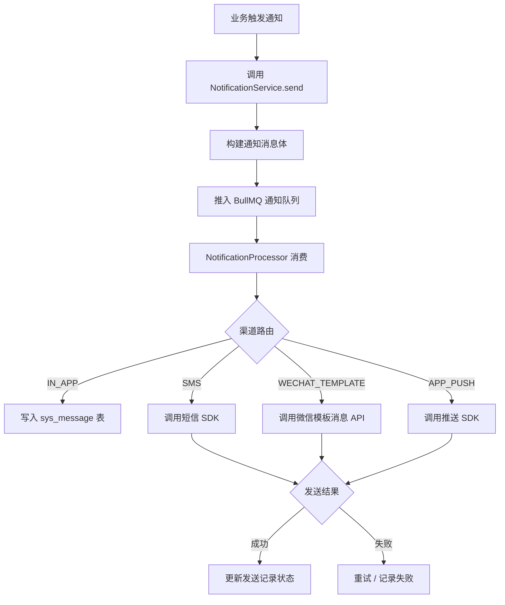
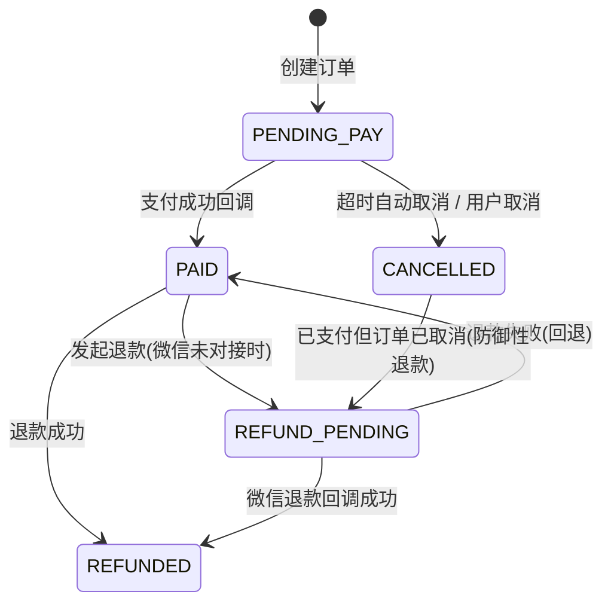
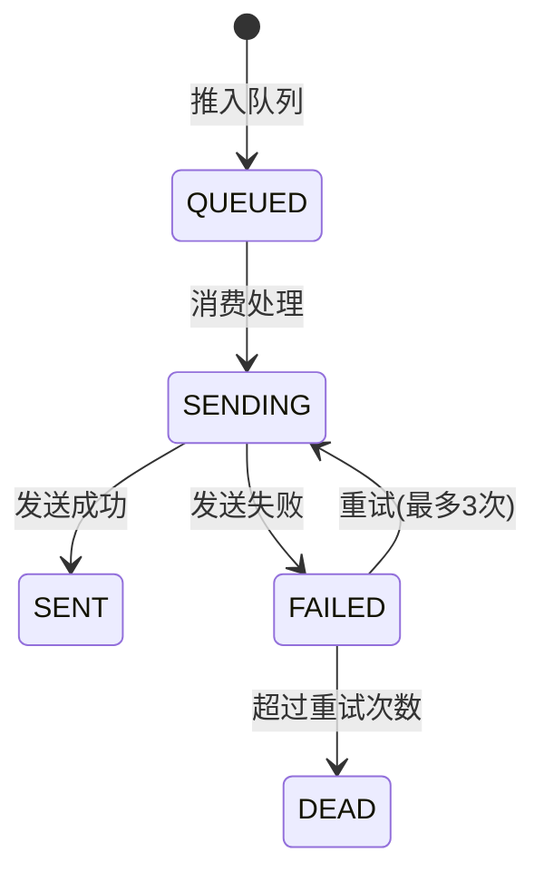

# 支付服务模块化抽离 — 需求文档

> 版本：1.0  
> 日期：2026-02-22  
> 状态：草案

---

## 1. 概述

### 1.1 背景

当前系统的支付逻辑直接嵌入在 `client/payment/payment.service.ts` 中，仅支持微信支付（且尚未对接生产环境），退款逻辑散落在 `store/order` 和 `client/payment` 两处。通知能力（SMS、站内信、推送）以 Stub 形式存在于 `MessageService` 中，无法复用。

参考[通用服务抽离](https://developer.aliyun.com/article/657562)的设计思路：当多个业务模块需要相同能力时，应将该能力抽离为独立通用服务，对外提供统一接口，实现可复用、易维护、易拓展。

### 1.2 目标

1. 将支付能力（预下单、回调验签、退款）抽离为独立的 `PaymentGatewayService`，与具体业务解耦
2. 将通知能力（SMS、站内信、微信模板消息、APP 推送）抽离为独立的 `NotificationService`
3. 为后续接入支付宝、银联等支付渠道预留扩展点
4. 标记当前因微信支付文档未对接而无法完成的功能点

### 1.3 范围

| 在范围内                   | 不在范围内                                |
| -------------------------- | ----------------------------------------- |
| 支付网关服务抽离与接口定义 | 微信支付 API 的实际对接（待微信文档就绪） |
| 通知服务抽离与接口定义     | 支付宝/银联等其他支付渠道实现             |
| 退款流程标准化             | 对账系统                                  |
| 现有代码 TODO 标注         | 财务报表                                  |

---

## 2. 角色与用例

> 图 1：支付与通知服务用例图

---

## 3. 业务流程

### 3.1 支付主流程

> 图 2：支付主流程活动图

### 3.2 退款流程

> 图 3：退款流程活动图

### 3.3 通知服务流程

> 图 4：通知服务活动图

---

## 4. 状态说明

### 4.1 支付状态机

> 图 5：支付状态图

### 4.2 通知发送状态

> 图 6：通知状态图

---

## 5. 验收标准

### 5.1 支付网关服务

| 编号 | 验收条件                                                                                  | 可测试方式                             |
| ---- | ----------------------------------------------------------------------------------------- | -------------------------------------- |
| AC-1 | `PaymentGatewayService.prepay()` 在测试环境返回 Mock 参数，生产环境抛出明确的"未配置"异常 | 单元测试 + 环境变量切换                |
| AC-2 | `PaymentGatewayService.handleCallback()` 对非法签名返回 FAIL，不更新订单状态              | 单元测试：构造非法签名请求             |
| AC-3 | 支付成功后 3 秒内触发佣金计算队列任务                                                     | 集成测试：mock 支付 → 检查 BullMQ 队列 |
| AC-4 | 同一订单重复回调不产生重复佣金记录                                                        | 并发测试：同一 orderId 发送 5 次回调   |
| AC-5 | 已取消订单收到支付回调时，记录 REFUND_PENDING 状态并输出 WARN 日志                        | 单元测试                               |
| AC-6 | 退款接口在微信未对接时，订单标记为 REFUND_PENDING 并记录 TODO 日志                        | 单元测试                               |
| AC-7 | 所有支付相关的 TODO 注释包含明确的对接步骤描述                                            | 代码审查：`grep -r "TODO.*微信支付"`   |

### 5.2 通知服务

| 编号  | 验收条件                                                                              | 可测试方式      |
| ----- | ------------------------------------------------------------------------------------- | --------------- |
| AC-8  | `NotificationService.send()` 接口支持 IN_APP、SMS、WECHAT_TEMPLATE、APP_PUSH 四种渠道 | 单元测试        |
| AC-9  | SMS 渠道在未配置 SDK 时记录 Stub 日志，不抛异常                                       | 单元测试        |
| AC-10 | 通知发送失败后自动重试，最多 3 次，间隔指数递增                                       | BullMQ 配置验证 |
| AC-11 | 通知记录可按租户查询，支持分页                                                        | 接口测试        |

---

## 6. 非功能需求

| 维度   | 要求                                                    |
| ------ | ------------------------------------------------------- |
| 性能   | 支付回调处理 P95 ≤ 500ms（不含微信 API 调用）           |
| 可用性 | 通知服务降级：SMS 失败不影响支付主流程                  |
| 安全   | 支付回调必须验签；退款接口必须鉴权（门店管理员+权限点） |
| 幂等   | 支付回调、退款回调必须幂等                              |
| 可观测 | 支付/退款/通知操作记录完整日志，包含 traceId            |
| 扩展性 | 支付渠道通过策略模式注入，新增渠道不修改核心逻辑        |

---

## 7. 待微信支付文档对接后补充的功能

以下功能因微信支付文档尚未对接，当前以 TODO 标注在代码中，待对接后逐一实现：

| 功能                   | 代码位置                                         | TODO 标识                              |
| ---------------------- | ------------------------------------------------ | -------------------------------------- |
| JSAPI 统一下单         | `payment.service.ts` → `prepay()`                | `TODO: [微信支付-生产]`                |
| 支付回调验签           | `payment.service.ts` → `handleCallback()`        | `TODO: [微信支付]`                     |
| 自动退款（已取消订单） | `payment.service.ts` → `processPaymentSuccess()` | `TODO: [微信支付-退款]`                |
| 主动退款               | `store-order.service.ts` → `refundOrder()`       | `TODO: [微信支付-退款]`                |
| 退款回调处理           | 尚未创建                                         | 需新增 `refund-callback.controller.ts` |
