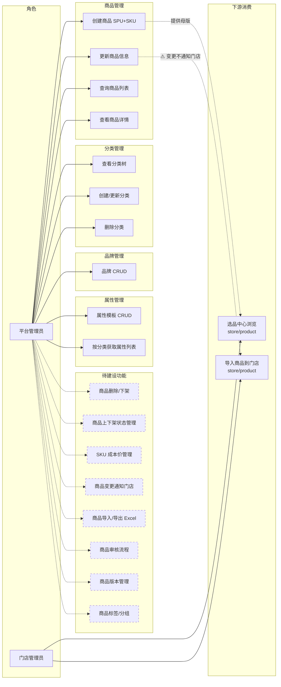
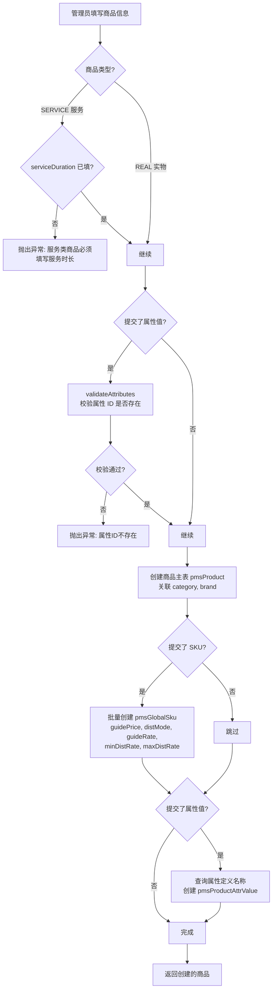
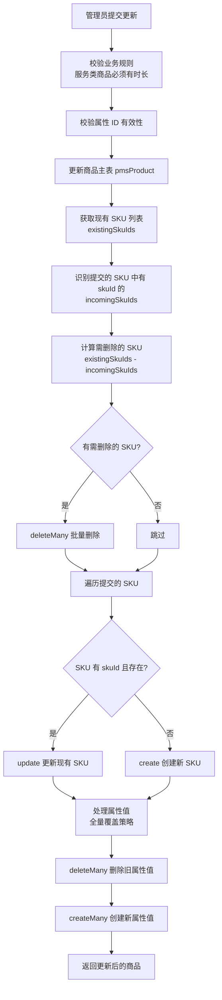
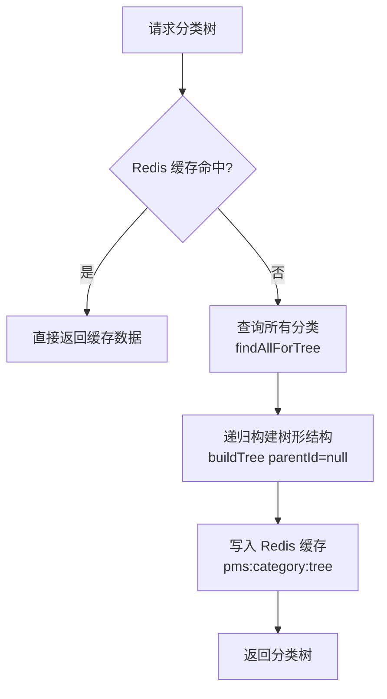
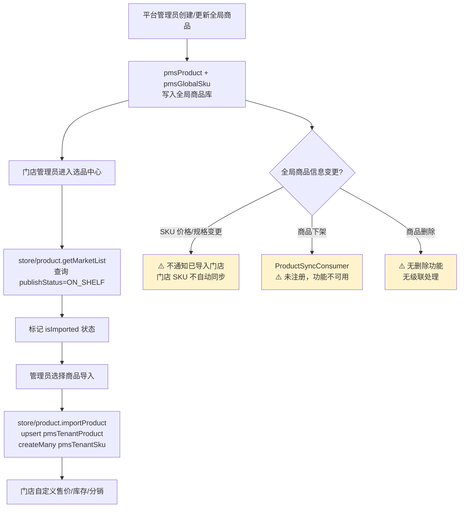
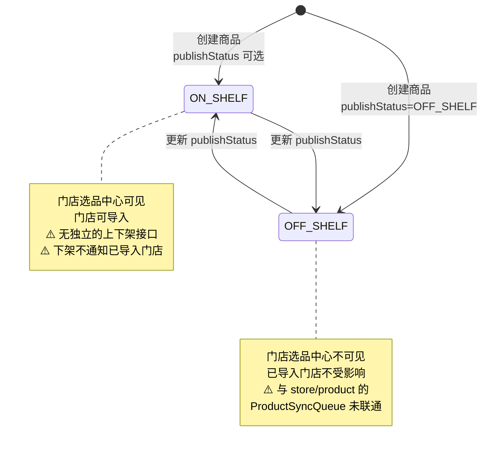

# 全局商品库管理模块（PMS）— 需求文档

> 版本：1.0
> 日期：2026-02-22
> 模块路径：`src/module/pms`
> 关联模块：`src/module/store/product`（门店选品/导入）、`src/module/store/stock`（门店库存）
> 状态：现状分析 + 演进规划

---

## 1. 概述

### 1.1 背景

PMS（Product Management System）模块是 O2O 多租户平台的全局商品库管理中心，由平台管理员维护，为所有门店提供统一的商品「母版」。模块采用 SPU-SKU 两级架构：SPU（`pmsProduct`）定义商品基础信息，SKU（`pmsGlobalSku`）定义规格组合与价格。模块包含四个子域：

- **商品管理**（product）：SPU + SKU 的 CRUD，核心业务
- **分类管理**（category）：多级分类树，支持属性模板绑定
- **品牌管理**（brand）：品牌档案，关联实物商品
- **属性管理**（attribute）：属性模板 + 属性项，驱动商品编辑页动态表单

PMS 模块与 `store/product` 模块构成「总部供应链 → 门店终端」的数据联动关系：PMS 维护全局商品母版，门店通过选品中心浏览并导入到本店（`pmsTenantProduct` + `pmsTenantSku`），导入后可自定义售价、库存和分销配置。

### 1.2 目标

1. 描述 PMS 模块四个子域的完整功能现状
2. 分析 PMS 模块自身的代码缺陷与架构不足
3. 分析 PMS 与 `store/product` 之间的跨模块设计缺陷
4. 对标市面主流商品库管理系统，识别功能差距
5. 提出演进建议和待办事项

### 1.3 范围

| 在范围内                              | 不在范围内                                                   |
| ------------------------------------- | ------------------------------------------------------------ |
| 全局商品 SPU/SKU 的 CRUD              | 门店选品/导入（属于 `store/product`）                        |
| 商品分类树管理（含缓存）              | 门店商品价格/库存管理（属于 `store/product`、`store/stock`） |
| 品牌档案管理                          | C 端商品展示（属于 `client/product`）                        |
| 属性模板与属性项管理                  | 订单中的库存扣减（属于 `store/order`）                       |
| PMS 与 store/product 的跨模块关联分析 | 佣金计算（属于 `finance/commission`）                        |

---

## 2. 角色与用例

> 图 1：PMS 全局商品库用例图

---

## 3. 业务流程

### 3.1 商品创建流程

> 图 2：商品创建活动图

### 3.2 商品更新流程（SKU Diff 算法）

> 图 3：商品更新活动图

### 3.3 分类树查询流程

> 图 4：分类树查询活动图

### 3.4 PMS → store/product 数据联动流程

> 图 5：全局商品到门店商品的数据联动活动图

---

## 4. 状态说明

> 图 6：全局商品发布状态图

**说明**：当前全局商品的 `publishStatus` 仅在创建/更新时作为字段传入，无独立的上下架接口。`store/product` 模块定义了 `ProductSyncProducer.notifyOffShelf()` 用于全局下架同步，但 PMS 模块未调用该方法，且 `ProductSyncProducer` 未在 `store/product` 的 Module 中注册。

---

## 5. 现有功能详述

### 5.1 接口清单

#### 5.1.1 商品管理（`admin/pms/product`）

| 接口     | 方法 | 路径                      | 权限                 | 说明                           |
| -------- | ---- | ------------------------- | -------------------- | ------------------------------ |
| 商品列表 | GET  | `/admin/pms/product/list` | `pms:product:list`   | 分页查询，含分类/品牌/SKU 关联 |
| 商品详情 | GET  | `/admin/pms/product/:id`  | `pms:product:query`  | 深度预加载所有关联             |
| 创建商品 | POST | `/admin/pms/product`      | `pms:product:create` | 事务创建 SPU+SKU+属性值        |
| 更新商品 | PUT  | `/admin/pms/product/:id`  | `pms:product:update` | SKU Diff 算法 + 属性全量覆盖   |

#### 5.1.2 分类管理（`admin/pms/category`）

| 接口     | 方法   | 路径                       | 权限                  | 说明                  |
| -------- | ------ | -------------------------- | --------------------- | --------------------- |
| 分类树   | GET    | `/admin/pms/category/tree` | `pms:category:list`   | Redis 缓存，递归构建  |
| 分类列表 | GET    | `/admin/pms/category/list` | `pms:category:list`   | 分页，支持按父级筛选  |
| 分类详情 | GET    | `/admin/pms/category/:id`  | `pms:category:query`  | —                     |
| 创建分类 | POST   | `/admin/pms/category`      | `pms:category:create` | 自动清除缓存          |
| 更新分类 | PUT    | `/admin/pms/category/:id`  | `pms:category:update` | 自动清除缓存          |
| 删除分类 | DELETE | `/admin/pms/category/:id`  | `pms:category:delete` | 校验子分类 + 商品引用 |

#### 5.1.3 品牌管理（`admin/pms/brand`）

| 接口     | 方法   | 路径                    | 权限               | 说明           |
| -------- | ------ | ----------------------- | ------------------ | -------------- |
| 品牌列表 | GET    | `/admin/pms/brand/list` | `pms:brand:list`   | 分页，模糊搜索 |
| 品牌详情 | GET    | `/admin/pms/brand/:id`  | `pms:brand:query`  | —              |
| 创建品牌 | POST   | `/admin/pms/brand`      | `pms:brand:create` | —              |
| 更新品牌 | PUT    | `/admin/pms/brand/:id`  | `pms:brand:update` | —              |
| 删除品牌 | DELETE | `/admin/pms/brand/:id`  | `pms:brand:delete` | 校验商品引用   |

#### 5.1.4 属性管理（`admin/pms/attribute`）

| 接口           | 方法   | 路径                                   | 权限                   | 说明                   |
| -------------- | ------ | -------------------------------------- | ---------------------- | ---------------------- |
| 模板列表       | GET    | `/admin/pms/attribute/template/list`   | `pms:attribute:list`   | 分页                   |
| 模板详情       | GET    | `/admin/pms/attribute/template/:id`    | `pms:attribute:query`  | 含属性项列表           |
| 创建模板       | POST   | `/admin/pms/attribute/template`        | `pms:attribute:create` | 事务创建模板+属性      |
| 更新模板       | PUT    | `/admin/pms/attribute/template/:id`    | `pms:attribute:update` | Diff 算法增删改属性    |
| 删除模板       | DELETE | `/admin/pms/attribute/template/:id`    | `pms:attribute:delete` | 校验分类引用           |
| 按分类获取属性 | GET    | `/admin/pms/attribute/category/:catId` | `pms:attribute:query`  | 通过分类→模板→属性链路 |

### 5.2 数据模型关系

| 表                    | 说明             | 关键字段                                                                                           |
| --------------------- | ---------------- | -------------------------------------------------------------------------------------------------- |
| `pmsProduct`          | 全局商品 SPU     | productId, name, type, categoryId, brandId, publishStatus, specDef                                 |
| `pmsGlobalSku`        | 全局 SKU         | skuId, productId, specValues, guidePrice, costPrice, distMode, guideRate, minDistRate, maxDistRate |
| `pmsCategory`         | 商品分类         | catId, parentId, name, attrTemplateId                                                              |
| `pmsBrand`            | 品牌             | brandId, name, logo                                                                                |
| `pmsAttrTemplate`     | 属性模板         | templateId, name                                                                                   |
| `pmsAttribute`        | 属性项           | attrId, templateId, name, usageType, inputType                                                     |
| `pmsProductAttrValue` | 商品属性值       | productId, attrId, attrName, value                                                                 |
| `pmsTenantProduct`    | 门店商品（下游） | tenantId, productId, status, customTitle                                                           |
| `pmsTenantSku`        | 门店 SKU（下游） | tenantId, globalSkuId, price, stock, distRate                                                      |

---

## 6. 现有逻辑不足分析

### 6.1 PMS 模块自身缺陷

| 编号 | 问题                                              | 严重度 | 详述                                                                                                                                                                    |
| ---- | ------------------------------------------------- | ------ | ----------------------------------------------------------------------------------------------------------------------------------------------------------------------- |
| D-1  | 无商品删除接口                                    | 🟡 P1  | Controller 仅有 list/detail/create/update 四个端点，无 DELETE 路由。已创建的商品无法删除，只能通过更新 `publishStatus` 下架。                                           |
| D-2  | 无独立的上下架接口                                | 🟡 P1  | 商品上下架需通过完整的 `update` 接口传入所有字段，无轻量级的状态切换接口。操作成本高，且容易因遗漏字段导致数据覆盖。                                                    |
| D-3  | `update` 方法复用 `CreateProductDto` 作为入参     | 🟢 P2  | 更新接口使用 `CreateProductDto` 而非独立的 `UpdateProductDto`（`PartialType`），所有字段均为必填，不支持部分更新。                                                      |
| D-4  | SKU 创建时缺少 `costPrice` 字段                   | 🟡 P1  | `createSkus` 方法中未传入 `costPrice`（成本价），但 `pmsGlobalSku` 表有该字段。门店导入时 `ProfitValidator` 依赖 `costPrice` 计算利润，若为 null/0 会导致利润校验失效。 |
| D-5  | 商品列表价格取第一个 SKU 的 `guidePrice`          | 🟢 P2  | `findAll` 中 `price: item.globalSkus?.[0]?.guidePrice \|\| 0`，当商品有多个 SKU 时仅展示第一个的价格，不一定是最低价。应取 `MIN(guidePrice)` 作为「起」价。             |
| D-6  | `ProductVo.publishStatus` 返回字符串 `'0'`/`'1'`  | 🟢 P2  | 将枚举 `ON_SHELF`/`OFF_SHELF` 转换为 `'1'`/`'0'` 字符串返回，与 Prisma 枚举类型不一致，前端需额外转换。                                                                 |
| D-7  | 属性值创建使用 `def!.name` 非空断言               | 🟢 P2  | `createAttrValues` 中 `def!.name` 使用非空断言，虽然前面已校验属性 ID 存在，但若并发删除属性可能导致运行时错误。                                                        |
| D-8  | `ProductRepository.getTenantWhere` 返回空对象     | 🟢 P2  | 全局商品库不按租户隔离是正确的，但 `getTenantWhere` 返回 `{}` 的方式不够显式。建议添加注释或使用更明确的机制（如 `@IgnoreTenant`）。                                    |
| D-9  | Controller 缺少 `@ApiBearerAuth('Authorization')` | 🟢 P2  | `PmsProductController` 和 `AttributeController` 缺少 `@ApiBearerAuth`，Swagger 文档中不显示认证要求。`CategoryController` 和 `BrandController` 同样缺少。               |

### 6.2 PMS ↔ store/product 跨模块缺陷

| 编号 | 问题                                                       | 严重度 | 详述                                                                                                                                                                                                             |
| ---- | ---------------------------------------------------------- | ------ | ---------------------------------------------------------------------------------------------------------------------------------------------------------------------------------------------------------------- |
| X-1  | 全局商品下架不通知已导入门店                               | 🔴 P0  | PMS 更新商品 `publishStatus=OFF_SHELF` 时，不调用 `store/product` 的 `ProductSyncProducer.notifyOffShelf()`。已导入门店的商品仍为上架状态，C 端用户可继续下单已下架商品。                                        |
| X-2  | 全局 SKU 变更不同步到门店 SKU                              | 🟡 P1  | PMS 更新 SKU 的 `guidePrice`、`costPrice`、`distMode` 等字段后，已导入门店的 `pmsTenantSku` 不会自动更新。门店 SKU 的 `globalSku.costPrice` 通过关联查询获取（实时），但 `guidePrice` 等指导信息可能过时。       |
| X-3  | 全局商品删除无级联处理                                     | 🟡 P1  | 当前无删除接口（D-1），但若未来实现删除，需处理已导入门店的 `pmsTenantProduct` 和 `pmsTenantSku` 的级联清理或标记。                                                                                              |
| X-4  | PMS 不导出 `ProductRepository` 和 `SkuRepository`          | 🟢 P2  | `PmsModule` 仅导出 `PmsProductService`，不导出 Repository。`store/product` 模块无法直接使用 PMS 的 Repository 查询全局商品，只能通过 `PrismaService` 直接操作。                                                  |
| X-5  | SKU `minDistRate`/`maxDistRate` 未被门店端校验             | 🟡 P1  | PMS 的 `pmsGlobalSku` 定义了 `minDistRate` 和 `maxDistRate`（分销费率上下限），但 `store/product` 的 `ProfitValidator` 和 `importProduct` 未校验门店设置的 `distRate` 是否在此范围内。总部设定的分销红线未生效。 |
| X-6  | `store/product` 的 `ProductSyncProducer`/`Consumer` 未注册 | 🟢 P2  | `store/product` 的 `product.module.ts` 未导入 `BullModule.registerQueue`，未注册 Producer/Consumer。即使 PMS 调用了 `notifyOffShelf`，队列也无法工作。（已在 store/product 设计文档中记录为 D-6）                |

### 6.3 架构层面不足

| 编号 | 问题               | 详述                                                                                                         |
| ---- | ------------------ | ------------------------------------------------------------------------------------------------------------ |
| A-1  | 无商品变更事件机制 | PMS 商品变更（创建/更新/上下架/删除）无事件发布机制，下游模块（store/product、client/product）无法感知变更。 |
| A-2  | 无商品审核流程     | 商品创建后直接生效，无草稿→审核→发布的流程。                                                                 |
| A-3  | 无商品导入/导出    | 无法通过 Excel 批量导入商品数据或导出商品列表。                                                              |
| A-4  | 无商品版本管理     | 商品更新为直接覆盖，无历史版本记录，无法回滚。                                                               |
| A-5  | 无商品标签/分组    | 无法对商品打标签或分组，不支持按标签筛选。                                                                   |
| A-6  | 分类层级未校验     | `create` 分类时 `level` 硬编码为 1，未根据 `parentId` 自动计算层级深度。                                     |
| A-7  | 品牌无唯一性校验   | 创建品牌时未校验名称是否重复，可能创建同名品牌。                                                             |

---

## 7. 市面主流商品库系统对标

### 7.1 功能对比矩阵

| 功能                           | 本系统              | 有赞商家后台 | 美团商家版 | Shopify Admin | 差距评估     |
| ------------------------------ | ------------------- | ------------ | ---------- | ------------- | ------------ |
| SPU+SKU 两级架构               | ✅                  | ✅           | ✅         | ✅            | 持平         |
| 多级分类树（含缓存）           | ✅                  | ✅           | ✅         | ✅            | 持平         |
| 品牌管理                       | ✅                  | ✅           | ✅         | ❌            | 持平         |
| 属性模板（动态表单）           | ✅                  | ✅           | ✅         | ✅            | 持平         |
| SKU Diff 更新                  | ✅                  | ✅           | ✅         | ✅            | 持平         |
| 分销费率上下限                 | ✅                  | ❌           | ❌         | ❌            | 领先         |
| 删除引用校验（分类/品牌/模板） | ✅                  | ✅           | ✅         | ✅            | 持平         |
| 权限控制                       | ✅                  | ✅           | ✅         | ✅            | 持平         |
| 商品删除                       | ❌                  | ✅           | ✅         | ✅            | 缺失（P1）   |
| 独立上下架接口                 | ❌                  | ✅           | ✅         | ✅            | 缺失（P1）   |
| 变更通知下游                   | ❌                  | ✅           | ✅         | ✅            | 缺失（P0）   |
| 商品审核流程                   | ❌                  | ✅           | ❌         | ❌            | 缺失（低优） |
| 商品导入/导出                  | ❌                  | ✅           | ✅         | ✅            | 缺失（中优） |
| 商品版本/历史                  | ❌                  | ❌           | ❌         | ✅            | 缺失（低优） |
| 商品标签/分组                  | ❌                  | ✅           | ✅         | ✅            | 缺失（低优） |
| 成本价管理                     | ⚠️ 字段存在但未录入 | ✅           | ✅         | ✅            | 缺失（P1）   |

### 7.2 差距总结

本系统在分销费率上下限管控方面具有差异化优势。主要差距集中在：

1. 跨模块联动断裂（P0）：全局商品变更不通知门店，下架商品门店仍可售
2. 成本价未录入（P1）：SKU 创建时遗漏 `costPrice`，导致门店利润校验失效
3. 分销红线未生效（P1）：`minDistRate`/`maxDistRate` 未被门店端校验
4. 基础 CRUD 不完整：无删除、无独立上下架

---

## 8. 验收标准（现有功能）

| 编号  | 验收条件                                                        | 状态             |
| ----- | --------------------------------------------------------------- | ---------------- |
| AC-1  | 创建商品事务包含 SPU + SKU + 属性值三表原子写入                 | ✅ 已通过        |
| AC-2  | 服务类商品必须填写 `serviceDuration`，否则拒绝创建              | ✅ 已通过        |
| AC-3  | 更新商品时 SKU 支持增删改（Diff 算法）                          | ✅ 已通过        |
| AC-4  | 分类树查询使用 Redis 缓存，创建/更新/删除自动清除缓存           | ✅ 已通过        |
| AC-5  | 删除分类前校验子分类和商品引用                                  | ✅ 已通过        |
| AC-6  | 删除品牌前校验商品引用                                          | ✅ 已通过        |
| AC-7  | 删除属性模板前校验分类引用                                      | ✅ 已通过        |
| AC-8  | 按分类 ID 获取属性列表（通过分类→模板→属性链路）                | ✅ 已通过        |
| AC-9  | SKU 创建时包含 `costPrice`（成本价）                            | ❌ 未实现（D-4） |
| AC-10 | 全局商品下架时通知已导入门店自动下架                            | ❌ 未实现（X-1） |
| AC-11 | 门店导入时校验 `distRate` 在 `minDistRate`~`maxDistRate` 范围内 | ❌ 未实现（X-5） |
| AC-12 | 商品支持删除（含级联处理）                                      | ❌ 未实现（D-1） |

---

## 9. 演进建议与待办

### 9.1 短期（1-2 周）— 修复现有缺陷

| 编号 | 任务                                                       | 对应缺陷 | 预估工时 |
| ---- | ---------------------------------------------------------- | -------- | -------- |
| T-1  | SKU 创建时传入 `costPrice` 字段                            | D-4      | 0.5h     |
| T-2  | 新增独立上下架接口 `PATCH /admin/pms/product/:id/status`   | D-2      | 1h       |
| T-3  | 上下架接口调用 `ProductSyncProducer.notifyOffShelf()`      | X-1      | 1h       |
| T-4  | 注册 `store/product` 的 Bull 队列（前置依赖）              | X-6      | 1h       |
| T-5  | 创建 `UpdateProductDto`（`PartialType(CreateProductDto)`） | D-3      | 0.5h     |
| T-6  | 商品列表价格改为 `MIN(guidePrice)`                         | D-5      | 0.5h     |
| T-7  | 所有 Controller 添加 `@ApiBearerAuth`                      | D-9      | 0.5h     |

### 9.2 中期（1-2 月）— 补齐核心功能

| 编号 | 任务                                                    | 对应差距 | 预估工时 |
| ---- | ------------------------------------------------------- | -------- | -------- |
| T-8  | 商品删除接口（含门店级联处理）                          | D-1, X-3 | 2-3d     |
| T-9  | 门店导入时校验 `distRate` 在 `min~max` 范围内           | X-5      | 1d       |
| T-10 | 商品变更事件机制（EventEmitter / Bull）                 | A-1      | 2-3d     |
| T-11 | 商品导入/导出（Excel）                                  | A-3      | 2-3d     |
| T-12 | 品牌名称唯一性校验                                      | A-7      | 0.5h     |
| T-13 | 分类层级自动计算                                        | A-6      | 1h       |
| T-14 | `PmsModule` 导出 `ProductRepository` 和 `SkuRepository` | X-4      | 0.5h     |

### 9.3 长期（3-6 月）— 竞争力建设

| 编号 | 任务                 | 说明                                   |
| ---- | -------------------- | -------------------------------------- |
| T-15 | 商品审核流程         | 草稿→审核→发布，支持多级审批           |
| T-16 | 商品版本管理         | 记录每次变更历史，支持回滚             |
| T-17 | 商品标签/分组        | 支持打标签、按标签筛选                 |
| T-18 | SKU 变更自动通知门店 | 全局 SKU 价格/规格变更时通知已导入门店 |
