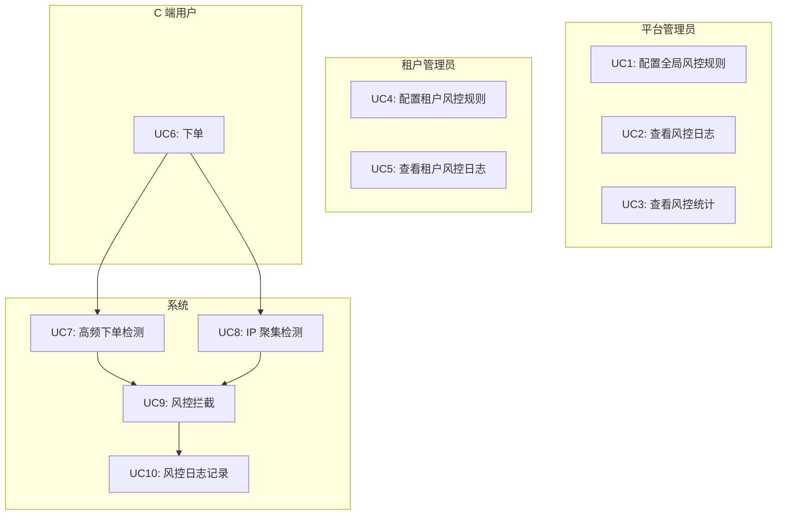
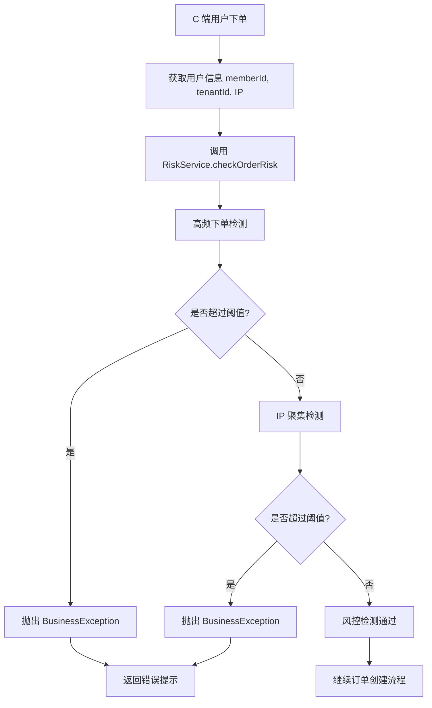
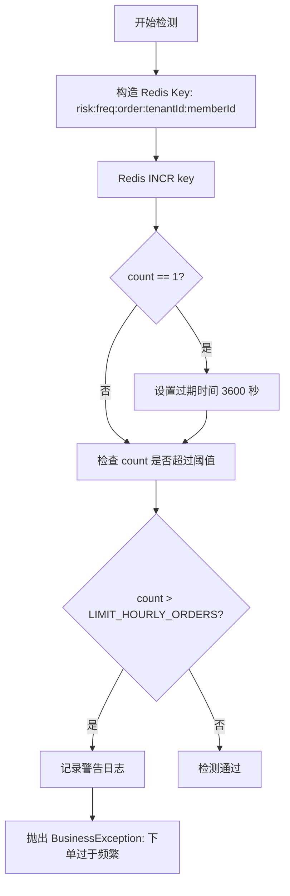
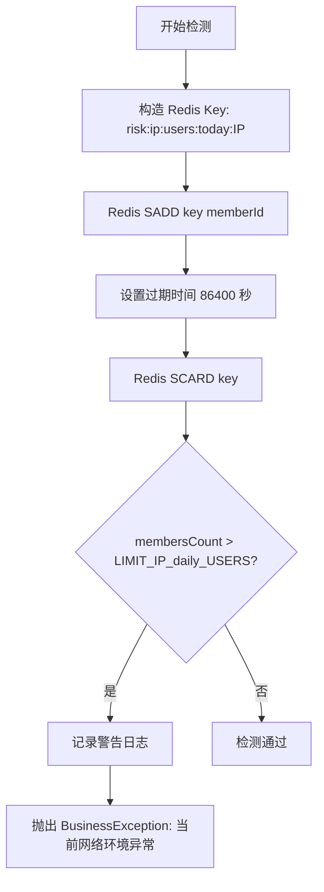

# Risk（风控）模块 — 需求文档

> 版本：1.0
> 日期：2026-02-22
> 模块路径：`src/module/risk/`
> 设计文档：[risk-design.md](../../design/risk/risk-design.md)
> 状态：现状分析 + 改进建议

---

## 1. 概述

### 1.1 背景

Risk（风控）模块是 O2O 平台的安全防护层，负责识别和拦截异常交易行为，保护平台和商家免受欺诈、刷单、薅羊毛等风险。当前实现包含 2 个核心风控规则：

| 规则         | 职责                                   | 复杂度 |
| ------------ | -------------------------------------- | ------ |
| 高频下单检测 | 限制单用户每小时最大下单数             | 低     |
| IP 聚集检测  | 检测同一 IP 下过多不同用户（刷单工场） | 低     |

### 1.2 目标

1. 防止高频下单（刷单、薅羊毛）
2. 检测 IP 聚集（刷单工场、黑产）
3. 保护平台和商家利益
4. 提供可配置的风控规则
5. 支持多租户隔离的风控策略

### 1.3 范围

本文档覆盖 Risk 模块的现有功能和改进建议，包括：

- 高频下单检测（基于 Redis 计数器）
- IP 聚集检测（基于 Redis Set）
- 风控规则配置
- 风控日志记录

---

## 2. 角色与用例

### 2.1 角色定义

| 角色       | 说明             | 权限                               |
| ---------- | ---------------- | ---------------------------------- |
| 平台管理员 | 管理全局风控规则 | 配置风控阈值、查看风控日志         |
| 租户管理员 | 管理租户风控规则 | 配置租户风控阈值、查看租户风控日志 |
| C 端用户   | 下单用户         | 无（被动接受风控检测）             |
| 系统       | 自动化处理       | 风控检测、风控拦截、风控日志       |

### 2.2 用例图

> 图 1：Risk 模块用例图



---

## 3. 业务流程

### 3.1 订单风控检测流程

> 图 2：订单风控检测活动图



**关键设计**：

1. 风控检测在订单创建前执行
2. 任一规则触发，立即拦截并返回错误
3. 使用 Redis 存储风控数据，支持高并发

### 3.2 高频下单检测流程

> 图 3：高频下单检测活动图



**关键设计**：

1. 使用 Redis INCR 原子操作计数
2. 首次计数时设置 1 小时过期时间
3. 超过阈值时抛出异常并记录日志

### 3.3 IP 聚集检测流程

> 图 4：IP 聚集检测活动图



**关键设计**：

1. 使用 Redis Set 存储同一 IP 下的不同用户
2. 使用 SADD 自动去重
3. 使用 SCARD 统计不同用户数
4. 超过阈值时抛出异常并记录日志

---

## 4. 状态说明

Risk 模块本身无状态机，风控规则的状态为：

| 状态 | 说明       | 允许操作   |
| ---- | ---------- | ---------- |
| 启用 | 规则生效   | 检测、拦截 |
| 禁用 | 规则不生效 | 跳过检测   |

---

## 5. 现有功能详述

### 5.1 核心方法

| 方法              | 说明         | 参数                             | 返回值             |
| ----------------- | ------------ | -------------------------------- | ------------------ |
| checkOrderRisk    | 检查订单风控 | memberId, tenantId, ip, deviceId | void（异常时抛出） |
| checkFrequency    | 检测下单频率 | memberId, tenantId               | void（异常时抛出） |
| checkIpClustering | 检测 IP 聚集 | ip, memberId                     | void（异常时抛出） |

### 5.2 风控规则配置

| 规则     | 配置项               | 默认值 | 说明                     |
| -------- | -------------------- | ------ | ------------------------ |
| 高频下单 | LIMIT_HOURLY_ORDERS  | 10     | 单用户每小时最大下单数   |
| IP 聚集  | LIMIT_IP_daily_USERS | 5      | 单 IP 每天最大不同用户数 |

### 5.3 Redis 数据结构

#### 5.3.1 高频下单计数器

```
Key: risk:freq:order:{tenantId}:{memberId}
Type: String
Value: 下单次数
TTL: 3600 秒（1 小时）
```

#### 5.3.2 IP 聚集用户集合

```
Key: risk:ip:users:{today}:{ip}
Type: Set
Value: memberId 集合
TTL: 86400 秒（24 小时）
```

---

## 6. 现有逻辑不足分析

### 6.1 核心缺陷

| 编号 | 问题             | 严重度 | 详述                                                              |
| ---- | ---------------- | ------ | ----------------------------------------------------------------- |
| D-1  | 规则阈值硬编码   | P1     | 风控阈值硬编码在代码中，无法动态调整，需要重启服务。              |
| D-2  | 无租户级别配置   | P1     | 所有租户使用相同的风控规则，无法按租户定制。                      |
| D-3  | 无风控日志持久化 | P1     | 仅记录警告日志，无法查询历史风控记录和统计分析。                  |
| D-4  | 无风控白名单     | P2     | 无法为测试账号、VIP 用户设置白名单，影响测试和运营。              |
| D-5  | 无设备指纹检测   | P2     | `deviceId` 参数未使用，无法检测同一设备多账号。                   |
| D-6  | 无风控降级机制   | P2     | Redis 故障时，风控检测失败导致下单失败，应降级放行。              |
| D-7  | 无风控统计分析   | P2     | 无法统计风控拦截率、误拦率、风险用户分布等指标。                  |
| D-8  | 无风控规则组合   | P2     | 仅支持单一规则，无法组合多个规则（如高频 + IP 聚集 + 设备指纹）。 |

### 6.2 跨模块缺陷

| 编号 | 问题               | 严重度 | 涉及模块         | 详述                                                     |
| ---- | ------------------ | ------ | ---------------- | -------------------------------------------------------- |
| X-1  | 无 Admin 配置接口  | P1     | risk → admin     | 缺少 Admin 接口配置风控规则，运营无法动态调整阈值。      |
| X-2  | 无风控日志查询接口 | P1     | risk → admin     | 缺少 Admin 接口查询风控日志，运营无法分析风控效果。      |
| X-3  | 未集成到订单模块   | P1     | risk → order     | 订单创建时未调用风控检测，风控规则未生效。               |
| X-4  | 未集成到营销模块   | P2     | risk → marketing | 营销活动（优惠券、积分）未调用风控检测，存在薅羊毛风险。 |

### 6.3 架构层面不足

| 编号 | 问题           | 详述                                       |
| ---- | -------------- | ------------------------------------------ |
| A-1  | 无规则引擎     | 缺少规则引擎，无法灵活配置和组合风控规则。 |
| A-2  | 无机器学习模型 | 缺少机器学习模型，无法识别复杂的欺诈模式。 |
| A-3  | 无实时监控     | 缺少实时监控和告警，无法及时发现风控异常。 |
| A-4  | 无风控评分     | 缺少风控评分机制，无法量化用户风险等级。   |
| A-5  | 无黑名单管理   | 缺少黑名单管理，无法永久拉黑高风险用户。   |
| A-6  | 无风控审核流   | 缺少风控审核流，无法人工复核可疑订单。     |

---

## 7. 市面主流 O2O 平台对标

### 7.1 功能对比矩阵

| 功能         | 本系统 | 美团 | 饿了么 | 京东到家 | 差距评估   |
| ------------ | ------ | ---- | ------ | -------- | ---------- |
| 高频下单检测 | 有     | 有   | 有     | 有       | 持平       |
| IP 聚集检测  | 有     | 有   | 有     | 有       | 持平       |
| 设备指纹检测 | 无     | 有   | 有     | 有       | 缺失（P2） |
| 风控规则配置 | 无     | 有   | 有     | 有       | 缺失（P1） |
| 风控日志查询 | 无     | 有   | 有     | 有       | 缺失（P1） |
| 风控白名单   | 无     | 有   | 有     | 有       | 缺失（P2） |
| 风控黑名单   | 无     | 有   | 有     | 有       | 缺失（P2） |
| 风控评分     | 无     | 有   | 有     | 有       | 缺失（P2） |
| 规则引擎     | 无     | 有   | 有     | 有       | 缺失（P2） |
| 机器学习模型 | 无     | 有   | 有     | 有       | 缺失（P3） |
| 实时监控     | 无     | 有   | 有     | 有       | 缺失（P2） |
| 风控审核流   | 无     | 有   | 有     | 有       | 缺失（P3） |

### 7.2 差距总结

本系统在 Risk 的核心功能（高频下单检测、IP 聚集检测）上已具备基本能力，但在以下方面存在明显差距：

1. 配置能力缺失（P1）：无 Admin 配置接口、无风控日志查询
2. 业务集成不足（P1）：未集成到订单模块、未集成到营销模块
3. 规则扩展性不足（P2）：无规则引擎、无设备指纹检测、无风控评分
4. 运营工具缺失（P2）：无风控白名单、无风控黑名单、无实时监控

---

## 8. 验收标准

### 8.1 现有功能验收

| 编号 | 验收条件                                        | 状态   |
| ---- | ----------------------------------------------- | ------ |
| AC-1 | 单用户 1 小时内下单超过 10 次，触发高频下单检测 | 已通过 |
| AC-2 | 单 IP 1 天内不同用户超过 5 个，触发 IP 聚集检测 | 已通过 |
| AC-3 | 风控检测失败时，抛出 BusinessException          | 已通过 |
| AC-4 | 风控检测失败时，记录警告日志                    | 已通过 |

### 8.2 待修复验收

| 编号 | 验收条件                                      | 状态   | 对应缺陷 |
| ---- | --------------------------------------------- | ------ | -------- |
| AC-5 | 风控规则阈值可通过 Admin 接口动态配置         | 未实现 | D-1, X-1 |
| AC-6 | 风控日志持久化到数据库，可通过 Admin 接口查询 | 未实现 | D-3, X-2 |
| AC-7 | 订单创建时自动调用风控检测                    | 未实现 | X-3      |
| AC-8 | 风控白名单用户跳过风控检测                    | 未实现 | D-4      |
| AC-9 | Redis 故障时，风控检测降级放行                | 未实现 | D-6      |

---

## 9. 演进建议与待办

### 9.1 第一阶段：核心修复（1-2 周）

| 编号 | 任务                     | 对应缺陷 | 预估工时 |
| ---- | ------------------------ | -------- | -------- |
| T-1  | 风控规则配置表设计与实现 | D-1, D-2 | 2d       |
| T-2  | 风控日志表设计与实现     | D-3      | 1d       |
| T-3  | Admin 风控规则配置接口   | X-1      | 1d       |
| T-4  | Admin 风控日志查询接口   | X-2      | 1d       |
| T-5  | 订单模块集成风控检测     | X-3      | 0.5d     |

### 9.2 第二阶段：规则扩展（2-3 周）

| 编号 | 任务                 | 对应缺陷 | 预估工时 |
| ---- | -------------------- | -------- | -------- |
| T-6  | 风控白名单功能       | D-4      | 1d       |
| T-7  | 设备指纹检测         | D-5      | 2d       |
| T-8  | 风控降级机制         | D-6      | 1d       |
| T-9  | 风控统计分析         | D-7      | 2d       |
| T-10 | 营销模块集成风控检测 | X-4      | 1d       |

### 9.3 第三阶段：规则引擎（1-2 月）

| 编号 | 任务               | 对应缺陷 | 预估工时 |
| ---- | ------------------ | -------- | -------- |
| T-11 | 规则引擎设计与实现 | A-1      | 1-2w     |
| T-12 | 风控评分机制       | A-4      | 1w       |
| T-13 | 风控黑名单管理     | A-5      | 1w       |
| T-14 | 实时监控与告警     | A-3      | 1w       |

### 9.4 第四阶段：智能风控（3-6 月）

| 编号 | 任务             | 说明                         |
| ---- | ---------------- | ---------------------------- |
| T-15 | 机器学习模型     | 使用机器学习识别复杂欺诈模式 |
| T-16 | 风控审核流       | 人工复核可疑订单             |
| T-17 | 风控数据分析平台 | 可视化风控数据，支持数据分析 |

### 9.5 关键路径

```
T-1(规则配置表) → T-2(日志表) → T-3(Admin 配置接口) → T-5(订单集成) → T-6(白名单) → T-11(规则引擎)
```

**优先级总结**：

| 优先级 | 任务数 | 核心内容                                           | 预估工时 |
| ------ | ------ | -------------------------------------------------- | -------- |
| P0     | 5 项   | 规则配置表 + 日志表 + Admin 接口 + 订单集成        | 1-2 周   |
| P1     | 5 项   | 白名单 + 设备指纹 + 降级机制 + 统计分析 + 营销集成 | 2-3 周   |
| P2     | 4 项   | 规则引擎 + 评分机制 + 黑名单 + 实时监控            | 1-2 月   |
| P3     | 3 项   | 机器学习 + 审核流 + 数据分析平台                   | 3-6 月   |

---

**文档版本**：1.0
**最后更新**：2026-02-22
**维护者**：Backend Team
