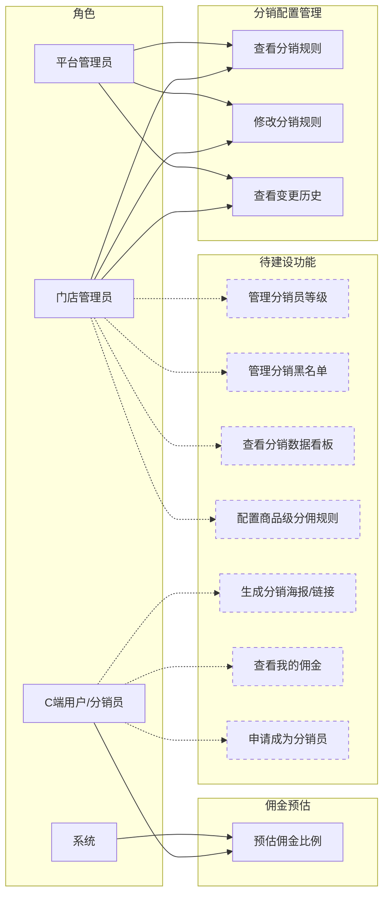
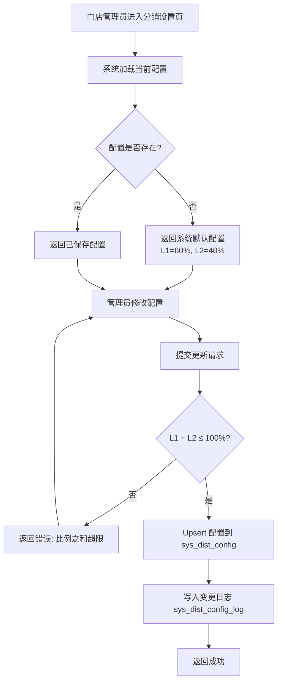
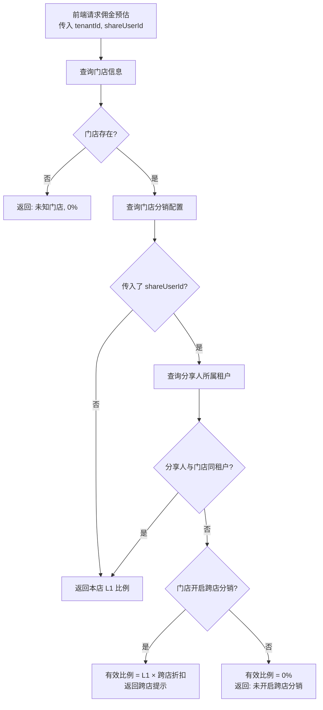
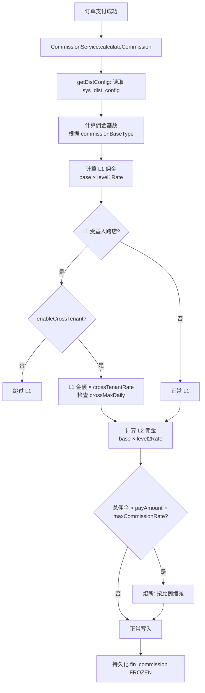
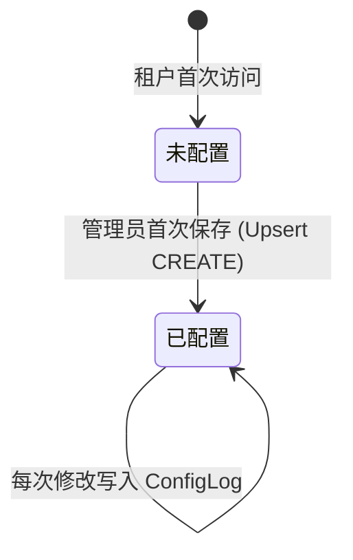

# 分销管理模块 — 需求文档

> 版本：1.0  
> 日期：2026-02-22  
> 模块路径：`src/module/store/distribution`  
> 状态：现状分析 + 演进规划

---

## 1. 概述

### 1.1 背景

分销管理模块负责 O2O 多租户平台中门店级别的分佣规则配置。每个门店（租户）可独立设置一级/二级分佣比例、跨店分销策略、佣金基数类型和熔断保护阈值。该模块是分佣链路的"策略源"，实际的佣金计算由 `finance/commission` 模块消费这些配置执行。

### 1.2 目标

1. 描述当前分销配置模块的完整功能现状
2. 分析现有逻辑的不足与缺陷
3. 对标市面主流分销系统，识别功能差距
4. 提出演进建议和待办事项

### 1.3 范围

| 在范围内               | 不在范围内                                        |
| ---------------------- | ------------------------------------------------- |
| 分销规则的 CRUD 与审计 | 佣金的实际计算与发放（属于 `finance/commission`） |
| 佣金预估接口           | 提现与结算流程（属于 `finance/withdrawal`）       |
| 跨店分销配置           | 分销员管理（会员等级体系，属于 `ums`）            |
| 配置变更日志           | 分销海报/素材管理                                 |

---

## 2. 角色与用例

> 图 1：分销管理用例图

> 虚线框为当前未实现、市面主流分销系统普遍具备的功能。

---

## 3. 业务流程

### 3.1 分销规则配置流程

> 图 2：分销规则配置活动图

### 3.2 佣金预估流程

> 图 3：佣金预估活动图

### 3.3 分佣规则在计算链路中的消费流程

> 图 4：分佣配置消费活动图（跨模块）

---

## 4. 现有功能详述

### 4.1 数据模型

> 图 5：分销配置数据模型状态图（配置生命周期）

#### sys_dist_config 表结构

| 字段                   | 类型          | 说明                | 默认值         |
| ---------------------- | ------------- | ------------------- | -------------- |
| `id`                   | INT           | 主键                | 自增           |
| `tenant_id`            | VARCHAR(20)   | 租户ID（唯一）      | —              |
| `level1_rate`          | DECIMAL(5,2)  | 一级分佣比例（0-1） | 0.60           |
| `level2_rate`          | DECIMAL(5,2)  | 二级分佣比例（0-1） | 0.40           |
| `enable_lv0`           | BOOLEAN       | 允许普通用户分销    | true           |
| `enable_cross_tenant`  | BOOLEAN       | 允许跨店分销        | false          |
| `cross_tenant_rate`    | DECIMAL(5,2)  | 跨店折扣（0-1）     | 1.00           |
| `cross_max_daily`      | DECIMAL(10,2) | 跨店日限额（元）    | 500.00         |
| `commission_base_type` | ENUM          | 佣金基数类型        | ORIGINAL_PRICE |
| `max_commission_rate`  | DECIMAL(5,2)  | 熔断保护比例（0-1） | 0.50           |

#### sys_dist_config_log 表结构

| 字段                  | 类型          | 说明               |
| --------------------- | ------------- | ------------------ |
| `id`                  | INT           | 主键               |
| `tenant_id`           | VARCHAR(20)   | 租户ID             |
| `level1_rate`         | DECIMAL(5,2)  | 变更后的 L1 比例   |
| `level2_rate`         | DECIMAL(5,2)  | 变更后的 L2 比例   |
| `enable_lv0`          | BOOLEAN       | 变更后的 LV0 开关  |
| `enable_cross_tenant` | BOOLEAN       | 变更后的跨店开关   |
| `cross_tenant_rate`   | DECIMAL(5,2)  | 变更后的跨店折扣   |
| `cross_max_daily`     | DECIMAL(10,2) | 变更后的跨店日限额 |
| `operator`            | VARCHAR(64)   | 操作人             |
| `create_time`         | DATETIME      | 变更时间           |

### 4.2 接口清单

| 接口     | 方法 | 路径                                     | 说明                     |
| -------- | ---- | ---------------------------------------- | ------------------------ |
| 获取配置 | GET  | `/store/distribution/config`             | 无配置时返回默认值       |
| 更新配置 | POST | `/store/distribution/config`             | 校验 L1+L2 ≤ 100%        |
| 变更历史 | GET  | `/store/distribution/config/logs`        | 最近 20 条               |
| 佣金预估 | GET  | `/store/distribution/commission/preview` | 仅返回比例，金额始终为 0 |

### 4.3 配置参数说明

| 参数                 | 范围       | 业务含义                                                 |
| -------------------- | ---------- | -------------------------------------------------------- |
| `level1Rate`         | 0-100      | 直推人获得的佣金占分佣基数的百分比                       |
| `level2Rate`         | 0-100      | 间推人获得的佣金占分佣基数的百分比                       |
| `enableLV0`          | true/false | 普通用户（levelId=0）是否可以参与分销赚佣金              |
| `enableCrossTenant`  | true/false | 推荐人属于其他门店时，是否仍发放佣金                     |
| `crossTenantRate`    | 0-100      | 跨店佣金的折扣系数，80 表示按本店比例的 80% 发放         |
| `crossMaxDaily`      | ≥0         | 单个跨店推荐人每日可获得的最大佣金额度                   |
| `commissionBaseType` | ENUM       | ORIGINAL_PRICE=按原价 / ACTUAL_PAID=按实付 / ZERO=不分佣 |
| `maxCommissionRate`  | 0-100      | 熔断阈值，总佣金不超过实付金额的此百分比                 |

---

## 5. 现有逻辑不足分析

### 5.1 代码层面缺陷

| 编号 | 问题                                                       | 严重度 | 详述                                                                                                                                                |
| ---- | ---------------------------------------------------------- | ------ | --------------------------------------------------------------------------------------------------------------------------------------------------- |
| D-1  | 佣金预估接口 `estimatedAmount` 始终返回 0                  | 🟡 P1  | `CommissionPreviewDto` 定义了 `productIds` 字段，但 Controller 使用 `@Query('tenantId')` 接收参数，完全忽略商品列表。前端无法展示有意义的预估金额。 |
| D-2  | Controller 参数与 DTO 定义不匹配                           | 🟡 P1  | `CommissionPreviewDto` 定义了 `tenantId`、`productIds`、`shareUserId`，但 Controller 用独立 `@Query` 参数，DTO 形同虚设。                           |
| D-3  | 变更日志未记录 `commissionBaseType` 和 `maxCommissionRate` | 🟡 P1  | `updateConfig` 写入 `sysDistConfigLog` 时未包含这两个字段，审计不完整。                                                                             |
| D-4  | `getConfig` 中大量 `as any` 类型断言                       | 🟢 P2  | `(config as any).enableCrossTenant` 等写法说明 Prisma 类型与实际字段不完全匹配，存在运行时风险。                                                    |
| D-5  | 变更日志固定取 20 条，无分页                               | 🟢 P2  | `getConfigLogs` 硬编码 `take: 20`，无法查看更早的历史记录。                                                                                         |
| D-6  | 配置更新无事务保护                                         | 🟢 P2  | `upsert` 和 `create log` 是两个独立操作，理论上日志写入可能失败而配置已更新。                                                                       |
| D-7  | 默认 L1=60% + L2=40% 总和 100%，无利润空间                 | 🟢 P2  | 默认配置将全部分佣基数分配给推荐人，门店利润为 0。虽然有熔断保护（默认 50%），但默认值本身具有误导性。                                              |

### 5.2 架构层面不足

| 编号 | 问题                           | 详述                                                                          |
| ---- | ------------------------------ | ----------------------------------------------------------------------------- |
| A-1  | 仅支持租户级配置，不支持商品级 | 所有商品使用同一套 L1/L2 比例。市面主流系统支持按商品/品类设置不同分佣比例。  |
| A-2  | 仅支持二级分销                 | 固定 L1+L2 两级。部分行业需要三级或更灵活的层级配置。                         |
| A-3  | 无分销员等级体系               | 当前仅通过 `enableLV0` 控制普通用户是否可分销，无法按等级设置差异化佣金比例。 |
| A-4  | 无分销员申请/审核流程          | 用户成为分销员的路径不清晰，缺少申请、审核、降级机制。                        |
| A-5  | 无分销数据看板                 | 门店管理员无法查看分销效果（分销员数量、带来的订单数、佣金支出趋势）。        |
| A-6  | 无分销素材管理                 | 缺少分销海报、分享链接生成等推广工具。                                        |
| A-7  | 配置变更无生效时间控制         | 配置修改立即生效，无法设置"下月 1 日生效"等延迟生效策略。                     |

---

## 6. 市面主流分销系统对标

### 6.1 功能对比矩阵

| 功能               | 本系统 | 有赞分销 | 微店分销 | 拼多多分销 | 差距评估           |
| ------------------ | ------ | -------- | -------- | ---------- | ------------------ |
| 租户级分佣配置     | ✅     | ✅       | ✅       | ✅         | 持平               |
| 商品级分佣配置     | ❌     | ✅       | ✅       | ✅         | 缺失（高优）       |
| 二级分销           | ✅     | ✅       | ✅       | ✅         | 持平               |
| 三级分销           | ❌     | ❌       | ❌       | ❌         | 持平（法规限制）   |
| 分销员等级         | ❌     | ✅       | ✅       | —          | 缺失（中优）       |
| 分销员申请/审核    | ❌     | ✅       | ✅       | —          | 缺失（中优）       |
| 佣金预估（含金额） | ❌     | ✅       | ✅       | ✅         | 缺失（高优）       |
| 跨店分销           | ✅     | —        | —        | —          | 领先（多租户特有） |
| 佣金基数策略       | ✅     | ✅       | ❌       | ❌         | 领先               |
| 熔断保护           | ✅     | ❌       | ❌       | ❌         | 领先               |
| 配置变更审计       | ✅     | ✅       | ❌       | ❌         | 持平               |
| 分销数据看板       | ❌     | ✅       | ✅       | ✅         | 缺失（高优）       |
| 分销海报/素材      | ❌     | ✅       | ✅       | ✅         | 缺失（中优）       |
| 分销排行榜         | ❌     | ✅       | ✅       | —          | 缺失（低优）       |
| 配置延迟生效       | ❌     | ✅       | ❌       | ❌         | 缺失（低优）       |

### 6.2 差距总结

本系统在跨店分销、佣金基数策略、熔断保护方面具有差异化优势（多租户 SaaS 特有能力）。主要差距集中在：

1. **商品级分佣**：市面标配，当前完全缺失
2. **佣金预估金额**：接口已定义但未实现，影响用户体验
3. **分销数据看板**：运营必备，当前无法量化分销效果
4. **分销员体系**：等级、申请、审核流程缺失

---

## 7. 验收标准（现有功能）

| 编号 | 验收条件                                                           | 状态      |
| ---- | ------------------------------------------------------------------ | --------- |
| AC-1 | 未配置的租户调用 `GET /config` 返回默认值（L1=60, L2=40, 熔断=50） | ✅ 已通过 |
| AC-2 | L1+L2 > 100 时 `POST /config` 返回参数校验错误                     | ✅ 已通过 |
| AC-3 | 配置更新后 `GET /config/logs` 包含最新一条变更记录                 | ✅ 已通过 |
| AC-4 | 跨店分销关闭时，佣金预估返回 0% 和提示文案                         | ✅ 已通过 |
| AC-5 | 佣金预估接口返回实际预估金额（非 0）                               | ❌ 未实现 |
| AC-6 | 变更日志包含 `commissionBaseType` 和 `maxCommissionRate`           | ❌ 未实现 |

---

## 8. 演进建议与待办

### 8.1 短期（1-2 周）— 修复现有缺陷

| 编号 | 任务                                                          | 对应缺陷 | 预估工时 |
| ---- | ------------------------------------------------------------- | -------- | -------- |
| T-1  | 佣金预估接口实现商品级金额计算                                | D-1, D-2 | 3h       |
| T-2  | 变更日志补充 `commissionBaseType` 和 `maxCommissionRate` 字段 | D-3      | 1h       |
| T-3  | 配置更新加 `@Transactional()`                                 | D-6      | 0.5h     |
| T-4  | 变更日志接口支持分页                                          | D-5      | 1h       |
| T-5  | 默认配置调整为更合理的值（如 L1=10%, L2=5%）                  | D-7      | 0.5h     |

### 8.2 中期（1-2 月）— 补齐核心功能

| 编号 | 任务                                            | 对应差距 | 预估工时 |
| ---- | ----------------------------------------------- | -------- | -------- |
| T-6  | 商品级分佣规则配置（按商品/品类覆盖租户默认值） | A-1      | 2-3d     |
| T-7  | 分销数据看板（分销员数、带单数、佣金支出趋势）  | A-5      | 2-3d     |
| T-8  | 分销员等级体系（等级定义、差异化佣金比例）      | A-3      | 3-5d     |
| T-9  | 分销员申请/审核流程                             | A-4      | 2-3d     |

### 8.3 长期（3-6 月）— 竞争力建设

| 编号 | 任务              | 说明                                           |
| ---- | ----------------- | ---------------------------------------------- |
| T-10 | 分销海报/素材管理 | 支持自定义海报模板、一键生成分享图             |
| T-11 | 分销排行榜        | 按佣金/订单数排名，激励分销员                  |
| T-12 | 配置延迟生效      | 支持设置生效时间，避免即时变更影响进行中的订单 |
| T-13 | 分佣规则模拟器    | 管理员输入订单参数，模拟计算佣金分配结果       |
