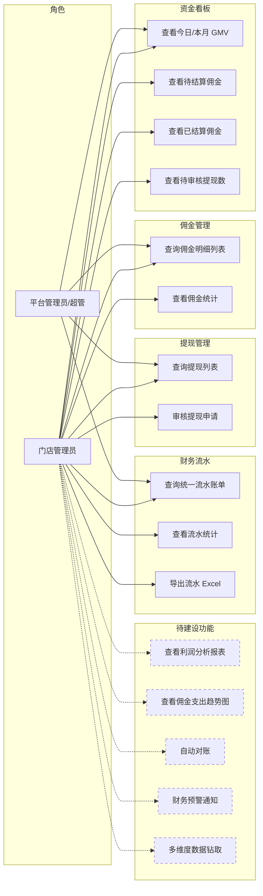
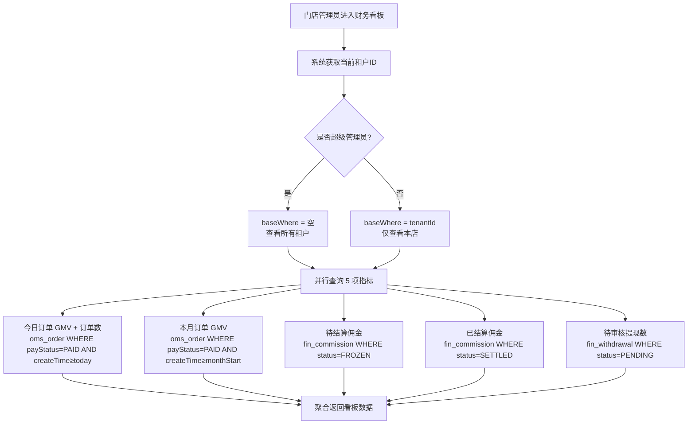
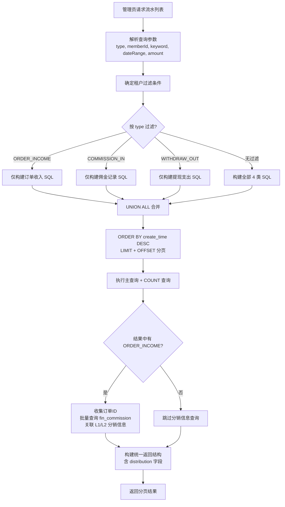
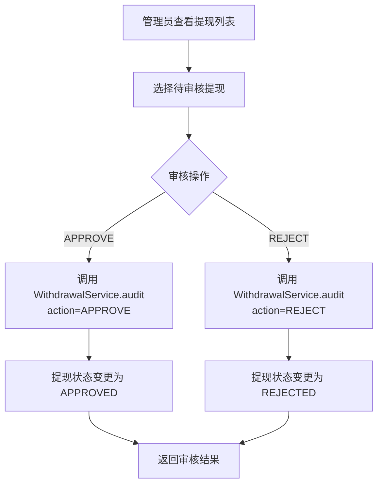

# 门店财务管理模块 — 需求文档

> 版本：1.0
> 日期：2026-02-22
> 模块路径：`src/module/store/finance`
> 状态：现状分析 + 演进规划

---

## 1. 概述

### 1.1 背景

门店财务管理模块为 O2O 多租户平台中的门店管理员提供统一的财务视图。该模块聚合来自订单（`oms_order`）、佣金（`fin_commission`）、钱包流水（`fin_transaction`）、提现（`fin_withdrawal`）四个异构数据源的财务数据，通过 Facade 模式对外提供资金看板、佣金明细查询、提现审核和统一流水账单等能力。

### 1.2 目标

1. 描述当前门店财务模块的完整功能现状
2. 分析现有逻辑的不足与缺陷
3. 对标市面主流 SaaS 门店财务系统，识别功能差距
4. 提出演进建议和待办事项

### 1.3 范围

| 在范围内                           | 不在范围内                                |
| ---------------------------------- | ----------------------------------------- |
| 资金看板（GMV、佣金、提现统计）    | 佣金计算引擎（属于 `finance/commission`） |
| 佣金明细查询与统计                 | 钱包余额操作（属于 `finance/wallet`）     |
| 提现列表查询与审核                 | 支付回调与退款（属于 `client/payment`）   |
| 统一财务流水（UNION ALL 多表合并） | 对账与结算定时任务                        |
| 流水数据导出（Excel）              | 财务报表（利润表、资产负债表）            |

---

## 2. 角色与用例

> 图 1：门店财务管理用例图



> 虚线框为当前未实现、市面主流门店财务系统普遍具备的功能。

---

## 3. 业务流程

### 3.1 资金看板数据加载流程

> 图 2：资金看板活动图



### 3.2 统一流水查询流程

> 图 3：统一流水查询活动图



### 3.3 提现审核流程

> 图 4：提现审核活动图



---

## 4. 现有功能详述

### 4.1 模块架构

本模块采用 Facade（外观）模式，`StoreFinanceService` 作为统一入口，协调 4 个子服务：

| 子服务                        | 职责                                  | 数据源                                          |
| ----------------------------- | ------------------------------------- | ----------------------------------------------- |
| `StoreDashboardService`       | 看板统计、佣金统计                    | `oms_order`, `fin_commission`, `fin_withdrawal` |
| `StoreCommissionQueryService` | 佣金明细分页查询                      | `fin_commission` + `ums_member` + `oms_order`   |
| `StoreLedgerService`          | 统一流水（UNION ALL）、流水统计、导出 | 4 表 UNION ALL                                  |
| `WithdrawalService`（外部）   | 提现列表、审核                        | `fin_withdrawal`                                |

### 4.2 接口清单

| 接口     | 方法 | 路径                        | 权限                             | 说明                                      |
| -------- | ---- | --------------------------- | -------------------------------- | ----------------------------------------- |
| 资金看板 | GET  | `/finance/dashboard`        | `store:finance:dashboard`        | 今日/本月 GMV、佣金、提现统计             |
| 佣金列表 | GET  | `/finance/commission/list`  | `store:finance:commission`       | 分页查询，支持按状态/会员/订单号/日期筛选 |
| 佣金统计 | GET  | `/finance/commission/stats` | `store:finance:commission`       | 今日/本月/待结算佣金汇总                  |
| 提现列表 | GET  | `/finance/withdrawal/list`  | `store:finance:withdrawal`       | 分页查询，支持按状态/会员筛选             |
| 提现审核 | POST | `/finance/withdrawal/audit` | `store:finance:withdrawal:audit` | 通过/驳回                                 |
| 流水列表 | GET  | `/finance/ledger`           | `store:finance:ledger`           | 4 表 UNION ALL 统一流水                   |
| 流水统计 | GET  | `/finance/ledger/stats`     | `store:finance:ledger`           | 收入/支出/净利润/待结算汇总               |
| 流水导出 | POST | `/finance/ledger/export`    | `store:finance:ledger`           | Excel 导出                                |

### 4.3 统一流水数据源映射

`StoreLedgerService` 通过原生 SQL 的 `UNION ALL` 将 4 个异构表映射为统一的流水视图：

| 数据源            | type 标识                           | 金额取值                | 关联用户                              | 备注                             |
| ----------------- | ----------------------------------- | ----------------------- | ------------------------------------- | -------------------------------- |
| `oms_order`       | `ORDER_INCOME`                      | `pay_amount`（正数）    | `member_id → ums_member`              | 仅 `pay_status='1'`              |
| `fin_transaction` | 原始 `type`（排除 `COMMISSION_IN`） | `amount`（可正可负）    | `wallet_id → fin_wallet → ums_member` | 排除佣金入账避免重复             |
| `fin_withdrawal`  | `WITHDRAW_OUT`                      | `-amount`（取反为负数） | `member_id → ums_member`              | 仅 `status='APPROVED'`           |
| `fin_commission`  | `COMMISSION_IN`                     | `amount`（正数）        | `beneficiary_id → ums_member`         | 区分 FROZEN/SETTLED 显示不同文案 |

### 4.4 流水中的分销信息增强

对于 `ORDER_INCOME` 类型的流水记录，系统额外查询该订单关联的佣金记录（`fin_commission`），并在返回结构中附加 `distribution` 字段：

```json
{
  "distribution": {
    "referrer": { "nickname": "张三", "mobile": "138****1234", "amount": 10.0, "status": "FROZEN" },
    "indirectReferrer": { "nickname": "李四", "mobile": "139****5678", "amount": 5.0, "status": "FROZEN" }
  }
}
```

---

## 5. 现有逻辑不足分析

### 5.1 代码层面缺陷

| 编号 | 问题                                       | 严重度 | 详述                                                                                                                                                                                      |
| ---- | ------------------------------------------ | ------ | ----------------------------------------------------------------------------------------------------------------------------------------------------------------------------------------- |
| D-1  | 流水查询无深分页保护                       | 🔴 P0  | `UNION ALL` 子查询使用 `LIMIT ${query.take} OFFSET ${query.skip}`，当 offset 超过 5000 时性能急剧下降。4 表 UNION ALL 的全量排序 + 大 offset 是典型的慢查询模式。                         |
| D-2  | 流水导出无数量限制                         | 🔴 P0  | `exportLedger` 的 SQL 无 `LIMIT`，当数据量大时一次性加载全部记录到内存，可能导致 OOM。                                                                                                    |
| D-3  | 流水统计查询未排除已取消佣金               | 🟡 P1  | `getLedgerStats` 中佣金子查询未加 `status != 'CANCELLED'` 条件，已取消的佣金金额被计入统计，导致收入虚高。                                                                                |
| D-4  | 提现审核未校验租户归属                     | 🟡 P1  | `auditWithdrawal` 获取了 `tenantId` 但未传递给 `WithdrawalService.audit()`，也未校验该提现记录是否属于当前租户。超管场景下可能无意审核其他租户的提现。                                    |
| D-5  | 流水查询 SQL 中 `tenant_id` 过滤位置不一致 | 🟡 P1  | 订单子查询的 `tenant_id` 过滤在 `oms_order` 表上，但钱包流水子查询的 `tenant_id` 过滤也在外层表上。当 `fin_wallet` 或 `fin_transaction` 无 `tenant_id` 列时，过滤可能失效。需确认表结构。 |
| D-6  | 佣金查询 `phone` 参数未生效                | 🟢 P2  | `ListCommissionDto` 定义了 `phone` 字段，`getCommissionList` 中检查了 `query.phone` 但未构建对应的 `where` 条件（仅构建了 `order.orderSn`）。                                             |
| D-7  | 流水查询 SQL 拼接存在 SQL 注入风险评估     | 🟢 P2  | 虽然使用了 Prisma 的 `Prisma.sql` 模板标签（参数化查询），但大量动态条件拼接增加了维护复杂度。`keyword` 字段使用 `LIKE %xxx%` 在大表上无法命中索引。                                      |
| D-8  | 看板查询无缓存                             | 🟢 P2  | `getDashboard` 每次请求执行 5 个聚合查询，高频访问时对数据库压力较大。看板数据允许短时间延迟（如 30 秒缓存）。                                                                            |
| D-9  | 流水导出与列表查询 SQL 大量重复            | 🟢 P2  | `getLedger` 和 `exportLedger` 中的 4 段 UNION ALL SQL 几乎完全相同，违反 DRY 原则。修改一处容易遗漏另一处。                                                                               |

### 5.2 架构层面不足

| 编号 | 问题             | 详述                                                                                        |
| ---- | ---------------- | ------------------------------------------------------------------------------------------- |
| A-1  | 无利润分析能力   | 当前仅展示收入/支出/净利润的简单汇总，无法按日/周/月查看趋势，无法按商品/品类分析利润贡献。 |
| A-2  | 无财务预警机制   | 佣金支出异常增长、提现集中爆发等场景无自动预警。                                            |
| A-3  | 无自动对账       | 订单收入与佣金支出之间无自动对账校验，依赖人工核对。                                        |
| A-4  | 流水查询性能瓶颈 | UNION ALL 跨 4 表实时查询，随数据增长性能不可控。市面系统通常使用预聚合表或物化视图。       |
| A-5  | 无数据钻取能力   | 看板数字无法点击下钻到明细，如"今日 GMV"无法直接跳转到对应订单列表。                        |
| A-6  | 导出功能无异步化 | 大数据量导出同步执行，可能超时。市面系统通常使用异步导出 + 下载中心。                       |

---

## 6. 市面主流门店财务系统对标

### 6.1 功能对比矩阵

| 功能                         | 本系统 | 有赞商家后台 | 美团商家版 | Shopify Admin | 差距评估           |
| ---------------------------- | ------ | ------------ | ---------- | ------------- | ------------------ |
| 资金看板（GMV/佣金/提现）    | ✅     | ✅           | ✅         | ✅            | 持平               |
| 佣金明细查询                 | ✅     | ✅           | ✅         | ✅            | 持平               |
| 提现审核                     | ✅     | ✅           | ✅         | —             | 持平               |
| 统一流水账单                 | ✅     | ✅           | ✅         | ✅            | 持平               |
| 流水导出                     | ✅     | ✅           | ✅         | ✅            | 持平               |
| 流水中关联分销信息           | ✅     | ❌           | ❌         | ❌            | 领先               |
| 超管跨租户查看               | ✅     | —            | —          | —             | 领先（多租户特有） |
| 利润趋势分析                 | ❌     | ✅           | ✅         | ✅            | 缺失（高优）       |
| 佣金支出趋势图               | ❌     | ✅           | —          | —             | 缺失（中优）       |
| 自动对账                     | ❌     | ✅           | ✅         | ✅            | 缺失（高优）       |
| 财务预警                     | ❌     | ✅           | ✅         | ❌            | 缺失（中优）       |
| 数据钻取                     | ❌     | ✅           | ✅         | ✅            | 缺失（中优）       |
| 异步导出 + 下载中心          | ❌     | ✅           | ✅         | ✅            | 缺失（中优）       |
| 多维度报表（商品/品类/时段） | ❌     | ✅           | ✅         | ✅            | 缺失（高优）       |
| 税务/发票管理                | ❌     | ✅           | ✅         | ✅            | 缺失（低优）       |

### 6.2 差距总结

本系统在统一流水账单（4 表 UNION ALL）和流水中关联分销信息方面具有特色。主要差距集中在：

1. 利润趋势分析：运营决策必备，当前仅有静态汇总
2. 自动对账：资金安全保障，当前完全依赖人工
3. 多维度报表：按商品/品类/时段分析，辅助经营决策
4. 性能与可扩展性：UNION ALL 实时查询在数据增长后将成为瓶颈

---

## 7. 验收标准（现有功能）

| 编号  | 验收条件                                                                                                                               | 状态             |
| ----- | -------------------------------------------------------------------------------------------------------------------------------------- | ---------------- |
| AC-1  | 看板接口返回 6 项指标（todayGMV, todayOrderCount, monthGMV, pendingCommission, settledCommission, pendingWithdrawals），空数据时返回 0 | ✅ 已通过        |
| AC-2  | 佣金列表支持按 status、memberId、orderSn、日期范围筛选，返回分页结果                                                                   | ✅ 已通过        |
| AC-3  | 佣金统计返回今日/本月/待结算 3 项指标，排除已取消佣金                                                                                  | ✅ 已通过        |
| AC-4  | 流水列表支持按 type 过滤，返回统一结构（id, type, typeName, amount, user, createTime）                                                 | ✅ 已通过        |
| AC-5  | ORDER_INCOME 类型流水附带 distribution 分销信息（L1/L2）                                                                               | ✅ 已通过        |
| AC-6  | 超级管理员可查看所有租户数据，普通租户仅查看本店数据                                                                                   | ✅ 已通过        |
| AC-7  | 提现审核校验提现记录归属当前租户                                                                                                       | ❌ 未实现（D-4） |
| AC-8  | 流水查询 offset > 5000 时返回错误或自动切换游标分页                                                                                    | ❌ 未实现（D-1） |
| AC-9  | 流水导出单次不超过 10000 条，超出提示使用异步导出                                                                                      | ❌ 未实现（D-2） |
| AC-10 | 流水统计排除已取消佣金                                                                                                                 | ❌ 未实现（D-3） |

---

## 8. 演进建议与待办

### 8.1 短期（1-2 周）— 修复现有缺陷

| 编号 | 任务                                                      | 对应缺陷 | 预估工时 |
| ---- | --------------------------------------------------------- | -------- | -------- |
| T-1  | 流水查询增加深分页保护（offset ≤ 5000）                   | D-1      | 1h       |
| T-2  | 流水导出增加数量限制（≤ 10000 条）                        | D-2      | 1h       |
| T-3  | 流水统计佣金子查询增加 `status != 'CANCELLED'`            | D-3      | 0.5h     |
| T-4  | 提现审核增加租户归属校验                                  | D-4      | 1h       |
| T-5  | 佣金查询 `phone` 参数生效（关联 `ums_member.mobile`）     | D-6      | 0.5h     |
| T-6  | 看板接口增加 30 秒 Redis 缓存                             | D-8      | 1h       |
| T-7  | 流水 SQL 抽取为共享方法，消除 getLedger/exportLedger 重复 | D-9      | 2h       |

### 8.2 中期（1-2 月）— 补齐核心功能

| 编号 | 任务                                             | 对应差距 | 预估工时 |
| ---- | ------------------------------------------------ | -------- | -------- |
| T-8  | 利润趋势分析接口（按日/周/月聚合）               | A-1      | 3-5d     |
| T-9  | 佣金支出趋势图接口                               | A-1      | 1-2d     |
| T-10 | 自动对账定时任务（订单收入 vs 佣金支出校验）     | A-3      | 3-5d     |
| T-11 | 流水预聚合表（每日定时汇总，替代实时 UNION ALL） | A-4      | 3-5d     |
| T-12 | 异步导出 + 下载中心                              | A-6      | 2-3d     |

### 8.3 长期（3-6 月）— 竞争力建设

| 编号 | 任务                                           | 说明             |
| ---- | ---------------------------------------------- | ---------------- |
| T-13 | 多维度报表（按商品/品类/时段分析利润贡献）     | 辅助门店经营决策 |
| T-14 | 财务预警机制（佣金异常增长、提现集中爆发告警） | 资金安全保障     |
| T-15 | 数据钻取（看板数字可点击下钻到明细列表）       | 提升运营效率     |
| T-16 | 税务/发票管理                                  | 合规需求         |
