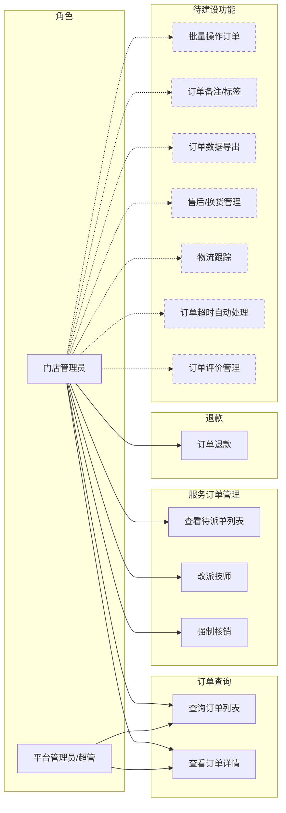
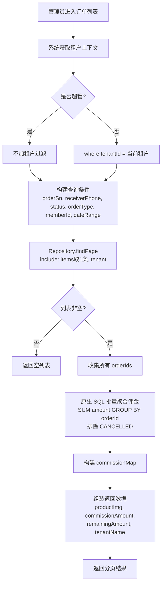
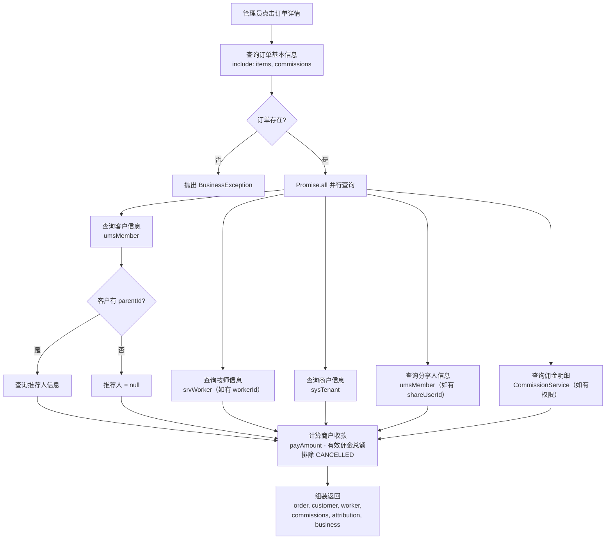
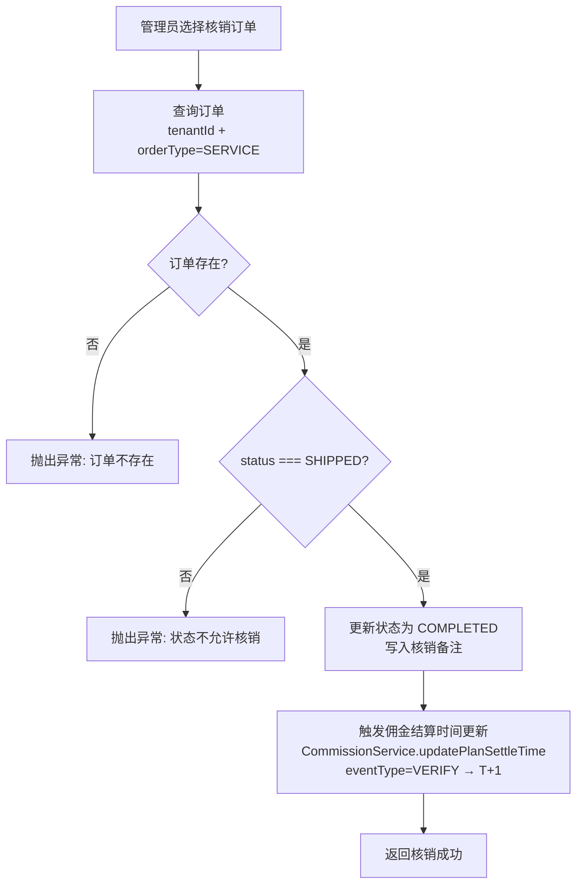
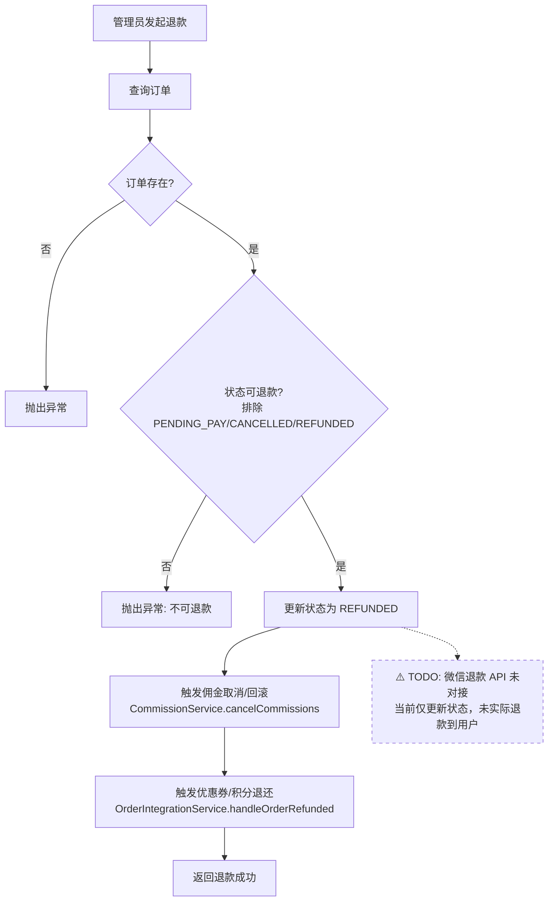
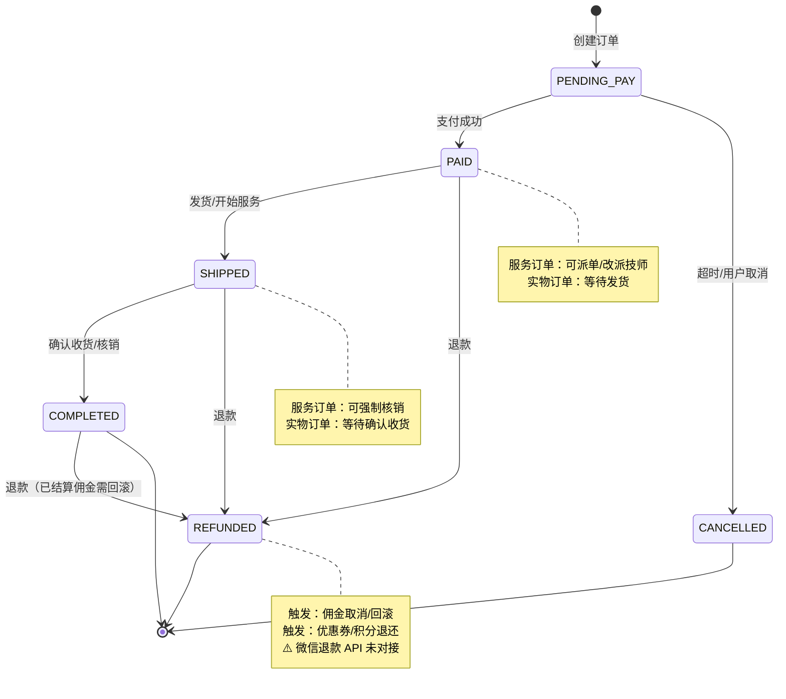

# 门店订单管理模块 — 需求文档

> 版本：1.0
> 日期：2026-02-22
> 模块路径：`src/module/store/order`
> 状态：现状分析 + 演进规划

---

## 1. 概述

### 1.1 背景

门店订单管理模块为 O2O 多租户平台中的门店管理员提供订单全生命周期管理能力。支持实物订单和服务订单两种类型，涵盖订单查询、详情展示（含佣金分配画像）、服务订单技师派单/改派、强制核销、退款等操作。该模块是门店端的核心业务入口，与 `finance/commission`（佣金计算）、`finance/wallet`（钱包）、`marketing/integration`（优惠券/积分退还）等模块深度协作。

### 1.2 目标

1. 描述当前门店订单模块的完整功能现状
2. 分析现有逻辑的不足与缺陷
3. 对标市面主流门店订单管理系统，识别功能差距
4. 提出演进建议和待办事项

### 1.3 范围

| 在范围内                              | 不在范围内                                |
| ------------------------------------- | ----------------------------------------- |
| 订单列表查询（含佣金汇总）            | C 端下单流程（属于 `client/order`）       |
| 订单详情（含客户/技师/佣金/归因画像） | 支付回调（属于 `client/payment`）         |
| 服务订单技师派单/改派                 | 佣金计算引擎（属于 `finance/commission`） |
| 强制核销                              | 物流发货/签收（属于 `client/order`）      |
| 退款（含佣金回滚、优惠券/积分退还）   | 售后/换货流程                             |

---

## 2. 角色与用例

> 图 1：门店订单管理用例图

> 虚线框为当前未实现、市面主流门店订单系统普遍具备的功能。

---

## 3. 业务流程

### 3.1 订单列表查询流程

> 图 2：订单列表查询活动图

### 3.2 订单详情查询流程

> 图 3：订单详情查询活动图

### 3.3 服务订单核销流程

> 图 4：强制核销活动图

### 3.4 退款流程

> 图 5：订单退款活动图

---

## 4. 现有功能详述

### 4.1 接口清单

| 接口       | 方法 | 路径                   | 权限                   | 说明                                   |
| ---------- | ---- | ---------------------- | ---------------------- | -------------------------------------- |
| 订单列表   | GET  | `/order/list`          | `store:order:list`     | 分页查询，含佣金汇总和商品图片         |
| 订单详情   | GET  | `/order/detail/:id`    | `store:order:query`    | 完整画像：客户/技师/佣金/归因/商户     |
| 待派单列表 | GET  | `/order/dispatch/list` | `store:order:dispatch` | 服务订单，status=PAID 且 workerId=null |
| 改派技师   | POST | `/order/reassign`      | `store:order:dispatch` | 校验订单状态和技师归属                 |
| 强制核销   | POST | `/order/verify`        | `store:order:verify`   | 仅 SHIPPED 状态可核销，触发佣金结算    |
| 退款       | —    | 内部方法 `refundOrder` | —                      | 未暴露 HTTP 接口，仅内部调用           |

### 4.2 订单状态流转

> 图 6：订单状态图

### 4.3 性能优化措施

| 优化点       | 方案                                               | 效果                       |
| ------------ | -------------------------------------------------- | -------------------------- |
| 列表佣金计算 | 原生 SQL `SUM(amount) GROUP BY order_id` 批量聚合  | 替代 N+1 查询，提升 80%    |
| 详情关联查询 | `Promise.all` 并行查询 5 个关联实体                | 140ms → 40ms，提升 70%     |
| 列表商品图片 | `items: { take: 1, select: { productImg } }`       | 仅取第一张图，减少数据传输 |
| 列表租户名称 | `include: { tenant: { select: { companyName } } }` | 一次查询关联，无额外请求   |

---

## 5. 现有逻辑不足分析

### 5.1 代码层面缺陷

| 编号 | 问题                                            | 严重度 | 详述                                                                                                                                                        |
| ---- | ----------------------------------------------- | ------ | ----------------------------------------------------------------------------------------------------------------------------------------------------------- |
| D-1  | `verifyService` 重复 `@Transactional()` 装饰器  | 🔴 P0  | 方法上有两个 `@Transactional()` 装饰器，可能导致嵌套事务或装饰器冲突，行为不可预测。                                                                        |
| D-2  | 退款方法未暴露 HTTP 接口                        | 🟡 P1  | `refundOrder` 仅为内部方法，Controller 中无对应路由。管理员无法通过后台发起退款操作。                                                                       |
| D-3  | 退款未对接微信退款 API                          | 🔴 P0  | 退款仅更新订单状态和回滚佣金，未实际将资金退还给用户。代码中已标注 TODO。                                                                                   |
| D-4  | 列表查询存在大量硬编码调试日志                  | 🟡 P1  | `findAll` 中有约 30 行针对订单号 `202602031020VJSIA849` 的调试日志和额外查询，严重影响性能和代码可读性。生产环境不应保留。                                  |
| D-5  | 佣金汇总使用原生 SQL 的 `status::text` 类型转换 | 🟢 P2  | `AND status::text != 'CANCELLED'` 依赖 PostgreSQL 的类型转换语法。若数据库切换或 Prisma 升级可能不兼容。建议使用枚举值直接比较。                            |
| D-6  | 核销后佣金结算时间更新失败被静默吞掉            | 🟡 P1  | `verifyService` 中 `updatePlanSettleTime` 的异常被 catch 后仅打日志，不影响核销结果。但佣金结算时间未更新可能导致结算延迟。                                 |
| D-7  | 退款中佣金取消和积分退还失败被静默吞掉          | 🟡 P1  | `refundOrder` 中 `cancelCommissions` 和 `handleOrderRefunded` 的异常被 catch 后仅打日志。退款成功但佣金未取消或积分未退还，造成资金不一致。                 |
| D-8  | 订单详情查询 `commissions` 包含已取消记录       | 🟢 P2  | `findOne` 中 `include: { commissions: true }` 会返回所有佣金记录（含 CANCELLED），但计算 `remainingAmount` 时已排除。前端可能展示已取消的佣金记录造成混淆。 |
| D-9  | 改派技师未记录操作日志                          | 🟢 P2  | `reassignWorker` 仅打印 logger，未写入操作日志表（`@Operlog`），无法审计追溯。                                                                              |

### 5.2 架构层面不足

| 编号 | 问题               | 详述                                                       |
| ---- | ------------------ | ---------------------------------------------------------- |
| A-1  | 无批量操作能力     | 不支持批量发货、批量核销、批量退款等操作。                 |
| A-2  | 无订单导出         | 门店管理员无法导出订单数据用于对账或报表。                 |
| A-3  | 无售后/换货流程    | 仅支持全额退款，不支持部分退款、换货、售后工单。           |
| A-4  | 无订单超时自动处理 | 未支付订单无自动关闭机制，待核销订单无超时提醒。           |
| A-5  | 无物流跟踪集成     | 实物订单无物流信息查询和推送。                             |
| A-6  | 无订单评价管理     | 门店无法查看和回复用户评价。                               |
| A-7  | 退款接口未暴露     | 退款功能存在但无 HTTP 入口，需补充 Controller 路由和权限。 |

---

## 6. 市面主流门店订单系统对标

### 6.1 功能对比矩阵

| 功能                  | 本系统  | 有赞商家后台 | 美团商家版 | Shopify Admin | 差距评估           |
| --------------------- | ------- | ------------ | ---------- | ------------- | ------------------ |
| 订单列表（分页/筛选） | ✅      | ✅           | ✅         | ✅            | 持平               |
| 订单详情（完整画像）  | ✅      | ✅           | ✅         | ✅            | 持平               |
| 列表含佣金汇总        | ✅      | ❌           | ❌         | ❌            | 领先               |
| 详情含分销归因        | ✅      | ✅           | ❌         | ❌            | 领先               |
| 技师派单/改派         | ✅      | —            | ✅         | —             | 持平（O2O 特有）   |
| 强制核销              | ✅      | —            | ✅         | —             | 持平（O2O 特有）   |
| 退款（含佣金回滚）    | ⚠️ 部分 | ✅           | ✅         | ✅            | 缺失微信退款（P0） |
| 批量操作              | ❌      | ✅           | ✅         | ✅            | 缺失（中优）       |
| 订单导出              | ❌      | ✅           | ✅         | ✅            | 缺失（中优）       |
| 售后/换货             | ❌      | ✅           | ✅         | ✅            | 缺失（高优）       |
| 订单超时自动处理      | ❌      | ✅           | ✅         | ✅            | 缺失（高优）       |
| 物流跟踪              | ❌      | ✅           | ✅         | ✅            | 缺失（中优）       |
| 订单评价管理          | ❌      | ✅           | ✅         | ✅            | 缺失（低优）       |
| 部分退款              | ❌      | ✅           | ✅         | ✅            | 缺失（高优）       |
| 订单备注/标签         | ❌      | ✅           | ✅         | ✅            | 缺失（低优）       |

### 6.2 差距总结

本系统在订单列表含佣金汇总和详情含分销归因方面具有差异化优势。主要差距集中在：

1. 微信退款未对接：P0 级别，退款仅更新状态未实际退款
2. 订单超时自动处理：未支付订单无自动关闭，影响库存和用户体验
3. 售后/部分退款：仅支持全额退款，不支持按商品维度部分退款
4. 批量操作和导出：运营效率工具缺失

---

## 7. 验收标准（现有功能）

| 编号  | 验收条件                                                                               | 状态             |
| ----- | -------------------------------------------------------------------------------------- | ---------------- |
| AC-1  | 订单列表返回分页结果，每条含 productImg、commissionAmount、remainingAmount、tenantName | ✅ 已通过        |
| AC-2  | 非超管仅查看本租户订单，超管查看全部                                                   | ✅ 已通过        |
| AC-3  | 订单详情返回 order、customer、worker、commissions、attribution、business 完整画像      | ✅ 已通过        |
| AC-4  | 待派单列表仅返回 SERVICE 类型、PAID 状态、workerId=null 的订单                         | ✅ 已通过        |
| AC-5  | 改派技师校验订单状态（PAID/SHIPPED）和技师归属当前租户                                 | ✅ 已通过        |
| AC-6  | 强制核销仅允许 SHIPPED 状态，核销后触发佣金结算时间更新                                | ✅ 已通过        |
| AC-7  | 退款后佣金状态变为 CANCELLED，已结算佣金执行钱包扣减                                   | ✅ 已通过        |
| AC-8  | 退款通过 HTTP 接口发起（含权限校验）                                                   | ❌ 未实现（D-2） |
| AC-9  | 退款实际调用微信退款 API 将资金退还用户                                                | ❌ 未实现（D-3） |
| AC-10 | `verifyService` 无重复 `@Transactional()` 装饰器                                       | ❌ 未修复（D-1） |

---

## 8. 演进建议与待办

### 8.1 短期（1-2 周）— 修复现有缺陷

| 编号 | 任务                                           | 对应缺陷 | 预估工时 |
| ---- | ---------------------------------------------- | -------- | -------- |
| T-1  | 移除 `verifyService` 重复的 `@Transactional()` | D-1      | 0.1h     |
| T-2  | 清理 `findAll` 中的硬编码调试日志              | D-4      | 0.5h     |
| T-3  | 暴露退款 HTTP 接口（Controller 路由 + 权限）   | D-2, A-7 | 1h       |
| T-4  | 核销/退款中关键副作用失败时抛出异常或重试      | D-6, D-7 | 2h       |
| T-5  | 改派技师增加 `@Operlog` 操作日志               | D-9      | 0.5h     |
| T-6  | 订单详情佣金查询排除 CANCELLED 状态            | D-8      | 0.5h     |

### 8.2 中期（1-2 月）— 补齐核心功能

| 编号 | 任务                              | 对应差距 | 预估工时 |
| ---- | --------------------------------- | -------- | -------- |
| T-7  | 对接微信退款 API                  | D-3      | 3-5d     |
| T-8  | 订单超时自动关闭（Bull 延迟任务） | A-4      | 2-3d     |
| T-9  | 部分退款（按商品维度）            | A-3      | 3-5d     |
| T-10 | 订单数据导出（Excel）             | A-2      | 1-2d     |
| T-11 | 批量操作（发货/核销/退款）        | A-1      | 2-3d     |

### 8.3 长期（3-6 月）— 竞争力建设

| 编号 | 任务          | 说明                               |
| ---- | ------------- | ---------------------------------- |
| T-12 | 售后工单系统  | 支持换货、维修、部分退款等售后场景 |
| T-13 | 物流跟踪集成  | 对接快递100等物流查询 API          |
| T-14 | 订单评价管理  | 门店查看/回复用户评价              |
| T-15 | 订单备注/标签 | 内部协作标记                       |
