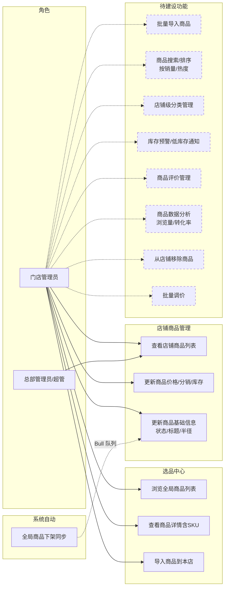
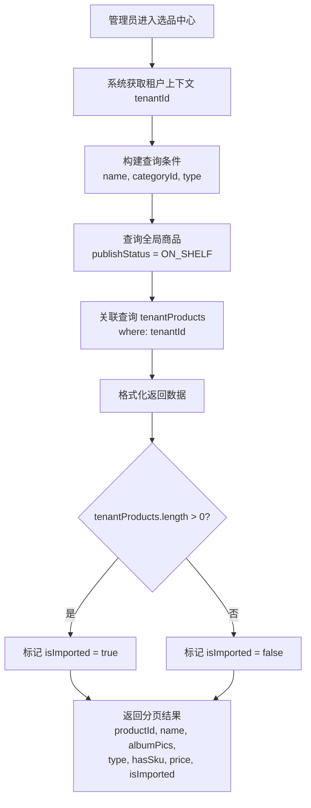
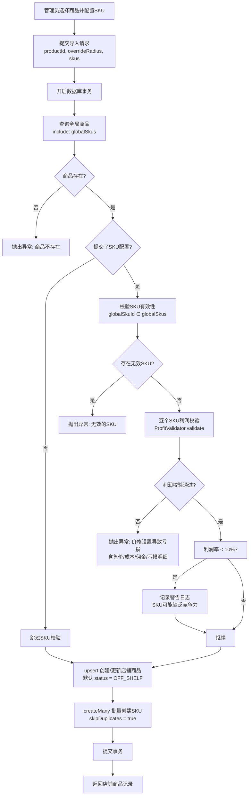
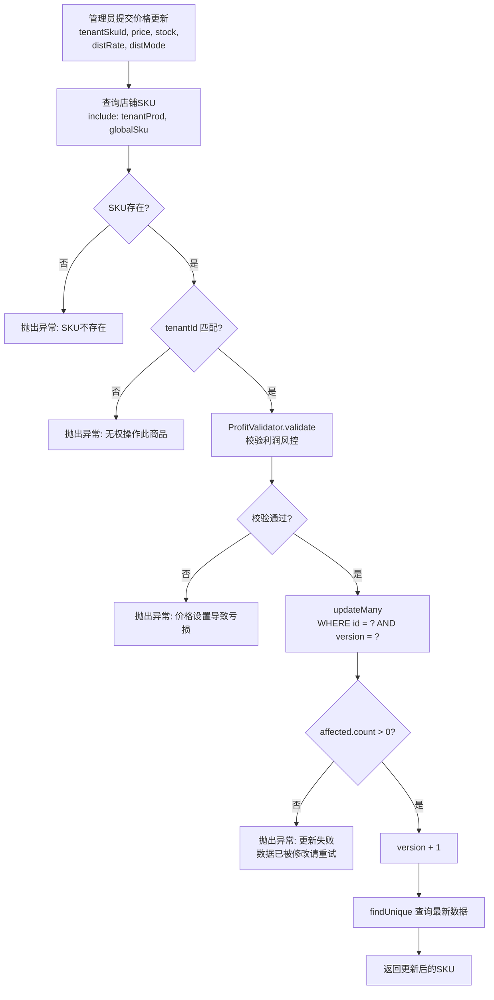
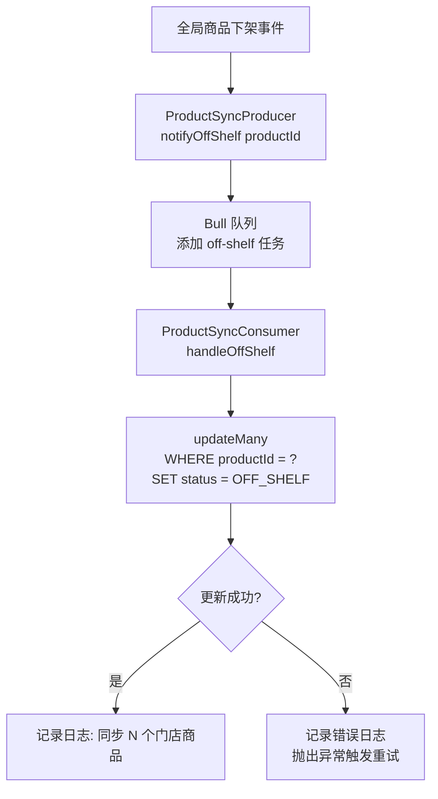
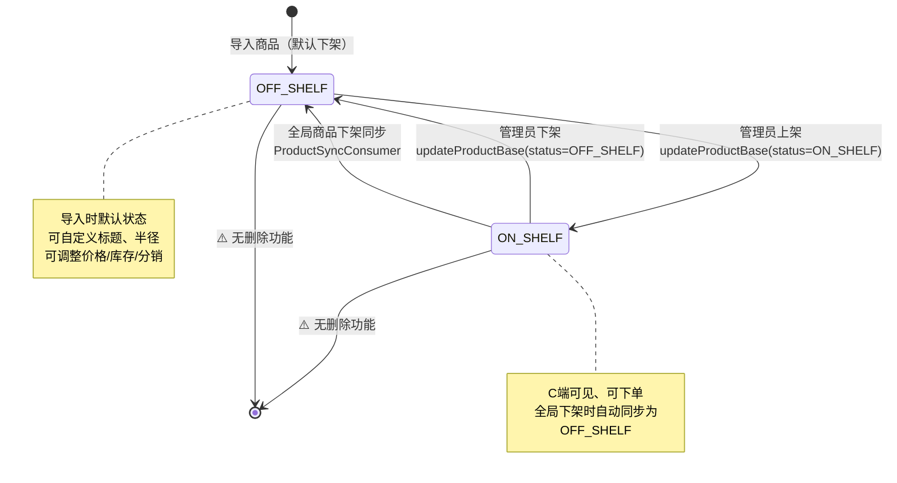

# 门店商品管理模块 — 需求文档

> 版本：1.0
> 日期：2026-02-22
> 模块路径：`src/module/store/product`
> 状态：现状分析 + 演进规划

---

## 1. 概述

### 1.1 背景

门店商品管理模块为 O2O 多租户平台中的门店管理员提供商品全生命周期管理能力。模块采用「全局商品库 → 门店选品导入」的两级架构：平台维护全局商品库（`pmsProduct` + `pmsSku`），门店从选品中心浏览并导入商品到本店（`pmsTenantProduct` + `pmsTenantSku`），导入后可自定义售价、库存、分销配置和服务半径。模块内置利润风控校验器（`ProfitValidator`），在导入和调价时强制校验 `售价 - 成本 - 佣金 ≥ 0`，防止亏损销售。同时通过 Bull 队列实现全局商品下架时的门店商品自动同步。

### 1.2 目标

1. 描述当前门店商品模块的完整功能现状
2. 分析现有逻辑的代码缺陷与架构不足
3. 对标市面主流门店商品管理系统，识别功能差距
4. 提出演进建议和待办事项

### 1.3 范围

| 在范围内                             | 不在范围内                                |
| ------------------------------------ | ----------------------------------------- |
| 选品中心浏览（全局商品列表、详情）   | 全局商品库 CRUD（属于 `admin/product`）   |
| 商品导入（含 SKU 配置、利润校验）    | C 端商品展示（属于 `client/product`）     |
| 店铺商品列表查询（含 HQ 跨店视角）   | 商品分类管理（属于 `admin/category`）     |
| 商品价格/库存/分销配置更新           | 订单中的库存扣减（属于 `store/order`）    |
| 商品基础信息更新（状态、标题、半径） | 佣金计算引擎（属于 `finance/commission`） |
| 全局商品下架同步（Bull 队列）        | 商品评价管理                              |

---

## 2. 角色与用例

> 图 1：门店商品管理用例图

> 虚线框为当前未实现、市面主流门店商品系统普遍具备的功能。HQ 总部管理员可通过 `storeId` 参数跨店查看商品列表。

---

## 3. 业务流程

### 3.1 选品中心浏览流程

> 图 2：选品中心浏览活动图

### 3.2 商品导入流程

> 图 3：商品导入活动图

### 3.3 价格更新流程（含乐观锁）

> 图 4：价格更新活动图

### 3.4 全局商品下架同步流程

> 图 5：商品下架同步活动图

---

## 4. 状态说明

> 图 6：门店商品状态图

**说明**：当前门店商品仅有 `ON_SHELF`（上架）和 `OFF_SHELF`（下架）两种状态。不支持从店铺移除商品（无删除功能），已导入的商品只能在上架/下架之间切换。

---

## 5. 现有功能详述

### 5.1 接口清单

| 接口         | 方法 | 路径                              | 权限          | 说明                             |
| ------------ | ---- | --------------------------------- | ------------- | -------------------------------- |
| 选品中心列表 | POST | `/store/market/list`              | ⚠️ 无权限校验 | 查询全局上架商品，标记是否已引入 |
| 选品中心详情 | GET  | `/store/market/detail/:productId` | ⚠️ 无权限校验 | 查看商品详情含全局SKU列表        |
| 导入商品     | POST | `/store/product/import`           | ⚠️ 无权限校验 | 导入全局商品到本店，含利润校验   |
| 店铺商品列表 | POST | `/store/product/list`             | ⚠️ 无权限校验 | 查询已引入商品，支持HQ跨店查询   |
| 更新商品价格 | POST | `/store/product/update-price`     | ⚠️ 无权限校验 | 更新售价/库存/分销配置，含乐观锁 |
| 更新基础信息 | POST | `/store/product/update-base`      | ⚠️ 无权限校验 | 更新状态/自定义标题/服务半径     |

### 5.2 利润风控校验器（ProfitValidator）

利润风控校验器是本模块的核心业务规则组件，在商品导入和价格更新时强制执行。

| 校验阶段 | 规则                         | 失败行为           |
| -------- | ---------------------------- | ------------------ |
| 参数校验 | 售价 > 0                     | 抛出异常           |
| 参数校验 | 分销费率 ≥ 0                 | 抛出异常           |
| 参数校验 | RATIO 模式下费率 ≤ 1（100%） | 抛出异常           |
| 佣金计算 | RATIO: 佣金 = 售价 × 费率    | —                  |
| 佣金计算 | FIXED: 佣金 = 固定金额       | —                  |
| 佣金计算 | NONE: 佣金 = 0               | —                  |
| 利润校验 | 售价 - 成本 - 佣金 ≥ 0       | 抛出异常（含明细） |
| 利润预警 | 利润率 < 10%                 | 记录 WARN 日志     |

### 5.3 数据模型关系

| 表                 | 说明             | 关键字段                                                                              |
| ------------------ | ---------------- | ------------------------------------------------------------------------------------- |
| `pmsProduct`       | 全局商品（母版） | productId, name, mainImages, type, publishStatus, serviceRadius                       |
| `pmsSku`           | 全局SKU          | skuId, productId, specValues, guidePrice, costPrice, distMode, guideRate              |
| `pmsTenantProduct` | 门店商品（映像） | id, tenantId, productId, status, customTitle, overrideRadius                          |
| `pmsTenantSku`     | 门店SKU（映像）  | id, tenantId, tenantProductId, globalSkuId, price, stock, distMode, distRate, version |

### 5.4 性能优化措施

| 优化点       | 方案                                | 效果               |
| ------------ | ----------------------------------- | ------------------ |
| 选品中心列表 | `Promise.all` 并行查询 list + count | 减少串行等待       |
| 商品导入     | `upsert` 防止并发重复导入           | 幂等性保证         |
| SKU 批量创建 | `createMany` + `skipDuplicates`     | 批量写入，跳过重复 |
| 价格更新     | 乐观锁（`version` 字段）            | 无锁并发控制       |
| 下架同步     | Bull 队列异步处理                   | 不阻塞主流程       |

---

## 6. 现有逻辑不足分析

### 6.1 代码层面缺陷

| 编号 | 问题                                                                                      | 严重度 | 详述                                                                                                                                                                                                                 |
| ---- | ----------------------------------------------------------------------------------------- | ------ | -------------------------------------------------------------------------------------------------------------------------------------------------------------------------------------------------------------------- |
| D-1  | 所有 Controller 端点缺少 `@RequirePermission` 装饰器                                      | 🟡 P1  | 6 个接口均无权限校验，任何已登录用户均可操作商品管理功能。应按功能添加 `store:product:list`、`store:product:import`、`store:product:update` 等权限标识。                                                             |
| D-2  | `importProduct` 使用 `prisma.$transaction` 而非 `@Transactional()` 装饰器                 | 🟡 P1  | 项目约定使用 `@Transactional()` 装饰器管理事务（基于 CLS 上下文传播）。直接使用 `prisma.$transaction` 回调与项目其他模块风格不一致，且无法与 CLS 事务上下文联动。                                                    |
| D-3  | `findAll` 允许 `storeId` 参数覆盖租户隔离                                                 | 🟡 P1  | `where.tenantId = storeId \|\| tenantId`，任何门店管理员传入其他门店的 `storeId` 即可查看其商品列表。HQ 跨店查询场景应增加角色/权限校验（如 `@RequireRole('superadmin')`）。                                         |
| D-4  | 列表查询接口使用 POST 方法                                                                | 🟢 P2  | `getMarketList` 和 `findAll` 使用 `@Post` 进行列表查询，不符合 RESTful 规范（查询应为 GET）。可能是为了支持复杂查询体，但应在文档中说明原因。                                                                        |
| D-5  | `importProduct` 的 SKU 创建使用 `skipDuplicates` 但不更新已有 SKU                         | 🟢 P2  | 重新导入同一商品时，`createMany({ skipDuplicates: true })` 会跳过已存在的 SKU。若全局 SKU 价格已变更，门店 SKU 不会同步更新。应改为 `upsert` 或提供单独的同步机制。                                                  |
| D-6  | `ProductSyncProducer` 已定义但未在 `product.module.ts` 中注册 Bull 队列                   | 🟢 P2  | `product.module.ts` 未导入 `BullModule.registerQueue({ name: PRODUCT_SYNC_QUEUE })`，也未将 `ProductSyncProducer` 和 `ProductSyncConsumer` 注册为 providers。队列功能实际不可用。                                    |
| D-7  | `updateProductPrice` 乐观锁更新与返回查询之间存在竞态窗口                                 | 🟢 P2  | `updateMany`（乐观锁）成功后，通过单独的 `findUnique` 查询最新数据返回。在两次操作之间，数据可能被其他请求修改，导致返回的数据与实际更新的版本不一致。应在同一事务内完成或使用 `update`（非 `updateMany`）直接返回。 |
| D-8  | 无从店铺移除商品的功能                                                                    | 🟢 P2  | 已导入的商品只能上架/下架，无法从店铺中删除。长期使用后会积累大量无用商品数据。                                                                                                                                      |
| D-9  | `TenantProductRepository` 和 `TenantSkuRepository` 已注册但未被 `product.service.ts` 使用 | 🟢 P2  | Service 直接使用 `PrismaService` 操作数据库，未通过 Repository 层。Repository 中封装的 `findWithRelations`、`updatePriceWithVersion` 等方法未被调用，违反项目分层约定。                                              |

### 6.2 架构层面不足

| 编号 | 问题                          | 详述                                                                 |
| ---- | ----------------------------- | -------------------------------------------------------------------- |
| A-1  | 无批量导入能力                | 门店只能逐个导入商品，无法一次性从选品中心批量选择多个商品导入。     |
| A-2  | 无商品搜索排序（按销量/热度） | 选品中心仅支持按名称、分类、类型筛选，不支持按销量、评分、热度排序。 |
| A-3  | 无店铺级商品分类管理          | 门店无法自定义商品分类，只能使用全局分类体系。                       |
| A-4  | 无库存预警/低库存通知         | 库存降至阈值时无自动提醒机制，需管理员手动检查。                     |
| A-5  | 无商品评价管理                | 门店无法查看和回复用户对商品的评价。                                 |
| A-6  | 无商品数据分析                | 无商品浏览量、转化率、销量趋势等数据统计。                           |

---

## 7. 市面主流门店商品系统对标

### 7.1 功能对比矩阵

| 功能                  | 本系统 | 有赞商家后台 | 美团商家版 | Shopify Admin | 差距评估         |
| --------------------- | ------ | ------------ | ---------- | ------------- | ---------------- |
| 选品中心浏览          | ✅     | ✅           | ✅         | ✅            | 持平             |
| 商品导入（含SKU配置） | ✅     | ✅           | ✅         | ✅            | 持平             |
| 利润风控校验          | ✅     | ❌           | ❌         | ❌            | 领先             |
| 乐观锁并发控制        | ✅     | ✅           | ✅         | ✅            | 持平             |
| 全局下架自动同步      | ✅     | ✅           | ✅         | ✅            | 持平             |
| 自定义标题/服务半径   | ✅     | ✅           | ✅         | —             | 持平（O2O 特有） |
| HQ 跨店查看           | ✅     | ✅           | ✅         | ✅            | 持平             |
| 权限控制              | ❌     | ✅           | ✅         | ✅            | 缺失（P1）       |
| 批量导入              | ❌     | ✅           | ✅         | ✅            | 缺失（中优）     |
| 批量调价              | ❌     | ✅           | ✅         | ✅            | 缺失（中优）     |
| 商品移除/删除         | ❌     | ✅           | ✅         | ✅            | 缺失（中优）     |
| 按销量/热度排序       | ❌     | ✅           | ✅         | ✅            | 缺失（低优）     |
| 店铺级分类            | ❌     | ✅           | ✅         | ✅            | 缺失（低优）     |
| 库存预警              | ❌     | ✅           | ✅         | ✅            | 缺失（中优）     |
| 商品数据分析          | ❌     | ✅           | ✅         | ✅            | 缺失（低优）     |
| 商品评价管理          | ❌     | ✅           | ✅         | ✅            | 缺失（低优）     |
| SKU 重新同步/更新     | ❌     | ✅           | ✅         | ✅            | 缺失（中优）     |

### 7.2 差距总结

本系统在利润风控校验方面具有差异化优势（有赞/美团/Shopify 均无内置利润校验）。主要差距集中在：

1. 权限缺失：所有接口无 `@RequirePermission`，P1 级别安全隐患
2. 批量操作：不支持批量导入和批量调价，影响运营效率
3. 商品移除：已导入商品无法删除，数据会持续膨胀
4. SKU 同步：重新导入不更新已有 SKU，全局价格变更无法同步到门店

---

## 8. 验收标准（现有功能）

| 编号  | 验收条件                                                               | 状态             |
| ----- | ---------------------------------------------------------------------- | ---------------- |
| AC-1  | 选品中心列表仅展示 `publishStatus = ON_SHELF` 的全局商品               | ✅ 已通过        |
| AC-2  | 选品中心列表正确标记 `isImported` 状态（当前租户是否已引入）           | ✅ 已通过        |
| AC-3  | 商品详情返回全局 SKU 列表（含 guidePrice、costPrice、distMode）        | ✅ 已通过        |
| AC-4  | 导入商品时 ProfitValidator 校验 `售价 - 成本 - 佣金 ≥ 0`，不满足则拒绝 | ✅ 已通过        |
| AC-5  | 导入商品使用 upsert 防止并发重复导入                                   | ✅ 已通过        |
| AC-6  | 导入商品默认状态为 `OFF_SHELF`                                         | ✅ 已通过        |
| AC-7  | 价格更新使用乐观锁（version 字段），并发冲突时返回明确错误信息         | ✅ 已通过        |
| AC-8  | 店铺商品列表支持按名称、类型、状态筛选                                 | ✅ 已通过        |
| AC-9  | 所有接口有 `@RequirePermission` 权限校验                               | ❌ 未实现（D-1） |
| AC-10 | HQ 跨店查询有角色/权限校验                                             | ❌ 未实现（D-3） |
| AC-11 | Bull 队列正确注册并可处理全局下架同步                                  | ❌ 未实现（D-6） |
| AC-12 | Service 通过 Repository 层访问数据库                                   | ❌ 未实现（D-9） |

---

## 9. 演进建议与待办

### 9.1 短期（1-2 周）— 修复现有缺陷

| 编号 | 任务                                                                         | 对应缺陷 | 预估工时 |
| ---- | ---------------------------------------------------------------------------- | -------- | -------- |
| T-1  | 为 6 个 Controller 端点添加 `@RequirePermission` 装饰器                      | D-1      | 1h       |
| T-2  | `importProduct` 改用 `@Transactional()` 装饰器                               | D-2      | 1h       |
| T-3  | `findAll` 的 `storeId` 参数增加 HQ 角色校验                                  | D-3      | 1h       |
| T-4  | `product.module.ts` 注册 `BullModule.registerQueue` 和 Producer/Consumer     | D-6      | 1h       |
| T-5  | `product.service.ts` 改用 `TenantProductRepository` 和 `TenantSkuRepository` | D-9      | 2h       |
| T-6  | `updateProductPrice` 乐观锁更新改为事务内完成或使用 `update` 直接返回        | D-7      | 1h       |

### 9.2 中期（1-2 月）— 补齐核心功能

| 编号 | 任务                                           | 对应差距 | 预估工时 |
| ---- | ---------------------------------------------- | -------- | -------- |
| T-7  | 批量导入商品（选品中心多选 → 批量导入）        | A-1      | 2-3d     |
| T-8  | 从店铺移除商品（软删除 + 关联 SKU 清理）       | D-8      | 1-2d     |
| T-9  | SKU 重新同步（重新导入时 upsert 更新已有 SKU） | D-5      | 1d       |
| T-10 | 批量调价（选择多个 SKU 统一调整价格/分销配置） | —        | 2d       |
| T-11 | 库存预警（低库存阈值配置 + 消息通知）          | A-4      | 2-3d     |

### 9.3 长期（3-6 月）— 竞争力建设

| 编号 | 任务               | 说明                               |
| ---- | ------------------ | ---------------------------------- |
| T-12 | 店铺级商品分类管理 | 门店自定义分类，独立于全局分类体系 |
| T-13 | 商品数据分析       | 浏览量、转化率、销量趋势统计       |
| T-14 | 商品评价管理       | 门店查看/回复用户评价              |
| T-15 | 选品中心智能推荐   | 基于门店类型、地区、销量推荐商品   |
