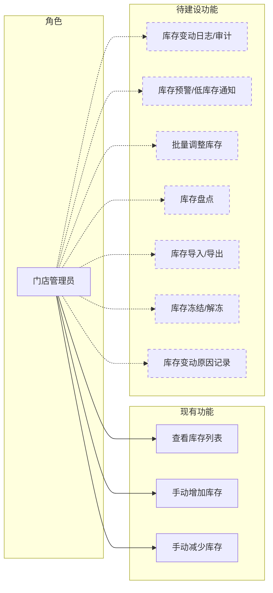
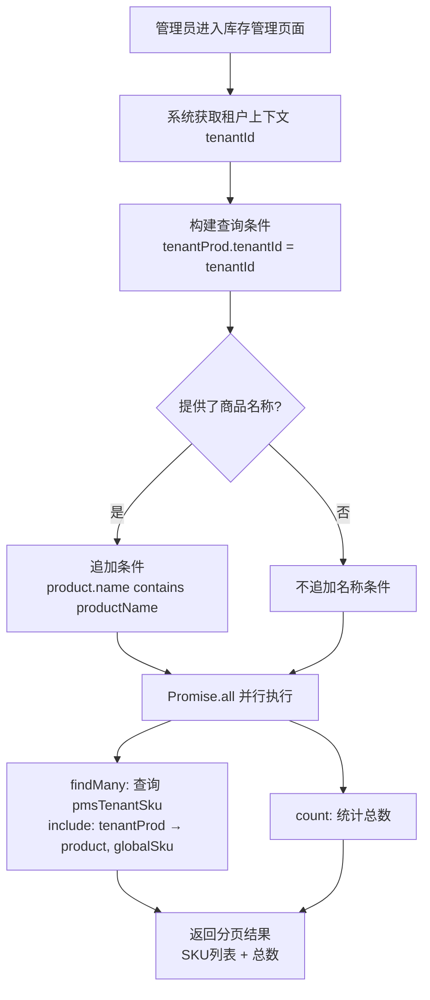
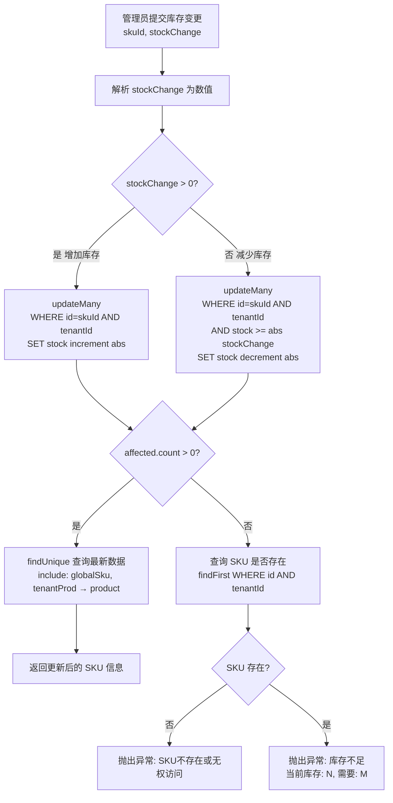

# 门店库存管理模块 — 需求文档

> 版本：1.0
> 日期：2026-02-22
> 模块路径：`src/module/store/stock`
> 状态：现状分析 + 演进规划

---

## 1. 概述

### 1.1 背景

门店库存管理模块为 O2O 多租户平台中的门店管理员提供 SKU 级别的库存水位监控与手动维护能力。模块基于数据库原子操作（`increment`/`decrement`）实现库存变更，通过 `WHERE stock >= N` 条件防止负库存，确保高并发场景下的库存安全。本模块定位为「手动维护」工具，交易流程中的自动库存扣减集成在订单执行生命周期中（`store/order` 模块）。

### 1.2 目标

1. 描述当前门店库存模块的完整功能现状
2. 分析现有逻辑的代码缺陷与架构不足
3. 对标市面主流门店库存管理系统，识别功能差距
4. 提出演进建议和待办事项

### 1.3 范围

| 在范围内                                | 不在范围内                                  |
| --------------------------------------- | ------------------------------------------- |
| 门店 SKU 库存列表查询（按商品名称筛选） | 交易流程自动扣减/回补（属于 `store/order`） |
| 手动增减库存（原子操作）                | 全局商品库存管理（属于 `admin/product`）    |
| 库存不足校验（防负库存）                | 仓储/物流管理                               |
|                                         | 库存预警/低库存通知                         |
|                                         | 库存变动日志/审计                           |

---

## 2. 角色与用例

> 图 1：门店库存管理用例图

> 虚线框为当前未实现、市面主流库存管理系统普遍具备的功能。

---

## 3. 业务流程

### 3.1 库存列表查询流程

> 图 2：库存列表查询活动图

### 3.2 库存更新流程

> 图 3：库存更新活动图

**说明**：库存更新采用数据库原子操作，增加库存使用 `increment`，减少库存使用 `decrement` 并附带 `stock >= N` 条件，由数据库层面保证不会出现负库存。

---

## 4. 状态说明

本模块不涉及独立的状态机。库存为数值型字段（`stock: Int`），变更通过原子操作直接修改，无状态流转。

> 省略状态图原因：库存管理模块的核心操作是数值增减，不存在状态枚举或状态转换逻辑。

---

## 5. 现有功能详述

### 5.1 接口清单

| 接口     | 方法 | 路径                  | 权限          | 说明                                      |
| -------- | ---- | --------------------- | ------------- | ----------------------------------------- |
| 库存列表 | POST | `/store/stock/list`   | ⚠️ 无权限校验 | 分页查询门店 SKU 库存，支持按商品名称筛选 |
| 更新库存 | POST | `/store/stock/update` | ⚠️ 无权限校验 | 原子增减库存，扣减时校验库存充足性        |

### 5.2 并发安全机制

| 机制         | 实现方式                     | 说明                                                                   |
| ------------ | ---------------------------- | ---------------------------------------------------------------------- |
| 原子增减     | `increment` / `decrement`    | 数据库层面原子操作，无竞态风险                                         |
| 防负库存     | `WHERE stock >= abs(change)` | 扣减时在 WHERE 条件中检查，不满足则 `affected.count = 0`               |
| 精确错误提示 | 二次查询区分原因             | `affected.count = 0` 时查询 SKU 是否存在，区分「不存在」和「库存不足」 |

### 5.3 数据模型关系

| 表                 | 说明               | 关键字段                            |
| ------------------ | ------------------ | ----------------------------------- |
| `pmsTenantSku`     | 门店 SKU（核心表） | id, tenantProductId, stock, version |
| `pmsTenantProduct` | 门店商品（关联）   | id, tenantId, productId             |
| `pmsProduct`       | 全局商品（关联）   | productId, name                     |
| `pmsSku`           | 全局 SKU（关联）   | skuId, specValues                   |

---

## 6. 现有逻辑不足分析

### 6.1 代码层面缺陷

| 编号 | 问题                                                     | 严重度 | 详述                                                                                                                                                       |
| ---- | -------------------------------------------------------- | ------ | ---------------------------------------------------------------------------------------------------------------------------------------------------------- |
| D-1  | Controller 端点缺少 `@RequirePermission` 装饰器          | 🟡 P1  | 2 个接口均无权限校验，任何已登录用户均可查看和修改库存。应添加 `store:stock:list` 和 `store:stock:update` 权限标识。                                       |
| D-2  | Controller 缺少 `@ApiBearerAuth('Authorization')` 装饰器 | 🟢 P2  | 与项目其他 Controller 风格不一致，Swagger 文档中不会显示认证要求。                                                                                         |
| D-3  | 库存更新无操作日志（`@Operlog`）                         | 🟡 P1  | 库存变更是敏感操作，当前无任何审计记录。无法追溯谁在何时修改了多少库存，出现库存异常时无法排查。                                                           |
| D-4  | 库存更新无变动原因记录                                   | 🟡 P1  | `UpdateStockDto` 仅包含 `skuId` 和 `stockChange`，无 `reason`（变动原因）字段。无法区分是进货补货、盘点调整还是损耗报废。                                  |
| D-5  | `updateStock` 更新后的 `findUnique` 查询存在竞态窗口     | 🟢 P2  | 原子 `updateMany` 成功后，通过单独的 `findUnique` 查询最新数据返回。两次操作之间数据可能被其他请求修改，返回的 `stock` 值可能不是本次操作后的准确值。      |
| D-6  | 列表查询使用 POST 方法                                   | 🟢 P2  | `getList` 使用 `@Post('list')` 进行列表查询，不符合 RESTful 规范（查询应为 GET）。                                                                         |
| D-7  | Service 直接使用 `PrismaService` 而非 Repository         | 🟢 P2  | 未通过 Repository 层访问租户隔离表 `pmsTenantSku`，与项目分层约定不一致。`store/product` 模块已有 `TenantSkuRepository` 封装了乐观锁和原子库存操作。       |
| D-8  | 单元测试与实际实现不匹配                                 | 🟢 P2  | `stock.service.spec.ts` 中 mock 的方法（`findUnique` + `update`）与实际实现（`updateMany` + `findFirst` + `findUnique`）不一致，测试无法真正覆盖当前逻辑。 |
| D-9  | `stockChange` 未校验为非零值                             | 🟢 P2  | `UpdateStockDto` 中 `stockChange` 仅校验 `@IsNumber()`，允许传入 `0`，导致无意义的数据库操作。                                                             |

### 6.2 架构层面不足

| 编号 | 问题                                                 | 详述                                                                                                                                                        |
| ---- | ---------------------------------------------------- | ----------------------------------------------------------------------------------------------------------------------------------------------------------- |
| A-1  | 无库存变动日志表                                     | 无 `stock_log` 或类似流水表记录每次库存变动的操作人、时间、变动量、变动原因、变动前后值。                                                                   |
| A-2  | 无库存预警机制                                       | 库存降至阈值时无自动提醒，需管理员手动检查。                                                                                                                |
| A-3  | 无批量调整能力                                       | 不支持一次性调整多个 SKU 的库存（如进货入库场景）。                                                                                                         |
| A-4  | 无库存盘点功能                                       | 无法将实际盘点数量与系统库存对比，生成差异报告。                                                                                                            |
| A-5  | 无库存导入/导出                                      | 无法通过 Excel 批量导入库存数据或导出库存报表。                                                                                                             |
| A-6  | 无库存冻结/解冻                                      | 无法冻结部分库存（如预留给特定活动），所有库存均为可售库存。                                                                                                |
| A-7  | 与 `store/product` 模块的 `TenantSkuRepository` 重复 | 库存操作逻辑与 `store/product` 模块中 `TenantSkuRepository` 的 `incrementStock`、`decrementStock`、`updateStockSafely` 方法功能重叠，存在两套库存操作入口。 |

---

## 7. 市面主流门店库存系统对标

### 7.1 功能对比矩阵

| 功能              | 本系统 | 有赞商家后台 | 美团商家版 | Shopify Admin | 差距评估     |
| ----------------- | ------ | ------------ | ---------- | ------------- | ------------ |
| 库存列表查询      | ✅     | ✅           | ✅         | ✅            | 持平         |
| 手动增减库存      | ✅     | ✅           | ✅         | ✅            | 持平         |
| 原子操作防超卖    | ✅     | ✅           | ✅         | ✅            | 持平         |
| 防负库存校验      | ✅     | ✅           | ✅         | ✅            | 持平         |
| 权限控制          | ❌     | ✅           | ✅         | ✅            | 缺失（P1）   |
| 操作审计日志      | ❌     | ✅           | ✅         | ✅            | 缺失（P1）   |
| 变动原因记录      | ❌     | ✅           | ✅         | ✅            | 缺失（P1）   |
| 库存变动流水      | ❌     | ✅           | ✅         | ✅            | 缺失（高优） |
| 库存预警          | ❌     | ✅           | ✅         | ✅            | 缺失（中优） |
| 批量调整          | ❌     | ✅           | ✅         | ✅            | 缺失（中优） |
| 库存盘点          | ❌     | ✅           | ❌         | ✅            | 缺失（低优） |
| 库存导入/导出     | ❌     | ✅           | ✅         | ✅            | 缺失（中优） |
| 库存冻结/解冻     | ❌     | ✅           | ❌         | ✅            | 缺失（低优） |
| 可售/锁定库存分离 | ❌     | ✅           | ✅         | ✅            | 缺失（中优） |

### 7.2 差距总结

本系统在原子操作和防负库存方面实现正确，但功能极度精简，仅覆盖最基础的查询和增减操作。主要差距集中在：

1. 审计缺失：无操作日志、无变动原因、无流水记录，库存异常时无法追溯（P1）
2. 权限缺失：所有接口无 `@RequirePermission`（P1）
3. 运营工具缺失：无批量调整、无导入导出、无盘点功能
4. 库存模型单一：仅有「可用库存」一个维度，无冻结/锁定/预留概念

---

## 8. 验收标准（现有功能）

| 编号  | 验收条件                                                  | 状态             |
| ----- | --------------------------------------------------------- | ---------------- |
| AC-1  | 库存列表按租户隔离，仅展示当前门店的 SKU 库存             | ✅ 已通过        |
| AC-2  | 库存列表支持按商品名称模糊搜索                            | ✅ 已通过        |
| AC-3  | 增加库存使用原子 `increment` 操作                         | ✅ 已通过        |
| AC-4  | 减少库存使用原子 `decrement` 操作，附带 `stock >= N` 条件 | ✅ 已通过        |
| AC-5  | 库存不足时返回明确错误信息（含当前库存和需要量）          | ✅ 已通过        |
| AC-6  | SKU 不存在或无权访问时返回明确错误信息                    | ✅ 已通过        |
| AC-7  | 所有接口有 `@RequirePermission` 权限校验                  | ❌ 未实现（D-1） |
| AC-8  | 库存变更操作有 `@Operlog` 审计日志                        | ❌ 未实现（D-3） |
| AC-9  | 库存变更记录变动原因                                      | ❌ 未实现（D-4） |
| AC-10 | 单元测试与实际实现一致且通过                              | ❌ 未通过（D-8） |

---

## 9. 演进建议与待办

### 9.1 短期（1-2 周）— 修复现有缺陷

| 编号 | 任务                                                              | 对应缺陷 | 预估工时 |
| ---- | ----------------------------------------------------------------- | -------- | -------- |
| T-1  | 添加 `@RequirePermission` 和 `@ApiBearerAuth` 装饰器              | D-1, D-2 | 0.5h     |
| T-2  | 库存更新接口添加 `@Operlog` 装饰器                                | D-3      | 0.5h     |
| T-3  | `UpdateStockDto` 增加 `reason` 字段（变动原因）                   | D-4      | 0.5h     |
| T-4  | `UpdateStockDto` 增加 `stockChange` 非零校验                      | D-9      | 0.1h     |
| T-5  | 修复单元测试使其与实际实现匹配                                    | D-8      | 1h       |
| T-6  | Service 改用 `TenantSkuRepository`，消除与 `store/product` 的重复 | D-7, A-7 | 2h       |

### 9.2 中期（1-2 月）— 补齐核心功能

| 编号 | 任务                                                | 对应差距 | 预估工时 |
| ---- | --------------------------------------------------- | -------- | -------- |
| T-7  | 库存变动流水表（`pms_stock_log`）+ 每次变更自动写入 | A-1      | 2-3d     |
| T-8  | 批量调整库存接口                                    | A-3      | 1-2d     |
| T-9  | 库存预警（阈值配置 + 定时扫描 + 消息通知）          | A-2      | 2-3d     |
| T-10 | 库存导出（Excel）                                   | A-5      | 1-2d     |

### 9.3 长期（3-6 月）— 竞争力建设

| 编号 | 任务                   | 说明                                     |
| ---- | ---------------------- | ---------------------------------------- |
| T-11 | 库存盘点功能           | 实际盘点数 vs 系统库存对比，生成差异报告 |
| T-12 | 库存冻结/解冻          | 支持活动预留库存，分离可售库存和冻结库存 |
| T-13 | 可售/锁定库存分离      | 下单锁定库存 → 支付确认扣减 → 取消释放   |
| T-14 | 库存导入（Excel 批量） | 支持通过 Excel 批量设置库存              |
