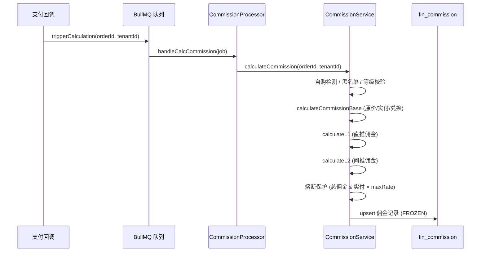
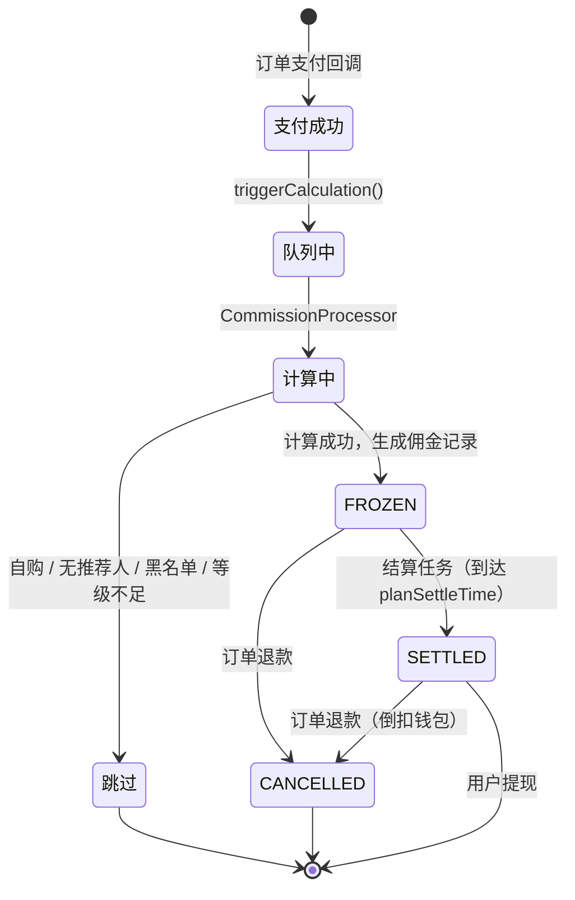

# Store 模块分佣逻辑审计报告

> 审计范围：`apps/backend/src/module/store` + `apps/backend/src/module/finance/commission`
> 审计日期：2026-02-22

---

## 1. 概述

### 1.1 背景

Store 模块是 O2O 平台门店端的核心业务聚集地，分佣逻辑横跨 `store/distribution`（规则配置）、`finance/commission`（核心计算）、`store/finance`（查询展示）、`store/order`（订单触发）四个子模块。本次审计聚焦于分佣链路的逻辑漏洞、数据一致性风险和代码质量问题。

### 1.2 分佣核心链路



---

## 2. 发现的逻辑漏洞

### 🔴 P0 - 严重（资金安全）

#### 漏洞 #1：退款佣金回滚非原子操作

**位置**：`store/order/store-order.service.ts` → `refundOrder()`

```typescript
// 当前代码：退款与佣金取消不在同一事务中
@Transactional()
async refundOrder(orderId, remark, operatorId) {
  await this.orderRepo.update(orderId, { status: OrderStatus.REFUNDED });

  try {
    await this.commissionService.cancelCommissions(orderId); // ← 独立事务
  } catch (error) {
    this.logger.error(...); // 仅记录日志，不回滚订单状态
  }
}
```

**问题**：`refundOrder` 方法虽然标记了 `@Transactional()`，但 `cancelCommissions` 内部的 `rollbackCommission` 也有自己的 `@Transactional()`。如果 `cancelCommissions` 在循环处理多条佣金时中途失败（如第 2 条佣金的钱包扣减失败），会导致：

- 订单状态已变为 REFUNDED
- 部分佣金已取消，部分仍为 SETTLED
- 用户拿到退款的同时保留了部分佣金

**修复建议**：将 `cancelCommissions` 的循环逻辑纳入外层事务，移除 `try-catch` 的静默吞错，改为事务回滚。

---

#### 漏洞 #2：跨店日限额"首笔并发"击穿

**位置**：`finance/commission/commission.service.ts` → `checkDailyLimit()`

```typescript
// FOR UPDATE 锁定的是已有记录，当天首笔时无记录可锁
const result = await this.prisma.$queryRaw`
  SELECT COALESCE(SUM(amount), 0) as total
  FROM fin_commission
  WHERE tenant_id = ${tenantId}
    AND beneficiary_id = ${beneficiaryId}
    AND is_cross_tenant = true
    AND DATE(create_time) = CURDATE()
    AND status != ${CommissionStatus.CANCELLED}
  FOR UPDATE
`;
```

**问题**：当天首笔跨店佣金生成前，`fin_commission` 表中无匹配行，`FOR UPDATE` 无法获取行锁。高并发下多个事务同时读到 `SUM=0`，全部通过限额检查，导致日限额被击穿。

**修复建议**：引入 `fin_daily_quota` 计数器表，每日首次写入时 INSERT 一行（利用唯一约束），后续通过锁定该行实现原子限额控制。

---

#### 漏洞 #3：upsert 幂等导致"静默忽略"错误计算

**位置**：`finance/commission/commission.service.ts` → `calculateCommission()` 第 230 行

```typescript
await this.commissionRepo.upsert({
  where: { orderId_beneficiaryId_level: { ... } },
  create: enrichedRecord,
  update: {}, // ← 若已存在则什么都不做
});
```

**问题**：如果首次计算因配置错误（如 distConfig 缓存过期）生成了 0 元或错误金额的佣金，BullMQ 重试时 `upsert` 的 `update: {}` 会静默跳过，无法修正错误数据。

**修复建议**：增加状态校验，仅当现有记录为 `FROZEN` 且金额为 0 时允许覆盖更新；或引入计算版本号，版本不一致时允许重算。

---

#### 漏洞 #4：钱包余额不足时佣金回滚挂起

**位置**：`finance/wallet/wallet.service.ts` → `deductBalance()`

```typescript
async deductBalance(memberId, amount, relatedId, remark, type) {
  const wallet = await this.walletRepo.updateByMemberId(memberId, {
    balance: { decrement: amount }, // ← 无余额下限校验
    version: { increment: 1 },
  });
  // ...
}
```

**问题**：`deductBalance` 直接执行 `decrement`，无余额下限校验。如果受益人已提现或消费完余额，扣减后余额变为负数。虽然不会抛异常（Prisma 允许负数），但会导致：

- 用户钱包出现负余额
- 无明确的"待回收"标记，运营无法追踪

**影响**：这不是一个阻断性 bug（不会导致退款失败），但会造成财务对账困难。

**修复建议**：在 `deductBalance` 中增加余额检查，余额不足时记录到 `fin_pending_recovery` 待回收台账，在用户下次入账时优先抵扣。

---

### 🟡 P1 - 中等（逻辑缺陷）

#### 漏洞 #5：佣金统计未排除 CANCELLED 状态

**位置**：`store/finance/dashboard.service.ts` → `getCommissionStats()`

```typescript
// todayStats 和 monthStats 未过滤 CANCELLED
const [todayStats, monthStats, pendingStats] = await Promise.all([
  this.commissionRepo.aggregate({
    where: {
      ...baseWhere,
      createTime: { gte: today },
      // ← 缺少 status != CANCELLED 过滤
    },
    _sum: { amount: true },
  }),
  // monthStats 同样缺少
]);
```

**问题**：`todayCommission` 和 `monthCommission` 统计包含了已取消的佣金，导致看板数据虚高。`pendingStats` 正确过滤了 `FROZEN`，但前两个指标未排除 `CANCELLED`。

**修复建议**：在 `todayStats` 和 `monthStats` 的 `where` 条件中增加 `status: { not: CommissionStatus.CANCELLED }`。

---

#### 漏洞 #6：佣金预览接口未使用商品级分佣基数

**位置**：`store/distribution/distribution.service.ts` → `getCommissionPreview()`

```typescript
return Result.ok({
  // ...
  estimatedAmount: 0, // ← 硬编码为 0，未实际计算
  notice,
});
```

**问题**：`CommissionPreviewDto` 定义了 `productIds` 字段，但 Controller 使用 `@Query('tenantId')` 和 `@Query('shareUserId')` 接收参数，完全忽略了商品列表。预估金额始终返回 0，前端无法展示有意义的佣金预估。

**修复建议**：Controller 改用 `@Query() dto: CommissionPreviewDto` 接收完整参数，Service 中根据商品列表查询 SKU 分佣配置并计算预估金额。

---

#### 漏洞 #7：`updatePlanSettleTime` 缺少状态前置校验

**位置**：`finance/commission/commission.service.ts` → `updatePlanSettleTime()`

```typescript
async updatePlanSettleTime(orderId, eventType) {
  const commissions = await this.commissionRepo.findMany({
    where: { orderId, status: 'FROZEN' },
  });
  // 直接覆盖 planSettleTime，无方向性校验
  await this.commissionRepo.updateMany(
    { orderId, status: CommissionStatus.FROZEN },
    { planSettleTime },
  );
}
```

**问题**：结算时间可被反复覆盖。如果用户先确认收货（T+7），然后通过某种方式触发核销事件（T+1），结算时间会从 7 天缩短为 1 天，绕过保护期。

**修复建议**：增加单向约束——新的 `planSettleTime` 必须 ≥ 当前值（只允许推迟，不允许提前），除非由管理员显式操作。

---

#### 漏洞 #8：`verifyService` 未使用 `@Transactional()`

**位置**：`store/order/store-order.service.ts` → `verifyService()`

```typescript
// 缺少 @Transactional() 装饰器
async verifyService(dto: VerifyServiceDto, operatorId: string) {
  await this.orderRepo.update(dto.orderId, { status: OrderStatus.COMPLETED });
  try {
    await this.commissionService.updatePlanSettleTime(dto.orderId, 'VERIFY');
  } catch (error) {
    this.logger.error(...); // 订单已完成但结算时间未更新
  }
}
```

**问题**：订单状态更新和佣金结算时间更新不在同一事务中。如果 `updatePlanSettleTime` 失败，订单已标记为 COMPLETED，但佣金的结算时间仍为初始值（T+14），导致结算延迟。

**修复建议**：添加 `@Transactional()` 装饰器，并移除 `try-catch` 静默处理。

---

### 🟢 P2 - 低（代码质量 / 可维护性）

#### 问题 #9：订单详情中残留调试日志

**位置**：`store/order/store-order.service.ts` → `findOne()` 第 340-380 行

```typescript
if (order.orderSn === '202602031020VJSIA849') {
  this.logger.log(`[订单详情] 订单号: 202602031020VJSIA849, ...`);
  // ... 多处硬编码的调试日志
}
```

**问题**：生产代码中残留了针对特定订单号的调试日志，属于开发遗留。

**修复建议**：删除所有 `orderSn === '202602031020VJSIA849'` 的条件日志块。

---

#### 问题 #10：`ProfitValidator` 仅校验单品利润，未考虑 L1+L2 总佣金

**位置**：`store/product/profit-validator.ts`

**问题**：`ProfitValidator.validate()` 使用 SKU 的 `distRate` 计算单品佣金，但实际分佣时 L1+L2 的总比例可能远高于单品 `distRate`。例如 SKU `distRate=0.15`（15%），但 L1=60%×15%=9%，L2=40%×15%=6%，总佣金=15%，恰好等于 distRate。但如果 C2 全拿场景（L1+L2 都给同一人），且跨店折扣为 100%，则单人佣金=15%，与 distRate 一致。

当前逻辑在 RATIO 模式下是正确的（`distRate` 已经是商品级的分佣比例，L1/L2 是在此基础上再分配），但在 FIXED 模式下，固定金额 × L1 比例 + 固定金额 × L2 比例 = 固定金额 × (L1+L2)，如果 L1+L2=100%，则总佣金=固定金额，与 `ProfitValidator` 的计算一致。

**结论**：当前逻辑在数学上是自洽的，但建议在 `ProfitValidator` 的注释中明确说明这一假设，避免后续维护者误解。

---

#### 问题 #11：`store.module.ts` 未注册 `StoreFinanceModule` 和 `StoreOrderModule`

**位置**：`store/store.module.ts`

```typescript
@Module({
  imports: [
    StockModule,
    StoreProductModule,
    DistributionModule,
    // ← 缺少 StoreFinanceModule 和 StoreOrderModule
  ],
})
export class StoreModule {}
```

**问题**：`StoreFinanceModule` 和 `StoreOrderModule` 未在 `StoreModule` 中注册。这两个模块可能在其他地方（如 AppModule）直接注册，但这破坏了 Store 模块的内聚性，增加了理解和维护成本。

**修复建议**：将 `StoreFinanceModule` 和 `StoreOrderModule` 纳入 `StoreModule.imports`，保持模块树的完整性。

---

#### 问题 #12：`CommissionPreviewDto` 与 Controller 参数不匹配

**位置**：`store/distribution/distribution.controller.ts` vs `dto/commission-preview.dto.ts`

```typescript
// DTO 定义了 productIds
export class CommissionPreviewDto {
  tenantId: string;
  productIds: string[];  // ← 定义了但未使用
  shareUserId?: string;
}

// Controller 使用独立 @Query 参数
@Get('commission/preview')
async getCommissionPreview(
  @Query('tenantId') tenantId: string,
  @Query('shareUserId') shareUserId?: string,  // ← 未使用 DTO
) {}
```

**问题**：DTO 定义与 Controller 签名不一致，`productIds` 字段形同虚设。

---

## 3. 分佣逻辑完整性分析

### 3.1 分佣计算流程状态图



### 3.2 佣金基数计算策略对比

| 策略             | 基数公式                                           | 熔断保护                | 适用场景                 |
| ---------------- | -------------------------------------------------- | ----------------------- | ------------------------ |
| `ORIGINAL_PRICE` | `Σ(item.totalAmount × sku.distRate)`               | 总佣金 ≤ 实付 × maxRate | 高利润商品，平台补贴营销 |
| `ACTUAL_PAID`    | `Σ(item.totalAmount × sku.distRate) × (实付/原价)` | 天然受限于实付金额      | 低利润商品，成本敏感     |
| `ZERO`           | `0`（全部为兑换商品时）                            | 不适用                  | 积分兑换、引流商品       |

### 3.3 L1/L2 分配规则

| 场景                           | L1 受益人                   | L2 受益人               | 说明         |
| ------------------------------ | --------------------------- | ----------------------- | ------------ |
| 临时分享 + 分享人有上级        | shareUserId                 | shareUser.parentId      | 标准二级分佣 |
| 临时分享 + 分享人无上级(C2)    | shareUserId (全拿L1+L2)     | 无                      | C2 全拿场景  |
| 绑定关系 + parentId 有上级     | member.parentId             | member.indirectParentId | 标准二级分佣 |
| 绑定关系 + parentId 无上级(C2) | member.parentId (全拿L1+L2) | 无                      | C2 全拿场景  |
| 自购                           | 无                          | 无                      | 不返佣       |

---

## 4. 修复优先级与建议

| 优先级 | 漏洞                         | 影响                 | 建议修复方式             | 预估工时 |
| ------ | ---------------------------- | -------------------- | ------------------------ | -------- |
| 🔴 P0  | #1 退款佣金回滚非原子        | 资金损失             | 统一事务 + 移除静默catch | 2h       |
| 🔴 P0  | #2 跨店日限额并发击穿        | 超额发放             | 引入计数器表 + 行锁      | 4h       |
| 🔴 P0  | #3 upsert 静默忽略错误       | 佣金计算错误无法修正 | 增加版本号/状态校验      | 2h       |
| 🔴 P0  | #4 钱包负余额无追踪          | 财务对账困难         | 待回收台账 + 自动抵扣    | 4h       |
| 🟡 P1  | #5 统计含已取消佣金          | 看板数据虚高         | 增加 status 过滤         | 0.5h     |
| 🟡 P1  | #6 佣金预览始终返回0         | 功能不可用           | 实现商品级预估计算       | 3h       |
| 🟡 P1  | #7 结算时间可被缩短          | 保护期被绕过         | 单向约束                 | 1h       |
| 🟡 P1  | #8 核销非事务操作            | 状态不一致           | 添加 @Transactional      | 0.5h     |
| 🟢 P2  | #9 残留调试日志              | 代码质量             | 删除                     | 0.5h     |
| 🟢 P2  | #11 模块注册不完整           | 可维护性             | 补充 imports             | 0.5h     |
| 🟢 P2  | #12 DTO 与 Controller 不匹配 | 接口规范             | 统一参数                 | 0.5h     |

---

## 5. 目录结构评估

### 5.1 当前结构

```
store/
├── distribution/   # 分销配置（规则管理）
├── finance/        # 财务查询（看板、佣金列表、流水）
├── order/          # 订单管理（含退款触发佣金回滚）
├── product/        # 商品管理（含利润风控）
├── stock/          # 库存管理
└── store.module.ts # 根模块（缺少 finance 和 order 注册）
```

### 5.2 结构问题

1. **模块注册不完整**：`StoreModule` 仅注册了 `StockModule`、`StoreProductModule`、`DistributionModule`，缺少 `StoreFinanceModule` 和 `StoreOrderModule`。
2. **分佣逻辑分散**：分佣的"配置"在 `store/distribution`，"计算"在 `finance/commission`（全局模块），"查询"在 `store/finance`，"触发"在 `store/order`。这种分散是合理的（关注点分离），但缺少一份统一的分佣流程文档将它们串联起来。
3. **文档冗余**：`apps/backend/docs/` 下有 6+ 份佣金相关文档，部分内容重叠（如 `COMMISSION_QUICK_REFERENCE.md` 和 `COMMISSION_CALCULATION_EXAMPLES.md`），且与代码中的 `.md` 文件（如 `commission.md`、`distribution.md`）存在信息不一致的风险。

### 5.3 建议

- 将 `StoreFinanceModule` 和 `StoreOrderModule` 纳入 `StoreModule.imports`
- 在 `store/` 根目录维护一份 `store.md`（已存在）作为模块总览，确保其与子模块文档保持同步
- 考虑将 `docs/` 下的佣金文档合并精简，减少维护负担
