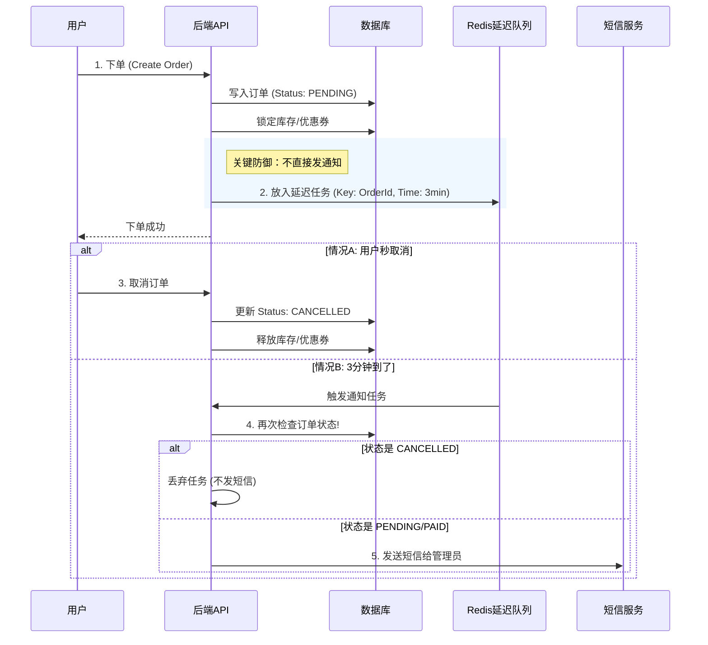

这是一个非常经典的**“分布式系统时序与一致性”**问题，在电商行业被称为 **“秒退/闪退” (Flash Cancellation)** 场景。

这种情况如果处理不好，轻则导致短信费浪费、管理员被骚扰，重则导致库存死锁、超卖、或者账目不平。

针对你描述的从 **购物车 -> 结算 -> 生成订单 -> 通知 -> 秒取消** 的全流程，我为你总结了 **12种** 可能遇到的风险、系统异常及解决方案，涵盖资金、库存、通知、性能和运营五个维度。

---

### 🚨 一、 通知与触达类风险 (Notification Risks)

#### 1. 短信资源浪费与“狼来了”效应

* **场景**：用户下单，系统立即调用阿里云/腾讯云接口发短信给管理员。1秒后用户取消。
* **风险**：
  * **成本**：每一条短信都是钱，恶意刷单会导致短信费爆炸。
  * **运营干扰**：管理员收到“有新订单”，兴冲冲打开后台一看是“已取消”。次数多了，管理员会产生麻痹心理，忽略真正的重要订单。
* **解决方案**：**引入“冷静期”延迟队列**。
  * 下单成功后，不立即发短信。
  * 将发送任务放入 Redis 延迟队列（Delay Queue），延迟 **3-5分钟** 执行。
  * 任务执行前，**再次检查订单状态**。如果状态是 `CANCELLED`，直接丢弃任务，不发短信。

#### 2. 通知时序错乱 (Race Condition)

* **场景**：订单创建消息（A）和订单取消消息（B）几乎同时发出。由于网络波动，B 比 A 先到达通知服务。
* **风险**：管理员先收到“订单已取消”，过了一会儿又收到“您有新订单”。管理员会以为又下了一单，去后台查却查不到，以为系统出Bug。
* **解决方案**：**逻辑时钟或状态机校验**。
  * 通知服务处理消息时，检查订单的 `update_time` 或版本号。
  * 发送“新订单”通知前，强制查询一次数据库当前状态。

#### 3. 消息队列积压导致延迟通知

* **场景**：大促期间下单量大，MQ 堵塞。用户下单 -> 秒取消。10分钟后 MQ 里的“下单通知”才被消费。
* **风险**：订单早就取消了，管理员却在 10 分钟后收到“新订单”短信，造成严重的信息滞后。
* **解决方案**：**消息有效期 (TTL)**。
  * 设置通知类消息的有效期（如 5 分钟）。
  * 消费者拿到消息时，判断 `当前时间 - 消息产生时间`，如果超时太久且订单非“进行中”，直接丢弃。

---

### 📦 二、 库存与营销类风险 (Inventory & Marketing Risks)

#### 4. 幽灵库存 (Phantom Inventory / Deadlock)

* **场景**：下单锁定库存 -> 用户秒取消 -> 触发释放库存。
* **风险**：
  * 如果“取消逻辑”执行失败（如数据库死锁、网络超时），库存没回滚。
  * 结果：这件商品没人买，但库存显示 0，导致无法售卖。
* **解决方案**：**库存对账 + 超时释放兜底**。
  * Redis 锁库存设置过期时间（如 15分钟）。
  * 取消订单事务中，必须包含“归还库存”的逻辑，且需保证**幂等性**（重试多次不会导致库存增加多次）。

#### 5. 优惠券“吞没”或“无限刷”

* **场景**：用户用了一张“满100减50”的券下单，然后秒取消。
* **风险**：
  * **吞没**：系统没把券退回给用户，用户投诉。
  * **无限刷**：系统退券逻辑有 Bug，或者还没扣券就退券了，导致用户手里变出多张券。
* **解决方案**：**事务一致性**。
  * 下单扣券和生成订单在同一个事务。
  * 取消订单和退还优惠券在同一个事务。

#### 6. 营销归因数据污染

* **场景**：分销员 D 分享了商品。用户下单（Redis 记了一笔业绩），然后秒取消。
* **风险**：分销员的“预估收益”增加了，但实际没成交。如果系统没有扣减逻辑，分销员会通过“刷单+退单”来骗取等级或奖励。
* **解决方案**：**业绩状态同步**。
  * 分销流水必须有 `PENDING` (待结算) 和 `INVALID` (已失效) 状态。
  * 取消订单时，同步将分销流水置为 `INVALID`。

---

### 💳 三、 支付与资金类风险 (Payment Risks)

#### 7. 支付回调的“亡灵支付”

* **场景**：用户下单 -> 点击取消订单（系统置为已取消）-> 但用户在微信支付页面还没关，手快输入密码支付成功了。
* **风险**：**订单状态是“已取消”，但钱收进来了**。财务对账不平，用户投诉不发货。
* **解决方案**：**支付回调防御**。
  * 当微信/支付宝回调到达时，检查订单状态。
  * 如果状态是 `CANCELLED`，系统自动触发 **原路退款**，并记录异常日志。
  * 或者：取消订单时，调用微信“关闭订单”接口，阻止用户继续支付（但有延迟）。

#### 8. 拆单后的部分取消逻辑混乱

* **场景**：用户买了“实物+服务”。系统拆成了子单 A 和 B。用户在总单层面点了取消。
* **风险**：子单 A 取消了，子单 B 因为网络原因没取消成功，导致技师上门了，或者仓库发货了。
* **解决方案**：**分布式事务 (Saga 模式)**。
  * 总单取消是“发令枪”。
  * 必须确保所有子单要么全部取消，要么进入“人工介入”状态，不能有中间态。

---

### 💻 四、 系统与性能类风险 (System Risks)

#### 9. 数据库“写扩散”风暴

* **场景**：恶意用户利用脚本，每秒下单 10 次并秒取消 10 次。
* **风险**：
  * 数据库产生大量 Insert 和 Update 操作，I/O 飙升。
  * 产生了大量无效的 `Order` 垃圾数据，污染报表，拖慢查询。
* **解决方案**：**下单限流 + 验证码**。
  * 同一个用户 ID，每分钟只能下单 5 次。
  * 连续取消 3 次后，下次下单弹出滑块验证码。

#### 10. 缓存穿透与数据不一致

* **场景**：订单创建后写入 Redis 缓存。取消时直接改了数据库，忘了删/改缓存。
* **风险**：用户在列表页看到订单是“待支付”，点进去详情页是“已取消”，体验极差。
* **解决方案**：**Cache Aside Pattern**。
  * 更新数据库状态为 Cancelled 后，**必须删除** 对应的 Redis 缓存，强制下次查库。

---

### 👮 五、 运营与操作类风险 (Operational Risks)

#### 11. O2O 自动派单的“假动作”

* **场景**：系统配置了“自动派单”。订单生成 -> 系统自动指派给李师傅 -> 只有李师傅收到了短信/App推送 -> 用户秒取消。
* **风险**：李师傅刚出门准备去干活，发现单没了。由于李师傅是被动接单，这会引起极大的劳动者不满和投诉。
* **解决方案**：**派单冷静期**。
  * 自动派单逻辑同样延迟 1-2 分钟执行。
  * 或者发送“新订单待接”通知时，明确标注“请在App确认状态”。

#### 12. 统计报表失真 (GMV vs GTV)

* **场景**：老板看大屏，“今日下单金额”很高，但“实际成交”很低。
* **风险**：秒退订单如果被计入 GMV (Gross Merchandise Volume)，会误导经营决策。
* **解决方案**：**数仓清洗**。
  * 统计逻辑区分 `下单金额` 和 `支付金额`。
  * 对于秒退订单，在风控报表中单独列出，分析是否为刷单行为。

---

### 🛡️ 终极防御架构：基于“延迟队列”的解决方案

为了预防上述大部分问题，后端应采用如下的标准处理流程：

**总结核心预防手段：**

1. **Delay (延迟)**：通知、派单、结算全部滞后 2-5 分钟处理。
2. **Double Check (双重检查)**：任何触发外部动作（发短信、打款、发货）前，必须回查数据库最新状态。
3. **Idempotency (幂等)**：保证取消操作执行 100 次，结果和执行 1 次一样（不会退 100 次库存）。
