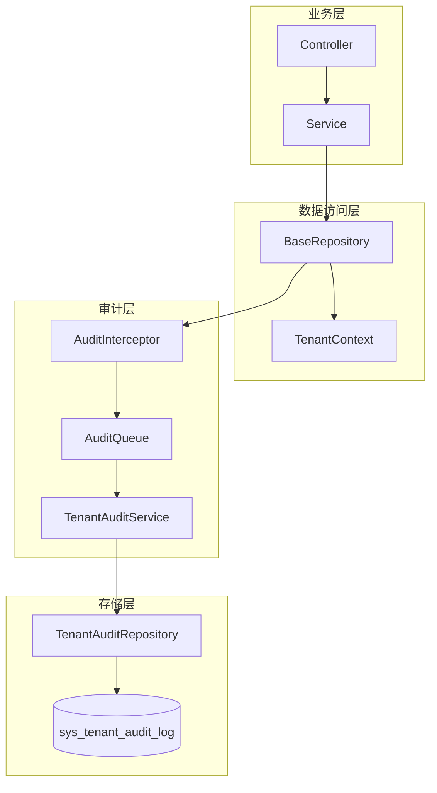
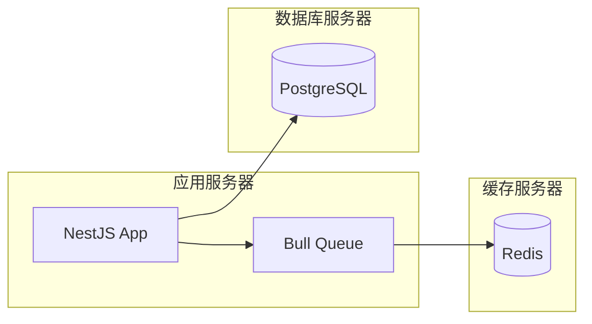
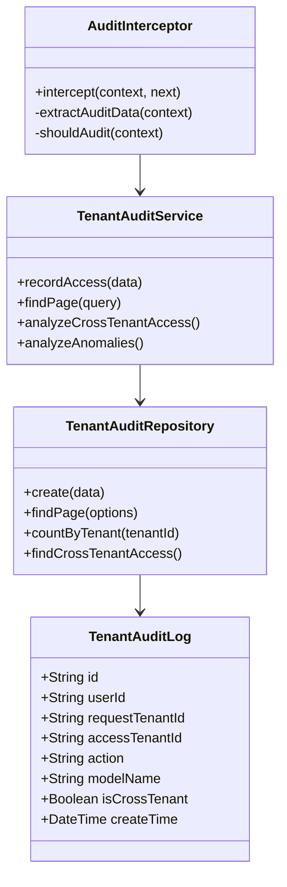
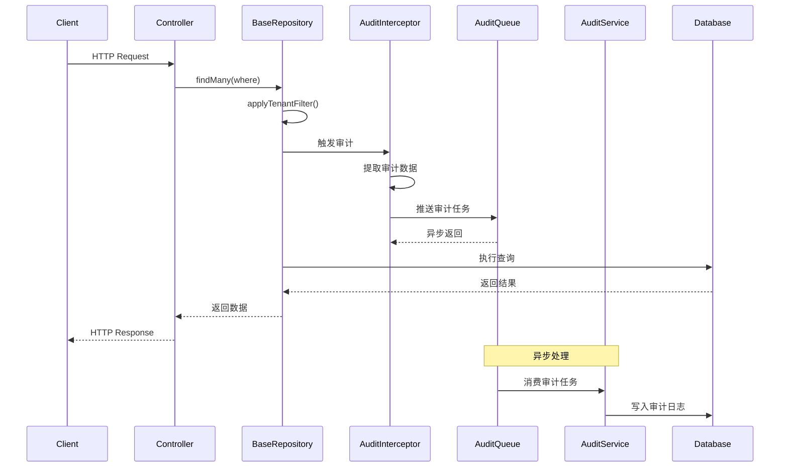
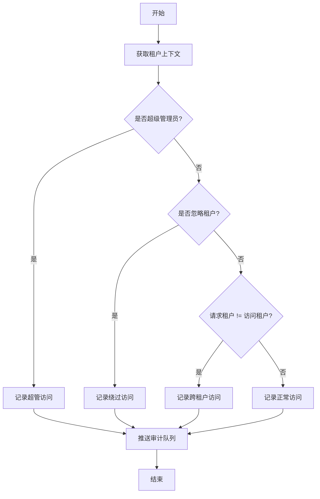

# 租户访问审计日志 - 设计文档

> **编写日期**: 2026-02-23  
> **文档版本**: 1.0.0  
> **设计目标**: 提供完整的租户访问审计能力,记录所有租户数据访问行为,识别异常访问模式

---

## 1. 概述

### 1.1 设计背景

当前系统采用多租户架构,通过 `TenantContext` 和 `BaseRepository` 实现租户隔离。但存在以下安全风险:

- 超级管理员访问无审计记录
- `isIgnoreTenant` 绕过租户过滤无日志
- 跨租户访问行为无法追溯
- 异常访问模式无法及时发现

### 1.2 设计目标

- 记录所有租户数据访问行为
- 识别跨租户访问和权限绕过
- 提供审计日志查询和分析接口
- 支持异常访问告警

### 1.3 设计约束

- 性能影响 < 5ms (P99)
- 日志存储支持归档
- 不影响现有业务逻辑
- 支持异步写入

---

## 2. 架构设计

### 2.1 组件图



### 2.2 部署图



---

## 3. 数据模型设计

### 3.1 审计日志表结构

```prisma
model SysTenantAuditLog {
  id              String   @id @default(uuid())

  // 访问主体
  userId          String?  @map("user_id")
  userName        String?  @map("user_name") @db.VarChar(50)
  userType        String   @map("user_type") @db.VarChar(20)

  // 租户信息
  requestTenantId String?  @map("request_tenant_id") @db.VarChar(20)
  accessTenantId  String?  @map("access_tenant_id") @db.VarChar(20)

  // 访问行为
  action          String   @map("action") @db.VarChar(50)
  modelName       String   @map("model_name") @db.VarChar(100)
  operation       String   @map("operation") @db.VarChar(20)

  // 访问特征
  isSuperTenant   Boolean  @default(false) @map("is_super_tenant")
  isIgnoreTenant  Boolean  @default(false) @map("is_ignore_tenant")
  isCrossTenant   Boolean  @default(false) @map("is_cross_tenant")

  // 请求信息
  ip              String?  @map("ip") @db.VarChar(50)
  userAgent       String?  @map("user_agent") @db.VarChar(500)
  requestPath     String?  @map("request_path") @db.VarChar(500)
  requestMethod   String?  @map("request_method") @db.VarChar(10)

  // 审计元数据
  traceId         String?  @map("trace_id") @db.VarChar(100)
  duration        Int?     @map("duration")
  status          String   @map("status") @db.VarChar(20)
  errorMessage    String?  @map("error_message") @db.Text

  // 时间戳
  createTime      DateTime @default(now()) @map("create_time")

  @@index([requestTenantId, createTime])
  @@index([accessTenantId, createTime])
  @@index([userId, createTime])
  @@index([isCrossTenant, createTime])
  @@index([status, createTime])
  @@index([traceId])
  @@map("sys_tenant_audit_log")
}
```

### 3.2 类图



---

## 4. 核心流程设计

### 4.1 审计日志记录时序图



### 4.2 跨租户访问检测流程



---

## 5. 接口设计

### 5.1 审计日志查询接口

**路径**: `GET /admin/system/tenant-audit/list`

**请求参数**:

```typescript
class ListTenantAuditDto extends PageQueryDto {
  userId?: string;
  requestTenantId?: string;
  accessTenantId?: string;
  isCrossTenant?: boolean;
  startTime?: Date;
  endTime?: Date;
  modelName?: string;
  operation?: string;
}
```

**响应**:

```typescript
{
  rows: TenantAuditLog[];
  total: number;
  pageNum: number;
  pageSize: number;
}
```

### 5.2 跨租户访问统计接口

**路径**: `GET /admin/system/tenant-audit/cross-tenant-stats`

**响应**:

```typescript
{
  totalCount: number;
  todayCount: number;
  topUsers: Array<{
    userId: string;
    userName: string;
    count: number;
  }>;
  topModels: Array<{
    modelName: string;
    count: number;
  }>;
}
```

### 5.3 异常访问分析接口

**路径**: `GET /admin/system/tenant-audit/anomalies`

**响应**:

```typescript
{
  suspiciousAccess: Array<{
    userId: string;
    pattern: string;
    severity: 'low' | 'medium' | 'high';
    description: string;
  }>;
}
```

---

## 6. 性能优化设计

### 6.1 异步写入策略

- 使用 Bull Queue 异步写入审计日志
- 批量写入优化 (每 100 条或 5 秒)
- 写入失败重试机制 (最多 3 次)

### 6.2 索引优化

```sql
-- 租户 + 时间范围查询
CREATE INDEX idx_tenant_time ON sys_tenant_audit_log(request_tenant_id, create_time);
CREATE INDEX idx_access_tenant_time ON sys_tenant_audit_log(access_tenant_id, create_time);

-- 跨租户访问查询
CREATE INDEX idx_cross_tenant ON sys_tenant_audit_log(is_cross_tenant, create_time);

-- 用户行为分析
CREATE INDEX idx_user_time ON sys_tenant_audit_log(user_id, create_time);

-- 链路追踪
CREATE INDEX idx_trace_id ON sys_tenant_audit_log(trace_id);
```

### 6.3 数据归档策略

- 保留最近 90 天热数据
- 90 天以上数据归档到 `sys_tenant_audit_log_archive`
- 归档数据保留 1 年
- 定时任务每天凌晨 2 点执行归档

---

## 7. 安全设计

### 7.1 权限控制

- 审计日志查询需要 `system:tenant-audit:list` 权限
- 仅超级管理员可查看所有租户审计日志
- 普通管理员仅可查看本租户审计日志

### 7.2 敏感信息脱敏

- IP 地址脱敏: `192.168.1.100` -> `192.168.*.*`
- User Agent 截断: 最多保留 500 字符
- 错误信息过滤: 移除堆栈信息和内部路径

### 7.3 告警机制

触发告警的场景:

- 单用户 1 小时内跨租户访问 > 100 次
- 单租户 1 小时内被跨租户访问 > 500 次
- 非超管用户使用 `isIgnoreTenant` 绕过
- 审计日志写入失败率 > 1%

---

## 8. 监控指标

### 8.1 业务指标

- 审计日志写入 QPS
- 跨租户访问次数 (按小时)
- 异常访问次数 (按小时)
- 审计日志查询 QPS

### 8.2 性能指标

- 审计拦截器耗时 (P99 < 5ms)
- 审计队列堆积数量
- 审计日志写入延迟 (P99 < 100ms)
- 数据库写入 TPS

---

## 9. 实施计划

### 9.1 第一阶段: 基础设施 (1 天)

- [ ] 创建审计日志表
- [ ] 实现 TenantAuditRepository
- [ ] 实现 TenantAuditService
- [ ] 配置 Bull Queue

### 9.2 第二阶段: 审计拦截 (0.5 天)

- [ ] 实现 AuditInterceptor
- [ ] 在 BaseRepository 中集成审计
- [ ] 测试审计日志记录

### 9.3 第三阶段: 查询分析 (0.5 天)

- [ ] 实现审计日志查询接口
- [ ] 实现跨租户访问统计
- [ ] 实现异常访问分析

### 9.4 第四阶段: 优化完善 (可选)

- [ ] 数据归档定时任务
- [ ] 告警机制
- [ ] 监控大盘

---

## 10. 测试计划

### 10.1 单元测试

- TenantAuditService 方法测试
- AuditInterceptor 逻辑测试
- 跨租户检测逻辑测试

### 10.2 集成测试

- 审计日志完整流程测试
- 异步队列写入测试
- 查询接口测试

### 10.3 性能测试

- 审计拦截器性能测试 (目标 P99 < 5ms)
- 高并发写入测试 (目标 1000 TPS)
- 查询性能测试 (目标 P99 < 200ms)

---

## 11. 风险评估

| 风险             | 可能性 | 影响 | 缓解措施            |
| ---------------- | ------ | ---- | ------------------- |
| 审计日志写入失败 | 中     | 高   | 重试机制 + 降级策略 |
| 性能影响业务     | 低     | 高   | 异步写入 + 性能监控 |
| 审计日志存储爆炸 | 高     | 中   | 数据归档 + 定期清理 |
| 队列堆积         | 中     | 中   | 队列监控 + 自动扩容 |

---

**文档版本**: 1.0.0  
**最后更新**: 2026-02-23  
**下一步**: 开始实施第一阶段 - 基础设施搭建
